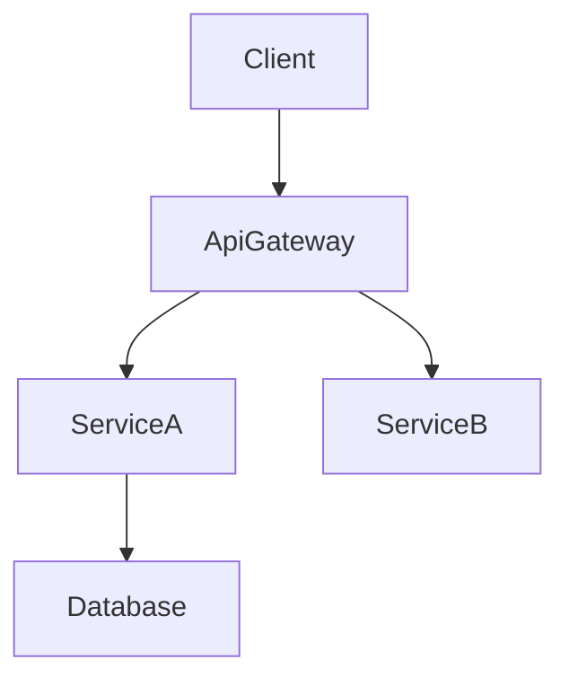

# Technical Design Rules and Principles

## Core Design Principles

### 0. Boundary First
- **Boundary is mandatory; owner is optional**
- A design is not ready when it explains components but leaves responsibility seams ambiguous
- Define what the spec owns before elaborating how it works
- Explicitly record what is out of boundary
- Do not leak downstream-specific behavior or assumptions into upstream boundaries

### 1. Type Safety is Mandatory
- **NEVER** use `any` type in TypeScript interfaces
- Define explicit types for all parameters and returns
- Use discriminated unions for error handling
- Specify generic constraints clearly

### 2. Design vs Implementation
- **Focus on WHAT, not HOW**
- Define interfaces and contracts, not code
- Specify behavior through pre/post conditions
- Document architectural decisions, not algorithms

### 3. Visual Communication
- **Simple features**: Basic component diagram or none
- **Medium complexity**: Architecture + data flow
- **High complexity**: Multiple diagrams (architecture, sequence, state)
- **Always pure Mermaid**: No styling, just structure

### 4. Component Design Rules
- **Single Responsibility**: One clear purpose per component
- **Clear Boundaries**: Explicit domain ownership
- **Boundary First**: Before detailing components, state the responsibility boundary this design commits to in `## 作るものと作らないもの`, `## 使う既存の仕組み`, and `## 設計を見直すきっかけ`
- **Dependency Direction**: Follow architectural layers
- **Interface Segregation**: Minimal, focused interfaces
- **Team-safe Interfaces**: Design boundaries that allow parallel implementation without merge conflicts
- **No Hidden Shared Ownership**: If two areas appear to co-own the same behavior or data, the design is incomplete
- **Research Traceability**: Record boundary decisions and rationale in `research.md`

### 5. Data Modeling Standards
- **Domain First**: Start with business concepts
- **Consistency Boundaries**: Clear aggregate roots
- **Normalization**: Balance between performance and integrity
- **Evolution**: Plan for schema changes

### 6. Error Handling Philosophy
- **Fail Fast**: Validate early and clearly
- **Graceful Degradation**: Partial functionality over complete failure
- **User Context**: Actionable error messages
- **Observability**: Comprehensive logging and monitoring

### 7. Integration Patterns
- **Loose Coupling**: Minimize dependencies
- **Contract First**: Define interfaces before implementation
- **Versioning**: Plan for API evolution
- **Idempotency**: Design for retry safety
- **Contract Visibility**: Surface API and event contracts in design.md while linking extended details from `research.md`

### 8. Dependency Direction
- **Define and enforce the dependency direction** in the `## 全体の構成` section of design.md (e.g., Types → Config → Repository → Service → Runtime → UI)
- Each layer imports only from layers to its left — never upward
- This constraint is not a suggestion; implementation and review should treat violations as errors
- When `## ファイルの構成` maps files to components, the dependency direction determines which imports are allowed

## Documentation Standards

### Language and Tone
- **Declarative**: "The system authenticates users" not "The system should authenticate"
- **Precise**: Specific technical terms over vague descriptions
- **Concise**: Essential information only
- **Formal**: Professional technical writing

### Structure Requirements
- **Hierarchical**: Clear section organization
- **Traceable**: Requirements to components mapping
- **Complete**: All aspects covered for implementation
- **Consistent**: Uniform terminology throughout
- **Focused**: Keep design.md centered on architecture and contracts; move investigation logs and lengthy comparisons to `research.md`

## Section Authoring Guidance

### Global Ordering
- design.md の雛形(`.kiro/settings/templates/specs/design.md`)の節の並びと、`.kiro/settings/rules/spec-writing.md` の design.md の書き方の節に従う(概要 → 作るものと作らないもの → 使う既存の仕組み → 設計を見直すきっかけ → プロジェクトの決まりを守っているか → 全体の構成 → ファイルの構成 → 処理の流れ → 部品 → the sections that apply)
- design.md の雛形の見出しを保ち、雛形の注記に従う(a section the template marks as optional, or a boundary section that does not apply, is omitted with its heading; a section not in the template may be added before `## 移行`)
- Within each section, follow **Summary → Scope → Decisions → Impacts/Risks** so reviewers can scan consistently.

### Requirement IDs
- Reference requirements as `2.1, 2.3` without prefixes (no “要件2.1”).
- All requirements MUST have numeric IDs. If a requirement lacks a numeric ID, stop and fix `requirements.md` before continuing.
- Use `N.M`-style numeric IDs where `N` is the top-level requirement number from requirements.md (for example, 要件1 → 1.1, 1.2; 要件2 → 2.1, 2.2).
- Every component and task must reference the same canonical numeric ID. There is no traceability table; the 対応する要件 line of each component carries the IDs.

### 「使う技術」の欄(`## 全体の構成` の中)
- Include ONLY layers impacted by this feature (frontend, backend, data, messaging, infra).
- For each layer specify tool/library + version + the role it plays; push extended rationale, comparisons, or benchmarks to `research.md`.
- When extending an existing system, highlight deviations from the current stack and list new dependencies.

### `## 処理の流れ`
- Add diagrams only when they clarify behavior:  
  - **Sequence** for multi-step interactions  
  - **Process/State** for branching rules or lifecycle  
  - **Data/Event** for pipelines or async patterns
- Always use pure Mermaid. If no complex flow exists, omit the entire section.

### 対応する要件の行(`## 部品` の各部品)
- `.kiro/settings/rules/spec-writing.md` の見出しと目印の一覧と、文の書き方の節の「対応の行だけは要件の番号で書く」に従う(there is no traceability table; each component's 「対応する要件」 line lists the numeric IDs).
- Re-check this mapping whenever requirements or components change to avoid drift.

### `## 部品` Authoring
- `## 作るものと作らないもの`, `## 使う既存の仕組み`, and `## 設計を見直すきっかけ` should already make the ownership seam explicit before this section begins.
- Group components by domain/layer and provide one block per component.
- design.md の雛形(`.kiro/settings/templates/specs/design.md`)の部品の節と、`.kiro/settings/rules/spec-writing.md` の design.md の書き方の節に従う(no summary table and no P0/P1/P2 labels; each component has a heading, a 対応する要件 line, and the fields 役割 / 権限 / いつ動くか / 使う部品 / 呼び出し方 / 状態の持ち方 / 失敗したとき that apply, and 使う部品 says in sentences what each dependency is used for).
- Summaries of external dependency research stay here; detailed investigation (API signatures, rate limits, migration notes) belongs in `research.md`.
- design.md must remain a self-contained reviewer artifact. Reference `research.md` only for background, and restate any conclusions or decisions here.
- design.md の雛形の部品の節に従う(there are no contract checkboxes; write the 呼び出し方 field only with the contracts that apply, and omit fields that do not apply).
- Service interfaces must declare method signatures, inputs/outputs, and error envelopes. API/Event/Batch contracts require schema tables or bullet lists covering trigger, payload, delivery, idempotency.
- Write the rollout and migration steps in `## 移行`, failure tracking and monitoring across components in `## 失敗したときの扱い`, and each component's own failure handling in its 失敗したとき field. Record unresolved decisions and risks in the `## Risks & Mitigations` section of `research.md`.
- Detail density rules:
  - **Full block**: components introducing new boundaries (logic hooks, shared services, external integrations, data layers).
  - **役割 only**: presentational/UI components with no new boundaries write only the 役割 field (per the template note).
- Do not add fields beyond the template's component fields.
- Prefer lists or inline descriptors for short data (dependencies, contract selections). Use tables only when comparing multiple items.

### Shared Interfaces & Props
- Define a base interface (e.g., `BaseUIPanelProps`) for recurring UI components and extend it per component to capture only the deltas.
- Hooks, utilities, and integration adapters that introduce new contracts should still include full TypeScript signatures.
- When reusing a base contract, reference it explicitly (e.g., “Extends `BaseUIPanelProps` with `onSubmitAnswer` callback”) instead of duplicating the code block.

### `## データの形`
- Write only the viewpoints of the template's `## データの形` that apply to this feature: ドメインのモデル, 論理的なデータの形, 物理的なデータの形, and やり取りするデータ.
- The ドメインのモデル viewpoint covers aggregates, entities, value objects, domain events, and invariants. Add Mermaid diagrams only when relationships are non-trivial.
- The 論理的なデータの形 and 物理的なデータの形 viewpoints articulate structure, indexing, sharding, and storage-specific considerations (event store, KV/wide-column) relevant to the change.
- The やり取りするデータ viewpoint documents API payloads, event schemas, and cross-service synchronization patterns when the feature crosses boundaries.
- Lengthy type definitions or vendor-specific option objects go to `research.md` (its `## References`), not to a separate section in design.md. Investigation notes stay in `research.md`. All decisions must still appear in the main sections so design.md stands alone.

### `## 失敗したときの扱い`, `## テストの方針`, `## 安全`, `## 性能`
- Record only feature-specific decisions or deviations. Link or reference organization-wide standards (steering) for baseline practices instead of restating them.

### Diagram & Text Deduplication
- Do not restate diagram content verbatim in prose. Use the text to highlight key decisions, trade-offs, or impacts that are not obvious from the visual.
- When a decision is fully captured in the diagram annotations, a short “Key Decisions” bullet is sufficient.

### General Deduplication
- Avoid repeating the same information across `## 概要`, `## 全体の構成`, and `## 部品`. Reference earlier sections when context is identical.
- If a requirement/component relationship is captured in the 対応する要件 line, do not rewrite it elsewhere unless extra nuance is added.

## Diagram Guidelines

### When to include a diagram
- **Architecture**: Use a structural diagram when 3+ components or external systems interact.
- **Sequence**: Draw a sequence diagram when calls/handshakes span multiple steps.
- **State / Flow**: Capture complex state machines or business flows in a dedicated diagram.
- **ER**: Provide an entity-relationship diagram for non-trivial data models.
- **Skip**: Minor one-component changes generally do not need diagrams.

### Mermaid requirements

- **Plain Mermaid only** – avoid custom styling or unsupported syntax.
- **Node IDs** – alphanumeric plus underscores only (e.g., `Client`, `ServiceA`). Do not use `@`, `/`, or leading `-`.
- **Labels** – simple words. Do not embed parentheses `()`, square brackets `[]`, quotes `"`, or slashes `/`.
  - ❌ `DnD[@dnd-kit/core]` → invalid ID (`@`).
  - ❌ `UI[KanbanBoard(React)]` → invalid label (`()`).
  - ✅ `DndKit[dnd-kit core]` → use plain text in labels, keep technology details in the accompanying description.
  - ℹ️ Mermaid strict-mode will otherwise fail with errors like `Expecting 'SQE' ... got 'PS'`; remove punctuation from labels before rendering.
- **Edges** – show data or control flow direction.
- **Groups** – using Mermaid subgraphs to cluster related components is allowed; use it sparingly for clarity.

## Quality Metrics
### Design Completeness Checklist
- All requirements addressed
- No implementation details leaked
- Clear component boundaries
- Explicit error handling
- Comprehensive test strategy
- Security considered
- Performance targets defined
- Migration path clear (if applicable)

### Common Anti-patterns to Avoid
❌ Mixing design with implementation
❌ Vague interface definitions
❌ Missing error scenarios
❌ Ignored non-functional requirements
❌ Overcomplicated architectures
❌ Tight coupling between components
❌ Missing data consistency strategy
❌ Incomplete dependency analysis
