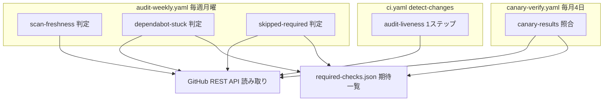

# Design Document — audit-automation

## Overview

**Purpose**: 人間が定期的に画面を開いて行っていた監査(定期スキャンの稼働確認・Dependabot滞留・カナリア点検)と、新規のスキップ検知を、リポジトリ内のワークフローによる読み取り専用の自動判定に置き換える。逸脱はワークフローの失敗としてのみ現れ、通知はGitHub既定の失敗通知に乗る。

**Users**: リポジトリ所有者(監査者)。定期作業が「失敗通知が来たときだけ対応する」イベント駆動に変わる。

**Impact**: `.github/` にワークフロー2本・判定スクリプト4本・期待一覧1ファイルを追加し、`ci.yaml` に1ステップを追加する。既存のワークフロー・ゲートの動作は変更しない。

### Goals
- 週次監査(週次6・週次8)と月次1(カナリア点検)の判定を自動化する
- 必須チェックがスキップで通ったPRを検知する(必須チェックの期待一覧をリポジトリ内に持つ)
- 監査自体の死活を、通常のPRのCIが検知する
- 追加費用ゼロ(AI呼び出し0回・外部サービスなし・追加ランナーは週次/月次の軽量ジョブのみ)

### Non-Goals
- 逸脱の自動修正・Dependabotへの操作・カナリアPRのclose(すべてIssue #310で不採用が確定)
- 段階4(文書削減の残り)・段階5(メトリクス記録)
- 月次4のTRIVY_VERSION 2本一致チェック(Issue判定表では「一部のみ自動化」だが、承認済み要件の範囲外。段階4/5と同時期の小PRとして別途扱う)
- チェック失敗以外のPR滞留(緑のまま停止・ブランチ更新失敗・衝突・アラートあるのにPR無し)の検知

## Boundary Commitments

### This Spec Owns
- 監査判定ワークフロー2本: `audit-weekly.yaml` / `canary-verify.yaml`(判定と報告のみ)
- 必須チェックの期待一覧 `.github/audit/required-checks.json` とそのスキーマ
- 判定スクリプト4本とその自動テスト
- `ci.yaml` の死活確認1ステップ(detect-changes ジョブ内)

### Out of Boundary
- カナリアPRの生成(既存 `canary.yaml` / `create-canary-prs.sh` が所有。照合側は読むだけ)
- 定期スキャンの実行(既存 `container-scan-scheduled.yaml` が所有)
- GitHub ruleset の必須チェック設定そのもの(期待一覧は「写し」であり、正はruleset。不一致は赤で報告するだけで同期はしない)
- 監査手順.md の節の削除(段階4)。ただし本specのマージ後にどの節が削除可能になるかは本designの末尾に列挙する

### Allowed Dependencies
- GitHub REST API の読み取り(actions runs / pulls / check-runs / rules)。書き込みAPIは使わない
- 既存の検査スクリプトの規約(bash + gh + jq、テスト同梱、ワークフロー内で自テスト実行後に本判定)
- `GITHUB_TOKEN`(permissions は read 系のみ)。secrets は使わない

### Revalidation Triggers
- カナリアの種別・命名規則・生成cronの変更(照合スクリプトの定数が追随必要)
- rulesetの必須チェックの追加・削除(期待一覧の更新が必要。怠ると週次が赤で知らせる)
- 定期スキャンのワークフローファイル名・頻度の変更(8日しきい値の前提が崩れる)
- ci.yaml の detect-changes ジョブの廃止・改名(死活ステップの宿主)

## KeirekiPro Compliance Check (必須)

- [x] **backend層配置**: N/A(backendコードの変更なし)
- [x] **frontend境界**: N/A(frontendコードの変更なし)
- [x] **状態管理**: N/A
- [x] **DBスキーマ**: N/A(マイグレーションなし)
- [x] **依存追加**: 新規ライブラリなし(bash / gh / jq はランナー同梱の既存前提)
- [x] **ゲート設定**: **本設計はゲート設定の変更を必要とする。** `.github/workflows/`・`.github/scripts/`・`.github/audit/` の追加と `ci.yaml` の1ステップ追加が成果物そのものであり、全PRがCODEOWNERSによる所有者承認を経る。実装は所有者の明示指示の下でbotがブランチを作成し、所有者がApproveする(2026-09-03のPR #326以降の実績運用)
- [x] **前提機能の利用可否**: 使用APIはすべて2026-09-03〜06に本リポジトリで実測済み(workflow runs / check-runs / rules for a branch。公開リポジトリ・個人アカウントで追加要件なし)。rulesetの読み取りは `GITHUB_TOKEN` で可能なことを実装タスク内で最初に確認する(不可なら判定不能=赤として設計どおり動く)

## Architecture



- 選択パターン: 既存の「検査スクリプト+同梱テスト+ワークフロー」の反復(9本の実績)。新しい抽象は期待一覧のみ
- 全コンポーネントは読み取り専用。書き込みはワークフローの終了コードとログ・Job Summaryだけ
- 死活の方向: ci.yaml → audit-weekly の実行履歴(一方向)。audit側はciを参照しない(番人の連鎖を作らない)

### Technology Stack

| Layer | Choice / Version | Role in Feature | Notes |
|-------|------------------|-----------------|-------|
| CI | GitHub Actions(ubuntu-latest) | 判定の実行環境 | 既存と同一。新規アクション依存なし |
| Script | bash + gh CLI + jq(ランナー同梱) | 判定ロジック | 既存9スクリプトと同規約 |
| Data | JSON(`.github/audit/required-checks.json`) | 必須チェックの期待一覧 | 新規。CODEOWNERS保護下 |

## File Structure Plan

### 新規ファイル
```
.github/
├── audit/
│   └── required-checks.json          # 必須チェック期待一覧(唯一の新データ)
├── workflows/
│   ├── audit-weekly.yaml             # 週次監査(cron 月曜 + workflow_dispatch)
│   └── canary-verify.yaml            # カナリア照合(cron 毎月4日 + workflow_dispatch)
└── scripts/
    ├── check-audit-scan-freshness.sh     # 要件1: 定期スキャン直近成功の鮮度判定
    ├── check-audit-dependabot-stuck.sh   # 要件2: 失敗で止まるDependabot PR検知
    ├── check-audit-skipped-required.sh   # 要件3: 集合照合+スキップ検知
    ├── check-canary-results.sh           # 要件5: カナリア6件の3値照合
    └── tests/
        ├── test-check-audit-scan-freshness.sh
        ├── test-check-audit-dependabot-stuck.sh
        ├── test-check-audit-skipped-required.sh
        └── test-check-canary-results.sh
```

### Modified Files
- `.github/workflows/ci.yaml` — detect-changes ジョブに「audit-liveness」1ステップ追加(要件4)と `actions: read` 権限の追加
- `README.md` — ワークフロー一覧表とMermaid図に2本を追記(作業規約)

## Requirements Traceability

| Requirement | Summary | Components |
|-------------|---------|------------|
| 1.1–1.4 | 定期スキャンの鮮度判定(8日、成功ゼロも赤) | check-audit-scan-freshness.sh / audit-weekly.yaml |
| 2.1–2.5 | 失敗で止まるDependabot PRの検知(承認待ち除外) | check-audit-dependabot-stuck.sh / required-checks.json(approval_gated) |
| 3.1–3.3 | 期待一覧の保持・状態記録・承認 | required-checks.json(CODEOWNERS保護) |
| 3.4 | 集合照合(名前のみ、状態は使わない) | check-audit-skipped-required.sh |
| 3.5–3.8 | スキップ検知(前回実行基準・初回7日・always/conditional・paused除外) | check-audit-skipped-required.sh |
| 4.1–4.4 | CIの死活1ステップ(10日・導入直後許容・PRゼロ期間許容) | ci.yaml detect-changes 内ステップ |
| 5.1–5.8 | カナリア6件の3値照合・6件未満赤・書き込みなし・paused区別 | check-canary-results.sh / canary-verify.yaml |
| 6.1–6.6 | AI/外部/保存/書き込みなし・赤のみ・テスト同梱 | 全コンポーネント横断(permissions・スクリプト規約) |

## Components and Interfaces

| Component | Intent | Req | Contracts |
|-----------|--------|-----|-----------|
| required-checks.json | 必須チェックの期待一覧(状態つき) | 2.3, 3.1–3.3 | State |
| check-audit-scan-freshness.sh | 定期スキャンの鮮度判定 | 1.1–1.4 | Batch |
| check-audit-dependabot-stuck.sh | Dependabot滞留検知 | 2.1–2.5 | Batch |
| check-audit-skipped-required.sh | 集合照合+スキップ検知 | 3.4–3.8 | Batch |
| check-canary-results.sh | カナリア3値照合 | 5.1–5.8 | Batch |
| audit-weekly.yaml | 週次の実行編成 | 1, 2, 3, 6 | Batch |
| canary-verify.yaml | 月次の実行編成 | 5, 6 | Batch |
| ci.yaml audit-liveness step | 監査の死活検知 | 4.1–4.4 | Batch |

### required-checks.json(期待一覧)

| Field | Detail |
|-------|--------|
| Intent | 必須チェックごとの期待(常時/条件付き・稼働/停止・承認ゲートか)を宣言する唯一のデータ |
| Requirements | 2.3, 3.1, 3.2, 3.3 |

**スキーマ**(全フィールド必須。`reason`/`issue` は `state: "paused"` のときのみ必須):

```json
{
  "checks": [
    { "context": "gitleaks",     "mode": "always",      "state": "active", "approval_gated": false },
    { "context": "backend-test", "mode": "conditional", "state": "active", "approval_gated": false },
    { "context": "dependency-gate", "mode": "always",   "state": "active", "approval_gated": true },
    { "context": "codex-review", "mode": "always",      "state": "paused", "approval_gated": false,
      "reason": "整備期間中はCIでのレビューを行わない", "issue": 166 }
  ]
}
```

- `mode: always` = 変更内容によらず実行されるべき(skippedは異常)。`conditional` = 変更検知により正当にスキップされうる
- `approval_gated: true` = 所有者の承認で緑になる設計のチェック(dependency-gate / escape-hatch / pre-merge-check)。failureは「承認待ち」であり滞留ではない
- 初期値: rulesetの現行19コンテキスト全件。codex-review のみ `paused`(issue: 166)
- 配置が `.github/` のため、変更(停止記録の追加を含む)はCODEOWNERSにより所有者承認必須(3.3の機械強制)

**Implementation Notes**
- Validation: スクリプト側でスキーマ検証(未知フィールド・欠落は判定不能=赤)
- Risks: rulesetとの二重管理 → 3.4の毎週照合で乖離を検知

### check-audit-scan-freshness.sh

| Field | Detail |
|-------|--------|
| Intent | 定期スキャンの直近成功が8日未満かを判定 |
| Requirements | 1.1, 1.2, 1.3, 1.4 |

**Batch Contract**
- Trigger: audit-weekly.yaml から実行。引数: 対象ワークフローファイル名(`container-scan-scheduled.yaml`)、しきい値日数(`8`)
- Input: `GET /repos/{owner}/{repo}/actions/workflows/{file}/runs?status=success&per_page=1`(1リクエスト)
- 判定: 成功ゼロ→exit 1(「成功実行が存在しない」)。`created_at` が現在時刻の8日以上前→exit 1(最終成功日時を出力)。8日未満→exit 0
- Idempotency: 読み取りのみ。再実行安全

### check-audit-dependabot-stuck.sh

| Field | Detail |
|-------|--------|
| Intent | 必須チェックの失敗で止まっているDependabot PRを検知 |
| Requirements | 2.1, 2.2, 2.3, 2.4, 2.5 |

**Batch Contract**
- Trigger: audit-weekly.yaml から実行。引数: 期待一覧のパス
- Input: openのDependabot PR一覧(`author: dependabot[bot]`)→各PRのheadの check-runs
- 判定: 各PRについて、期待一覧に載る context の結論を集計。`failure` があり、かつその context が `approval_gated: false` → 滞留として記録。1件以上でexit 1(PR番号+チェック名を列挙)。`approval_gated: true` の failure は「承認待ち」として報告のみ(2.3)
- 実行中(結論なし)・全緑・承認待ちのみ → exit 0。件数しきい値は持たない(2.4)。チェック失敗以外の滞留は見ない(2.5)

### check-audit-skipped-required.sh

| Field | Detail |
|-------|--------|
| Intent | 期待一覧とrulesetの集合照合+スキップで通ったマージ済みPRの検知 |
| Requirements | 3.4, 3.5, 3.6, 3.7, 3.8 |

**Batch Contract**
- Trigger: audit-weekly.yaml から実行。引数: 期待一覧のパス
- 照合(3.4): `GET /repos/{owner}/{repo}/rules/branches/main` の required_status_checks の context 集合と期待一覧の context 集合を比較。差分があればexit 1(差分を列挙)。**状態(active/paused)はこの照合に使わない**
- 対象期間(3.5): 自ワークフロー(audit-weekly.yaml)の**現在のrun(GITHUB_RUN_ID)を除いた**直近実行の created_at 以降。存在しなければ7日前。**現在のrunを除外しないと下限が現在時刻になり、検知が恒久的に空振りする**(実装・テストの必須確認点)
- スキップ検知(3.6–3.8): 期間内にmainへマージされたPRごとに、**PRのheadコミット(pulls APIの `head.sha`)** の check-runs を取得。`mode: always` かつ `state: active` の context が `skipped`(または実行なし)→違反として記録。1件以上でexit 1(PR番号+チェック名)。`state: paused` のスキップは非違反とし「停止中(参照Issue)」を報告に明示(3.7)。`mode: conditional` のスキップは見ない(3.8)
  - **squashマージのため `merge_commit_sha` を使ってはならない**。マージコミット側にはPRの必須チェックのcheck-runsが存在せず、全PRが「実行なし=違反」の偽赤になる(必須19コンテキストはすべてGitHub Actionsのcheck-runsで報告されることを実測済み。commit statusは不使用)

### check-canary-results.sh

| Field | Detail |
|-------|--------|
| Intent | 当月カナリア6件の期待チェック結論を3値で照合 |
| Requirements | 5.1–5.8 |

**Batch Contract**
- Trigger: canary-verify.yaml から実行。引数: 期待一覧のパス、対象年月(既定: 実行時の年月)
- 種別→期待チェックの対応(スクリプト内定数):
  | 種別 | 期待チェック |
  |---|---|
  | known-bug | codex-review |
  | assertless-test | frontend-test |
  | skipped-test | escape-hatch |
  | backend-failure | backend-test |
  | vulnerable-dep | dependency-review |
  | container-vuln | container-scan |
- 各種別: ブランチ `canary/<type>-<YYYYMM>` のPRを特定(無ければその種別を「PR欠落」として失敗。6件揃わない場合は生成側異常と明記=5.5)→期待チェックの最新結論を3値判定: `failure`→正常(5.2) / `success`→判定側の故障(5.3。結論のみで分類) / `skipped`または実行なし→実行されていない(5.4。5.3と区別)
- 期待チェックが期待一覧で `paused` → 「停止中(記録済み・参照Issue)」として失敗と区別(5.8)
- **期待一覧に存在しない期待チェックは「稼働中」とみなして3値判定する**。期待一覧は必須チェックの写しであり、container-scan は必須チェック未登録(Issue #221 の解消待ち)のため一覧に無いのが正常。一覧へ足すと3.4の集合照合が毎週赤になるため、データ側でなくこの契約で吸収する
- いずれかの種別が失敗判定 → exit 1。全種別の判定一覧を常にJob Summaryへ出力(5.6)
- 書き込みAPI・PR操作は一切行わない(5.7)

### audit-weekly.yaml

| Field | Detail |
|-------|--------|
| Intent | 週次判定3本の実行編成 |
| Requirements | 1, 2, 3, 6 |

**Batch Contract**
- Trigger: `schedule: cron '17 0 * * 1'`(毎週月曜 09:17 JST)+ `workflow_dispatch`(手動検証用)
- permissions: `contents: read`, `actions: read`, `pull-requests: read`, `checks: read` のみ(6.4)
- ジョブ構成: 1ジョブ内で「テスト実行(tests/ の3本)→ 本判定3本」。既存の dependency-cooldown と同じ「自テスト後に本判定」パターン。**本判定3本は途中で赤が出ても全部実行し、結果を集約して最後にジョブを失敗させる**(1本目の赤で残りの情報が隠れることを防ぐ。container-scan-scheduled.yaml のテスト集約と同じ方式)(6.5)
- 出力: 各判定の結果と、期待一覧の `paused` 一覧をJob Summaryに常時表示(3.7)

### canary-verify.yaml

| Field | Detail |
|-------|--------|
| Intent | 月次照合の実行編成 |
| Requirements | 5, 6 |

**Batch Contract**
- Trigger: `schedule: cron '17 0 4 * *'`(毎月4日 09:17 JST。生成の3日後)+ `workflow_dispatch`
- permissions・パターンは audit-weekly.yaml と同一(テスト→本判定)

### ci.yaml audit-liveness step

| Field | Detail |
|-------|--------|
| Intent | 週次監査が止まったことを次のPRで検知 |
| Requirements | 4.1, 4.2, 4.3, 4.4 |

**Batch Contract**
- 配置: detect-changes ジョブ末尾の1ステップ(全PRで必ず実行される必須チェック内。追加ランナーなし)
- **イベント限定**: `if: github.event_name == 'pull_request'` を必ず付ける。ci.yaml はmainへのpushでも起動するが、push実行でこのステップが落ちると frontend-test がスキップされデプロイ用artifactの保存が欠落する(マージ後経路の破壊。#326と同型の事故)。要件4.1も「PRのCI」に限定している
- Input: `GET /repos/{owner}/{repo}/actions/workflows/audit-weekly.yaml/runs?status=success&per_page=1`(1リクエスト)
- 判定: 成功ゼロ→pass(導入直後=4.3)。直近成功が10日以上前→`::error::` でステップ失敗(4.2)。10日未満→pass
  - 「成功ゼロ→pass」は要件4.3(一度も実行されていない)より広く、「実行はあるが一度も成功していない」も素通りする。このため**マージ後に workflow_dispatch で audit-weekly の成功を1件作ることを導入手順の必須ステップとする**(Testing Strategy の実地確認と同一。以後は成功が存在するため空振りしない)
- PRが無い期間は実行自体が無い(4.4は構造的に満たされる)
- 権限影響: detect-changes ジョブに `actions: read` を追加(現在は contents: read のみ)

## Data Models

期待一覧(required-checks.json)が唯一のデータ。スキーマは上記コンポーネント節のとおり。バージョニングは行わず、変更はすべて所有者承認つきのPR(git履歴が監査証跡)。

## Error Handling

- **判定不能の原則**: APIエラー・スキーマ不正・想定外のレスポンスは、成功に倒さず「判定不能」と明示してexit 1(check-dependency-cooldown の既存パターン)。黙って緑にしない
- **approval_gated分類の残余リスク**: dependency-gate / escape-hatch / pre-merge-check の failure を静的に「承認待ち」へ分類するため、これらのチェック自体の故障や本物の違反検知による failure も滞留検知からは除外される(要件2.3の「承認待ちのみ」より広い除外)。緩和策: (1) 週次報告に承認待ちPRの一覧を常時出力し長期滞留は人間の目に入る、(2) escape-hatch の実検知能力は毎月のカナリア(skipped-test種別)が独立に検証する。受容する残余リスクとして記録する
- **死活ステップの判定不能**: 同様にステップ失敗とする。全PRの hot path だが、判定はAPI 1リクエストで再実行が安価。fail-closed を優先(素通りは「監査停止の見逃し」そのもの)
- **判定不能からの復旧手段**: 週次の赤が判定不能(API障害等)によるものだった場合、**失敗したrunのre-runで再実行する**。新規のworkflow_dispatchを使うと、スキップ検知の対象期間の下限が「失敗したrunの時刻」になり、その前の未走査期間が恒久的に残る(re-runなら同一GITHUB_RUN_IDが除外され窓が保たれる)。この指示を失敗時の報告文面に含める
- **報告**: すべての失敗はJob Summaryに「何が・どの基準で・次に人間が何をするか」を出力する(監査手順の該当節の後継として読める文面)

## Testing Strategy

- **Unit(スクリプトテスト4本)**: 既存の tests/ 規約(モックしたgh応答による表明)に従う。少なくとも以下を含む:
  - scan-freshness: 8日未満で緑 / ちょうど8日で赤(境界値=要件レビューmust 2の再発防止)/ 成功ゼロで赤 / API失敗で判定不能
  - dependabot-stuck: 非approval_gatedのfailureで赤 / approval_gatedのfailureのみなら緑+承認待ち報告 / 実行中は緑 / 0件で緑
  - skipped-required: 集合差分で赤 / always+activeのskippedで赤 / pausedのskippedは緑+停止中報告 / conditionalのskippedは緑 / 初回実行は7日窓
  - canary-results: 3値それぞれの判定 / 6件未満で赤(生成側異常の文言)/ pausedの区別 / 種別→期待チェック対応表の全種別
- **Integration(実地)**: マージ後に workflow_dispatch で audit-weekly を1回実行し全項目の実結果を確認。canary-verify は次の月初サイクル(10/1生成→10/4発火)で実地確認
- **既存テストへの影響**: なし(既存ファイルの変更は ci.yaml の1ステップとREADMEのみ)

## 段階4への引き継ぎ(本specマージ後に削除可能になる監査手順の節)

- 週次6(DependabotのPRが滞留していないかの確認)の定期確認部分。**サブ手順(ブランチ最新化・dockerのPRをcloseしない・脆弱性以外の赤・手動キャンセル)は人間向け対処手順として残す**(要件2.5)
- 週次8(稼働中イメージの脆弱性監視が動いているかの確認)の定期確認部分。「起票されたIssueの扱い」は残す
- 月次1(カナリア点検)の確認部分。「後始末(close)」は残す(自動化しない)
