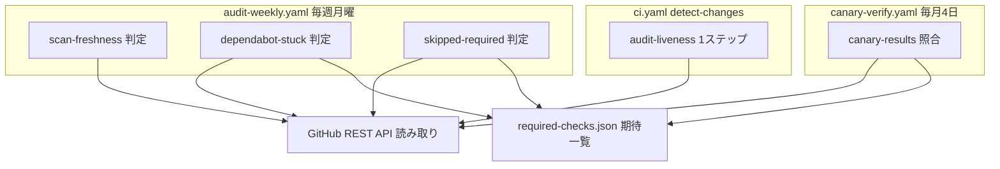

# 設計

## 概要

この設計は、人間が定期的に画面を開いて行っていた監査(定期スキャンの稼働確認・Dependabot滞留・カナリア点検)と、新規のスキップ検知を、リポジトリ内のワークフローによる読み取り専用の自動判定に置き換える。逸脱は、ワークフローの失敗としてだけ現れる。逸脱の通知は、GitHub既定の失敗通知に乗る。

この設計の利用者は、リポジトリ所有者(監査者)である。所有者の定期作業は、「失敗通知が来たときだけ対応する」イベント駆動に変わる。

この設計は、`.github/` にワークフロー2本・判定スクリプト4本・期待一覧1ファイルを追加し、`ci.yaml` に1ステップを追加する。この設計は、既存のワークフローとゲートの動作を変更しない。

## 作るものと作らないもの

### 作るもの

この設計は、次のことを目指す。

- 週次監査(週次6・週次8)と月次1(カナリア点検)の判定を自動化する
- 必須チェックがスキップで通ったPRを検知する(必須チェックの期待一覧をリポジトリ内に持つ)
- 監査自体の死活を、通常のPRのCIが検知する
- 追加費用をゼロにする(AI呼び出し0回・外部サービスなし・追加ランナーは週次/月次の軽量ジョブのみ)

この spec は、次のものを持つ。

- 監査判定ワークフロー2本: `audit-weekly.yaml` / `canary-verify.yaml`(判定と報告のみ)
- 必須チェックの期待一覧 `.github/audit/required-checks.json` とそのスキーマ
- 判定スクリプト4本とその自動テスト
- `ci.yaml` の死活確認1ステップ(detect-changes ジョブ内)

### 作らないもの

この設計は、次のことを目指さない。

- 逸脱の自動修正・Dependabotへの操作・カナリアPRのclose(すべてIssue #310で不採用が確定)
- 段階4(文書削減の残り)・段階5(メトリクス記録)
- 月次4のTRIVY_VERSION 2本一致チェック。Issueの判定表では「一部のみ自動化」だが、承認済み要件の範囲外である。このチェックは、段階4/5と同時期の小PRとして別途扱う
- チェック失敗以外のPR滞留(緑のまま停止・ブランチ更新失敗・衝突・アラートあるのにPR無し)の検知

この spec は、次のものを持たない。

- カナリアPRの生成。既存の `canary.yaml` / `create-canary-prs.sh` がカナリアPRの生成を持つ。照合側は、カナリアPRを読むだけである
- 定期スキャンの実行。既存の `container-scan-scheduled.yaml` が定期スキャンの実行を持つ
- GitHub ruleset の必須チェック設定そのもの。期待一覧は「写し」であり、正はrulesetである。照合側は、不一致を赤で報告するだけで、同期はしない
- 監査手順.md の節の削除(段階4)。ただし、この spec のマージ後にどの節が削除可能になるかは、この design の「段階4への引き継ぎ」の節に列挙する

## 使う既存の仕組み

- GitHub REST API の読み取り(actions runs / pulls / check-runs / rules)。この設計は、書き込みのAPIを使わない
- 既存の検査スクリプトの規約(bash + gh + jq、テスト同梱、ワークフロー内で自テスト実行後に本判定)
- `GITHUB_TOKEN`(permissions は read 系のみ)。この設計は、secrets を使わない

## 設計を見直すきっかけ

- カナリアの種別・命名規則・生成cronが変わったとき。照合スクリプトの定数が追随する必要がある
- rulesetの必須チェックが追加・削除されたとき。期待一覧の更新が必要になる。更新を怠ると、週次監査が赤で知らせる
- 定期スキャンのワークフローファイル名・頻度が変わったとき。8日のしきい値の前提が崩れる
- ci.yaml の detect-changes ジョブが廃止・改名されたとき。detect-changes ジョブは、死活ステップの宿主である

## プロジェクトの決まりを守っているか

- 新しいライブラリの追加: 新規のライブラリは無い。bash / gh / jq は、ランナー同梱の既存の前提である
- 品質チェックの設定: **この設計は、品質チェックの設定の変更を必要とする。** `.github/workflows/`・`.github/scripts/`・`.github/audit/` の追加と `ci.yaml` の1ステップの追加が成果物そのものであり、全PRがCODEOWNERSによる所有者の承認を経る。実装では、所有者の明示指示の下でbotがブランチを作成し、所有者がApproveする(2026-09-03のPR #326以降の実績運用)
- 使う外部の機能がこのリポジトリで使えるか: この設計が使うAPIは、すべて2026-09-03〜06に本リポジトリで実測済みである(workflow runs / check-runs / rules for a branch。公開リポジトリ・個人アカウントで追加要件なし)。実装者は、rulesetの読み取りが `GITHUB_TOKEN` で可能なことを、実装タスクの中で最初に確認する。読み取りができなければ、スクリプトは判定不能=赤として設計どおり動く
- 関係のない項目: backend のコードを置く層(backendのコードを変更しない)、frontend の機能ごとの境界(frontendのコードを変更しない)、frontend の状態の持ち方、データベースの表の形(マイグレーションを含まない)

## 全体の構成


```mermaid
graph TB
    subgraph Weekly[audit-weekly.yaml 毎週月曜]
        FreshCheck[scan-freshness 判定]
        StuckCheck[dependabot-stuck 判定]
        SkipCheck[skipped-required 判定]
    end
    subgraph Monthly[canary-verify.yaml 毎月4日]
        CanaryCheck[canary-results 照合]
    end
    subgraph CI[ci.yaml detect-changes]
        Liveness[audit-liveness 1ステップ]
    end
    Manifest[required-checks.json 期待一覧]
    API[GitHub REST API 読み取り]

    FreshCheck --> API
    StuckCheck --> API
    StuckCheck --> Manifest
    SkipCheck --> API
    SkipCheck --> Manifest
    CanaryCheck --> API
    CanaryCheck --> Manifest
    Liveness --> API
```

- 選んだ型: この設計は、既存の「検査スクリプト+同梱テスト+ワークフロー」の型を繰り返す(9本の実績)。新しい抽象は、期待一覧だけである
- 全部品は読み取り専用である。部品が書き出すのは、ワークフローの終了コードとログ・Job Summaryだけである
- 死活の方向: ci.yaml は audit-weekly の実行履歴を見る(一方向)。audit の側は ci を参照しない(番人の連鎖を作らない)

**使う技術**:
- CI: GitHub Actions(ubuntu-latest)。判定の実行環境である。既存と同一で、新規のアクションに依存しない
- スクリプト: bash + gh CLI + jq(ランナー同梱)。判定ロジックを持つ。既存の9スクリプトと同じ規約に従う
- データ: JSON(`.github/audit/required-checks.json`)。必須チェックの期待一覧を持つ。新規のファイルで、CODEOWNERSの保護下に置く

## ファイルの構成

Claude が新しく作るファイル:

```
.github/
├── audit/
│   └── required-checks.json          # 必須チェック期待一覧(唯一の新データ)
├── workflows/
│   ├── audit-weekly.yaml             # 週次監査(cron 月曜 + workflow_dispatch)
│   └── canary-verify.yaml            # カナリア照合(cron 毎月4日 + workflow_dispatch)
└── scripts/
    ├── check-audit-scan-freshness.sh     # 要件1: 定期スキャン直近成功の鮮度判定
    ├── check-audit-dependabot-stuck.sh   # 要件2: 失敗で止まるDependabot PR検知
    ├── check-audit-skipped-required.sh   # 要件3: 集合照合+スキップ検知
    ├── check-canary-results.sh           # 要件5: カナリア6件の3値照合
    └── tests/
        ├── test-check-audit-scan-freshness.sh
        ├── test-check-audit-dependabot-stuck.sh
        ├── test-check-audit-skipped-required.sh
        └── test-check-canary-results.sh
```

Claude が変えるファイル:

- `.github/workflows/ci.yaml`: detect-changes ジョブに「audit-liveness」の1ステップを追加し(要件4)、`actions: read` の権限を追加する
- `README.md`: ワークフロー一覧表とMermaid図に2本を追記する(作業規約)

## 部品

### required-checks.json(必須チェックの期待一覧のデータファイル)

対応する要件: 2.3, 3.1, 3.2, 3.3

**役割**: このファイルは、必須チェックごとの期待(常時/条件付き・稼働/停止・承認ゲートか)を宣言する唯一のデータである。

**状態の持ち方**: このファイルのスキーマは次のとおりである。すべてのフィールドが必須である。ただし、`reason`/`issue` は、`state: "paused"` のときだけ必須である。

```json
{
  "checks": [
    { "context": "gitleaks",     "mode": "always",      "state": "active", "approval_gated": false },
    { "context": "backend-test", "mode": "conditional", "state": "active", "approval_gated": false },
    { "context": "dependency-gate", "mode": "always",   "state": "active", "approval_gated": true },
    { "context": "codex-review", "mode": "always",      "state": "paused", "approval_gated": false,
      "reason": "整備期間中はCIでのレビューを行わない", "issue": 166 }
  ]
}
```

- `mode: always` は、変更内容によらず実行されるべきチェックを表す(skippedは異常)。`conditional` は、変更検知により正当にスキップされうるチェックを表す
- `approval_gated: true` は、所有者の承認で緑になる設計のチェック(dependency-gate / escape-hatch / pre-merge-check)を表す。これらのチェックのfailureは「承認待ち」であり、滞留ではない
- 初期値: rulesetの現行19コンテキストの全件。codex-review だけを `paused`(issue: 166)にする
- このファイルの配置が `.github/` のため、このファイルの変更(停止記録の追加を含む)には、CODEOWNERSにより所有者の承認が必須になる。この配置が、停止中の記録の追加と変更に所有者の承認を要すること(要件3.3)を機械で強制する

**実装のメモ**:
- 検証: スクリプトの側でスキーマを検証する。未知のフィールドと欠落は、判定不能=赤とする
- リスク: rulesetとの二重管理。毎週の期待一覧とrulesetの集合照合(要件3.4)で、乖離を検知する

### check-audit-scan-freshness.sh(定期スキャンの鮮度を判定するスクリプト)

対応する要件: 1.1, 1.2, 1.3, 1.4

**役割**: このスクリプトは、定期スキャンの直近の成功が8日未満かを判定する。

**呼び出し方(一括処理)**:
- 起動: audit-weekly.yaml がこのスクリプトを実行する。引数は、対象のワークフローファイル名(`container-scan-scheduled.yaml`)と、しきい値の日数(`8`)である
- 入力: `GET /repos/{owner}/{repo}/actions/workflows/{file}/runs?status=success&per_page=1`(1リクエスト)
- 判定: 成功がゼロなら exit 1(「成功実行が存在しない」)。`created_at` が現在時刻の8日以上前なら exit 1(最終成功日時を出力)。8日未満なら exit 0
- 何度実行しても同じか: このスクリプトは読み取りだけを行う。そのため、再実行しても安全である

### check-audit-dependabot-stuck.sh(必須チェックの失敗で止まっているDependabot PRを検知するスクリプト)

対応する要件: 2.1, 2.2, 2.3, 2.4, 2.5

**役割**: このスクリプトは、必須チェックの失敗で止まっているDependabot PRを検知する。

**呼び出し方(一括処理)**:
- 起動: audit-weekly.yaml がこのスクリプトを実行する。引数は、期待一覧のパスである
- 入力: openのDependabot PRの一覧(`author: dependabot[bot]`)と、各PRのheadの check-runs
- 判定: このスクリプトは、各PRについて、期待一覧に載る context の結論を集計する。**滞留結論(`failure` / `cancelled` / `timed_out` / `action_required`)** があり、かつその context が `approval_gated: false` なら、このスクリプトはそのPRを滞留として記録する。滞留が1件以上あれば exit 1(PR番号+チェック名+結論を列挙)。`approval_gated: true` の滞留結論は、このスクリプトは「承認待ち」として報告だけを行う(要件2.3)
  - 滞留結論を failure だけにしない理由(2026-09-06 所有者判断): cancelled は、本リポジトリで実測済みの滞留の形である(キャンセルされた必須チェックは成功にならず、再検査のイベントが無いため、PRが赤のまま進まなくなる)。timed_out / action_required も「緑でも実行中でもない」状態であり、放置を検知する目的の上で見逃せない
- 実行中(結論なし)・全緑・承認待ちのみなら exit 0。このスクリプトは件数のしきい値を持たない(要件2.4)。このスクリプトは、チェック失敗以外の滞留を見ない(要件2.5)

### check-audit-skipped-required.sh(期待一覧とrulesetの集合照合と、スキップで通ったマージ済みPRの検知を行うスクリプト)

対応する要件: 3.4, 3.5, 3.6, 3.7, 3.8

**役割**: このスクリプトは、期待一覧とrulesetの集合照合と、スキップで通ったマージ済みPRの検知を行う。

**呼び出し方(一括処理)**:
- 起動: audit-weekly.yaml がこのスクリプトを実行する。引数は、期待一覧のパスである
- 照合(要件3.4): このスクリプトは、`GET /repos/{owner}/{repo}/rules/branches/main` の required_status_checks の context の集合と、期待一覧の context の集合を比べる。差分があれば exit 1(差分を列挙)。**このスクリプトは、状態(active/paused)をこの照合に使わない**
- 対象期間(要件3.5): 対象期間は、自ワークフロー(audit-weekly.yaml)の**現在のrun(GITHUB_RUN_ID)を除いた**直近の実行の created_at 以降である。その実行が存在しなければ、対象期間は7日前からである。**現在のrunを除外しないと、下限が現在時刻になり、検知が恒久的に空振りする**(実装・テストの必須確認点)
- スキップ検知(要件3.6〜3.8): このスクリプトは、期間内にmainへマージされたPRごとに、**PRのheadコミット(pulls APIの `head.sha`)** の check-runs を取得する。`mode: always` かつ `state: active` の context が `skipped`(または実行なし)なら、このスクリプトは違反として記録する。違反が1件以上あれば exit 1(PR番号+チェック名)。`state: paused` のスキップは非違反とし、このスクリプトは「停止中(参照Issue)」を報告に明示する(要件3.7)。このスクリプトは、`mode: conditional` のスキップを見ない(要件3.8)
  - **squashマージのため、このスクリプトは `merge_commit_sha` を使ってはならない**。マージコミットの側にはPRの必須チェックのcheck-runsが存在せず、全PRが「実行なし=違反」の偽赤になる(必須19コンテキストはすべてGitHub Actionsのcheck-runsで報告されることを実測済み。commit statusは不使用)

### check-canary-results.sh(当月のカナリア6件の期待チェックの結論を3値で照合するスクリプト)

対応する要件: 5.1, 5.2, 5.3, 5.4, 5.5, 5.6, 5.7, 5.8

**役割**: このスクリプトは、当月のカナリア6件の期待チェックの結論を3値で照合する。このスクリプトは、書き込みのAPIとPRの操作を一切行わない(要件5.7)。

**呼び出し方(一括処理)**:
- 起動: canary-verify.yaml がこのスクリプトを実行する。引数は、期待一覧のパスと、対象の年月(既定: 実行時の年月)である
- 種別と期待チェックの対応(スクリプト内の定数):
  | 種別 | 期待チェック |
  |---|---|
  | known-bug | codex-review |
  | assertless-test | frontend-test |
  | skipped-test | escape-hatch |
  | backend-failure | backend-test |
  | vulnerable-dep | dependency-review |
  | container-vuln | container-scan |
- 各種別: このスクリプトは、ブランチ `canary/<type>-<YYYYMM>` のPRを特定する。PRが無ければ、このスクリプトはその種別を「PR欠落」として失敗とする。6件が揃わない場合は、このスクリプトは生成側の異常と明記する(要件5.5)。次に、このスクリプトは、期待チェックの最新の結論を3値で判定する: `failure` なら正常(要件5.2) / `success` なら判定側の故障(要件5.3。結論だけで分類する) / `skipped` または実行なしなら実行されていない(要件5.4。判定側の故障と区別する)
- 期待チェックが期待一覧で `paused` なら、このスクリプトは「停止中(記録済み・参照Issue)」として失敗と区別する(要件5.8)
- **期待一覧に存在しない期待チェックは、このスクリプトは「稼働中」とみなして3値で判定する**。期待一覧は必須チェックの写しであり、container-scan は必須チェックに未登録(Issue #221 の解消待ち)のため、一覧に無いのが正常である。container-scan を一覧へ足すと、期待一覧とrulesetの集合照合(要件3.4)が毎週赤になる。そのため、この設計は、データの側でなくこの呼び出し方の取り決めで吸収する
- いずれかの種別が失敗判定なら exit 1。このスクリプトは、全種別の判定の一覧を常にJob Summaryへ出力する(要件5.6)

### audit-weekly.yaml(週次の判定3本を実行するワークフロー)

対応する要件: 1, 2, 3, 6

**役割**: このワークフローは、週次の判定3本の実行を編成する。

**権限**: このワークフローに与える permissions は、`contents: read`, `actions: read`, `pull-requests: read`, `checks: read` だけである(要件6.4)。

**いつ動くか**: `schedule: cron '17 0 * * 1'`(毎週月曜 09:17 JST)と `workflow_dispatch`(手動検証用)で動く。

**呼び出し方(一括処理)**:
- ジョブ構成: このワークフローは、1つのジョブの中で「テストの実行(tests/ の3本)→ 本判定3本」を行う。これは、既存の dependency-cooldown と同じ「自テストのあとに本判定」の型である。**このワークフローは、本判定3本を、途中で赤が出ても全部実行し、結果を集約して最後にジョブを失敗させる**。1本目の赤で残りの情報が隠れることを防ぐためであり、container-scan-scheduled.yaml のテストの集約と同じ方式である(要件6.5)
- 出力: このワークフローは、各判定の結果と、期待一覧の `paused` の一覧を、Job Summaryに常時表示する(要件3.7)

### canary-verify.yaml(月次の照合を実行するワークフロー)

対応する要件: 5, 6

**役割**: このワークフローは、月次の照合の実行を編成する。

**権限**: permissions と型(テスト→本判定)は、audit-weekly.yaml と同一である。

**いつ動くか**: `schedule: cron '17 0 4 * *'`(毎月4日 09:17 JST。生成の3日後)と `workflow_dispatch` で動く。

### ci.yaml の audit-liveness ステップ(週次監査が止まったことを次のPRで検知するステップ)

対応する要件: 4.1, 4.2, 4.3, 4.4

**役割**: このステップは、週次監査が止まったことを、次のPRで検知する。

**権限**: このステップのために、detect-changes ジョブに `actions: read` を追加する(現在は contents: read のみ)。

**いつ動くか**:
- 配置: このステップは、detect-changes ジョブの末尾の1ステップである。detect-changes ジョブは、全PRで必ず実行される必須チェックの中にある。そのため、追加のランナーは要らない
- **イベントの限定**: このステップには、`if: github.event_name == 'pull_request'` を必ず付ける。ci.yaml はmainへのpushでも起動する。push の実行でこのステップが落ちると、frontend-test がスキップされ、デプロイ用のartifactの保存が欠落する(マージ後の経路の破壊。#326と同型の事故)。要件4.1も「PRのCI」に限定している
- PRが無い期間は、このステップの実行自体が無い。そのため、PRが1本も作られない期間には作動しないこと(要件4.4)は、構造的に満たされる

**呼び出し方(一括処理)**:
- 入力: `GET /repos/{owner}/{repo}/actions/workflows/audit-weekly.yaml/runs?status=success&per_page=1`(1リクエスト)
- 判定: 成功がゼロなら pass(導入直後=要件4.3)。**404(ワークフロー未登録)なら pass(導入前=要件4.3の適用)。audit-weekly.yaml を追加するPR自身のCIがこのステップを含むため、404を判定不能にすると、導入PRが構造的にマージ不能になる。2026-09-06 のPR #331 で実測し修正した**。直近の成功が10日以上前なら、`::error::` でステップを失敗させる(要件4.2)。10日未満なら pass。その他のAPIの失敗は、判定不能で失敗とする(fail-closed)
  - 「成功ゼロなら pass」は、一度も実行されていない期間を許容すること(要件4.3)より広く、「実行はあるが一度も成功していない」も素通りする。このため、**マージ後に workflow_dispatch で audit-weekly の成功を1件作ることを、導入手順の必須のステップとする**(テストの方針の節の実地確認と同一。以後は成功が存在するため空振りしない)

## データの形

期待一覧(required-checks.json)が唯一のデータである。スキーマは、上の required-checks.json の部品の節のとおりである。この設計は、期待一覧の版の管理を行わない。期待一覧の変更は、すべて所有者の承認つきのPRで行う(git履歴が監査証跡になる)。

## 失敗したときの扱い

- **判定不能の原則**: APIのエラー・スキーマの不正・想定外のレスポンスのときは、スクリプトは成功に倒さず、「判定不能」と明示して exit 1 で終える(check-dependency-cooldown の既存の型)。スクリプトは、黙って緑にしない
- **approval_gated の分類の残余リスク**: `check-audit-dependabot-stuck.sh` は、dependency-gate / escape-hatch / pre-merge-check の failure を静的に「承認待ち」へ分類する。そのため、これらのチェック自体の故障や、本物の違反の検知による failure も、滞留の検知からは除外される(要件2.3の「承認待ちのみ」より広い除外)。緩和策は次の2つである。(1) 週次の報告に承認待ちのPRの一覧を常時出力するので、長期の滞留は人間の目に入る。(2) escape-hatch の実際の検知能力は、毎月のカナリア(skipped-test 種別)が独立に検証する。この設計は、このリスクを受容する残余リスクとして記録する
- **死活ステップの判定不能**: 死活ステップも、判定不能のときは同様にステップを失敗とする。死活ステップは全PRの hot path にあるが、判定はAPIの1リクエストで、再実行が安価である。この設計は、fail-closed を優先する(素通りは「監査停止の見逃し」そのものだからである)
- **判定不能からの復旧手段**: 週次の赤が判定不能(APIの障害など)によるものだった場合、人間は**失敗したrunのre-runで再実行する**。新規のworkflow_dispatchを使うと、スキップ検知の対象期間の下限が「失敗したrunの時刻」になり、その前の未走査の期間が恒久的に残る(re-runなら同一のGITHUB_RUN_IDが除外され、窓が保たれる)。スクリプトは、この指示を失敗時の報告の文面に含める
- **報告**: すべての失敗について、スクリプトはJob Summaryに「何が・どの基準で・次に人間が何をするか」を出力する(監査手順の該当の節の後継として読める文面)

## テストの方針

- **単体テスト(スクリプトのテスト4本)**: 既存の tests/ の規約(モックしたghの応答による表明)に従う。テストは、少なくとも以下を含む:
  - scan-freshness: 8日未満で緑 / ちょうど8日で赤(境界値=要件レビューmust 2の再発防止)/ 成功ゼロで赤 / API失敗で判定不能
  - dependabot-stuck: 非approval_gatedのfailureで赤 / approval_gatedのfailureのみなら緑+承認待ち報告 / 実行中は緑 / 0件で緑
  - skipped-required: 集合差分で赤 / always+activeのskippedで赤 / pausedのskippedは緑+停止中報告 / conditionalのskippedは緑 / 初回実行は7日窓
  - canary-results: 3値それぞれの判定 / 6件未満で赤(生成側異常の文言)/ pausedの区別 / 種別→期待チェック対応表の全種別
- **結合テスト(実地)**: マージ後に workflow_dispatch で audit-weekly を1回実行し、全項目の実際の結果を確認する。canary-verify は、次の月初のサイクル(10/1生成→10/4発火)で実地に確認する
- **既存テストへの影響**: なし。既存のファイルの変更は、ci.yaml の1ステップとREADMEだけである

## 段階4への引き継ぎ(この spec のマージ後に削除可能になる監査手順の節)

- 週次6(DependabotのPRが滞留していないかの確認)の定期確認の部分。**サブ手順(ブランチ最新化・dockerのPRをcloseしない・脆弱性以外の赤・手動キャンセル)は、人間向けの対処手順として残す**(要件2.5)
- 週次8(稼働中イメージの脆弱性監視が動いているかの確認)の定期確認の部分。「起票されたIssueの扱い」は残す
- 月次1(カナリア点検)の確認の部分。「後始末(close)」は残す(自動化しない)

## 要件との対応

| 要件 | 要約 | 部品 |
|------|------|------|
| 1.1–1.4 | 定期スキャンの鮮度判定(8日、成功ゼロも赤) | check-audit-scan-freshness.sh / audit-weekly.yaml |
| 2.1–2.5 | 失敗で止まるDependabot PRの検知(承認待ち除外) | check-audit-dependabot-stuck.sh / required-checks.json(approval_gated) |
| 3.1–3.3 | 期待一覧の保持・状態記録・承認 | required-checks.json(CODEOWNERS保護) |
| 3.4 | 集合照合(名前のみ、状態は使わない) | check-audit-skipped-required.sh |
| 3.5–3.8 | スキップ検知(前回実行基準・初回7日・always/conditional・paused除外) | check-audit-skipped-required.sh |
| 4.1–4.4 | CIの死活1ステップ(10日・導入直後許容・PRゼロ期間許容) | ci.yaml detect-changes 内ステップ |
| 5.1–5.8 | カナリア6件の3値照合・6件未満赤・書き込みなし・paused区別 | check-canary-results.sh / canary-verify.yaml |
| 6.1–6.6 | AI/外部/保存/書き込みなし・赤のみ・テスト同梱 | 全部品の横断(permissions・スクリプト規約) |
