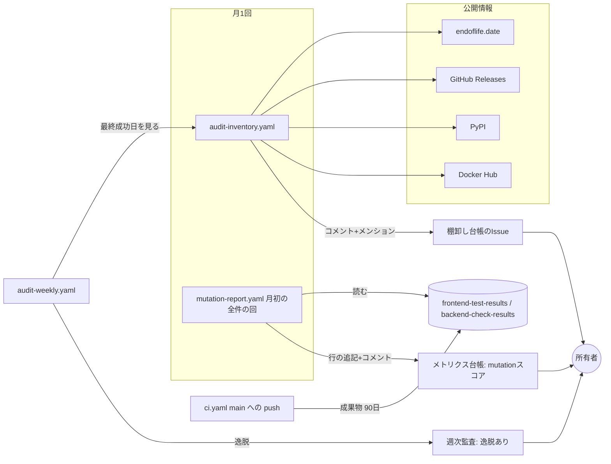
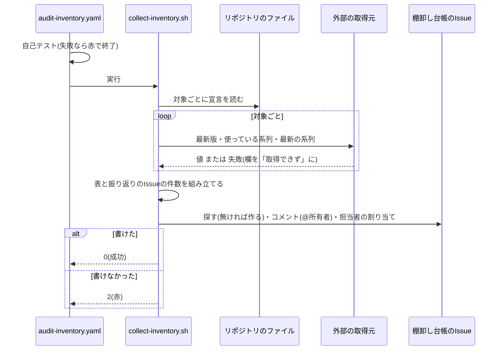
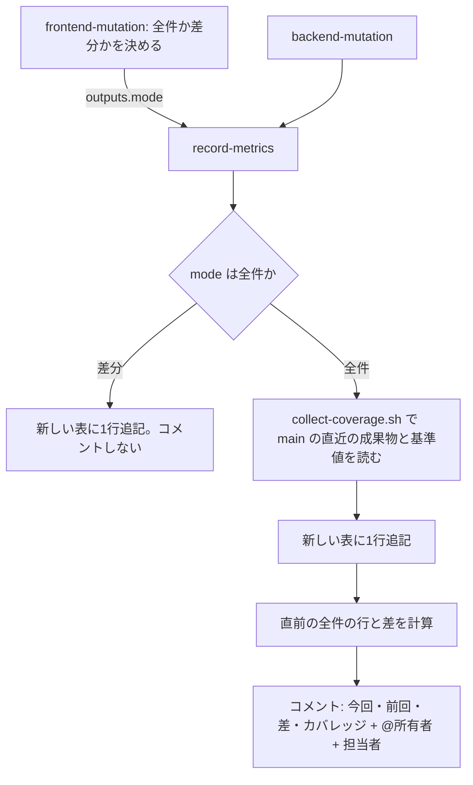

# Design Document

## Overview

**Purpose**: 監査手順の定期作業のうち、人間の判断を含まない「調べて書き写す」部分を機械に移す。ツールとランタイムの版・サポート期限(棚卸し)と、mutation スコア・カバレッジ(メトリクス)を月1回集め、判定をせずに台帳のIssueのコメントで所有者に届ける。

**Users**: リポジトリ所有者。コードを読まず、届いた表を読んで版の更新やテストの追加を Claude Code に指示する。

**Impact**: 所有者が配布元のサイトや台帳を開いて比べる作業が無くなる。定期の確認は残り、判断は人間が行う。あわせて tflint と checkov の版の更新が Dependabot のPRで届くようになる。

### Goals
- 棚卸しの表が毎月1回、所有者に通知される形で届く
- mutation スコアの全件の回どうしの差と、カバレッジの実測・基準値が、月1回、通知される形で届く
- tflint と checkov の新しい版が Dependabot のPRとして届く。tflint の更新PRは、GitHub のリリースの公開から72時間経つまで自動マージを予約しない
- 棚卸しが止まったら週次監査の逸脱として届き、外部の不調は既存の監査に波及しない

### Non-Goals
- 版やスコアの良し悪しの判定、しきい値との比較、それに基づく逸脱の報告
- 版の更新やテストの追加そのもの
- Trivy の版の更新の自動化(Dependabot が `env:` を扱えない。2本の一致は週次監査が既に確かめている)
- 週次監査・カナリア照合の判定基準と問い合わせ先の変更

## Boundary Commitments

### This Spec Owns
- 棚卸しのワークフロー(`audit-inventory.yaml`)、収集のスクリプト、対象の設定ファイル、棚卸しの台帳のIssue(タイトル `棚卸し台帳: 版とサポート期限`)
- 台帳のIssueを探す・作る・コメントする・担当者に割り当てる共通の関数(`lib-ledger-issue.sh`)
- mutation の台帳への測定方式の記録、全件の回どうしの差の計算、月1回のコメント
- カバレッジの値と基準値の読み取り(`collect-coverage.sh`)と、CI の成果物の保持期間(main への push のときだけ90日)
- 週次監査の鮮度確認への棚卸しの追加と、鮮度確認のスクリプトの表示名の引数
- tflint と checkov の Dependabot への移管(Dockerfile・requirements.txt・dependabot.yml)
- tflint の更新PRの自動マージの予約を、公開から72時間経つまで保留する判定(`check-release-age.sh`)と、その判定を PR のイベントと1日1回の見直しで呼ぶこと(`dependabot-auto-merge.yaml`)
- 監査手順書の定期作業の表・版の確認先、README のワークフロー一覧と図、ワークフロー設計の自動チェック一覧と残余リスク、audit-automation / audit-notification の要件への注記

### Out of Boundary
- 週次監査の判定項目(滞留・スキップ・期待一覧・Trivy の版の一致)の中身と、`audit-issue.sh` の通知の仕組み
- mutation testing の測定そのもの(Stryker・PIT の実行、全件にするかの条件)
- CI のテスト・カバレッジの判定(基準値の値、基準値を満たさないときに赤にする動き)
- Dependabot の docker レーンのほかの設定(メジャー更新の除外、他のイメージ)
- tflint 以外の Dependabot のPRの自動マージの扱い(今までどおり、開いたときに予約する)
- Dependabot 側のクールダウンの実装(ghcr.io で公開日時を取れないこと自体は変えられない)
- Trivy の版の宣言の場所と、その一致の確認
- 表を読んだ後の版の更新・テストの追加

### Allowed Dependencies
- GitHub REST API(`gh api`。Issue・ラベル・担当者・Actions の実行と成果物・リリース)
- endoflife.date API v1(`https://endoflife.date/api/v1`)、PyPI JSON API(`https://pypi.org/pypi`)、Docker Hub の tags API(`https://hub.docker.com/v2`)。認証情報を送らない読み取りに限る(要件6-1)
- ランナーに入っている `bash` `jq` `curl` `gh`。新しいライブラリやアクションを足さない
- 既存の `check-audit-scan-freshness.sh` と週次監査の `run_check`

### Revalidation Triggers
- 台帳のIssueのタイトルや表の列を変えるとき(所有者が読む形と、比較で前の行を探す処理が変わる)
- `mutation-report.yaml` の全件の条件を変えるとき(測定方式の出力と比較の対象が変わる)
- `ci.yaml` の成果物の名前・中身のパスを変えるとき(カバレッジが読めなくなる)
- `vite.config.ts` の `thresholds` や `quality.gradle` の `violationRules` の書き方を変えるとき(基準値が読めなくなる)
- `check-audit-scan-freshness.sh` の引数を変えるとき(週次監査の2つの呼び出しが影響を受ける)
- 外部の取得元の API の版が変わるとき
- tflint の置き場や入れ方を変えるとき(公開日時の取り方と、Dependabot の待ちが効くかが変わる)

## KeirekiPro Compliance Check (必須)

- [x] **backend層配置**: N/A。backend のコードを変えない
- [x] **frontend境界**: N/A。frontend のコードを変えない
- [x] **状態管理**: N/A
- [x] **DBスキーマ**: N/A。マイグレーションを含まない
- [x] **依存追加**: アプリの依存は足さない。開発環境の `docker/terraform/requirements.txt` に checkov を移すが、版(3.2.497)と入れ方(pip)は今と同じ
- [ ] **ゲート設定**: **ゲート設定の変更を含む。** `.github/`(ワークフロー・スクリプト・dependabot.yml・audit の設定)の変更は所有者の承認が要る。`vite.config.ts` と `quality.gradle` は読むだけで変えない。承認つきのPRとして出す
- [x] **前提機能の利用可否**: リポジトリは PUBLIC(`gh repo view`)。成果物の保持の上限は90日(公式ドキュメント)。Dependabot の pip と docker(ghcr を含む)は公開リポジトリで使える。endoflife.date・PyPI・Docker Hub は認証なしで読める(2026-09-29 実測)

## Architecture

### Existing Architecture Analysis
- 週次監査(`audit-weekly.yaml`)は判定スクリプトを `run_check` で束ね、結果を `audit-issue.sh` で Issue に届ける。外部への問い合わせをしない方針をヘッダに書いている
- mutation の測定(`mutation-report.yaml`)は、測った側が台帳のIssueの本文に1行追記する(#334 の決定。監査の側は状態を持たない)
- CI は変更検知で job を飛ばすため、main の直近の成果物が数日〜数週間前のものになることがある

### Architecture Pattern & Boundary Map



- **Selected pattern**: 月1回の別ワークフローと台帳のIssue。外部の取得元と既存の週次監査のあいだに、実行の成否だけの接点を置く
- **Existing patterns preserved**: 測った側が台帳に書く(#334)。台帳の探し方(`state=all`・タイトル完全一致・最小の番号)。担当者の割り当てとメンションの方式(`audit-issue.sh`)。スクリプトは `bash` で起動し、テストは `gh` と `curl` を PATH の先頭に置いた偽物で置き換える
- **New components rationale**: 棚卸しの収集(新しい取得元)と、カバレッジの読み取り(新しい入力)は、既存のどのスクリプトの責務にも入らないため新設する。台帳の操作は2か所で使うため共通の関数にする

### Technology Stack

| Layer | Choice / Version | Role in Feature | Notes |
|---|---|---|---|
| Runtime | GitHub Actions `ubuntu-latest`(既存と同じ) | 月1回の実行 | 新しいアクションを足さない。`actions/checkout` は既存の SHA 固定の参照を使う |
| Script | bash + jq + curl + gh | 収集・整形・Issue 操作 | 既存のスクリプトと同じ構成 |
| Config | JSON(`.github/audit/inventory-targets.json`) | 対象の一覧 | `required-checks.json` と同じ場所 |
| External | endoflife.date API v1 / PyPI JSON / Docker Hub v2 tags | 最新版とサポート期限 | 認証なしの読み取り |
| Dependency updates | Dependabot docker(ghcr)/ pip | tflint と checkov の更新PR | 既存の auto-merge の流れに乗る。tflint だけ公開から72時間の判定を挟む |

## File Structure Plan

### Directory Structure
```
.github/
├── audit/
│   └── inventory-targets.json        # 棚卸しの対象の一覧(宣言の場所・取得元・系列の取り出し方)
├── scripts/
│   ├── collect-inventory.sh          # 棚卸し: 宣言を読み、外部から最新版と期限を集め、表を台帳にコメントする
│   ├── collect-coverage.sh           # main の直近の CI 成果物からカバレッジを、ゲート設定から基準値を読み、Markdown を出す
│   ├── lib-ledger-issue.sh           # 台帳のIssueを探す・作る・コメントする・担当者に割り当てる共通の関数(source して使う)
│   ├── check-release-age.sh          # Dependabot のPRの差分から tflint の更新を見分け、自動マージを予約してよいかを判定する
│   └── tests/
│       ├── test-collect-inventory.sh
│       ├── test-collect-coverage.sh
│       ├── test-lib-ledger-issue.sh
│       └── test-check-release-age.sh
└── workflows/
    └── audit-inventory.yaml          # 月1回(毎月2日)の棚卸し
docker/terraform/
└── requirements.txt                  # checkov の版の宣言(Dependabot の pip が読む)
```

### Modified Files
- `.github/scripts/record-mutation-metrics.sh` — 測定方式の列を持つ新しい表への追記、全件の回どうしの差の計算、全件の回のコメント(カバレッジの Markdown を含む)。台帳の操作を `lib-ledger-issue.sh` に置き換える
- `.github/scripts/tests/test-record-mutation-metrics.sh` — 上の変更に合わせたテスト
- `.github/workflows/mutation-report.yaml` — 全件か差分かのステップに `id` と出力を付け、job の outputs で record に渡す。record job に `actions: read` を足し、全件の回だけ `collect-coverage.sh` を動かす。record の前に新しいテストを流す
- `.github/workflows/ci.yaml` — `frontend-test-results` と `backend-check-results` の `retention-days` を `${{ github.event_name == 'push' && 90 || 7 }}` にする
- `.github/scripts/check-audit-scan-freshness.sh` — 3つ目の引数(表示名。省略時は今の「定期スキャン」)を足す
- `.github/scripts/tests/test-check-audit-scan-freshness.sh` — 表示名の引数のテストを足す
- `.github/workflows/audit-weekly.yaml` — `run_check inventory-freshness "棚卸しの稼働確認" ... audit-inventory.yaml 35 棚卸し` を足す。ヘッダの「4項目」を直す
- `.github/dependabot.yml` — pip のレーン(`/docker/terraform`)を足す。docker レーンの group に `exclude-patterns: ["terraform-linters/tflint"]` を足す。コメントを直す
- `docker/terraform/Dockerfile` — 先頭に `FROM ghcr.io/terraform-linters/tflint:v0.60.0@sha256:<digest> AS tflint` のステージを置き(digest は実装時に ghcr.io から取る)、`COPY --from=tflint` にする。checkov は `requirements.txt` を COPY して `pip3 install -r` で入れる
- `.github/workflows/dependabot-auto-merge.yaml` — 予約の前に `check-release-age.sh` を呼ぶ。1日1回の `schedule` と `workflow_dispatch` で、予約を保留した tflint の更新PRを見直す job を足す
- `doc/開発フロー/監査手順.md` — 定期作業の表の月次・半期の行と版の確認先を、届いたコメントを読む形にする。PRが止まったときの節に、tflint の更新PRに「自動マージを予約していない」のコメントが付いたときの対処を足す
- `doc/インフラ設計/Github Actions設計/ワークフロー設計.md` — 2.1 の一覧に棚卸しと tflint の公開から72時間の判定を足し、2.2 に「1日1回の見直しが止まると、保留した tflint の更新PRが開いたまま残る」残余リスクを足す
- `README.md` — ワークフロー一覧の表と Mermaid の図に `audit-inventory.yaml` を足し、週次監査の項目数と `dependabot-auto-merge.yaml` の起動条件(1日1回の見直し)を直す
- `.kiro/specs/audit-automation/requirements.md`、`.kiro/specs/audit-notification/requirements.md` — 外部問い合わせの要件に、本specで棚卸しに限って改めた旨の注記を足す
- `.kiro/steering/tech.md` — 「checkov 等は Dockerfile で固定し人間が明示的に上げる」を、Dependabot のPRで上げる形に直す(`/kiro-steering` で行う)

## System Flows

### 棚卸し(毎月2日)



- 欄が「取得できず」でも実行は成功で終える(要件2-8)。赤になるのは自己テストの失敗と台帳に書けなかったときだけ
- 赤で終わっても所有者には通知されない(定期実行の失敗通知は bot に届く)。35日以内に成功が無ければ週次監査が逸脱として届ける(要件5-1)

### メトリクス(毎週土曜。コメントは全件の回だけ)



- `mode` は `full-scheduled`(月初の定期)、`full-manual`(手動で full)、`full-no-previous`(前回の結果が無い)、`incremental` の4値。全件の3値はどれもコメントの対象で、理由をコメントに書く

### tflint の更新PRの自動マージ(PR のイベントと1日1回の見直し)

```mermaid
flowchart TD
    A[Dependabot のPR: opened / reopened / synchronize] --> J[check-release-age.sh]
    S[1日1回: 予約されていない Dependabot のPRを列挙] --> J
    J --> K{判定}
    K -->|reserve: tflint の更新ではない、または公開から72時間経った| R[gh pr merge --auto --squash]
    K -->|wait: 公開から72時間経っていない| W[何もしない。翌日の見直しを待つ]
    K -->|notify: 公開日時を取れない、または中身だけの更新| N[理由をPRにコメントし @所有者。同じ理由のコメントは1回だけ]
    N -->|公開日時を取れない場合だけ| W
```



- 中身(digest)だけの更新は、以後の見直しの対象から外す(要件4-7 の除外)。公開日時を一時的に取れなかった場合は、翌日も見直す(R3-3-1)

## Requirements Traceability

| Requirement | Summary | Components | Interfaces | Flows |
|---|---|---|---|---|
| 1.1 | 12の対象を月1回集める | audit-inventory.yaml, inventory-targets.json, collect-inventory.sh | cron `17 0 2 * *` | 棚卸し |
| 1.2 | 使っている版をファイルから読む | collect-inventory.sh, inventory-targets.json | `declarations[]` | 棚卸し |
| 1.3 | 最新のリリース(系列を問わない) | collect-inventory.sh | `latest` の取得元 | 棚卸し |
| 1.4 | 使っている系列の期限・期限切れ・最新の系列 | collect-inventory.sh | `support`(endoflife.date) | 棚卸し |
| 1.5 | 期限の公表が無ければ「公表なし」 | collect-inventory.sh | `support: null` | 棚卸し |
| 1.6 | 振り返りのIssueの件数 | collect-inventory.sh | GitHub の labels / issues API | 棚卸し |
| 1.7 | 判定しない | collect-inventory.sh | 終了コードの契約 | 棚卸し |
| 2.1 | 表と振り返りの件数 | collect-inventory.sh | 表の列の定義 | 棚卸し |
| 2.2 | 台帳にコメント | lib-ledger-issue.sh | `ledger_comment` | 棚卸し |
| 2.3 | メンションと担当者 | lib-ledger-issue.sh | `ledger_comment`, `ledger_assign_owner` | 棚卸し |
| 2.4 | 台帳が無ければ作る | lib-ledger-issue.sh | `ledger_find_or_create` | 棚卸し |
| 2.5 | 取得できなければ「取得できず」+理由 | collect-inventory.sh | 取得元ごとの失敗の扱い | 棚卸し |
| 2.6 | 宣言が読めなければ「読み取れず」+場所 | collect-inventory.sh | `declarations[]` | 棚卸し |
| 2.7 | 書けなければ失敗 | collect-inventory.sh, audit-inventory.yaml | 終了コード 2 | 棚卸し |
| 2.8 | 書ければ成功 | collect-inventory.sh | 終了コード 0 | 棚卸し |
| 3.1 | 測定方式を行ごとに記録 | mutation-report.yaml, record-mutation-metrics.sh | `MUTATION_MODE` | メトリクス |
| 3.2 | 直前の全件の回との差 | record-mutation-metrics.sh | 新しい表の解析 | メトリクス |
| 3.3 | 全件の回にコメントとメンション | record-mutation-metrics.sh, lib-ledger-issue.sh | `ledger_comment` | メトリクス |
| 3.4 | カバレッジの値・日付・コミット・基準値 | collect-coverage.sh | 出力の Markdown | メトリクス |
| 3.5 | 比較対象なし | record-mutation-metrics.sh | 新しい表の解析 | メトリクス |
| 3.6 | 取得できず(保存期間内に CI が無い場合を含む) | collect-coverage.sh, record-mutation-metrics.sh | 欄の値 | メトリクス |
| 3.7 | 差分の回はコメントしない | record-mutation-metrics.sh | `MUTATION_MODE` | メトリクス |
| 3.8 | 判定しない | record-mutation-metrics.sh, collect-coverage.sh | 終了コードの契約 | メトリクス |
| 3.9 | main の成果物を90日保存 | ci.yaml | `retention-days` の式 | - |
| 4.1 | tflint の更新PR | docker/terraform/Dockerfile | `FROM ... AS tflint` | - |
| 4.2 | tflint をまとめPRに入れない | dependabot.yml | `exclude-patterns` | - |
| 4.3 | checkov の更新PR | docker/terraform/requirements.txt, dependabot.yml | pip レーン | - |
| 4.4 | 更新PRで terraform の静的検査 | terraform-plan.yaml(変更なし) | paths-filter `docker/terraform/**` | - |
| 4.5 | 明示的な版と digest で固定 | docker/terraform/Dockerfile, requirements.txt | `vX.Y.Z@sha256:…` / `==X.Y.Z` | - |
| 4.6 | 公開から72時間経っていなければ予約しない | check-release-age.sh, dependabot-auto-merge.yaml | 判定 `wait` | tflint の自動マージ |
| 4.7 | 1日1回見直して予約する | dependabot-auto-merge.yaml | `recheck` job | tflint の自動マージ |
| 4.8 | 公開日時が取れない・中身だけの更新は予約せず知らせる | check-release-age.sh, dependabot-auto-merge.yaml | 判定 `notify` | tflint の自動マージ |
| 4.9 | 書き換えられない公開日時だけを使う | check-release-age.sh | GitHub のリリースの `published_at` | tflint の自動マージ |
| 5.1 | 35日で逸脱 | audit-weekly.yaml, check-audit-scan-freshness.sh | `run_check inventory-freshness` | - |
| 5.2 | 別に実行し、失敗を週次監査が判定不能にしない | audit-inventory.yaml | 実行の成否だけが接点 | 棚卸し |
| 5.3 | 外部の失敗を週次監査の判定不能にしない | collect-inventory.sh | 欄の「取得できず」 | 棚卸し |
| 5.4 | 見張りを新設しない | audit-weekly.yaml | 既存の鮮度確認 | - |
| 6.1 | 外部には製品名だけを送る読み取り | collect-inventory.sh | curl の呼び出し | 棚卸し |
| 6.2 | AIを呼ばない | 全体 | - | - |
| 6.3 | 書き込みは台帳のIssueに限る | audit-inventory.yaml, lib-ledger-issue.sh | `permissions` | 棚卸し |
| 6.4 | 台帳をタイトルで区別する | lib-ledger-issue.sh | `ledger_find_or_create` | 両方 |
| 6.5 | 自動テスト | tests/*.sh | - | - |
| 6.6 | 既存の spec への注記 | audit-automation / audit-notification の requirements.md | - | - |
| 7.1 | 手順書の定期作業の表 | 監査手順.md | - | - |
| 7.2 | 判断は人間、しきい値なし | 監査手順.md | - | - |
| 7.3 | 止まったら週次監査の逸脱で届く | 監査手順.md | - | - |

## Components and Interfaces

| Component | Layer | Intent | Req Coverage | Key Dependencies | Contracts |
|---|---|---|---|---|---|
| audit-inventory.yaml | Workflow | 月1回の棚卸しの起動 | 1.1, 2.7, 5.2, 6.3 | collect-inventory.sh (P0) | Batch |
| inventory-targets.json | Config | 対象の一覧 | 1.1, 1.2, 1.5 | - | State |
| collect-inventory.sh | Script | 集めて表にし、台帳にコメント | 1.x, 2.x, 5.3, 6.1 | lib-ledger-issue.sh (P0), 外部の取得元 (P1) | Batch |
| lib-ledger-issue.sh | Script lib | 台帳のIssueの操作 | 2.2-2.4, 3.3, 6.4 | GitHub API (P0) | Service |
| collect-coverage.sh | Script | カバレッジと基準値の Markdown | 3.4, 3.6, 3.8 | GitHub artifacts API (P0) | Batch |
| record-mutation-metrics.sh | Script | 測定方式の記録・差・コメント | 3.1-3.3, 3.5-3.8 | lib-ledger-issue.sh (P0) | Batch |
| mutation-report.yaml | Workflow | mode の受け渡し・カバレッジの読み取りの起動 | 3.1, 3.4, 3.7 | record-mutation-metrics.sh (P0) | Batch |
| ci.yaml | Workflow | 成果物の保持 | 3.9 | - | - |
| check-audit-scan-freshness.sh / audit-weekly.yaml | Script / Workflow | 棚卸しの鮮度確認 | 5.1, 5.4 | - | Batch |
| Dockerfile / requirements.txt / dependabot.yml | Config | Dependabot への移管 | 4.1-4.5 | Dependabot (P0) | - |
| check-release-age.sh / dependabot-auto-merge.yaml | Script / Workflow | tflint の更新PRの予約を公開から72時間保留する | 4.6-4.9 | GitHub API (P0) | Batch |
| 文書類 | Doc | 手順書・一覧・注記 | 6.6, 7.x | - | - |

### Workflow

#### audit-inventory.yaml

| Field | Detail |
|---|---|
| Intent | 毎月2日に棚卸しを1回実行する |
| Requirements | 1.1, 2.7, 5.2, 6.3 |

**Responsibilities & Constraints**
- `on: schedule: cron '17 0 2 * *'`(毎月2日 09:17 JST。1日のカナリア生成と4日のカナリア照合を避ける)と `workflow_dispatch`
- `permissions: contents: read, issues: write`。それ以外は付けない(要件6-3)
- `concurrency: group: audit-inventory, cancel-in-progress: false`、`timeout-minutes: 15`
- ステップ: checkout(既存と同じ SHA 固定の参照) → 自己テスト(`test-lib-ledger-issue.sh` と `test-collect-inventory.sh`。失敗したら赤で終了) → `bash .github/scripts/collect-inventory.sh .github/audit/inventory-targets.json`(`GH_TOKEN: ${{ github.token }}`)
- AIのアクションを使わない(要件6-2)

**Contracts**: Batch [x]
- Trigger: 毎月2日の cron、または手動
- Output: 棚卸し台帳のIssueへのコメント1件
- Idempotency & recovery: 同じ月に再実行すると、コメントがもう1件増える(新しい事実として扱う。重複の除去はしない)

### Config

#### inventory-targets.json

| Field | Detail |
|---|---|
| Intent | 対象・宣言の場所・取得元・系列の取り出し方を1か所に書く |
| Requirements | 1.1, 1.2, 1.5 |

**Contracts**: State [x]

```typescript
type InventoryTargets = {
  targets: Target[];
};
type Target = {
  name: string;                       // 表の「対象」列。例 "Node.js"
  declarations: Declaration[];        // 1件以上
  latest: LatestSource;               // 最新のリリースの取得元
  support: SupportSource | null;      // null はサポート期限の公表が無い(要件1-5)
};
type Declaration = {
  files: string[];                    // リポジトリのルートからのパス。1件以上
  pattern: string;                    // jq(Oniguruma)の正規表現。名前付きグループ version を1つ持つ
};
type LatestSource =
  | { type: "github-release"; repo: string }                       // 例 "terraform-linters/tflint"
  | { type: "pypi"; package: string }                              // 例 "checkov"
  | { type: "dockerhub-tags"; repository: string; tag_pattern: string } // 例 "localstack/localstack", "^[0-9]{4}\\.[1-9][0-9]?\\.[0-9]+$"(月の先頭の0を許さず、別名の 2026.08.4 を除く)
  | { type: "endoflife"; product: string };                        // 最新の系列の latest.name を最新のリリースとする
type SupportSource = {
  type: "endoflife";
  product: string;                    // 例 "nodejs"
  cycle_pattern: string;              // version から系列を取り出す正規表現。名前付きグループ cycle を1つ持つ
};
```

**対象の一覧**(宣言の場所は 2026-09-29 の実物に合わせる)

| name | declarations(files) | latest | support.product / 系列の例 |
|---|---|---|---|
| tflint | `docker/terraform/Dockerfile`(`FROM ghcr.io/terraform-linters/tflint:v…`) | github-release `terraform-linters/tflint` | null |
| tflint の AWS 用ルールセット | `terraform/.tflint.hcl`(`plugin "aws"` の `version`) | github-release `terraform-linters/tflint-ruleset-aws` | null |
| checkov | `docker/terraform/requirements.txt` | pypi `checkov` | null |
| Trivy | `.github/workflows/container-scan.yaml`、`container-scan-scheduled.yaml` の `TRIVY_VERSION` | github-release `aquasecurity/trivy` | null |
| Java | `docker/backend/Dockerfile`、`Dockerfile.prod` の `eclipse-temurin:`、`backend/build.gradle` の `JavaLanguageVersion.of(` | endoflife `eclipse-temurin` | eclipse-temurin / `21` |
| Node.js | `docker/frontend/Dockerfile` の `node:`、ワークフローの `node-version:` | endoflife `nodejs` | nodejs / `24` |
| PostgreSQL(開発) | `docker/db/Dockerfile` の `postgres:` | endoflife `postgresql` | postgresql / `17` |
| PostgreSQL(本番) | `terraform/modules/rds/main.tf` の `engine_version` | endoflife `amazon-rds-postgresql` | amazon-rds-postgresql / `17` |
| Redis(開発) | `docker/redis/Dockerfile` の `redis:` | endoflife `redis` | redis / `7.4` |
| Valkey(本番) | `terraform/modules/elasticache/main.tf` の `engine_version` | endoflife `valkey` | valkey / `8.0` |
| Terraform | `docker/terraform/Dockerfile` の `hashicorp/terraform:`、ワークフローの `TF_VERSION` | endoflife `terraform` | terraform / `1.16` |
| Docker(dind) | `docker/dind/Dockerfile` の `docker:` | endoflife `docker-engine` | docker-engine / `27` |
| LocalStack | `docker/localstack/Dockerfile` の `localstack/localstack:` | dockerhub-tags `localstack/localstack` | null |

- ワークフローの `node-version` は `ci.yaml`・`mutation-report.yaml`・`codex-review.yml`・`guardrails.yaml` に、`TF_VERSION` は `terraform-plan.yaml`・`terraform-apply.yaml` にある。宣言が複数あるときは全部を載せる(research.md「版の宣言の場所」)

### Script

#### collect-inventory.sh

| Field | Detail |
|---|---|
| Intent | 宣言を読み、外部から最新版と期限を集め、表を台帳にコメントする |
| Requirements | 1.1-1.7, 2.1-2.8, 5.3, 6.1 |

**Responsibilities & Constraints**
- 使い方: `collect-inventory.sh <targets.json>`。環境変数 `GH_TOKEN` `GITHUB_REPOSITORY` `GITHUB_REPOSITORY_OWNER` `GITHUB_SERVER_URL` `GITHUB_RUN_ID`(必須)、`ENDOFLIFE_BASE` `PYPI_BASE` `DOCKERHUB_BASE`(任意。テスト用の差し替え。既定は公開のURL)
- 終了コード: **0 = 台帳にコメントを書けた / 2 = 書けなかった(引数・環境変数の不足、設定ファイルの形式違反、Issue の操作の失敗)**。1 は使わない(判定をしないため。要件1-7)
- 宣言の読み取り: 各 `files` を読み、`pattern` の `version` を全て取り出す。ファイルが無い・一致が0件なら、その場所を「読み取れず」とする(要件2-6)
- 外部への問い合わせ: `curl -sS --max-time 20` で、認証ヘッダを付けない(要件6-1)。GitHub のリリースだけ `gh api repos/{repo}/releases/latest` を使う。応答が200以外・JSON として読めない・期待のキーが無いときは、その欄を「取得できず」とし、理由(HTTP の状態コードや「形式が想定と違う」)を表の下に書く(要件2-5)
- endoflife.date: 使っている系列は `GET {ENDOFLIFE_BASE}/products/{product}/releases/{cycle}`、最新の系列は `GET {ENDOFLIFE_BASE}/products/{product}/releases/latest`。宣言の版から `cycle_pattern` で系列を作る。版が複数あり系列が複数できたときは、系列ごとに問い合わせる
- Docker Hub: `GET {DOCKERHUB_BASE}/namespaces/{ns}/repositories/{repo}/tags?page_size=100&ordering=last_updated` の `results[].name` から `tag_pattern` に一致するものを取り、版として最大のものを最新とする(`sort -V`)
- 振り返りのIssue: `gh api repos/{repo}/labels/retrospective` が404ならラベルなし・0件。あれば `gh api --paginate "repos/{repo}/issues?labels=retrospective&state=all&per_page=100"` から PR を除いて、全件と未完了の件数を数える
- 値の良し悪しを判定しない。版の食い違い・期限切れを強調する記号も付けない(事実の列として出す)

**表の形**(要件2-1)

```
| 対象 | 使っている版(書いてある場所) | 最新のリリース | 使っている系列のサポート期限 | 期限切れ | 最新の系列 |
|---|---|---|---|---|---|
| Node.js | 24.21.0(docker/frontend/Dockerfile:1)<br>24.16.0(.github/workflows/ci.yaml:160 ほか3か所) | 26.x.y | 24: 2028-04-30 | 24: いいえ | 26(LTS ではない) |
| Terraform | 1.16.4(docker/terraform/Dockerfile:1)<br>1.9.0(.github/workflows/terraform-plan.yaml:14 ほか1か所) | 1.16.4 | 1.16: 未定<br>1.9: … | … | 1.16 |
| tflint | v0.60.0(docker/terraform/Dockerfile:1) | v0.64.0 | 公表なし | 公表なし | 公表なし |
```

- `support: null` の対象は、期限・期限切れ・最新の系列の3列を「公表なし」とする(R1-2-3)
- endoflife.date の `eolFrom` が null のときは「未定」、`isEol` の真偽は「はい」「いいえ」で書く。`isLts` が false の最新の系列には「(LTS ではない)」を添える
- 表の下: 取得できなかった欄の理由の一覧、`振り返りのIssue: 全N件(未完了M件)`、ラベルが無ければ `振り返りのIssue: 0件(retrospective ラベルが存在しない)`、実行へのリンク

**Dependencies**
- Outbound: lib-ledger-issue.sh — 台帳の操作(P0)
- External: endoflife.date / PyPI / Docker Hub / GitHub Releases — 最新版と期限(P1。失敗は欄に閉じる)

**Contracts**: Batch [x]
- Trigger: audit-inventory.yaml から
- Input / validation: `targets` が配列で、各要素が `name` `declarations` `latest` `support` を持つこと。違反は exit 2
- Output / destination: 棚卸し台帳のIssue へのコメント1件
- Idempotency & recovery: 読み取りのみの問い合わせで、再実行してよい

#### lib-ledger-issue.sh

| Field | Detail |
|---|---|
| Intent | 台帳のIssueを探す・作る・コメントする・担当者に割り当てる |
| Requirements | 2.2, 2.3, 2.4, 3.3, 6.4 |

**Contracts**: Service [x]

```bash
# source .github/scripts/lib-ledger-issue.sh
# 必須の環境変数: GH_TOKEN GITHUB_REPOSITORY GITHUB_REPOSITORY_OWNER

# タイトルが完全一致する台帳のIssue(PRを除く、state=all、最小の番号)を探し、番号を標準出力に出す。
# 無ければ本文ファイルとラベル(空なら付けない)で作成する。失敗は戻り値 1。
ledger_find_or_create <title> <initial_body_file> <label>

# 本文の先頭行に "@<owner> " を付けてコメントし、担当者に所有者を割り当てる。
# コメントの失敗は戻り値 1。担当者の割り当ての失敗は ::warning:: を出して戻り値 0(audit-issue.sh と同じ扱い)。
ledger_comment <issue_number> <body_file>

# 本文の末尾にテキストを追記する(通知は出ない)。失敗は戻り値 1。
ledger_append_body <issue_number> <text_file>
```

- Preconditions: `gh` が使え、`issues: write` があること
- Invariants: 決まったタイトルと完全一致するIssueだけを操作する(要件6-4)。ラベルを付けるときは、無ければ `gh label create ... || true` で作る
- 棚卸しの台帳はタイトル `棚卸し台帳: 版とサポート期限`、ラベル `audit`。mutation の台帳は既存のタイトル `メトリクス台帳: mutationスコア` のまま、ラベルは付けない(既存の台帳を変えない)

#### collect-coverage.sh

| Field | Detail |
|---|---|
| Intent | main で最後にテストを実行した CI の成果物からカバレッジを、ゲート設定から基準値を読み、Markdown を出す |
| Requirements | 3.4, 3.6, 3.8 |

**Responsibilities & Constraints**
- 使い方: `collect-coverage.sh <出力ファイル>`。環境変数 `GH_TOKEN` `GITHUB_REPOSITORY`(必須)
- 成果物の探し方: `gh api --paginate "repos/{repo}/actions/artifacts?name={name}&per_page=100"` から、期限切れでなく `workflow_run.head_branch == "main"` のものを `created_at` の新しい順に取り、先頭を使う(mutation-report.yaml:64-66 と同じ方法)。`gh run download <run_id> -n <name>` で取得する
- frontend: `frontend-test-results` の `coverage/coverage-summary.json` の `total.{lines,statements,functions,branches}.pct`
- backend: `backend-check-results` の `reports/jacoco/test/jacocoTestReport.xml`(成果物の根は2つのパス `backend/build/reports/**` と `backend/build/test-results/**` の共通の親 `backend/build/` になるため)の末尾にある `<counter type="LINE|BRANCH|INSTRUCTION" missed=".." covered=".."/>`(レポート全体の値)。covered / (missed + covered) を小数第1位で出す
- 基準値: `frontend/vite.config.ts` の `thresholds` の中の `statements` `branches` `functions` `lines`、`backend/gradle/quality.gradle` の `counter = '…'` と直後の `minimum = …`。読めなければ「読み取れず」
- 並べる種別は、基準値を定めている種別に揃える(frontend 4種、backend 3種)(R2-1-1)
- 成果物が見つからない(90日以内に main で該当の job が動いていない)ときは「取得できず(90日以内に main でテストを実行したCIが無い)」とする(要件3-6)
- 成果物はあるが中にカバレッジのファイルが無い(main でテストが途中で失敗した実行)ときは「取得できず(成果物にカバレッジのファイルが無い)」とし、それより古い成果物は探さない(D1-2-1)
- 各値に、その成果物を作った実行の日付(`created_at`)、コミット(`workflow_run.head_sha` の先頭7文字)、実行へのリンクを添える
- 終了コード: 0 = Markdown を書けた(欄が取得できずでも 0) / 2 = 出力ファイルに書けなかった・引数不足。判定をしない(要件3-8)

#### record-mutation-metrics.sh(変更)

| Field | Detail |
|---|---|
| Intent | 測定方式を記録し、全件の回どうしの差とカバレッジをコメントで届ける |
| Requirements | 3.1, 3.2, 3.3, 3.5, 3.6, 3.7, 3.8 |

**Responsibilities & Constraints**
- 新しい環境変数: `MUTATION_MODE`(`full-scheduled` / `full-manual` / `full-no-previous` / `incremental`。必須。それ以外は exit 2)、`COVERAGE_FILE`(任意。全件の回に collect-coverage.sh の出力を渡す)、`GITHUB_REPOSITORY_OWNER`(必須になる)
- 台帳の新しい表: 見出し `## 記録(測定方式つき)` の下に `| 実行日(UTC) | 測定方式 | backend(PIT) | frontend(Stryker) | 実行 |`。本文にこの見出しが無ければ、見出しと表の頭を末尾に足してから行を足す。既存の表は変えない
- 測定方式の列の値: `全件(月初の定期)` `全件(手動)` `全件(前回の結果なし)` `差分`
- 全件の回: 新しい表の中で、今回より前の最後の全件の行を探し、backend と frontend のそれぞれで差(ポイント、小数第1位、符号つき)を出す。前の行が無い・その欄が「取得できず」なら「比較対象なし」(要件3-5)
- 全件の回のコメント: `今回 / 前回の全件(日付) / 差` の表、全件になった理由、`COVERAGE_FILE` の中身(無ければ「取得できず」)、実行へのリンク。`ledger_comment` で送る
- 差分の回: 行の追記だけで、コメントしない(要件3-7)
- 終了コード: 0 / 2 は今と同じ。コメントの失敗も 2

### Workflow(変更)

#### mutation-report.yaml

- 「Download previous Stryker report」に `id: mode` を付け、`mode=full-scheduled|full-manual|full-no-previous|incremental` を `$GITHUB_OUTPUT` に書く。`full-no-previous` は前回の run が見つからない・取得に失敗した分岐
- frontend-mutation に `outputs: mode: ${{ steps.mode.outputs.mode }}` を足す
- record-metrics: `permissions` に `actions: read` を足す。`env: MUTATION_MODE: ${{ needs.frontend-mutation.outputs.mode || 'full-no-previous' }}`(frontend の job が途中で失敗し出力が無いときも全件として扱う。backend は毎回全件のため)
- record の前に `test-lib-ledger-issue.sh` と `test-collect-coverage.sh` を流す。`MUTATION_MODE` が全件のときだけ `collect-coverage.sh "${RUNNER_TEMP}/coverage.md"` を動かし、`COVERAGE_FILE` で渡す。collect-coverage.sh が失敗しても記録とコメントは止めず、コメントのカバレッジの欄を「取得できず」にする(D1-1-5)

#### check-release-age.sh と dependabot-auto-merge.yaml

| Field | Detail |
|---|---|
| Intent | tflint の更新PRの自動マージの予約を、GitHub のリリースの公開から72時間経つまで保留する |
| Requirements | 4.6, 4.7, 4.8, 4.9 |

**Responsibilities & Constraints**
- 使い方: `check-release-age.sh <PR番号>`。環境変数 `GH_TOKEN` `GITHUB_REPOSITORY` `GITHUB_REPOSITORY_OWNER`(必須)、`NOW_EPOCH`(任意。テスト用の時刻固定)
- 判定の結果を標準出力の1行 `decision=reserve|wait|notify` と `reason=<理由>` で返す。終了コードは 0 = 判定できた / 2 = PR の差分を取れない等で判定できなかった
- 対象の表(スクリプトの定数): イメージ `ghcr.io/terraform-linters/tflint` ⇔ GitHub のリポジトリ `terraform-linters/tflint`。Docker Hub 以外の置き場から入れるイメージが増えたら、この表に足す
- PR の差分(`gh api repos/{repo}/pulls/{n}/files` の `patch`)から、対象のイメージの `FROM` 行の削除と追加を探し、前後のタグと digest を取り出す
  - 対象のイメージの行が差分に無い: `reserve`(tflint の更新ではない。今までどおり予約する)
  - タグが変わった: `gh api repos/terraform-linters/tflint/releases/tags/{新しいタグ}` の `published_at` を読む。今の時刻との差が72時間以上なら `reserve`、未満なら `wait`。取得できない(404・500・形式違反)なら `notify`(理由「公開日時を取れない」)
  - タグが同じで digest だけが変わった: `notify`(理由「中身だけの更新」)
- 公開日時には GitHub のリリースの `published_at` だけを使う。イメージの中の作成日時(image config の `created`)や置き場の更新日時は読まない(要件4-9)
- `notify` のとき、スクリプトが PR にコメントする。先頭行に `@<owner>`、本文に理由と次の対処、末尾に `<!-- release-age: <reason> -->` の目印を付ける。同じ目印のコメントが既にあれば重ねない(R3-1-3)

**dependabot-auto-merge.yaml の変更**
- 既存の `auto-merge` job(PR の opened / reopened / synchronize): checkout してから `check-release-age.sh` を呼び、`reserve` のときだけ今までどおり `gh pr merge --auto --squash` を実行する。`wait` と `notify` のときは予約せずに成功で終える。スクリプトが exit 2 のときは予約せずに失敗で終える(安全側)
- 新しい `recheck` job: `on: schedule: cron '37 1 * * *'`(毎日 10:37 JST)と `workflow_dispatch`。Dependabot が作った open のPRのうち、自動マージが予約されていないもの(`gh pr list --author app/dependabot --json number,autoMergeRequest`)ごとに `check-release-age.sh` を呼び、`reserve` なら予約する。理由が「中身だけの更新」のPRは、目印のコメントがあれば呼ばずに飛ばす(要件4-7 の除外)。「公開日時を取れない」は翌日も見直す(R3-3-1)
- `recheck` job の `permissions` は既存と同じ(`contents: write`, `pull-requests: write`)。トークンは既存と同じ `BOT_GITHUB_TOKEN`
- checkout は PR のコードを実行しないよう、base(main)のスクリプトを使う(`pull_request` のイベントでも `ref: ${{ github.event.pull_request.base.sha }}` を明示する)

**Contracts**: Batch [x]
- Trigger: Dependabot のPRのイベント、毎日1回、手動
- Output: 自動マージの予約、または PR へのコメント
- Idempotency & recovery: 予約は冪等。コメントは目印で重複を防ぐ

#### ci.yaml

- `frontend-test-results` と `backend-check-results` の `retention-days: 7` を `retention-days: ${{ github.event_name == 'push' && 90 || 7 }}` にする。PR の成果物は7日のまま(要件3-9)

#### check-audit-scan-freshness.sh と audit-weekly.yaml

- `check-audit-scan-freshness.sh <workflow_file> <threshold_days> [表示名]`。表示名を省略すると今の「定期スキャン」。報告の見出しと本文の「定期スキャン」を表示名に置き換える。既存の呼び出し(`container-scan-scheduled.yaml 8`)は変えない
- audit-weekly.yaml の Judge に次を足す:
  ```
  run_check inventory-freshness "棚卸しの稼働確認" \
    .github/scripts/check-audit-scan-freshness.sh audit-inventory.yaml 35 棚卸し
  ```
- 35日は「月1回の実行が1回欠けた」を意味する(週1回の定期スキャンの8日と同じ考え方)
- 既存の鮮度確認は成功0件を逸脱、未登録を判定不能にする。**マージ後、最初の月曜より前に `audit-inventory.yaml` を手動で1回実行する**(tasks の最後の確認。手順書には書かない)

### Config(変更)

#### docker/terraform/Dockerfile・requirements.txt・dependabot.yml

```dockerfile
FROM ghcr.io/terraform-linters/tflint:v0.60.0@sha256:<digest> AS tflint

FROM hashicorp/terraform:1.16.4@sha256:985c...

COPY --from=tflint /usr/local/bin/tflint /usr/local/bin/tflint
COPY docker/terraform/requirements.txt /tmp/requirements.txt
RUN apk add --no-cache python3 py3-pip git \
    && pip3 install --no-cache-dir --break-system-packages -r /tmp/requirements.txt
```

- `docker/terraform/requirements.txt` は `checkov==3.2.497` の1行(今の版のまま。上げるのは #408)
- 版の固定の理由のコメント(新しいルールで全PRが赤になる)は残し、「更新は Dependabot のPRで届き、terraform-static が新しい指摘を赤で示す」に直す
- dependabot.yml:
  - pip のレーン: `package-ecosystem: "pip"`、`directory: "/docker/terraform"`、毎週月曜 09:00 JST、`commit-message.prefix: "chore"`、メジャー更新の除外(他のレーンと同じ)
  - docker レーンの group `docker-base-images` に `exclude-patterns: ["terraform-linters/tflint"]`
  - コメント「除外した分は監査手順の…で棚卸しする」を「棚卸し(audit-inventory.yaml)が月1回届ける」に直す
- `terraform-plan.yaml` の paths-filter が `docker/terraform/**` を含む(41行)ため、更新PRで terraform の静的検査が走る(要件4-4。変更なし)

## Data Models

### 棚卸し台帳のIssue
- タイトル `棚卸し台帳: 版とサポート期限`、ラベル `audit`
- 本文: 作成時に説明を1回だけ書く(「月1回、audit-inventory.yaml がコメントで表を届ける。人が編集しない」)
- コメント: 月1回。先頭行 `@<owner>`、表、表の下の注記

### mutation の台帳のIssue(既存)
- タイトル `メトリクス台帳: mutationスコア`(変えない)
- 本文: 既存の表(4列)はそのまま残す。末尾に `## 記録(測定方式つき)` と5列の表を足し、以後はこちらに追記する
- コメント: 全件の回だけ

## Error Handling

### Error Strategy
- 外部の取得元の失敗は欄に閉じ込める(「取得できず」+理由)。実行は成功で終える
- 台帳に書けない失敗だけを実行の失敗にする。所有者への通知は、週次監査の鮮度確認(35日)が受け持つ
- 設定ファイルの形式違反、自己テストの失敗は実行の失敗にする(同じく鮮度確認で届く)

### Error Categories and Responses

| 事象 | 扱い | 所有者に見えるもの |
|---|---|---|
| 外部の取得元が200以外・タイムアウト・429 | 欄を「取得できず」、理由を表の下に | その月のコメント |
| 外部の応答の形が想定と違う | 同上(理由「形式が想定と違う」) | その月のコメント |
| 宣言のファイルが無い・正規表現に一致しない | 欄を「読み取れず」、場所を併記 | その月のコメント |
| 台帳のIssueに書けない | exit 2、実行は赤 | 35日後に週次監査の逸脱 |
| 自己テストの失敗 | 実行は赤 | 同上 |
| カバレッジの成果物が90日以内に無い | 欄を「取得できず」+理由 | 全件の回のコメント |
| 担当者の割り当ての失敗 | 警告のみ(メンションで届く) | コメントのメンション |

### Monitoring
- 棚卸しの死活: 週次監査の `inventory-freshness`(成功から35日)
- mutation の記録の死活: 既存のとおり、台帳に行が増えないことで見える(本specでは変えない)

## Testing Strategy

### Unit Tests(`.github/scripts/tests/`、gh と curl を PATH の先頭の偽物で置き換える)
- `test-collect-inventory.sh`
  - 今のリポジトリの `inventory-targets.json` で、全ての対象の宣言から版が1件以上読めること(設定の書き誤りの検出)
  - Node.js と Terraform のように宣言が複数あるとき、全ての場所と値が1行にまとまること
  - endoflife.date の応答で、`eolFrom: null` が「未定」、`isEol: true` が「はい」、`isLts: false` の最新の系列に「(LTS ではない)」が付くこと
  - 外部が 500・404(HTML の本文)・429・不正な JSON を返したとき、その欄だけが「取得できず」になり、他の対象が続き、終了コードが 0 であること
  - `support: null` の対象の3列が「公表なし」になること
  - 宣言のファイルが無いとき「読み取れず」と場所が出ること
  - Docker Hub のタグから `tag_pattern` に一致する最大の版が選ばれ、`2026.08.4` や `-arm64` 付きが除かれること
  - 振り返りのラベルが無いとき「0件(retrospective ラベルが存在しない)」になること
  - コメントの失敗で終了コードが 2 になること。curl の呼び出しに認証ヘッダが無いこと
- `test-lib-ledger-issue.sh`
  - タイトルの完全一致・最小の番号の選択、無いときの作成、ラベルの作成、コメントの先頭行の `@owner`、担当者の割り当ての失敗が警告で済むこと
- `test-collect-coverage.sh`
  - main 以外の成果物・期限切れの成果物を無視し、最新の main の成果物を選ぶこと
  - `coverage-summary.json` と JaCoCo の XML から値を計算すること(レポート全体の counter を使うこと)
  - `vite.config.ts` と `quality.gradle` の今の書き方から基準値を読めること(今の実ファイルで確かめる)
  - 成果物が無いとき「取得できず」と理由が出ること
- `test-record-mutation-metrics.sh`(変更)
  - 新しい見出しが無い本文に見出しと表の頭が足されること。既存の表が変わらないこと
  - 全件の回で直前の全件の行との差が出ること。差分の行は比較に使わないこと
  - 前の全件の行が無いとき「比較対象なし」、差分の回はコメントしないこと
  - `MUTATION_MODE` の不正値で終了コード 2
- `test-check-release-age.sh`
  - tflint 以外の差分(docker の他のイメージ、npm、gradle)は `reserve` になること
  - 版が変わり、リリースの `published_at` が72時間前より新しいと `wait`、72時間ちょうど以上前なら `reserve` になること(境界は時刻を固定して確かめる)
  - 版が同じで digest だけが変わると `notify`(理由: 中身だけの更新)になること
  - リリースの取得が404・500・不正な JSON だと `notify`(理由: 公開日時を取れない)になること
  - 同じ理由のコメントが既にあると、コメントを重ねないこと。コメントの先頭に `@所有者` が付くこと
  - イメージの中の作成日時(image config の `created`)を読まないこと(GitHub のリリース以外に問い合わせない)
- `test-check-audit-scan-freshness.sh`(変更)
  - 表示名を渡すと見出しと本文に使われ、省略すると今の文面のままであること

### Integration(マージ後の確認。tasks の最後に置く)
- `audit-inventory.yaml` を手動で実行し、棚卸し台帳のIssueにコメントが付き、所有者に通知が届くこと
- 次の月曜の週次監査で、棚卸しの稼働確認が逸脱なしになること
- `mutation-report.yaml` を手動で `full` 実行し、新しい表に `全件(手動)` の行が入り、カバレッジを含むコメントが付くこと
- Dependabot の次の実行で、tflint が docker のまとめPRとは別のPRになること(新しい版が出ていれば)。そのPRが公開から72時間経つまで予約されず、経った後の見直しで予約されること。`dependabot-auto-merge.yaml` を手動で実行し、見直しの job がエラー無く終わること。pip のレーンが設定のエラー無く動くこと(Insights の Dependabot のログ)

## Security Considerations
- 外部への問い合わせは GET のみで、送るのは URL に含まれる製品名・パッケージ名・リポジトリ名だけ。`GH_TOKEN` は `gh` だけが使い、curl には渡さない(要件6-1)
- 外部の応答は表の文字列にするだけで、実行しない。表に入れる前に `|` と改行を取り除く(表の崩れと、コメントへの任意の Markdown の差し込みを防ぐ)
- **tflint の更新には Dependabot の既定のクールダウンが効かない**(ghcr.io は公開日時を取れず、Dependabot が判定を飛ばす。dependabot-core の `docker/README.md` と `update_checker.rb` の `registry_tag_release_date`・`using_dockerhub?` で確認)。代わりに `check-release-age.sh` が GitHub のリリースの `published_at`(GitHub が付け、公開した側が後から書き換えられない値)で72時間を判定し、自動マージの予約を保留する。イメージの中の作成日時は公開した側が自由に付けられるため使わない
- 1日1回の見直しが止まると、保留した tflint の更新PRが開いたまま残る。PR のチェックは緑のため週次監査の滞留検知には掛からない。見張りを増やさず、残余リスクとして記録する(次の Dependabot の更新でPRが更新されると再び判定される)
- 開発環境の terraform コンテナには AWS の認証情報を渡さない(#416)。tflint が悪意のある版だった場合も、CI と開発環境の両方で秘密情報に触れない
- ワークフローの `permissions` は最小にする(棚卸し: `contents: read, issues: write`。record-metrics: 既存に `actions: read` を足すだけ)

## Supporting References
- 詳しい調査の記録と、却下した案は `research.md` にある
