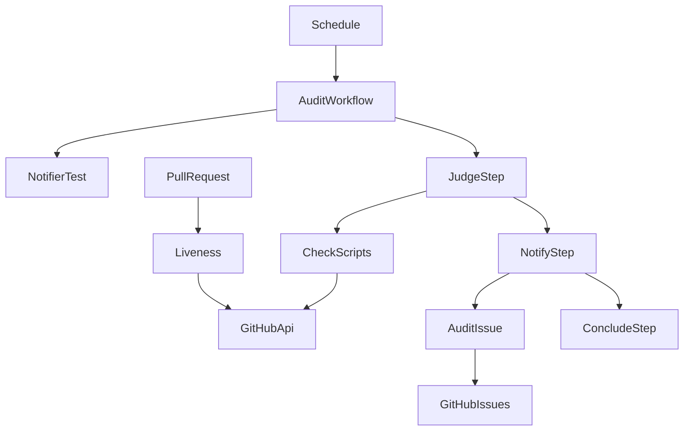
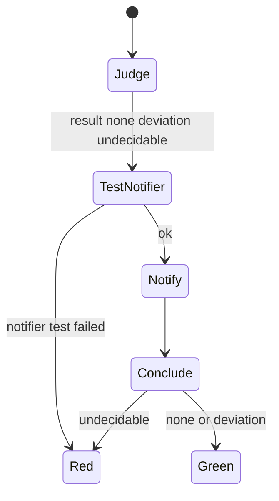

# Design Document

## Overview

**Purpose**: 定期監査(週次監査・カナリア照合)の結果を、リポジトリ所有者に実際に届くIssueで知らせる。あわせて、PRのCIが週次監査の「成功」を条件にしているために起きた行き詰まりを解消する。

**Users**: リポジトリ所有者。コードを読まず、Issueを受けて対処の指示だけを出す。

**Impact**: 監査の判定スクリプトの終了コードを 0 / 1 / 2 の3値に分ける。監査ワークフローは逸脱ありでも成功で終わり、逸脱と故障を別々のIssueで知らせる。PRのCIの死活確認は「成功」ではなく「完了」を見る。audit-automation spec の要件4(死活検知)と要件6-4・6-5(書き込み禁止・失敗終了以外の対処禁止)を置き換える。

### Goals
- 逸脱と故障が、それぞれ固定タイトルのIssue1件で所有者に届く
- 監査が逸脱を見つけても、PRのCIが止まらない
- 文書の「失敗は既定の通知で届く」という誤った前提を訂正する

### Non-Goals
- 判定基準(何を滞留・スキップ・カナリアの失敗とみなすか)の変更
- 定期コンテナスキャンの通知の変更
- Issue操作そのものが失敗した場合の検知
- #342・#346 の個別対応、メトリクス記録(#334)

## Boundary Commitments

### This Spec Owns
- 判定スクリプト4本の終了コード契約(0 = 逸脱なし、1 = 逸脱あり、2 = 判定不能)
- 監査の結果の集約規則と、結果に応じたワークフローの結論
- 監査通知Issue(ラベル `audit`、固定タイトル4種)の起票・追記・クローズ・担当者割り当て
- PRのCIの死活確認の判定条件
- 通知の仕組みに関する監査手順書・README・ワークフロー説明の記述

### Out of Boundary
- 判定スクリプトの判定内容・報告の文面(終了コード以外は変えない)
- `container-scan-issue.sh` と `container-scan-scheduled.yaml`(型は踏襲するが改修しない)
- ラベル `audit` の付いていないIssue、および `audit` 付きでも固定タイトル4種以外のIssue
- 期待一覧 `.github/audit/required-checks.json` の内容
- Issue #310 本文の書き換え(出荷時に訂正のコメントを付けるのは出荷手順で行う)

### Allowed Dependencies
- GitHub REST API(`gh api` / `gh issue` / `gh label`)。認証は `github.token` のみ。secrets は追加しない
- ランナー既定の `bash` / `jq` / `gh`。新しい依存は追加しない
- ランナー既定の環境変数 `GITHUB_REPOSITORY` / `GITHUB_REPOSITORY_OWNER` / `GITHUB_SERVER_URL` / `GITHUB_RUN_ID` / `GITHUB_STEP_SUMMARY`

### Revalidation Triggers
- 終了コード契約の変更: 判定スクリプトを呼ぶ側(監査ワークフロー2本、scan-freshness を使う箇所)を再確認する
- 固定タイトルまたはラベル名の変更: 既に開いているIssueが見つからなくなり、重複起票が起きる
- ワークフローのファイル名 `audit-weekly.yaml` の変更: ci.yaml の死活確認と skipped-required の対象期間の算出が追随を要する
- audit-automation spec を今後改訂する場合: 要件4・6-4・6-5 は本specで置き換え済みであることを前提にする

## KeirekiPro Compliance Check (必須)

- [x] **backend層配置**: N/A(backendを変更しない)
- [x] **frontend境界**: N/A(frontendを変更しない)
- [x] **状態管理**: N/A
- [x] **DBスキーマ**: N/A(マイグレーション無し)
- [x] **依存追加**: 無し(ランナー既定の bash / jq / gh のみ)
- [ ] **ゲート設定**: **変更を必要とする。** 本specの実装は `.github/workflows/` と `.github/scripts/` の変更そのものである。CODEOWNERSにより所有者のApproveが必須で、自律側の編集禁止(`.claude/settings.json` の `Edit(.github/**)` / `Write(.github/**)`)の一時解除も人間に依頼する
- [x] **前提機能の利用可否**: リポジトリは `owner.type=User`・`visibility=public`・`has_issues=true`(2026-09-24 実測)。`issues: write` 権限は既存の container-scan-scheduled.yaml で利用実績がある。GITHUB_TOKEN による担当者割り当てが受け付けられるかは未確認のため、読み戻しでの確認とメンションの併用で設計し、導入時に実地確認する(要件5.3)

## Architecture

### Existing Architecture Analysis
- 監査ワークフロー2本(audit-weekly.yaml、canary-verify.yaml)は読み取り権限のみで、判定スクリプトの自己テストの後に本判定を行い、失敗で終了する
- 判定スクリプトは報告を `GITHUB_STEP_SUMMARY` に書き、逸脱と判定不能をともに exit 1 で返す
- ci.yaml の `detect-changes` ジョブ末尾の「Check audit liveness」ステップが、週次監査の直近の成功から10日以上経っていればPRを失敗させる

### Architecture Pattern & Boundary Map



**Architecture Integration**:
- Selected pattern: 判定・通知・結論の3段に分けるパイプライン。判定は結果を出力するだけで失敗せず、通知は常に動き、結論だけが実行の赤を決める
- Domain/feature boundaries: 判定スクリプトは「何が起きたか」と終了コードだけを持つ。Issueの状態遷移は通知スクリプトだけが持つ。ワークフローは実行の順序と集約だけを持つ
- Existing patterns preserved: 自己テストの後に本判定を行う型、テストをすべて回して最後に集約する型、`gh label create ... || true` による冪等なラベル作成、PATHシムによる `gh` のテスト
- New components rationale: 通知スクリプトは2種類の監査×2種類のIssueの状態遷移を1か所に集めるために要る
- Steering compliance: AI呼び出し無し、外部サービス無し、状態はIssueのみ

### Technology Stack

| Layer | Choice / Version | Role in Feature | Notes |
|-------|------------------|-----------------|-------|
| Infrastructure / Runtime | GitHub Actions `ubuntu-latest` | 監査ワークフローの実行 | 既存と同じ |
| CLI | bash / jq / gh(ランナー既定) | 判定、Issue操作 | 新しい依存無し |

## File Structure Plan

### Directory Structure
```
.github/
├── scripts/
│   ├── audit-issue.sh                 # 新規: 監査通知Issueの状態遷移(起票・追記・クローズ・担当者)
│   └── tests/
│       └── test-audit-issue.sh        # 新規: audit-issue.sh のテスト(PATHシム)
```

### Modified Files
- `.github/scripts/check-audit-scan-freshness.sh` — 終了コード契約の変更(CheckScripts の節を参照)。ヘッダの終了コードの説明と、13行目の通知に関する記述を訂正する
- `.github/scripts/check-audit-dependabot-stuck.sh` — 同上(26行目の通知に関する記述を訂正)
- `.github/scripts/check-audit-skipped-required.sh` — 終了コード契約の変更。ヘッダの終了コードの説明を直す
- `.github/scripts/check-canary-results.sh` — 同上
- `.github/scripts/tests/test-check-audit-scan-freshness.sh` / `test-check-audit-dependabot-stuck.sh` / `test-check-audit-skipped-required.sh` / `test-check-canary-results.sh` — 判定不能ケースの期待終了コードを 1 から 2 に変える(計41件)。逸脱ケースは 1 のまま。各スクリプトに「引数の欠落」「必須環境変数の欠落」「想定外のコマンド失敗」で 2 になるケースを追加する。canary は対象年月の書式不正のケースも追加する
- `.kiro/specs/audit-automation/requirements.md` — 要件4・6-4・6-5 に「audit-notification(#347)で置き換え」の注記を加える(監査証跡。本文は書き換えない)
- `.github/workflows/audit-weekly.yaml` — `issues: write` を追加。判定・通知・結論の3段に組み替える。冒頭コメントの設計前提を訂正する
- `.github/workflows/canary-verify.yaml` — 同上
- `.github/workflows/ci.yaml` — 死活確認のクエリを `status=completed` に替え、メッセージとコメントを「完了」に合わせる
- `doc/開発フロー/監査手順.md` — 22・65・68・73・162・164・169・201・206・216・218・219・455・456行付近の「赤の通知」「通知」の記述を、Issueで届く前提へ書き換える(218・219行のカナリアの「判定側の故障」「実行されていない」は逸脱のIssueに対応づける)。Issueを受けたときの対処、導入時の受信確認手順、残余リスク(Error Handling の節の3点)、「再実行でIssueへの追記が1件増えるのは正常」である旨を追記する
- `README.md` — 81・82行の Mermaid ノードと、114・115行のワークフロー一覧表の説明を、Issueで通知する内容に更新する

## System Flows



**Flow-level decisions**:
- 判定スクリプトの自己テストが失敗したら、本判定を行わずに結果を「判定不能」とする(1.2)
- 判定ステップが想定外に終了して結果が出力されていなければ、通知ステップは「判定不能」として扱う
- 通知スクリプト自身のテストが失敗した場合は通知を行わず、実行は赤で終わる(Out of scope の残余リスク)

### 結果の集約規則

| 各判定スクリプトの終了コード | 項目の結果 |
|---|---|
| 0 | 逸脱なし |
| 1 | 逸脱あり |
| 2、およびそれ以外のすべての値 | 判定不能 |

全体の結果は、判定不能が1つでもあれば「判定不能」、そうでなく逸脱ありが1つでもあれば「逸脱あり」、それ以外は「逸脱なし」(1.3)。判定スクリプトは判定不能が1つあっても最後まで全部実行し、判定できた項目の報告も通知本文に含める。

### Issueの状態遷移

| 結果 | 逸脱のIssue | 判定不能のIssue | 実行の結論 |
|---|---|---|---|
| 逸脱なし | 開いていれば解消の追記をして閉じる | 開いていれば解消の追記をして閉じる | 成功 |
| 逸脱あり | 無ければ起票、あれば追記 | 開いていれば解消の追記をして閉じる | 成功 |
| 判定不能 | 触らない(逸脱の有無が確定しないため) | 無ければ起票、あれば追記 | 失敗 |

## Requirements Traceability

| Requirement | Summary | Components | Interfaces | Flows |
|-------------|---------|------------|------------|-------|
| 1.1 | 3分類 | JudgeStep, CheckScripts | 終了コード契約 | 集約規則 |
| 1.2 | 自己テスト失敗・取得失敗は判定不能 | JudgeStep, CheckScripts | exit 2 | 状態図 |
| 1.3 | 判定不能を優先し、判定できた逸脱も報告 | JudgeStep | 集約規則、報告ファイル | 集約規則 |
| 1.4 | 逸脱なし・ありは成功 | ConcludeStep | result 出力 | 状態遷移表 |
| 1.5 | 判定不能は失敗 | ConcludeStep | result 出力 | 状態遷移表 |
| 1.6 | 判定基準を変えない | CheckScripts | 終了コード以外無変更 | - |
| 2.1 | 逸脱のIssueの起票と担当者 | AuditIssue | `audit-issue.sh` | 状態遷移表 |
| 2.2 | 既存への追記 | AuditIssue | 同上 | 状態遷移表 |
| 2.3 | 本文の内容 | AuditIssue | 本文の構成 | - |
| 2.4 | 逸脱なしで閉じる | AuditIssue | 同上 | 状態遷移表 |
| 2.5 | 承認待ちは逸脱にしない | CheckScripts(dependabot-stuck、既存の判定のまま)、AuditIssue(報告全体を本文に含める) | 報告ファイル | - |
| 3.1 | 故障のIssueの起票と担当者 | AuditIssue | 同上 | 状態遷移表 |
| 3.2 | 既存への追記 | AuditIssue | 同上 | 状態遷移表 |
| 3.3 | 本文に理由・リンク・再実行の方法 | AuditIssue | 本文の構成 | - |
| 3.4 | 判定できたら閉じる | AuditIssue | 同上 | 状態遷移表 |
| 3.5 | Issue操作の失敗で実行を失敗 | AuditIssue, NotifyStep | exit 1 | - |
| 4.1 | 直近の完了した実行を確認 | Liveness | `status=completed` | - |
| 4.2 | 10日以上無ければ失敗 | Liveness | 同上 | - |
| 4.3 | 逸脱あり・判定不能でも完了していれば成功 | Liveness | 同上 | - |
| 4.4 | 未登録・未実行は失敗にしない | Liveness | 404 / 0件の分岐(既存を維持) | - |
| 4.5 | 取得失敗は失敗 | Liveness | 既存の fail closed を維持 | - |
| 4.6 | PRのCIのみ | Liveness | `if: github.event_name == 'pull_request'`(既存を維持) | - |
| 5.1 | 手順書にIssueを受けたときの対処 | Docs | - | - |
| 5.2 | 誤った前提の除去と根拠 | Docs、監査ワークフロー2本の冒頭コメント、CheckScripts のコメント | - | - |
| 5.3 | 導入時の受信確認手順 | Docs | - | Migration |
| 5.4 | 残余リスクの記載 | Docs | - | - |
| 6.1 | AI・外部サービス無し | 全体 | - | - |
| 6.2 | 書き込みはIssue操作のみ | NotifyStep / ConcludeStep(ワークフローの権限), AuditIssue | `issues: write` のみ追加 | - |
| 6.3 | ラベルと固定タイトルで区別 | AuditIssue | ラベル `audit`、固定タイトル4種 | - |
| 6.4 | Issue操作のテスト | AuditIssueTest | PATHシム | Testing |

## Components and Interfaces

| Component | Domain/Layer | Intent | Req Coverage | Key Dependencies (P0/P1) | Contracts |
|-----------|--------------|--------|--------------|--------------------------|-----------|
| CheckScripts | 判定 | 監査項目ごとの判定と報告 | 1.1, 1.2, 1.6, 2.5 | GitHub API (P0) | Batch |
| JudgeStep | ワークフロー | 自己テストと判定の実行、結果の集約 | 1.1〜1.3 | CheckScripts (P0) | Batch |
| AuditIssue | 通知 | 監査通知Issueの状態遷移 | 2.1〜2.5, 3.1〜3.5, 6.2, 6.3 | GitHub Issues API (P0) | Service |
| AuditIssueTest | テスト | AuditIssue の状態遷移の検証 | 6.4 | AuditIssue (P0) | - |
| NotifyStep / ConcludeStep | ワークフロー | 通知の起動と実行の結論 | 1.4, 1.5, 3.5 | AuditIssue (P0) | Batch |
| Liveness | CI | 週次監査の死活確認 | 4.1〜4.6 | GitHub API (P0) | Batch |
| Docs | 文書 | 通知の前提と対処の記述 | 5.1〜5.4 | - | - |

ワークフロー内のステップ(JudgeStep、NotifyStep、ConcludeStep)は `audit-weekly.yaml` と `canary-verify.yaml` に置き、Liveness は `ci.yaml` に置く(File Structure Plan の Modified Files を参照)。

### 判定

#### CheckScripts

| Field | Detail |
|-------|--------|
| Intent | 既存の判定4本。終了コードだけを3値に分ける |
| Requirements | 1.1, 1.2, 1.6, 2.5 |

**Responsibilities & Constraints**
- 判定内容と報告の文面は変えない。変えるのは終了コードの扱いとヘッダの説明コメントだけ
- 終了コード 1 は、逸脱を報告したうえでの明示的な `exit 1` だけが返す。それ以外の失敗はすべて 2 に倒す(意図しない失敗が「逸脱あり=成功」に化けないため。`check-container-scan.sh` 56-61行と同じ考え方):
  - `report_undecidable` は exit 2
  - 引数と必須環境変数の検査を `${n:?}`(失敗すると終了コード1になる)から明示の検査に替え、欠落は exit 2
  - `set -Eeuo pipefail` と `trap 'exit 2' ERR` で、ガードされていないコマンドの失敗を 2 にする
- 報告は従来どおり `GITHUB_STEP_SUMMARY` が指すファイルに追記する(4本とも追記のみで読み戻さないため、一時ファイルへの差し替えは安全)

**Contracts**: Batch [x]

##### Batch / Job Contract
- Trigger: JudgeStep からの起動
- Input: 従来どおりの引数と環境変数
- Output: 終了コード 0(逸脱なし)/ 1(逸脱あり)/ 2(判定不能)。報告は `GITHUB_STEP_SUMMARY` のファイル
- Idempotency: 読み取りのみ

#### JudgeStep

| Field | Detail |
|-------|--------|
| Intent | 判定スクリプトの自己テストと本判定を実行し、結果と報告を1つにまとめる |
| Requirements | 1.1, 1.2, 1.3 |

**Responsibilities & Constraints**
- 判定スクリプトの自己テストが失敗したら本判定を行わず、結果を `undecidable` とし、報告にその旨を書く
- 判定スクリプトごとに `GITHUB_STEP_SUMMARY` を一時ファイルへ向けて起動し、終了後にその内容を本来の Job Summary と報告ファイルの両方へ追記する
- 集約規則(System Flows)に従って全体の結果を決め、ステップ出力 `result` に `none` / `deviation` / `undecidable` を書く
- このステップ自体は常に成功で終わる
- 既存の「Report paused checks」ステップ(audit-weekly.yaml)は維持する

**Contracts**: Batch [x]

##### Batch / Job Contract
- Output: ステップ出力 `result`、報告ファイル `${RUNNER_TEMP}/audit-report.md`

### 通知

#### AuditIssue(`.github/scripts/audit-issue.sh`)

| Field | Detail |
|-------|--------|
| Intent | 監査の種類と結果を受けて、監査通知Issueを起票・追記・クローズする |
| Requirements | 2.1, 2.2, 2.3, 2.4, 2.5, 3.1, 3.2, 3.3, 3.4, 3.5, 6.2, 6.3 |

**Responsibilities & Constraints**
- 操作対象は、ラベル `audit` が付いた open のIssueのうち、タイトルが固定タイトル4種のいずれかに完全一致するものだけ。PR(`pull_request` を持つ項目)とタイトルが一致しないものには触らない
- 固定タイトル:

| kind | 逸脱のIssue | 判定不能のIssue |
|---|---|---|
| `weekly` | `週次監査: 逸脱あり` | `週次監査: 判定不能` |
| `canary` | `カナリア照合: 逸脱あり` | `カナリア照合: 判定不能` |

- 状態遷移は System Flows の表に従う。同じタイトルの open なIssueが複数あれば、警告を出したうえで全部を操作対象にする(container-scan-issue.sh と同じ扱い)
- 起票時にラベル `audit` と担当者 `GITHUB_REPOSITORY_OWNER` を付ける。ラベルは `gh label create audit ... || true` で冪等に作る
- 起票後に担当者を読み戻し、所有者が付いていなければ `::warning::` を出して続行する(割り当ては黙って無視されうるため。本文のメンションが代わりの経路になる)
- 本文の構成:
  - 冒頭: 所有者へのメンション(`@<owner>`)と、結果の1行要約
  - 実行へのリンク: `${GITHUB_SERVER_URL}/${GITHUB_REPOSITORY}/actions/runs/${GITHUB_RUN_ID}`
  - 報告: 報告ファイルの内容(判定項目ごとの報告。承認待ちの一覧も含む)。60,000文字を超える場合は切り詰め、実行のJob Summaryを見るよう案内する(Issue本文の上限 65,536文字に収めるため)
  - 対処の案内: 監査手順書の該当節へのリンク
  - 判定不能のIssueのみ: 再実行の方法。`weekly` は「失敗した実行を Re-run で再実行する。新規の手動実行は使わない(skipped-required の対象期間に穴が空くため)」、`canary` は「Re-run と新規の手動実行のどちらでもよい」
- 解消の追記は「今回の実行で解消を確認した」旨と実行へのリンク

**Dependencies**
- Inbound: NotifyStep — 起動 (P0)
- External: GitHub Issues API(`gh api` / `gh issue` / `gh label`)— Issueの検索と操作 (P0)

**Contracts**: Service [x]

##### Service Interface
```
audit-issue.sh <kind> <result> <report-file>
  kind:        weekly | canary
  result:      none | deviation | undecidable
  report-file: 報告のMarkdownファイル(result=none のときは空でもよい)
  env:         GH_TOKEN, GITHUB_REPOSITORY, GITHUB_REPOSITORY_OWNER,
               GITHUB_SERVER_URL, GITHUB_RUN_ID
  exit 0: 状態遷移表どおりの操作をすべて終えた(担当者が付かなかった場合を含む)
  exit 1: 引数・環境変数の不正、Issueの検索・起票・追記・クローズのいずれかの失敗
```
- Preconditions: `issues: write` の権限を持つトークン
- Postconditions: 各タイトルの open なIssueの有無が状態遷移表と一致する
- Invariants: 固定タイトル4種以外のIssue・PRを変更しない。同じ結果で2回実行しても、追記が1件増えるだけで起票は増えない

#### NotifyStep / ConcludeStep

| Field | Detail |
|-------|--------|
| Intent | 結果に応じて AuditIssue を起動し、実行の結論を決める |
| Requirements | 1.4, 1.5, 3.5 |

**Responsibilities & Constraints**
- ワークフローの権限に `issues: write` を加える(他の書き込み権限は加えない)
- ステップの順序: Checkout → (audit-weekly のみ)Report paused checks → Judge → Test notifier → Notify → Conclude
- Judge を先に置くのは、通知スクリプトのテストが落ちても、判定結果を Job Summary に残すため
- Test notifier: `if: always()`。`test-audit-issue.sh` を実行する。失敗すれば Notify は動かず、Conclude で失敗する
- Notify: `if: always() && steps.test-notifier.outcome == 'success'`。`steps.judge.outputs.result` が空なら `undecidable` として AuditIssue を起動する。AuditIssue が exit 1 ならこのステップは失敗する
- Conclude: `if: always()`。結果が `none` または `deviation` で、かつ Notify が成功していれば成功、それ以外は失敗
- concurrency・timeout・トリガーは既存のまま

### CI

#### Liveness(ci.yaml の Check audit liveness)

| Field | Detail |
|-------|--------|
| Intent | 週次監査が10日以内に完了しているかを確かめる |
| Requirements | 4.1, 4.2, 4.3, 4.4, 4.5, 4.6 |

**Responsibilities & Constraints**
- クエリを `repos/${GITHUB_REPOSITORY}/actions/workflows/audit-weekly.yaml/runs?status=completed&per_page=1` に替える。結論は問わない
- 判定に使う日時は `created_at` のまま(10日のしきい値の意味を変えないため)
- 404(未登録)と0件は通過、取得・解釈の失敗は失敗、`pull_request` のみで動作、という既存の分岐を維持する
- メッセージとコメントの「成功」を「完了」に改め、導入手順の「workflow_dispatch で成功を1件作る」記述を「完了を1件作る」に改める

## Error Handling

### Error Strategy
- 判定側のエラー(API失敗、応答の解釈不能、自己テストの失敗、契約外の終了コード)はすべて「判定不能」に集約し、故障のIssueと実行の赤で表す
- 通知側のエラー(Issue操作の失敗)は実行の赤で表す。通知は出ない(受け入れた残余リスク)
- 担当者の割り当てが無視された場合は警告のみ。メンションで通知の経路を保つ

### 受け入れる残余リスク(監査手順書に記載する)
1. 通知スクリプトのテスト失敗・Issue操作の失敗では通知が出ない。この赤の実行は、skipped-required の対象期間の下限にもなる(前回の実行を結論を問わず下限にするため)。気づいたときは、その実行を Re-run すれば窓の穴は埋まる
2. 死活確認は「完了した実行があるか」だけを見る。キャンセルされた実行や、通知スクリプトのテストで落ちた実行も「完了」に数えるため、判定が行われたかどうかは死活確認では分からない。判定の有無は故障のIssueで見る
3. 担当者の割り当てとメンションが両方とも届かない場合の経路は、所有者が自分のリポジトリをWatchしていることに依存する。導入時の受信確認で、所有者のWatch設定もあわせて確かめる

### Monitoring
- 監査の稼働は Liveness が見る(10日以内の完了)
- 故障の継続は故障のIssueへの毎回の追記で見える

## Testing Strategy

### Unit Tests(`test-audit-issue.sh`、PATHシムで `gh` を差し替える)
- 状態遷移表の9通り(結果3種 × 既存Issueの有無の組み合わせ)で、起票・追記・クローズの呼び出しが表どおりになる(2.1, 2.2, 2.4, 3.1, 3.2, 3.4)
- 判定不能のとき、逸脱のIssueに一切触らない
- PR、ラベル付きでもタイトルが一致しないIssue、他の kind のタイトルのIssueに触らない(6.3)
- 同じタイトルの open なIssueが複数あれば、全部を操作対象にする
- 本文に、所有者へのメンション、実行へのリンク、報告の内容、手順書へのリンクが入る。判定不能の本文には kind ごとの再実行の方法が入る(2.3, 3.3)
- 報告が60,000文字を超えると切り詰められ、案内が入る
- 起票後に担当者が付いていないと警告を出して exit 0(割り当ての読み戻し)
- 検索・起票・追記・クローズのいずれかの失敗で exit 1。ラベル作成の失敗では exit 0(3.5)
- 引数不正(未知の kind・result、報告ファイルの欠落)と環境変数の欠落で exit 1

### 既存テストの期待値の変更
- 判定スクリプト4本のテストで、判定不能ケースの期待終了コードを 1 から 2 に変える(計41件)。逸脱ケースと逸脱なしのケースは変えない(1.2)
- 追加するケース: 各スクリプトで「引数の欠落→2」「必須環境変数の欠落→2」「想定外のコマンド失敗→2」。canary は「対象年月の書式不正→2」
- アサーションの意図的な変更にあたるため、Git規約に従ってPR本文に `Test-Change-Justification` を記載する。escape-hatch の機械検知の対象(frontend・backend のテスト)ではないが、変更の理由を監査証跡として残すため

### Integration(導入時の実地確認)
- マージ後に audit-weekly を手動実行する。現状は #342・#346 の滞留があるため「逸脱あり」になり、逸脱のIssueが起票され、所有者に通知と担当者の割り当てが届くことを人間が確認する(5.3)
- 同じ実行で結論が成功になり、その後のPRで Liveness が通ることを確認する(4.3)
- 行き詰まっていた #346 のCIを再実行し、`detect-changes` が通ることを確認する

## Security Considerations
- 追加する書き込み権限は `issues: write` だけ。`contents: write`・`pull-requests: write` は加えない(6.2)
- Issue本文には判定スクリプトの報告(PR番号・チェック名・ワークフロー名など、リポジトリ内で公開済みの情報)だけを載せる。secrets は扱わない
- 報告ファイルはランナーの一時領域に置き、リポジトリに書き込まない

## Migration Strategy
- 実装は1本のPRで出す(判定の3値化、通知、死活確認の変更は、どれか1つだけでは行き詰まりの解消と通知の両立ができないため)
- このPR自身のCIはPR側の ci.yaml で判定されるため、変更後の Liveness(完了を見る)で通る
- マージ後: (1) audit-weekly を手動実行して受信を確認する、(2) #346 のCIが通ることを確認する、(3) Issue #310 に「既定の失敗通知で届くという前提は誤りだった。#347 で訂正した」旨のコメントを付ける
- ロールバック: PRをrevertすれば従来の挙動に戻る。作られた監査通知Issueは手動で閉じる
