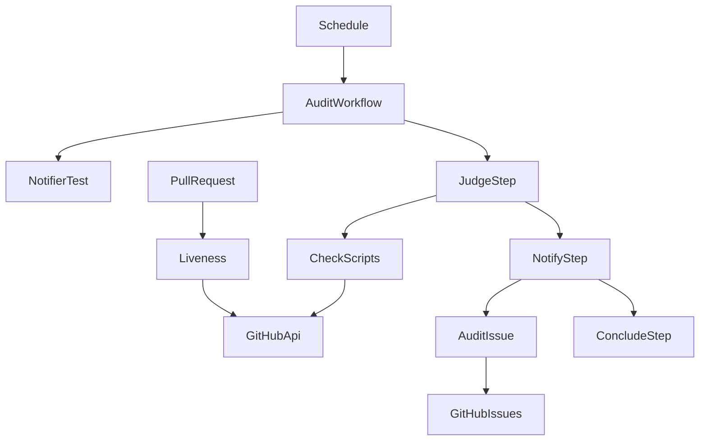
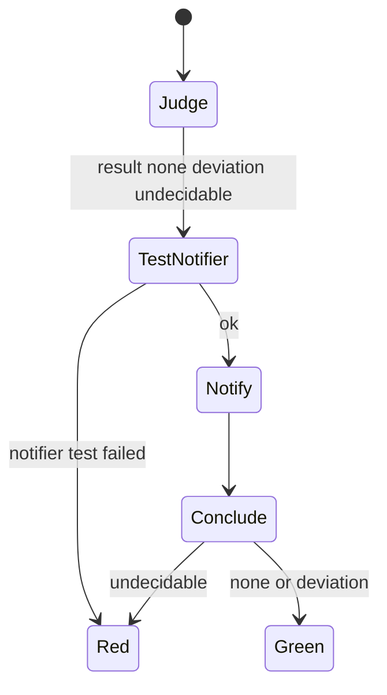

# 設計

## 概要

この設計は、定期監査(週次監査・カナリア照合)の結果を、リポジトリ所有者に実際に届くIssueで知らせる。あわせて、この設計は、PRのCIが週次監査の「成功」を条件にしているために起きた行き詰まりを解消する。

この設計の利用者は、リポジトリ所有者である。所有者は、コードを読まず、Issueを受けて対処の指示だけを出す。

この設計は、監査の判定スクリプトの終了コードを 0 / 1 / 2 の3値に分ける。監査ワークフローは、逸脱ありでも成功で終わり、逸脱と故障を別々のIssueで知らせる。PRのCIの死活確認は、「成功」ではなく「完了」を見る。この設計は、audit-automation spec の要件4(死活検知)と要件6-4・6-5(書き込み禁止・失敗終了以外の対処禁止)を置き換える。

## 作るものと作らないもの

### 作るもの

この設計は、次のことを目指す。

- 逸脱と故障が、それぞれ固定タイトルのIssue1件で所有者に届く
- 監査が逸脱を見つけても、PRのCIが止まらない
- 文書の「失敗は既定の通知で届く」という誤った前提を訂正する

この spec は、次のものを持つ。

- 判定スクリプト4本の終了コードの契約(0 = 逸脱なし、1 = 逸脱あり、2 = 判定不能)
- 監査の結果の集約規則と、結果に応じたワークフローの結論
- 監査通知Issue(ラベル `audit`、固定タイトル4種)の起票・追記・クローズ・担当者の割り当て
- PRのCIの死活確認の判定条件
- 通知の仕組みに関する、監査手順書・README・ワークフローの説明の記述

### 作らないもの

この設計は、次のことを目指さない。

- 判定基準(何を滞留・スキップ・カナリアの失敗とみなすか)の変更
- 定期コンテナスキャンの通知の変更
- Issue操作そのものが失敗した場合の検知
- #342・#346 の個別対応、メトリクス記録(#334)

この spec は、次のものを持たない。

- 判定スクリプトの判定内容・報告の文面。この設計は、判定スクリプトの終了コード以外を変えない
- `container-scan-issue.sh` と `container-scan-scheduled.yaml`。この設計は、この2つの型を踏襲するが、この2つを改修しない
- ラベル `audit` の付いていないIssue、および `audit` 付きでも固定タイトル4種以外のIssue
- 期待一覧 `.github/audit/required-checks.json` の内容
- Issue #310 本文の書き換え。出荷時に #310 に訂正のコメントを付けることは、出荷手順で行う

## 使う既存の仕組み

- GitHub REST API(`gh api` / `gh issue` / `gh label`)。この設計は、認証に `github.token` だけを使い、secrets を追加しない
- ランナー既定の `bash` / `jq` / `gh`。この設計は、新しい依存を追加しない
- ランナー既定の環境変数 `GITHUB_REPOSITORY` / `GITHUB_REPOSITORY_OWNER` / `GITHUB_SERVER_URL` / `GITHUB_RUN_ID` / `GITHUB_STEP_SUMMARY`

## 設計を見直すきっかけ

- 終了コードの契約を変えるとき。判定スクリプトを呼ぶ側(監査ワークフロー2本、scan-freshness を使う箇所)を確かめ直す
- 固定タイトルまたはラベル名を変えるとき。既に開いているIssueが見つからなくなり、重複した起票が起きる
- ワークフローのファイル名 `audit-weekly.yaml` を変えるとき。ci.yaml の死活確認と、skipped-required の対象期間の算出が追随する必要がある
- audit-automation spec を今後改訂するとき。改訂する側は、audit-automation spec の要件4・6-4・6-5 がこの spec で置き換え済みであることを前提にする

## プロジェクトの決まりを守っているか

- 新しいライブラリの追加: 新しいライブラリは無い。この設計は、ランナー既定の bash / jq / gh だけを使う
- 品質チェックの設定: **この設計は、品質チェックの設定の変更を必要とする。** この spec の実装は、`.github/workflows/` と `.github/scripts/` の変更そのものである。CODEOWNERSにより、所有者のApproveが必須である。Claude は、自律側の編集禁止(`.claude/settings.json` の `Edit(.github/**)` / `Write(.github/**)`)の一時解除も、人間に依頼する
- 使う外部の機能がこのリポジトリで使えるか: リポジトリは `owner.type=User`・`visibility=public`・`has_issues=true` である(2026-09-24 実測)。`issues: write` の権限は、既存の container-scan-scheduled.yaml で利用実績がある。GITHUB_TOKEN による担当者の割り当てが受け付けられるかは、未確認である。そのため、この設計は、読み戻しでの確認とメンションを併用し、導入時に実地で確かめる(要件5.3)
- 関係のない項目: backend のコードを置く層(backendを変更しない)、frontend の機能ごとの境界(frontendを変更しない)、frontend の状態の持ち方、データベースの表の形(マイグレーション無し)

## 全体の構成


```mermaid
graph TB
    Schedule --> AuditWorkflow
    AuditWorkflow --> NotifierTest
    AuditWorkflow --> JudgeStep
    JudgeStep --> CheckScripts
    CheckScripts --> GitHubApi
    JudgeStep --> NotifyStep
    NotifyStep --> AuditIssue
    AuditIssue --> GitHubIssues
    NotifyStep --> ConcludeStep
    PullRequest --> Liveness
    Liveness --> GitHubApi
```

図の `Liveness` は、部品の節の Check audit liveness を指す。

- 選んだ型: この設計は、判定・通知・結論の3段に分けるパイプラインを使う。判定は結果を出力するだけで失敗せず、通知は常に動き、結論だけが実行の赤を決める
- 部品の責任の分け方: 判定スクリプトは、「何が起きたか」と終了コードだけを持つ。Issueの状態遷移は、通知スクリプトだけが持つ。ワークフローは、実行の順序と集約だけを持つ
- 守る既存の作り: 自己テストの後に本判定を行う型、テストをすべて回して最後に集約する型、`gh label create ... || true` による冪等なラベル作成、PATHシムによる `gh` のテストを守る。冪等とは、何度実行しても結果が変わらないことを指す。PATHシムとは、PATH の先頭に置いた偽物のコマンドで本物の `gh` を置き換えることを指す
- 新しい部品が要る理由: 通知スクリプトは、2種類の監査×2種類のIssueの状態遷移を1か所に集めるために要る
- steering との整合: この設計は、AIを呼ばず、外部サービスを使わず、状態をIssueだけに持つ

**使う技術**:
- 実行環境: GitHub Actions `ubuntu-latest`。監査ワークフローの実行を受け持つ。既存と同じである
- コマンド: bash / jq / gh(ランナー既定)。判定とIssue操作を受け持つ。新しい依存は無い

## ファイルの構成

Claude が新しく作るファイル:

```
.github/
├── scripts/
│   ├── audit-issue.sh                 # 新規: 監査通知Issueの状態遷移(起票・追記・クローズ・担当者)
│   └── tests/
│       └── test-audit-issue.sh        # 新規: audit-issue.sh のテスト(PATHシム)
```

Claude が変えるファイル:

- `.github/scripts/check-audit-scan-freshness.sh`: 終了コードの契約を変える(CheckScripts の節を参照)。ヘッダの終了コードの説明と、13行目の通知に関する記述を訂正する
- `.github/scripts/check-audit-dependabot-stuck.sh`: `check-audit-scan-freshness.sh` と同じく、終了コードの契約を変え、ヘッダの終了コードの説明を訂正する。26行目の通知に関する記述も訂正する
- `.github/scripts/check-audit-skipped-required.sh`: 終了コードの契約を変える。ヘッダの終了コードの説明を直す
- `.github/scripts/check-canary-results.sh`: `check-audit-skipped-required.sh` と同じく、終了コードの契約を変え、ヘッダの終了コードの説明を直す
- `.github/scripts/tests/test-check-audit-scan-freshness.sh` / `test-check-audit-dependabot-stuck.sh` / `test-check-audit-skipped-required.sh` / `test-check-canary-results.sh`: 判定不能ケースの期待終了コードを 1 から 2 に変える(計41件)。逸脱ケースは 1 のままにする。各スクリプトのテストに、「引数の欠落」「必須環境変数の欠落」「想定外のコマンド失敗」で 2 になるケースを追加する。canary のテストには、対象年月の書式不正のケースも追加する
- `.kiro/specs/audit-automation/requirements.md`: 要件4・6-4・6-5 に「audit-notification(#347)で置き換え」の注記を加える。この注記は監査証跡であり、本文は書き換えない
- `.github/workflows/audit-weekly.yaml`: `issues: write` を追加する。ステップを判定・通知・結論の3段に組み替える。冒頭コメントの設計前提を訂正する
- `.github/workflows/canary-verify.yaml`: `audit-weekly.yaml` と同じく、`issues: write` を追加し、ステップを判定・通知・結論の3段に組み替え、冒頭コメントの設計前提を訂正する
- `.github/workflows/ci.yaml`: 死活確認のクエリを `status=completed` に替え、メッセージとコメントを「完了」に合わせる
- `doc/開発フロー/監査手順.md`: 22・65・68・73・162・164・169・201・206・216・218・219・455・456行付近の「赤の通知」「通知」の記述を、Issueで届く前提へ書き換える(218・219行のカナリアの「判定側の故障」「実行されていない」は、逸脱のIssueに対応づける)。Issueを受けたときの対処、導入時の受信確認手順、残余リスク(失敗したときの扱いの節の、受け入れる残余リスクの3点)、「再実行でIssueへの追記が1件増えるのは正常」である旨を追記する
- `README.md`: 81・82行の Mermaid ノードと、114・115行のワークフロー一覧表の説明を、Issueで通知する内容に更新する

## 処理の流れ


```mermaid
stateDiagram-v2
    [*] --> Judge
    Judge --> TestNotifier: result none deviation undecidable
    TestNotifier --> Red: notifier test failed
    TestNotifier --> Notify: ok
    Notify --> Conclude
    Conclude --> Green: none or deviation
    Conclude --> Red: undecidable
```

- 判定スクリプトの自己テストが失敗したら、判定ステップは本判定を行わずに、結果を「判定不能」とする(要件1.2)
- 判定ステップが想定外に終了して結果が出力されていなければ、通知ステップは、結果を「判定不能」として扱う
- 通知スクリプト自身のテストが失敗したら、ワークフローは通知を行わず、実行は赤で終わる(requirements.md の範囲の節で、この spec で決めないこととした残余リスク)

### 結果の集約規則

| 各判定スクリプトの終了コード | 項目の結果 |
|---|---|
| 0 | 逸脱なし |
| 1 | 逸脱あり |
| 2、およびそれ以外のすべての値 | 判定不能 |

全体の結果は、判定不能が1つでもあれば「判定不能」、そうでなく逸脱ありが1つでもあれば「逸脱あり」、それ以外は「逸脱なし」である(要件1.3)。判定ステップは、判定不能が1つあっても、判定スクリプトを最後まで全部実行する。通知の本文には、判定できた項目の報告も含める。

### Issueの状態遷移

| 結果 | 逸脱のIssue | 判定不能のIssue | 実行の結論 |
|---|---|---|---|
| 逸脱なし | 開いていれば解消の追記をして閉じる | 開いていれば解消の追記をして閉じる | 成功 |
| 逸脱あり | 無ければ起票、あれば追記 | 開いていれば解消の追記をして閉じる | 成功 |
| 判定不能 | 触らない(逸脱の有無が確定しないため) | 無ければ起票、あれば追記 | 失敗 |

## 部品

この設計の部品は、次の表のとおりである。

| 部品 | 領域 | 役割 | 対応する要件 | 主に使う部品 | 呼び出し方の種類 |
|---|---|---|---|---|---|
| CheckScripts | 判定 | 監査項目ごとの判定と報告 | 1.1, 1.2, 1.6, 2.5 | GitHub API (P0) | 一括処理 |
| JudgeStep | ワークフロー | 自己テストと判定の実行、結果の集約 | 1.1〜1.3 | CheckScripts (P0) | 一括処理 |
| AuditIssue | 通知 | 監査通知Issueの状態遷移 | 2.1〜2.5, 3.1〜3.5, 6.2, 6.3 | GitHub Issues API (P0) | サービス |
| AuditIssueTest | テスト | AuditIssue の状態遷移の検証 | 6.4 | AuditIssue (P0) | - |
| NotifyStep / ConcludeStep | ワークフロー | 通知の起動と実行の結論 | 1.4, 1.5, 3.5 | AuditIssue (P0) | 一括処理 |
| Check audit liveness | CI | 週次監査の死活確認 | 4.1〜4.6 | GitHub API (P0) | 一括処理 |
| Docs | 文書 | 通知の前提と対処の記述 | 5.1〜5.4 | - | - |

Claude は、ワークフロー内のステップ(JudgeStep、NotifyStep、ConcludeStep)を `audit-weekly.yaml` と `canary-verify.yaml` に置き、Check audit liveness を `ci.yaml` に置く(ファイルの構成の節の「Claude が変えるファイル」を参照)。

### CheckScripts(終了コードだけを3値に分ける、既存の判定スクリプト4本)

対応する要件: 1.1, 1.2, 1.6, 2.5

**役割**: CheckScripts は、既存の判定スクリプト4本である。この設計は、判定スクリプトの終了コードだけを3値に分ける。判定スクリプトは、判定内容と報告の文面を変えない。この設計が変えるのは、終了コードの扱いとヘッダの説明コメントだけである。判定スクリプトは、報告を従来どおり `GITHUB_STEP_SUMMARY` が指すファイルに追記する。4本とも報告を追記するだけで読み戻さないため、JudgeStep が報告先を一時ファイルへ差し替えても安全である。

**呼び出し方(一括処理)**:
- 起動: JudgeStep が判定スクリプトを起動する
- 入力: 従来どおりの引数と環境変数
- 出力: 終了コード 0(逸脱なし)/ 1(逸脱あり)/ 2(判定不能)。報告は `GITHUB_STEP_SUMMARY` のファイルに書く
- 何度実行しても同じか: 判定スクリプトは読み取りだけを行う

**失敗したとき**: 判定スクリプトは、逸脱を報告したうえでの明示的な `exit 1` でだけ、終了コード 1 を返す。判定スクリプトは、それ以外の失敗をすべて 2 に倒す。意図しない失敗が「逸脱あり=成功」に化けないためである。これは `check-container-scan.sh` 56-61行と同じ考え方である。判定スクリプトは、次の3つで終了コード 2 を返す。
- `report_undecidable` は exit 2 で終える
- 判定スクリプトは、引数と必須環境変数の検査を `${n:?}`(失敗すると終了コード1になる)から明示の検査に替え、欠落を exit 2 にする
- 判定スクリプトは、`set -Eeuo pipefail` と `trap 'exit 2' ERR` で、ガードされていないコマンドの失敗を 2 にする

### JudgeStep(判定スクリプトの自己テストと本判定を実行し、結果と報告を1つにまとめるワークフローのステップ)

対応する要件: 1.1, 1.2, 1.3

**役割**:
- 判定スクリプトの自己テストが失敗したら、JudgeStep は本判定を行わず、結果を `undecidable` とし、報告にその旨を書く
- JudgeStep は、判定スクリプトごとに `GITHUB_STEP_SUMMARY` を一時ファイルへ向けて判定スクリプトを起動し、終了後にその内容を本来の Job Summary と報告ファイルの両方へ追記する
- JudgeStep は、集約規則(処理の流れの節)に従って全体の結果を決め、ステップ出力 `result` に `none` / `deviation` / `undecidable` を書く
- JudgeStep 自体は、常に成功で終わる
- この設計は、既存の「Report paused checks」ステップ(audit-weekly.yaml)を維持する

**呼び出し方(一括処理)**:
- 出力: ステップ出力 `result`、報告ファイル `${RUNNER_TEMP}/audit-report.md`

### AuditIssue(監査の種類と結果を受けて、監査通知Issueを起票・追記・クローズするスクリプト `.github/scripts/audit-issue.sh`)

対応する要件: 2.1, 2.2, 2.3, 2.4, 2.5, 3.1, 3.2, 3.3, 3.4, 3.5, 6.2, 6.3

**役割**: AuditIssue は、監査の種類と結果を受けて、監査通知Issueを起票・追記・クローズする。
- 操作の対象: AuditIssue が操作するのは、ラベル `audit` が付いた open のIssueのうち、タイトルが固定タイトル4種のいずれかに完全一致するものだけである。AuditIssue は、PR(`pull_request` を持つ項目)と、タイトルが一致しないIssueに触らない
- 固定タイトル:

| kind | 逸脱のIssue | 判定不能のIssue |
|---|---|---|
| `weekly` | `週次監査: 逸脱あり` | `週次監査: 判定不能` |
| `canary` | `カナリア照合: 逸脱あり` | `カナリア照合: 判定不能` |

- 状態遷移: AuditIssue は、処理の流れの節の「Issueの状態遷移」の表に従う。同じタイトルの open なIssueが複数あれば、AuditIssue は警告を出したうえで、全部を操作の対象にする(container-scan-issue.sh と同じ扱い)
- 起票: AuditIssue は、起票時にラベル `audit` を付ける。AuditIssue は、担当者 `GITHUB_REPOSITORY_OWNER` を、起票の直後に REST(`POST repos/{repo}/issues/{n}/assignees`)で追加する。`gh issue create --assignee` は、担当者を解決できないと起票そのものが失敗しうるためである(実装時のレビューで判明)。AuditIssue は、ラベルを `gh label create audit ... || true` で冪等に作る
- 担当者の読み戻し: AuditIssue は、起票後に担当者を読み戻し、所有者が付いていなければ `::warning::` を出して続行する。割り当ては黙って無視されうるためである。その場合は、本文のメンションが代わりの経路になる
- 本文の構成:
  - 冒頭: 所有者へのメンション(`@<owner>`)と、結果の1行要約
  - 実行へのリンク: `${GITHUB_SERVER_URL}/${GITHUB_REPOSITORY}/actions/runs/${GITHUB_RUN_ID}`
  - 報告: 報告ファイルの内容(判定項目ごとの報告。承認待ちの一覧も含む)。報告が60,000文字を超える場合、AuditIssue は報告を切り詰め、実行のJob Summaryを見るよう案内する(Issue本文の上限 65,536文字に収めるため)
  - 対処の案内: 監査手順書の該当節へのリンク
  - 判定不能のIssueだけ: 再実行の方法。`weekly` は「失敗した実行を Re-run で再実行する。新規の手動実行は使わない(skipped-required の対象期間に穴が空くため)」、`canary` は「Re-run と新規の手動実行のどちらでもよい」
- 解消の追記: AuditIssue は、「今回の実行で解消を確認した」旨と、実行へのリンクを追記する

**使う部品**:
- 呼ぶ側: NotifyStep が AuditIssue を起動する(P0)
- 外部: GitHub Issues API(`gh api` / `gh issue` / `gh label`)。AuditIssue は、Issueの検索と操作にこの API を使う(P0)

**呼び出し方(サービス)**:

```
audit-issue.sh <kind> <result> <report-file>
  kind:        weekly | canary
  result:      none | deviation | undecidable
  report-file: 報告のMarkdownファイル(result=none のときは空でもよい)
  env:         GH_TOKEN, GITHUB_REPOSITORY, GITHUB_REPOSITORY_OWNER,
               GITHUB_SERVER_URL, GITHUB_RUN_ID
  exit 0: 状態遷移表どおりの操作をすべて終えた(担当者が付かなかった場合を含む)
  exit 1: 引数・環境変数の不正、Issueの検索・起票・追記・クローズのいずれかの失敗
```

- 呼ぶ前に成り立つ条件: 呼ぶ側は、`issues: write` の権限を持つトークンを渡す
- 呼んだあとに成り立つ条件: 各タイトルの open なIssueの有無が、状態遷移表と一致する
- 常に成り立つ条件: AuditIssue は、固定タイトル4種以外のIssue・PRを変更しない。同じ結果で2回実行しても、追記が1件増えるだけで、起票は増えない

### NotifyStep / ConcludeStep(結果に応じて AuditIssue を起動し、実行の結論を決めるワークフローのステップ)

対応する要件: 1.4, 1.5, 3.5

**権限**: この設計は、ワークフローの権限に `issues: write` を加える。この設計は、他の書き込み権限を加えない。

**いつ動くか**:
- ステップの順序: Checkout → (audit-weekly のみ)Report paused checks → Judge → Test notifier → Notify → Conclude
- Judge を先に置く理由: 通知スクリプトのテストが落ちても、判定結果を Job Summary に残すためである
- Test notifier: `if: always()`。このステップは `test-audit-issue.sh` を実行する。このステップが失敗すれば、Notify は動かず、Conclude で実行が失敗する
- Notify: `if: always() && steps.test-notifier.outcome == 'success'`。このステップは、`steps.judge.outputs.result` が空なら `undecidable` として AuditIssue を起動する。AuditIssue が exit 1 なら、このステップは失敗する
- Conclude: `if: always()`。このステップは、結果が `none` または `deviation` で、かつ Notify が成功していれば成功し、それ以外は失敗する
- concurrency・timeout・トリガー: この設計は、既存のまま変えない

### Check audit liveness(週次監査が10日以内に完了しているかを確かめる ci.yaml のステップ)

対応する要件: 4.1, 4.2, 4.3, 4.4, 4.5, 4.6

**役割**: このステップは、週次監査が10日以内に完了しているかを確かめる。

**変える点**:
- 問い合わせ: この設計は、このステップの問い合わせを `repos/${GITHUB_REPOSITORY}/actions/workflows/audit-weekly.yaml/runs?status=completed&per_page=1` に替える。このステップは、実行の結論を問わない
- 判定に使う日時: このステップは、`created_at` をそのまま使う(10日のしきい値の意味を変えないため)
- 既存の分岐: この設計は、404(未登録)と0件は通過、取得・解釈の失敗は失敗、`pull_request` のみで動作、という既存の分岐を維持する
- 文面: この設計は、このステップのメッセージとコメントの「成功」を「完了」に改め、導入手順の「workflow_dispatch で成功を1件作る」という記述を「完了を1件作る」に改める

## 失敗したときの扱い

### 方針

- 判定側のエラー(API失敗、応答の解釈不能、自己テストの失敗、契約外の終了コード)は、すべて「判定不能」に集約する。ワークフローは、判定不能を故障のIssueと実行の赤で表す
- 通知側のエラー(Issue操作の失敗)は、実行の赤で表す。このとき、通知は出ない(受け入れた残余リスク)
- 担当者の割り当てが無視された場合、AuditIssue は警告だけを出す。メンションが通知の経路を保つ

### 受け入れる残余リスク(監査手順書に記載する)

1. 通知スクリプトのテストの失敗と、Issue操作の失敗では、通知が出ない。この赤の実行は、skipped-required の対象期間の下限にもなる(前回の実行を、結論を問わず下限にするため)。所有者が気づいたときは、その実行を Re-run すれば、窓の穴は埋まる
2. 死活確認は、「完了した実行があるか」だけを見る。死活確認は、キャンセルされた実行や、通知スクリプトのテストで落ちた実行も「完了」に数えるため、判定が行われたかどうかは死活確認では分からない。所有者は、判定の有無を故障のIssueで見る
3. 担当者の割り当てとメンションが両方とも届かない場合、所有者に届く経路は、所有者が自分のリポジトリをWatchしていることに依存する。導入時の受信確認で、人間は所有者のWatch設定もあわせて確かめる

### 死活の見張り

- 監査の稼働は、Check audit liveness が見る(10日以内の完了)
- 故障の継続は、故障のIssueへの毎回の追記で見える

## テストの方針

### 単体テスト(`test-audit-issue.sh`、PATHシムで `gh` を差し替える)

- 状態遷移表の9通り(結果3種 × 既存Issueの有無の組み合わせ)で、起票・追記・クローズの呼び出しが表どおりになる(要件2.1, 2.2, 2.4, 3.1, 3.2, 3.4)
- 判定不能のとき、AuditIssue が逸脱のIssueに一切触らない
- AuditIssue が、PR、ラベル付きでもタイトルが一致しないIssue、他の kind のタイトルのIssueに触らない(要件6.3)
- 同じタイトルの open なIssueが複数あれば、AuditIssue が全部を操作の対象にする
- 本文に、所有者へのメンション、実行へのリンク、報告の内容、手順書へのリンクが入る。判定不能の本文には、kind ごとの再実行の方法が入る(要件2.3, 3.3)
- 報告が60,000文字を超えると切り詰められ、案内が入る
- 起票後に担当者が付いていないと、AuditIssue が警告を出して exit 0 で終える(割り当ての読み戻し)
- 検索・起票・追記・クローズのいずれかの失敗で exit 1 になる。ラベル作成の失敗では exit 0 になる(要件3.5)
- 引数の不正(未知の kind・result、報告ファイルの欠落)と環境変数の欠落で exit 1 になる

### 既存テストの期待値の変更

- Claude は、判定スクリプト4本のテストで、判定不能ケースの期待終了コードを 1 から 2 に変える(計41件)。Claude は、逸脱ケースと逸脱なしのケースを変えない(要件1.2)
- 追加するケース: 各スクリプトで「引数の欠落→2」「必須環境変数の欠落→2」「想定外のコマンド失敗→2」。canary は「対象年月の書式不正→2」
- この変更は、アサーションの意図的な変更にあたる。そのため、Claude は、Git規約に従って PR本文に `Test-Change-Justification` を記載する。このテストは escape-hatch の機械検知の対象(frontend・backend のテスト)ではないが、変更の理由を監査証跡として残すためである

### 結合テスト(導入時の実地確認)

- マージ後に、audit-weekly を手動実行する。今は #342・#346 の滞留があるため、結果は「逸脱あり」になり、逸脱のIssueが起票される。人間は、所有者に通知と担当者の割り当てが届くことを確かめる(要件5.3)
- 人間は、同じ実行で結論が成功になり、その後のPRで Check audit liveness が通ることを確かめる(要件4.3)
- 人間は、行き詰まっていた #346 のCIを再実行し、`detect-changes` が通ることを確かめる

## 安全

- この設計が追加する書き込み権限は、`issues: write` だけである。この設計は、`contents: write`・`pull-requests: write` を加えない(要件6.2)
- AuditIssue は、Issue本文に、判定スクリプトの報告(PR番号・チェック名・ワークフロー名など、リポジトリ内で公開済みの情報)だけを載せる。この設計は、secrets を扱わない
- JudgeStep は、報告ファイルをランナーの一時領域に置き、リポジトリに書き込まない

## 既存の構成

- 監査ワークフロー2本(audit-weekly.yaml、canary-verify.yaml)は、読み取りの権限だけを持つ。この2本は、判定スクリプトの自己テストの後に本判定を行い、失敗で終了する
- 判定スクリプトは、報告を `GITHUB_STEP_SUMMARY` に書き、逸脱と判定不能をともに exit 1 で返す
- ci.yaml の `detect-changes` ジョブの末尾の「Check audit liveness」ステップは、週次監査の直近の成功から10日以上経っていれば、PRを失敗させる

## 要件との対応

| 要件 | 要約 | 部品 | 呼び出し方 | 処理の流れ |
|---|---|---|---|---|
| 1.1 | 3分類 | JudgeStep, CheckScripts | 終了コードの契約 | 集約規則 |
| 1.2 | 自己テスト失敗・取得失敗は判定不能 | JudgeStep, CheckScripts | exit 2 | 状態図 |
| 1.3 | 判定不能を優先し、判定できた逸脱も報告 | JudgeStep | 集約規則、報告ファイル | 集約規則 |
| 1.4 | 逸脱なし・ありは成功 | ConcludeStep | result 出力 | 状態遷移表 |
| 1.5 | 判定不能は失敗 | ConcludeStep | result 出力 | 状態遷移表 |
| 1.6 | 判定基準を変えない | CheckScripts | 終了コード以外無変更 | - |
| 2.1 | 逸脱のIssueの起票と担当者 | AuditIssue | `audit-issue.sh` | 状態遷移表 |
| 2.2 | 既存への追記 | AuditIssue | 同上 | 状態遷移表 |
| 2.3 | 本文の内容 | AuditIssue | 本文の構成 | - |
| 2.4 | 逸脱なしで閉じる | AuditIssue | 同上 | 状態遷移表 |
| 2.5 | 承認待ちは逸脱にしない | CheckScripts(dependabot-stuck、既存の判定のまま)、AuditIssue(報告全体を本文に含める) | 報告ファイル | - |
| 3.1 | 故障のIssueの起票と担当者 | AuditIssue | 同上 | 状態遷移表 |
| 3.2 | 既存への追記 | AuditIssue | 同上 | 状態遷移表 |
| 3.3 | 本文に理由・リンク・再実行の方法 | AuditIssue | 本文の構成 | - |
| 3.4 | 判定できたら閉じる | AuditIssue | 同上 | 状態遷移表 |
| 3.5 | Issue操作の失敗で実行を失敗 | AuditIssue, NotifyStep | exit 1 | - |
| 4.1 | 直近の完了した実行を確認 | Check audit liveness | `status=completed` | - |
| 4.2 | 10日以上無ければ失敗 | Check audit liveness | 同上 | - |
| 4.3 | 逸脱あり・判定不能でも完了していれば成功 | Check audit liveness | 同上 | - |
| 4.4 | 未登録・未実行は失敗にしない | Check audit liveness | 404 / 0件の分岐(既存を維持) | - |
| 4.5 | 取得失敗は失敗 | Check audit liveness | 既存の fail closed を維持 | - |
| 4.6 | PRのCIのみ | Check audit liveness | `if: github.event_name == 'pull_request'`(既存を維持) | - |
| 5.1 | 手順書にIssueを受けたときの対処 | Docs | - | - |
| 5.2 | 誤った前提の除去と根拠 | Docs、監査ワークフロー2本の冒頭コメント、CheckScripts のコメント | - | - |
| 5.3 | 導入時の受信確認手順 | Docs | - | 移行 |
| 5.4 | 残余リスクの記載 | Docs | - | - |
| 6.1 | AI・外部サービス無し | 全体 | - | - |
| 6.2 | 書き込みはIssue操作のみ | NotifyStep / ConcludeStep(ワークフローの権限), AuditIssue | `issues: write` のみ追加 | - |
| 6.3 | ラベルと固定タイトルで区別 | AuditIssue | ラベル `audit`、固定タイトル4種 | - |
| 6.4 | Issue操作のテスト | AuditIssueTest | PATHシム | テストの方針 |

fail closed とは、判定できないときに成功に倒さず失敗にすることを指す。

## 移行

- Claude は、実装を1本のPRで出す。判定の3値化、通知、死活確認の変更は、どれか1つだけでは、行き詰まりの解消と通知を両立できないためである
- このPR自身のCIは、PR側の ci.yaml で判定される。そのため、このPRのCIは、変更後の Check audit liveness(完了を見る)で通る
- マージ後: (1) audit-weekly を手動実行して受信を確認する、(2) #346 のCIが通ることを確認する、(3) Issue #310 に「既定の失敗通知で届くという前提は誤りだった。#347 で訂正した」旨のコメントを付ける
- ロールバック: PRをrevertすれば、従来の挙動に戻る。作られた監査通知Issueは、手動で閉じる
