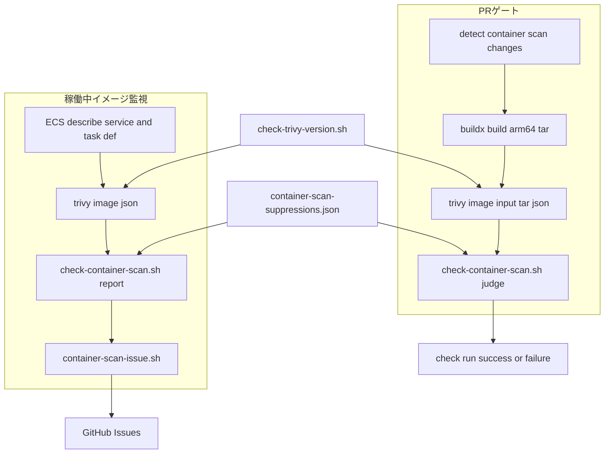
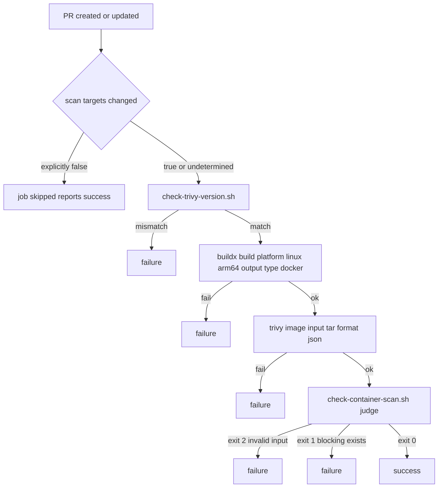
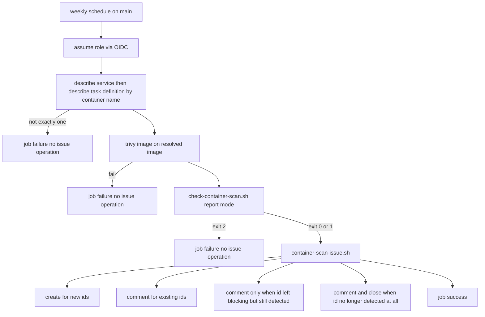

# Technical Design Document

## Overview

**Purpose**: 本番コンテナイメージのOS層と同梱アーティファクト(fat jar)に含まれる既知の脆弱性を、マージ前と稼働後の両方で検知する。dockerレーンのDependabot PRは所有者の承認なしに自動マージされるため、CVEを持ち込む更新を止めるものが現在は存在しない。

**Users**: リポジトリ所有者。日々の利用はマージ前の失敗と週次のIssue起票という形で現れ、月次監査で検知能力そのものを点検する。

**Impact**: `.github/workflows/` にワークフローを2本、`.github/scripts/` に検査スクリプトを3本とそのテストを追加する。必須ステータスチェックが**18本から20本**に増える(`container-scan` と `container-scan-script-tests`)。抑制の記録が新しい所有者承認対象として加わる。**本番イメージに含まれる Java 依存の脆弱性も判定対象に入るため、`backend/**` を変更するPRは常にこのゲートを通る。** アプリケーションコードと `terraform/` は変更しない。

### Goals

- 修正版のある CRITICAL / HIGH の脆弱性を含む本番イメージの変更を、マージ前に止める
- 検査対象を本番と同じ ARM64 のイメージに固定し、その事実を機械的に検証する
- 検出した脆弱性を、止めたものも止めなかったものも含めて全件提示する
- 抑制を期限付きにし、追加に所有者の承認を要求する
- 検査が実行されていない・完了していない状態を、成功と区別する
- 検知が失われていないことを月次で点検できるようにする

### Non-Goals

- 開発用イメージ(`docker/backend/Dockerfile` ほか)のスキャン
- 脆弱性の修正そのもの、および本番への反映(**タスク1.2 の baseline が非0だった場合の依存更新も含む。別Issueとして扱う**)
- ECRのpush時スキャン(`terraform/main.tf:146`)の設定変更と結果の監査対象化
- 既存の `docker-smoke` の削除・置換
- frontendの依存(本番イメージに含まれない)
- `terraform/` の変更(IAMロールは terraform 管理外であり、変更経路が異なる)

## Boundary Commitments

### This Spec Owns

- `container-scan` チェックの合否判定と、その判定基準
- 抑制の記録の形式・検証・有効期限の解釈
- 週次スキャンが起票・追記・クローズするIssueのライフサイクル
- 検査対象のアーキテクチャの検証と、Trivy のバージョンの検証
- カナリア `container-vuln` の内容と、その期待結果
- 上記に関する運用文書の記述

### Out of Boundary

- IAMロールとポリシー(terraform 管理外。AWSコンソールでの人手管理)
- ECRのライフサイクル設定と push 時スキャン
- `docker-smoke` の責務(全Dockerfileのビルド可否の確認)
- Dependabot の docker レーンの設定と auto-merge の条件
- 必須ステータスチェックへの登録(リポジトリ所有者の操作)
- カナリアの生成基盤(`canary.yaml` の発火条件、`create_canary()` の実装、PRの後始末手順)
- `rerun-approval-gated-checks.yaml` の対象一覧。`container-scan` の結論は所有者の承認状態で変わらないため、承認後の再実行を必要としない。抑制の記録の承認は既存の CODEOWNERS と `check-escape-hatches.sh:196` が担い、新しいゲートチェックを設けないため対象一覧への追加は不要

### Allowed Dependencies

- `aquasecurity/setup-trivy`(SHA固定)と Trivy 本体(バージョン明示指定)
- `docker/setup-buildx-action`、`aws-actions/configure-aws-credentials`、`dorny/paths-filter`、`actions/checkout`(いずれも既存参照の再利用、SHA固定)
- 既存の CODEOWNERS と `check-escape-hatches.sh` による所有者承認の強制
- 既存の `update-pr-branches.yaml` によるブランチ最新化
- AWS: `ecs:DescribeServices` / `ecs:DescribeTaskDefinition` / ECR の pull 権限

### Revalidation Triggers

- Trivy の JSON スキーマの変更(`.Results[]?.Vulnerabilities[]?` の `VulnerabilityID` / `Severity` / `PkgName` / `InstalledVersion` / `FixedVersion`、`.Metadata.ImageConfig.architecture`)
- `backend-deploy.yaml` のタグ付け規則またはビルド対象プラットフォームの変更
- ECS のクラスタ名・サービス名・**コンテナ名の変更、またはコンテナの追加**
- `create_canary()` の引数仕様の変更
- 本番のCPUアーキテクチャの変更
- リポジトリのリネームまたは移管(OIDC の `sub` が不変形式に変わり、信頼ポリシーが一致しなくなる)

## KeirekiPro Compliance Check

- [x] **backend層配置**: N/A。`backend/` のコードを変更しない
- [x] **frontend境界**: N/A。`frontend/` を変更しない
- [x] **状態管理**: N/A。アプリケーションの状態を扱わない
- [x] **DBスキーマ**: N/A。マイグレーションを含まない
- [x] **依存追加**: `package.json` / `libs.versions.toml` への追加は無い。リポジトリにとって新規のアクション参照は `aquasecurity/setup-trivy` の1つ。`docker/setup-buildx-action`(`backend-deploy.yaml:51` で使用中。同じSHAに揃える)、`dorny/paths-filter`、`aws-actions/configure-aws-credentials`、`actions/checkout` は既存参照の再利用。いずれもSHA固定で、Dependabot の github-actions レーンが更新対象にする
- [x] **ゲート設定**: **該当する。** `.github/workflows/` へのワークフロー追加(2本)、`.github/scripts/` へのスクリプト追加(3本+テスト3本)、および既存のゲート設定ファイル2件の変更(`create-canary-prs.sh` へのカナリア1種追加と件数記述、`canary.yaml` の冒頭コメントの種類数。いずれも Requirement 6 のため)を含む。判定ロジックを持つ既存ファイル(`check-*.sh` 本体、`ci.yaml`、`guardrails.yaml` 等)は変更しない。CODEOWNERS(`/.github/ @DogisRiki`)と `check-escape-hatches.sh:196` の双方により、PRは所有者の承認まで止まる
- [x] **前提機能の利用可否**: arm64 ランナーは実機で確認した。OIDC は提供条件と設定の実測までを行い、実挙動の確認は統合の確認 7.2 に残る。
  - **リポジトリ属性**: `owner.type: User` / `visibility: public`(`gh api repos/DogisRiki/KeirekiPro`)
  - **arm64 標準ランナー(実測・タスク1.1)**: **個人アカウント所有のパブリックリポジトリで実際に起動する。**
    公式ドキュメントはアカウント種別に言及していなかったため実機で確認した。
    run `32106160197` の `probe-arm64` ジョブが `ubuntu-24.04-arm` で成功し、
    `uname -m` = `aarch64` / `nproc` = 4 / メモリ 15Gi / Ubuntu 24.04.4 LTS。
    run の `createdAt` `2026-08-18T06:15:30Z` に対しジョブの `startedAt` は `06:15:35Z` で、
    キューの待ちは5秒。`completedAt` は `06:15:37Z`。
    切り分け用に併置した `ubuntu-latest` の control ジョブも同時に成功しており、
    ワークフロー自体の発火に問題が無いことも確認済み。
    したがって退避案(`ubuntu-latest` + `setup-qemu-action`)は採らない
  - **schedule からの OIDC**: `sub` は `repo:DogisRiki/KeirekiPro:ref:refs/heads/main` となり
    信頼ポリシーの Statement 3 に合致する(カスタマイズ無しを
    `gh api .../actions/oidc/customization/sub` で実測)。公式ドキュメントが `schedule` を
    名指ししていないため2つの規則の合成であり、**実挙動の実測は統合の確認 7.2 で行う**。
    これは週次スキャン(Requirement 2)のみに関わり、PRゲート(Requirement 1)は
    AWS 認証を使わないため影響を受けない

## Architecture

### Existing Architecture Analysis

- 必須ステータスチェックにするワークフローに `paths:` を付けない。ワークフローごとスキップされると required status check が Pending のまま残り全PRが止まる。ジョブ単位のスキップは Success 扱いになる(`dependency-review.yaml:15-17`)
- **ジョブ単位のスキップが Success になることは、fail-closed の向きを反転させる。** 先行ジョブを失敗させると後続は skipped になり、必須チェックは緑で報告される。したがって判定不能時は先行ジョブを失敗させず、検査を実行する側へ倒す(要件 1.9)
- **`always()` は使わない。** キャンセルされた run でもジョブが実行され、必須チェックに失敗が残ってマージがブロックされる。`dependency-review.yaml:106` が `!cancelled()` を使っているのと同じ理由
- 変更ファイル一覧は `dorny/paths-filter` の `list-files: json`。`shell` 形式は特殊文字を含むパスを黙って取りこぼす(`ci.yaml:41-45`)
- 検査スクリプトは `.github/scripts/check-*.sh` と `.github/scripts/tests/test-check-*.sh` を対で置き、ワークフローは**テスト実行 → 本体実行**の順にする(`dependency-gate.yaml:37-38`)。**ただし `dependency-gate.yaml` はパスフィルタも `if:` も持たず全PRで実行されるため、この保護が常に効く。** 本設計はジョブがパス条件付きになるため、スクリプト自身の変更でテストが走らない穴を、**必須ステータスチェックに登録した別ジョブ**で塞ぐ。登録しないチェックは赤でも auto-merge が進むため、ゲートとして働かない
- アクション参照は `owner/repo@<40桁hex>` + 空白 + `#` + バージョン(`check-action-pinning.sh:69`)
- ジョブ名は必須チェック名になる。`ci.yaml:22` の `detect-changes` は登録済みの名前(`基盤構築手順.md:159`)であり、同名のジョブを別ワークフローに置くと同一SHAに同名の check-run が2つ生まれる。`rerun-approval-gated-checks.yaml:5-7` がこの衝突を問題として明記している。`terraform-plan.yaml:21` が `detect-terraform-changes` と固有名にしているのと同じ扱いにする
- **`docker-smoke` は `Dockerfile.prod` を含む全Dockerfileを amd64 でビルドする**(`ci.yaml:249`)。本設計は `Dockerfile.prod` を arm64 で組み立てるため、**`Dockerfile.prod` のビルドは両者で重複する**。それでも `docker-smoke` を残すのは、(1) 必須ステータスチェックの削除を行わない前提(要件の Out of scope)、(2) 検証するアーキテクチャが異なり、amd64 固有の破綻は `docker-smoke` でしか捉えられないため。重複するのは1つのDockerfileのビルドに限られ、両ジョブは並列に走るためマージ待ち時間の合計は増えない

### Architecture Pattern & Boundary Map



**Architecture Integration**:

- **選択したパターン**: 「検出」と「判定」を分離する。Trivy は脆弱性の検出だけを担い、何を許すかはリポジトリのスクリプトが決める。既存の `check-dependency-additions.sh` / `check-escape-hatches.sh` と同じ型
- **境界**: PRゲートと稼働中イメージ監視はイメージの入手方法と抑制の適用モードだけが異なり、判定は同一スクリプトを共有する
- **保たれる既存パターン**: paths-filter によるジョブ単位スキップ、テスト先行の fail-closed、SHA固定、`GITHUB_STEP_SUMMARY` への Markdown 出力
- **新規要素の理由**: 判定を自前に持つのは、Trivy に抑制を渡すと抑制された件が出力から消えて要件 3.1 を満たせないため、および `.trivyignore.yaml` が EXPERIMENTAL で「後方互換を保たずに変わりうる」と公式が明記しているため

**依存の向き**: ワークフロー → スクリプト → jq / Trivy の出力。スクリプトはワークフローを参照しない。判定スクリプトは GitHub API を呼ばない(Issue 操作は別スクリプトが持つ)。

### Technology Stack

| Layer | Choice / Version | Role in Feature | Notes |
|-------|------------------|-----------------|-------|
| Infrastructure / Runtime | GitHub Actions `ubuntu-24.04-arm`(PRゲート)/ `ubuntu-latest`(週次) | 実行環境 | arm64 はネイティブビルドのため。タスク1.1で利用可否を実機確認 |
| Build | `docker/setup-buildx-action`(`backend-deploy.yaml:51` と同じSHA)+ `docker buildx build` | arm64 単一プラットフォームの tar を生成 | `docker` ドライバは `type=docker` エクスポータに非対応のため buildx が必須 |
| Scanner | `aquasecurity/setup-trivy@81e514348e19b6112ce2a7e3ecbafe19c1e1f567` # v0.3.1 + Trivy `0.74.0` | 脆弱性の検出 | **`version` 入力の既定値は `'latest'` で Trivy 本体は固定されない。明示指定が必須。** `cache:` 入力が対象にするのは Trivy バイナリのみで、脆弱性DBには効かない |
| Evaluation | bash + jq | 合否判定・抑制の適用・全件提示 | ランナー同梱。追加インストール無し |
| AWS | `aws-actions/configure-aws-credentials`(SHA固定)+ OIDC | 稼働中イメージの特定と取得 | 週次のみ。`environment:` を指定しない(`sub` が変わるため) |

## File Structure Plan

### Directory Structure

```
.github/
├── container-scan-suppressions.json   # 抑制の記録。CODEOWNERS の /.github/ で所有者承認必須
├── workflows/
│   ├── container-scan.yaml            # PRゲート。必須ステータスチェック container-scan
│   └── container-scan-scheduled.yaml  # 週次の稼働中イメージ監視。schedule + workflow_dispatch
└── scripts/
    ├── check-container-scan.sh        # 判定・抑制の適用・全件提示・起票対象の書き出し
    ├── check-trivy-version.sh         # 実行時のTrivyバージョンと指定値の突き合わせ
    ├── container-scan-issue.sh        # 週次のIssue起票・追記・クローズ
    └── tests/
        ├── test-check-container-scan.sh
        ├── test-check-trivy-version.sh
        └── test-container-scan-issue.sh
```

### Modified Files

- `.github/scripts/create-canary-prs.sh` — カナリアを1種追加(`container-vuln`)。内容は下記「カナリアの内容」を参照。**冒頭の種類数(`:5` の「3種」。現状すでに実態5種とずれているため6種に直す)、冒頭の番号付きリスト、末尾の件数出力(`:217` の「5件」→「6件」)を更新する**(要件 7.11)
- `.github/workflows/canary.yaml` — 冒頭コメントの種類数(`:3` の「3種」)
- `README.md` — ワークフロー一覧表に2行追加(要件 7.1)、Mermaid 図の `s1` ノードのラベルに1項目追加。ノードや subgraph は増やさない
- `doc/開発フロー/監査手順.md` — 次を追加・更新する
  - 月次「自動更新の対象外になっているバージョン固定の確認」の表に Trivy を追加(要件 7.2)。確認対象は**両ワークフローの `env.TRIVY_VERSION`**
  - 「自動チェックの一覧(監査対象)」に2行追加(要件 7.3)。この表は `| 種類 | 実体 | 何を防ぐか |` の3列(`監査手順.md:333`)で、「何を防ぐか」列にはそれぞれ次を書く。PRゲート: 「本番イメージのOS層と同梱 fat jar に、修正版のある CRITICAL/HIGH の脆弱性を持ち込む変更がマージされること。既存の依存も対象で、`dependency-review`(そのPRで新しく増えた分だけを見る)とは補完の関係にある」。稼働中イメージ監視: 「マージ後に公表された脆弱性が、稼働中のイメージについて誰にも気づかれないまま残ること」
  - 月次カナリアの期待失敗の表に `container-vuln` を追加(要件 7.4)。件数記述も更新(要件 7.11)
  - **カナリア `container-vuln` の確認手順に、次の3分岐を書く(要件 6.3)**: `container-scan` ジョブの結論が `failure` なら正常。`success` かつ `GITHUB_STEP_SUMMARY` に脆弱性の表があれば「実行されたが失敗しなかった」、`skipped` または summary が空なら「実行されなかった」。後者2つはいずれも検出漏れとして扱い、別々の異常として記録する
  - 週次に「稼働中イメージ監視の確認」を追加(要件 7.5)。見るのは2点。(1) **直近の実行が7日以内に存在するか**。存在しなければ `schedule` の遅延・スキップにあたるため `workflow_dispatch` で手動実行する。(2) その実行の結論が `success` か。**結論は脆弱性の有無に左右されず、検査を完走できたかだけを表す**ため、`failure` はイメージの特定・取得の失敗か終了コード2(検査不能)を意味する
  - **手動キャンセル時の指示を、要件 7.6 で追加する「docker PR の出口の説明」と同じ節に置く(要件 7.12)**。監査手順は週次・月次に読む文書であり、「マージ前に」という指示を監査の節に置くと読まれるタイミングが噛み合わないため、赤や異常の場でその場参照される節に寄せる。**これも出口A・出口Bの表の外(上記の新しい見出しの下)に置く。** 内容は「チェックの実行を手動でキャンセルしたときは、マージ前に `container-scan` を再実行する。手動キャンセルでは `!cancelled()` によりジョブが skipped となり Success として報告され、かつ後続のイベントが発火しないため、このケースだけは機構で塞げない(close→reopen はトリガの `reopened` により再検査されるため対象外)」
  - docker PR の出口の説明に、脆弱性の検出以外で赤になった場合の見分け方と原因ごとの対応を追加(要件 7.6)。**出口A・出口Bの表(`監査手順.md:148-151`)には行を足さず、表の直後に別の見出しとして書く。** 出口A/Bは「脆弱性で赤になったPRをどう終わらせるか」の2択であり、今回加えるのは「そもそも脆弱性以外の理由で赤い場合の切り分け」であって選択肢ではないため。この構成なら `監査手順.md:146` の「出口は次の2つ」は追加後も正しく、変更しない(要件 7.11)。表に行を足す構成を採る場合は、同行の件数も合わせること
  - 出口B(「抑制設定を入れてマージする」)の記述を、本 spec が導入する `.github/container-scan-suppressions.json` による期限付き抑制を指すように書き換え、判断基準は要件 7.9 で新設する節へのリンクにする。現状の出口Bは抑制の実体を持たない
  - Issueの自動クローズと、自動で閉じなかった場合の扱いを追加(要件 7.7)
  - 検知した脆弱性への対応手順と、抑制を使う場合の判断基準の節を新設(要件 7.9)
  - IAMポリシーの実物確認と、抑制追加時の承認手順を追加(要件 7.12)
- `doc/開発フロー/基盤構築手順.md` — 「7. Required status checks の指定」の一覧に `container-scan` と `container-scan-script-tests` を追加し、それぞれ報告実績が出たあとに登録する旨を書く(要件 7.8)。**この2つは登録の時期が異なる**(下記「人間の作業」#4 と #5)。本文でも「`container-scan-script-tests` は報告実績が出しだい、`container-scan` は baseline が0件になったあと」と書き分ける。本数表記を18→20に更新(`:157` と `:180` の2箇所、要件 7.11)
- `CLAUDE.md` — 抑制の記録が「見かけの合格」を作る手段になりうることと、所有者の承認が要ること(要件 7.10)。あわせて、`container-scan` の実行を自律側からキャンセルしないこと(キャンセルすると skipped = Success として報告され、検査を行わないまま緑が残る)

### カナリアの内容

`create-canary-prs.sh` に追加するカナリア `container-vuln` は、**`create_canary()` を使わない。** ヘルパーは `printf '%s\n' "$content" > "$file"` でテキスト1ファイルしか書けず(`:60`)、今回はバイナリを含む2ファイルを1コミットに入れる必要があるため。`vulnerable-dep`(`:172-215`)と同じくインラインのブロックとして書く。

| ファイル | 内容 |
|---|---|
| `backend/canary-vuln.jar` | スクリプトが生成する zip。`META-INF/maven/org.apache.logging.log4j/log4j-core/pom.properties` に `groupId` / `artifactId` / `version=2.14.1` を書く。Trivy はこの pom.properties から GAV を特定するため、sha1 照合に落ちず java-db の内容に依存しない |
| `docker/backend/Dockerfile.prod` | 実行ステージの `COPY --from=builder …` の直後に `COPY canary-vuln.jar /app/canary-vuln.jar` を1行追加 |

期待結果は `CVE-2021-44228` / `CRITICAL` / `FixedVersion` 非空 が `blocking` に入り、`container-scan` が赤になること。

- jar の生成はランナー同梱の手段(`python3` の `zipfile` など)で行い、生成に失敗したらその場で `::error::` を出して `exit 1` する
- **Dockerfile への1行挿入も同様にガードする。** 挿入後に `grep -q` で反映を確認し、一致しなければ `::error::`(「`Dockerfile.prod` の実行ステージに挿入できませんでした。`COPY --from=builder` の行が変わっていないか確認してください」)を出して `exit 1` する。**空振りしたまま緑のPRが作られると、月次監査は要件 6.3 の3分岐で「実行されたが失敗しなかった」= 検出漏れと記録し、カナリア側の故障がゲート側の故障に化ける**(`vulnerable-dep` の `grep` ガード `:186-192` と同じ理由。そのコメントも「原因が分かるのは翌月になるため、ここで即座に止める」と述べている)
- CVE と「修正版あり」の確認日をスクリプト内のコメントに残し、`vulnerable-dep` と同様「アドバイザリが取り下げ・格下げされたら版を選び直す」旨も書く
- `backend/.dockerignore` は `*.jar` を一律除外しないため、`backend/canary-vuln.jar` はビルドコンテキストに入り `COPY canary-vuln.jar` が成立する
- **jar をリポジトリに同梱することによる本番イメージへの影響は無い。** カナリアPRはマージされない(`create-canary-prs.sh:34` は auto-merge を付けず、本文に「マージ禁止」と書き、次回実行時に既存のカナリアPRを close する)。jar はカナリアのブランチにのみ存在し、main には入らない
- **副作用**: `docker/**/Dockerfile*` に該当するため `docker-smoke`(timeout 45分)も同時に走る。監査手順のカナリア表には `container-scan` が赤になることだけを期待失敗として記載する

## System Flows

### PRゲートの判定



`detect-container-scan-changes` は判定不能を失敗にせず `run=true` を出力する。`container-scan` の条件は `!cancelled()` を含む形にし、先行ジョブ自体が異常終了した場合も検査を実行する。**ジョブがスキップされて緑になる経路を、`run == 'false'` が明示的に出力された場合(要件 1.8)だけに限定する。**

### 週次のIssueライフサイクル



**週次の run の結論は「稼働中イメージを特定し、取得し、検査を完走できたか」だけを表す。** 脆弱性の有無は Issue と `GITHUB_STEP_SUMMARY` が運ぶ。脆弱性がある限り常時赤になると、要件 7.5 の監査項目「予定どおり実行され成功しているか」が常時 NG を指し、要件 2.5 が守ろうとしている「検査不能を見逃さない」信号がノイズに埋もれるため。

## Requirements Traceability

| Requirement | Summary | Components | Interfaces | Flows |
|-------------|---------|------------|------------|-------|
| 1.1 | 対象の変更で検査する | container-scan.yaml | paths-filter の対象3件 | PRゲート |
| 1.2 | 修正版あり CRITICAL/HIGH かつ非抑制で止める | check-container-scan.sh | 終了コード1 | PRゲート |
| 1.3 | 修正版なしでは止めない | check-container-scan.sh | `blocking` の定義 | PRゲート |
| 1.4 | 有効期限内の抑制では止めない | check-container-scan.sh | `blocking` の定義 | PRゲート |
| 1.5 | CRITICAL/HIGH 以外では止めない | check-container-scan.sh | `blocking` の定義 | PRゲート |
| 1.6 | 完了・該当0件・他の失敗事由なしで成功 | check-container-scan.sh, container-scan.yaml | 終了コード0 | PRゲート |
| 1.7 | 本番と同じ実行環境向けを検査 | container-scan.yaml, check-container-scan.sh | `--platform linux/arm64` + architecture アサート | PRゲート |
| 1.8 | 対象外の変更ではスキップして成功 | container-scan.yaml | `run == 'false'` のときのみスキップ | PRゲート |
| 1.9 | 変更範囲を判定できないなら実行する | container-scan.yaml | 判定不能時は `run=true`、`!cancelled()` | PRゲート |
| 1.10 | 30分以内 | container-scan.yaml | `timeout-minutes: 30` | PRゲート |
| 1.11 | 完了しないなら失敗 | container-scan.yaml, check-container-scan.sh | `set -euo pipefail` + タイムアウト + 終了コード2 | PRゲート |
| 1.12 | 所要時間を実行ログに残す | container-scan.yaml | 区間ごとの `::notice::` | PRゲート |
| 2.1 | 週1回の再検査 | container-scan-scheduled.yaml | `schedule` | 週次 |
| 2.2 | 新規のIDでIssue起票 | container-scan-issue.sh | `gh issue create` | 週次 |
| 2.3 | 既存のIDでは追記 | container-scan-issue.sh | `gh issue comment` | 週次 |
| 2.4 | 検出されなくなったらクローズ | container-scan-issue.sh | `detected` に無いときのみ close | 週次 |
| 2.5 | 完了しないなら失敗として残す | container-scan-scheduled.yaml | 終了コード2 でIssue操作を行わずジョブ失敗 | 週次 |
| 2.6 | 手動実行できる | container-scan-scheduled.yaml | `workflow_dispatch` | 週次 |
| 3.1 | 全件を抑制の別が分かる形で提示 | check-container-scan.sh | `judge` / `report` の両モードで表を出す | 両方 |
| 3.2 | 失敗の原因を特定できる形で示す | check-container-scan.sh | 表の「判定」列 + `::error::` | PRゲート |
| 4.1 | 期限・対象・理由が欠けた抑制を受け付けない | check-container-scan.sh | `judge` モードでの検証 | PRゲート |
| 4.2 | 期限切れは 1.4 の対象外 | check-container-scan.sh | 日付比較 | PRゲート |
| 4.3 | 記録が読めないなら失敗 | check-container-scan.sh | `judge` モードで終了コード2 | PRゲート |
| 4.4 | 監視は抑制を判定に用いない | check-container-scan.sh | `report` モード | 週次 |
| 4.5 | 抑制の変更は所有者承認なしにマージ不可 | 配置(`.github/` 配下) | CODEOWNERS + escape-hatch | — |
| 5.1 | 外部部品を不変の参照で固定 | 両ワークフロー | SHA固定 | — |
| 5.2 | ツール本体のバージョンを明示指定 | 両ワークフロー | `env.TRIVY_VERSION` + `setup-trivy` の `version:` | — |
| 5.3 | 実行時のバージョン不一致は失敗 | check-trivy-version.sh | 完全一致の突き合わせ | 両方 |
| 5.4 | 採用の根拠をリポジトリ内に残す | design.md の Security Considerations | — | — |
| 6.1 | 脆弱性を含む変更を月1回用意 | create-canary-prs.sh | カナリア `container-vuln` | 月次 |
| 6.2 | PRゲートを実行し結果を残す | canary.yaml | PR作成による発火 | 月次 |
| 6.3 | 失敗しない場合と実行されない場合を区別 | 監査手順.md | ジョブの結論と summary の有無による3分岐 | 月次 |
| 7.1 | READMEの一覧表とMermaid図 | README.md | 表2行 + `s1` ノードのラベル1項目 | — |
| 7.2 | 監査手順のバージョン固定の表 | 監査手順.md | 両ワークフローの `env.TRIVY_VERSION` | — |
| 7.3 | 監査手順の自動チェックの一覧 | 監査手順.md | 「自動チェックの一覧(監査対象)」 | — |
| 7.4 | 月次点検の確認手順 | 監査手順.md | カナリアの期待失敗の表 + 6.3 の3分岐 | 月次 |
| 7.5 | 週次スキャンの実行確認 | 監査手順.md | 週次の項目 | 週次 |
| 7.6 | 非脆弱性の赤の見分け方と対応 | 監査手順.md | docker PR の出口の説明 | — |
| 7.7 | Issueのクローズの扱い | 監査手順.md | 週次の項目 | 週次 |
| 7.8 | 必須チェックの登録手順 | 基盤構築手順.md | 「7. Required status checks の指定」 | — |
| 7.9 | 脆弱性への対応手順と抑制の判断基準 | 監査手順.md | 新設の節 | — |
| 7.10 | CLAUDE.md への記載 | CLAUDE.md | 抑制と「見かけの合格」 | — |
| 7.11 | 件数記述の更新 | 基盤構築手順.md, 監査手順.md, create-canary-prs.sh, canary.yaml | 18→20、カナリア 3種/5件→6種/6件 | — |
| 7.12 | その他の人間の作業 | 監査手順.md, CLAUDE.md | IAMポリシーの確認、抑制追加時の承認、手動キャンセル時の `container-scan` の再実行(置き場所は要件 7.6 の節。自律側の禁止は CLAUDE.md) | — |

## Components and Interfaces

`container-scan-script-tests` は要件を直接実現するのではなく、要件を実現するスクリプトの健全性を守る補助ゲートである。その Req Coverage 欄は「守る対象」を指す。

| Component | Layer | Intent | Req Coverage | Key Dependencies (P0/P1) | Contracts |
|-----------|-------|--------|--------------|--------------------------|-----------|
| container-scan.yaml | CI | PRゲートの実行と発火条件 | 1.1, 1.6〜1.12, 5.1, 5.2 | paths-filter (P0), buildx (P0), setup-trivy (P0) | Batch |
| container-scan-script-tests(同ワークフロー内のジョブ) | CI | 判定スクリプトの単体テストをゲートとして実行 | 1.2〜1.7, 2.2〜2.4, 3.1, 3.2, 4.1〜4.4, 5.3 | jq (P0) | Batch |
| container-scan-scheduled.yaml | CI | 稼働中イメージの週次再検査 | 2.1, 2.5, 2.6, 5.1, 5.2 | OIDC (P0), ECS/ECR (P0) | Batch |
| check-container-scan.sh | Script | 判定・抑制の適用・全件提示・起票対象の書き出し | 1.2〜1.7, 3.1, 3.2, 4.1〜4.4 | jq (P0) | Service, Batch |
| check-trivy-version.sh | Script | 実行時のTrivyバージョンの検証 | 5.3 | jq (P0) | Service |
| container-scan-issue.sh | Script | Issue の起票・追記・クローズ | 2.2〜2.4 | gh (P0), jq (P0) | Service, Batch |
| container-scan-suppressions.json | Data | 抑制の記録 | 4.1, 4.5 | CODEOWNERS (P0) | State |

### CI

#### container-scan.yaml

| Field | Detail |
|-------|--------|
| Intent | PRの内容で本番イメージを arm64 で組み立て、脆弱性を検査してマージ可否を報告する |
| Requirements | 1.1, 1.6, 1.7, 1.8, 1.9, 1.10, 1.11, 1.12, 5.1, 5.2 |

**Responsibilities & Constraints**

- ジョブ名は `container-scan`。必須ステータスチェックに登録される名前と一致させる
- 変更検出のジョブ名は `detect-container-scan-changes`。既存の必須チェック名 `detect-changes`(`ci.yaml:22`)との衝突を避ける
- ワークフローレベルの `paths:` を使わない。トリガは `pull_request: branches: [main]`(`ci.yaml:11` / `dependency-gate.yaml:13` と同じ範囲)
- `concurrency: group: container-scan-${{ github.event.pull_request.number }}` / `cancel-in-progress: true`。最長30分のジョブが `synchronize` ごとに積み上がるのを避ける
- `timeout-minutes: 30`(要件 1.10)。理由をコメントに書く
- `permissions: contents: read` のみ。secrets を使わない
- Trivy のバージョンはワークフローレベルの `env: TRIVY_VERSION: '0.74.0'`(`v` 無し)に1回だけ書く

**Dependencies**

- External: `dorny/paths-filter` — 変更範囲の判定 (P0)
- External: `docker/setup-buildx-action` — `type=docker` エクスポータに必要な docker-container ドライバ (P0)
- External: `aquasecurity/setup-trivy` — Trivy の導入 (P0)
- Outbound: `check-trivy-version.sh` / `check-container-scan.sh` (P0)

**Contracts**: Batch [x]

##### Batch / Job Contract

- **Trigger**: `pull_request`(`opened`, `reopened`, `synchronize`)、`branches: [main]`
- **Input**: `detect-container-scan-changes` は `dorny/paths-filter` で次の**2つの出力**を出す。

  | 出力 | 対象パス | 消費するジョブ |
  |---|---|---|
  | `run` | `docker/backend/Dockerfile.prod` / `backend/**` / `.github/container-scan-suppressions.json` | `container-scan` |
  | `scripts` | `.github/scripts/check-container-scan.sh` / `check-trivy-version.sh` / `container-scan-issue.sh` / `.github/scripts/tests/test-check-container-scan.sh` / `test-check-trivy-version.sh` / `test-container-scan-issue.sh` | `container-scan-script-tests` |

  どちらも判定不能時は `true` を出力する(要件 1.9 と同じ向き)。

  加えて、**`detect-container-scan-changes` の最後に出力の形式を検証するステップを置く。** 値が `true` / `false` のいずれでもなければ `::error::` を出して detect ジョブを失敗させる。後続2ジョブは `result != 'success'` により実行される。

  この検証が無いと、フィルタのキー名と `outputs:` の参照名が食い違う・`outputs:` を書き忘れる・リネームで片方だけ直す、といった場合に**ワークフローは成功したまま出力が空**になり、`outputs.run == 'true'` も `outputs.scripts == 'true'` も偽となって、**必須チェック2本が同時に skipped = Success として恒久的に失効する**。`ci.yaml:230-238` が `jq -e 'type == "array" and length > 0'` で塞いでいるのと同じ fail-closed であり、これにより下記の不変条件が実装で担保される。
- **判定不能時**: `detect-container-scan-changes` は判定不能を失敗にせず `run=true` を出力する。`container-scan` の条件は `${{ !cancelled() && (needs.detect-container-scan-changes.result != 'success' || needs.detect-container-scan-changes.outputs.run == 'true') }}` とする。**`always()` は使わない**(キャンセルされた run でジョブが走り、必須チェックに失敗が残ってマージがブロックされるため。`dependency-review.yaml:106` と同じ理由)。`cancel-in-progress` による自動キャンセルは新しい head SHA の run が引き継ぐため抜けにならない。**close→reopen も抜けにならない** — トリガに `reopened` を含めているため、同一SHAのまま新しい run が発火して検査がやり直される。**残るのは手動キャンセルだけである。** 手動キャンセルでは `detect-container-scan-changes` が cancelled になり `container-scan` が skipped(= Success)として報告されるが、その後に発火するイベントが無いため、検査を行わないまま緑が残る。この経路は機構では塞がないため、運用文書の指示で受ける(要件 7.12)。なおこの経路の当事者は必ず所有者本人(キャンセルを行った者)であるため、人間向けの指示が届く相手としては正しい
- **スクリプトの変更**: 3本のスクリプトとその `tests/` の変更は `run` に**加えない**(スクリプトだけの変更で30分の arm64 ビルドを回さないため)。代わりに同一ワークフロー内の別ジョブ `container-scan-script-tests`(`ubuntu-latest`)が `scripts` を消費し、3本のテストを実行する。条件は `container-scan` と同じ型で `${{ !cancelled() && (needs.detect-container-scan-changes.result != 'success' || needs.detect-container-scan-changes.outputs.scripts == 'true') }}` とする(`always()` は使わない。理由は上と同じ)。**このジョブは必須ステータスチェックに登録する。** 登録しなければ auto-merge を止められず、「判定スクリプトの変更が単体テストを一度も通らずに main へ入る経路を塞ぐ」という目的を達しない。パス条件付きのジョブを必須チェックにするのは `docker-smoke`(`ci.yaml:213` のパス条件 + `基盤構築手順.md:163` の登録)と同じ型で、対象外のPRではスキップ = Success として報告されるため他のPRを止めない
- **ビルドの契約**:

  | 項目 | 値 |
  |---|---|
  | プラットフォーム | `linux/arm64` |
  | エクスポータ | `type=docker`(単一プラットフォーム専用。これがアーキテクチャ確定の根拠) |
  | Dockerfile | `docker/backend/Dockerfile.prod` |
  | コンテキスト | `./backend`(`compose.yaml` と `backend-deploy.yaml:73` に合わせる) |

- **スキャンの契約**: `trivy image --input <tar> --format json --output <path>`。`--ignore-unfixed` を**付けない**(付けると修正版の無い脆弱性が出力から消え、要件 3.1 を満たせない)。`--severity` でも絞らない
- **Output**: check-run `container-scan` の結論、`GITHUB_STEP_SUMMARY` の Markdown
- **Idempotency & recovery**: 同一SHAでの再実行は同じ結論を返す

**Implementation Notes**

- Integration: ステップの順序は 1) Trivy 導入とバージョン検証、2) buildx セットアップ、3) tar 生成、4) スキャン、5) 判定
- Integration: 判定スクリプトの終了コードが 0 以外であればジョブを失敗させる
- Validation: 所要時間は区間ごとに計測し `::notice::` と `GITHUB_STEP_SUMMARY` に出す(要件 1.12)。区間はビルド / DB取得を含むスキャン / 判定の3つ
- Risks: 30分の内訳は「ベースイメージと buildkit イメージの pull + Gradle ビルド(`ci.yaml:217` の実績で最長10分強)+ tar 書き出し + 脆弱性DBの取得(実測で計約1分40秒)+ fat jar の入れ子解析」。同じ Dockerfile をビルドするだけの `docker-smoke` は45分を確保している(`ci.yaml:218`)ため、30分がビルド時間の3倍だから安全という読みは根拠として弱い。タスク1.1で arm64 の利用可否を確認する際に各区間の実測を取り、30分で足りない場合は要件 1.10 の見直しを人間に提案する
- Risks: `docker-smoke` と `container-scan` が同一PRで同じベースイメージを引くため、Docker Hub の匿名 pull 制限に当たる頻度が上がる。PRゲートは secrets を使わない方針を維持し、認証は入れない。制限に当たる事象が観測されたら、頻度を監査手順に記録したうえで対処を人間に提案する
- Risks: arm64 ランナーが使えない場合、`runs-on` を `ubuntu-latest` に変え `docker/setup-qemu-action` を足す構成に切り替える。この場合**タスク1.1と同じPRで所要時間を実測する。30分を超えた場合は本設計を継続せず、design フェーズに戻して代替(セルフホストランナー、ビルド済み成果物の再利用)を比較する**

#### container-scan-scheduled.yaml

| Field | Detail |
|-------|--------|
| Intent | 稼働中の本番イメージを週1回再検査し、結果をIssueに反映する |
| Requirements | 2.1, 2.5, 2.6, 5.1, 5.2 |

**Responsibilities & Constraints**

- **`environment:` を指定しない。** 指定すると OIDC の `sub` が `repo:OWNER/REPO:environment:NAME` になり、信頼ポリシーの Statement 3 に合致しなくなる
- `permissions: contents: read` / `id-token: write` / `issues: write`
- `mutation-report.yaml` が土曜(`cron: '0 0 * * 6'`)のため、曜日を分ける
- Trivy のバージョンは `env: TRIVY_VERSION` に1回だけ書く(PRゲートと同じ型)

**Dependencies**

- External: `aws-actions/configure-aws-credentials` — OIDC (P0)
- External: AWS ECS `DescribeServices` / `DescribeTaskDefinition` (P0)
- External: AWS ECR — イメージの取得 (P0)
- Outbound: `check-trivy-version.sh` / `check-container-scan.sh` / `container-scan-issue.sh` (P0)

**Contracts**: Batch [x]

##### Batch / Job Contract

- **Trigger**: `schedule`(週1回、土曜以外)+ `workflow_dispatch`
- **ステップ順序**: 1) スクリプトのテスト3本、2) Trivy 導入とバージョン検証、3) イメージの特定、4) スキャン、5) 判定、6) Issue操作。テストを先に置くのは `dependency-gate.yaml:37-38` と同じ型で、`container-scan-issue.sh` が Issue のクローズという後戻りしにくい操作を持つため
- **Input / validation**: `ECS_CLUSTER=keirekipro-cluster` / `ECS_SERVICE=keirekipro-backend-service` から
  `aws ecs describe-services` → `taskDefinition` → `aws ecs describe-task-definition` →
  `[.taskDefinition.containerDefinitions[] | select(.name == "keirekipro-backend") | .image]` を取り、
  **要素数がちょうど1でなければ失敗させる。添字では選ばない。** `backend-deploy.yaml:98-99` が名前一致で更新している対象と同じものを見るため。サイドカーが追加されたときに別のコンテナを検査して緑になることを防ぐ
- **判定の呼び出し**: `check-container-scan.sh <scan.json> arm64 .github/container-scan-suppressions.json report <blocking.json> <detected.json>`。`expected-arch` に `arm64` を渡すのは、`backend-deploy.yaml:78` が `platforms: linux/arm64` 単独で push しているため。将来 multi-arch push に変わった場合、ここで終了コード2として現れる
- **ジョブの結論**: `check-container-scan.sh` の終了コード 0 と 1 はいずれも**ジョブを成功で終える**。終了コード 2、イメージの特定・取得の失敗、`container-scan-issue.sh` の失敗のみがジョブを失敗させる。終了コード1のときは `::notice::` で「blocking N件を検出し、Issueに反映した」を出す
- **Issue操作の前提**: 終了コードが 0 または 1 のときのみ `container-scan-issue.sh` を実行する。**2 のときはIssueを一切操作せずジョブを失敗させる**(要件 2.5)
- **Output**: Issue の起票・追記・クローズ、`GITHUB_STEP_SUMMARY`
- **Idempotency & recovery**: 脆弱性識別子をキーに既存のオープンIssueと突き合わせるため、同じ週に複数回実行しても重複起票しない

**Implementation Notes**

- Integration: **判定スクリプトの終了コードを `set -e` に飲ませず捕捉し、0 / 1 / 2 の3値を区別して分岐する。** 真偽2値に潰す形(`if <script>; then`)では 1(脆弱性あり・起票する)と 2(検査不能・Issueを操作しない)が同じ扱いになり、要件 2.5 の切り分けが成立しない。3値を区別できていることを、初回実行時に終了コード2の入力で確認する
- Integration: 稼働中イメージの特定に `ecr:DescribeImages` を使わない。IAMポリシーの実物が未確認で、設計書側の版には含まれないため。`DescribeServices` 起点なら両方の版で権限が揃っている
- Validation: ECRのライフサイクルが最新5世代のみ保持(`terraform/main.tf:170`)のため、稼働中イメージが ECR から消えている状態は正常に起こりうる。この場合 pull が失敗し、要件 2.5 により失敗として残る
- Risks: schedule からの OIDC は公式ドキュメントが名指ししていない。初回実行での実測を完了条件に含める。失敗した場合は `workflow_dispatch` のみに退避し、信頼ポリシーへの `schedule` 用条件の追加を人間に提案する
- Risks: 実物のポリシーに `ecs:DescribeServices` / `ecs:DescribeTaskDefinition` / ECR pull のいずれかが欠けていた場合、IAMロールは terraform 管理外(AWSコンソールでの人手管理)であるため付与は人間の作業になる。この場合、週次スキャンの実装を保留し、必要な権限と付与先ロールを添えて人間に提案する。**PRゲート(Requirement 1)は AWS 認証を使わないため、この保留に影響されず先行して出荷できる**

### Script

#### check-container-scan.sh

| Field | Detail |
|-------|--------|
| Intent | Trivy の JSON を読み、抑制を適用して合否を決め、全件を人間が読める形で提示し、起票対象を書き出す |
| Requirements | 1.2, 1.3, 1.4, 1.5, 1.6, 1.7, 3.1, 3.2, 4.1, 4.2, 4.3, 4.4 |

**Responsibilities & Constraints**

- **脆弱性に関する合否判定**をこのスクリプトに集約する。ワークフロー側に脆弱性の合否ロジックを置かない。実行前提の検証(Trivy のバージョン一致・30分のタイムアウト)は実行環境の性質上ワークフローが持ち、判定とは独立した失敗事由として扱う
- GitHub API を呼ばない。入力はファイルのみ。これによりテストが `gh` のシムを必要としない
- 不確かな入力はすべて失敗として扱う(fail-closed)。ただし `report` モードでの抑制ファイルの不備は例外(後述)

**Dependencies**

- External: jq (P0)
- Inbound: `container-scan.yaml` / `container-scan-scheduled.yaml` (P0)
- Outbound: `container-scan-issue.sh` — `blocking-out` / `detected-out` を介した受け渡し (P0)

**Contracts**: Service [x] / Batch [x]

##### Service Interface

```
使い方: check-container-scan.sh <scan-json> <expected-arch> <suppressions-json> <apply-mode> <blocking-out> <detected-out>

引数:
  scan-json         Trivy の --format json の出力ファイル
  expected-arch     検査対象に期待するアーキテクチャ(例: arm64)
  suppressions-json 抑制の記録
  apply-mode        judge : 抑制を判定に適用する(PRゲート)
                    report: 抑制を表示にのみ用い、判定には適用しない(週次。要件 4.4)
  blocking-out      判定で「止める」とされた脆弱性の配列を書き出すパス
  detected-out      検出された全脆弱性の配列を書き出すパス

終了コード:
  0  blocking が空(blocking-out は空配列、detected-out を書き出す)
  1  blocking が1件以上(両ファイルを書き出す)
  2  入力が不正、または前提が一致しない(いずれのファイルも書き出さない)
```

- **Preconditions**: `scan-json` が存在し、`.SchemaVersion` と `.Metadata.ImageConfig.architecture` を持つ
- **Postconditions**: 終了コード 0 または 1 のとき `blocking-out` と `detected-out` を必ず書き出す。`GITHUB_STEP_SUMMARY` に全件の表を追記する。`blocking` が空でなければ `::error::` を出す
- **Invariants**: 終了コード0を返すのは、入力がすべて検証を通り、かつ `blocking` が空のときに限る

##### `blocking-out` / `detected-out` の要素スキーマ

| キー | 由来 | 用途 |
|---|---|---|
| `id` | `.VulnerabilityID` | Issue の突き合わせキー |
| `severity` | `.Severity` | Issue 本文と追記 |
| `pkgName` | `.PkgName` | Issue 本文 |
| `installedVersion` | `.InstalledVersion` | Issue 本文 |
| `fixedVersion` | `.FixedVersion`(キーが無い場合は `null`) | 追記時の状況説明 |

同一 `id` が複数のパッケージで検出された場合も、配列の別要素として保持する。`container-scan-issue.sh` は `id` で集約する。

##### 判定の定義

| 用語 | 定義 |
|---|---|
| `detected` | `.Results[]?.Vulnerabilities[]?` の全件 |
| `fixable` | `.FixedVersion` が存在し空文字列でないもの |
| `severe` | `.Severity` が `CRITICAL` または `HIGH` |
| `suppressed` | 抑制の記録に同じ `VulnerabilityID` があり、`expires` が実行日以降 |
| `blocking` | `fixable` かつ `severe` かつ(`judge` モードでは)`suppressed` でない |

**`.Status` を判定に使わない理由**: `pkg/vulnerability/vulnerability.go` の `FillInfo` は `FixedVersion != ""` のとき無条件に `Status = fixed` を代入する。したがって `Status` は `FixedVersion` の派生値であり、`FixedVersion` 非空 ⟹ `Status == "fixed"` は無条件に成立する。逆方向は `redhat-csaf` の実装(`Status: lo.Ternary(product.Package.Version == "", status, 0)`)により理論上「`Status == "fixed"` かつ `FixedVersion` 空」が生じうる。「アップグレード先が実在する」という要件 1.2 の意図に厳密に対応するのは `FixedVersion` の非空判定である。

要件 1.3 / 1.4 / 1.5 は `blocking` の定義の補集合としてそのまま従う。

##### モードによる抑制ファイルの扱いの違い

| モード | 抑制ファイルが正常 | 抑制ファイルが読めない・不正 |
|---|---|---|
| `judge` | 判定に適用し、表の「抑制」列を埋める | **終了コード2**(要件 4.1, 4.3) |
| `report` | 判定には適用せず、表の「抑制」列のみ埋める | **終了コード2にしない。** 「抑制」列を「取得できず」として表に出し、`::warning::` を残して判定と起票を続ける |

`report` で止めない理由: 要件 4.1 / 4.3 の主語は `the PRゲート` であり、稼働中イメージ監視ではない。抑制の妥当性検証はPRゲート側で必ず赤になるため、週次で二重に止める必要が無い。**週次で止めると、再検査が完走しているのに要件 2.2 の起票が行われない状態が生じる**(要件 2.5 が失敗を求めるのは検査が完走しなかった場合であり、この状況は該当しない)。

##### jq 上の注意

- `.Results` と `.Vulnerabilities` はいずれも `json:",omitempty"` でキーごと欠落しうる。`.Results[]?.Vulnerabilities[]?` のように両階層で `?` を付ける
- `FixedVersion` は `"6.0.3.1, 5.2.4.3"` のようにカンマ結合の複数版になりうる。**バージョンとしてパースせず、非空判定にのみ使う**
- 修正版が無い脆弱性には `FixedVersion` キー自体が存在しない

##### 全件の提示

`GITHUB_STEP_SUMMARY` に次の列を持つ表を出す(要件 3.1)。`report` モードでは「抑制」列を埋めるが、「判定」列は抑制を無視した結果を示す。

| 列 | 内容 |
|---|---|
| ID | `VulnerabilityID` |
| 深刻度 | `Severity` |
| パッケージ | `PkgName` / `InstalledVersion` |
| 修正版 | `FixedVersion`(キーが無い場合は「なし」)。カンマ区切りで複数版が入りうるためそのまま表示する |
| 抑制 | 「なし」/「有効期限内(YYYY-MM-DD まで)」/「期限切れ(YYYY-MM-DD)」/「取得できず」 |
| 判定 | 「マージを止める」/「止めない」 |

「判定」列があることで、赤の原因となった脆弱性を実行結果から特定できる(要件 3.2)。

**Implementation Notes**

- Validation: 空の `Results` と壊れた出力を区別するため、`.SchemaVersion` と `.Metadata.ImageConfig.architecture` の存在を先に確認する。脆弱性0件は `.Results` が不在でも、`Vulnerabilities` を持たない要素が残る形でも正常
- Validation: アーキテクチャの一致は `--platform` では保証されない(強制検証が CLI に公開されていない)。この突き合わせが唯一の機械的保証(要件 1.7)
- Validation: 日付比較は `date -u +%Y-%m-%d` との文字列比較で足りる(`YYYY-MM-DD` は辞書順と時系列順が一致する)。形式の妥当性は別途検証する
- Risks: Trivy の JSON スキーマに依存する。スキーマが変われば検証が落ちて赤くなるため、静かに素通りはしない

#### check-trivy-version.sh

| Field | Detail |
|-------|--------|
| Intent | 実行時の Trivy 本体のバージョンが、指定した値と一致することを確認する |
| Requirements | 5.3 |

**Responsibilities & Constraints**

- バージョンの一致判定のみを行う。脆弱性の合否には関与しない
- 取得できない場合も、一致しない場合と同じ扱いにする(fail-closed)

**Dependencies**

- External: jq (P0) — `trivy --version --format json` の `.Version` の取り出し
- Inbound: `container-scan.yaml` / `container-scan-scheduled.yaml` (P0)

**Contracts**: Service [x]

##### Service Interface

```
使い方: check-trivy-version.sh <expected-version>

引数:
  expected-version  v を含まないバージョン文字列(例: 0.74.0)

終了コード:
  0  一致した
  1  一致しない、または取得できない
```

**Implementation Notes**

- Validation: `trivy --version --format json` の**トップレベル `.Version`** を取り、**完全一致**で突き合わせる。部分一致にすると将来 `0.74.10` が出たときに `0.74.1` の指定で誤って通る。また同じ出力に `VulnerabilityDB.Version`(=2)と `JavaDB.Version`(=1)も含まれるため、grep や再帰的な jq では誤爆する
- Integration: `trivy --version` の出力は `Version: 0.74.0` で **`v` 接頭辞が付かない**。一方 `setup-trivy` の `version:` 入力には `v0.74.0` を渡す(`contrib/install.sh` の `VERSION=${TAG#v}` が剥がすため両表記が通る)。突き合わせ側は `v` を剥がした形に揃える
- Integration: 各ワークフローはバージョンをワークフローレベルの `env:` に1回だけ書く(`TRIVY_VERSION: '0.74.0'`、`v` 無し)。`setup-trivy` には `version: v${{ env.TRIVY_VERSION }}`、検証には `check-trivy-version.sh "${{ env.TRIVY_VERSION }}"` を渡す。1ワークフローあたりのリテラルを1つに保つ。Trivy 本体は Dependabot の管理対象外のため、**片方のワークフローだけ更新して他方を忘れると突き合わせでは捕まらない**(古い版をインストールし期待値も古いため一致する)。監査手順(要件 7.2)の表には両ワークフローの `env` を確認対象として記載する
- Integration: **`setup-trivy` の `version:` が期待どおり働かない場合の代替参照**は `aquasecurity/trivy-action@ed142fd0673e97e23eac54620cfb913e5ce36c25` # v0.36.0(2026-04-22T09:20:48Z、侵害の露出期間より後)の `version:` 入力へ切り替える。それも機能しない場合は、公式リリースの tarball を SHA256 検証付きで直接導入する経路に落とす。いずれの場合も本スクリプトによる実行時の完全一致検証(要件 5.3)は変えない

#### container-scan-issue.sh

| Field | Detail |
|-------|--------|
| Intent | 週次の検出結果と、ラベル `container-vuln` の付いたオープンIssueを突き合わせ、起票・追記・クローズを行う |
| Requirements | 2.2, 2.3, 2.4 |

**Responsibilities & Constraints**

- 判定を行わない。`check-container-scan.sh` が出力した2つのファイルを入力として受け取る
- 脆弱性識別子だけをキーにする。**対象イメージをキーに含めない。** イメージ参照はデプロイのたびに変わる(`backend-deploy.yaml:77` が `${{ github.sha }}` でタグ付けし、`terraform/main.tf:143` が `IMMUTABLE`)ため、キーに含めるとデプロイのたびに同じ脆弱性が再起票される
- Issueの本文には対象イメージと脆弱性識別子の両方を含める(要件 2.2)

**Dependencies**

- External: `gh` (P0), jq (P0)
- Inbound: `container-scan-scheduled.yaml` (P0)

**Contracts**: Service [x] / Batch [x]

##### Service Interface

```
使い方: container-scan-issue.sh <blocking-json> <detected-json> <image-reference>

引数:
  blocking-json    起票対象の脆弱性の配列(要素スキーマは check-container-scan.sh と共通)
  detected-json    検出された全脆弱性の配列(同上)
  image-reference  検査した稼働中イメージの参照

終了コード:
  0  すべての操作が成功した
  1  いずれかの操作が失敗した、または入力が不正
```

##### 突き合わせの規則

| 状態 | 操作 |
|---|---|
| `blocking` にあり、オープンIssueが無い | 起票する |
| `blocking` にあり、オープンIssueがある | 今回の検出結果を追記する |
| オープンIssueの ID が `blocking` に無いが `detected` にはある | 現在の `severity` と `fixedVersion` の状況を追記する。**クローズしない** |
| オープンIssueの ID が `detected` にも無い | 解消を記録して**クローズする** |

**3行目が重要である。** 修正版の情報が撤回された場合や `severity` が格下げされた場合、その ID は `blocking` から外れるが脆弱性はイメージに残っている。ここでクローズすると、`CLAUDE.md:73-74` により人間はIssueを閉じない運用のため、誤クローズが人間の目に触れないまま追跡が消える。要件 2.4 の文言は「脆弱性が検出されなくなる」であり、`detected` からの消失を条件とする。

**Implementation Notes**

- Integration: Issue のタイトルは `コンテナ脆弱性: <ID>` に固定し、ラベル `container-vuln` で絞ってから ID を突き合わせる
- Integration: ラベル `container-vuln` は存在しない場合に作成する。作成は冪等に行い、既存の場合も失敗にしない(`guardrails.yaml:195-197` と同じ扱い)
- Integration: Issue の一覧取得は `gh api "repos/$REPO/issues?labels=container-vuln&state=open&per_page=100" --paginate --slurp` で行う。**`gh issue list` は `--paginate` を持たず既定30件で打ち切られるため使わない**(`dependency-gate.yaml:52` と同じ型)。取得結果から `pull_request` キーを持つ要素を除く(Issues API はPRも返すため)
- Integration: `CLAUDE.md:73-74` は人間がIssueを閉じないことを定めている。修正が入る経路は通常 Dependabot の digest 更新PRで、その本文に `Closes #<番号>` を書けない。このためクローズは監視側の自動動作として持つ
- Validation: 入力が配列でない場合は失敗させる。空配列は正常
- Risks: Issue を操作するワークフローはこのリポジトリに前例が無い。テストは `gh` のシムで行い、実際の API 呼び出しは初回実行で確認する

## Data Models

### 抑制の記録

`.github/container-scan-suppressions.json` は、このspecが所有する唯一の永続データである。

```json
{
  "suppressions": [
    {
      "id": "CVE-2026-12345",
      "reason": "上流に修正版が無く、当該コードパスを呼ばないため",
      "expires": "2026-09-30"
    }
  ]
}
```

**構造と不変条件**

| 項目 | 規則 |
|---|---|
| 最上位 | `suppressions` キーを持つオブジェクト。配列でなければ失敗 |
| `id` | 必須。空文字列不可。`VulnerabilityID` と完全一致で突き合わせる |
| `reason` | 必須。空文字列不可(要件 4.1) |
| `expires` | 必須。`YYYY-MM-DD`。形式違反または存在しない日付なら失敗 |
| 一意性 | 同じ `id` を複数書かない。重複した場合は失敗として扱う |
| 空の状態 | 抑制が0件でも `{"suppressions": []}` としてファイルを置く。ファイルが存在しない場合は `judge` モードで失敗(要件 4.3) |

**有効期限の解釈**: 実行日(UTC)が `expires` 以前であれば有効。`expires` と同じ日は有効とする。期限切れは抑制として扱わず、`blocking` の判定に戻る(要件 4.2)。

**進化方針**: フィールドの追加は既存の3つを必須のまま保つ限り後方互換。フィールドの削除・改名は判定の意味を変えるため、`check-container-scan.sh` とそのテストの同時変更を要する。

## Error Handling

### Error Strategy

すべての異常を「成功でない」側に倒す。このリポジトリは検査が静かに素通りすることを構造的に排除しており(`check-escape-hatches.sh:65-75`、`ci.yaml:230-238`)、本設計もその型に従う。

ただし**ジョブ単位のスキップは Success として報告される**ため、先行ジョブを失敗させるだけでは fail-closed にならない。異常は2種類に分けて扱う。

1. **変更範囲を判定できない**場合は、先行ジョブを失敗させず `run=true`(`scripts` も同様)を出力して、検査を実行する側へ倒す(要件 1.9)
2. **出力そのものが壊れている**(`true` / `false` のいずれでもない)場合は、判定結果として信用できないため先行ジョブを失敗させる。この経路が緑のスキップにならないことは、後続2ジョブの条件に `needs.detect-container-scan-changes.result != 'success'` を含めることで担保する

判定結果そのもの(`run == 'false'`)による明示的なスキップだけが、検査を行わない緑になる(要件 1.8)。

### Error Categories and Responses

| 分類 | 例 | 応答 | 要件 |
|---|---|---|---|
| 入力の不正 | 抑制ファイルが読めない・必須フィールド欠落・日付形式違反・`id` の重複 | `judge` は終了コード2 / `report` は `::warning::` で続行 | 4.1, 4.3 |
| 前提の不一致 | 検査対象のアーキテクチャが期待と違う | 終了コード2 | 1.7 |
| 前提の不一致 | Trivy のバージョンが指定と違う | `check-trivy-version.sh` が終了コード1 | 5.3 |
| 実行の失敗 | ビルド失敗・脆弱性データベース取得失敗 | ジョブ失敗 | 1.11 |
| 実行の失敗 | ベースイメージの pull がレート制限で失敗 | ジョブ失敗(再実行で解消しうる) | 1.11 |
| 実行の失敗 | 30分の超過 | `timeout-minutes` によるジョブ失敗 | 1.10, 1.11 |
| 週次の失敗 | 稼働中イメージのコンテナがちょうど1つに定まらない・取得できない | ジョブ失敗。**Issue を一切操作しない** | 2.5 |
| 検出 | 修正版のある CRITICAL/HIGH で非抑制 | 終了コード1 + 表の「判定」列。**PRゲートではジョブ失敗、週次ではジョブ成功(Issueに反映)** | 1.2, 3.2 |

**週次の失敗で Issue を操作しないことが重要である。** 検出0件と検査不能を取り違えると、未解消のIssueが要件 2.4 により誤って一括クローズされる。終了コードを3値に分けているのはこのためで、1(脆弱性あり)と2(検査不能)を呼び出し側が区別できる。

### Monitoring

- PRゲート: check-run の結論と `GITHUB_STEP_SUMMARY`
- 週次: ワークフローの実行履歴。**run の結論は脆弱性の有無に左右されず、検査を完走できたかだけを表す。** 監査手順に「予定どおり実行され成功しているか」の確認項目を置く(要件 7.5)
- 検知能力: 月次カナリア(Requirement 6)

## Testing Strategy

### スクリプトのテスト(`.github/scripts/tests/`)

`test-check-container-scan.sh`:

1. `FixedVersion` を持つ CRITICAL が1件 → 終了コード1、表の「判定」が「マージを止める」
2. `FixedVersion` キーが無い CRITICAL が1件 → 終了コード0(要件 1.3)、ただし表には現れる(要件 3.1)
3. `FixedVersion` を持つ MEDIUM が1件 → 終了コード0(要件 1.5)、表には現れる
4. `FixedVersion` を持つ CRITICAL が1件 + 有効期限内の抑制、`judge` → 終了コード0(要件 1.4)、「抑制」列が「有効期限内」
5. 同上で期限切れの抑制 → 終了コード1(要件 4.2)、「抑制」列が「期限切れ」
6. 同上で `expires` が実行日と同じ → 終了コード0(境界値)
7. 4と同じ入力で `report` モード → 終了コード1、ただし「抑制」列は「有効期限内」(要件 4.4 と 3.1 の両立)
8. `judge` で抑制ファイルが存在しない → 終了コード2(要件 4.3)
9. `judge` で抑制ファイルが不正なJSON → 終了コード2
10. **`report` で抑制ファイルが不正 → 終了コード1、「抑制」列が「取得できず」**
11. 抑制の `id` / `reason` / `expires` がそれぞれ欠落、`judge` → いずれも終了コード2(要件 4.1)
12. 抑制の `id` が重複、`judge` → 終了コード2
13. `expires` が `2026-13-45` のような不正な日付、`judge` → 終了コード2
14. 脆弱性0件(`Results` キーが不在)→ 終了コード0(要件 1.6)
15. 脆弱性0件(`Vulnerabilities` キーを持たない `Results` 要素)→ 終了コード0
16. `FixedVersion` が `"6.0.3.1, 5.2.4.3"` のカンマ区切り → 終了コード1(パースせず非空判定であること)
17. `.Metadata.ImageConfig.architecture` が `amd64` → 終了コード2(要件 1.7)
18. `.Metadata.ImageConfig.architecture` が不在 → 終了コード2
19. スキャンJSONが不正 → 終了コード2
20. 終了コード0のとき `blocking-out` が空配列、`detected-out` の各要素が5キー(`id` / `severity` / `pkgName` / `installedVersion` / `fixedVersion`)を持つ
21. 終了コード2のとき `blocking-out` も `detected-out` も生成されない

`test-check-trivy-version.sh`(`trivy` をシムして検証):

1. `.Version` が期待値と一致 → 終了コード0
2. `.Version` が `0.74.10`、期待値が `0.74.1` → 終了コード1(部分一致で通らないこと)
3. 出力に `VulnerabilityDB.Version` と `JavaDB.Version` が含まれていても誤爆しないこと
4. `trivy` が失敗を返す → 終了コード1

`test-container-scan-issue.sh`(`gh` をシムして検証):

1. `blocking` にある新規のID → 起票が呼ばれる
2. `blocking` にあり既存のオープンIssueがあるID → 起票が呼ばれず追記が呼ばれる
3. `blocking` に無いが `detected` にあるID → **クローズが呼ばれない**、追記のみ
4. `detected` にも無いID → 追記とクローズが呼ばれる
5. 両方空かつオープンIssueも0件 → 何も呼ばれず終了コード0
6. 入力が配列でない → 終了コード1
7. `gh` が失敗を返す → 終了コード1

### 統合の確認(実装時に実測)

**1.1 と 1.2 は他のすべてに先行する。** どちらかが期待どおりでない場合、後続に進まず人間に報告する。

| # | 内容 | 判断 |
|---|---|---|
| 1.1 | `runs-on: ubuntu-24.04-arm` が実際に実行されること | 実行されない場合は `ubuntu-latest` + QEMU に切り替え、同じPRで所要時間を実測する |
| 1.2 | **baseline の測定**。現行 `main` の `Dockerfile.prod` を arm64 で組み立ててスキャンし、`blocking` の件数を記録する | **0件でない場合は必須ステータスチェックに登録せず、`blocking` の全件(ID / 深刻度 / パッケージ / 修正版)を列挙して人間に報告し、判断を仰ぐ。判断が付くまで後続タスクに進まない。** 想定される出口は次の2つで、いずれも本 spec の範囲外の作業になる。(a) **依存の更新** — Non-Goals に該当するため別Issueとして起票し、そちらのマージ後に本 spec を再開する。(b) **期限付き抑制の初期投入** — 件ごとに `reason` と `expires` を付けて登録する。所有者の承認が要る。件数が多い場合はこの方法を採らず (a) を選ぶ |
| 2 | 組み立てと検査の所要時間が30分に収まること。区間ごとの内訳を記録する | 超える場合は要件 1.10 の見直しを人間に提案する |
| 3 | 検査したイメージの `.Metadata.ImageConfig.architecture` が `arm64` であること | — |
| 4 | `trivy --version --format json` の `.Version` が指定値と一致すること | 一致しない場合は代替参照(trivy-action v0.36.0)に切り替える |
| 5 | `detect-container-scan-changes` を意図的に失敗させたとき `container-scan` がスキップされず実行されること | 要件 1.9 の向きの確認 |
| 5b | `container-scan-script-tests` が、スクリプトのみを変更したPRで実行され、それ以外のPRではスキップ(Success)として報告されること | 必須チェックとして登録する前提の確認 |
| 5c | `detect-container-scan-changes` のフィルタのキー名を意図的にずらしたとき、detect ジョブが赤になり、`container-scan` と `container-scan-script-tests` がスキップされずに実行されること | 出力の形式検証が効いていることの確認 |
| 6 | **PRに新しいコミットを積んで先行 run をキャンセルさせたとき、`container-scan` が失敗として残らないこと。** あわせて**手動キャンセルした場合に skipped(Success)になること**も確認する | 後者は機構で塞げないため、運用文書の指示(要件 7.12)で受ける。close→reopen はトリガの `reopened` で再検査されるため確認項目に含めない |
| 7 | schedule からの OIDC でロールを引き受けられること | 失敗する場合は `workflow_dispatch` に退避し、信頼ポリシーの追加を人間に提案する |
| 8 | 稼働中イメージを名前一致で特定でき、要素数が1で、pull できること。取得したイメージの `.Metadata.ImageConfig.architecture` が `arm64` であること | — |
| 9 | カナリア `container-vuln` が `container-scan` を失敗させること | 要件 6.2 |

### 人間の作業

| # | 作業 | 時期 |
|---|---|---|
| 1 | IAMポリシーの実物を確認し、ECR pull と ECS describe が揃っていることを確かめる | 週次スキャンの実装前 |
| 2 | baseline が0件でなかった場合の対処方針の判断 | タスク1.2の直後 |
| 3 | PRの承認(`.github/` 配下のためCODEOWNERSとescape-hatchで止まる) | マージ前 |
| 4 | `container-scan-script-tests` を必須ステータスチェックに登録する。**PRで一度成功を報告したあとに登録する**(報告実績の無い名前を登録すると Pending のまま全PRが止まる) | マージ後 |
| 5 | `container-scan` を必須ステータスチェックに登録する。同じく報告実績が出たあとに登録する。**ただし baseline(タスク1.2)が0件でないうちは登録しない。** #4 とは時期が異なる | baseline が0件になったあと |

## Security Considerations

### 採用する外部部品と、その侵害の影響範囲外である根拠(要件 5.4)

2026-03-19、`aquasecurity/trivy-action` の77タグ中76タグと `aquasecurity/setup-trivy` の全7タグが情報窃取マルウェアへ force-push された(GHSA-69fq-xp46-6x23 / CVE-2026-33634、Critical)。アドバイザリ原文:

> All 7 existing tags (v0.2.0 – v0.2.6) were force-pushed to malicious commits. … We have removed all malicious releases within ~4 hours and re-created v0.2.6 with safe content. Tags v0.2.0 – v0.2.5 were not restored.

setup-trivy の露出期間は 2026-03-19 ~17:43 〜 ~21:44(約4時間)。

**採用: `aquasecurity/setup-trivy@81e514348e19b6112ce2a7e3ecbafe19c1e1f567` # v0.3.1**

| 根拠 | 内容 |
|---|---|
| コミット日時 | `2026-06-03T12:03:56Z`。露出期間の終了から2ヶ月半後 |
| 署名 | `verified: true` / `reason: valid`(committer: GitHub) |
| リリース | `immutable: true`(タグ書き換え不可) |
| アドバイザリの範囲 | setup-trivy に対する Advisory は GHSA-69fq-xp46-6x23 の1件のみで、脆弱範囲は `< 0.2.6`。REST(`advisories?affects=`)と GraphQL(`securityVulnerabilities`)の2経路で全数確認、`withdrawnAt: null` |
| 内部参照 | 呼び出すアクションはすべてSHA固定。インストールスクリプトは `aquasecurity/trivy@75c4dc0f45c5d7ffd05ae26df1e0c666787bdf2a`(2025-12-19、侵害の3ヶ月前)に固定され、v0.2.6 から変わっていない |
| trivy 本体への混入 | アドバイザリが明示的に否定(「The malicious code was not committed to Trivy's main branch.」) |

**v0.2.6 ではなく v0.3.1 を採る理由**: v0.2.6 も脆弱範囲外だが、v0.3.1 は v0.2.6 に2つの修正を重ねた上位互換で、main の HEAD でもある。内訳は PR #33(`fix!: prevent script injection in run blocks`、**v0.3.0 として公開**)と PR #38(`fix: remove literal ${{ runner.temp }} that breaks action loading`、**v0.3.1**)。`version` / `cache` の既定値と内部アクション参照(`actions/checkout` / `actions/cache/restore` / `actions/cache/save` / install script の ref)は v0.2.6 とすべて同一。**v0.3.0 は #38 が未適用で `${{ runner.temp }}` のリテラルが残り、全消費者がロード失敗する**ため選択肢にならない。#33 が入れた破壊的変更は `path` 入力のみ(既定値が `'$HOME/.local/bin'` → `''`)で、本設計は `path` を指定しないため影響を受けない。

**Trivy 本体: `0.74.0`**(`published_at: 2026-08-14T11:29:11Z`、`immutable: true`)。侵害の露出期間より後のリリース。**`setup-trivy` の `version` 入力の既定値は両版とも `'latest'` であり**(`action.yaml` の `version: … default: 'latest'` を生ファイルで確認)、**指定を省くと Trivy 本体はまったく固定されず、実行のたびに最新版が入る。** 悪性の v0.69.4 が配布された経緯があるため、明示指定を必須とする。

なおアドバイザリが「`version: latest` を明示した場合」を影響条件に挙げているのは `aquasecurity/trivy-action` についてであり、原文は「the action's `version: latest` parameter explicitly (**not the default**)」と既定値を明示的に除外している(同アクションの `version` 既定値は固定版のため)。**setup-trivy にはこの記述は当てはまらず、既定値のまま使うこと自体が固定の不成立を意味する。**

### その他

- **権限**: PRゲートは `contents: read` のみ。AWS 認証を行わず、secrets を使わない。週次のみ `id-token: write` と `issues: write` を持つ
- **抑制**: `.github/` 配下に置くことで、CODEOWNERS(`:13`)と `check-escape-hatches.sh:196` の二重の網が所有者の承認を強制する
- **形式の強制**: `check-action-pinning.sh` はSHA固定の形式を強制するが、その参照が侵害の範囲外かは検証しない。上表がその補完にあたる

## Performance & Scalability

- PRゲートの上限は30分(要件 1.10)。内訳と実測の扱いは container-scan.yaml の Risks を参照
- **脆弱性データベースはキャッシュしない。** 取得するのは2種類で、OS層用の `mirror.gcr.io/aquasec/trivy-db:2`(約108 MiB)と、本番イメージが含む fat jar の解析に要る `mirror.gcr.io/aquasec/trivy-java-db:1`。展開後の合計は約2.7 GB で、`actions/cache` のリポジトリ上限(10 GB)を圧迫するため毎回取得する前提で見積もる(実測で計約1分40秒)。`setup-trivy` の `cache:` 入力がキャッシュするのは Trivy バイナリのみで、DBには効かない
- **修正版のある CVE が公表された週は、本番イメージに触るPRが一斉に失敗しうる。** これは設計の意図した挙動であり、出口(上流の新しいイメージを待つ / 期限付きで抑制する)を監査手順に書く(要件 7.6, 7.9)

## Supporting References

- 調査の詳細と一次情報は `research.md`。とくに arm64 ランナーの提供条件、setup-trivy の侵害の範囲とタグ再作成の経緯、`--platform` がアサーションにならないこと、`.Status` が `FixedVersion` の派生値であること、IAMロールが terraform 管理外であることの根拠を記録している
- 範囲外の記録: リポジトリを Organization へ移管すると OIDC の `sub` が不変形式に変わり、現行の信頼ポリシー3つがすべて一致しなくなる。#203 で保留にした移管を検討する際の前提作業になる
