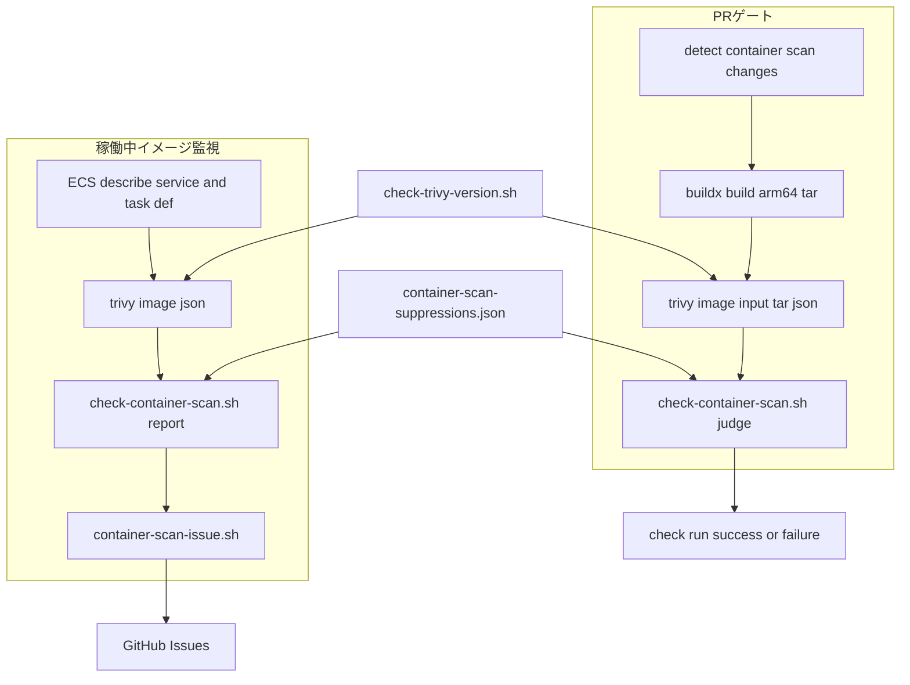
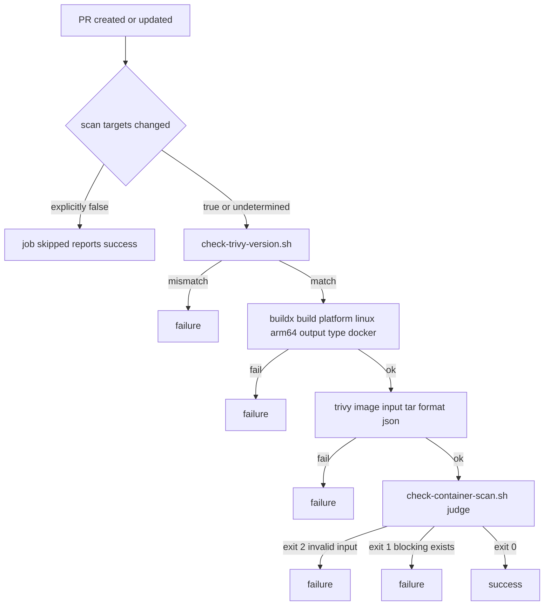
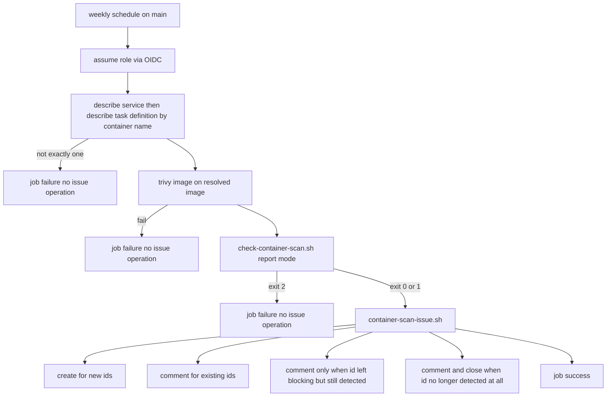

# 設計

## 概要

この設計は、本番コンテナイメージのOS層と同梱アーティファクト(fat jar)に含まれる既知の脆弱性を、マージ前と稼働後の両方で検知する。dockerレーンのDependabot PRは所有者の承認なしに自動マージされるため、CVEを持ち込む更新を止めるものは現在存在しない。

この設計の利用者は、リポジトリ所有者である。所有者は、日々の利用では、この機能をマージ前の失敗と週次のIssueの起票という形で目にする。所有者は、月次監査で検知の能力そのものを点検する。

この設計は、`.github/workflows/` にワークフローを2本、`.github/scripts/` に検査スクリプトを3本とそのテストを追加する。必須ステータスチェックは、**18本から20本**に増える(`container-scan` と `container-scan-script-tests`)。抑制の記録が、新しく所有者の承認の対象に加わる。**本番イメージに含まれる Java 依存の脆弱性も判定の対象に入るため、`backend/**` を変更するPRは常にこのゲートを通る。** この設計は、アプリケーションのコードと `terraform/` を変更しない。

## 作るものと作らないもの

### 作るもの

この設計は、次のことを目指す。

- 修正版のある CRITICAL / HIGH の脆弱性を含む本番イメージの変更を、マージ前に止める
- 検査の対象を本番と同じ ARM64 のイメージに固定し、その事実を機械的に検証する
- 検出した脆弱性を、止めたものも止めなかったものも含めて全件提示する
- 抑制を期限付きにし、抑制の追加に所有者の承認を求める
- 検査が実行されていない状態と完了していない状態を、成功と区別する
- 検知が失われていないことを、月次で点検できるようにする

この spec は、次のものを持つ。

- `container-scan` チェックの合否の判定と、その判定の基準
- 抑制の記録の形式・検証・有効期限の解釈
- 週次スキャンが起票・追記・クローズするIssueの一生
- 検査対象のアーキテクチャの検証と、Trivy のバージョンの検証
- カナリア `container-vuln` の内容と、その期待結果
- 上に挙げたものに関する運用文書の記述

### 作らないもの

この設計は、次のことを目指さない。

- 開発用イメージ(`docker/backend/Dockerfile` ほか)のスキャン
- 脆弱性の修正そのもの、および本番への反映(**タスク1.2 の baseline が0でなかった場合の依存の更新も含む。この依存の更新は、別Issueとして扱う**)
- ECRのpush時スキャン(`terraform/main.tf:146`)の設定変更と、その結果の監査対象化
- 既存の `docker-smoke` の削除・置換
- frontendの依存(本番イメージに含まれない)
- `terraform/` の変更(IAMロールは terraform の管理外であり、変更の経路が異なる)

この spec は、次のものを持たない。

- IAMロールとポリシー(terraform の管理外。AWSコンソールで人が管理する)
- ECRのライフサイクルの設定と push 時スキャン
- `docker-smoke` の責務(全Dockerfileのビルド可否の確認)
- Dependabot の docker レーンの設定と auto-merge の条件
- 必須ステータスチェックへの登録(リポジトリ所有者の操作)
- カナリアの生成の基盤(`canary.yaml` の発火条件、`create_canary()` の実装、PRの後始末の手順)
- `rerun-approval-gated-checks.yaml` の対象一覧。`container-scan` の結論は所有者の承認状態で変わらないため、承認後の再実行を必要としない。抑制の記録の承認は、既存の CODEOWNERS と `check-escape-hatches.sh:196` が担う。この設計は新しいゲートチェックを設けないため、対象一覧への追加は要らない

## 使う既存の仕組み

- `aquasecurity/setup-trivy`(SHA固定)と Trivy 本体(バージョンを明示して指定する)
- `docker/setup-buildx-action`、`aws-actions/configure-aws-credentials`、`dorny/paths-filter`、`actions/checkout`(いずれも既存の参照の再利用で、SHA固定)
- 既存の CODEOWNERS と `check-escape-hatches.sh` による、所有者の承認の強制
- 既存の `update-pr-branches.yaml` による、ブランチの最新化
- AWS: `ecs:DescribeServices` / `ecs:DescribeTaskDefinition` / ECR の pull の権限

## 設計を見直すきっかけ

- Trivy の JSON スキーマが変わったとき(`.Results[]?.Vulnerabilities[]?` の `VulnerabilityID` / `Severity` / `PkgName` / `InstalledVersion` / `FixedVersion`、`.Metadata.ImageConfig.architecture`)
- `backend-deploy.yaml` のタグ付けの規則、またはビルド対象のプラットフォームが変わったとき
- ECS のクラスタ名・サービス名・**コンテナ名が変わったとき、またはコンテナが追加されたとき**
- `create_canary()` の引数の仕様が変わったとき
- 本番のCPUアーキテクチャが変わったとき
- リポジトリがリネームまたは移管されたとき(OIDC の `sub` が不変形式に変わり、信頼ポリシーが一致しなくなる)

## プロジェクトの決まりを守っているか

- 新しいライブラリの追加: `package.json` / `libs.versions.toml` への追加は無い。リポジトリにとって新しいアクションの参照は、`aquasecurity/setup-trivy` の1つである。`docker/setup-buildx-action`(`backend-deploy.yaml:51` で使用中。この設計は同じSHAに揃える)、`dorny/paths-filter`、`aws-actions/configure-aws-credentials`、`actions/checkout` は、既存の参照の再利用である。どの参照もSHAで固定し、Dependabot の github-actions レーンが更新の対象にする
- 品質チェックの設定: **この設計は、品質チェックの設定の変更を含む。** この設計は、`.github/workflows/` へのワークフローの追加(2本)、`.github/scripts/` へのスクリプトの追加(3本とテスト3本)、および既存のゲート設定ファイル2件の変更を含む。2件の変更とは、`create-canary-prs.sh` へのカナリア1種の追加と件数の記述、`canary.yaml` の冒頭のコメントの種類数であり、どちらも要件6(検知が失われていないことの確認)のためである。この設計は、判定のロジックを持つ既存のファイル(`check-*.sh` 本体、`ci.yaml`、`guardrails.yaml` 等)を変更しない。CODEOWNERS(`/.github/ @DogisRiki`)と `check-escape-hatches.sh:196` の両方により、PRは所有者の承認まで止まる
- 使う外部の機能がこのリポジトリで使えるか: arm64 のランナーは、実機で確かめた。OIDC は、提供条件と設定の実測までを行い、実際の挙動の確認は統合の確認 7.2 に残る。
  - **リポジトリの属性**: `owner.type: User` / `visibility: public`(`gh api repos/DogisRiki/KeirekiPro`)
  - **arm64 標準ランナー(実測・タスク1.1)**: **arm64 標準ランナーは、個人アカウントが所有するパブリックリポジトリで実際に起動する。**
    公式ドキュメントはアカウントの種別に言及していなかったため、Claude は実機で確かめた。
    run `32106160197` の `probe-arm64` ジョブが `ubuntu-24.04-arm` で成功し、
    `uname -m` = `aarch64` / `nproc` = 4 / メモリ 15Gi / Ubuntu 24.04.4 LTS だった。
    run の `createdAt` `2026-08-18T06:15:30Z` に対し、ジョブの `startedAt` は `06:15:35Z` で、
    キューの待ちは5秒だった。`completedAt` は `06:15:37Z` だった。
    切り分けのために並べて置いた `ubuntu-latest` の control ジョブも同時に成功しており、
    ワークフロー自体の発火に問題が無いことも確認済みである。
    したがって、この設計は退避案(`ubuntu-latest` + `setup-qemu-action`)を採らない
  - **schedule からの OIDC**: `sub` は `repo:DogisRiki/KeirekiPro:ref:refs/heads/main` となり、
    信頼ポリシーの Statement 3 に合致する(カスタマイズが無いことを
    `gh api .../actions/oidc/customization/sub` で実測した)。公式ドキュメントが `schedule` を
    名指ししていないため、この結論は2つの規則を組み合わせたものであり、**実際の挙動の実測は統合の確認 7.2 で行う**。
    この点は週次スキャン(要件2)だけに関わる。PRゲート(要件1)は
    AWS の認証を使わないため、この点の影響を受けない
- 関係のない項目: backend のコードを置く層(`backend/` のコードを変更しない)、frontend の機能ごとの境界(`frontend/` を変更しない)、frontend の状態の持ち方(アプリケーションの状態を扱わない)、データベースの表の形(マイグレーションを含まない)

## 全体の構成


```mermaid
flowchart TB
    subgraph Gate[PRゲート]
        Detect[detect container scan changes] --> Build[buildx build arm64 tar]
        Build --> Scan1[trivy image input tar json]
        Scan1 --> Eval1[check-container-scan.sh judge]
    end
    subgraph Watch[稼働中イメージ監視]
        Resolve[ECS describe service and task def] --> Scan2[trivy image json]
        Scan2 --> Eval2[check-container-scan.sh report]
        Eval2 --> Issue[container-scan-issue.sh]
    end
    Suppress[container-scan-suppressions.json] --> Eval1
    Suppress --> Eval2
    Ver[check-trivy-version.sh] --> Scan1
    Ver --> Scan2
    Eval1 --> Verdict[check run success or failure]
    Issue --> GH[GitHub Issues]
```

- 選んだ型: この設計は、「検出」と「判定」を分ける。Trivy は脆弱性の検出だけを担い、何を許すかはリポジトリのスクリプトが決める。これは、既存の `check-dependency-additions.sh` / `check-escape-hatches.sh` と同じ型である
- 部品の責任の分け方: PRゲートと稼働中イメージ監視は、イメージの入手のしかたと抑制の適用のモードだけが異なり、判定は同じスクリプトを共有する
- 守る既存の作り: この設計は、paths-filter によるジョブ単位のスキップ、テストを先に流す fail-closed、SHA固定、`GITHUB_STEP_SUMMARY` への Markdown の出力を守る。fail-closed とは、判定できないときに成功に倒さず失敗に倒すことを指す
- 新しい部品が要る理由: この設計が判定を自前で持つ理由は2つある。1つ目は、Trivy に抑制を渡すと、抑制された件が出力から消え、要件 3.1 を満たせないことである。2つ目は、`.trivyignore.yaml` が EXPERIMENTAL であり、公式が「後方互換を保たずに変わりうる」と明記していることである

**依存の向き**: ワークフローがスクリプトを呼び、スクリプトが jq と Trivy の出力を読む。スクリプトはワークフローを参照しない。判定スクリプトは GitHub API を呼ばない(Issue の操作は別のスクリプトが持つ)。

**使う技術**:
- 実行環境: GitHub Actions `ubuntu-24.04-arm`(PRゲート)/ `ubuntu-latest`(週次)。arm64 を使うのは、ネイティブでビルドするためである。タスク1.1で、Claude は利用可否を実機で確かめた
- ビルド: `docker/setup-buildx-action`(`backend-deploy.yaml:51` と同じSHA)+ `docker buildx build`。arm64 の単一プラットフォームの tar を作る。`docker` ドライバは `type=docker` エクスポータに対応していないため、buildx が必須である
- スキャナ: `aquasecurity/setup-trivy@81e514348e19b6112ce2a7e3ecbafe19c1e1f567` # v0.3.1 + Trivy `0.74.0`。脆弱性の検出を受け持つ。**`version` 入力の既定値は `'latest'` であり、既定値のままでは Trivy 本体が固定されない。そのため、明示の指定が必須である。** `cache:` 入力が対象にするのは Trivy のバイナリだけであり、脆弱性DBには効かない
- 判定: bash + jq。合否の判定・抑制の適用・全件の提示を受け持つ。どちらもランナーに同梱されており、追加のインストールは無い
- AWS: `aws-actions/configure-aws-credentials`(SHA固定)+ OIDC。稼働中イメージの特定と取得を受け持つ。週次だけで使う。週次のワークフローは `environment:` を指定しない(`sub` が変わるため)

## ファイルの構成

Claude が新しく作るファイル:

```
.github/
├── container-scan-suppressions.json   # 抑制の記録。CODEOWNERS の /.github/ で所有者承認必須
├── workflows/
│   ├── container-scan.yaml            # PRゲート。必須ステータスチェック container-scan
│   └── container-scan-scheduled.yaml  # 週次の稼働中イメージ監視。schedule + workflow_dispatch
└── scripts/
    ├── check-container-scan.sh        # 判定・抑制の適用・全件提示・起票対象の書き出し
    ├── check-trivy-version.sh         # 実行時のTrivyバージョンと指定値の突き合わせ
    ├── container-scan-issue.sh        # 週次のIssue起票・追記・クローズ
    └── tests/
        ├── test-check-container-scan.sh
        ├── test-check-trivy-version.sh
        └── test-container-scan-issue.sh
```

Claude が変えるファイル:

- `.github/scripts/create-canary-prs.sh`: Claude は、カナリアを1種(`container-vuln`)追加する。カナリアの内容は、下の「カナリアの内容」を参照する。**Claude は、冒頭の種類数(`:5` の「3種」。現状すでに実態の5種とずれているため、6種に直す)、冒頭の番号付きリスト、末尾の件数の出力(`:217` の「5件」を「6件」にする)を更新する**(要件 7.11)
- `.github/workflows/canary.yaml`: Claude は、冒頭のコメントの種類数(`:3` の「3種」)を直す
- `README.md`: Claude は、ワークフロー一覧表に2行を追加し(要件 7.1)、Mermaid 図の `s1` ノードのラベルに1項目を追加する。Claude は、ノードや subgraph を増やさない
- `doc/開発フロー/監査手順.md`: Claude は、次の記述を追加・更新する
  - 月次「自動更新の対象外になっているバージョン固定の確認」の表に、Trivy を追加する(要件 7.2)。確認の対象は、**両ワークフローの `env.TRIVY_VERSION`** である
  - 「自動チェックの一覧(監査対象)」に2行を追加する(要件 7.3)。この表は `| 種類 | 実体 | 何を防ぐか |` の3列(`監査手順.md:333`)であり、Claude は「何を防ぐか」の列にそれぞれ次を書く。PRゲート: 「本番イメージのOS層と同梱 fat jar に、修正版のある CRITICAL/HIGH の脆弱性を持ち込む変更がマージされること。既存の依存も対象で、`dependency-review`(そのPRで新しく増えた分だけを見る)とは補完の関係にある」。稼働中イメージ監視: 「マージ後に公表された脆弱性が、稼働中のイメージについて誰にも気づかれないまま残ること」
  - 月次のカナリアの期待失敗の表に、`container-vuln` を追加する(要件 7.4)。件数の記述も更新する(要件 7.11)
  - **カナリア `container-vuln` の確認手順に、次の3つの分かれ道を書く(要件 6.3)**: `container-scan` ジョブの結論が `failure` なら正常である。結論が `success` で、かつ `GITHUB_STEP_SUMMARY` に脆弱性の表があれば、「実行されたが失敗しなかった」にあたる。結論が `skipped` か、または summary が空なら、「実行されなかった」にあたる。後の2つは、どちらも検出漏れとして扱い、別々の異常として記録する
  - 週次の項目に「稼働中イメージ監視の確認」を追加する(要件 7.5)。所有者が見るのは2点である。(1) **直近の実行が7日以内に存在するか**。存在しなければ `schedule` の遅延・スキップにあたるため、所有者は `workflow_dispatch` で手動実行する。(2) その実行の結論が `success` か。**結論は脆弱性の有無に左右されず、検査を完走できたかだけを表す**。そのため、`failure` は、イメージの特定・取得の失敗か、終了コード2(検査不能)を意味する
  - **Claude は、手動キャンセルのときの指示を、要件 7.6 で追加する「docker PR の出口の説明」と同じ節に置く(要件 7.12)**。監査手順は週次・月次に読む文書であり、「マージ前に」という指示を監査の節に置くと、読まれる時期が噛み合わない。そこで、Claude は、この指示を、赤や異常が出たその場で参照される節に寄せる。**Claude は、この指示も、出口A・出口Bの表の外(上に書いた新しい見出しの下)に置く。** 指示の内容は、次のとおりである。「チェックの実行を手動でキャンセルしたときは、マージ前に `container-scan` を再実行する。**キャンセルされたジョブは `cancelled` として報告され成功にならないため緑にはならないが**、後続のイベントが発火しないため自動では再検査が始まらず、再実行するまでPRは進まない(close→reopen はトリガの `reopened` により再検査されるため対象外)」
  - docker PR の出口の説明に、脆弱性の検出以外で赤になった場合の見分け方と、原因ごとの対応を追加する(要件 7.6)。**Claude は、出口A・出口Bの表(`監査手順.md:148-151`)には行を足さず、表の直後に別の見出しとして書く。** 出口A/Bは「脆弱性で赤になったPRをどう終わらせるか」の2択であり、今回加えるのは「そもそも脆弱性以外の理由で赤い場合の切り分け」であって、選択肢ではないためである。この構成なら、`監査手順.md:146` の「出口は次の2つ」は追加後も正しいため、Claude はこの記述を変更しない(要件 7.11)。表に行を足す構成を採る場合は、Claude は同じ行の件数も合わせる
  - 出口B(「抑制設定を入れてマージする」)の記述を、この spec が導入する `.github/container-scan-suppressions.json` による期限付きの抑制を指すように書き換え、判断の基準は要件 7.9 で新設する節へのリンクにする。現状の出口Bは、抑制の実体を持たない
  - Issueの自動クローズと、自動で閉じなかった場合の扱いを追加する(要件 7.7)
  - 検知した脆弱性への対応手順と、抑制を使う場合の判断の基準の節を新設する(要件 7.9)
  - IAMポリシーの実物の確認と、抑制を追加するときの承認の手順を追加する(要件 7.12)
- `doc/開発フロー/基盤構築手順.md`: Claude は、「7. Required status checks の指定」の一覧に `container-scan` と `container-scan-script-tests` を追加し、それぞれ報告の実績が出たあとに登録する旨を書く(要件 7.8)。**この2つは登録の時期が異なる**(下の「人間の作業」の #4 と #5)。Claude は、本文でも「`container-scan-script-tests` は報告実績が出しだい、`container-scan` は baseline が0件になったあと」と書き分ける。Claude は、本数の表記を18から20に更新する(`:157` と `:180` の2箇所、要件 7.11)
- `CLAUDE.md`: Claude は、抑制の記録が「見かけの合格」を作る手段になりうることと、所有者の承認が要ることを書く(要件 7.10)。あわせて、Claude は、`container-scan` の実行を自律側からキャンセルしないことを書く(キャンセルすると skipped = Success として報告され、検査を行わないまま緑が残る)

### カナリアの内容

`create-canary-prs.sh` に追加するカナリア `container-vuln` は、**`create_canary()` を使わない。** ヘルパーは `printf '%s\n' "$content" > "$file"` でテキストのファイルを1つしか書けず(`:60`)、今回はバイナリを含む2つのファイルを1つのコミットに入れる必要があるためである。Claude は、このカナリアを、`vulnerable-dep`(`:172-215`)と同じくインラインのブロックとして書く。

| ファイル | 内容 |
|---|---|
| `backend/canary-vuln.jar` | スクリプトが生成する zip。`META-INF/maven/org.apache.logging.log4j/log4j-core/pom.properties` に `groupId` / `artifactId` / `version=2.14.1` を書く。Trivy はこの pom.properties から GAV を特定するため、sha1 照合に落ちず java-db の内容に依存しない |
| `docker/backend/Dockerfile.prod` | 実行ステージの `COPY --from=builder …` の直後に `COPY canary-vuln.jar /app/canary-vuln.jar` を1行追加 |

期待する結果は、`CVE-2021-44228` / `CRITICAL` / `FixedVersion` が空でないものが `blocking` に入り、`container-scan` が赤になることである。

- スクリプトは、jar をランナーに同梱された手段(`python3` の `zipfile` など)で生成し、生成に失敗したらその場で `::error::` を出して `exit 1` する
- **スクリプトは、Dockerfile への1行の挿入も同じようにガードする。** スクリプトは、挿入のあとに `grep -q` で反映を確かめ、一致しなければ `::error::`(「`Dockerfile.prod` の実行ステージに挿入できませんでした。`COPY --from=builder` の行が変わっていないか確認してください」)を出して `exit 1` する。**挿入が空振りしたまま緑のPRが作られると、月次監査は、要件 6.3 の3つの分かれ道で「実行されたが失敗しなかった」= 検出漏れと記録し、カナリア側の故障がゲート側の故障に化ける**(`vulnerable-dep` の `grep` のガード `:186-192` と同じ理由である。そのコメントも「原因が分かるのは翌月になるため、ここで即座に止める」と述べている)
- Claude は、CVE と「修正版あり」を確かめた日をスクリプトの中のコメントに残し、`vulnerable-dep` と同じく「アドバイザリが取り下げ・格下げされたら版を選び直す」旨も書く
- `backend/.dockerignore` は `*.jar` を一律には除外しない。そのため、`backend/canary-vuln.jar` はビルドコンテキストに入り、`COPY canary-vuln.jar` が成り立つ
- **jar をリポジトリに同梱しても、本番イメージへの影響は無い。** カナリアPRはマージされない(`create-canary-prs.sh:34` は auto-merge を付けず、本文に「マージ禁止」と書き、次回の実行時に既存のカナリアPRを close する)。jar はカナリアのブランチにだけ存在し、main には入らない
- **副作用**: カナリアPRは `docker/**/Dockerfile*` に該当するため、`docker-smoke`(timeout 45分)も同時に走る。Claude は、監査手順のカナリアの表には、`container-scan` が赤になることだけを期待失敗として書く

## 処理の流れ

### PRゲートの判定


```mermaid
flowchart TB
    Start[PR created or updated] --> Filter{scan targets changed}
    Filter -->|explicitly false| Skip[job skipped reports success]
    Filter -->|true or undetermined| Ver[check-trivy-version.sh]
    Ver -->|mismatch| Red1[failure]
    Ver -->|match| BuildTar[buildx build platform linux arm64 output type docker]
    BuildTar -->|fail| Red2[failure]
    BuildTar -->|ok| Trivy[trivy image input tar format json]
    Trivy -->|fail| Red3[failure]
    Trivy -->|ok| Eval[check-container-scan.sh judge]
    Eval -->|exit 2 invalid input| Red4[failure]
    Eval -->|exit 1 blocking exists| Red5[failure]
    Eval -->|exit 0| Green[success]
```

`detect-container-scan-changes` は、判定不能を失敗にせず、`run=true` を出力する。`container-scan` の条件は、`!cancelled()` を含む形にする。これにより、先行ジョブ自体が異常終了した場合も、`container-scan` は検査を実行する。**この設計は、ジョブがスキップされて緑になる経路を、`run == 'false'` が明示的に出力された場合(要件 1.8)だけに限る。**

### 週次のIssueライフサイクル


```mermaid
flowchart TB
    Cron[weekly schedule on main] --> OIDC[assume role via OIDC]
    OIDC --> Resolve[describe service then describe task definition by container name]
    Resolve -->|not exactly one| Fail1[job failure no issue operation]
    Resolve --> Pull[trivy image on resolved image]
    Pull -->|fail| Fail2[job failure no issue operation]
    Pull --> Eval[check-container-scan.sh report mode]
    Eval -->|exit 2| Fail3[job failure no issue operation]
    Eval -->|exit 0 or 1| Issue[container-scan-issue.sh]
    Issue --> Create[create for new ids]
    Issue --> Append[comment for existing ids]
    Issue --> Keep[comment only when id left blocking but still detected]
    Issue --> Close[comment and close when id no longer detected at all]
    Issue --> Success[job success]
```

**週次の run の結論は、「稼働中イメージを特定し、取得し、検査を完走できたか」だけを表す。** 脆弱性の有無は、Issue と `GITHUB_STEP_SUMMARY` が運ぶ。脆弱性がある限り run が常に赤になると、要件 7.5 の監査項目「予定どおり実行され成功しているか」が常に NG を指す。そうなると、要件 2.5 が守ろうとしている「検査不能を見逃さない」信号が、ノイズに埋もれるためである。

## 部品

この設計の部品は、次の表のとおりである。表の「主に使う部品」の (P0) は、その部品が無いと動かない依存を指す。

`container-scan-script-tests` は、要件を直接実現するのではなく、要件を実現するスクリプトの健全性を守る補助のゲートである。このジョブの「対応する要件」の欄は、守る対象を指す。

| 部品 | 領域 | 役割 | 対応する要件 | 主に使う部品 | 呼び出し方の種類 |
|---|---|---|---|---|---|
| container-scan.yaml | CI | PRゲートの実行と発火条件 | 1.1, 1.6〜1.12, 5.1, 5.2 | paths-filter (P0), buildx (P0), setup-trivy (P0) | 一括処理 |
| container-scan-script-tests(同じワークフローの中のジョブ) | CI | 判定スクリプトの単体テストをゲートとして実行 | 1.2〜1.7, 2.2〜2.4, 3.1, 3.2, 4.1〜4.4, 5.3 | jq (P0) | 一括処理 |
| container-scan-scheduled.yaml | CI | 稼働中イメージの週次の再検査 | 2.1, 2.5, 2.6, 5.1, 5.2 | OIDC (P0), ECS/ECR (P0) | 一括処理 |
| check-container-scan.sh | スクリプト | 判定・抑制の適用・全件の提示・起票対象の書き出し | 1.2〜1.7, 3.1, 3.2, 4.1〜4.4 | jq (P0) | サービス, 一括処理 |
| check-trivy-version.sh | スクリプト | 実行時のTrivyのバージョンの検証 | 5.3 | jq (P0) | サービス |
| container-scan-issue.sh | スクリプト | Issue の起票・追記・クローズ | 2.2〜2.4 | gh (P0), jq (P0) | サービス, 一括処理 |
| container-scan-suppressions.json | データ | 抑制の記録 | 4.1, 4.5 | CODEOWNERS (P0) | 状態 |

### container-scan.yaml(PRの内容で本番イメージを組み立てて検査する、PRゲートのワークフロー)

対応する要件: 1.1, 1.6, 1.7, 1.8, 1.9, 1.10, 1.11, 1.12, 5.1, 5.2

**役割**: このワークフローは、PRの内容で本番イメージを arm64 で組み立て、脆弱性を検査して、マージできるかどうかを報告する。
- ジョブの名前: このワークフローのジョブ名は `container-scan` にする。この名前は、必須ステータスチェックに登録される名前と一致させる
- 変更検出のジョブの名前: 変更検出のジョブ名は `detect-container-scan-changes` にする。これは、既存の必須チェックの名前 `detect-changes`(`ci.yaml:22`)との衝突を避けるためである
- Trivy のバージョン: このワークフローは、Trivy のバージョンをワークフローの単位の `env: TRIVY_VERSION: '0.74.0'`(`v` 無し)に1回だけ書く

**権限**: このワークフローに与える権限は `permissions: contents: read` だけである。このワークフローは secrets を使わない。

**いつ動くか**:
- 起動するイベント: `pull_request`(`opened`, `reopened`, `synchronize`)、`branches: [main]`(`ci.yaml:11` / `dependency-gate.yaml:13` と同じ範囲)。このワークフローは、ワークフローの単位の `paths:` を使わない
- 同時実行: `concurrency: group: container-scan-${{ github.event.pull_request.number }}` / `cancel-in-progress: true`。最長30分のジョブが `synchronize` のたびに積み上がるのを避けるためである
- 打ち切り: `timeout-minutes: 30`(要件 1.10)。Claude は、この値の理由をコメントに書く

**使う部品**:
- 外部: `dorny/paths-filter`。このワークフローは、変更の範囲の判定にこのアクションを使う(P0)
- 外部: `docker/setup-buildx-action`。このワークフローは、`type=docker` エクスポータに必要な docker-container ドライバのためにこのアクションを使う(P0)
- 外部: `aquasecurity/setup-trivy`。このワークフローは、Trivy の導入にこのアクションを使う(P0)
- 呼ぶ先: `check-trivy-version.sh` / `check-container-scan.sh`(P0)

**呼び出し方(一括処理)**:
- 入力: `detect-container-scan-changes` は、`dorny/paths-filter` で次の**2つの出力**を出す。

  | 出力 | 対象パス | 消費するジョブ |
  |---|---|---|
  | `run` | `docker/backend/Dockerfile.prod` / `backend/**` / `.github/container-scan-suppressions.json` / `.github/workflows/container-scan.yaml` | `container-scan` |
  | `scripts` | `.github/scripts/check-container-scan.sh` / `check-trivy-version.sh` / `container-scan-issue.sh` / `.github/scripts/tests/test-check-container-scan.sh` / `test-check-trivy-version.sh` / `test-container-scan-issue.sh` / `.github/workflows/container-scan.yaml` | `container-scan-script-tests` |

  **`.github/workflows/container-scan.yaml` 自身を両方に入れるのは、承認後の追加である(2026-08-20、DogisRiki が承認)。** 当初の一覧には、このワークフロー自身を含めていなかった。しかし、タスク3.1〜3.3 のレビューで、このワークフローだけを変更したPRでは `run` も `scripts` も `false` となり、**必須チェック2本が同時に skipped = Success になる**ことが分かった。そのままでは、`--severity` で絞る・`--ignore-unfixed` を足す・`judge` を `report` に変える・テストの起動を消す、といった検査を弱める変更が、検査を一度も走らせないままマージできる。CODEOWNERS と `check-escape-hatches.sh:196` による所有者の承認が唯一の歯止めであり、機械的な検知は無かった。この設計は、ゲートを変える変更をゲートに通すため、このワークフロー自身を両方の対象に加える。

  どちらの出力も、判定不能のときは `true` を出す(要件 1.9 と同じ向き)。

  加えて、**`detect-container-scan-changes` は、最後に出力の形式を検証するステップを持つ。** 値が `true` / `false` のどちらでもなければ、このステップは `::error::` を出して detect ジョブを失敗させる。後続の2つのジョブは、`result != 'success'` により実行される。

  この検証が無いと、フィルタのキー名と `outputs:` の参照名が食い違う・`outputs:` を書き忘れる・リネームで片方だけ直す、といった場合に、**ワークフローは成功したまま出力が空**になる。そのとき、`outputs.run == 'true'` も `outputs.scripts == 'true'` も偽となり、**必須チェック2本が同時に skipped = Success として恒久的に失効する**。この検証は、`ci.yaml:230-238` が `jq -e 'type == "array" and length > 0'` で塞いでいるのと同じ fail-closed であり、これにより下に書く常に成り立つ条件が実装で担保される。
- 判定不能のとき: `detect-container-scan-changes` は、判定不能を失敗にせず、`run=true` を出力する。`container-scan` の条件は、`${{ !cancelled() && (needs.detect-container-scan-changes.result != 'success' || needs.detect-container-scan-changes.outputs.run == 'true') }}` にする。**このワークフローは `always()` を使わない**(キャンセルされた run でジョブが走り、必須チェックに失敗が残ってマージがブロックされるためである。`dependency-review.yaml:106` と同じ理由である)。`cancel-in-progress` による自動のキャンセルは、新しい head SHA の run が引き継ぐため、抜けにならない。**close→reopen も抜けにならない。** トリガに `reopened` を含めているため、同じSHAのまま新しい run が発火して、検査がやり直されるからである。**残る抜けは、手動のキャンセルだけである。**

  **Claude は、手動のキャンセルの挙動を 2026-08-20 に実測し、当初の想定が誤りであったことが分かった。** 当初は、「`!cancelled()` によりジョブが skipped となり Success として報告されるため、検査を行わないまま緑が残る」と想定していた。実測では、**キャンセルされた run のジョブは skipped ではなく `cancelled` として報告され、必須ステータスチェックは成功にならなかった。** 検査の実行中に止めた場合も、`container-scan` が始まる前に止めた場合も、結果は同じだった(PR #224 の run `32342058770` / `32342256043`)。

  したがって、この経路は**緑が残る穴ではなく、再実行するまで赤のまま進まない状態**である。この状態は fail-closed の側であり、仕組みで塞げていないのは「自動で再検査が始まらない」ことだけになる。この設計は、運用文書の指示(要件 7.12)を、silent green の防止ではなく、**マージを進めるための再実行の案内**として残す
- スクリプトの変更: この設計は、3本のスクリプトとその `tests/` の変更を `run` に**加えない**(スクリプトだけの変更で30分の arm64 ビルドを回さないためである)。代わりに、同じワークフローの中の別のジョブ `container-scan-script-tests`(`ubuntu-latest`)が `scripts` を消費し、3本のテストを実行する。このジョブの条件は `container-scan` と同じ型で、`${{ !cancelled() && (needs.detect-container-scan-changes.result != 'success' || needs.detect-container-scan-changes.outputs.scripts == 'true') }}` にする(`always()` は使わない。理由は上と同じである)。**このジョブは、必須ステータスチェックに登録する。** 登録しなければ auto-merge を止められず、「判定スクリプトの変更が単体テストを一度も通らずに main へ入る経路を塞ぐ」という目的を達しない。パス条件付きのジョブを必須チェックにするのは、`docker-smoke`(`ci.yaml:213` のパス条件 + `基盤構築手順.md:163` の登録)と同じ型である。対象外のPRでは、このジョブはスキップ = Success として報告されるため、ほかのPRを止めない
- ビルドの取り決め:

  | 項目 | 値 |
  |---|---|
  | プラットフォーム | `linux/arm64` |
  | エクスポータ | `type=docker`(単一プラットフォーム専用。これがアーキテクチャ確定の根拠) |
  | Dockerfile | `docker/backend/Dockerfile.prod` |
  | コンテキスト | `./backend`(`compose.yaml` と `backend-deploy.yaml:73` に合わせる) |

- スキャンの取り決め: `trivy image --input <tar> --format json --output <path>`。このワークフローは `--ignore-unfixed` を**付けない**(付けると修正版の無い脆弱性が出力から消え、要件 3.1 を満たせない)。このワークフローは `--severity` でも絞らない
- 出力: check-run `container-scan` の結論と、`GITHUB_STEP_SUMMARY` の Markdown
- 何度実行しても同じか: 同じSHAで再実行すると、このワークフローは同じ結論を返す

**実装のメモ**:
- つなぎ方: ステップの順序は、1) Trivy の導入とバージョンの検証、2) buildx のセットアップ、3) tar の生成、4) スキャン、5) 判定 である
- つなぎ方: 判定スクリプトの終了コードが 0 以外であれば、このワークフローはジョブを失敗させる
- 確かめ方: このワークフローは、所要時間を区間ごとに計り、`::notice::` と `GITHUB_STEP_SUMMARY` に出す(要件 1.12)。区間は、ビルド / DBの取得を含むスキャン / 判定 の3つである
- リスク: 30分の内訳は、「ベースイメージと buildkit イメージの pull + Gradle のビルド(`ci.yaml:217` の実績で最長10分強)+ tar の書き出し + 脆弱性DBの取得(実測で計約1分40秒)+ fat jar の入れ子の解析」である。同じ Dockerfile をビルドするだけの `docker-smoke` は45分を確保している(`ci.yaml:218`)。そのため、「30分がビルド時間の3倍だから安全」という読みは、根拠として弱い。Claude は、タスク1.1で arm64 の利用可否を確かめるときに各区間を実測し、30分で足りない場合は要件 1.10 の見直しを人間に提案する
- リスク: `docker-smoke` と `container-scan` が同じPRで同じベースイメージを引くため、Docker Hub の匿名 pull の制限に当たる頻度が上がる。この設計は、PRゲートで secrets を使わない方針を保ち、認証を入れない。制限に当たる事象が観測されたら、Claude は、頻度を監査手順に記録したうえで、対処を人間に提案する
- リスク: arm64 のランナーが使えない場合、この設計は、`runs-on` を `ubuntu-latest` に変え `docker/setup-qemu-action` を足す構成に切り替える。この場合、**Claude は、タスク1.1と同じPRで所要時間を実測する。30分を超えた場合は、Claude はこの設計を続けず、design の段階に戻して代わりの案(セルフホストランナー、ビルド済みの成果物の再利用)を比べる**

### container-scan-scheduled.yaml(稼働中の本番イメージを週1回再検査する、稼働中イメージ監視のワークフロー)

対応する要件: 2.1, 2.5, 2.6, 5.1, 5.2

**役割**: このワークフローは、稼働中の本番イメージを週1回再検査し、その結果をIssueに反映する。
- `environment:` の扱い: **このワークフローは `environment:` を指定しない。** 指定すると、OIDC の `sub` が `repo:OWNER/REPO:environment:NAME` になり、信頼ポリシーの Statement 3 に合致しなくなるためである
- Trivy のバージョン: このワークフローは、Trivy のバージョンを `env: TRIVY_VERSION` に1回だけ書く(PRゲートと同じ型)

**権限**: このワークフローに与える権限は、`permissions: contents: read` / `id-token: write` / `issues: write` である。

**いつ動くか**:
- 起動: `schedule`(週1回、土曜以外)+ `workflow_dispatch`。`mutation-report.yaml` が土曜(`cron: '0 0 * * 6'`)に動くため、このワークフローは曜日を分ける
- 時刻: **`schedule` の時刻は、稼働する時間帯に合わせる。** `terraform/modules/scheduler/main.tf` の `ecs_start`(`cron(0 23 ? * SUN-THU *)`)と `ecs_stop`(`cron(0 11 ? * MON-FRI *)`)により、このサービスは平日の 08:00〜20:00 JST だけ起動し、それ以外の時間は `desiredCount` が 0 になる。採用した `17 3 * * 3`(水曜 12:17 JST)は、この時間帯の中にある。**時刻をこの時間帯の外へ動かすと、このワークフローは常に停止中の状態を検査することになる。**

**使う部品**:
- 外部: `aws-actions/configure-aws-credentials`。このワークフローは、OIDC の認証にこのアクションを使う(P0)
- 外部: AWS ECS `DescribeServices` / `DescribeTaskDefinition`(P0)
- 外部: AWS ECR。このワークフローは、イメージの取得に ECR を使う(P0)
- 呼ぶ先: `check-trivy-version.sh` / `check-container-scan.sh` / `container-scan-issue.sh`(P0)

**呼び出し方(一括処理)**:
- ステップの順序: 1) スクリプトのテスト3本、2) Trivy の導入とバージョンの検証、3) イメージの特定、4) スキャン、5) 判定、6) Issue の操作。テストを先に置くのは `dependency-gate.yaml:37-38` と同じ型であり、`container-scan-issue.sh` が Issue のクローズという後戻りしにくい操作を持つためである
- 入力と検証: このワークフローは、`ECS_CLUSTER=keirekipro-cluster` / `ECS_SERVICE=keirekipro-backend-service` から、
  `aws ecs describe-services` → `taskDefinition` → `aws ecs describe-task-definition` →
  `[.taskDefinition.containerDefinitions[] | select(.name == "keirekipro-backend") | .image]` を取り、
  **要素の数がちょうど1でなければ失敗させる。このワークフローは、添字ではイメージを選ばない。** これは、`backend-deploy.yaml:98-99` が名前の一致で更新している対象と同じものを見るためである。これにより、サイドカーが追加されたときに別のコンテナを検査して緑になることを防ぐ

  **サービスの状態と稼働数の扱い(2026-08-20 追加、DogisRiki が承認)**: 当初の取り決めは、`taskDefinition` から `containerDefinitions` を辿って要素の数が1であることを確かめるところまでだった。タスク4.2 のレビューで、次の2つが素通りすることが分かったため、この設計は次の検査を加える。

  | 追加する検査 | 扱い | 理由 |
  |---|---|---|
  | `.services[0].status == "ACTIVE"` | 一致しなければ**失敗** | 削除直後のサービスは `status: INACTIVE` のまま `taskDefinition` を伴って返り、`failures` にも落ちない。そのまま進むと、もう使われていない設定値を「稼働中イメージ」として検査して緑で終わる |
  | `.services[0].runningCount` / `desiredCount` | 記録し、`runningCount == 0` なら `::warning::`。**失敗にはしない** | タスク定義のイメージは停止中でも次に起動するイメージそのものであり、検査対象として正しい。ただし「稼働中を検査した」と読めるため、状態を `GITHUB_STEP_SUMMARY` と注釈に残す |
  | `.image` の非空 | 空または `null` なら**失敗** | 要素数1でも `.image` キーが無ければ `null` が1件入る。素通りすると Trivy に文字列 `null` が渡り、Docker Hub の認証エラーとして落ちるため、原因がタスク定義であることがログから読めなくなる |

- 判定の呼び出し: `check-container-scan.sh <scan.json> arm64 .github/container-scan-suppressions.json report <blocking.json> <detected.json>`。このワークフローが `expected-arch` に `arm64` を渡すのは、`backend-deploy.yaml:78` が `platforms: linux/arm64` だけで push しているためである。将来 multi-arch の push に変わった場合、その変化はここで終了コード2として現れる
- ジョブの結論: `check-container-scan.sh` の終了コード 0 と 1 は、どちらも**ジョブを成功で終える**。ジョブを失敗させるのは、終了コード 2、イメージの特定・取得の失敗、`container-scan-issue.sh` の失敗だけである。終了コードが1のときは、このワークフローは `::notice::` で「blocking N件を検出し、Issueに反映した」を出す
- Issue の操作の前提: このワークフローは、終了コードが 0 または 1 のときだけ `container-scan-issue.sh` を実行する。**終了コードが2のときは、このワークフローは Issue を一切操作せず、ジョブを失敗させる**(要件 2.5)
- 出力: Issue の起票・追記・クローズと、`GITHUB_STEP_SUMMARY`
- 何度実行しても同じか: このワークフローは、脆弱性識別子をキーに既存のオープンIssueと突き合わせる。そのため、同じ週に複数回実行しても、重複して起票しない

**実装のメモ**:
- つなぎ方: **このワークフローは、判定スクリプトの終了コードを `set -e` に飲ませずに捕まえ、0 / 1 / 2 の3値を区別して分岐する。** 真偽の2値に潰す形(`if <script>; then`)では、1(脆弱性あり・起票する)と 2(検査不能・Issueを操作しない)が同じ扱いになり、要件 2.5 の切り分けが成り立たない。Claude は、3値を区別できていることを、初回の実行時に終了コード2の入力で確かめる
- つなぎ方: このワークフローは、稼働中イメージの特定に `ecr:DescribeImages` を使わない。IAMポリシーの実物が未確認であり、設計書の側の版には `ecr:DescribeImages` が含まれないためである。`DescribeServices` を起点にすれば、両方の版で権限が揃っている
- 確かめ方: ECRのライフサイクルは最新の5世代だけを保持する(`terraform/main.tf:170`)。そのため、稼働中イメージが ECR から消えている状態は、正常に起こりうる。この場合、pull が失敗し、要件 2.5 により失敗として残る
- リスク: schedule からの OIDC は、公式ドキュメントが名指ししていない。Claude は、初回の実行での実測を完了条件に含める。失敗した場合は、Claude は `workflow_dispatch` だけに退避し、信頼ポリシーへの `schedule` 用の条件の追加を人間に提案する
- リスク: 実物のポリシーに `ecs:DescribeServices` / `ecs:DescribeTaskDefinition` / ECR の pull のどれかが欠けていた場合、IAMロールは terraform の管理外(AWSコンソールで人が管理する)であるため、権限の付与は人間の作業になる。この場合、Claude は、週次スキャンの実装を保留し、必要な権限と付与先のロールを添えて人間に提案する。**PRゲート(要件1)は AWS の認証を使わないため、この保留に影響されず、先に出荷できる**

### check-container-scan.sh(Trivy の JSON を読み、抑制を適用して合否を決めるスクリプト)

対応する要件: 1.2, 1.3, 1.4, 1.5, 1.6, 1.7, 3.1, 3.2, 4.1, 4.2, 4.3, 4.4

**役割**: このスクリプトは、Trivy の JSON を読み、抑制を適用して合否を決め、全件を人間が読める形で提示し、起票の対象を書き出す。
- この設計は、**脆弱性に関する合否の判定**をこのスクリプトに集める。この設計は、ワークフローの側に脆弱性の合否のロジックを置かない。実行の前提の検証(Trivy のバージョンの一致・30分の打ち切り)は、実行環境の性質上ワークフローが持ち、判定とは別の失敗の理由として扱う
- このスクリプトは GitHub API を呼ばない。入力はファイルだけである。これにより、テストは `gh` のシムを必要としない
- このスクリプトは、不確かな入力をすべて失敗として扱う(fail-closed)。ただし、`report` モードでの抑制ファイルの不備は例外である(後で述べる)

**使う部品**:
- 外部: jq(P0)
- 呼ぶ側: `container-scan.yaml` / `container-scan-scheduled.yaml`(P0)
- 呼ぶ先: `container-scan-issue.sh`。このスクリプトは、`blocking-out` / `detected-out` を通して結果を渡す(P0)

**呼び出し方(サービス・一括処理)**:

```
使い方: check-container-scan.sh <scan-json> <expected-arch> <suppressions-json> <apply-mode> <blocking-out> <detected-out>

引数:
  scan-json         Trivy の --format json の出力ファイル
  expected-arch     検査対象に期待するアーキテクチャ(例: arm64)
  suppressions-json 抑制の記録
  apply-mode        judge : 抑制を判定に適用する(PRゲート)
                    report: 抑制を表示にのみ用い、判定には適用しない(週次。要件 4.4)
  blocking-out      判定で「止める」とされた脆弱性の配列を書き出すパス
  detected-out      検出された全脆弱性の配列を書き出すパス

終了コード:
  0  blocking が空(blocking-out は空配列、detected-out を書き出す)
  1  blocking が1件以上(両ファイルを書き出す)
  2  入力が不正、または前提が一致しない(いずれのファイルも書き出さない)
```

- 呼ぶ前に成り立つ条件: `scan-json` が存在し、`.SchemaVersion` と `.Metadata.ImageConfig.architecture` を持つ
- 呼んだあとに成り立つ条件: 終了コードが 0 または 1 のとき、このスクリプトは `blocking-out` と `detected-out` を必ず書き出す。このスクリプトは、`GITHUB_STEP_SUMMARY` に全件の表を追記する。`blocking` が空でなければ、このスクリプトは件数の注釈を出す。**注釈の種別は `apply-mode` で変える(2026-08-20 追加、DogisRiki が承認)**: `judge` は `::error::`、`report` は `::warning::` を出す。終了コード1の意味はどちらも同じである。しかし、`judge` では終了コード1がジョブの失敗になるのに対し、`report`(週次)では終了コード1でもジョブを成功で終える設計である。成功した run に `::error::` が並ぶと、週次の点検で結論と注釈が食い違って読めるためである
- 常に成り立つ条件: このスクリプトが終了コード0を返すのは、入力がすべて検証を通り、かつ `blocking` が空のときに限る

#### `blocking-out` / `detected-out` の要素の形

| キー | 由来 | 用途 |
|---|---|---|
| `id` | `.VulnerabilityID` | Issue の突き合わせキー |
| `severity` | `.Severity` | Issue 本文と追記 |
| `pkgName` | `.PkgName` | Issue 本文 |
| `installedVersion` | `.InstalledVersion` | Issue 本文 |
| `fixedVersion` | `.FixedVersion`(キーが無い場合は `null`) | 追記時の状況説明 |

同じ `id` が複数のパッケージで検出された場合も、このスクリプトは、それぞれを配列の別の要素として持つ。`container-scan-issue.sh` は、`id` で集約する。

#### 判定の定義

| 用語 | 定義 |
|---|---|
| `detected` | `.Results[]?.Vulnerabilities[]?` の全件 |
| `fixable` | `.FixedVersion` が存在し空文字列でないもの |
| `severe` | `.Severity` が `CRITICAL` または `HIGH` |
| `suppressed` | 抑制の記録に同じ `VulnerabilityID` があり、`expires` が実行日以降 |
| `blocking` | `fixable` かつ `severe` かつ(`judge` モードでは)`suppressed` でない |

**`.Status` を判定に使わない理由**: `pkg/vulnerability/vulnerability.go` の `FillInfo` は、`FixedVersion != ""` のとき無条件に `Status = fixed` を代入する。したがって、`Status` は `FixedVersion` から派生した値であり、「`FixedVersion` が空でなければ `Status == "fixed"`」は無条件に成り立つ。逆の向きは、`redhat-csaf` の実装(`Status: lo.Ternary(product.Package.Version == "", status, 0)`)により、理論上「`Status == "fixed"` かつ `FixedVersion` が空」が生じうる。「アップグレード先が実在する」という要件 1.2 の意図に厳密に対応するのは、`FixedVersion` が空でないかどうかの判定である。

要件 1.3 / 1.4 / 1.5 は、`blocking` の定義の補集合として、そのまま満たされる。

#### モードによる抑制ファイルの扱いの違い

| モード | 抑制ファイルが正常 | 抑制ファイルが読めない・不正 |
|---|---|---|
| `judge` | 判定に適用し、表の「抑制」列を埋める | **終了コード2**(要件 4.1, 4.3) |
| `report` | 判定には適用せず、表の「抑制」列のみ埋める | **終了コード2にしない。** 「抑制」列を「取得できず」として表に出し、`::warning::` を残して判定と起票を続ける |

`report` で止めない理由: 要件 4.1 / 4.3 の主語はPRゲートであり、稼働中イメージ監視ではない。抑制の妥当性の検証は、PRゲートの側で必ず赤になるため、週次で二重に止める必要は無い。**週次で止めると、再検査が完走しているのに要件 2.2 の起票が行われない状態が生じる**(要件 2.5 が失敗を求めるのは検査が完走しなかった場合であり、この状況は当たらない)。

#### jq の上での注意

- `.Results` と `.Vulnerabilities` は、どちらも `json:",omitempty"` により、キーごと欠けることがある。このスクリプトは、`.Results[]?.Vulnerabilities[]?` のように両方の階層で `?` を付ける
- `FixedVersion` は、`"6.0.3.1, 5.2.4.3"` のようにカンマで結合した複数の版になりうる。**このスクリプトは、`FixedVersion` をバージョンとしてパースせず、空でないかどうかの判定にだけ使う**
- 修正版が無い脆弱性には、`FixedVersion` のキー自体が存在しない

#### 全件の提示

このスクリプトは、`GITHUB_STEP_SUMMARY` に次の列を持つ表を出す(要件 3.1)。`report` モードでは、このスクリプトは「抑制」列を埋めるが、「判定」列には抑制を無視した結果を示す。

| 列 | 内容 |
|---|---|
| ID | `VulnerabilityID` |
| 深刻度 | `Severity` |
| パッケージ | `PkgName` / `InstalledVersion` |
| 修正版 | `FixedVersion`(キーが無い場合は「なし」)。カンマ区切りで複数版が入りうるためそのまま表示する |
| 抑制 | 「なし」/「有効期限内(YYYY-MM-DD まで)」/「期限切れ(YYYY-MM-DD)」/「取得できず」 |
| 判定 | 「マージを止める」/「止めない」 |

「判定」列があることで、所有者は、赤の原因となった脆弱性を実行結果から特定できる(要件 3.2)。

**実装のメモ**:
- 確かめ方: このスクリプトは、空の `Results` と壊れた出力を区別するため、`.SchemaVersion` と `.Metadata.ImageConfig.architecture` の存在を先に確かめる。脆弱性が0件のときは、`.Results` が無い形でも、`Vulnerabilities` を持たない要素が残る形でも正常である
- 確かめ方: アーキテクチャの一致は、`--platform` では保証されない(強制して検証する手段が CLI に公開されていない)。このスクリプトの突き合わせが、唯一の機械的な保証である(要件 1.7)
- 確かめ方: 日付の比較は、`date -u +%Y-%m-%d` との文字列の比較で足りる(`YYYY-MM-DD` は、辞書順と時系列の順が一致する)。このスクリプトは、形式の妥当性を別に検証する
- リスク: このスクリプトは Trivy の JSON スキーマに依存する。スキーマが変われば検証が落ちて赤くなるため、静かに素通りすることは無い

### check-trivy-version.sh(実行時の Trivy 本体のバージョンが指定と一致するかを確かめるスクリプト)

対応する要件: 5.3

**役割**: このスクリプトは、実行時の Trivy 本体のバージョンが、指定した値と一致することを確かめる。
- このスクリプトは、バージョンの一致の判定だけを行い、脆弱性の合否には関わらない
- このスクリプトは、バージョンを取得できない場合も、一致しない場合と同じに扱う(fail-closed)

**使う部品**:
- 外部: jq(P0)。このスクリプトは、`trivy --version --format json` の `.Version` を取り出すために jq を使う
- 呼ぶ側: `container-scan.yaml` / `container-scan-scheduled.yaml`(P0)

**呼び出し方(サービス)**:

```
使い方: check-trivy-version.sh <expected-version>

引数:
  expected-version  v を含まないバージョン文字列(例: 0.74.0)

終了コード:
  0  一致した
  1  一致しない、または取得できない
```

**実装のメモ**:
- 確かめ方: このスクリプトは、`trivy --version --format json` の**最上位の `.Version`** を取り、**完全一致**で突き合わせる。部分一致にすると、将来 `0.74.10` が出たときに `0.74.1` の指定で誤って通る。また、同じ出力に `VulnerabilityDB.Version`(=2)と `JavaDB.Version`(=1)も含まれるため、grep や再帰的な jq では誤って拾う
- つなぎ方: `trivy --version` の出力は `Version: 0.74.0` であり、**`v` の接頭辞が付かない**。一方、`setup-trivy` の `version:` 入力には、ワークフローが `v0.74.0` を渡す(`contrib/install.sh` の `VERSION=${TAG#v}` が `v` を剥がすため、両方の表記が通る)。このスクリプトは、突き合わせる値を `v` を剥がした形に揃える
- つなぎ方: 各ワークフローは、バージョンをワークフローの単位の `env:` に1回だけ書く(`TRIVY_VERSION: '0.74.0'`、`v` 無し)。ワークフローは、`setup-trivy` には `version: v${{ env.TRIVY_VERSION }}` を渡し、検証には `check-trivy-version.sh "${{ env.TRIVY_VERSION }}"` を渡す。これにより、1つのワークフローの中のリテラルは1つに保たれる。Trivy 本体は Dependabot の管理対象外のため、**片方のワークフローだけを更新して他方を忘れると、突き合わせでは捕まらない**(古い版をインストールし、期待値も古いため一致する)。Claude は、監査手順(要件 7.2)の表に、両ワークフローの `env` を確認の対象として書く
- つなぎ方: **`setup-trivy` の `version:` が期待どおりに働かない場合の代わりの参照**として、この設計は `aquasecurity/trivy-action@ed142fd0673e97e23eac54620cfb913e5ce36c25` # v0.36.0(2026-04-22T09:20:48Z、侵害の露出期間より後)の `version:` 入力へ切り替える。それも働かない場合は、この設計は、公式リリースの tarball を SHA256 の検証付きで直接導入する経路に落とす。どの場合も、このスクリプトによる実行時の完全一致の検証(要件 5.3)は変えない

### container-scan-issue.sh(週次の検出結果をオープンIssueと突き合わせ、起票・追記・クローズするスクリプト)

対応する要件: 2.2, 2.3, 2.4

**役割**: このスクリプトは、週次の検出結果と、ラベル `container-vuln` の付いたオープンIssueを突き合わせ、起票・追記・クローズを行う。
- このスクリプトは判定を行わない。このスクリプトは、`check-container-scan.sh` が出力した2つのファイルを入力として受け取る
- このスクリプトは、脆弱性識別子だけをキーにする。**このスクリプトは、対象イメージをキーに含めない。** イメージの参照はデプロイのたびに変わる(`backend-deploy.yaml:77` が `${{ github.sha }}` でタグ付けし、`terraform/main.tf:143` が `IMMUTABLE`)ため、キーに含めるとデプロイのたびに同じ脆弱性が再び起票されるからである
- このスクリプトは、Issueの本文に、対象イメージと脆弱性識別子の両方を含める(要件 2.2)

**使う部品**:
- 外部: `gh`(P0)、jq(P0)
- 呼ぶ側: `container-scan-scheduled.yaml`(P0)

**呼び出し方(サービス・一括処理)**:

```
使い方: container-scan-issue.sh <blocking-json> <detected-json> <image-reference>

引数:
  blocking-json    起票対象の脆弱性の配列(要素スキーマは check-container-scan.sh と共通)
  detected-json    検出された全脆弱性の配列(同上)
  image-reference  検査した稼働中イメージの参照

終了コード:
  0  すべての操作が成功した
  1  いずれかの操作が失敗した、または入力が不正
```

#### 突き合わせの規則

| 状態 | 操作 |
|---|---|
| `blocking` にあり、オープンIssueが無い | 起票する |
| `blocking` にあり、オープンIssueがある | 今回の検出結果を追記する |
| オープンIssueの ID が `blocking` に無いが `detected` にはある | 現在の `severity` と `fixedVersion` の状況を追記する。**クローズしない** |
| オープンIssueの ID が `detected` にも無い | 解消を記録して**クローズする** |

**表の3行目が重要である。** 修正版の情報が撤回された場合や、`severity` が格下げされた場合、その ID は `blocking` から外れるが、脆弱性はイメージに残っている。ここでクローズすると、`CLAUDE.md:73-74` により人間はIssueを閉じない運用のため、誤ったクローズが人間の目に触れないまま、追跡が消える。要件 2.4 の文言は「脆弱性が検出されなくなる」であり、このスクリプトは `detected` からの消失をクローズの条件とする。

**実装のメモ**:
- つなぎ方: このスクリプトは、Issue のタイトルを `コンテナ脆弱性: <ID>` に固定し、ラベル `container-vuln` で絞ってから ID を突き合わせる
- つなぎ方: このスクリプトは、ラベル `container-vuln` が存在しない場合に作る。このスクリプトは、ラベルの作成を冪等に行い、既にある場合も失敗にしない(`guardrails.yaml:195-197` と同じ扱い)。冪等とは、何度実行しても結果が変わらないことを指す
- つなぎ方: このスクリプトは、Issue の一覧を `gh api "repos/$REPO/issues?labels=container-vuln&state=open&per_page=100" --paginate --slurp` で取る。**`gh issue list` は `--paginate` を持たず、既定で30件で打ち切られるため、このスクリプトは使わない**(`dependency-gate.yaml:52` と同じ型)。このスクリプトは、取得結果から `pull_request` キーを持つ要素を除く(Issues API はPRも返すため)
- つなぎ方: `CLAUDE.md:73-74` は、人間がIssueを閉じないことを定めている。修正が入る経路は、通常は Dependabot の digest 更新のPRであり、その本文に `Closes #<番号>` を書けない。そのため、この設計は、クローズを監視の側の自動の動作として持つ
- 確かめ方: 入力が配列でなければ、このスクリプトは失敗する。空の配列は正常である
- リスク: Issue を操作するワークフローは、このリポジトリに前例が無い。Claude は、テストを `gh` のシムで行い、実際の API の呼び出しは初回の実行で確かめる

## データの形

### 抑制の記録

`.github/container-scan-suppressions.json` は、この spec が持つ唯一の永続データである。

```json
{
  "suppressions": [
    {
      "id": "CVE-2026-12345",
      "reason": "上流に修正版が無く、当該コードパスを呼ばないため",
      "expires": "2026-09-30"
    }
  ]
}
```

**構造と常に成り立つ条件**

| 項目 | 規則 |
|---|---|
| 最上位 | `suppressions` キーを持つオブジェクト。配列でなければ失敗 |
| `id` | 必須。空文字列不可。`VulnerabilityID` と完全一致で突き合わせる |
| `reason` | 必須。空文字列不可(要件 4.1) |
| `expires` | 必須。`YYYY-MM-DD`。形式違反または存在しない日付なら失敗 |
| 一意性 | 同じ `id` を複数書かない。重複した場合は失敗として扱う |
| 空の状態 | 抑制が0件でも `{"suppressions": []}` としてファイルを置く。ファイルが存在しない場合は `judge` モードで失敗(要件 4.3) |

**有効期限の解釈**: 実行日(UTC)が `expires` 以前であれば、抑制は有効である。`expires` と同じ日も有効とする。期限が切れた抑制は、抑制として扱わず、`blocking` の判定に戻る(要件 4.2)。

**形を変えるときの方針**: 既存の3つのフィールドを必須のまま保つ限り、フィールドの追加は後方互換である。フィールドの削除・改名は判定の意味を変えるため、Claude は `check-container-scan.sh` とそのテストを同時に変更する必要がある。

## 失敗したときの扱い

### 方針

この設計は、すべての異常を「成功でない」側に倒す。このリポジトリは、検査が静かに素通りすることを構造的に排除しており(`check-escape-hatches.sh:65-75`、`ci.yaml:230-238`)、この設計もその型に従う。

ただし、**ジョブ単位のスキップは Success として報告される**ため、先行ジョブを失敗させるだけでは fail-closed にならない。そこで、この設計は、異常を2種類に分けて扱う。

1. **変更の範囲を判定できない**場合は、先行ジョブは失敗せず、`run=true`(`scripts` も同じ)を出力して、検査を実行する側へ倒す(要件 1.9)
2. **出力そのものが壊れている**(`true` / `false` のどちらでもない)場合は、判定の結果として信用できないため、先行ジョブを失敗させる。この経路が緑のスキップにならないことは、後続の2つのジョブの条件に `needs.detect-container-scan-changes.result != 'success'` を含めることで担保する

検査を行わない緑になるのは、判定の結果そのもの(`run == 'false'`)による明示的なスキップだけである(要件 1.8)。

### 失敗の分類と応答

| 分類 | 例 | 応答 | 要件 |
|---|---|---|---|
| 入力の不正 | 抑制ファイルが読めない・必須フィールド欠落・日付形式違反・`id` の重複 | `judge` は終了コード2 / `report` は `::warning::` で続行 | 4.1, 4.3 |
| 前提の不一致 | 検査対象のアーキテクチャが期待と違う | 終了コード2 | 1.7 |
| 前提の不一致 | Trivy のバージョンが指定と違う | `check-trivy-version.sh` が終了コード1 | 5.3 |
| 実行の失敗 | ビルド失敗・脆弱性データベース取得失敗 | ジョブ失敗 | 1.11 |
| 実行の失敗 | ベースイメージの pull がレート制限で失敗 | ジョブ失敗(再実行で解消しうる) | 1.11 |
| 実行の失敗 | 30分の超過 | `timeout-minutes` によるジョブ失敗 | 1.10, 1.11 |
| 週次の失敗 | 稼働中イメージのコンテナがちょうど1つに定まらない・取得できない | ジョブ失敗。**Issue を一切操作しない** | 2.5 |
| 検出 | 修正版のある CRITICAL/HIGH で非抑制 | 終了コード1 + 表の「判定」列。**PRゲートではジョブ失敗、週次ではジョブ成功(Issueに反映)** | 1.2, 3.2 |

**週次の失敗で Issue を操作しないことが重要である。** 検出0件と検査不能を取り違えると、未解消のIssueが要件 2.4 により誤って一括でクローズされる。この設計が終了コードを3値に分けているのはこのためであり、呼び出す側は 1(脆弱性あり)と 2(検査不能)を区別できる。

### 見張り

- PRゲート: 所有者は、check-run の結論と `GITHUB_STEP_SUMMARY` を見る
- 週次: 所有者は、ワークフローの実行履歴を見る。**run の結論は脆弱性の有無に左右されず、検査を完走できたかだけを表す。** Claude は、監査手順に「予定どおり実行され成功しているか」の確認項目を置く(要件 7.5)
- 検知の能力: 月次のカナリア(要件6)が見張る

## テストの方針

### スクリプトのテスト(`.github/scripts/tests/`)

`test-check-container-scan.sh` は、次の場合を確かめる。

1. `FixedVersion` を持つ CRITICAL が1件のとき、終了コードは1になり、表の「判定」は「マージを止める」になる
2. `FixedVersion` キーが無い CRITICAL が1件のとき、終了コードは0になる(要件 1.3)。ただし、その脆弱性は表には現れる(要件 3.1)
3. `FixedVersion` を持つ MEDIUM が1件のとき、終了コードは0になり(要件 1.5)、その脆弱性は表には現れる
4. `FixedVersion` を持つ CRITICAL が1件で、有効期限内の抑制があり、`judge` のとき、終了コードは0になり(要件 1.4)、「抑制」列は「有効期限内」になる
5. 4と同じで抑制の期限が切れているとき、終了コードは1になり(要件 4.2)、「抑制」列は「期限切れ」になる
6. 4と同じで `expires` が実行日と同じとき、終了コードは0になる(境界値)
7. 4と同じ入力で `report` モードのとき、終了コードは1になる。ただし、「抑制」列は「有効期限内」になる(要件 4.4 と 3.1 の両立)
8. `judge` で抑制ファイルが存在しないとき、終了コードは2になる(要件 4.3)
9. `judge` で抑制ファイルが不正なJSONのとき、終了コードは2になる
10. **`report` で抑制ファイルが不正なとき、終了コードは1になり、「抑制」列は「取得できず」になる**
11. 抑制の `id` / `reason` / `expires` がそれぞれ欠けていて、`judge` のとき、終了コードはどれも2になる(要件 4.1)
12. 抑制の `id` が重複していて、`judge` のとき、終了コードは2になる
13. `expires` が `2026-13-45` のような不正な日付で、`judge` のとき、終了コードは2になる
14. 脆弱性が0件(`Results` キーが無い)のとき、終了コードは0になる(要件 1.6)
15. 脆弱性が0件(`Vulnerabilities` キーを持たない `Results` の要素)のとき、終了コードは0になる
16. `FixedVersion` が `"6.0.3.1, 5.2.4.3"` のカンマ区切りのとき、終了コードは1になる(パースせず、空でないかどうかで判定していること)
17. `.Metadata.ImageConfig.architecture` が `amd64` のとき、終了コードは2になる(要件 1.7)
18. `.Metadata.ImageConfig.architecture` が無いとき、終了コードは2になる
19. スキャンのJSONが不正なとき、終了コードは2になる
20. 終了コードが0のとき、`blocking-out` は空の配列になり、`detected-out` の各要素は5つのキー(`id` / `severity` / `pkgName` / `installedVersion` / `fixedVersion`)を持つ
21. 終了コードが2のとき、`blocking-out` も `detected-out` も生成されない

`test-check-trivy-version.sh` は、`trivy` をシムに置き換えて、次の場合を確かめる。

1. `.Version` が期待値と一致するとき、終了コードは0になる
2. `.Version` が `0.74.10` で、期待値が `0.74.1` のとき、終了コードは1になる(部分一致で通らないこと)
3. 出力に `VulnerabilityDB.Version` と `JavaDB.Version` が含まれていても、スクリプトがそれらを誤って拾わないこと
4. `trivy` が失敗を返すとき、終了コードは1になる

`test-container-scan-issue.sh` は、`gh` をシムに置き換えて、次の場合を確かめる。

1. `blocking` にある新しいIDのとき、起票が呼ばれる
2. `blocking` にあり、既存のオープンIssueがあるIDのとき、起票は呼ばれず、追記が呼ばれる
3. `blocking` に無いが `detected` にあるIDのとき、**クローズは呼ばれず**、追記だけが呼ばれる
4. `detected` にも無いIDのとき、追記とクローズが呼ばれる
5. 両方が空で、オープンIssueも0件のとき、何も呼ばれず、終了コードは0になる
6. 入力が配列でないとき、終了コードは1になる
7. `gh` が失敗を返すとき、終了コードは1になる

### 統合の確認(実装時に実測)

**1.1 と 1.2 は、ほかのすべての確認に先行する。** どちらかが期待どおりでない場合、Claude は後続に進まず、人間に報告する。

| # | 内容 | 判断 |
|---|---|---|
| 1.1 | `runs-on: ubuntu-24.04-arm` が実際に実行されること | 実行されない場合は `ubuntu-latest` + QEMU に切り替え、同じPRで所要時間を実測する |
| 1.2 | **baseline の測定**。現行 `main` の `Dockerfile.prod` を arm64 で組み立ててスキャンし、`blocking` の件数を記録する | **0件でない場合は必須ステータスチェックに登録せず、`blocking` の全件(ID / 深刻度 / パッケージ / 修正版)を列挙して人間に報告し、判断を仰ぐ。判断が付くまで後続タスクに進まない。** 想定される出口は次の2つで、いずれも本 spec の範囲外の作業になる。(a) **依存の更新** — この設計が目指さないこと(作らないもの)に該当するため別Issueとして起票し、そちらのマージ後に本 spec を再開する。(b) **期限付き抑制の初期投入** — 件ごとに `reason` と `expires` を付けて登録する。所有者の承認が要る。件数が多い場合はこの方法を採らず (a) を選ぶ |
| 2 | 組み立てと検査の所要時間が30分に収まること。区間ごとの内訳を記録する | 超える場合は要件 1.10 の見直しを人間に提案する |
| 3 | 検査したイメージの `.Metadata.ImageConfig.architecture` が `arm64` であること | — |
| 4 | `trivy --version --format json` の `.Version` が指定値と一致すること | 一致しない場合は代替参照(trivy-action v0.36.0)に切り替える |
| 5 | `detect-container-scan-changes` を意図的に失敗させたとき `container-scan` がスキップされず実行されること | 要件 1.9 の向きの確認 |
| 5b | `container-scan-script-tests` が、スクリプトのみを変更したPRで実行され、それ以外のPRではスキップ(Success)として報告されること | 必須チェックとして登録する前提の確認 |
| 5c | `detect-container-scan-changes` のフィルタのキー名を意図的にずらしたとき、detect ジョブが赤になり、`container-scan` と `container-scan-script-tests` がスキップされずに実行されること | 出力の形式検証が効いていることの確認 |
| 6 | **PRに新しいコミットを積んで先行 run をキャンセルさせたとき、`container-scan` が失敗として残らないこと。** あわせて**手動キャンセルした場合の報告のされ方**も確認する | 2026-08-20 実測。前者は成立(新しい run がチェックを引き継ぐ)。後者は当初「skipped(Success)になる」と想定していたが、実測では `cancelled` として報告され成功にならなかった。close→reopen はトリガの `reopened` で再検査されるため確認項目に含めない |
| 7 | schedule からの OIDC でロールを引き受けられること | 失敗する場合は `workflow_dispatch` に退避し、信頼ポリシーの追加を人間に提案する |
| 8 | 稼働中イメージを名前一致で特定でき、要素数が1で、pull できること。取得したイメージの `.Metadata.ImageConfig.architecture` が `arm64` であること | — |
| 9 | カナリア `container-vuln` が `container-scan` を失敗させること | 要件 6.2 |

### 人間の作業

| # | 作業 | 時期 |
|---|---|---|
| 1 | IAMポリシーの実物を確認し、ECR pull と ECS describe が揃っていることを確かめる | 週次スキャンの実装前 |
| 2 | baseline が0件でなかった場合の対処方針の判断 | タスク1.2の直後 |
| 3 | PRの承認(`.github/` 配下のためCODEOWNERSとescape-hatchで止まる) | マージ前 |
| 4 | `container-scan-script-tests` を必須ステータスチェックに登録する。**PRで一度成功を報告したあとに登録する**(報告実績の無い名前を登録すると Pending のまま全PRが止まる) | マージ後 |
| 5 | `container-scan` を必須ステータスチェックに登録する。同じく報告実績が出たあとに登録する。**ただし baseline(タスク1.2)が0件でないうちは登録しない。** #4 とは時期が異なる | baseline が0件になったあと |

## 安全

### 採用する外部部品と、その侵害の影響範囲外である根拠(要件 5.4)

2026-03-19 に、`aquasecurity/trivy-action` の77タグのうち76タグと、`aquasecurity/setup-trivy` の全7タグが、情報窃取マルウェアへ force-push された(GHSA-69fq-xp46-6x23 / CVE-2026-33634、Critical)。アドバイザリの原文は次のとおりである。

> All 7 existing tags (v0.2.0 – v0.2.6) were force-pushed to malicious commits. … We have removed all malicious releases within ~4 hours and re-created v0.2.6 with safe content. Tags v0.2.0 – v0.2.5 were not restored.

setup-trivy の露出期間は、2026-03-19 の ~17:43 から ~21:44 まで(約4時間)である。

**採用: `aquasecurity/setup-trivy@81e514348e19b6112ce2a7e3ecbafe19c1e1f567` # v0.3.1**

| 根拠 | 内容 |
|---|---|
| コミット日時 | `2026-06-03T12:03:56Z`。露出期間の終了から2ヶ月半後 |
| 署名 | `verified: true` / `reason: valid`(committer: GitHub) |
| リリース | `immutable: true`(タグ書き換え不可) |
| アドバイザリの範囲 | setup-trivy に対する Advisory は GHSA-69fq-xp46-6x23 の1件のみで、脆弱範囲は `< 0.2.6`。REST(`advisories?affects=`)と GraphQL(`securityVulnerabilities`)の2経路で全数確認、`withdrawnAt: null` |
| 内部参照 | 呼び出すアクションはすべてSHA固定。インストールスクリプトは `aquasecurity/trivy@75c4dc0f45c5d7ffd05ae26df1e0c666787bdf2a`(2025-12-19、侵害の3ヶ月前)に固定され、v0.2.6 から変わっていない |
| trivy 本体への混入 | アドバイザリが明示的に否定(「The malicious code was not committed to Trivy's main branch.」) |

**v0.2.6 ではなく v0.3.1 を採る理由**: v0.2.6 も脆弱範囲の外である。しかし、v0.3.1 は v0.2.6 に2つの修正を重ねた上位互換であり、main の HEAD でもある。2つの修正の内訳は、PR #33(`fix!: prevent script injection in run blocks`、**v0.3.0 として公開**)と PR #38(`fix: remove literal ${{ runner.temp }} that breaks action loading`、**v0.3.1**)である。`version` / `cache` の既定値と、内部のアクションの参照(`actions/checkout` / `actions/cache/restore` / `actions/cache/save` / install script の ref)は、v0.2.6 とすべて同じである。**v0.3.0 は #38 が適用されておらず、`${{ runner.temp }}` のリテラルが残り、すべての利用者でロードに失敗する**ため、選択肢にならない。#33 が入れた破壊的な変更は `path` 入力だけ(既定値が `'$HOME/.local/bin'` から `''` に変わった)であり、この設計は `path` を指定しないため、その影響を受けない。

**Trivy 本体: `0.74.0`**(`published_at: 2026-08-14T11:29:11Z`、`immutable: true`)。このリリースは、侵害の露出期間より後のものである。**`setup-trivy` の `version` 入力の既定値は、両方の版とも `'latest'` である**(Claude は `action.yaml` の `version: … default: 'latest'` を生ファイルで確かめた)。**そのため、指定を省くと Trivy 本体はまったく固定されず、実行のたびに最新版が入る。** 悪性の v0.69.4 が配布された経緯があるため、この設計は明示の指定を必須とする。

なお、アドバイザリが「`version: latest` を明示した場合」を影響の条件に挙げているのは、`aquasecurity/trivy-action` についてである。原文は「the action's `version: latest` parameter explicitly (**not the default**)」と述べ、既定値を明示的に除いている(trivy-action の `version` の既定値は固定の版のため)。**setup-trivy にはこの記述は当てはまらず、既定値のまま使うこと自体が、固定が成り立たないことを意味する。**

### その他

- **権限**: PRゲートは `contents: read` だけを持つ。PRゲートは AWS の認証を行わず、secrets を使わない。週次のワークフローだけが `id-token: write` と `issues: write` を持つ
- **抑制**: 抑制の記録を `.github/` 配下に置くことで、CODEOWNERS(`:13`)と `check-escape-hatches.sh:196` の二重の網が、所有者の承認を強制する
- **形式の強制**: `check-action-pinning.sh` はSHA固定の形式を強制するが、その参照が侵害の範囲外かどうかは検証しない。上の表が、その検証を補う

## 性能

- PRゲートの上限は30分である(要件 1.10)。内訳と実測の扱いは、container-scan.yaml の節の実装のメモのリスクを参照する
- **この設計は、脆弱性データベースをキャッシュしない。** 取得するデータベースは2種類である。OS層用の `mirror.gcr.io/aquasec/trivy-db:2`(約108 MiB)と、本番イメージが含む fat jar の解析に要る `mirror.gcr.io/aquasec/trivy-java-db:1` である。展開後の合計は約2.7 GB であり、`actions/cache` のリポジトリの上限(10 GB)を圧迫する。そのため、この設計は毎回取得する前提で所要時間を見積もる(実測で計約1分40秒)。`setup-trivy` の `cache:` 入力がキャッシュするのは Trivy のバイナリだけであり、DBには効かない
- **修正版のある CVE が公表された週は、本番イメージに触るPRが一斉に失敗しうる。** これは設計が意図した挙動である。Claude は、出口(上流の新しいイメージを待つ / 期限付きで抑制する)を監査手順に書く(要件 7.6, 7.9)

## 既存の構成

この設計は、既存の構成の次の性質を前提にする。

- 必須ステータスチェックにするワークフローには、`paths:` を付けない。ワークフローごとスキップされると、required status check が Pending のまま残り、全PRが止まる。ジョブ単位のスキップは Success として扱われる(`dependency-review.yaml:15-17`)
- **ジョブ単位のスキップが Success になることは、fail-closed の向きを反転させる。** 先行ジョブを失敗させると後続は skipped になり、必須チェックは緑で報告される。したがって、この設計は、判定不能のときに先行ジョブを失敗させず、検査を実行する側へ倒す(要件 1.9)
- **この設計は `always()` を使わない。** `always()` を使うと、キャンセルされた run でもジョブが実行され、必須チェックに失敗が残ってマージがブロックされる。これは、`dependency-review.yaml:106` が `!cancelled()` を使っているのと同じ理由である
- 変更されたファイルの一覧は、`dorny/paths-filter` の `list-files: json` で取る。`shell` 形式は、特殊文字を含むパスを黙って取りこぼす(`ci.yaml:41-45`)
- 検査スクリプトは、`.github/scripts/check-*.sh` と `.github/scripts/tests/test-check-*.sh` を対で置き、ワークフローは**テストの実行、本体の実行**の順にする(`dependency-gate.yaml:37-38`)。**ただし、`dependency-gate.yaml` はパスフィルタも `if:` も持たず、全PRで実行されるため、この保護が常に効く。** この設計ではジョブがパス条件付きになるため、この設計は、スクリプト自身の変更でテストが走らない穴を、**必須ステータスチェックに登録した別のジョブ**で塞ぐ。登録しないチェックは、赤でも auto-merge が進むため、ゲートとして働かない
- アクションの参照は、`owner/repo@<40桁hex>` + 空白 + `#` + バージョン の形にする(`check-action-pinning.sh:69`)
- ジョブ名は、必須チェックの名前になる。`ci.yaml:22` の `detect-changes` は登録済みの名前(`基盤構築手順.md:159`)であり、同じ名前のジョブを別のワークフローに置くと、同じSHAに同じ名前の check-run が2つ生まれる。`rerun-approval-gated-checks.yaml:5-7` が、この衝突を問題として明記している。この設計は、`terraform-plan.yaml:21` が `detect-terraform-changes` と固有の名前にしているのと同じ扱いにする
- **`docker-smoke` は、`Dockerfile.prod` を含む全Dockerfileを amd64 でビルドする**(`ci.yaml:249`)。この設計は `Dockerfile.prod` を arm64 で組み立てるため、**`Dockerfile.prod` のビルドは両者で重複する**。それでも、この設計が `docker-smoke` を残す理由は2つある。(1) 必須ステータスチェックの削除を行わない前提であること(要件の範囲の「この spec で決めないこと」)。(2) 検証するアーキテクチャが異なり、amd64 に固有の破綻は `docker-smoke` でしか捉えられないこと。重複するのは1つのDockerfileのビルドに限られ、両方のジョブは並列に走るため、マージ待ちの時間の合計は増えない

## 要件との対応

| 要件 | 要約 | 部品 | 呼び出し方 | 処理の流れ |
|---|---|---|---|---|
| 1.1 | 対象の変更で検査する | container-scan.yaml | paths-filter の対象3件 | PRゲート |
| 1.2 | 修正版あり CRITICAL/HIGH かつ非抑制で止める | check-container-scan.sh | 終了コード1 | PRゲート |
| 1.3 | 修正版なしでは止めない | check-container-scan.sh | `blocking` の定義 | PRゲート |
| 1.4 | 有効期限内の抑制では止めない | check-container-scan.sh | `blocking` の定義 | PRゲート |
| 1.5 | CRITICAL/HIGH 以外では止めない | check-container-scan.sh | `blocking` の定義 | PRゲート |
| 1.6 | 完了・該当0件・他の失敗事由なしで成功 | check-container-scan.sh, container-scan.yaml | 終了コード0 | PRゲート |
| 1.7 | 本番と同じ実行環境向けを検査 | container-scan.yaml, check-container-scan.sh | `--platform linux/arm64` + architecture アサート | PRゲート |
| 1.8 | 対象外の変更ではスキップして成功 | container-scan.yaml | `run == 'false'` のときのみスキップ | PRゲート |
| 1.9 | 変更範囲を判定できないなら実行する | container-scan.yaml | 判定不能時は `run=true`、`!cancelled()` | PRゲート |
| 1.10 | 30分以内 | container-scan.yaml | `timeout-minutes: 30` | PRゲート |
| 1.11 | 完了しないなら失敗 | container-scan.yaml, check-container-scan.sh | `set -euo pipefail` + タイムアウト + 終了コード2 | PRゲート |
| 1.12 | 所要時間を実行ログに残す | container-scan.yaml | 区間ごとの `::notice::` | PRゲート |
| 2.1 | 週1回の再検査 | container-scan-scheduled.yaml | `schedule` | 週次 |
| 2.2 | 新規のIDでIssue起票 | container-scan-issue.sh | `gh issue create` | 週次 |
| 2.3 | 既存のIDでは追記 | container-scan-issue.sh | `gh issue comment` | 週次 |
| 2.4 | 検出されなくなったらクローズ | container-scan-issue.sh | `detected` に無いときのみ close | 週次 |
| 2.5 | 完了しないなら失敗として残す | container-scan-scheduled.yaml | 終了コード2 でIssue操作を行わずジョブ失敗 | 週次 |
| 2.6 | 手動実行できる | container-scan-scheduled.yaml | `workflow_dispatch` | 週次 |
| 3.1 | 全件を抑制の別が分かる形で提示 | check-container-scan.sh | `judge` / `report` の両モードで表を出す | 両方 |
| 3.2 | 失敗の原因を特定できる形で示す | check-container-scan.sh | 表の「判定」列 + `::error::` | PRゲート |
| 4.1 | 期限・対象・理由が欠けた抑制を受け付けない | check-container-scan.sh | `judge` モードでの検証 | PRゲート |
| 4.2 | 期限切れは 1.4 の対象外 | check-container-scan.sh | 日付比較 | PRゲート |
| 4.3 | 記録が読めないなら失敗 | check-container-scan.sh | `judge` モードで終了コード2 | PRゲート |
| 4.4 | 監視は抑制を判定に用いない | check-container-scan.sh | `report` モード | 週次 |
| 4.5 | 抑制の変更は所有者承認なしにマージ不可 | 配置(`.github/` 配下) | CODEOWNERS + escape-hatch | — |
| 5.1 | 外部部品を不変の参照で固定 | 両ワークフロー | SHA固定 | — |
| 5.2 | ツール本体のバージョンを明示指定 | 両ワークフロー | `env.TRIVY_VERSION` + `setup-trivy` の `version:` | — |
| 5.3 | 実行時のバージョン不一致は失敗 | check-trivy-version.sh | 完全一致の突き合わせ | 両方 |
| 5.4 | 採用の根拠をリポジトリ内に残す | design.md の安全の節 | — | — |
| 6.1 | 脆弱性を含む変更を月1回用意 | create-canary-prs.sh | カナリア `container-vuln` | 月次 |
| 6.2 | PRゲートを実行し結果を残す | canary.yaml | PR作成による発火 | 月次 |
| 6.3 | 失敗しない場合と実行されない場合を区別 | 監査手順.md | ジョブの結論と summary の有無による3分岐 | 月次 |
| 7.1 | READMEの一覧表とMermaid図 | README.md | 表2行 + `s1` ノードのラベル1項目 | — |
| 7.2 | 監査手順のバージョン固定の表 | 監査手順.md | 両ワークフローの `env.TRIVY_VERSION` | — |
| 7.3 | 監査手順の自動チェックの一覧 | 監査手順.md | 「自動チェックの一覧(監査対象)」 | — |
| 7.4 | 月次点検の確認手順 | 監査手順.md | カナリアの期待失敗の表 + 6.3 の3分岐 | 月次 |
| 7.5 | 週次スキャンの実行確認 | 監査手順.md | 週次の項目 | 週次 |
| 7.6 | 非脆弱性の赤の見分け方と対応 | 監査手順.md | docker PR の出口の説明 | — |
| 7.7 | Issueのクローズの扱い | 監査手順.md | 週次の項目 | 週次 |
| 7.8 | 必須チェックの登録手順 | 基盤構築手順.md | 「7. Required status checks の指定」 | — |
| 7.9 | 脆弱性への対応手順と抑制の判断基準 | 監査手順.md | 新設の節 | — |
| 7.10 | CLAUDE.md への記載 | CLAUDE.md | 抑制と「見かけの合格」 | — |
| 7.11 | 件数記述の更新 | 基盤構築手順.md, 監査手順.md, create-canary-prs.sh, canary.yaml | 18→20、カナリア 3種/5件→6種/6件 | — |
| 7.12 | その他の人間の作業 | 監査手順.md, CLAUDE.md | IAMポリシーの確認、抑制追加時の承認、手動キャンセル時の `container-scan` の再実行(置き場所は要件 7.6 の節。自律側の禁止は CLAUDE.md) | — |

## 参考にした資料

- 調査の詳細と一次情報は、`research.md` にある。`research.md` は、とくに次の根拠を記録している。arm64 ランナーの提供条件、setup-trivy の侵害の範囲とタグの再作成の経緯、`--platform` がアサーションにならないこと、`.Status` が `FixedVersion` から派生した値であること、IAMロールが terraform の管理外であること
- 範囲外の記録: リポジトリを Organization へ移管すると、OIDC の `sub` が不変形式に変わり、現行の信頼ポリシー3つがすべて一致しなくなる。この点は、#203 で保留にした移管を検討するときの前提の作業になる
