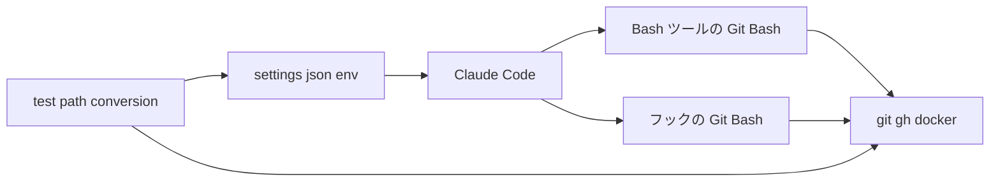

# 設計

## 概要

Claude は、Claude Code の設定ファイル `.claude/settings.json` の `env` に、Git Bash の引数の書き換えを止める変数 `MSYS2_ARG_CONV_EXCL` を値 `*` で置く。設定はリポジトリの中にあるので、所有者と参加者は作業PCで何も設定しなくてよい。

Claude は、テスト `test-protect-main.sh` を、書き換えを止めた状態でも通るように直す。あわせて、Claude がパスのつもりで `/c/…` や `/tmp/…` を Windows 向けのプログラムに渡さないよう、CLAUDE.md の Git規約に書き方を1項目足す。

書き換えを止める変数が外れたことに気づけるよう、Claude はテスト `test-path-conversion.sh` を足す。

## 作るものと作らないもの

### 作るもの

- `.claude/settings.json` の `env` への `MSYS2_ARG_CONV_EXCL` の追加
- 書き換えを止める変数が働いているかを確かめるテスト `.claude/hooks/tests/test-path-conversion.sh`
- 書き換えを止めた状態でも通るようにする `.claude/hooks/tests/test-protect-main.sh` の直し
- CLAUDE.md の Git規約への、Windows 向けのプログラムに渡すパスの書き方の項目

### 作らないもの

- Claude のコマンドを実行の前に止めるフック。この設計では書き換えが起きないので、止める理由が無い
- 引数でない環境変数の書き換えを止めること
- 所有者が自分の端末で打つコマンドと、所有者が打つスクリプト `start-dev.sh` の扱い。`start-dev.sh` はもとから自分で `MSYS_NO_PATHCONV=1` を設定している
- `.claude/scripts/parallel/lib.sh` の `MSYS_NO_PATHCONV=1` の取り外しと置き換え。`lib.sh` を読み込むスクリプトは所有者の端末からも呼ばれるので、Claude は `lib.sh` の `MSYS_NO_PATHCONV=1` を今のまま残す
- `/verify-all` や CI に、`.claude/` の下のテストを自動で流す仕組みを足すこと。ほかのフックのテストにも関わる別の変更になる
- メモリの記述の直し

## 使う既存の仕組み

- Claude Code の `settings.json` の `env`(https://code.claude.com/docs/en/settings-reference.md 、https://code.claude.com/docs/en/env-vars.md)
- Git for Windows の MSYS の実行環境が読む変数 `MSYS2_ARG_CONV_EXCL`。MSYS の実行環境とは、Git Bash の bash などのプログラムが、Unix と同じ形のパスを Windows の上で扱えるようにする、Git for Windows に含まれる土台を指す。MSYS でないプログラムとは、この土台を使わない Windows 向けのプログラム(`git` `gh` `docker` など)を指す。値が `*` のとき、MSYS の実行環境は、MSYS でないプログラムを起動するときの引数をどれも書き換えない(https://www.msys2.org/docs/filesystem-paths/)
- 既存のフックのテストの書き方。既存のフックのテストは、`bash` と `perl` の `JSON::PP` だけを使い、`mktemp -d` の結果を `pwd -W` でドライブ文字の形に直して使い、最後に成功と失敗の件数を出す(`.claude/hooks/tests/test-check-verify-before-stop.sh` など)
- `.claude/settings.json` と `.claude/hooks/` を書けるのは所有者だけである(`settings.json` の `deny`)。この2か所の変更は、Claude が scratchpad に用意し、所有者が置く

## 設計を見直すきっかけ

- Claude Code が、Bash ツールの環境に自分で MSYS の変数を設定するようになったとき。`settings.json` の値と食い違わないかを確かめ直す
- Claude Desktop アプリの起動の環境が `MSYS2_ARG_CONV_EXCL` を設定するようになったとき
- Claude Code が Windows で Git Bash 以外のシェル(PowerShell など)を Bash ツールに使うようになったとき
- Git for Windows が `MSYS2_ARG_CONV_EXCL` の扱いを変えたとき
- 新しいスクリプトやテストが、`/tmp/…` や `/c/…` の形のパスを Windows 向けのプログラムに渡すようになったとき

## プロジェクトの決まりを守っているか

- 品質チェックの設定: Claude は、この設計で `.claude/settings.json` と `.claude/hooks/tests/` を変える。どちらも CLAUDE.md がゲート設定とする `.claude/` の下にあるので、このPRは CODEOWNERS により所有者の承認を待つ。品質チェックの設定ファイル(`.github/` `eslint.config.js` `vite.config.ts` `quality.gradle`)は変えない
- 使う外部の機能がこのリポジトリで使えるか: `settings.json` の `env` は、Claude Code のどのプランでも使える設定である。Claude は、文書で次のことを確かめた。`env` の値は、Bash ツールのコマンドとフックのコマンドを含む、Claude Code が起こすサブプロセスに届く(https://code.claude.com/docs/en/settings-reference.md の `### env`、https://code.claude.com/docs/en/env-vars.md の「In settings files」と `CLAUDECODE` の行)。このリポジトリの SessionStart のフックが worktree のセッションでも動いていることから、worktree でもプロジェクトの設定が当てられていることも確かめた。ただし、Claude は、`env` の値が Windows の Bash ツールとサブエージェントの Bash ツールの環境に実際に届くことを、まだ実測していない。Claude は `.claude/settings.json` を書けない(`settings.json` の `deny`)ので、所有者が置く前には実測できない。そこで、実装の最初の手順として、所有者が `settings.json` の `env` を置いたあと、Claude は、自分の Bash ツールとサブエージェントの Bash ツールの2か所で、`MSYS2_ARG_CONV_EXCL` の値と、`git rev-parse --sq-quote /kiro-spec-quick` が返す文字列を実測する。どちらかで届かなければ、Claude はほかの部品を作らずに止まり、所有者に戻して、作り方の比較(research.md の案CとD)からやり直す。フックの環境に値が届くかどうかは、Claude は実測しない。フックは `/` で始まる引数を Windows 向けのプログラムに渡さず、値が届いたときにフックの判定が変わらないことは、変数のある環境でフックのテストを流して確かめるからである
- 関係のない項目: backend のコードを置く層、frontend の機能ごとの境界、frontend の状態の持ち方、データベースの表の形、新しいライブラリの追加

## 全体の構成



Claude は、書き換えを止める変数を、コマンドの文字ではなく Claude Code の環境に置く。実行の前にコマンドの文字を読んで止めるフックを作っても、そのフックは、引用符、ヒアドキュメント、`$(...)` を正しく読めず、すり抜けを残す。環境に置けば、Claude とサブエージェントが書いたどのコマンドにも、フックが起こすコマンドにも、同じ値が届く。Claude は、比べた案と理由を research.md に書いた。

Claude は、引数だけを止める `MSYS2_ARG_CONV_EXCL` を選び、引数と環境変数の両方を止める `MSYS_NO_PATHCONV` を選ばない。要件の対象は引数だけであり、環境変数の書き換えまで止めると、Claude が設定した環境変数の受け取り方まで変わるからである。

**使う技術**:
- 実行環境: Claude Code の `settings.json` の `env`。書き換えを止める変数を、Bash ツールとフックに届ける
- 実行環境: Git for Windows の MSYS の実行環境(調査は 2.39.1 で行った)。`MSYS2_ARG_CONV_EXCL=*` を読み、引数を書き換えない
- テスト: `bash` と `perl` の `JSON::PP`。既存のフックのテストと同じく、jq に依存しない

## ファイルの構成

Claude が新しく作るファイル:

- `.claude/hooks/tests/test-path-conversion.sh`: 部品「test-path-conversion.sh」(所有者が置く)

Claude が変えるファイル:

- `.claude/settings.json`: 部品「settings.json の env」(所有者が置く)
- `.claude/hooks/tests/test-protect-main.sh`: 部品「test-protect-main.sh の直し」(所有者が置く)
- `CLAUDE.md`: 部品「CLAUDE.md の Git規約の項目」

## 部品

### settings.json の env(Claude Code が起こすコマンドの環境に、書き換えを止める変数を入れる設定)

対応する要件: 1.1, 1.2, 1.3, 1.4, 2.3, 3.1, 3.2

**役割**: Claude は、`.claude/settings.json` の最上位に、次の `env` を足す。ほかの欄(`permissions` `hooks`)は変えない。

```json
"env": {
    "MSYS2_ARG_CONV_EXCL": "*"
}
```

Claude Code は、この値を、Bash ツールのコマンド、フックのコマンド、サブエージェントの Bash ツールのコマンドの環境に入れる。Git Bash は、この値があると、Windows 向けのプログラムに渡す引数を1つも書き換えない。引数の先頭が `/` のもの、`=` の後ろが `/` のもの、`:` で区切った並びのどれも、書いたとおりに届く。macOS と Linux の bash はこの変数を読まないので、macOS と Linux の作業PCで Claude が実行するコマンドの動きは変わらない。この部品は、環境変数の書き換え(`PATH` などの扱い)を変えない。

**いつ動くか**: Claude Code は、所有者が作業フォルダを信頼したあと、セッションの始めにこの値を当てる。所有者が `settings.json` を保存し直したときは、動いているセッションにも当て直す。worktree は `settings.json` を含むリポジトリの写しなので、所有者が worktree を選んで開いたセッションにも同じ値が当たる。

**失敗したとき**: Claude Desktop アプリの起動の環境がすでに `MSYS2_ARG_CONV_EXCL` を設定していると、Claude Code はこの値を無視する。このときは、部品「test-path-conversion.sh」の場合4が失敗し、いまのシェルに `MSYS2_ARG_CONV_EXCL` の値 `*` が届いていないことを示す。

### test-path-conversion.sh(書き換えを止める変数が働いているかを確かめるテスト)

対応する要件: 4.1, 4.2, 1.1, 1.2, 3.1

**役割**: このテストは、次の4つの場合を確かめ、成功と失敗の件数を出す。1件でも失敗すれば終了コード1で、すべて通れば0で終わる。このテストは、ファイルを書かず、`git` の設定も変えない。

- 場合1: `$(dirname "$0")/../../settings.json` を `perl` の `JSON::PP` で読み、`env` の `MSYS2_ARG_CONV_EXCL` が `*` であることを確かめる。ファイルが無いとき、JSON として読めないとき、値が違うときは失敗にする
- 場合2: 場合1で読んだ値を `MSYS2_ARG_CONV_EXCL` に入れて、`git rev-parse --sq-quote` に4つの引数 `/kiro-spec-quick`、`--title=/kiro-spec-quick`、`/a:/b`、`/foo:/bar` を渡す。`git` が返した文字列が、渡した4つと同じ文字であることを確かめる。`git` は Windows では MSYS でないプログラムなので、受け取った引数を表示させれば、書き換えが起きたかが分かる
- 場合3: `uname -s` が `MINGW` か `MSYS` で始まるとき(Windows の Git Bash のとき)だけ、`MSYS2_ARG_CONV_EXCL` と `MSYS_NO_PATHCONV` を外して、`git rev-parse --sq-quote /kiro-spec-quick` が `/kiro-spec-quick` 以外を返すことを確かめる。この場合は、場合2が書き換えを見分けられることを確かめるためにある。ほかのOSでは書き換えが起きないので、確かめずに「確かめない(Windows の Git Bash でないため)」と出す
- 場合4: 環境変数 `CLAUDECODE` があるとき(Claude Code の Bash ツールから流したとき)だけ、いまのシェルの `MSYS2_ARG_CONV_EXCL` が `*` であることを確かめる。Claude Code の外で流したときは、確かめずに「確かめない(Claude Code の外で流したため)」と出す

**呼び出し方**: `bash .claude/hooks/tests/test-path-conversion.sh`。引数は取らない。

### test-protect-main.sh の直し(書き換えを止めた状態でも通るようにする既存のテストの直し)

対応する要件: 2.2

**役割**: Claude は、このテストの13行目と14行目を、ほかのテストと同じ書き方に直す。直したあとのテストは、`mktemp -d` の結果を `TMP_ROOT` に置き、`WORK=$(cd "$TMP_ROOT" && { pwd -W 2>/dev/null || pwd; })` でドライブ文字の形に直したパスを `WORK` にする。後片付けの `trap` は `TMP_ROOT` を消す。Claude は、テストの場合と、期待する終了コードを変えない。今のテストは `/tmp/…` の形のパスを `git init` と `git -C` に渡しているので、書き換えを止めると、`git` がそのパスを `C:\tmp\…` と読み、2件が失敗し、`C:\tmp` の下にリポジトリが残る。

### CLAUDE.md の Git規約の項目(Windows 向けのプログラムに渡すパスの書き方)

対応する要件: 1.6

**役割**: Claude は、CLAUDE.md の「Git規約」の節の、Git操作をホストOSで行う項目のあとに、次の1項目を足す。

- Windows では、Claude の Bash は Git Bash の引数の書き換えを止めてある(`.claude/settings.json` の `env` の `MSYS2_ARG_CONV_EXCL`)。`git` `gh` `docker` などにパスを渡すときは、`C:/Users/…` のドライブ文字の形か、作業フォルダからの相対の形で書く。`/c/…` や、`mktemp` が返す `/tmp/…` の形は渡さない。`mktemp` の結果は `cd "$d" && pwd -W` でドライブ文字の形に直す

この項目は、Claude がコマンドのパスを書き直す回数を減らすためにある。書き換えを防ぐことは部品「settings.json の env」が受け持ち、この項目には頼らない。

## テストの方針

- 単体テスト:
  - `test-path-conversion.sh` の場合1は、`settings.json` から `MSYS2_ARG_CONV_EXCL` を消すか値を変えると失敗する(要件4の2の、書き換えを防ぐ手段を外すか壊す変更をしたらテストが失敗すること)。Claude は、実装のときに、写しの `settings.json` で値を消して、場合1が失敗することを確かめる
  - `test-path-conversion.sh` の場合2と場合3は、Windows の Git Bash で、変数があるときに書いたとおりの文字が届き、無いときに書き換わることを確かめる(要件1の1の、Claude が書いた引数が書いたとおりの文字でプログラムに届くこと)
  - `test-protect-main.sh` は、変数があるときも無いときも、52件がすべて通り、`C:\tmp` の下に何も作らない(要件2の2の、フックが変更の前と同じ判定をすること)
- 結合テスト:
  - 所有者が `settings.json` を置いたあと、Claude は、自分の Bash ツールで `test-path-conversion.sh` を流し、場合4まで通ることを確かめる(要件1の2の、コマンドの種類を問わず書き換わった文字列を届けないこと。要件3の1の、作業PCごとの設定なしで引数が書き換えられずに届くこと)
  - Claude は、サブエージェントに `test-path-conversion.sh` を流させ、場合4が通ることを確かめる(要件1の3の、サブエージェントが実行するコマンドにも書き換わった文字列を届けないこと)
  - Claude は、変数が届いた Bash ツールで、`.claude/hooks/tests/` と `.claude/scripts/parallel/tests/` のテストをすべて流し、通ることを確かめる(要件2の1の、リポジトリに書かれたコマンドが変更の前と同じ結果で終わること。要件2の2の、フックが変更の前と同じ判定をすること)
  - Claude は、このPRの出荷で、`/ship` の手順のコマンド(`git commit -F`、`git push -u origin`、`gh pr create`)が変数のある環境で通ることを確かめる(要件2の1の、リポジトリに書かれたコマンドが変更の前と同じ結果で終わること)
- 要件1の6の後半(Claude がエラーを見てパスを書き直すこと)は Claude の振る舞いなので、Claude はこれを自動のテストでは確かめない
- 要件2の3(macOS と Linux で動きが変わらないこと)は、`MSYS2_ARG_CONV_EXCL` を読むのが MSYS の実行環境だけであることで成り立つ。手元に macOS と Linux の作業PCが無いので、Claude はこれを実機では確かめない
