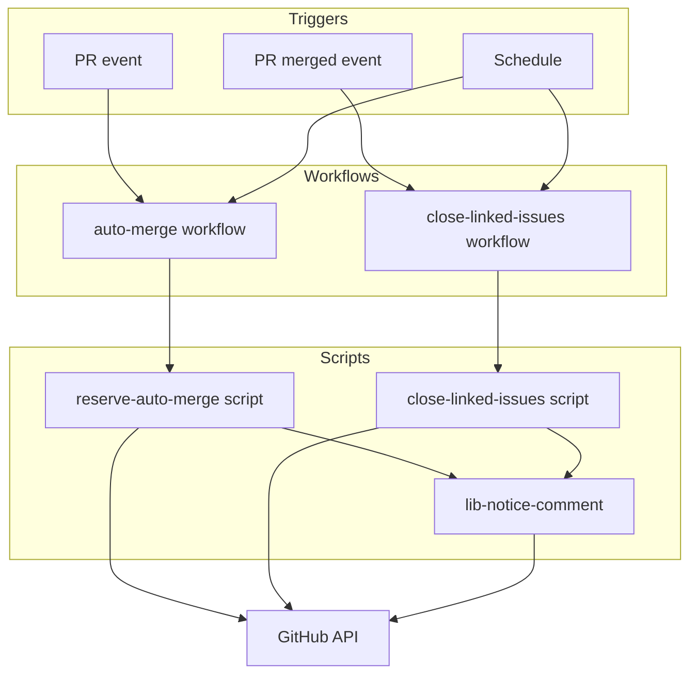
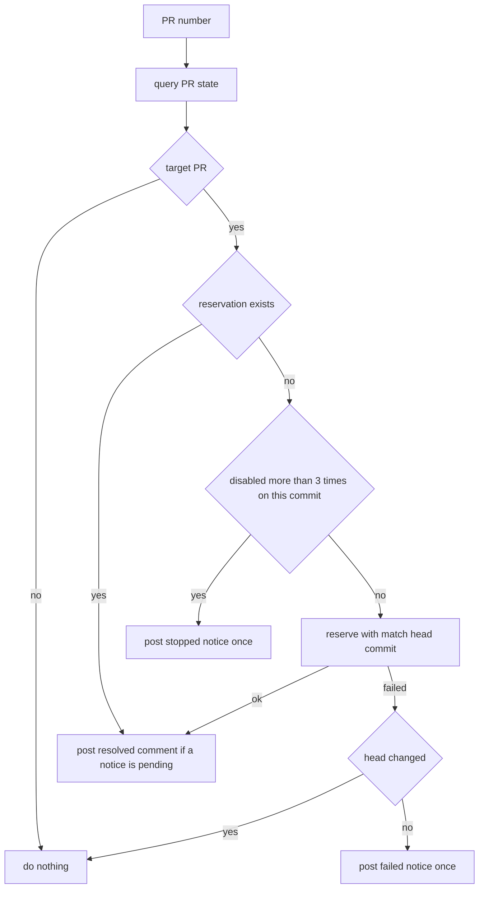
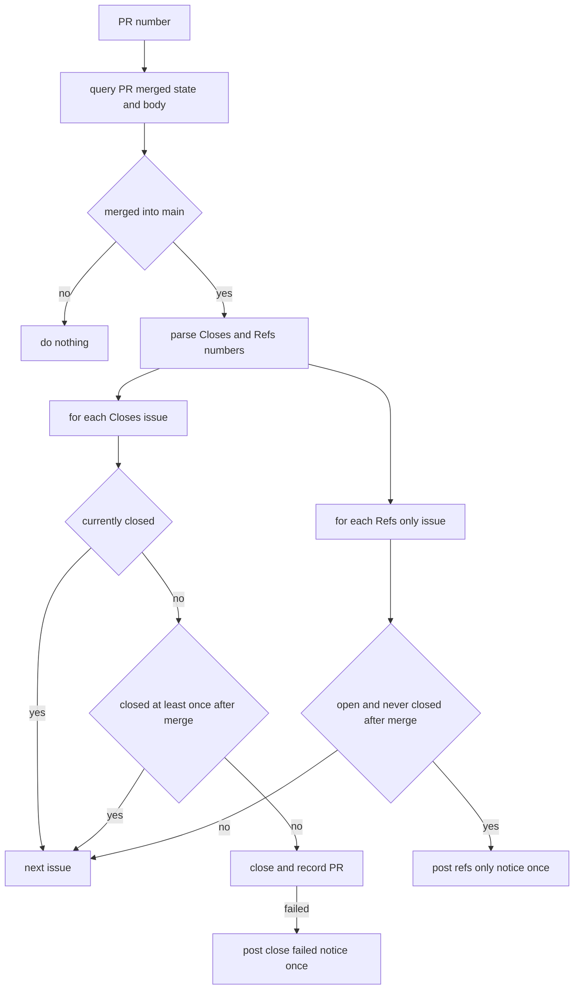

# 設計

## 概要

この設計は、マージ後の Issue のクローズと、自動マージの予約・付け直しを、AI の操作にも PR の作成者にも依らず、GitHub Actions に行わせる。GitHub Actions がこれらを果たせなかったときは、GitHub Actions が対象の PR・Issue へのコメントで所有者に知らせる。

この設計の利用者は、リポジトリの所有者である。所有者は、コードを読まず、知らせを受けたときだけ対処する。

この設計は、自動マージの予約を `/ship` の手順(AI の操作)から外し、ワークフローに移す。この設計は、今の `rearm-auto-merge.yaml`(ルール違反で外れた予約だけを付け直すワークフロー)を、外れた理由を問わず予約するワークフローに置き換える。Issue のクローズは、GitHub の自動クローズに任せたままにし、GitHub が閉じ漏らした Issue をワークフローが閉じる。

## 作るものと作らないもの

### 作るもの

この設計は、次のことを目指す。

- マージされた PR の本文の `Closes #<番号>` の Issue が、GitHub の紐づけの成否に依らず閉じる
- main 向けの PR に、作成者を問わず自動マージが予約され、予約が外れても付け直される
- ワークフローが果たせなかったことが、所有者に届く

この spec は、次のものを持つ。

- 対象の PR に自動マージの予約が無いときに予約する判定と操作(新しい予約と付け直しの両方)
- マージ済みの PR の本文から対応する Issue を読み取り、開いたままなら閉じる判定と操作
- 上の2つが果たせなかったときの、PR・Issue への知らせのコメントと、その重複の防止
- 出荷手順(`/ship`)・CLAUDE.md・README・運用文書のうち、予約と Issue のクローズに関する記述

### 作らないもの

この設計は、次のことを目指さない。

- Dependabot の PR の予約。Dependabot の PR の予約は `dependabot-auto-merge.yaml` が受け持つ
- カナリアPR・fork の PR への予約
- マージの前に `Closes` の記載を必須チェックとして検査すること
- GitHub が `Closes` を紐づけなかった原因の究明
- 必須チェック・承認の要否の変更
- 見直しの定期実行そのものが止まったことの検知

この spec は、次のものを持たない。この設計は、次のものを変えない。

- `dependabot-auto-merge.yaml` と `check-release-age.sh`
- `pre-merge-check.yaml`・`rerun-approval-gated-checks.yaml`・ruleset
- 週次監査・カナリア照合・その通知の Issue
- `.github/audit/required-checks.json`。この設計は必須チェックを新しく足さないため、この一覧を変えない

## 使う既存の仕組み

- GitHub の API。ワークフローとスクリプトは、`gh` を通して GraphQL と REST を使う
- `secrets.BOT_GITHUB_TOKEN`: スクリプトは、このトークンを自動マージの予約の操作だけに使う
- `github.token`: スクリプトは、このトークンを照会、Issue のクローズ、コメントに使う
- 既存の必須チェック `escape-hatch`(`guardrails.yaml`): この設計は、このチェックにテストのステップを足す

## 設計を見直すきっかけ

- `dependabot-auto-merge.yaml` が予約の対象や判定を変えたとき。この spec の対象外の境界が動く
- カナリアPRを作る側が、カナリアPRの印(ブランチ名 `canary/`、ラベル `canary`)を変えたとき
- 出荷手順が、PR 本文の決まり(`Closes #<番号>` `Refs: #<番号>`)を変えたとき
- 所有者が、マージ方式(squash)またはリポジトリの自動マージの設定を変えたとき
- 知らせの目印(HTML コメント)の書式を変えたとき。書式を変えると、スクリプトは過去の知らせと照合できなくなる

## プロジェクトの決まりを守っているか

- 新しいライブラリの追加: なし。スクリプトは、`gh` と `jq` を実行環境に入っているまま使う。ワークフローが使うアクションは、既存の `actions/checkout` だけである
- 品質チェックの設定: **この設計は、品質チェックの設定の変更を必要とする。** 変更は、`.github/workflows/` へのワークフローの追加2件と削除1件、`.github/scripts/` へのスクリプトとテストの追加、`guardrails.yaml` の `escape-hatch` へのテストのステップの追加、`.claude/skills/ship/SKILL.md` の手順の変更である。この機能そのものが品質チェックの設定の領域にあるため、この設計はこれらの変更を分離できない。CODEOWNERS により、PR は所有者の承認までマージされない。Claude は、変更の内容と理由を PR 本文に書いて所有者に提案する。このセッションからは `.github/` と `.claude/` に書き込めないため、Claude が作ったファイルの配置は所有者が行う
- 使う外部の機能がこのリポジトリで使えるか: Claude は、`gh api repos/:owner/:repo` で `owner.type=User`・`visibility=public`・`allow_auto_merge=true`・`allow_squash_merge=true` を確認した(2026-10-01)。自動マージの予約と `auto_merge_disabled` での起動は、今の `rearm-auto-merge.yaml` で動いている(実行 36812062119)。定期実行は公開リポジトリで使えるが、60日間活動が無いと GitHub が定期実行を自動で止める
- 関係のない項目: backend のコードを置く層(backend を変更しない)、frontend の機能ごとの境界(frontend を変更しない)、frontend の状態の持ち方、データベースの表の形(マイグレーションなし)

## 全体の構成



- 選んだ型: この設計は、イベントと定期の見直しを組み合わせる。ワークフローはイベントで即時に動き、定期実行がイベントの取りこぼしを拾う。この型は `dependabot-auto-merge.yaml` と同じである
- 部品の責任の分け方: ワークフローは、「いつ・どの PR について動かすか」だけを持つ。判定と操作はスクリプトが持つ。スクリプトは PR 1件を引数に取り、起点のイベントを知らない
- 依存の向き: ワークフローがスクリプトを呼び、スクリプトが共通の関数(`lib-notice-comment.sh`)を呼び、それぞれが GitHub の API を使う。2つのスクリプトは互いを呼ばない
- 状態: この設計は、状態の保存場所を持たない。スクリプトは、その時点の PR・Issue の状態、タイムライン、目印つきのコメントから判定する
- 守る既存の作法: ワークフローは base 側のコミットを checkout し、認証情報を `.git` に残さず、実行の前に自己テストを流す。ワークフローは、アクションをコミット SHA で固定する

**使う技術**:
- 実行環境: GitHub Actions(`ubuntu-latest`)。起動と権限の付与を受け持つ。この設計は、新しいアクションを足さない
- スクリプト: bash + `gh` + `jq`(ランナーに入っている版)。判定と操作を受け持つ。既存のスクリプトと同じである
- テスト: bash。テストは `gh` を偽物に置き換え、判定を確かめる。テストはネットワークを使わない

## ファイルの構成

Claude が作るファイル、消すファイル、変えるファイル(`.github/` の中)は、次のとおりである。

```
.github/
├── workflows/
│   ├── auto-merge.yaml               # 新規。予約の仕組みの起動(PR のイベントと30分ごとの見直し)
│   ├── close-linked-issues.yaml      # 新規。Issue クローズの仕組みの起動(マージのイベントと1時間ごとの見直し)
│   ├── rearm-auto-merge.yaml         # 削除(auto-merge.yaml が置き換える)
│   └── guardrails.yaml               # 変更。escape-hatch に新しいテスト3本のステップを足す
└── scripts/
    ├── reserve-auto-merge.sh         # 新規。PR 1件について、予約の要否を判定して予約・知らせを行う
    ├── close-linked-issues.sh        # 新規。マージ済み PR 1件について、対応する Issue を閉じる・知らせる
    ├── lib-notice-comment.sh         # 新規。目印つきの知らせのコメントを1回だけ付ける共通の関数
    └── tests/
        ├── test-reserve-auto-merge.sh
        ├── test-close-linked-issues.sh
        └── test-lib-notice-comment.sh
```

Claude が変えるファイル(`.github/` の外):

- `.claude/skills/ship/SKILL.md`: Claude は、手順6を「予約する」から「仕組みが予約したことを確かめる」に変える。Claude は、`pre-merge-check` ラベルを PR の作成と同時に付ける形にする。Claude は、`Closes` と `Refs` の決まりを変えない
- `CLAUDE.md`: Claude は、Git規約の「`gh pr merge --auto --squash` を予約する」を、仕組みが予約する旨に変える
- `README.md`: Claude は、ワークフロー一覧表の `rearm-auto-merge.yaml` の行を `auto-merge.yaml` に置き換え、`close-linked-issues.yaml` の行を足す。Claude は、Mermaid 図の「ルール違反で外れた予約はかけ直す」を直す
- `doc/開発フロー/監査手順.md`: Claude は、知らせを受け取ったときの対処、予約を手で外しても付け直されること、保留には `pre-merge-check` ラベルを使うこと、見直しの定期実行が止まっても知らせが出ないこと(残余リスク)を足す。Claude は、導入のときに1回だけ行う確認の手順をこの文書に書かず、導入の PR の本文に書く
- `doc/開発フロー/基盤構築手順.md`: Claude は、検証用 PR の記述(152・205・215行目付近)を、仕組みが予約する前提に直す。マージさせない検証用 PR は、下書きで作る

## 処理の流れ

### 予約の判定(PR 1件)



- 「対象の PR」は、次をすべて満たす PR である。PR が開いている。PR が下書きでない。base が main である。作成者が `dependabot[bot]` でない。PR が fork から出されていない。ブランチ名が `canary/` で始まらず、ラベル `canary` が付いていない
- スクリプトは、外れた回数として、最後のコミットより後の `AutoMergeDisabledEvent` を理由を問わず数える。新しいコミットが積まれると、回数は 0 に戻る(要件4-4)
- 付け直しを止めた PR は、定期の見直しでも同じ判定を通る。そのため、定期の見直しも、その PR に予約を付け直さない

### Issue のクローズ(マージ済み PR 1件)



- スクリプトは、いま閉じている Issue に、いつ・誰が閉じたかを問わず何もしない(要件1-4)。この扱いは、マージより前に所有者が手で閉じた Issue と、同じ Issue を `Closes` に書いた2本目の PR の Issue にも当てはまる
- 開いている Issue のタイムラインに、その PR の `mergedAt` 以降の日時を持つ `ClosedEvent` があれば、スクリプトは「マージの後に閉じられ、開き直された」とみなし、何もしない(要件2-6)。そのような `ClosedEvent` が無ければ、スクリプトはその Issue を閉じる
- マージのイベントで起動したときは、ワークフローは、GitHub 自身のクローズを待つため、60秒待ってからスクリプトを呼ぶ

## 部品

この設計の部品は、次の表のとおりである。

| 部品 | 種類 | 役割 | 対応する要件 | 主に使う部品 | 呼び出し方の種類 |
|---|---|---|---|---|---|
| auto-merge.yaml | ワークフロー | 予約の判定を起動する | 3.1–3.3, 3.5, 3.6, 4.1, 4.2, 4.4, 6.2, 6.3 | reserve-auto-merge.sh (P0) | イベント、一括処理 |
| reserve-auto-merge.sh | スクリプト | PR 1件の予約の判定・操作・知らせと、見直しの対象の一覧 | 3.4–3.8, 4.1–4.5, 5.1, 5.2, 5.4, 6.1, 6.3, 6.4 | lib-notice-comment.sh (P0), GitHub API (P0) | サービス |
| close-linked-issues.yaml | ワークフロー | Issue のクローズを起動する | 1.6, 1.7, 2.4, 2.5, 2.7, 6.2, 6.5 | close-linked-issues.sh (P0) | イベント、一括処理 |
| close-linked-issues.sh | スクリプト | マージ済み PR 1件の Issue のクローズ・知らせと、見直しの対象の一覧 | 1.1–1.5, 1.7, 2.1–2.7, 6.5 | lib-notice-comment.sh (P0), GitHub API (P0) | サービス |
| lib-notice-comment.sh | スクリプト | 目印つきの知らせを1回だけ付ける | 2.8, 5.3 | GitHub API (P0) | サービス |

### ワークフロー

#### auto-merge.yaml(PRに自動マージの予約を付けるワークフロー)

対応する要件: 3.1, 3.2, 3.3, 3.5, 3.6, 4.1, 4.2, 4.4, 6.2, 6.3

**役割**: このワークフローは、PRのイベントと定期実行で起動し、PRごとにスクリプト `reserve-auto-merge.sh` を呼び出す。予約を付けるかどうかはスクリプトが判定し、ワークフローは判定しない。

**権限**: ワークフローに与える権限は、`contents: read`(コードを checkout するため)と `pull-requests: write`(PRに知らせのコメントを書くため)の2つに限る。予約の操作には、ボットのトークン `secrets.BOT_GITHUB_TOKEN` を使う。ワークフローはPRの変更内容を checkout しない。

**PRのイベントで起動するとき(ジョブ `reserve`)**
- 起動するイベント: main に向けた `pull_request` の `opened` `reopened` `ready_for_review` `synchronize` `auto_merge_disabled`
- 動かす条件: PRが同じリポジトリのブランチから出されていて、作成者が `dependabot[bot]` でないこと。fork と Dependabot のイベントにはシークレットが渡されないので、スクリプトを呼ぶ前に、ジョブの条件で外す
- 手順: ワークフローはPRの base のコミット(`github.event.pull_request.base.sha`)を、認証情報を残さない設定(`persist-credentials: false`)で checkout する。次に、スクリプトのテスト3本のうち予約に関わる2本を流す。最後に `reserve-auto-merge.sh <PR番号>` を呼ぶ
- 同時実行: 同じPRのジョブは、`auto-merge-<PR番号>` の組で1つずつ動かす。あとから起動したジョブは、先に動いているジョブを止めずに、終わるのを待つ(`cancel-in-progress: false`)

**定期実行で起動するとき(ジョブ `sweep`)**
- 起動: 30分ごと(cron `7,37 * * * *`)と、手での起動(`workflow_dispatch`)
- 手順: ワークフローは既定のブランチを checkout し、スクリプトのテストを流してから、`reserve-auto-merge.sh --sweep` を1回呼ぶ。対象のPRの一覧はスクリプトが取り、ワークフローはPRを選ばない
- 失敗したとき: スクリプトは、同じPRに何度呼ばれても結果が変わらないように作る。スクリプトは1件の失敗では止まらずに残りのPRを続け、最後に1件でも失敗があればジョブを失敗にする。ワークフローは、PR1件ごとの呼び出しを120秒で打ち切る
- 同時実行: `auto-merge-sweep` の組で1つずつ動かす(`cancel-in-progress: false`)。ジョブ全体は30分で打ち切る

#### close-linked-issues.yaml(マージされたPRに対応するIssueを閉じるワークフロー)

対応する要件: 1.6, 1.7, 2.4, 2.5, 2.7, 6.2, 6.5

**役割**: このワークフローは、マージのイベントと定期実行で起動し、PRごとにスクリプト `close-linked-issues.sh` を呼び出す。Issue を閉じるかどうかはスクリプトが判定し、ワークフローは判定しない。

**権限**: ワークフローに与える権限は、`contents: read`・`pull-requests: read`・`issues: write` の3つだけに限る。ワークフローはシークレットを使わず、`github.token` だけを使う。ワークフローは PR のコードを checkout せず、既定のブランチ(main)を checkout する。

**マージのイベントで起動するとき(ジョブ `on-merge`)**
- 起動するイベント: main に向けた `pull_request` の `closed`
- 動かす条件: `github.event.pull_request.merged == true` であること。マージされずに閉じた PR では、ジョブは動かない
- 手順: ワークフローは `ref: main` を checkout し、自己テストを流す。次に、ワークフローは60秒待ってから、`close-linked-issues.sh <PR番号>` を呼ぶ
- 同時実行: `close-linked-issues-<PR番号>` の組で1つずつ動かす(`cancel-in-progress: false`)

**定期実行で起動するとき(ジョブ `sweep`)**
- 起動: 1時間ごと(cron `23 * * * *`)と、手での起動(`workflow_dispatch`)
- 入力: なし。対象の一覧はスクリプトが取る
- 手順: ワークフローは既定のブランチを checkout し、自己テストを流してから、`close-linked-issues.sh --sweep` を1回呼ぶ。ワークフローは PR を選ばない
- 失敗したとき: スクリプトは冪等に作る。冪等とは、同じ PR に何度呼ばれても結果が変わらないことを指す。スクリプトは1件の失敗では止まらずに残りの PR を続け、最後に失敗があればジョブを失敗(赤)にする
- 同時実行: `close-linked-issues-sweep` の組で1つずつ動かす(`cancel-in-progress: false`)。ジョブ全体は30分で打ち切る(`timeout-minutes: 30`)

**おそれ**: 見直しの対象が200件を超えると、スクリプトは古い側の PR を見落とす。この設計は、7日間で200件を超えるマージを想定しない。

### スクリプト

#### reserve-auto-merge.sh(PR 1件の予約の要否を判定し、予約か知らせを行うスクリプト)

対応する要件: 3.4, 3.5, 3.6, 3.7, 3.8, 4.1, 4.3, 4.4, 4.5, 5.1, 5.2, 5.4, 6.1, 6.3, 6.4

**役割**: このスクリプトは、PR 1件について、対象かどうかと予約の要否を判定し、予約するか知らせを付ける。スクリプトは起点のイベントを知らず、その時点の PR の状態だけで判定する。スクリプトは、`pre-merge-check` ラベルを判定に使わない。

**権限**: スクリプトは、予約の操作にだけ `RESERVE_TOKEN` を使い、照会と知らせには `GH_TOKEN` を使う。スクリプトは、`--admin` など、必須チェックと承認を迂回する指定を使わない。

**使う部品**:
- 呼ぶ部品: lib-notice-comment.sh。スクリプトは、知らせのコメントにこの部品を使う(P0)
- 外部: GitHub GraphQL の `pullRequest`(`state` `isDraft` `baseRefName` `author` `isCrossRepository` `headRefName` `headRefOid` `labels` `autoMergeRequest` `timelineItems(PULL_REQUEST_COMMIT, AUTO_MERGE_DISABLED_EVENT)`)と、`gh pr merge --auto --squash --match-head-commit`(P0)

**呼び出し方(サービス)**:

```
使い方: reserve-auto-merge.sh <PR番号>
        reserve-auto-merge.sh --sweep
          開いている main 向けの PR(最大100件)を一覧し、1件ずつ <PR番号> の形と同じ判定を行う。
          対象かどうかは1件ごとの判定が決める。1件が失敗しても残りを続け、失敗が1件でもあれば終了コード 1。
          一覧を取れないときは何もせず終了コード 1
環境変数(必須): GH_TOKEN / RESERVE_TOKEN / GITHUB_REPOSITORY / GITHUB_REPOSITORY_OWNER
環境変数(任意): NOTICE_AUTHOR(lib-notice-comment.sh を参照)
標準出力: result=<skipped|already|reserved|stopped|failed|head-moved> の1行
終了コード: 0 = 判定と、必要な操作・知らせを終えた(failed・stopped でも知らせを付けられたら 0)
            1 = PR を照会できない、応答の形が想定と違う、知らせを付けられない、引数・環境変数の不足
```

- 呼ぶ前に成り立つ条件: `GH_TOKEN` は、PR の読み取りとコメントの書き込みができる。`RESERVE_TOKEN` は、自動マージを予約できる
- 呼んだあとに成り立つ条件(結果ごと):
  - `skipped`: PR は対象の PR でない。スクリプトは何も書き込まない
  - `already`: PR は予約済みである。スクリプトは予約に触らない。未解消の知らせがあれば、スクリプトは `resolved` のコメントを1回付ける
  - `reserved`: スクリプトが予約した。マージできる状態だった場合は、`gh` がその場でマージする。スクリプトに迂回の権限は無いため、ゲートは飛ばない。未解消の知らせがあれば、スクリプトは `resolved` のコメントを1回付ける
  - `stopped`: 最後のコミットより後に、予約が3回を超えて外れている。スクリプトは予約せず、`stopped` の知らせを1回付ける
  - `failed`: 予約の操作が失敗し、head のコミットは変わっていない。スクリプトは `failed` の知らせを1回付ける
  - `head-moved`: 予約の操作が失敗し、照会の後に head のコミットが変わっていた。スクリプトは何もせず、新しいコミットのイベントか次の見直しに任せる
- 常に成り立つ条件: スクリプトは、照会したときの head のコミットに限って予約する(`--match-head-commit`)

**知らせ(PR へのコメント)**

| kind | 目印 | 本文に含めるもの |
|---|---|---|
| `failed` | `<!-- auto-merge-notice kind=failed head=<SHA> -->` | PR 番号、失敗した操作(自動マージの予約)、`gh` のエラーの要点、してほしいこと(Claude Code に調査を依頼する。bot のトークンの期限を確かめる) |
| `stopped` | `<!-- auto-merge-notice kind=stopped head=<SHA> -->` | PR 番号、同じコミットで外れた回数、付け直しを止めたこと、してほしいこと(PR の状態を確かめる。新しいコミットが積まれると再開する) |
| `resolved` | `<!-- auto-merge-notice kind=resolved head=<SHA> -->` | 予約が付いたこと、対応は要らないこと。メンションを付けない |

- 「未解消の知らせがある」とは、知らせの作成者が付けた `auto-merge-notice` のコメントのうち、最新のものが `failed` か `stopped` であることを指す

#### close-linked-issues.sh(マージ済み PR 1件に対応する Issue を閉じ、閉じられないものを知らせるスクリプト)

対応する要件: 1.1, 1.2, 1.3, 1.4, 1.5, 1.7, 2.1, 2.2, 2.3, 2.6, 6.5

**役割**: このスクリプトは、マージ済み PR 1件について、対応する Issue を閉じ、閉じられない Issue を知らせる。スクリプトの書き込みは、Issue のクローズ、クローズの記録のコメント、知らせのコメントに限る。スクリプトは、PR・ラベル・担当者・Issue の本文に書き込まない。

**使う部品**:
- 呼ぶ部品: lib-notice-comment.sh。スクリプトは、知らせのコメントにこの部品を使う(P0)
- 外部: GitHub GraphQL の `pullRequest`(`merged` `mergedAt` `baseRefName` `body`)と `issue`(`state` `timelineItems(CLOSED_EVENT)`)、`gh issue close`、`gh issue comment`(P0)

**呼び出し方(サービス)**:

```
使い方: close-linked-issues.sh <PR番号>
        close-linked-issues.sh --sweep
          main へマージされた PR のうち、マージが現在時刻の7日前から5分前までのもの(最大200件)を一覧し、
          1件ずつ <PR番号> の形と同じ処理を行う。直近5分を除くのは、マージのイベントで起動したジョブと
          同じ PR を同時に扱わないため。1件が失敗しても残りを続け、失敗が1件でもあれば終了コード 1。
          一覧を取れないときは何もせず終了コード 1。
          現在時刻は環境変数 NOW_EPOCH(任意。テスト用の時刻固定)で差し替えられる
環境変数(必須): GH_TOKEN / GITHUB_REPOSITORY / GITHUB_REPOSITORY_OWNER
環境変数(任意): NOTICE_AUTHOR
標準出力: Issue ごとに issue=<番号> result=<untouched|closed|close-failed|refs-only-noticed|not-an-issue> の1行
終了コード: 0 = すべての Issue について判定と、必要な操作・知らせを終えた(close-failed でも知らせを付けられたら 0)
            1 = PR・Issue を照会できない、応答の形が想定と違う、クローズの記録または知らせを付けられない、引数・環境変数の不足
```

- 呼ぶ前に成り立つ条件: `GH_TOKEN` は、PR の読み取りと Issue の書き込みができる
- 呼んだあとに成り立つ条件(結果ごと):
  - PR がマージされていないか、base が main でないとき: スクリプトは何もせず、終了コード 0 で終える
  - `untouched`: Issue がいま閉じている(閉じた時期を問わない)か、開いているがその PR の `mergedAt` 以降に一度でも閉じられている。`Refs:` だけの Issue で知らせが既にある場合も、この結果になる。スクリプトは何も書き込まない
  - `closed`: スクリプトは、`Closes` の Issue を閉じ、「PR #<番号> のマージにより閉じました」のコメントを付けた
  - `close-failed`: 閉じる操作が失敗した。スクリプトは `close-failed` の知らせを1回付ける
  - `refs-only-noticed`: `Refs:` にあり `Closes` に無い Issue が開いたままである。スクリプトはその Issue を閉じずに、`refs-only` の知らせを1回付ける
  - `not-an-issue`: 番号が存在しないか、番号が PR を指している。スクリプトは何も書き込まず、ログに残す
- 常に成り立つ条件: スクリプトは、いま閉じている Issue と、その PR の `mergedAt` 以降に `ClosedEvent` がある Issue に、どの操作もしない

**本文の読み取り規則**
- `Closes` の Issue: スクリプトは、本文のうち、大文字小文字を区別せず `closes` に続いて(`:` があってもよい)空白と `#<番号>` が来る箇所の番号を、すべて拾う。スクリプトは同じリポジトリの番号だけを扱い、`owner/repo#<番号>` の形は扱わない
- `Refs` の Issue: スクリプトは、同じ規則で `refs` に続く `#<番号>` を拾う。`Refs: N/A` は番号が無いため、対象にならない
- ほかの語: スクリプトは、`Fixes` `Resolves` など、ほかの語を扱わない。出荷手順が定めているのは `Closes` と `Refs` だけである
- 重複: スクリプトは、重複した番号を1回だけ扱う。`Closes` と `Refs` の両方にある番号は、`Closes` として扱う

**知らせ(Issue へのコメント)**

| kind | 目印 | 本文に含めるもの |
|---|---|---|
| `close-failed` | `<!-- issue-close-notice pr=<PR番号> kind=close-failed -->` | PR 番号と Issue 番号、PR はマージされたが Issue を閉じられなかったこと、してほしいこと(この Issue を手で閉じる) |
| `refs-only` | `<!-- issue-close-notice pr=<PR番号> kind=refs-only -->` | PR 番号と Issue 番号、PR はマージされたが本文に `Closes` が無いため閉じていないこと、してほしいこと(終わっていれば手で閉じる。続きがあれば何もしなくてよい) |

- スクリプトは、Issue が閉じたあとに「解消」のコメントを付けない。知らせの場所である Issue 自身が閉じた状態になり、所有者はそれで解消を知れるためである

#### lib-notice-comment.sh(目印つきのコメントを、同じ目印のコメントが無いときだけ付ける共通の関数)

対応する要件: 2.8, 5.3

**役割**: この部品は、目印つきのコメントを、同じ目印のコメントが無いときだけ付ける。スクリプトは、この部品を source して使う。この部品は関数を定義するだけで、シェルの設定を変えず、exit しない。この作法は `lib-ledger-issue.sh` と同じである。この部品は、知らせの作成者(`NOTICE_AUTHOR`。既定は `github-actions[bot]`)が書いたコメントの目印だけを数える。そのため、他人が同じ目印を書いても、知らせは抑えられない。

**呼び出し方(サービス)**:

```
コメントの一覧の読み方(2つの関数に共通):
  REST の `gh api --paginate repos/<GITHUB_REPOSITORY>/issues/<番号>/comments` で読み、各コメントの `.user.login` を
  NOTICE_AUTHOR と比べる(REST では `github-actions[bot]`。GraphQL と `gh pr view --json comments` の
  `author.login` は `github-actions` になり一致しないため、使わない)。新旧は `.created_at` で比べる。
  テストの `gh` の偽物は、この REST の応答の形(`.user.login` が `github-actions[bot]`)を返す

notice_post <番号> <目印> <本文のファイル> <mention: yes|no>
  番号の PR・Issue に、目印を含むコメントが NOTICE_AUTHOR の名前で既にあれば何もしない。
  無ければ、mention が yes のとき本文の先頭行の頭に「@<所有者> 」を付け、末尾に目印を付けてコメントする。
  戻り値: 0 = 付けた、または既にあった / 1 = コメントの一覧を読めない、付けられない、引数・環境変数の不足
notice_last_kind <番号> <目印の接頭辞>
  NOTICE_AUTHOR が書いた、接頭辞に一致する目印のコメントのうち最新のものの kind を標準出力に出す。無ければ空。
  戻り値: 0 = 読めた / 1 = 読めない
環境変数(必須): GH_TOKEN / GITHUB_REPOSITORY / GITHUB_REPOSITORY_OWNER
```

## 失敗したときの扱い

### 方針

- **照会できない・応答の形が想定と違う**: スクリプトは何も書き込まずに、終了コード 1 で終える。スクリプトは、この失敗を予約にもクローズにも倒さない
- **操作の失敗(予約・クローズ)**: スクリプトは知らせのコメントを付け、付けられたら終了コード 0 で終える。知らせが所有者への経路であり、ワークフローの赤は所有者に届かないためである
- **知らせを付けられない**: スクリプトは終了コード 1(赤)で終える。この場合、失敗は所有者に届かない(残余リスク)
- **見直しの中の1件の失敗**: スクリプトは残りの PR を続け、最後に赤で終える

### 見張り

- 各スクリプトは `result=` の行を標準出力に出す。この行が、実行ログの中で、スクリプトが何をしたかを示す
- この設計は、見直しの定期実行が止まったことと、`github.token` でのコメントが失敗したことを検知しない。Claude は、この2つを運用文書に残余リスクとして書く

## テストの方針

### 単体テスト(`gh` を偽物に置き換える。ネットワークを使わない)

`test-reserve-auto-merge.sh` は、次のことを確かめる。
- 対象の判定: 下書き・閉じた PR・マージ済み・base が main 以外・Dependabot・fork・ブランチ名 `canary/`・ラベル `canary` のそれぞれで、スクリプトが `skipped` を返し、予約を呼び出さない(3.4, 3.6, 4.5)
- 作成者が bot でも所有者でも、スクリプトが `reserved` を返す。`pre-merge-check` ラベルが付いていても、スクリプトが `reserved` を返す(3.5, 6.4)
- スクリプトが、予約を `--auto --squash --match-head-commit <head>` で、`--admin` を含めず、`RESERVE_TOKEN` で呼び出す(3.7, 6.1, 6.3)
- 予約済みなら、スクリプトが予約を呼び出さず、`already` を返す(3.8)
- 外れた理由が `manually_disabled` でも `repository_rule_violation` でも、スクリプトが予約する(4.1)
- 最後のコミットより後に3回外れていれば、スクリプトが予約する。4回なら、スクリプトが `stopped` を返し、知らせを1回付ける。2度目の実行では、スクリプトは知らせを増やさない。スクリプトは、最後のコミットより前の外れを数えない(4.3, 4.4, 5.3)
- 予約が失敗したら、スクリプトが `failed` の知らせ(PR 番号・操作・してほしいこと・所有者へのメンション)を付け、2度目の実行では知らせを増やさない。head が変わっていたら、スクリプトが `head-moved` を返し、知らせを付けない(5.1, 5.2, 5.3)
- 最新の知らせが `failed` または `stopped` のときに予約が付くと、スクリプトが `resolved` を1回付ける。最新が `resolved` なら、スクリプトは付けない(5.4)
- 照会が失敗したときと、応答の形が違うときに、スクリプトが終了コード 1 で終え、予約を呼び出さない

`test-close-linked-issues.sh` は、次のことを確かめる。
- 本文の読み取り: スクリプトが、`Closes #1`、`closes: #2`、複数行、同じ行に複数、重複、`Fixes #3`(扱わない)、`Refs: N/A`、`owner/repo#4`(扱わない)を規則どおりに読む(1.1, 1.5)
- スクリプトが、開いている `Closes` の Issue を閉じ、PR 番号を含む記録のコメントを付ける(1.2, 1.3)
- 閉じている Issue には、スクリプトが書き込みを呼び出さない。テストは、`ClosedEvent` が `mergedAt` より後のものと、`mergedAt` より前のものしか無い(マージより前に手で閉じた)ものの両方で確かめる(1.4)
- マージされていない PR と、base が main 以外の PR では、スクリプトが書き込みを呼び出さない(1.7)
- 閉じる操作が失敗したら、スクリプトが `close-failed` の知らせ(PR 番号・Issue 番号・してほしいこと)を付け、2度目は知らせを増やさない(2.1, 2.3, 2.8)
- スクリプトが、`Refs:` だけの開いた Issue を閉じず、`refs-only` の知らせを1回だけ付ける(2.2, 2.8)
- `mergedAt` より後の `ClosedEvent` がある開いた Issue(開き直された Issue)には、スクリプトがクローズも知らせもしない。`mergedAt` より前の `ClosedEvent` しか無い開いた Issue は、スクリプトが閉じる(2.6)
- スクリプトの書き込みの呼び出しが、Issue のクローズとコメントだけである(6.5)

`test-lib-notice-comment.sh` は、次のことを確かめる。
- 目印が無ければ関数がコメントを付け、あれば付けない。関数は、他人が書いた同じ目印を数えない(2.8, 5.3)
- `mention` が yes のとき、関数が先頭行に `@<所有者>` を付け、no のとき付けない
- コメントの一覧を読めないとき、関数が戻り値 1 を返し、コメントを付けない

### ワークフローの検査

- 既存の `escape-hatch` のステップの `actionlint` と `check-action-pinning.sh` が、新しいワークフローにも掛かる
- Claude は、新しいテスト3本を `escape-hatch` のステップに足し、PR ごとに走らせる(6.6)
- ワークフローに残るのは、起動の条件と権限だけである(3.1–3.3 の起点のイベント、1.7 の `merged` の条件、4.2 の定期実行の時刻、6.2 の checkout の対象、6.5 の `permissions`)。Claude は、これらを `actionlint` と、下の導入後の人間による確認で確かめる。見直しの対象を選ぶ判定(2.4、2.5、2.7、4.2)はスクリプトの `--sweep` にあり、上の単体テストが確かめる

`--sweep` のテスト(それぞれのテストファイルに含める)は、次のことを確かめる。
- `reserve-auto-merge.sh --sweep`: スクリプトが、一覧の中の対象の PR だけに予約し、対象外(下書き・Dependabot・カナリア)には予約しない。スクリプトは予約済みの PR に触らない。1件の照会が失敗しても、スクリプトは残りを処理し、終了コード 1 で終える。一覧を取れないときは、スクリプトは予約を呼び出さず、終了コード 1 で終える(4.2)
- `close-linked-issues.sh --sweep`: テストは `NOW_EPOCH` を固定する。スクリプトは、マージが7日前より古い PR と5分以内の PR を処理せず、その間の PR を処理する(テストは境界の前後を1件ずつ確かめる)。マージのイベントの処理が動かなかった想定の PR で、スクリプトは、開いたままの `Closes` の Issue を閉じ、`Refs:` だけの Issue に知らせを付ける(2.4, 2.5, 2.7)

### 導入後の人間による確認(7.5。導入の PR の本文に手順として書く。運用文書には書かない: 7.6)

1. 所有者が、所有者のアカウントで PR を作り、予約が付くことを確かめる(3.5)
2. 所有者が、その PR の予約を手で外し、予約が付け直されることを確かめる(4.1)
3. 所有者が、ワークフローが予約した PR のマージ後に、`dependency-graph.yaml` と `update-pr-branches.yaml` が動いていることを確かめる(6.3)
4. 所有者が、`pre-merge-check` ラベルを付けた PR が、所有者の承認までマージされないことを確かめる(6.4)
5. 所有者が、`Refs:` だけを書いた検証用の PR をマージし、Issue に知らせが付いて所有者に通知が届くことを確かめる(2.2, 5.1 と共通の通知の経路)
6. 所有者が、`Closes` を書いた PR のマージ後に、Issue が閉じていることを確かめる(1.2)
7. `Refs:` だけを書いた検証用の PR の知らせが付いたあと、所有者が Issue の見直しを手動(`workflow_dispatch`)でもう一度動かし、知らせが増えないことを確かめる(2.8)
8. 所有者が予約の見直しを手動で動かし、予約の無い対象の PR(予約を手で外した直後の PR など)に予約が付くことを確かめる(4.2)

## 安全

- **PR のコードを実行しない(6.2)**: どのジョブも PR の head を checkout しない。ワークフローは、スクリプトを、base のコミット(PR のイベント)または main(マージのイベントと定期実行)から取る。同じリポジトリの PR がワークフローの定義そのものを書き換えた場合は、ワークフローはその定義で動く。ただし、ブランチに push できるのは所有者と bot だけであり、この条件は既存のワークフローと同じである
- **トークンの分離**: ワークフローは、PAT を予約の操作にだけ渡す。Issue を閉じるワークフローは、シークレットを使わない
- **ゲートを迂回しない(6.1)**: bot に ruleset の迂回の権限は無く、スクリプトも迂回の指定を使わない。予約が付いても、必須チェックと承認が揃うまで、GitHub は PR をマージしない
- **目印の偽装**: 知らせの重複の判定は、知らせの作成者が書いたコメントだけを数える。そのため、第三者が目印を書いて知らせを抑えることはできない
- **本文の読み取り**: スクリプトは、PR の本文を番号の抽出だけに使い、シェルのコマンドとして評価しない

## 既存の構成

- `rearm-auto-merge.yaml`: このワークフローは、`pull_request` の `auto_merge_disabled` で起動し、外れた理由が `repository_rule_violation` のときだけ PAT で予約し直す。判定はワークフローの中に直接書かれ、テストが無い。同じコミットで予約が3回を超えて外れたら、このワークフローは赤で終える。この赤は所有者に届かない
- `dependabot-auto-merge.yaml`: このワークフローは、Dependabot の PR の予約を、イベントと1日1回の見直しで受け持つ。判定は `check-release-age.sh` が行う。そのテストは、`gh` を偽物に置き換える形である
- `/ship`: PR を作ったあと、AI が `gh pr merge --auto --squash` を実行する。所有者のアカウントで作った PR には、誰も予約しない
- Issue のクローズ: GitHub は、PR 本文の `Closes` を紐づけたときだけ Issue を閉じる。閉じたかどうかを確かめる仕組みは無い
- 通知の作法: スクリプトは `github.token` でコメントし、先頭行の `@<所有者>` で所有者に届ける(`lib-ledger-issue.sh`)。スクリプトは、重複を HTML コメントの目印で防ぐ(`check-release-age.sh`)

## 要件との対応

| 要件 | 要約 | 部品 | 呼び出し方 | 処理の流れ |
|---|---|---|---|---|
| 1.1 | `Closes #<番号>` を対応する Issue とする | close-linked-issues.sh | 本文の読み取り規則 | Issue のクローズ |
| 1.2 | 開いたままなら閉じる | close-linked-issues.sh | CLI | Issue のクローズ |
| 1.3 | どの PR で閉じたかを記録する | close-linked-issues.sh | クローズの記録のコメント | Issue のクローズ |
| 1.4 | 閉じていれば書き込まない | close-linked-issues.sh | CLI | Issue のクローズ |
| 1.5 | 複数あればすべて閉じる | close-linked-issues.sh | 本文の読み取り規則 | Issue のクローズ |
| 1.6 | マージの方法と作成者に依らない | close-linked-issues.yaml | `pull_request: closed` と定期の見直し | — |
| 1.7 | マージされずに閉じた PR では閉じない | close-linked-issues.yaml / close-linked-issues.sh | ジョブの条件と `merged` の照会 | Issue のクローズ |
| 2.1 | 閉じる操作の失敗を知らせる | close-linked-issues.sh / lib-notice-comment.sh | 知らせ `close-failed` | Issue のクローズ |
| 2.2 | `Refs:` だけの Issue は閉じずに知らせる | close-linked-issues.sh / lib-notice-comment.sh | 知らせ `refs-only` | Issue のクローズ |
| 2.3 | 知らせの内容 | close-linked-issues.sh | 知らせの本文 | — |
| 2.4 | 1時間後も開いたままなら閉じる | close-linked-issues.yaml(定期実行)/ close-linked-issues.sh `--sweep` | 定期の見直し | Issue のクローズ |
| 2.5 | 1時間後も知らせが無ければ出す | close-linked-issues.yaml(定期実行)/ close-linked-issues.sh `--sweep` | 定期の見直し | Issue のクローズ |
| 2.6 | マージの後に閉じられた Issue には触らない | close-linked-issues.sh | `ClosedEvent` と `mergedAt` の比較 | Issue のクローズ |
| 2.7 | 見直しはマージから7日以内 | close-linked-issues.sh `--sweep` | 見直しの対象の期間 | — |
| 2.8 | 同じ知らせを繰り返さない | lib-notice-comment.sh | 目印 | — |
| 3.1 | PR の作成で予約 | auto-merge.yaml / reserve-auto-merge.sh | `opened` | 予約の判定 |
| 3.2 | 下書き解除で予約 | auto-merge.yaml | `ready_for_review` | 予約の判定 |
| 3.3 | 開き直しで予約 | auto-merge.yaml | `reopened` | 予約の判定 |
| 3.4 | 下書きには予約しない | reserve-auto-merge.sh | 対象の PR の判定 | 予約の判定 |
| 3.5 | 作成者に依らない | auto-merge.yaml / reserve-auto-merge.sh | 対象の PR の判定 | 予約の判定 |
| 3.6 | Dependabot・カナリア・fork は対象外 | auto-merge.yaml / reserve-auto-merge.sh | 対象の PR の判定 | 予約の判定 |
| 3.7 | squash で予約 | reserve-auto-merge.sh | `gh pr merge --auto --squash` | 予約の判定 |
| 3.8 | 予約済みならそのまま | reserve-auto-merge.sh | CLI | 予約の判定 |
| 4.1 | 外れたら理由を問わず付け直す | auto-merge.yaml / reserve-auto-merge.sh | `auto_merge_disabled` | 予約の判定 |
| 4.2 | 1時間予約が無ければ付け直す | auto-merge.yaml(定期実行)/ reserve-auto-merge.sh `--sweep` | 30分ごとの見直し | 予約の判定 |
| 4.3 | 3回を超えたら止めて知らせる | reserve-auto-merge.sh / lib-notice-comment.sh | 知らせ `stopped` | 予約の判定 |
| 4.4 | 新しいコミットで再開 | auto-merge.yaml / reserve-auto-merge.sh | `synchronize`、回数の数え方 | 予約の判定 |
| 4.5 | 閉じた・マージ済みには付け直さない | reserve-auto-merge.sh | 対象の PR の判定 | 予約の判定 |
| 5.1 | 予約の失敗を知らせる | reserve-auto-merge.sh / lib-notice-comment.sh | 知らせ `failed` | 予約の判定 |
| 5.2 | 知らせの内容 | reserve-auto-merge.sh | 知らせの本文 | — |
| 5.3 | 同じ知らせを繰り返さない | lib-notice-comment.sh | 目印 | — |
| 5.4 | 予約が付いたら、知らせの場所で分かる | reserve-auto-merge.sh | 知らせ `resolved` | 予約の判定 |
| 6.1 | ゲートを迂回しない | reserve-auto-merge.sh | `--auto` だけを使い `--admin` を使わない | — |
| 6.2 | PR が書き換えた内容を権限つきで実行しない | auto-merge.yaml / close-linked-issues.yaml | checkout の対象 | — |
| 6.3 | 後続の処理が起動する方法で予約 | auto-merge.yaml / reserve-auto-merge.sh | `RESERVE_TOKEN` に PAT | — |
| 6.4 | `pre-merge-check` の判定を変えない | reserve-auto-merge.sh | 対象の PR の判定にラベルを含めない | — |
| 6.5 | Issue クローズの仕組みの書き込みの範囲 | close-linked-issues.yaml / close-linked-issues.sh | `permissions` | — |
| 6.6 | 判定を自動テストで検証できる | tests/ 3本、guardrails.yaml | `gh` の偽物 | — |
| 7.1 | `/ship` と CLAUDE.md | ship/SKILL.md、CLAUDE.md | — | — |
| 7.2 | `Closes` と `Refs` の決まりを維持 | ship/SKILL.md | — | — |
| 7.3 | README の表と図 | README.md | — | — |
| 7.4 | 運用文書の記載 | 監査手順.md、基盤構築手順.md | — | — |
| 7.5 | 導入後の人間による確認手順 | 導入の PR の本文 | — | — |
| 7.6 | 運用文書に1回きりの作業を書かない | 監査手順.md、基盤構築手順.md | — | — |

## 移行

1. Claude は、導入の前に、予約の無い開いている PR(Dependabot とカナリアを除く)の一覧を所有者に示す。所有者は、マージしたくない PR を下書きにする
2. Claude は、1つの PR で、新しいワークフロー2件とスクリプトの追加、`rearm-auto-merge.yaml` の削除、`guardrails.yaml`・`/ship`・CLAUDE.md・README・運用文書の変更を行う。この PR は、所有者の承認でマージされる
3. マージ後、所有者は `workflow_dispatch` で両方の見直しを1回ずつ動かす。Issue の見直しは、直近7日のマージ済み PR のうち、閉じ漏れた Issue を閉じる
4. 所有者は、上の「導入後の人間による確認」を行う。手順は、導入の PR の本文にある

- 戻し方: 導入の PR を revert する。revert すると、`rearm-auto-merge.yaml` が戻り、予約は `/ship` の手順に戻る
- 導入の PR 自身は、Claude が `/ship` の今の手順(AI が予約する)で出荷する
