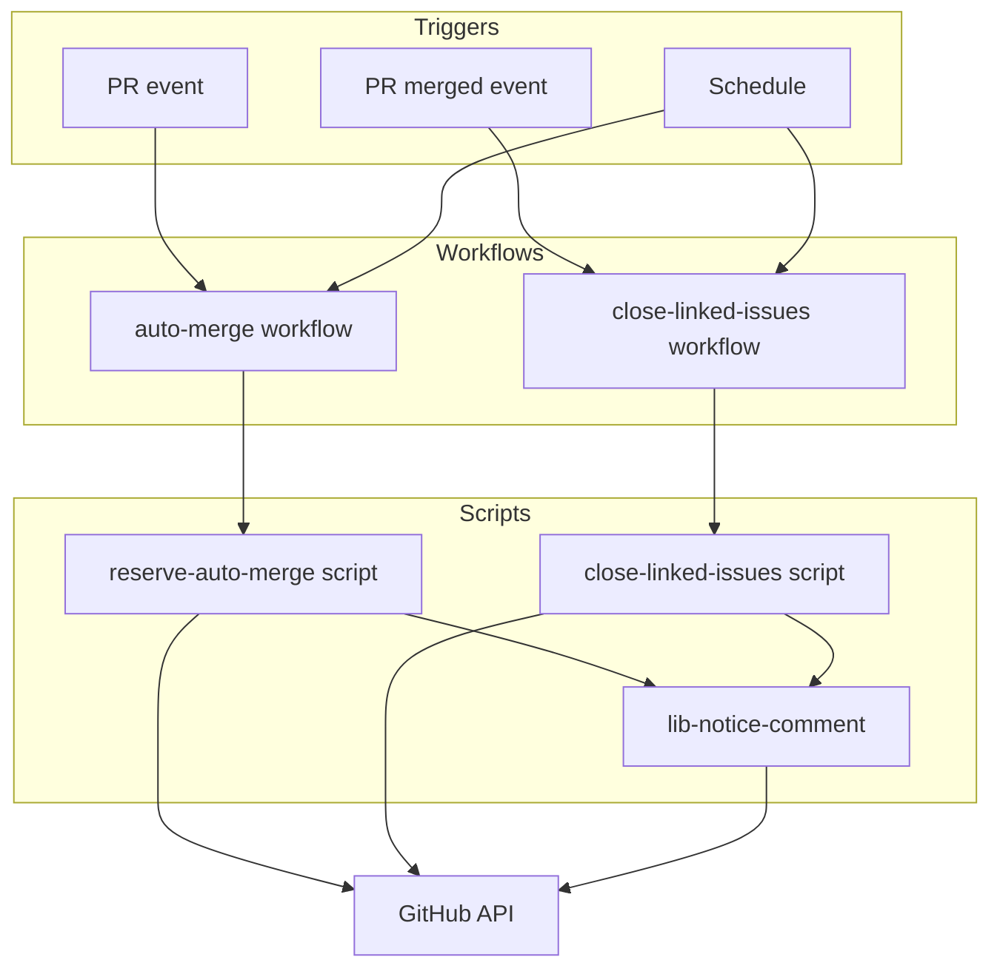
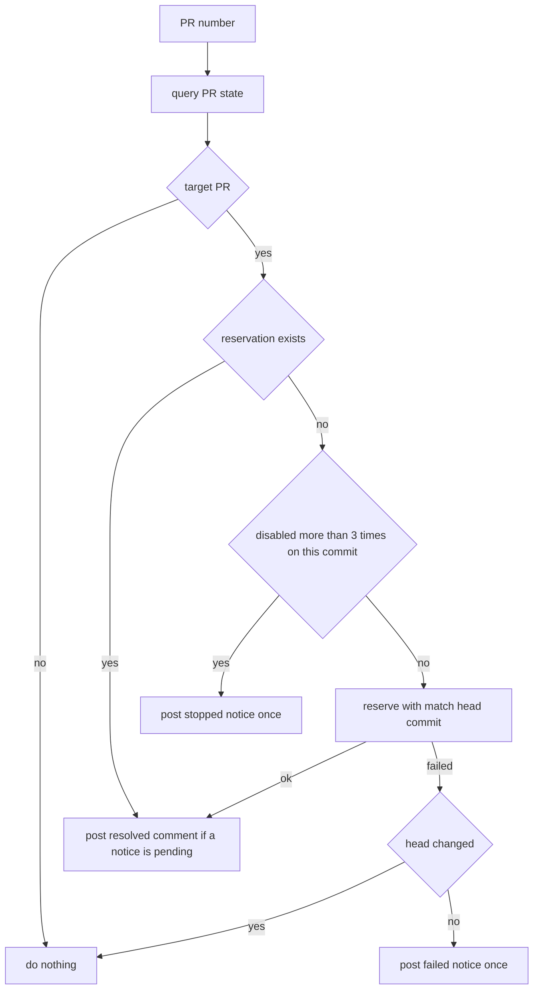
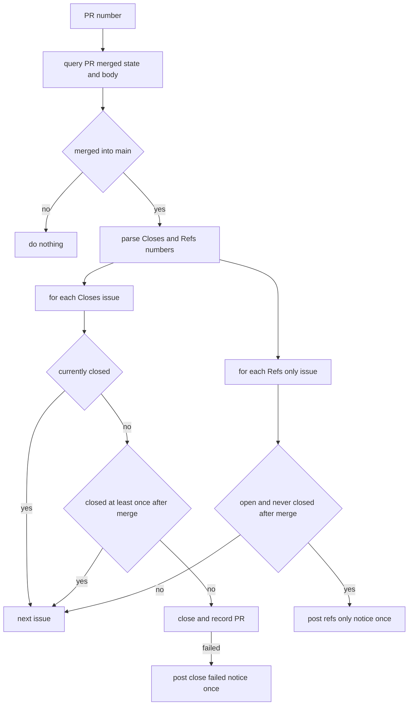

# Design Document

## Overview

**Purpose**: マージ後の Issue のクローズと、自動マージの予約・付け直しを、AI の操作にも PR の作成者にも依らず GitHub Actions が行う。果たせなかったときは、対象の PR・Issue へのコメントで所有者に知らせる。

**Users**: リポジトリの所有者。コードを読まず、知らせを受けたときだけ対処する。

**Impact**: 自動マージの予約を `/ship` の手順(AI の操作)から外し、仕組みに移す。現行の `rearm-auto-merge.yaml`(ルール違反で外れた予約だけを付け直す)を、理由を問わず予約する仕組みに置き換える。Issue のクローズは GitHub の自動クローズに任せたまま、取りこぼしを仕組みが補う。

### Goals
- マージされた PR の本文の `Closes #<番号>` の Issue が、GitHub の紐づけの成否に依らず閉じる
- main 向けの PR に、作成者を問わず自動マージが予約され、外れても付け直される
- 仕組みが果たせなかったことが、所有者に届く

### Non-Goals
- Dependabot の PR の予約(`dependabot-auto-merge.yaml` が受け持つ)
- カナリアPR・fork の PR への予約
- マージ前に `Closes` の記載を必須チェックとして検査すること
- GitHub が `Closes` を紐づけなかった原因の究明
- 必須チェック・承認の要否の変更
- 見直しの定期実行そのものが止まったことの検知

## Boundary Commitments

### This Spec Owns
- 対象の PR に自動マージの予約が無いとき予約する判定と操作(新規・付け直しの両方)
- マージ済み PR の本文から対応する Issue を読み取り、開いたままなら閉じる判定と操作
- 上の2つが果たせなかったときの、PR・Issue への知らせのコメントと、その重複の防止
- 出荷手順(`/ship`)・CLAUDE.md・README・運用文書のうち、予約と Issue のクローズに関する記述

### Out of Boundary
- `dependabot-auto-merge.yaml` と `check-release-age.sh`(変更しない)
- `pre-merge-check.yaml`・`rerun-approval-gated-checks.yaml`・ruleset(変更しない)
- 週次監査・カナリア照合・その通知 Issue(変更しない)
- `.github/audit/required-checks.json`(必須チェックを新しく足さないため変更しない)

### Allowed Dependencies
- GitHub の API(`gh` 経由。GraphQL と REST)
- `secrets.BOT_GITHUB_TOKEN`: 自動マージの予約の操作だけに使う
- `github.token`: 照会、Issue のクローズ、コメントに使う
- 既存の必須チェック `escape-hatch`(`guardrails.yaml`)にテストのステップを足す

### Revalidation Triggers
- `dependabot-auto-merge.yaml` が予約の対象や判定を変えたとき(対象外の境界が動く)
- カナリアPRの印(ブランチ名 `canary/`、ラベル `canary`)を生成側が変えたとき
- PR 本文の決まり(`Closes #<番号>` `Refs: #<番号>`)を出荷手順が変えたとき
- マージ方式(squash)またはリポジトリの自動マージの設定を変えたとき
- 知らせの目印(HTML コメント)の書式を変えたとき(過去の知らせとの照合が切れる)

## KeirekiPro Compliance Check (必須)

- [x] **backend層配置**: N/A(backend を変更しない)
- [x] **frontend境界**: N/A(frontend を変更しない)
- [x] **状態管理**: N/A
- [x] **DBスキーマ**: N/A(マイグレーションなし)
- [x] **依存追加**: なし(`gh` と `jq` は実行環境に入っているものを使う。アクションは既存の `actions/checkout` だけ)
- [ ] **ゲート設定**: **変更を必要とする。** `.github/workflows/` へのワークフローの追加2件と削除1件、`.github/scripts/` へのスクリプトとテストの追加、`guardrails.yaml` の `escape-hatch` へのテストのステップ追加、`.claude/skills/ship/SKILL.md` の手順の変更。機能そのものがゲート設定の領域にあるため分離できない。PR は CODEOWNERS により所有者の承認までマージされない。変更の内容と理由を PR 本文に書いて所有者に提案する。`.github/` と `.claude/` への書き込みはこのセッションからは行えないため、作ったファイルの配置は所有者が行う
- [x] **前提機能の利用可否**: `gh api repos/:owner/:repo` で `owner.type=User`・`visibility=public`・`allow_auto_merge=true`・`allow_squash_merge=true` を確認した(2026-10-01)。自動マージの予約と `auto_merge_disabled` での起動は現行の `rearm-auto-merge.yaml` で動いている(実行 36812062119)。定期実行は公開リポジトリで使えるが、60日間活動が無いと自動で止まる

## Architecture

### Existing Architecture Analysis
- `rearm-auto-merge.yaml`: `pull_request` の `auto_merge_disabled` で起動し、理由が `repository_rule_violation` のときだけ PAT で予約し直す。判定はワークフローの中に直接書かれ、テストが無い。同じコミットで3回を超えて外れたら赤で終える(赤は所有者に届かない)
- `dependabot-auto-merge.yaml`: Dependabot の PR の予約を、イベントと1日1回の見直しで受け持つ。判定は `check-release-age.sh`、テストは `gh` を偽物に置き換える形
- `/ship`: PR 作成のあと AI が `gh pr merge --auto --squash` を実行する。所有者のアカウントで作った PR には誰も予約しない
- Issue のクローズ: GitHub が PR 本文の `Closes` を紐づけたときだけ閉じる。確かめる仕組みは無い
- 通知の作法: `github.token` でコメントし、先頭行の `@<所有者>` で届ける(`lib-ledger-issue.sh`)。重複は HTML コメントの目印で防ぐ(`check-release-age.sh`)

### Architecture Pattern & Boundary Map



**Architecture Integration**:
- Selected pattern: イベント+定期の見直し。イベントで即時に動き、定期実行が取りこぼしを拾う(`dependabot-auto-merge.yaml` と同じ形)
- 責務の分け方: ワークフローは「いつ・どの PR について動かすか」だけを持ち、判定と操作はスクリプトが持つ。スクリプトは PR 1件を引数に取り、起点のイベントを知らない
- 依存の向き: ワークフロー → スクリプト → 共通の関数(`lib-notice-comment.sh`)→ GitHub の API。2つのスクリプトは互いを呼ばない
- 状態: 保存場所を持たない。判定は、その時点の PR・Issue の状態、タイムライン、目印つきのコメントから行う
- 維持する既存の作法: checkout は base 側のコミット、認証情報を `.git` に残さない、実行前の自己テスト、アクションはコミット SHA で固定

### Technology Stack

| Layer | Choice / Version | Role in Feature | Notes |
|-------|------------------|-----------------|-------|
| Infrastructure / Runtime | GitHub Actions(`ubuntu-latest`) | 起動と権限の付与 | 新しいアクションは足さない |
| Scripts | bash + `gh` + `jq`(ランナーに入っている版) | 判定と操作 | 既存のスクリプトと同じ |
| Tests | bash(`gh` を偽物に置き換える) | 判定の検証 | ネットワークを使わない |

## File Structure Plan

### Directory Structure
```
.github/
├── workflows/
│   ├── auto-merge.yaml               # 新規。予約の仕組みの起動(PR のイベントと30分ごとの見直し)
│   ├── close-linked-issues.yaml      # 新規。Issue クローズの仕組みの起動(マージのイベントと1時間ごとの見直し)
│   ├── rearm-auto-merge.yaml         # 削除(auto-merge.yaml が置き換える)
│   └── guardrails.yaml               # 変更。escape-hatch に新しいテスト3本のステップを足す
└── scripts/
    ├── reserve-auto-merge.sh         # 新規。PR 1件について、予約の要否を判定して予約・知らせを行う
    ├── close-linked-issues.sh        # 新規。マージ済み PR 1件について、対応する Issue を閉じる・知らせる
    ├── lib-notice-comment.sh         # 新規。目印つきの知らせのコメントを1回だけ付ける共通の関数
    └── tests/
        ├── test-reserve-auto-merge.sh
        ├── test-close-linked-issues.sh
        └── test-lib-notice-comment.sh
```

### Modified Files
- `.claude/skills/ship/SKILL.md` — 手順6を「予約する」から「仕組みが予約したことを確かめる」に変える。`pre-merge-check` ラベルを PR の作成と同時に付ける形にする。`Closes` と `Refs` の決まりは変えない
- `CLAUDE.md` — Git規約の「`gh pr merge --auto --squash` を予約する」を、仕組みが予約する旨に変える
- `README.md` — ワークフロー一覧表の `rearm-auto-merge.yaml` の行を `auto-merge.yaml` に置き換え、`close-linked-issues.yaml` の行を足す。Mermaid 図の「ルール違反で外れた予約はかけ直す」を直す
- `doc/開発フロー/監査手順.md` — 知らせを受け取ったときの対処、予約を手で外しても付け直されること、保留は `pre-merge-check` ラベルを使うこと、見直しの定期実行が止まっても知らせが出ないこと(残余リスク)を足す。導入のときに1回だけ行う確認の手順は書かない(導入の PR の本文に書く)
- `doc/開発フロー/基盤構築手順.md` — 検証用 PR の記述(152・205・215行目付近)を、仕組みが予約する前提に直す(マージさせない検証用 PR は下書きで作る)

## System Flows

### 予約の判定(PR 1件)



- 「対象の PR」は次をすべて満たすもの: 開いている、下書きでない、base が main、作成者が `dependabot[bot]` でない、fork からでない、ブランチ名が `canary/` で始まらず、ラベル `canary` が付いていない
- 外れた回数は、最後のコミットより後の `AutoMergeDisabledEvent` を理由を問わず数える。新しいコミットが積まれると 0 に戻る(要件4-4)
- 付け直しを止めた PR は、定期の見直しでも同じ判定を通るため、付け直されない

### Issue のクローズ(マージ済み PR 1件)



- いま閉じている Issue には、いつ・誰が閉じたかを問わず何もしない(要件1-4)。マージより前に所有者が手で閉じた場合や、同じ Issue を `Closes` に書いた2本目の PR の場合を含む
- 開いている Issue は、その PR の `mergedAt` 以降の日時を持つ `ClosedEvent` がタイムラインにあれば「マージの後に閉じられ、開き直された」とみなし、何もしない(要件2-6)。無ければ閉じる
- マージのイベントで起動したときは、GitHub 自身のクローズを待つため、60秒待ってからスクリプトを呼ぶ

## Requirements Traceability

| Requirement | Summary | Components | Interfaces | Flows |
|-------------|---------|------------|------------|-------|
| 1.1 | `Closes #<番号>` を対応する Issue とする | close-linked-issues.sh | 本文の読み取り規則 | Issue のクローズ |
| 1.2 | 開いたままなら閉じる | close-linked-issues.sh | CLI | Issue のクローズ |
| 1.3 | どの PR で閉じたかを記録する | close-linked-issues.sh | クローズの記録のコメント | Issue のクローズ |
| 1.4 | 閉じていれば書き込まない | close-linked-issues.sh | CLI | Issue のクローズ |
| 1.5 | 複数あればすべて閉じる | close-linked-issues.sh | 本文の読み取り規則 | Issue のクローズ |
| 1.6 | マージの方法と作成者に依らない | close-linked-issues.yaml | `pull_request: closed` と定期の見直し | — |
| 1.7 | マージされずに閉じた PR では閉じない | close-linked-issues.yaml / close-linked-issues.sh | ジョブの条件と `merged` の照会 | Issue のクローズ |
| 2.1 | 閉じる操作の失敗を知らせる | close-linked-issues.sh / lib-notice-comment.sh | 知らせ `close-failed` | Issue のクローズ |
| 2.2 | `Refs:` だけの Issue は閉じずに知らせる | close-linked-issues.sh / lib-notice-comment.sh | 知らせ `refs-only` | Issue のクローズ |
| 2.3 | 知らせの内容 | close-linked-issues.sh | 知らせの本文 | — |
| 2.4 | 1時間後も開いたままなら閉じる | close-linked-issues.yaml(定期実行)/ close-linked-issues.sh `--sweep` | 定期の見直し | Issue のクローズ |
| 2.5 | 1時間後も知らせが無ければ出す | close-linked-issues.yaml(定期実行)/ close-linked-issues.sh `--sweep` | 定期の見直し | Issue のクローズ |
| 2.6 | マージの後に閉じられた Issue には触らない | close-linked-issues.sh | `ClosedEvent` と `mergedAt` の比較 | Issue のクローズ |
| 2.7 | 見直しはマージから7日以内 | close-linked-issues.sh `--sweep` | 見直しの対象の期間 | — |
| 2.8 | 同じ知らせを繰り返さない | lib-notice-comment.sh | 目印 | — |
| 3.1 | PR の作成で予約 | auto-merge.yaml / reserve-auto-merge.sh | `opened` | 予約の判定 |
| 3.2 | 下書き解除で予約 | auto-merge.yaml | `ready_for_review` | 予約の判定 |
| 3.3 | 開き直しで予約 | auto-merge.yaml | `reopened` | 予約の判定 |
| 3.4 | 下書きには予約しない | reserve-auto-merge.sh | 対象の PR の判定 | 予約の判定 |
| 3.5 | 作成者に依らない | auto-merge.yaml / reserve-auto-merge.sh | 対象の PR の判定 | 予約の判定 |
| 3.6 | Dependabot・カナリア・fork は対象外 | auto-merge.yaml / reserve-auto-merge.sh | 対象の PR の判定 | 予約の判定 |
| 3.7 | squash で予約 | reserve-auto-merge.sh | `gh pr merge --auto --squash` | 予約の判定 |
| 3.8 | 予約済みならそのまま | reserve-auto-merge.sh | CLI | 予約の判定 |
| 4.1 | 外れたら理由を問わず付け直す | auto-merge.yaml / reserve-auto-merge.sh | `auto_merge_disabled` | 予約の判定 |
| 4.2 | 1時間予約が無ければ付け直す | auto-merge.yaml(定期実行)/ reserve-auto-merge.sh `--sweep` | 30分ごとの見直し | 予約の判定 |
| 4.3 | 3回を超えたら止めて知らせる | reserve-auto-merge.sh / lib-notice-comment.sh | 知らせ `stopped` | 予約の判定 |
| 4.4 | 新しいコミットで再開 | auto-merge.yaml / reserve-auto-merge.sh | `synchronize`、回数の数え方 | 予約の判定 |
| 4.5 | 閉じた・マージ済みには付け直さない | reserve-auto-merge.sh | 対象の PR の判定 | 予約の判定 |
| 5.1 | 予約の失敗を知らせる | reserve-auto-merge.sh / lib-notice-comment.sh | 知らせ `failed` | 予約の判定 |
| 5.2 | 知らせの内容 | reserve-auto-merge.sh | 知らせの本文 | — |
| 5.3 | 同じ知らせを繰り返さない | lib-notice-comment.sh | 目印 | — |
| 5.4 | 予約が付いたら、知らせの場所で分かる | reserve-auto-merge.sh | 知らせ `resolved` | 予約の判定 |
| 6.1 | ゲートを迂回しない | reserve-auto-merge.sh | `--auto` だけを使い `--admin` を使わない | — |
| 6.2 | PR が書き換えた内容を権限つきで実行しない | auto-merge.yaml / close-linked-issues.yaml | checkout の対象 | — |
| 6.3 | 後続の処理が起動する方法で予約 | auto-merge.yaml / reserve-auto-merge.sh | `RESERVE_TOKEN` に PAT | — |
| 6.4 | `pre-merge-check` の判定を変えない | reserve-auto-merge.sh | 対象の PR の判定にラベルを含めない | — |
| 6.5 | Issue クローズの仕組みの書き込みの範囲 | close-linked-issues.yaml / close-linked-issues.sh | `permissions` | — |
| 6.6 | 判定を自動テストで検証できる | tests/ 3本、guardrails.yaml | `gh` の偽物 | — |
| 7.1 | `/ship` と CLAUDE.md | ship/SKILL.md、CLAUDE.md | — | — |
| 7.2 | `Closes` と `Refs` の決まりを維持 | ship/SKILL.md | — | — |
| 7.3 | README の表と図 | README.md | — | — |
| 7.4 | 運用文書の記載 | 監査手順.md、基盤構築手順.md | — | — |
| 7.5 | 導入後の人間による確認手順 | 導入の PR の本文 | — | — |
| 7.6 | 運用文書に1回きりの作業を書かない | 監査手順.md、基盤構築手順.md | — | — |

## Components and Interfaces

| Component | Layer | Intent | Req Coverage | Key Dependencies | Contracts |
|-----------|-------|--------|--------------|------------------|-----------|
| auto-merge.yaml | Workflow | 予約の判定を起動する | 3.1–3.3, 3.5, 3.6, 4.1, 4.2, 4.4, 6.2, 6.3 | reserve-auto-merge.sh (P0) | Event, Batch |
| reserve-auto-merge.sh | Script | PR 1件の予約の判定・操作・知らせと、見直しの対象の一覧 | 3.4–3.8, 4.1–4.5, 5.1, 5.2, 5.4, 6.1, 6.3, 6.4 | lib-notice-comment.sh (P0), GitHub API (P0) | Service |
| close-linked-issues.yaml | Workflow | Issue のクローズを起動する | 1.6, 1.7, 2.4, 2.5, 2.7, 6.2, 6.5 | close-linked-issues.sh (P0) | Event, Batch |
| close-linked-issues.sh | Script | マージ済み PR 1件の Issue のクローズ・知らせと、見直しの対象の一覧 | 1.1–1.5, 1.7, 2.1–2.7, 6.5 | lib-notice-comment.sh (P0), GitHub API (P0) | Service |
| lib-notice-comment.sh | Script | 目印つきの知らせを1回だけ付ける | 2.8, 5.3 | GitHub API (P0) | Service |

### Workflow

#### auto-merge.yaml

| Field | Detail |
|-------|--------|
| Intent | PR のイベントと定期実行から、PR ごとに `reserve-auto-merge.sh` を呼ぶ |
| Requirements | 3.1, 3.2, 3.3, 3.5, 3.6, 4.1, 4.2, 4.4, 6.2, 6.3 |

**Responsibilities & Constraints**
- 判定を持たない。PR のイベントではその PR の番号を渡し、定期実行では `--sweep` を渡すだけである
- `permissions` は `contents: read`(checkout)と `pull-requests: write`(知らせのコメント)。予約は `secrets.BOT_GITHUB_TOKEN` で行う
- PR のコードを checkout しない

**Contracts**: Event [x] / Batch [x]

##### Event Contract
- Subscribed events: `pull_request`(`branches: [main]`)の `opened` `reopened` `ready_for_review` `synchronize` `auto_merge_disabled`
- ジョブ `reserve` の条件: 同一リポジトリの PR で、作成者が `dependabot[bot]` でない(fork と Dependabot のイベントではシークレットが渡らないため、スクリプトの判定より前に除く)
- checkout: `github.event.pull_request.base.sha`、`persist-credentials: false`
- 手順: 自己テスト(テスト3本のうち予約に関わる2本)→ `reserve-auto-merge.sh <PR番号>`
- concurrency: `auto-merge-<PR番号>`、`cancel-in-progress: false`

##### Batch / Job Contract
- Trigger: `schedule`(`7,37 * * * *`、30分ごと)と `workflow_dispatch`。ジョブ `sweep`
- Input: なし(対象の一覧はスクリプトが取る)
- 手順: 既定のブランチを checkout → 自己テスト → `reserve-auto-merge.sh --sweep` を1回呼ぶ。ワークフローは PR を選ばない
- Idempotency & recovery: スクリプトが冪等。1件が失敗しても残りを続け、最後に失敗があれば赤で終える。PR ごとの呼び出しに `timeout 120` を付ける
- concurrency: `auto-merge-sweep`、`cancel-in-progress: false`。ジョブの `timeout-minutes: 30`

#### close-linked-issues.yaml

| Field | Detail |
|-------|--------|
| Intent | マージのイベントと定期実行から、PR ごとに `close-linked-issues.sh` を呼ぶ |
| Requirements | 1.6, 1.7, 2.4, 2.5, 2.7, 6.2, 6.5 |

**Responsibilities & Constraints**
- `permissions` は `contents: read`・`pull-requests: read`・`issues: write` だけ。シークレットを使わない(`github.token` のみ)
- PR のコードを checkout しない。既定のブランチ(main)を checkout する

**Contracts**: Event [x] / Batch [x]

##### Event Contract
- Subscribed events: `pull_request`(`branches: [main]`)の `closed`
- ジョブ `on-merge` の条件: `github.event.pull_request.merged == true`(マージされずに閉じた PR では動かない)
- 手順: `ref: main` を checkout → 自己テスト → 60秒待つ → `close-linked-issues.sh <PR番号>`
- concurrency: `close-linked-issues-<PR番号>`、`cancel-in-progress: false`

##### Batch / Job Contract
- Trigger: `schedule`(`23 * * * *`、1時間ごと)と `workflow_dispatch`。ジョブ `sweep`
- Input: なし(対象の一覧はスクリプトが取る)
- 手順: 既定のブランチを checkout → 自己テスト → `close-linked-issues.sh --sweep` を1回呼ぶ。ワークフローは PR を選ばない
- Idempotency & recovery: スクリプトが冪等。1件が失敗しても残りを続け、最後に失敗があれば赤で終える
- concurrency: `close-linked-issues-sweep`、`cancel-in-progress: false`。ジョブの `timeout-minutes: 30`

**Implementation Notes**
- Risks: 見直しの対象が200件を超えると古い側が漏れる。7日間で200件を超えるマージは想定しない

### Script

#### reserve-auto-merge.sh

| Field | Detail |
|-------|--------|
| Intent | PR 1件について、対象かどうか・予約の要否を判定し、予約または知らせを行う |
| Requirements | 3.4, 3.5, 3.6, 3.7, 3.8, 4.1, 4.3, 4.4, 4.5, 5.1, 5.2, 5.4, 6.1, 6.3, 6.4 |

**Responsibilities & Constraints**
- 起点のイベントを知らない。その時点の PR の状態だけで判定する
- 予約の操作だけ `RESERVE_TOKEN` を使う。照会と知らせは `GH_TOKEN` を使う
- `--admin` など、必須チェックと承認を迂回する指定を使わない
- `pre-merge-check` ラベルを判定に使わない

**Dependencies**
- Outbound: lib-notice-comment.sh — 知らせのコメント (P0)
- External: GitHub GraphQL `pullRequest`(`state` `isDraft` `baseRefName` `author` `isCrossRepository` `headRefName` `headRefOid` `labels` `autoMergeRequest` `timelineItems(PULL_REQUEST_COMMIT, AUTO_MERGE_DISABLED_EVENT)`)、`gh pr merge --auto --squash --match-head-commit` (P0)

**Contracts**: Service [x]

##### Service Interface
```
使い方: reserve-auto-merge.sh <PR番号>
        reserve-auto-merge.sh --sweep
          開いている main 向けの PR(最大100件)を一覧し、1件ずつ <PR番号> の形と同じ判定を行う。
          対象かどうかは1件ごとの判定が決める。1件が失敗しても残りを続け、失敗が1件でもあれば終了コード 1。
          一覧を取れないときは何もせず終了コード 1
環境変数(必須): GH_TOKEN / RESERVE_TOKEN / GITHUB_REPOSITORY / GITHUB_REPOSITORY_OWNER
環境変数(任意): NOTICE_AUTHOR(lib-notice-comment.sh を参照)
標準出力: result=<skipped|already|reserved|stopped|failed|head-moved> の1行
終了コード: 0 = 判定と、必要な操作・知らせを終えた(failed・stopped でも知らせを付けられたら 0)
            1 = PR を照会できない、応答の形が想定と違う、知らせを付けられない、引数・環境変数の不足
```
- Preconditions: `GH_TOKEN` は PR の読み取りとコメントの書き込みができる。`RESERVE_TOKEN` は自動マージを予約できる
- Postconditions:
  - `skipped`: 対象の PR でない。何も書き込まない
  - `already`: 予約済み。予約に触らない。未解消の知らせがあれば `resolved` のコメントを1回付ける
  - `reserved`: 予約した(マージできる状態だった場合は `gh` がその場でマージする。迂回の権限は無いため、ゲートは飛ばない)。未解消の知らせがあれば `resolved` のコメントを1回付ける
  - `stopped`: 最後のコミットより後に予約が3回を超えて外れている。予約せず、`stopped` の知らせを1回付ける
  - `failed`: 予約の操作が失敗し、head のコミットは変わっていない。`failed` の知らせを1回付ける
  - `head-moved`: 予約の操作が失敗し、照会の後に head のコミットが変わっていた。何もしない(新しいコミットのイベントか次の見直しに任せる)
- Invariants: 予約は照会したときの head のコミットに限る(`--match-head-commit`)

**知らせ(PR へのコメント)**

| kind | 目印 | 本文に含めるもの |
|---|---|---|
| `failed` | `<!-- auto-merge-notice kind=failed head=<SHA> -->` | PR 番号、失敗した操作(自動マージの予約)、`gh` のエラーの要点、してほしいこと(Claude Code に調査を依頼する。bot のトークンの期限を確かめる) |
| `stopped` | `<!-- auto-merge-notice kind=stopped head=<SHA> -->` | PR 番号、同じコミットで外れた回数、付け直しを止めたこと、してほしいこと(PR の状態を確かめる。新しいコミットが積まれると再開する) |
| `resolved` | `<!-- auto-merge-notice kind=resolved head=<SHA> -->` | 予約が付いたこと、対応は要らないこと。メンションを付けない |

- 「未解消の知らせがある」は、知らせの作成者が付けた `auto-merge-notice` のコメントのうち最新のものが `failed` か `stopped` であること

#### close-linked-issues.sh

| Field | Detail |
|-------|--------|
| Intent | マージ済み PR 1件について、対応する Issue を閉じ、閉じられないものを知らせる |
| Requirements | 1.1, 1.2, 1.3, 1.4, 1.5, 1.7, 2.1, 2.2, 2.3, 2.6, 6.5 |

**Responsibilities & Constraints**
- 書き込みは、Issue のクローズ、クローズの記録のコメント、知らせのコメントに限る
- PR・ラベル・担当者・Issue の本文に書き込まない

**Dependencies**
- Outbound: lib-notice-comment.sh — 知らせのコメント (P0)
- External: GitHub GraphQL `pullRequest`(`merged` `mergedAt` `baseRefName` `body`)、`issue`(`state` `timelineItems(CLOSED_EVENT)`)、`gh issue close`、`gh issue comment` (P0)

**Contracts**: Service [x]

##### Service Interface
```
使い方: close-linked-issues.sh <PR番号>
        close-linked-issues.sh --sweep
          main へマージされた PR のうち、マージが現在時刻の7日前から5分前までのもの(最大200件)を一覧し、
          1件ずつ <PR番号> の形と同じ処理を行う。直近5分を除くのは、マージのイベントで起動したジョブと
          同じ PR を同時に扱わないため。1件が失敗しても残りを続け、失敗が1件でもあれば終了コード 1。
          一覧を取れないときは何もせず終了コード 1。
          現在時刻は環境変数 NOW_EPOCH(任意。テスト用の時刻固定)で差し替えられる
環境変数(必須): GH_TOKEN / GITHUB_REPOSITORY / GITHUB_REPOSITORY_OWNER
環境変数(任意): NOTICE_AUTHOR
標準出力: Issue ごとに issue=<番号> result=<untouched|closed|close-failed|refs-only-noticed|not-an-issue> の1行
終了コード: 0 = すべての Issue について判定と、必要な操作・知らせを終えた(close-failed でも知らせを付けられたら 0)
            1 = PR・Issue を照会できない、応答の形が想定と違う、クローズの記録または知らせを付けられない、引数・環境変数の不足
```
- Preconditions: `GH_TOKEN` は PR の読み取りと Issue の書き込みができる
- Postconditions:
  - PR がマージされていない、または base が main でない: 何もせず 0
  - `untouched`: Issue がいま閉じている(閉じた時期を問わない)、または開いているがその PR の `mergedAt` 以降に一度でも閉じられている。`Refs:` だけの Issue で知らせが既にある場合も含む。何も書き込まない
  - `closed`: `Closes` の Issue を閉じ、「PR #<番号> のマージにより閉じました」のコメントを付けた
  - `close-failed`: 閉じる操作が失敗した。`close-failed` の知らせを1回付ける
  - `refs-only-noticed`: `Refs:` にあり `Closes` に無い Issue が開いたまま。閉じずに `refs-only` の知らせを1回付ける
  - `not-an-issue`: 番号が存在しない、または PR を指している。何も書き込まず、ログに残す
- Invariants: いま閉じている Issue と、その PR の `mergedAt` 以降に `ClosedEvent` がある Issue には、どの操作もしない

**本文の読み取り規則**
- `Closes` の Issue: 本文のうち、大文字小文字を区別せず `closes` に続いて(`:` があってもよい)空白と `#<番号>` が来る箇所の番号すべて。同じリポジトリの番号だけを扱う(`owner/repo#<番号>` の形は扱わない)
- `Refs` の Issue: 同じ規則で `refs` に続く `#<番号>`。`Refs: N/A` は番号が無いため対象にならない
- `Fixes` `Resolves` など、ほかの語は扱わない(出荷手順が定めているのは `Closes` と `Refs` だけ)
- 重複した番号は1回だけ扱う。`Closes` と `Refs` の両方にある番号は `Closes` として扱う

**知らせ(Issue へのコメント)**

| kind | 目印 | 本文に含めるもの |
|---|---|---|
| `close-failed` | `<!-- issue-close-notice pr=<PR番号> kind=close-failed -->` | PR 番号と Issue 番号、PR はマージされたが Issue を閉じられなかったこと、してほしいこと(この Issue を手で閉じる) |
| `refs-only` | `<!-- issue-close-notice pr=<PR番号> kind=refs-only -->` | PR 番号と Issue 番号、PR はマージされたが本文に `Closes` が無いため閉じていないこと、してほしいこと(終わっていれば手で閉じる。続きがあれば何もしなくてよい) |

- Issue が閉じたあとの「解消」のコメントは付けない。知らせの場所である Issue 自身が閉じた状態になり、それで分かるため

#### lib-notice-comment.sh

| Field | Detail |
|-------|--------|
| Intent | 目印つきのコメントを、同じ目印のコメントが無いときだけ付ける |
| Requirements | 2.8, 5.3 |

**Responsibilities & Constraints**
- source して使う。関数を定義するだけで、シェルの設定を変えず、exit しない(`lib-ledger-issue.sh` と同じ作法)
- 目印は、知らせの作成者(`NOTICE_AUTHOR`。既定は `github-actions[bot]`)が書いたコメントだけを数える。他人が同じ目印を書いても、知らせが抑えられない

**Contracts**: Service [x]

##### Service Interface
```
コメントの一覧の読み方(2つの関数に共通):
  REST の `gh api --paginate repos/<GITHUB_REPOSITORY>/issues/<番号>/comments` で読み、各コメントの `.user.login` を
  NOTICE_AUTHOR と比べる(REST では `github-actions[bot]`。GraphQL と `gh pr view --json comments` の
  `author.login` は `github-actions` になり一致しないため、使わない)。新旧は `.created_at` で比べる。
  テストの `gh` の偽物は、この REST の応答の形(`.user.login` が `github-actions[bot]`)を返す

notice_post <番号> <目印> <本文のファイル> <mention: yes|no>
  番号の PR・Issue に、目印を含むコメントが NOTICE_AUTHOR の名前で既にあれば何もしない。
  無ければ、mention が yes のとき本文の先頭行の頭に「@<所有者> 」を付け、末尾に目印を付けてコメントする。
  戻り値: 0 = 付けた、または既にあった / 1 = コメントの一覧を読めない、付けられない、引数・環境変数の不足
notice_last_kind <番号> <目印の接頭辞>
  NOTICE_AUTHOR が書いた、接頭辞に一致する目印のコメントのうち最新のものの kind を標準出力に出す。無ければ空。
  戻り値: 0 = 読めた / 1 = 読めない
環境変数(必須): GH_TOKEN / GITHUB_REPOSITORY / GITHUB_REPOSITORY_OWNER
```

## Error Handling

### Error Strategy
- **照会できない・応答の形が想定と違う**: 何も書き込まずに終了コード 1。予約にも、クローズにも倒さない
- **操作の失敗(予約・クローズ)**: 知らせのコメントを付け、付けられたら終了コード 0。知らせが所有者への経路であり、ワークフローの赤は所有者に届かないため
- **知らせを付けられない**: 終了コード 1(赤)。この場合は所有者に届かない(残余リスク)
- **見直しの中の1件の失敗**: 残りの PR を続け、最後に赤で終える

### Monitoring
- 各スクリプトは `result=` の行を標準出力に出し、実行ログから何をしたかを追える
- 見直しの定期実行が止まったこと、`github.token` でのコメントが失敗したことは検知しない。運用文書に残余リスクとして書く

## Testing Strategy

### Unit Tests(`gh` を偽物に置き換える。ネットワークを使わない)

`test-reserve-auto-merge.sh`
- 対象の判定: 下書き・閉じた PR・マージ済み・base が main 以外・Dependabot・fork・ブランチ名 `canary/`・ラベル `canary` のそれぞれで `skipped` になり、予約の呼び出しが無い(3.4, 3.6, 4.5)
- 作成者が bot でも所有者でも `reserved` になる。`pre-merge-check` ラベルが付いていても `reserved` になる(3.5, 6.4)
- 予約の呼び出しが `--auto --squash --match-head-commit <head>` で、`--admin` を含まず、`RESERVE_TOKEN` で行われる(3.7, 6.1, 6.3)
- 予約済みなら予約の呼び出しが無く `already`(3.8)
- 外れた理由が `manually_disabled` でも `repository_rule_violation` でも予約する(4.1)
- 最後のコミットより後に3回外れていれば予約し、4回なら `stopped` で知らせを1回付ける。2度目の実行では知らせを増やさない。最後のコミットより前の外れは数えない(4.3, 4.4, 5.3)
- 予約の失敗で `failed` の知らせ(PR 番号・操作・してほしいこと・所有者へのメンション)を付け、2度目の実行では増やさない。head が変わっていたら `head-moved` で知らせない(5.1, 5.2, 5.3)
- 最新の知らせが `failed` または `stopped` のとき、予約が付くと `resolved` を1回付ける。最新が `resolved` なら付けない(5.4)
- 照会の失敗と応答の形の違いで終了コード 1、予約の呼び出しが無い

`test-close-linked-issues.sh`
- 本文の読み取り: `Closes #1`、`closes: #2`、複数行、同じ行に複数、重複、`Fixes #3`(扱わない)、`Refs: N/A`、`owner/repo#4`(扱わない)(1.1, 1.5)
- 開いている `Closes` の Issue を閉じ、PR 番号を含む記録のコメントを付ける(1.2, 1.3)
- 閉じている Issue には書き込みの呼び出しが無い。`ClosedEvent` が `mergedAt` より後のものと、`mergedAt` より前のものしか無い(マージより前に手で閉じた)ものの両方で確かめる(1.4)
- マージされていない PR、base が main 以外の PR では書き込みの呼び出しが無い(1.7)
- 閉じる操作の失敗で `close-failed` の知らせ(PR 番号・Issue 番号・してほしいこと)を付け、2度目は増やさない(2.1, 2.3, 2.8)
- `Refs:` だけの開いた Issue を閉じず、`refs-only` の知らせを1回だけ付ける(2.2, 2.8)
- `mergedAt` より後の `ClosedEvent` がある開いた Issue(開き直された)には、クローズも知らせもしない。`mergedAt` より前の `ClosedEvent` しか無い開いた Issue は閉じる(2.6)
- 書き込みの呼び出しが、Issue のクローズとコメントだけである(6.5)

`test-lib-notice-comment.sh`
- 目印が無ければ付け、あれば付けない。他人が書いた同じ目印は数えない(2.8, 5.3)
- `mention` が yes のとき先頭行に `@<所有者>` が付き、no のとき付かない
- コメントの一覧を読めないとき、戻り値 1 で付けない

### ワークフローの検査
- `actionlint` と `check-action-pinning.sh`(既存の `escape-hatch` のステップ)が新しいワークフローにも掛かる
- 新しいテスト3本を `escape-hatch` のステップに足し、PR ごとに走らせる(6.6)
- ワークフローに残るのは起動の条件と権限だけである(3.1–3.3 の起点のイベント、1.7 の `merged` の条件、4.2 の定期実行の時刻、6.2 の checkout の対象、6.5 の `permissions`)。これらは `actionlint` と下の導入後の確認で確かめる。見直しの対象を選ぶ判定(2.4、2.5、2.7、4.2)はスクリプトの `--sweep` にあり、上の自動テストで確かめる

`--sweep` のテスト(それぞれのテストファイルに含める)
- `reserve-auto-merge.sh --sweep`: 一覧の中の対象の PR だけに予約し、対象外(下書き・Dependabot・カナリア)には予約しない。予約済みの PR には触らない。1件の照会が失敗しても残りを処理し、終了コード 1。一覧を取れないときは予約の呼び出しが無く終了コード 1(4.2)
- `close-linked-issues.sh --sweep`: `NOW_EPOCH` を固定し、マージが7日前より古い PR と5分以内の PR を処理せず、その間の PR を処理する(境界の前後を1件ずつ)。マージのイベントの処理が動かなかった想定の PR で、開いたままの `Closes` の Issue を閉じ、`Refs:` だけの Issue に知らせを付ける(2.4, 2.5, 2.7)

### 導入後の人間による確認(7.5。導入の PR の本文に手順として書く。運用文書には書かない: 7.6)
1. 所有者のアカウントで PR を作り、予約が付く(3.5)
2. その PR の予約を手で外し、付け直される(4.1)
3. 仕組みが予約した PR のマージ後に、`dependency-graph.yaml` と `update-pr-branches.yaml` が動いている(6.3)
4. `pre-merge-check` ラベルを付けた PR が、所有者の承認までマージされない(6.4)
5. `Refs:` だけを書いた検証用の PR をマージし、Issue に知らせが付いて所有者に通知が届く(2.2, 5.1 と共通の通知の経路)
6. `Closes` を書いた PR のマージ後、Issue が閉じている(1.2)
7. 5 の知らせが付いたあと、Issue の見直しを手動(`workflow_dispatch`)でもう一度動かしても、知らせが増えない(2.8)
8. 予約の見直しを手動で動かし、予約の無い対象の PR(2 で予約を外した直後など)に予約が付く(4.2)

## Security Considerations
- **PR のコードを実行しない(6.2)**: どのジョブも PR の head を checkout しない。スクリプトは base のコミット(PR のイベント)または main(マージのイベントと定期実行)から取る。同一リポジトリの PR がワークフローの定義そのものを書き換えた場合はその定義で動くが、ブランチに push できるのは所有者と bot だけで、既存のワークフローと同じ条件である
- **トークンの分離**: PAT は予約の操作にだけ渡す。Issue クローズの仕組みはシークレットを使わない
- **ゲートを迂回しない(6.1)**: bot に ruleset の迂回の権限は無く、スクリプトも迂回の指定を使わない。予約が付いても、必須チェックと承認が揃うまでマージされない
- **目印の偽装**: 知らせの重複の判定は、知らせの作成者が書いたコメントだけを数える。第三者が目印を書いて知らせを抑えることはできない
- **本文の読み取り**: PR の本文は番号の抽出だけに使い、シェルのコマンドとして評価しない

## Migration Strategy

1. 導入の前に、予約の無い開いている PR(Dependabot とカナリアを除く)の一覧を所有者に示す。マージしたくないものは下書きにしてもらう
2. 1つの PR で、新しいワークフロー2件とスクリプトの追加、`rearm-auto-merge.yaml` の削除、`guardrails.yaml`・`/ship`・CLAUDE.md・README・運用文書の変更を行う。所有者の承認でマージされる
3. マージ後、`workflow_dispatch` で両方の見直しを1回ずつ動かす。Issue の見直しは、直近7日のマージ済み PR のうち閉じ漏れた Issue を閉じる
4. 上の「導入後の人間による確認」を行う(手順は導入の PR の本文にある)

- 戻し方: 導入の PR を revert する。`rearm-auto-merge.yaml` が戻り、予約は `/ship` の手順に戻る
- 導入の PR 自身は、`/ship` の現行の手順(AI が予約する)で出荷する
