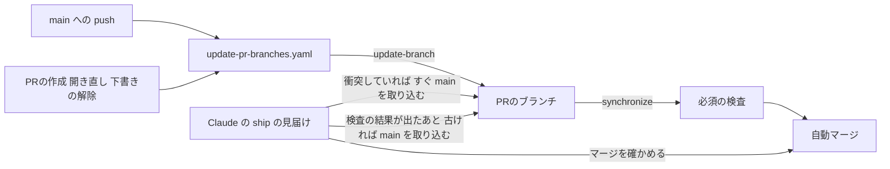
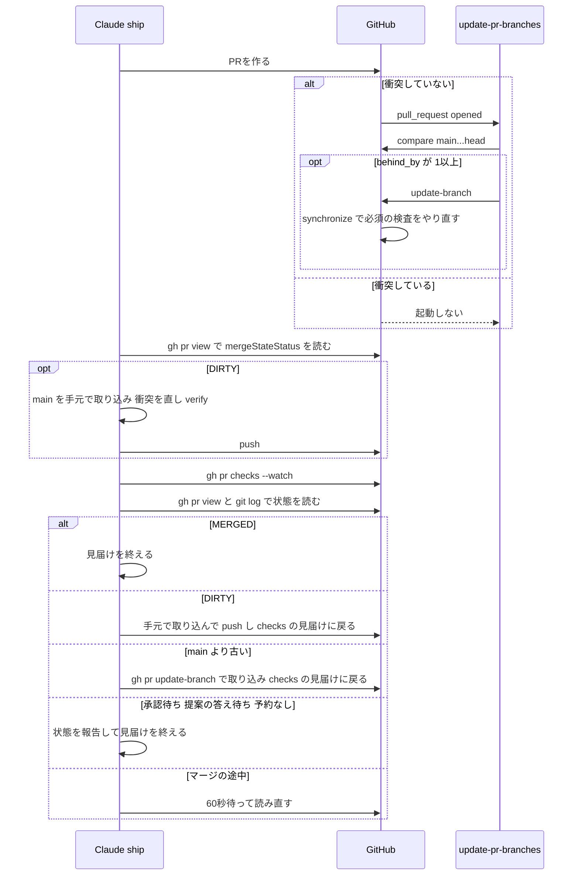

# 設計

## 概要

Claude は、ワークフロー `update-pr-branches.yaml` に `pull_request` の起点を足し、`/ship` の手順7(CI監視)の見届けを書き換える。

## 作るものと作らないもの

### 作るもの

この spec は、次のものを持つ。

- `update-pr-branches.yaml` の `pull_request` の起点と、そのときの処理
- `/ship` の手順7(CI監視)のうち、ブランチを合わせることと、見届けを終える条件
- 上の2つに合わせた文書の記述(README のワークフロー一覧と説明の文、監査手順、基盤構築手順)

### 作らないもの

この設計は、次のことを目指さない。

- main に push されたときにワークフローがブランチを合わせる動き(対象、衝突したときの扱い、失敗したときにジョブを赤にする扱い)を変えること
- 所有者への知らせを足すこと
- 必須の検査の構成と ruleset の設定を変えること
- merge queue への切り替え

この spec は、次のものを持たない。

- 自動マージの予約(`auto-merge.yaml` と `reserve-auto-merge.sh`)
- Dependabot のPRの予約の時期(`dependabot-auto-merge.yaml`)
- `/ship` の手順7のうち、検査が赤になったときの直し方と `/review-loop` への引き継ぎ

## 使う既存の仕組み

- `secrets.BOT_GITHUB_TOKEN`: Actions のシークレットと Dependabot のシークレットの両方に登録済み。ブランチを合わせる操作に使う
- GitHub の REST API: `GET /repos/{owner}/{repo}/pulls`、`GET /repos/{owner}/{repo}/pulls/{pull_number}`、`GET /repos/{owner}/{repo}/compare/{basehead}`、`PUT /repos/{owner}/{repo}/pulls/{pull_number}/update-branch`
- ruleset `main` の必須ステータスチェック(`strict_required_status_checks_policy: true`)
- `auto-merge.yaml` が付ける自動マージの予約。ブランチを合わせたあとの `synchronize` で、`auto-merge.yaml` は予約が残っているかを確かめ直す

## 設計を見直すきっかけ

- ruleset `main` で、ブランチが最新であることを求める設定(`strict_required_status_checks_policy`)を外したとき、または merge queue に切り替えたとき(#203)。このワークフローは役目を終える
- カナリアPRの見分け方(ブランチ名 `canary/`、ラベル `canary`)を変えたとき。`reserve-auto-merge.sh` と、このワークフローの対象の判定の式を揃えて直す
- `BOT_GITHUB_TOKEN` を Dependabot のシークレットから外したとき。Dependabot のPRを出したときの実行が失敗する
- `/ship` の手順7の見届けの流れを変えたとき

## プロジェクトの決まりを守っているか

- 品質チェックの設定: `.github/workflows/update-pr-branches.yaml` と `.claude/skills/ship/SKILL.md` を変える。どちらも所有者の承認が要る保護されたパスである。この spec の承認をもって所有者への提案とし、PRは所有者の承認までマージされない。ワークフローを変えるので、README のワークフロー一覧表も同じPRで直す。README の Mermaid 図には、ブランチを合わせる段が描かれていないので、図は変えない
- 使う外部の機能がこのリポジトリで使えるか: リポジトリは個人のアカウント(`owner.type: User`)の公開リポジトリである。`pull_request` の起点、Dependabot のシークレット、update-branch と compare の API は、どれも個人の公開リポジトリで使える。Claude は、2026-10-06 に、`gh api repos/DogisRiki/KeirekiPro --jq .owner.type` で `User` を、`gh api repos/DogisRiki/KeirekiPro/dependabot/secrets` で `BOT_GITHUB_TOKEN` が Dependabot のシークレットに登録されていることを確かめた。衝突しているPRでは GitHub が `pull_request` のワークフローを起動しないことを、公式の文書(https://docs.github.com/en/actions/reference/workflows-and-actions/events-that-trigger-workflows#pull_request の注記)で確かめた
- 関係のない項目: backend のコードを置く層、frontend の機能ごとの境界、frontend の状態の持ち方、データベースの表の形、新しいライブラリの追加

## 全体の構成

この設計は、ワークフローと Claude の責任を、時点で分ける。この設計は、ワークフローの受け持ちを、部品の「update-pr-branches.yaml」の節に書き、Claude の受け持ちを、部品の「ship スキルの手順7」の節に書く。

Claude は、`pull_request` の起点を、既存の `update-pr-branches.yaml` に足す。対象の判定を1つの式にまとめるためである。新しいワークフローを作ると、判定の式が2か所になる。

**使う技術**:
- 実行環境: GitHub Actions の `ubuntu-latest`。`gh`(ランナーに同梱)と `jq` で REST API を呼ぶ
- 出荷の手順: Claude Code のスキル `/ship`。`gh pr checks` と `gh pr view` でPRの状態を読む

## ファイルの構成

Claude が変えるファイル:

- `.github/workflows/update-pr-branches.yaml`: `pull_request` の起点、起点ごとの同時実行の組、ジョブの条件、PRの起点のときの処理を足す。冒頭の注記に、PRを出したときにも動く理由を足す。`.github/` は `.claude/settings.json` の deny で Claude が書けないので、Claude は変更後のファイルを scratchpad に作り、所有者に写すコマンドを示す。所有者が写したあとで、Claude がコミットする
- `.claude/skills/ship/SKILL.md`: 手順6(予約の確認)に、PRが衝突しているときは予約の確認を手順7の取り込みのあとに回すことを足す。手順7の、ブランチが out of date のときの扱いを、下の部品「ship スキルの手順7」の流れに書き換える。Rules の「verify全PASSまでpushしない」に、手順7で衝突せずに取り込むときは `gh pr update-branch` で取り込み、手元で push しないことを添える。Report に `merge` の行を足す
- `README.md`: ワークフロー一覧表の `update-pr-branches.yaml` の行の起点に `pull_request` を足し、説明の文(「mainが進むとプルリクエストのブランチは自動で最新化され」)に、PRを出したときにも合わせることを足す
- `doc/開発フロー/監査手順.md`: 「ブランチが最新化されずに止まったとき」の節の最初の文に、PRを出したときにも合わせることを足す
- `doc/開発フロー/基盤構築手順.md`: 「8. PRブランチの自動最新化の確認」の最初の文の発火の条件に、PRを出したときを足す

## 処理の流れ

ワークフローがPRの起点で update-branch を呼ぶのは、PRが作られた直後の1回だけである。Claude は、検査の結果が出たあとにしかブランチを合わせない。そのため、ワークフローの update-branch と Claude の取り込みは重ならない。ただし、衝突しているときは、Claude は検査の結果を待たずにブランチを合わせる。衝突しているPRでは、GitHub がワークフローを起動せず、update-branch も衝突で失敗するので、Claude が手元で取り込んで push しても重ならない。

## 部品

### update-pr-branches.yaml(PRのブランチを main の最新に合わせるワークフロー)

対応する要件: 1.1, 1.2, 1.3, 1.4, 1.5, 2.1

**役割**: このワークフローは、起点のイベントに応じて対象のPRを選び、古いブランチを update-branch の API で main の最新に合わせる。このワークフローは、PRのコードを checkout せず、実行しない。このワークフローは、所有者に知らせを送らない。

**権限**: ワークフローの `permissions` は `{}` のままにする。API の呼び出しには `secrets.BOT_GITHUB_TOKEN` を `GH_TOKEN` として渡す。PATを使うのは、`GITHUB_TOKEN` によるブランチの更新が後続のワークフローを起動せず、必須の検査がやり直されないためである。PAT とは、GitHub の個人用アクセストークンを指し、ここでは `secrets.BOT_GITHUB_TOKEN` のことである。

**いつ動くか**:
- 起動するイベント: `push`(branches: `main`)と、`pull_request`(branches: `main`、types: `opened` `reopened` `ready_for_review`)。PRが main と衝突しているあいだは、GitHub が `pull_request` の起点でこのワークフローを起動しない
- ジョブの条件: `github.event_name == 'push' || github.event.pull_request.head.repo.full_name == github.repository`。fork のPRにはシークレットが渡らないので、ジョブの条件で外す。下書き、カナリアPRの判定は、ステップの中の判定の式で行う
- 同時実行: 組の名前を `${{ github.event_name == 'push' && 'update-pr-branches' || format('update-pr-branches-pr-{0}', github.event.pull_request.number) }}` にする。push の実行は今と同じ組 `update-pr-branches` に入る。PRの起点の実行はPRごとの組に入り、待っている push の実行を取り消さない。どちらも `cancel-in-progress: false` にする

**呼び出し方**:
- 対象の判定の式: ステップの先頭で、jq の式 `select(.draft == false) | select(.head.repo.full_name == $repo) | select((.head.ref | startswith("canary/")) | not) | select(any(.labels[]?; .name == "canary") | not)` をシェルの変数 `TARGET_FILTER` に置く。push の起動とPRの起動の両方が、この変数だけを使って対象を判定する
- push の起動: `gh api "repos/${REPO}/pulls?state=open&base=main&per_page=100" --paginate --slurp` の結果に、`[.[][] | ${TARGET_FILTER} | .number] | .[]` を当てて番号の一覧を作る。一覧の各PRへの処理は今と同じにする(update-branch を呼び、応答の文面で、最新化した・すでに最新・衝突・想定外の失敗を分ける)
- PRの起動: `gh api "repos/${REPO}/pulls/${PR_NUMBER}"` でPR1件を取り直し、`${TARGET_FILTER} | .number` を当てる。結果が空なら、対象外である旨をログに出して終える。PRを取り直すのは、イベントの中身ではなく、実行の時点のラベルと下書きの状態で判定するためである
- PRの起動の最新かどうかの確かめ: 取り直したPRの `head.sha` について、`gh api "repos/${REPO}/compare/main...${HEAD_SHA}" --jq .behind_by` を読む。0なら「すでに最新です: #<番号>」をログに出し、update-branch を呼ばない。1以上なら update-branch を呼び、応答の扱いは push の起動と同じにする
- 応答の扱い: 衝突(応答に `conflict` を含む)は `::warning::` で番号と「衝突しているため最新化できません」をログに出し、ジョブを赤にしない。想定外の失敗は `::warning::` で番号と応答の全文をログに出し、最後にジョブを赤にする

**失敗したとき**: update-branch が想定外の失敗を返したPRは古いまま残る。

### ship スキルの手順7(Claude がPRを見届ける手順)

対応する要件: 2.2, 2.3, 2.4

**役割**: Claude は、`/ship` で出したPRを、マージされたことを確かめるまで見届ける。見届けの途中でブランチが main と衝突しているか main の最新を含んでいなければ、Claude は main を取り込む。このスキルは、検査が赤になったときの直し方を変えない。

**いつ動くか**: `/ship` の手順6(自動マージの予約の確認)のあと。PRを作った直後に衝突しているときは、`auto-merge.yaml` も起動しないので予約が付かない。そのため Claude は、手順6で `gh pr view <PR番号> --json mergeStateStatus --jq .mergeStateStatus` を読み、`DIRTY` なら予約の確認を飛ばして手順7の1に進む。予約は、取り込みのあとの push の `synchronize` で `auto-merge.yaml` が付ける。

**呼び出し方**:
1. 衝突の確かめ: Claude は `gh pr view <PR番号> --json mergeStateStatus --jq .mergeStateStatus` を単独のコマンドとして実行する。`DIRTY`(衝突している)なら、Claude は検査の結果を待たずに、下の5の「手元での取り込み」に進む。`UNKNOWN`(GitHub がまだ計算していない)なら、Claude は60秒待って読み直す
2. 検査の見届け: Claude は `gh pr checks <PR番号> --watch` で、必須の検査の結果がすべて出るのを待つ。この間、Claude はブランチを合わせる操作をしない
3. 状態の読み取り: Claude は、`gh pr view <PR番号> --json state,mergeStateStatus,reviewDecision,autoMergeRequest,statusCheckRollup,headRefName` を単独のコマンドとして実行する。続けて Claude は、`git fetch origin` と `git log --oneline origin/<headRefName>..origin/main` を、それぞれ単独のコマンドとして実行する。`git log` が1行でも出せば、PRのブランチは main の最新を含んでいない。ブランチが古いかどうかを `mergeStateStatus` で読まないのは、承認待ちなどほかの理由があると `BLOCKED` になり、古いことが読めないためである
4. 判定: Claude は、3で読んだ状態を次の順に当て、最初に当たったものに従う
   - `state` が `MERGED`: 見届けを終える
   - `mergeStateStatus` が `DIRTY`: 5の「手元での取り込み」に進む
   - `git log` が1行以上を出した: 5の「サーバーでの取り込み」に進む。承認待ちや赤の検査より先に取り込むのは、承認のあとに取り込むと、ruleset の `dismiss_stale_reviews_on_push` で承認が外れ、所有者が承認し直すことになるためである
   - 必須の検査に結果が出ていないものがある(`statusCheckRollup` に、終わっていない検査がある): 2に戻る。読み直しの間に main が進み、ワークフローがブランチを合わせて検査がやり直されたときに当たる
   - 所有者の承認を待っている: `reviewDecision` が `REVIEW_REQUIRED` のとき、または `.github/audit/required-checks.json` で `approval_gated: true` の検査(今は `escape-hatch` `dependency-gate` `pre-merge-check`)が赤のとき。Claude は状態を報告して見届けを終える。この判定を赤の検査を直す判定より先に置くのは、承認待ちのゲートの赤を `/review-loop` で直そうとしないためである
   - 必須の検査に赤がある: 今の手順7のとおり直す(`/review-loop` に従う)
   - Claude が所有者に提案して答えを待っている(`size-check` で止まったとき、ゲートの設定の変更、コンテナの脆弱性の抑制の追加): 状態を報告して見届けを終える
   - 必須の検査がすべて緑で、`autoMergeRequest` が `null`: 自動マージの予約が付いていないとして、Claude は自分で予約を付けず、状態を報告して見届けを終える
   - それ以外(予約があり、検査がすべて緑で、ブランチが最新): マージの途中なので、Claude は60秒待って3に戻る
5. 取り込み:
   - サーバーでの取り込み(衝突していないとき): Claude は `gh pr update-branch <PR番号>` を単独のコマンドとして実行する。GitHub がサーバーで main を取り込み、bot のトークンで行うのでPRの検査がやり直される。Claude は手元で push しないので、手元の `/verify-all` は通さない。`gh pr update-branch` が衝突で失敗したら、Claude は手元での取り込みに進む。そのあと Claude は2に戻る
   - 手元での取り込み(衝突しているとき): Claude は `git fetch origin` と `git merge origin/main` を、それぞれ単独のコマンドとして実行する。Claude は衝突を直し、`/verify-all` を通す。続けて、今の手順7と同じく、`git rev-parse --git-path MERGE_MSG` でマージのメッセージのファイルのパスを得て、`git add <解消したファイル>` と `git commit -F <得たパス>` を、それぞれ単独のコマンドとして実行する。最後に `git push -u origin <ブランチ名>` を単独のコマンドとして実行する。そのあと Claude は1に戻る
6. 見届けを終えるときは、Claude は報告に、終えた理由と、3で読んだ `mergeStateStatus` と、ブランチが main の最新を含んでいるかどうかを添える

**状態の持ち方**: Claude は状態を覚えておかず、3のたびに `gh pr view` と `git log` で読み直す。ただし、60秒待って読み直した回数だけは数える。

**失敗したとき**:
- 1の `UNKNOWN` と、4の「それ以外」で60秒待って読み直すのが3回続き、状態が変わらないときは、Claude は CLAUDE.md の「同一の失敗が3回続いたら停止」に当たるとして、状態を報告して見届けを終える。予約があり検査がすべて緑なら、GitHub は通常1分ほどでマージするので、3分たってもマージされないのは何かが止まっているときである
- 手元での取り込みで衝突を直したあとの `/verify-all` が通らないときは、Claude は push しない。同じ理由で3回続けて通らなければ、Claude は同じく「同一の失敗が3回続いたら停止」に当たるとして見届けを終える

Claude は、`/ship` の Report の `checks` の行のあとに、`merge -> マージ済み / 見届けを終えた理由(承認待ち・提案の答え待ち・予約なし・3回失敗)と mergeStateStatus・ブランチが最新か` の行を足す。

## 失敗したときの扱い

| 失敗 | 何が起きるか | 誰が回復するか |
|---|---|---|
| PRを出した時点で、PRが main と衝突している | GitHub が、PRの起点のワークフローも、`auto-merge.yaml` も、必須の検査も起動しない | Claude が見届けの衝突の確かめで `DIRTY` を読み、検査を待たずに手元で取り込む |
| main への push の起点の実行が、衝突で合わせられない | ログに警告を出し、ジョブは緑で終わる。PRの必須の検査は動かなくなる | Claude が見届けの状態の読み取りで `DIRTY` を読み、手元で main を取り込んで衝突を直す |
| PRの起点の実行が想定外の失敗(トークンの失効など) | ジョブが赤で終わる。PRの必須の検査には含まれないので、PRの検査は進む | Claude が見届けの状態の読み取りでブランチが古いことを読み、`gh pr update-branch` で合わせる。トークンの失効は、監査手順の「ブランチが最新化されずに止まったとき」で所有者が登録し直す |
| 所有者や Dependabot のPRが、PRの起点の実行で合わせられない | PRは古いまま残る | この spec では扱わない。次の main への push で、今のワークフローがもう一度合わせる |

## テストの方針

Claude は、このワークフローに、スクリプトのテストを足さない。判定は、スクリプトのファイルではなく `run` の中にある。Claude が判定を `run` の中に置くのは、ワークフローがコードを checkout しない作りを保つためである(research.md の「スクリプトに切り出さない」)。

- 静的検査: `guardrails.yaml` の actionlint が、ワークフローの式と、`run` の中のシェルへの shellcheck を検査する
- 実装のPR自身での確かめ: `pull_request` の起点では、PRのブランチにあるワークフローの定義が使われる。そのため、Claude が最新の main から実装のPRを出すと、変えたワークフローがそのPRの起点で動く。Claude は、その実行のログに「すでに最新です」が出て、ブランチにコミットが増えないことを確かめる(要件1の、ブランチがすでに main の最新を含んでいればブランチを変えないことを確かめる)
- 導入のあとの実地の確かめ: Claude は、確かめのためだけのPRを作らない。Claude は、所有者の承認を得てマージしたあとに出荷する実際の作業のPRで、次を確かめる。確かめられなかった項目は、Claude が所有者に報告する
  - PRを出す前に main が進んだPRで、PRの起点の実行が「最新化しました」を出し、必須の検査がやり直されてマージされる(要件1の、PRを出したときにブランチを合わせることと、合わせたあとに必須の検査が改めて動いてマージされることを確かめる)
  - Claude は、`/ship` の新しい手順7で、PRがマージされるか、見届けを終える理由のどれかに当たるまで見届ける(要件2の、検査の結果が出たあとに Claude が main を取り込むことと、マージを確かめるまで見届けることを確かめる)
- Claude は、下書きを解除したときと開き直したときの動き(要件1の、下書きの解除と開き直しでも合わせること)を、actionlint と、上の実地の確かめで同じ処理が動くことで確かめる。起動するイベントの種類を足すだけで、処理は同じだからである
