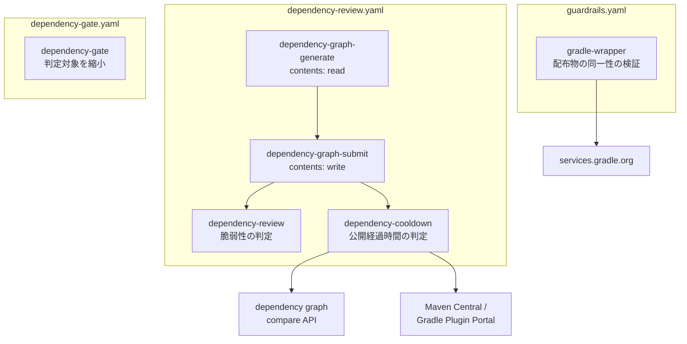
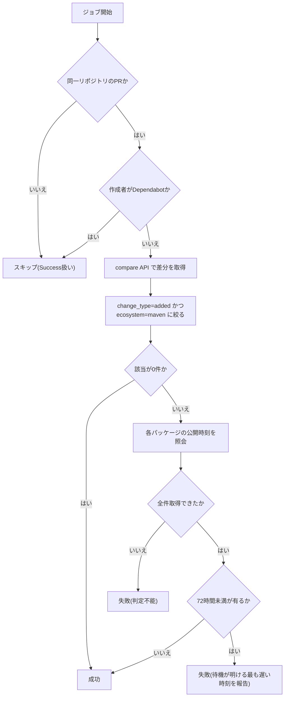
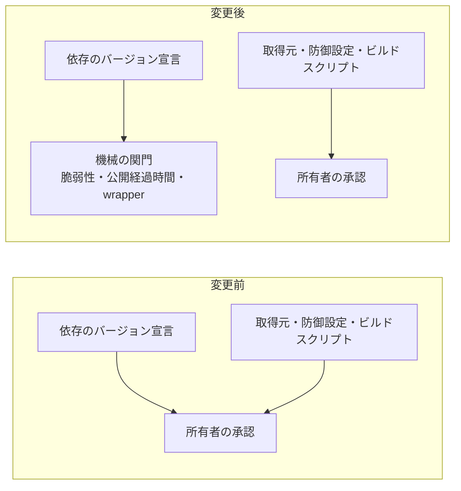

# Technical Design

## Overview

**Purpose**: 依存更新のたびに発生している所有者の承認操作を無くし、承認が担っていた役割を
2つの機械の関門に置き換える。

**Users**: リポジトリ所有者(承認操作が減る)と開発エージェント(自力で解消できる赤と
人間の介入が要る赤を区別して受け取る)。

**Impact**: `dependency-gate` の判定対象が縮小し、バージョン宣言だけの変更は承認なしで
マージされるようになる。代わりに、公開直後のパッケージの混入と Gradle 配布物の差し替えが
CIで止まるようになる。

### Goals

- backend に追加されるパッケージが公開から72時間を経過していることを機械的に保証する
- Gradle wrapper が公式の配布物であることを機械的に保証する
- 依存のバージョン宣言だけの変更から所有者の承認を外す
- 上記3つを1つの変更で入れ、検知が無いまま承認だけが外れる期間を作らない

### Non-Goals

- 脆弱性の検知。既存の `dependency-review` が担う
- frontend のクールダウン。pnpm のリゾルバが担う
- Dependabot のPRとフォークPRへのクールダウン適用
- 除外リストによる緊急回避の仕組み

## Boundary Commitments

### This Spec Owns

- そのPRで新しく追加された maven パッケージの公開経過時間の判定
- `gradle-wrapper.properties` の配布元ホストとチェックサムの検証、および wrapper 実行ファイルの照合
- `check-dependency-additions.sh` の判定対象の定義
- 上記に対応する運用文書の記述

### Out of Boundary

- 脆弱性の有無の判定(`dependency-review` が所有)
- 依存グラフの生成と送信(`dependency-review.yaml` の既存ジョブが所有)
- frontend の公開経過時間の制御(`pnpm-workspace.yaml` の `minimumReleaseAge` が所有)
- 必須チェックへの登録操作(所有者が行う)
- 同一失敗3回で停止する振る舞い(開発エージェントの既存規約が所有)

### Allowed Dependencies

- dependency graph の compare API(既存の送信ジョブが作った head 側スナップショットに依存する)
- Maven Central と Gradle Plugin Portal の成果物リポジトリ
- Gradle 公式の配布物チェックサム
- `gradle/actions/wrapper-validation`
- 既存の `dependency-review.yaml` の `submit` ジョブ(順序依存)

**制約**: クールダウン検査は `submit` の後段に置く。前段や別ワークフローに置くと、
head 側スナップショットが未送信のまま比較して追加パッケージを取りこぼす。

### Revalidation Triggers

- compare API の応答形状が変わったとき
- 成果物リポジトリが `Last-Modified` を返さなくなったとき
- Gradle 公式のチェックサム配布URLが変わったとき
- `dependency-review.yaml` のジョブ構成が変わったとき(順序依存が壊れる)
- 判定対象のエコシステムを増やすとき

## KeirekiPro Compliance Check

- [x] **backend層配置**: N/A。Javaのクラスを追加・変更しない
- [x] **frontend境界**: N/A。frontendのモジュールを追加・変更しない
- [x] **状態管理**: N/A
- [x] **DBスキーマ**: N/A。マイグレーションを含まない
- [x] **依存追加**: 新規ライブラリの追加は無い。`backend/gradle/wrapper/gradle-wrapper.properties`
      に `distributionSha256Sum` を追加するが、これは既存配布物の同一性を固定するもので
      新規依存ではない
- [ ] **ゲート設定**: **本設計はゲート設定の変更を必要とする。** `.github/workflows/` と
      `.github/scripts/` の追加・変更が中心であり、これは所有者への提案として渡す。
      エージェントは `.github/` に書き込めないため、新規ファイルは全文提示、
      既存ファイルの修正は実行コマンドの提示という形で受け渡す

## Architecture

### Existing Architecture Analysis

現行のCIは、検査の種類ごとにワークフローを分け、判定の実体を `.github/scripts/` の
シェルスクリプトへ切り出す構成をとっている。ワークフローは検知スクリプトのテストを
本体より先に実行し、テストが落ちたらゲートも落とす(fail-closed)。

`dependency-gate.yaml` がこの型の代表で、`test-check-dependency-additions.sh` を実行してから
`check-dependency-additions.sh` を呼ぶ。本設計はこの型をそのまま踏襲する。

`dependency-review.yaml` は `generate` / `submit` / `review` の3ジョブを `needs` で直列化し、
ビルドスクリプトを実行するジョブに書き込み権限を与えない構成をとっている。
クールダウン検査はこの直列の末尾に加わる。

### Architecture Pattern & Boundary Map



**Architecture Integration**:

- 選択した型: 既存の「ワークフローが判定スクリプトを呼ぶ」構成の踏襲。新しい型は導入しない
- 責務の分離: クールダウン検査は依存グラフを要するため `dependency-review.yaml` に、
  wrapper 検査は依存グラフを要さず既存の `check-action-pinning` と目的が同じであるため
  `guardrails.yaml` に置く
- 維持する既存パターン: 判定スクリプトの切り出し、テスト先行実行による fail-closed、
  ジョブ単位の `permissions` の最小化
- 新規要素の根拠: 検査が2つとも新しい外部ホストへの問い合わせを伴うため、
  判定ロジックをスクリプトに切り出してテスト可能にする必要がある

### Technology Stack

| Layer | Choice / Version | Role in Feature | Notes |
|---|---|---|---|
| CI 実行基盤 | GitHub Actions | 検査の実行とチェックの報告 | 既存 |
| 判定処理 | Bash + `gh` + `jq` + `curl` | compare API の取得、公開時刻の照会、判定 | 既存スクリプトと同じ構成 |
| 依存グラフ | dependency graph compare API | 追加パッケージの特定 | `submit` が送信したスナップショットに依存 |
| 成果物リポジトリ | `repo1.maven.org` / `plugins.gradle.org/m2` | 公開時刻の取得元 | 前者を優先し404で後者へ |
| 配布物検証 | `services.gradle.org` + `gradle/actions/wrapper-validation` | チェックサムの照合 | アクションはSHA固定 |

## File Structure Plan

### 新規ファイル

```
.github/
├── scripts/
│   ├── check-dependency-cooldown.sh    # 追加パッケージの公開経過時間を判定する
│   ├── check-gradle-wrapper.sh         # 配布元ホストとチェックサムを検証する
│   └── tests/
│       ├── test-check-dependency-cooldown.sh   # gh と curl をスタブして判定を検証する
│       └── test-check-gradle-wrapper.sh        # curl をスタブして判定を検証する
```

### 変更ファイル

- `.github/workflows/dependency-review.yaml` — `dependency-cooldown` ジョブを追加。
  `needs: [generate, submit]` で `submit` の後段に置く
- `.github/workflows/guardrails.yaml` — `gradle-wrapper` ジョブを追加
- `.github/scripts/check-dependency-additions.sh` — 判定対象の正規表現を縮小する
- `.github/scripts/tests/test-check-dependency-additions.sh` — 縮小後の対象に合わせて
  ケースを入れ替える(外した対象が緑、残した対象が赤)
- `backend/gradle/wrapper/gradle-wrapper.properties` — `distributionSha256Sum` を追加
- `README.md` — ワークフロー一覧表に2行追加、CI/CDのMermaid図に検査を追記
- `doc/開発フロー/監査手順.md` — 自動チェックの一覧に2件追加、承認手順から依存更新を削除、
  残余リスクを追記
- `CLAUDE.md` — 人間の承認が必要な変更の記述を実態に合わせる

## System Flows

### クールダウン検査の判定



公開時刻の照会は Maven Central を先に引き、404 のときのみ Gradle Plugin Portal へ
フォールバックする。どちらでも取得できない場合を「判定不能」として扱う。

### 承認範囲の変化



## Requirements Traceability

| Requirement | Summary | Components | Interfaces | Flows |
|---|---|---|---|---|
| 1.1 | 追加パッケージを推移的依存込みで特定 | DependencyCooldownCheck | compare API | クールダウン検査の判定 |
| 1.2 | 72時間未満で失敗 | DependencyCooldownCheck | 公開時刻照会 | 同上 |
| 1.3 | 該当と待機明けを報告 | DependencyCooldownCheck | Job Summary | 同上 |
| 1.4 | 取得不能で失敗 | DependencyCooldownCheck | 公開時刻照会 | 同上 |
| 1.5 | Dependabot のPRは対象外 | CooldownJob | ジョブ条件 | 同上 |
| 1.6 | 実際の公開時刻に基づく判定 | 公開時刻照会 | `Last-Modified` | — |
| 1.7 | 多数該当時に最も遅い時刻を明示 | DependencyCooldownCheck | Job Summary | — |
| 1.8 | 追加が無ければ成功 | DependencyCooldownCheck | — | クールダウン検査の判定 |
| 2.1 | チェックサムを保持 | WrapperProperties | — | — |
| 2.2 | 配布元ホストが公式でなければ失敗 | GradleWrapperCheck | ホスト検証 | — |
| 2.3 | チェックサムが公式値と不一致なら失敗 | GradleWrapperCheck | 公式チェックサム照会 | — |
| 2.4 | jar が公式チェックサムと不一致なら失敗 | WrapperValidationAction | — | — |
| 2.5 | Dependabot の wrapper 更新PRは通過 | GradleWrapperCheck | — | — |
| 2.6 | wrapper を変更しないPRは成功 | GradleWrapperCheck, WrapperJob | 実行条件の判定(base..head 差分) | — |
| 3.1 | バージョン宣言だけの変更は承認不要 | DependencyAdditionCheck | 判定対象の定義 | 承認範囲の変化 |
| 3.2 | 取得元の設定は承認必要 | DependencyAdditionCheck | 同上 | 同上 |
| 3.3 | インストールフックは承認必要 | DependencyAdditionCheck | 同上 | 同上 |
| 3.4 | 供給網対策の設定は承認必要 | DependencyAdditionCheck | 同上 | 同上 |
| 3.5 | ビルドスクリプトは承認必要 | DependencyAdditionCheck | 同上 | 同上 |
| 4.1 | 判定のテストを判定より先に実行 | CooldownJob / WrapperJob | ジョブのステップ順 | — |
| 4.2 | テストが落ちたら検査も落とす | CooldownJob / WrapperJob | 同上 | — |
| 4.3 | 境界値・判定不能・対象外を検証 | 各テストスクリプト | — | — |
| 5.1 | 外部要因の失敗を区別可能に報告 | 各検査スクリプト | Job Summary | — |
| 5.2 | クールダウンは時間で解消すると報告 | DependencyCooldownCheck | Job Summary | — |
| 5.3 | 介入要否の判断材料を含める | 各検査スクリプト | Job Summary | — |
| 6.1 | 監査対象一覧に追加 | 運用文書 | — | — |
| 6.2 | 承認範囲の記述を更新 | 運用文書 | — | — |
| 6.3 | 必須チェック登録の手順と順序 | 運用文書 | — | — |
| 6.4 | 残余リスクを記載 | 運用文書 | — | — |
| 6.5 | ワークフロー一覧と図を同じ変更で更新 | README | — | — |

## Components and Interfaces

| Component | 配置 | Intent | Req Coverage | Key Dependencies | Contracts |
|---|---|---|---|---|---|
| DependencyCooldownCheck | `.github/scripts/check-dependency-cooldown.sh` | 追加パッケージの公開経過時間を判定する | 1.1-1.4, 1.6-1.8, 5.1-5.3 | compare API (P0), 成果物リポジトリ (P0) | Batch |
| CooldownJob | `dependency-review.yaml` の `dependency-cooldown` | 対象外の判定と実行順序の保証 | 1.5, 4.1, 4.2 | `submit` ジョブ (P0) | — |
| GradleWrapperCheck | `.github/scripts/check-gradle-wrapper.sh` | 配布元ホストとチェックサムを検証する | 2.2, 2.3, 2.5, 2.6, 5.1, 5.3 | `services.gradle.org` (P0) | Batch |
| WrapperJob | `guardrails.yaml` の `gradle-wrapper` | 検査と jar 照合の実行 | 2.4, 4.1, 4.2 | `gradle/actions/wrapper-validation` (P0) | — |
| DependencyAdditionCheck | `.github/scripts/check-dependency-additions.sh` | 承認が必要な変更の判定対象を定義する | 3.1-3.5 | — | Batch |
| WrapperProperties | `backend/gradle/wrapper/gradle-wrapper.properties` | 配布物のチェックサムを保持する | 2.1 | — | State |

### 検査スクリプト

#### DependencyCooldownCheck

| Field | Detail |
|---|---|
| Intent | そのPRで新しく追加された maven パッケージが公開から72時間を経過しているかを判定する |
| Requirements | 1.1, 1.2, 1.3, 1.4, 1.6, 1.7, 1.8, 5.1, 5.2, 5.3 |

**Responsibilities & Constraints**

- 判定の入力は compare API の応答のみとする。ビルド定義やロックファイルを解析しない
- `change_type` が `added` かつ `ecosystem` が `maven` のものだけを対象にする
- 対象が0件のときは成功で終える
- 公開時刻を1件でも取得できない場合は失敗させる

**Dependencies**

- Inbound: CooldownJob — 実行と対象外の判定 (P0)
- External: dependency graph compare API — 追加パッケージの特定 (P0)
- External: `repo1.maven.org` / `plugins.gradle.org/m2` — 公開時刻の取得 (P0)

**Contracts**: Batch [x]

##### Batch Contract

- **Trigger**: `dependency-cooldown` ジョブから引数 `<base_sha> <head_sha>` で呼ばれる
- **Input / validation**: 2つのSHA。環境変数 `GH_TOKEN` と `COOLDOWN_HOURS`(既定72)
- **Output / destination**: 終了コード(0=成功 / 1=失敗)と `GITHUB_STEP_SUMMARY` への報告
- **Idempotency & recovery**: 判定は時刻に依存するため冪等ではない。クールダウンによる失敗は
  再実行で解消する。この性質を報告に含める

**報告の構造**(要件1.3, 1.7, 5.1, 5.2, 5.3):

| 失敗の種類 | 報告に含めるもの |
|---|---|
| クールダウン | 該当パッケージ一覧、**待機が明ける最も遅い時刻**、時間の経過で解消する旨 |
| 判定不能 | 取得できなかったパッケージ、問い合わせ先、外部要因である旨と人間の確認が要る旨 |

該当が多数のときも、待機が明ける最も遅い時刻を1件明示することで、再実行すべき時期が
一覧を読まずに判断できるようにする。

**Implementation Notes**

- Integration: 公開時刻は成果物の pom への HEAD リクエストの `Last-Modified` から取る。
  Maven Central を先に引き、404 のときのみ Gradle Plugin Portal へフォールバックする。
  検索APIは索引が遅れるため使わない
- Validation: 既知の公開時刻を持つパッケージに対する判定をテストで固定する(要件1.6)
- Risks: 応答形式の変化。fail closed のため気づける

#### GradleWrapperCheck

| Field | Detail |
|---|---|
| Intent | Gradle 配布物の取得先と同一性を検証する |
| Requirements | 2.2, 2.3, 2.5, 2.6, 5.1, 5.3 |

**Responsibilities & Constraints**

- **実行条件を自身で判定する。** base..head の差分に wrapper 関連の変更が無い場合、
  外部への問い合わせを一切行わずに成功で終える(要件2.6)
- `distributionUrl` のホストが公式配布元であることを検証する
- `distributionSha256Sum` が公式に公表された値と一致することを検証する
- `distributionSha256Sum` が存在しない場合は失敗させる(要件2.1の前提が崩れているため)
- jar の照合は行わない。`gradle/actions/wrapper-validation` の責務とする

**実行条件の定義**:

base..head の差分に次のいずれかが含まれるときだけ外部照会を行う。

| 条件 | 理由 |
|---|---|
| `backend/gradle/wrapper/` 配下の変更 | 設定と jar の本体 |
| 追加または変更された `*.jar` | wrapper ディレクトリ外に置かれた jar を取りこぼさないため |

2つ目の条件は、`wrapper-validation` がホモグリフ偽装された `gradle-wrapper.jar` を
リポジトリ全体から探す仕様に対応する。ディレクトリ名で絞ると、別の場所に置かれた
偽装ファイルの照合が走らない。jar がコミットされるのは wrapper 以外に事実上無いため、
この条件による無駄な実行は起きない。

**この条件が無い場合の問題**: 全PRが毎回 `services.gradle.org` へ問い合わせることになり、
fail closed と組み合わさると、外部ホストの不調時にすべてのPRが赤になる。
wrapper の変更頻度は年数回であり、常時照会する必要はない。

**Contracts**: Batch [x]

##### Batch Contract

- **Trigger**: `gradle-wrapper` ジョブから引数 `<base_sha> <head_sha>` で呼ばれる
- **Input / validation**: 2つのSHA。差分に wrapper 関連の変更がある場合のみ
  `backend/gradle/wrapper/gradle-wrapper.properties` を読む
- **Output / destination**: 終了コードと `GITHUB_STEP_SUMMARY` への報告。
  対象外で終えた場合もその旨を報告する
- **Idempotency & recovery**: 冪等。失敗は設定の修正でのみ解消する

**Implementation Notes**

- Integration: 公式チェックサムは `services.gradle.org` の `<配布物URL>.sha256` から取る。
  **301 リダイレクトを返すため追従が必須**。追従しないと常に不一致になる
- Risks: 検査2と検査3は同じホストを信頼の根とするため、独立した2つの防御にはならない。
  実質的に効いているのは検査2であり、この限界を運用文書に記録する(要件6.4)

#### DependencyAdditionCheck(変更)

| Field | Detail |
|---|---|
| Intent | 所有者の承認が必要な変更の判定対象を定義する |
| Requirements | 3.1, 3.2, 3.3, 3.4, 3.5 |

**判定対象の変更**:

| 対象 | 変更前 | 変更後 |
|---|---|---|
| `frontend/package.json` | 承認必要 | **外す** |
| `frontend/pnpm-lock.yaml` | 承認必要 | **外す** |
| `backend/**/*.versions.toml` | 承認必要 | **外す** |
| `backend/gradle/wrapper/gradle-wrapper.properties` | 承認必要 | **外す** |
| `frontend/.npmrc` | 承認必要 | 維持 |
| `frontend/.pnpmfile.cjs` / `.pnpmfile.mjs` | 承認必要 | 維持 |
| `frontend/pnpm-workspace.yaml` | 承認必要 | 維持 |
| `backend/**/*.gradle` / `*.gradle.kts` | 承認必要 | 維持 |

**Implementation Notes**

- `pnpm-lock.yaml` を対象から外すと、報告用の「新しく現れたパッケージ名」の抽出も
  実行されなくなる。この報告は判定に使っていないため削除してよい
- 冒頭のコメントに書かれた設計根拠(中身を解析せずファイルの変更有無だけで判定する理由)は
  維持する対象に対して引き続き有効であり、書き換えない

### CI ジョブ

#### CooldownJob

| Field | Detail |
|---|---|
| Intent | クールダウン検査の実行、対象外の判定、実行順序の保証 |
| Requirements | 1.5, 4.1, 4.2 |

**Responsibilities & Constraints**

- `needs: [generate, submit]` により `submit` の完了後に実行する
- 同一リポジトリのPRであること、かつ作成者が Dependabot でないことを条件にする
- 判定スクリプトのテストを判定より先に実行する

**対象外の表現**: ジョブ単位の `if` を使う。スキップされたジョブは Success として報告され
必須チェックを満たすため、対象外にしても赤で止まらない。

```
if: 同一リポジトリのPR かつ 作成者がDependabotでない かつ generateが成功 かつ submitが失敗していない
```

`generate` の成功を明示的に要求するのは、`generate` が失敗すると `submit` が
`skipped` になり、`skipped` は `failure` ではないため条件をすり抜けるため。

**必須チェックへの登録**: `dependency-cooldown` を必須チェックに加える。加えないと、
検査が失敗してもマージが止まらない。

#### WrapperJob

| Field | Detail |
|---|---|
| Intent | wrapper 検査と jar 照合の実行 |
| Requirements | 2.4, 4.1, 4.2 |

**Responsibilities & Constraints**

- 判定スクリプトのテストを判定より先に実行する
- **ジョブは常時実行する。** 実行条件の判定はスクリプトと jar 照合ステップの側で行う。
  ジョブ単位で `if` を付けても Success 扱いになるため必須チェックは満たせるが、
  常時実行にしておくと「検査が動いたうえで対象外だった」ことが Summary に残る
- **`gradle/actions/wrapper-validation` のステップにも同じ実行条件を付ける。**
  このアクションも Gradle 公式のチェックサム一覧を取得するため、条件を付けないと
  スクリプト側だけを条件付きにしても外部依存が残る
- `gradle/actions/wrapper-validation` を SHA 固定で参照する
- `permissions` は `contents: read` のみ
- 差分の判定に base..head を使うため、checkout は `fetch-depth: 0` にする

## Error Handling

### Error Strategy

判定できない状態を成功として扱わない(fail closed)。ただし、失敗の性質を報告で区別し、
再実行を待てばよいのか人間の介入が要るのかを判断できるようにする。

### Error Categories and Responses

| 分類 | 例 | 応答 |
|---|---|---|
| 待てば解消する | 公開から72時間未満 | 失敗。待機が明ける最も遅い時刻と、時間で解消する旨を報告 |
| 外部要因 | 成果物リポジトリが応答しない、応答形式が変わった | 失敗。問い合わせ先と外部要因である旨を報告。人間の確認が要ることを明示 |
| 設定の誤り | 配布元ホストが公式でない、チェックサム不一致、キーが存在しない | 失敗。該当箇所と期待値を報告 |
| 検査自体の破損 | 判定スクリプトのテストが失敗 | 検査を失敗させる。判定は実行しない |

外部要因による失敗はエージェントが自力で解消できない。同一の失敗が3回続いた場合の停止は
開発エージェントの既存規約が担うため、本設計はその判断材料を報告に含めるところまでを受け持つ。

### Monitoring

`GITHUB_STEP_SUMMARY` に判定結果を出力する。既存の検査と同じ方式であり、監査時は
ジョブの成否と Summary を見る。

## Testing Strategy

### Unit Tests(判定スクリプト)

`gh` と `curl` をスタブして判定だけを検証する。`test-check-dependency-additions.sh` の
一時 git リポジトリを作る方式に倣う。

1. **クールダウンの境界値** — 公開から72時間ちょうどのパッケージが通り、71時間59分が落ちること(1.2)
2. **判定不能の扱い** — 公開時刻が取得できないパッケージが1件でもあれば落ちること(1.4)
3. **フォールバック** — Maven Central が404を返したとき Gradle Plugin Portal を引くこと(1.6)
4. **追加が無い場合** — 追加パッケージ0件で成功すること(1.8)
5. **多数該当時の報告** — 待機が明ける最も遅い時刻が報告に含まれること(1.7)
6. **wrapper のホスト検証** — 公式でないホストを指す設定が落ちること(2.2)
7. **wrapper のチェックサム検証** — 公式値と異なる値が落ちること、キーが無い場合も落ちること(2.3, 2.1)
8. **wrapper の実行条件** — wrapper 関連の変更が無い差分で、外部照会を行わずに成功すること。
   wrapper ディレクトリ外に置かれた `*.jar` の追加で照会が走ること(2.6)

### Integration Tests(CI上での確認)

1. **対象外の条件** — Dependabot が作成したPRで `dependency-cooldown` がスキップされ、
   必須チェックが緑になること(1.5)
2. **fail-closed の連鎖** — 判定スクリプトのテストを意図的に壊したPRで、検査が失敗すること(4.2)
3. **承認範囲の縮小** — `libs.versions.toml` だけを変更するPRで `dependency-gate` が
   緑になること(3.1)
4. **承認範囲の維持** — `.npmrc` を変更するPRで `dependency-gate` が赤になること(3.2)
5. **wrapper の通過** — Dependabot の wrapper 更新PRが3点の検査を通ること(2.5)
6. **クールダウンの実証** — 公開から72時間未満の実在パッケージを追加した検証用PRで
   `dependency-cooldown` が赤になること。72時間の経過後に同じPRを再実行すると緑になること。
   直接依存だけでなく推移的依存に対しても検知されること(1.2, 1.1)
7. **wrapper の外部依存の限定** — wrapper を変更しないPRで、`services.gradle.org` への
   問い合わせが発生しないこと(2.6)

### 導入時の確認

- `distributionSha256Sum` を追加した状態で `./gradlew check` が通ること
- 新設した2つのチェックが必須チェックに登録できる状態でmainに存在すること

## Security Considerations

- **信頼の根の共有**: wrapper の検査2と検査3は `services.gradle.org` を共通の信頼の根とする。
  当該ホストが侵害された場合、配布物と公表チェックサムの両方が同時に偽装される。
  実質的な防御は「ホストの固定」であり、チェックサムの照合は手作業による書き換えとの
  不整合を検知するものと位置づける
- **残る経路**: 承認を外したあとも、プロジェクト自身のパッケージ定義に任意のコマンドを
  書ける経路は残る。これはエージェントが書いたコードがCIと開発環境で実行されることを
  既に受容している範囲であり、新しい信頼水準を要求するものではない
- **フォークPR**: head 側スナップショットが送信されないため、フォークPRの backend の
  追加パッケージは検査されない。#183 で同じ判断をしており、受容済みの残余リスクとして扱う

以上3点は運用文書に記録する(要件6.4)。
