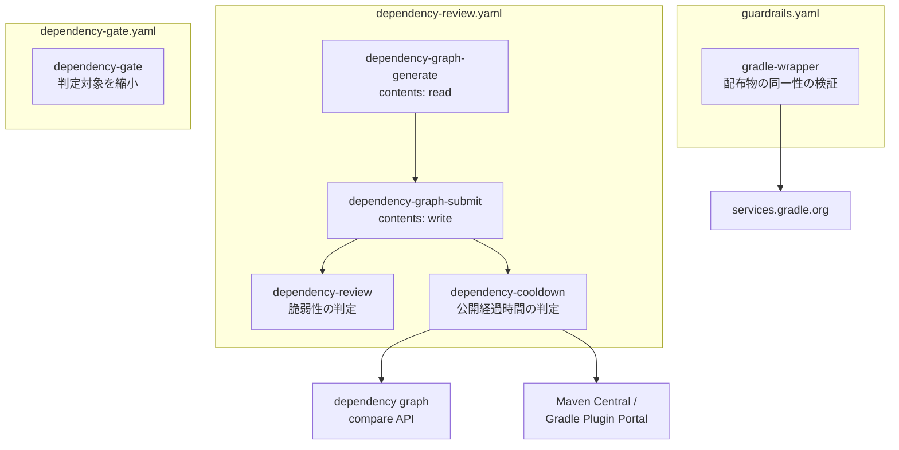
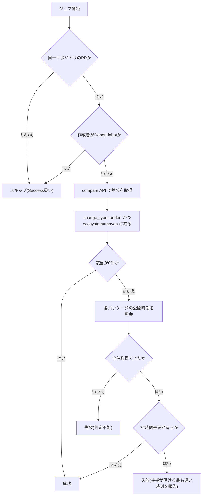
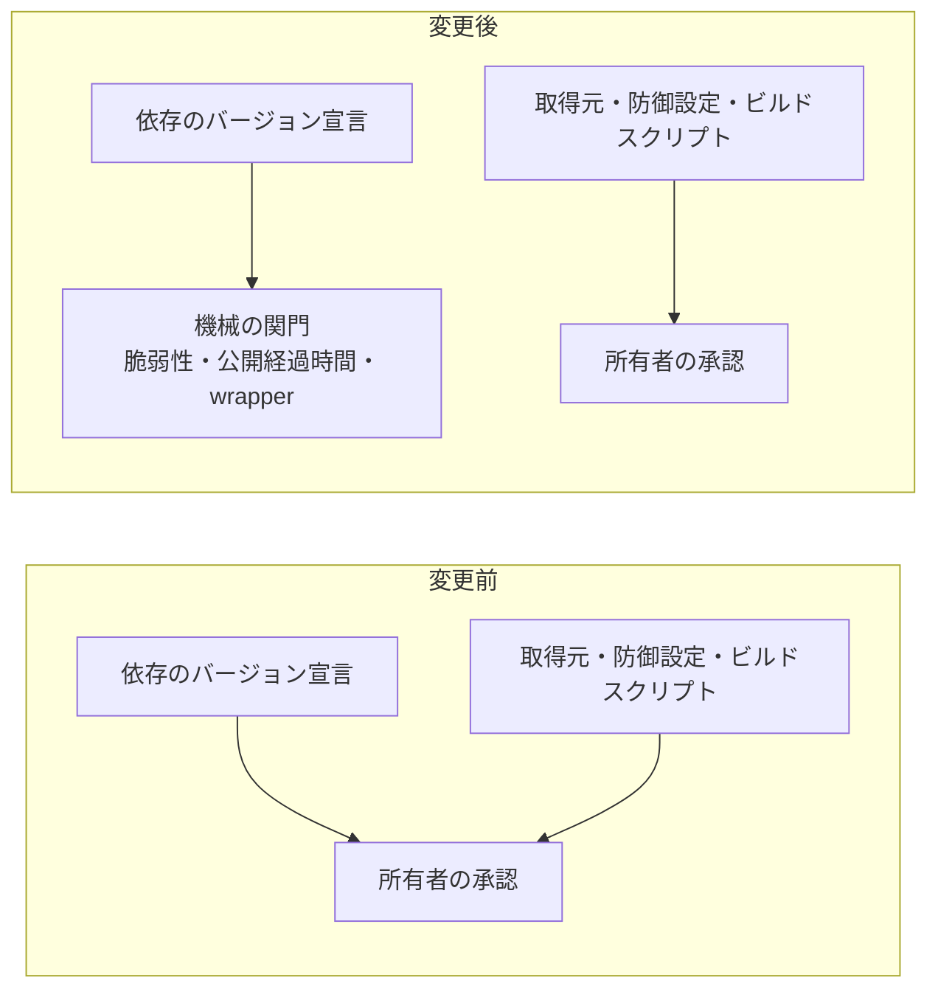

# 設計

## 概要

この設計は、依存の更新のたびに起きている所有者の承認の操作を無くし、承認が担っていた役割を2つの機械の関門に置き換える。

この設計の利用者は、リポジトリの所有者と開発エージェントである。所有者は、承認の操作が減る。開発エージェントは、自力で解消できる赤と、人間の介入が要る赤を、区別して受け取る。

この設計により、`dependency-gate` の判定の対象が縮み、バージョンの宣言だけの変更は承認なしでマージされるようになる。その代わりに、CIが、公開直後のパッケージの混入と、Gradle の配布物の差し替えを止めるようになる。

## 作るものと作らないもの

### 作るもの

この設計は、次のことを目指す。

- backend に追加されるパッケージが公開から72時間を経過していることを、機械で保証する
- Gradle wrapper が公式の配布物であることを、機械で保証する
- 依存のバージョンの宣言だけの変更から、所有者の承認を外す
- 上の3つを1つの変更で入れ、検知が無いまま承認だけが外れる期間を作らない

この spec は、次のものを持つ。

- そのPRで新しく追加された maven パッケージの、公開からの経過時間の判定
- `gradle-wrapper.properties` の配布元のホストとチェックサムの検証と、wrapper の実行ファイルの照合
- `check-dependency-additions.sh` の判定の対象の定義
- 上に挙げたものに対応する運用文書の記述

### 作らないもの

この設計は、次のことを目指さない。

- 脆弱性の検知。既存の `dependency-review` が担う
- frontend のクールダウン。pnpm のリゾルバが担う
- Dependabot のPRと、フォークから出されたPRへの、クールダウンの適用
- 除外のリストによる、緊急の回避の仕組み

この spec は、次のものを持たない。

- 脆弱性の有無の判定(`dependency-review` が持つ)
- 依存グラフの生成と送信(`dependency-review.yaml` の既存のジョブが持つ)
- frontend の公開からの経過時間の制御(`pnpm-workspace.yaml` の `minimumReleaseAge` が持つ)
- 必須チェックへの登録の操作(所有者が行う)
- 同じ失敗が3回続いたら止まる振る舞い(開発エージェントの既存の規約が持つ)

## 使う既存の仕組み

- dependency graph の compare API(既存の送信のジョブが作った head 側のスナップショットに依存する)
- Maven Central と Gradle Plugin Portal の成果物のリポジトリ
- Gradle 公式の配布物のチェックサム
- `gradle/actions/wrapper-validation`
- 既存の `dependency-review.yaml` の `submit` ジョブ(順序に依存する)

**依存の向きの制約**: この設計は、クールダウンの検査を `submit` の後段に置く。クールダウンの検査を前段や別のワークフローに置くと、検査は head 側のスナップショットが送られる前に比較し、追加されたパッケージを取りこぼす。

## 設計を見直すきっかけ

- compare API の応答の形が変わったとき
- 成果物のリポジトリが `Last-Modified` を返さなくなったとき
- Gradle 公式のチェックサムを配布するURLが変わったとき
- `dependency-review.yaml` のジョブの構成が変わったとき(順序の依存が壊れる)
- 判定の対象のエコシステムを増やすとき

## プロジェクトの決まりを守っているか

- 新しいライブラリの追加: この設計は、新しいライブラリを足さない。この設計は `backend/gradle/wrapper/gradle-wrapper.properties` に `distributionSha256Sum` を足すが、この値は既存の配布物の同一性を固定するものであり、新しい依存ではない
- 品質チェックの設定: **この設計は、品質チェックの設定の変更を必要とする。** 変更の中心は `.github/workflows/` と `.github/scripts/` の追加と変更であり、Claude はこれらの変更を所有者への提案として渡す。エージェントは `.github/` に書き込めないため、Claude は、新しいファイルは全文を示し、既存のファイルの修正は実行するコマンドを示す形で受け渡す
- 関係のない項目: backend のコードを置く層(Java のクラスを追加も変更もしない)、frontend の機能ごとの境界(frontend のモジュールを追加も変更もしない)、frontend の状態の持ち方、データベースの表の形(マイグレーションを含まない)

## 全体の構成


```mermaid
flowchart TB
    subgraph DR["dependency-review.yaml"]
        G["dependency-graph-generate<br/>contents: read"]
        S["dependency-graph-submit<br/>contents: write"]
        R["dependency-review<br/>脆弱性の判定"]
        C["dependency-cooldown<br/>公開経過時間の判定"]
        G --> S
        S --> R
        S --> C
    end

    subgraph GR["guardrails.yaml"]
        W["gradle-wrapper<br/>配布物の同一性の検証"]
    end

    subgraph DG["dependency-gate.yaml"]
        D["dependency-gate<br/>判定対象を縮小"]
    end

    API["dependency graph<br/>compare API"]
    MC["Maven Central /<br/>Gradle Plugin Portal"]
    SG["services.gradle.org"]

    C --> API
    C --> MC
    W --> SG
```

- 選んだ型: この設計は、既存の「ワークフローが判定のスクリプトを呼ぶ」構成をそのまま使う。この設計は、新しい型を入れない
- 部品の責任の分け方: クールダウンの検査は依存グラフを要するため、この設計は、クールダウンの検査を `dependency-review.yaml` に置く。wrapper の検査は依存グラフを要さず、既存の `check-action-pinning` と目的が同じであるため、この設計は、wrapper の検査を `guardrails.yaml` に置く
- 守る既存の作り: この設計は、判定のスクリプトの切り出し、テストを先に実行することによる fail-closed、ジョブ単位の `permissions` の最小化を守る。fail-closed とは、判定できないときに成功に倒さず、失敗に倒すことを指す
- 新しい部品が要る理由: 2つの検査は、どちらも新しい外部のホストへの問い合わせを伴う。そのため、この設計は、判定のロジックをスクリプトに切り出して、テストできるようにする

**使う技術**:
- CI の実行基盤: GitHub Actions。検査を実行し、チェックを報告する。既存の基盤である
- 判定の処理: Bash + `gh` + `jq` + `curl`。compare API の取得、公開時刻の照会、判定を受け持つ。既存のスクリプトと同じ構成である
- 依存グラフ: dependency graph の compare API。追加されたパッケージの特定を受け持つ。`submit` が送ったスナップショットに依存する
- 成果物のリポジトリ: `repo1.maven.org` / `plugins.gradle.org/m2`。公開時刻の取得元である。スクリプトは前者を優先し、404 のときに後者を引く
- 配布物の検証: `services.gradle.org` + `gradle/actions/wrapper-validation`。チェックサムの照合を受け持つ。ワークフローは、アクションを SHA で固定して参照する

## ファイルの構成

Claude が新しく作るファイル:

- `.github/scripts/check-dependency-cooldown.sh`: 追加されたパッケージの、公開からの経過時間を判定する
- `.github/scripts/check-gradle-wrapper.sh`: 配布元のホストとチェックサムを検証する
- `.github/scripts/tests/test-check-dependency-cooldown.sh`: `gh` と `curl` をスタブして、判定を確かめる
- `.github/scripts/tests/test-check-gradle-wrapper.sh`: `curl` をスタブして、判定を確かめる

スタブとは、外部への問い合わせの代わりに、決まった応答を返す偽物を指す。

Claude が変えるファイル:

- `.github/workflows/dependency-review.yaml`: `dependency-cooldown` ジョブを足す。このジョブは、`needs: [generate, submit]` で `submit` の後段に置く
- `.github/workflows/guardrails.yaml`: `gradle-wrapper` ジョブを足す
- `.github/scripts/check-dependency-additions.sh`: 判定の対象の正規表現を縮める
- `.github/scripts/tests/test-check-dependency-additions.sh`: 縮めたあとの対象に合わせて、場合を入れ替える(外した対象が緑、残した対象が赤)
- `backend/gradle/wrapper/gradle-wrapper.properties`: `distributionSha256Sum` を足す
- `README.md`: ワークフローの一覧の表に2行を足し、CI/CD の Mermaid の図に検査を書き足す
- `doc/開発フロー/監査手順.md`: 自動チェックの一覧に2件を足し、承認の手順から依存の更新を消し、残るリスクを書き足す
- `CLAUDE.md`: 人間の承認が必要な変更の記述を、実態に合わせる

## 処理の流れ

### クールダウンの検査の判定


```mermaid
flowchart TD
    Start["ジョブ開始"] --> Fork{"同一リポジトリのPRか"}
    Fork -->|いいえ| Skip["スキップ(Success扱い)"]
    Fork -->|はい| Bot{"作成者がDependabotか"}
    Bot -->|はい| Skip
    Bot -->|いいえ| Fetch["compare API で差分を取得"]
    Fetch --> Filter["change_type=added かつ<br/>ecosystem=maven に絞る"]
    Filter --> Empty{"該当が0件か"}
    Empty -->|はい| Pass["成功"]
    Empty -->|いいえ| Time["各パッケージの公開時刻を照会"]
    Time --> Got{"全件取得できたか"}
    Got -->|いいえ| FailUnknown["失敗(判定不能)"]
    Got -->|はい| Age{"72時間未満が有るか"}
    Age -->|いいえ| Pass
    Age -->|はい| FailYoung["失敗(待機が明ける最も遅い時刻を報告)"]
```

スクリプトは、公開時刻を照会するとき、Maven Central を先に引き、404 のときだけ Gradle Plugin Portal に切り替える(フォールバック)。どちらからも公開時刻を取得できなければ、スクリプトは、そのパッケージを「判定不能」として扱う。

### 承認の範囲の変化


```mermaid
flowchart LR
    subgraph Before["変更前"]
        B1["依存のバージョン宣言"] --> BA["所有者の承認"]
        B2["取得元・防御設定・ビルドスクリプト"] --> BA
    end
    subgraph After["変更後"]
        A1["依存のバージョン宣言"] --> AM["機械の関門<br/>脆弱性・公開経過時間・wrapper"]
        A2["取得元・防御設定・ビルドスクリプト"] --> AA["所有者の承認"]
    end
```

## 部品

この設計の部品は、次の表のとおりである。表の「主に使う部品」の (P0) は、その部品が無いと動かない依存を指す。表の「呼び出し方の種類」の「一括処理」は、引数を受けて1回実行し、終了コードと報告を返す形を指す。「状態」は、ほかの部品が読む値を持つ形を指す。

| 部品 | 置き場所 | 役割 | 対応する要件 | 主に使う部品 | 呼び出し方の種類 |
|---|---|---|---|---|---|
| DependencyCooldownCheck | `.github/scripts/check-dependency-cooldown.sh` | 追加されたパッケージの公開からの経過時間を判定する | 1.1-1.4, 1.6-1.8, 5.1-5.3 | compare API (P0), 成果物のリポジトリ (P0) | 一括処理 |
| CooldownJob | `dependency-review.yaml` の `dependency-cooldown` | 対象外の判定と実行の順序の保証 | 1.5, 4.1, 4.2 | `submit` ジョブ (P0) | — |
| GradleWrapperCheck | `.github/scripts/check-gradle-wrapper.sh` | 配布元のホストとチェックサムを検証する | 2.2, 2.3, 2.5, 2.6, 5.1, 5.3 | `services.gradle.org` (P0) | 一括処理 |
| WrapperJob | `guardrails.yaml` の `gradle-wrapper` | 検査と jar の照合の実行 | 2.4, 4.1, 4.2 | `gradle/actions/wrapper-validation` (P0) | — |
| DependencyAdditionCheck | `.github/scripts/check-dependency-additions.sh` | 承認が必要な変更の判定の対象を定める | 3.1-3.5 | — | 一括処理 |
| WrapperProperties | `backend/gradle/wrapper/gradle-wrapper.properties` | 配布物のチェックサムを持つ | 2.1 | — | 状態 |

### 検査のスクリプト

#### DependencyCooldownCheck(追加されたパッケージの公開からの経過時間を判定するスクリプト `check-dependency-cooldown.sh`)

対応する要件: 1.1, 1.2, 1.3, 1.4, 1.6, 1.7, 1.8, 5.1, 5.2, 5.3

**役割**: このスクリプトは、そのPRで新しく追加された maven パッケージが、公開から72時間を経過しているかを判定する。
- 判定の入力: スクリプトは、compare API の応答だけを判定の入力にする。スクリプトは、ビルドの定義とロックファイルを解析しない
- 対象: スクリプトは、`change_type` が `added` で、かつ `ecosystem` が `maven` のものだけを対象にする
- 対象が0件のとき: スクリプトは、成功で終える
- 公開時刻を取得できないとき: 公開時刻を1件でも取得できなければ、スクリプトは失敗する

**使う部品**:
- 呼ぶ側: CooldownJob。CooldownJob は、このスクリプトを実行し、対象外かどうかを判定する(P0)
- 外部: dependency graph の compare API。スクリプトは、追加されたパッケージの特定にこの API を使う(P0)
- 外部: `repo1.maven.org` / `plugins.gradle.org/m2`。スクリプトは、公開時刻の取得にこれらを使う(P0)

**呼び出し方(一括処理)**:
- 起動: `dependency-cooldown` ジョブが、引数 `<base_sha> <head_sha>` でこのスクリプトを呼ぶ
- 入力と検証: 2つのSHA。環境変数 `GH_TOKEN` と `COOLDOWN_HOURS`(既定は72)
- 出力と出力先: 終了コード(0=成功 / 1=失敗)と、`GITHUB_STEP_SUMMARY` への報告
- 何度実行しても同じか: 判定は時刻に依存するため、スクリプトは冪等ではない。冪等とは、何度実行しても結果が変わらないことを指す。クールダウンによる失敗は、再実行で解消する。スクリプトは、この性質を報告に含める

**報告の組み立て**(要件1.3, 1.7, 5.1, 5.2, 5.3):

| 失敗の種類 | 報告に含めるもの |
|---|---|
| クールダウン | 該当パッケージ一覧、**待機が明ける最も遅い時刻**、時間の経過で解消する旨 |
| 判定不能 | 取得できなかったパッケージ、問い合わせ先、外部要因である旨と人間の確認が要る旨 |

該当が多いときも、スクリプトは、待機が明ける最も遅い時刻を1件明示する。これにより、報告を読む人は、一覧を読まずに再実行すべき時期を判断できる。

**実装のメモ**:
- つなぎ方: スクリプトは、公開時刻を、成果物の pom への HEAD リクエストの `Last-Modified` から取る。スクリプトは Maven Central を先に引き、404 のときだけ Gradle Plugin Portal に切り替える(フォールバック)。検索APIは索引が遅れるため、スクリプトは検索APIを使わない
- 確かめ方: テストは、既知の公開時刻を持つパッケージに対する判定を固定する(要件1.6)
- リスク: 応答の形式が変わるおそれがある。スクリプトは fail closed なので、応答の形式が変わると検査が失敗し、所有者とエージェントは変化に気づける

#### GradleWrapperCheck(Gradle の配布物の取得先と同一性を検証するスクリプト `check-gradle-wrapper.sh`)

対応する要件: 2.2, 2.3, 2.5, 2.6, 5.1, 5.3

**役割**: このスクリプトは、Gradle の配布物の取得先と、配布物の同一性を検証する。
- 実行の条件: **スクリプトは、実行の条件を自分で判定する。** base..head の差分に wrapper に関わる変更が無ければ、スクリプトは、外部への問い合わせを一切行わずに成功で終える(要件2.6)
- ホストの検証: スクリプトは、`distributionUrl` のホストが公式の配布元であることを検証する
- チェックサムの検証: スクリプトは、`distributionSha256Sum` が公式に公表された値と一致することを検証する
- チェックサムが無いとき: `distributionSha256Sum` が無ければ、スクリプトは失敗する。設定に公式のチェックサムを持つという前提(要件2.1)が崩れているためである
- jar の照合: スクリプトは、jar を照合しない。jar の照合は、`gradle/actions/wrapper-validation` が受け持つ

**実行の条件の定義**: base..head の差分に次のどれかが含まれるときだけ、スクリプトは外部に照会する。

| 条件 | 理由 |
|---|---|
| `backend/gradle/wrapper/` 配下の変更 | 設定と jar の本体 |
| 追加または変更された `*.jar` | wrapper ディレクトリ外に置かれた jar を取りこぼさないため |

2つ目の条件は、`wrapper-validation` が、ホモグリフで偽装された `gradle-wrapper.jar` をリポジトリ全体から探す仕様に合わせたものである。ホモグリフとは、見た目の似た別の文字を使って名前を偽ることを指す。スクリプトがディレクトリの名前で絞ると、別の場所に置かれた偽装のファイルの照合が走らない。wrapper のほかに jar がコミットされることは事実上無いため、この条件による無駄な実行は起きない。

**この条件が無いときの問題**: この条件が無ければ、すべてのPRが、毎回 `services.gradle.org` に問い合わせることになる。それが fail closed と組み合わさると、外部のホストが不調のときに、すべてのPRが赤になる。wrapper が変わるのは年に数回であり、スクリプトが常に問い合わせる必要は無い。

**呼び出し方(一括処理)**:
- 起動: `gradle-wrapper` ジョブが、引数 `<base_sha> <head_sha>` でこのスクリプトを呼ぶ
- 入力と検証: 2つのSHA。差分に wrapper に関わる変更があるときだけ、スクリプトは `backend/gradle/wrapper/gradle-wrapper.properties` を読む
- 出力と出力先: 終了コードと、`GITHUB_STEP_SUMMARY` への報告。対象外で終えたときも、スクリプトはその旨を報告する
- 何度実行しても同じか: スクリプトは冪等である。失敗は、設定を直すことでしか解消しない

**実装のメモ**:
- つなぎ方: スクリプトは、公式のチェックサムを、`services.gradle.org` の `<配布物URL>.sha256` から取る。**このURLは 301 のリダイレクトを返すため、スクリプトはリダイレクトに必ず従う。** スクリプトがリダイレクトに従わないと、値は常に一致しない
- リスク: 配布元のホストの検査とチェックサムの検査は、同じホストを信頼の根とするため、独立した2つの防御にはならない。実際に効いているのは配布元のホストの検査である。Claude は、この限界を運用文書に記録する(要件6.4)

#### DependencyAdditionCheck(所有者の承認が必要な変更の判定の対象を定めるスクリプト `check-dependency-additions.sh`。既存のものを変える)

対応する要件: 3.1, 3.2, 3.3, 3.4, 3.5

**役割**: このスクリプトは、所有者の承認が必要な変更の、判定の対象を定める。

**変える点**: この設計は、スクリプトの判定の対象を、次の表のとおりに変える。

| 対象 | 変更前 | 変更後 |
|---|---|---|
| `frontend/package.json` | 承認必要 | **外す** |
| `frontend/pnpm-lock.yaml` | 承認必要 | **外す** |
| `backend/**/*.versions.toml` | 承認必要 | **外す** |
| `backend/gradle/wrapper/gradle-wrapper.properties` | 承認必要 | **外す** |
| `frontend/.npmrc` | 承認必要 | 維持 |
| `frontend/.pnpmfile.cjs` / `.pnpmfile.mjs` | 承認必要 | 維持 |
| `frontend/pnpm-workspace.yaml` | 承認必要 | 維持 |
| `backend/**/*.gradle` / `*.gradle.kts` | 承認必要 | 維持 |

**実装のメモ**:
- `pnpm-lock.yaml` を対象から外すと、報告のために「新しく現れたパッケージの名前」を抜き出す処理も、実行されなくなる。この報告は判定に使っていないため、Claude はこの処理を消してよい
- スクリプトの冒頭のコメントに書かれた設計の根拠(中身を解析せず、ファイルが変わったかどうかだけで判定する理由)は、残す対象に対して引き続き有効である。そのため、Claude はこのコメントを書き換えない

### CI のジョブ

#### CooldownJob(クールダウンの検査を実行する `dependency-review.yaml` の `dependency-cooldown` ジョブ)

対応する要件: 1.5, 4.1, 4.2

**役割**: このジョブは、クールダウンの検査を実行し、対象外かどうかを判定し、実行の順序を保証する。
- 手順: このジョブは、判定のスクリプトのテストを、判定より先に実行する

**いつ動くか**:
- 実行の順序: このジョブは、`needs: [generate, submit]` により、`submit` が終わったあとに実行する
- 動かす条件: 同じリポジトリのPRであること。かつ、作成者が Dependabot でないこと

**対象外の表し方**: このジョブは、ジョブ単位の `if` で対象外を表す。スキップされたジョブは Success として報告され、必須チェックを満たす。そのため、このジョブを対象外にしても、PRは赤で止まらない。

```
if: 同一リポジトリのPR かつ 作成者がDependabotでない かつ generateが成功 かつ submitが失敗していない
```

このジョブが `generate` の成功を明示的に求めるのは、`generate` が失敗すると `submit` が `skipped` になるためである。`skipped` は `failure` ではないため、`generate` の成功を求めないと、失敗した実行が条件をすり抜ける。

**必須チェックへの登録**: 所有者は、`dependency-cooldown` を必須チェックに加える。所有者が加えないと、検査が失敗してもマージが止まらない。

#### WrapperJob(wrapper の検査と jar の照合を実行する `guardrails.yaml` の `gradle-wrapper` ジョブ)

対応する要件: 2.4, 4.1, 4.2

**役割**: このジョブは、wrapper の検査と jar の照合を実行する。
- 手順: このジョブは、判定のスクリプトのテストを、判定より先に実行する
- 常に実行すること: **このジョブは、常に実行する。** 実行の条件の判定は、スクリプトと jar の照合のステップの側で行う。ジョブ単位で `if` を付けても、スキップは Success として扱われるため、必須チェックは満たせる。しかし、このジョブを常に実行しておくと、「検査が動いたうえで対象外だった」ことが Summary に残る
- jar の照合のステップの条件: **このジョブは、`gradle/actions/wrapper-validation` のステップにも、同じ実行の条件を付ける。** このアクションも Gradle 公式のチェックサムの一覧を取得するため、条件を付けないと、スクリプトの側だけを条件付きにしても、外部への依存が残る
- アクションの参照: このジョブは、`gradle/actions/wrapper-validation` を SHA で固定して参照する
- checkout: このジョブは差分の判定に base..head を使うため、checkout を `fetch-depth: 0` にする

**権限**: このジョブに与える権限は、`contents: read` だけである。

## 失敗したときの扱い

### 方針

この設計は、判定できない状態を成功として扱わない(fail closed)。ただし、検査は、失敗の性質を報告で区別する。これにより、報告を読む人は、再実行を待てばよいのか、人間の介入が要るのかを判断できる。

### 失敗の分類と応答

| 分類 | 例 | 応答 |
|---|---|---|
| 待てば解消する | 公開から72時間未満 | 失敗。待機が明ける最も遅い時刻と、時間で解消する旨を報告 |
| 外部要因 | 成果物リポジトリが応答しない、応答形式が変わった | 失敗。問い合わせ先と外部要因である旨を報告。人間の確認が要ることを明示 |
| 設定の誤り | 配布元ホストが公式でない、チェックサム不一致、キーが存在しない | 失敗。該当箇所と期待値を報告 |
| 検査自体の破損 | 判定スクリプトのテストが失敗 | 検査を失敗させる。判定は実行しない |

外部の要因による失敗は、エージェントが自力で解消できない。同じ失敗が3回続いたときの停止は、開発エージェントの既存の規約が担う。そのため、この設計は、その判断の材料を報告に含めるところまでを受け持つ。

### 見張り

検査は、判定の結果を `GITHUB_STEP_SUMMARY` に出力する。この方式は既存の検査と同じであり、所有者は、監査のときにジョブの成否と Summary を見る。

## テストの方針

### 単体テスト(判定のスクリプト)

テストは、`gh` と `curl` をスタブして、判定だけを確かめる。テストは、`test-check-dependency-additions.sh` が一時的な git リポジトリを作る方式にならう。

1. **クールダウンの境界値**: 公開から72時間ちょうどのパッケージが通り、71時間59分のパッケージが落ちる(1.2)
2. **判定不能の扱い**: 公開時刻を取得できないパッケージが1件でもあれば、検査が落ちる(1.4)
3. **フォールバック**: Maven Central が404を返したときに、スクリプトが Gradle Plugin Portal を引く(1.6)
4. **追加が無い場合**: 追加されたパッケージが0件なら、検査が成功する(1.8)
5. **多数該当時の報告**: 待機が明ける最も遅い時刻が、報告に含まれる(1.7)
6. **wrapper のホストの検証**: 公式でないホストを指す設定が落ちる(2.2)
7. **wrapper のチェックサムの検証**: 公式の値と異なる値が落ちる。チェックサムのキーが無い場合も落ちる(2.3, 2.1)
8. **wrapper の実行の条件**: wrapper に関わる変更が無い差分では、スクリプトが外部に照会せずに成功する。wrapper のディレクトリの外に置かれた `*.jar` を追加すると、照会が走る(2.6)

### 結合テスト(CI の上での確認)

1. **対象外の条件**: Dependabot が作ったPRで `dependency-cooldown` がスキップされ、必須チェックが緑になる(1.5)
2. **fail-closed の連鎖**: 判定のスクリプトのテストをわざと壊したPRで、検査が失敗する(4.2)
3. **承認の範囲の縮小**: `libs.versions.toml` だけを変えるPRで、`dependency-gate` が緑になる(3.1)
4. **承認の範囲の維持**: `.npmrc` を変えるPRで、`dependency-gate` が赤になる(3.2)
5. **wrapper の通過**: Dependabot の wrapper を更新するPRが、3点の検査を通る(2.5)
6. **クールダウンの実証**: 公開から72時間未満の実在のパッケージを追加した検証用のPRで、`dependency-cooldown` が赤になる。72時間がたったあとに同じPRを再実行すると、緑になる。直接の依存だけでなく、推移的な依存に対しても、検査が検知する(1.2, 1.1)
7. **wrapper の外部への依存の限定**: wrapper を変えないPRで、`services.gradle.org` への問い合わせが起きない(2.6)

### 導入のときの確認

- `distributionSha256Sum` を足した状態で、`./gradlew check` が通る
- 新しく作った2つのチェックが、必須チェックに登録できる状態で main にある

## 安全

- **信頼の根の共有**: wrapper の配布元のホストの検査とチェックサムの検査は、`services.gradle.org` を共通の信頼の根とする。このホストが侵害されると、配布物と公表されたチェックサムの両方が同時に偽装される。実際の防御は「ホストの固定」であり、この設計は、チェックサムの照合を、手作業による書き換えとの食い違いを見つけるものと位置づける
- **残る経路**: 承認を外したあとも、プロジェクト自身のパッケージの定義に任意のコマンドを書ける経路は残る。この経路は、エージェントが書いたコードがCIと開発環境で実行されることを、すでに受け入れている範囲にある。そのため、この経路は新しい信頼の水準を求めるものではない
- **フォークから出されたPR**: フォークから出されたPRでは head 側のスナップショットが送られないため、検査は、フォークから出されたPRの backend の追加されたパッケージを検査しない。#183 で同じ判断をしており、この設計は、これを受け入れ済みの残るリスクとして扱う

Claude は、以上の3点を運用文書に記録する(要件6.4)。

## 既存の構成

今のCIは、検査の種類ごとにワークフローを分け、判定の実体を `.github/scripts/` のシェルスクリプトに切り出している。ワークフローは、検知のスクリプトのテストを本体より先に実行し、テストが落ちたらゲートも落とす(fail-closed)。

`dependency-gate.yaml` は、この型の代表である。`dependency-gate.yaml` は、`test-check-dependency-additions.sh` を実行してから、`check-dependency-additions.sh` を呼ぶ。この設計は、この型をそのまま受け継ぐ。

`dependency-review.yaml` は、`generate` / `submit` / `review` の3つのジョブを `needs` で直列につなぎ、ビルドスクリプトを実行するジョブに書き込みの権限を与えない。クールダウンの検査は、この直列の末尾に加わる。

## 要件との対応

| 要件 | 要約 | 部品 | 呼び出し方 | 処理の流れ |
|---|---|---|---|---|
| 1.1 | 追加パッケージを推移的依存込みで特定 | DependencyCooldownCheck | compare API | クールダウンの検査の判定 |
| 1.2 | 72時間未満で失敗 | DependencyCooldownCheck | 公開時刻照会 | 同上 |
| 1.3 | 該当と待機明けを報告 | DependencyCooldownCheck | Job Summary | 同上 |
| 1.4 | 取得不能で失敗 | DependencyCooldownCheck | 公開時刻照会 | 同上 |
| 1.5 | Dependabot のPRは対象外 | CooldownJob | ジョブ条件 | 同上 |
| 1.6 | 実際の公開時刻に基づく判定 | 公開時刻照会 | `Last-Modified` | — |
| 1.7 | 多数該当時に最も遅い時刻を明示 | DependencyCooldownCheck | Job Summary | — |
| 1.8 | 追加が無ければ成功 | DependencyCooldownCheck | — | クールダウンの検査の判定 |
| 2.1 | チェックサムを保持 | WrapperProperties | — | — |
| 2.2 | 配布元ホストが公式でなければ失敗 | GradleWrapperCheck | ホスト検証 | — |
| 2.3 | チェックサムが公式値と不一致なら失敗 | GradleWrapperCheck | 公式チェックサム照会 | — |
| 2.4 | jar が公式チェックサムと不一致なら失敗 | WrapperValidationAction | — | — |
| 2.5 | Dependabot の wrapper 更新PRは通過 | GradleWrapperCheck | — | — |
| 2.6 | wrapper を変更しないPRは成功 | GradleWrapperCheck, WrapperJob | 実行条件の判定(base..head 差分) | — |
| 3.1 | バージョン宣言だけの変更は承認不要 | DependencyAdditionCheck | 判定対象の定義 | 承認の範囲の変化 |
| 3.2 | 取得元の設定は承認必要 | DependencyAdditionCheck | 同上 | 同上 |
| 3.3 | インストールフックは承認必要 | DependencyAdditionCheck | 同上 | 同上 |
| 3.4 | 供給網対策の設定は承認必要 | DependencyAdditionCheck | 同上 | 同上 |
| 3.5 | ビルドスクリプトは承認必要 | DependencyAdditionCheck | 同上 | 同上 |
| 4.1 | 判定のテストを判定より先に実行 | CooldownJob / WrapperJob | ジョブのステップ順 | — |
| 4.2 | テストが落ちたら検査も落とす | CooldownJob / WrapperJob | 同上 | — |
| 4.3 | 境界値・判定不能・対象外を検証 | 各テストスクリプト | — | — |
| 5.1 | 外部要因の失敗を区別可能に報告 | 各検査スクリプト | Job Summary | — |
| 5.2 | クールダウンは時間で解消すると報告 | DependencyCooldownCheck | Job Summary | — |
| 5.3 | 介入要否の判断材料を含める | 各検査スクリプト | Job Summary | — |
| 6.1 | 監査対象一覧に追加 | 運用文書 | — | — |
| 6.2 | 承認範囲の記述を更新 | 運用文書 | — | — |
| 6.3 | 必須チェック登録の手順と順序 | 運用文書 | — | — |
| 6.4 | 残余リスクを記載 | 運用文書 | — | — |
| 6.5 | ワークフロー一覧と図を同じ変更で更新 | README | — | — |
