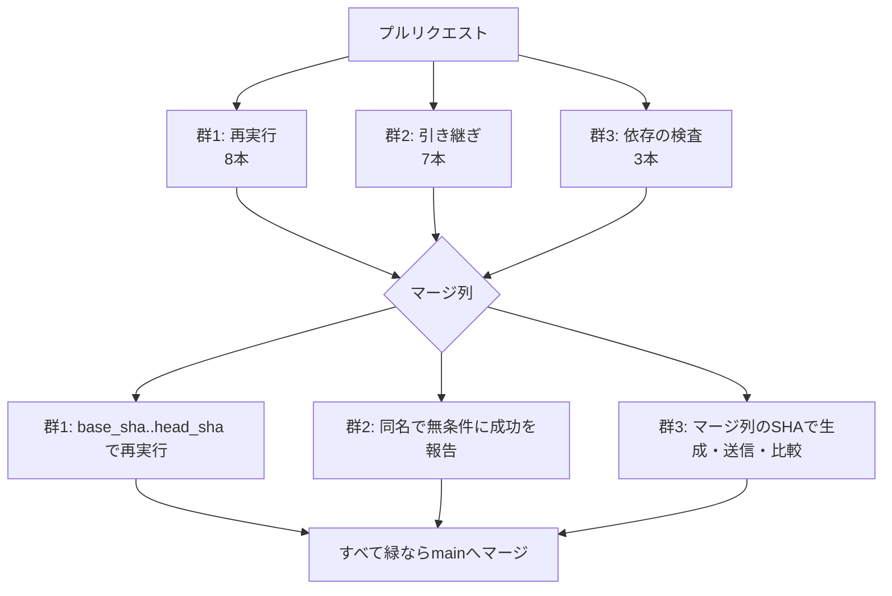
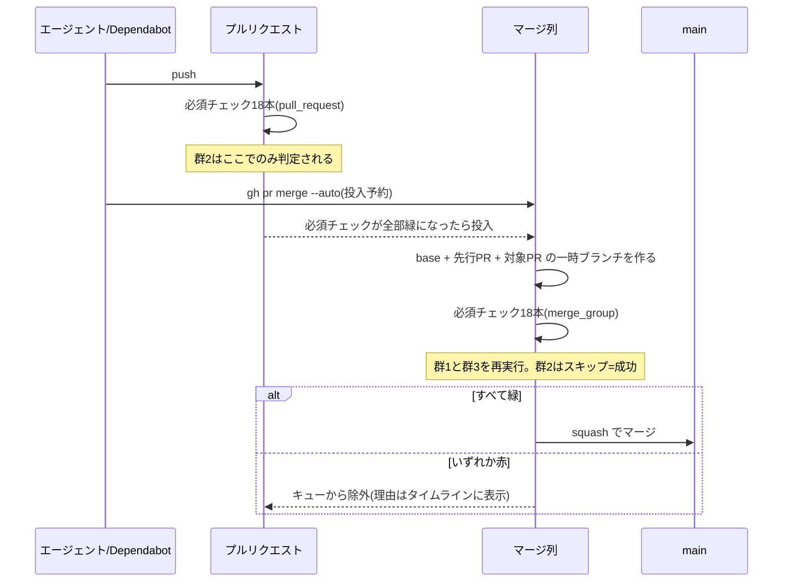
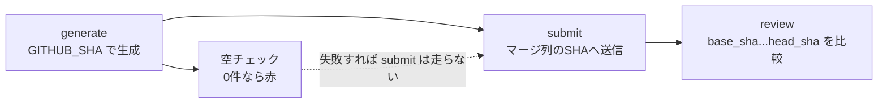

# Design Document — merge-queue-migration

## Overview

**Purpose**: 必須ステータスチェック18本を `merge_group` イベントに対応させ、
ブランチ保護を merge queue へ切り替える。マージ後に成立する状態そのものを、
人間の操作を増やさずに検証できるようにする。

**Users**: リポジトリ所有者。切り替え後、複数のPRが同時に開いても
Update branch を押す作業が発生しなくなる。

**Impact**: 現在は `Require branches to be up to date` を無効にしており、
古い base で緑になったPRがそのままマージされる。切り替え後は、最新の base と
先行するPRの変更を重ねた一時ブランチで必須チェックが再評価される。

### Goals

- 必須チェック18本すべてがマージ列に対して結果を報告する
- マージ後の状態に対して、テスト・E2E・コンテナビルド・IaC静的検査・
  Gradle本体の検証・依存の脆弱性検査を実行する
- 切り替えによって出荷が止まらない(Dependabot・`/ship` の両経路)

### Non-Goals

- 検査そのものの判定ロジックの変更(何を検知するかは変えない)
- 必須チェックの追加・削除
- `Require branches to be up to date` の再有効化
- Trivy ゲートの導入(#181)

## Boundary Commitments

### This Spec Owns

- 7本のワークフローの `merge_group` 対応(トリガ・条件式・concurrency・入力)
- 自動マージの予約方法の調整(`dependabot-auto-merge.yaml` のトークン)
- 必須チェック18本の扱いの対照表(本文書に持つ)
- 切り替えに伴う文書の更新(監査手順・README・基盤構築手順)

### Out of Boundary

- 検知スクリプトの判定ロジック(`.github/scripts/*.sh` の中身)
- 必須チェックの構成そのもの
- キューの設定値の適用(人間が Settings で行う)

### Allowed Dependencies

- GitHub の merge queue 機能とその設定
- 既存の `BOT_GITHUB_TOKEN`(Actions secrets に登録済み)
- 3つのGitHub Action(いずれも `merge_group` 対応を確認済み)

### Revalidation Triggers

- 必須チェックの追加・削除(対照表と件数の更新が必要)
- 使用しているアクションのメジャー更新(`merge_group` 対応の再確認が必要)
- キューのマージ方式の変更(squash 規約に影響)

## KeirekiPro Compliance Check

- [x] **backend層配置**: N/A(backendのコードを変更しない)
- [x] **frontend境界**: N/A(frontendのコードを変更しない)
- [x] **状態管理**: N/A
- [x] **DBスキーマ**: N/A(マイグレーションを含まない)
- [x] **依存追加**: N/A(新規ライブラリを追加しない。既存アクションのバージョンも変えない)
- [ ] **ゲート設定**: **本設計は `.github/` と `.claude/` の変更を必要とする。**
      切り替えの本体がワークフローの改修であるため分離できない。
      所有者の承認を経てマージする(escape-hatch の系統6と CODEOWNERS が機械強制)

## Architecture

### Existing Architecture Analysis

必須チェック18本は7本のワークフローに属し、いずれも `pull_request` を起点にしている。
`terraform-plan.yaml` を除く6本が `github.event.pull_request` を参照している。

現在の防御は「PRの差分に対する検査」で統一されており、マージ後の状態は検証していない。
`Require branches to be up to date` を無効にしたため、この差は現在そのまま穴になっている。

### 中心となる設計判断

**必須チェックを3つの群に分ける。** 群ごとに `merge_group` での扱いを決める。



**群2が無条件の成功報告になるのは、判定に必要なPRの文脈(本文・ラベル・レビュー状態・
作成者)がマージ列に存在しないため、または使用しているアクションが `merge_group` に
対応していないためである。** `merge_group` のペイロードは5フィールドのみで、PR番号も
PR一覧も含まれない(`additionalProperties: false` のスキーマで確認)。したがって
「PR段階の結果を読み取って引き継ぐ」実装は原理的にできない。

これは検査を弱める。ただしキュー投入の条件としてPR側の必須チェック通過が要求されるため、
群2の判定が失敗しているPRはそもそもキューに到達しない。残余リスクは
「キュー投入後にPRの本文・ラベル・承認が変更された場合」と、`dependency-cooldown` の
「重ね合わせで依存解決が変わる場合」で、いずれも群2の表に記載する。

**群2の `if:` は既存のイベント条件を保持したまま `!= 'merge_group'` を足す。**
`guardrails.yaml` `dependency-gate.yaml` `pre-merge-check.yaml` は
`pull_request_review` でも発火し、所有者の承認と取り消しでチェックを再評価している。
`== 'pull_request'` に限定すると取り消しを赤に戻す経路が消える。ruleset の
`required_approving_review_count` が 0 のため、この再評価が承認撤回を止める唯一の
仕組みにあたる。

### 群の割り付け

| 群 | チェック | ワークフロー |
|---|---|---|
| 1. 再実行 | `detect-changes` `frontend-test` `backend-test` `e2e-smoke` `docker-smoke` | `ci.yaml` |
| 1. 再実行 | `detect-terraform-changes` `terraform-static` | `terraform-plan.yaml` |
| 1. 再実行 | `gradle-wrapper` | `guardrails.yaml` |
| 2. 引き継ぎ | `escape-hatch` `size-check` `gitleaks` | `guardrails.yaml` |
| 2. 引き継ぎ | `dependency-gate` | `dependency-gate.yaml` |
| 2. 引き継ぎ | `pre-merge-check` | `pre-merge-check.yaml` |
| 2. 引き継ぎ | `codex-review` | `codex-review.yml` |
| 2. 引き継ぎ | `dependency-cooldown` | `dependency-review.yaml` |
| 3. 依存 | `dependency-graph-generate` `dependency-graph-submit` `dependency-review` | `dependency-review.yaml` |

合計 8 + 7 + 3 = **18本**。

### 群2の引き継ぎ理由(R3.4)

**`merge_group.base_sha` はマージ列の親コミット(= 先行するキュー項目)であり、
`base_sha..head_sha` はそのPR1本分の差分に相当する。** したがって「差分の境界が
復元できない」ことは引き継ぎの理由にならない。理由は次の2つに限られる。

| チェック | 再実行できない理由 | 残余リスク |
|---|---|---|
| `size-check` | 行数の計上自体は再現できるが、上限超過時のspec裏付け検証がPR本文の `Spec:` 行を要する | キュー投入後にPR本文が編集されても検知しない |
| `escape-hatch` | PR本文の `Test-Change-Justification:` と所有者の承認状態を参照する | 同上。承認取り消し後は Remove from queue で対処 |
| `dependency-gate` | 所有者の承認状態がPR単位の概念 | 同上 |
| `pre-merge-check` | ラベルと承認状態がPR単位の概念 | 同上 |
| `codex-review` | PRに対するレビューであり、往復の記録もPRに紐づく | 同上 |
| `gitleaks` | **使用しているアクションが `merge_group` に対応していない。** `supportedEvents` は push / pull_request / workflow_dispatch / schedule の4つで、リスト外のイベントでは `exit 1` になる | マージ列のコミットはbaseと各PRのコミットを機械的に重ねたもので新しい内容を生まない。衝突するPRは同時に投入できない。実質的な検査の弱まりは無い |
| `dependency-cooldown` | Dependabotの除外判定がPR作成者に依存する。マージ列では評価できず、除外を外すとDependabotの脆弱性対応PRが恒久的にマージ不能になる | 重ね合わせで依存解決が変わり、新たに72時間未満のパッケージが入る場合を検出しない |

### 技術選択

| 層 | 選択 | 役割 | 備考 |
|---|---|---|---|
| トリガ | `merge_group` イベント | 7本すべてに追加 | pathフィルタは付けない(Pending で詰まるため) |
| 差分の起点 | `github.event.merge_group.base_sha` / `head_sha` | 群1・群3の比較の基準 | `paths-filter` と `dependency-review-action` はネイティブ分岐。`dependency-submission` は `GITHUB_SHA`(同一コミット)経由 |
| 群2の報告 | ジョブレベル `if:` によるスキップ | 同名で Success を報告 | スキップは Success として扱われる(公式明記) |
| 自動マージ | `gh pr merge --auto` | キューへの投入予約 | `--squash` は警告のみで無視される |
| Dependabotの投入 | `BOT_GITHUB_TOKEN`(Dependabot secrets) | `GITHUB_TOKEN` ではキューに入れられない | 判断事項1 |

## 判断事項1: Dependabot のPRをキューへ投入する手段

公式ドキュメントは次のとおり明記している。

> If the target branch uses a merge queue, the built-in `GITHUB_TOKEN` cannot add
> pull requests to the queue. In this case, you must authenticate the workflow with
> a personal access token or a GitHub App token that has permission to merge

さらに `dependabot-auto-merge.yaml` は Dependabot のPRを起点とするため、
**Actions secrets を参照できない**(#127 の制約1)。使えるのは Dependabot secrets に
登録した鍵に限られる。

### 選択肢

| 案 | 内容 | 費用 |
|---|---|---|
| **A(採用)** | `BOT_GITHUB_TOKEN` を Dependabot secrets にも登録し、`dependabot-auto-merge.yaml` で使う | 鍵の管理点が2箇所になる。失効時に2箇所の更新が要る |
| B | `workflow_run` を起点にする別ワークフローから投入する | Actions secrets を使えるが、`workflow_run` のペイロードから対象PRを特定する対応付けが脆く(`pull_requests[]` が空になる事例が知られる)、起点にするワークフローの選び方も恣意的になる |
| C | 投入を自動化せず、所有者が「Merge when ready」を押す | 鍵は増えないが、#200 で除去した手作業が戻る |
| D | `schedule` + `workflow_dispatch` の掃引ワークフローが Actions secrets の `BOT_GITHUB_TOKEN` で `gh pr merge --auto` を冪等に予約する | 鍵は1箇所のまま。最大で実行間隔ぶんの遅延。cronの停止が静かな滞留になる |

### 採用理由(A)

Bは完了判定そのものは不要(`gh pr merge --auto` を一度実行すればGitHub側が緑待ちから
投入まで行う)だが、`workflow_run` のペイロードから対象PRを特定する対応付けが脆い。
誤ると **PRが静かに滞留する**(投入されないだけで赤にならない)。

Dは鍵を増やさずに済む唯一の案で、費用対効果は近い。イベント駆動で機構が最も少ない
点を採ってAにするが、鍵の複製を避けたい場合はDへ切り替えられる。

Cは #200 の目的を打ち消す。dockerレーンは滞留がそのまま更新停止を意味するため、
手作業に戻すと恒久ブロックの危険が復活する。

Aの費用は「鍵の管理点が2箇所」だが、**同一の鍵**を2箇所に置くだけであり、
#127 が懸念した「片方が古くなると分かりにくい壊れ方をする」に対しては、
失効時に Dependabot のPRがキューに入らず滞留する形で現れる。これは週次監査の項目6
(滞留の確認)で検知できる。

### 人間の作業

`BOT_GITHUB_TOKEN` を Settings → Secrets and variables → **Dependabot** に、
Actions 側と同じ名前・同じ値で登録する。

あわせて権限を確認する。公式の要求は「permission to merge」で、具体的には
botアカウントがリポジトリへ **Write 以上**のロールを持ち、classic PAT なら `repo`、
fine-grained PAT なら **Contents: Read and write + Pull requests: Read and write**
(+ Metadata: Read)が要る。

**登録せずに切り替えると、auto-merge ジョブが赤(非必須)になるだけで
DependabotのPRが静かに予約されない。** 登録 → マージの順序を守ること。

## 判断事項2: `/ship` の予約コマンド

`gh pr merge --auto --squash` は、キュー有効時も動作する。`--squash` は
`The merge strategy for %s is set by the merge queue` の警告が出るだけで無視される。

**コマンドは変更しない。`--squash` も残す。**

外してはいけない。gh CLI は**キューが無いブランチでは、非対話環境でメソッド指定が
無いと `--merge, --rebase, or --squash required when not running interactively` で
エラーになる。** 外すと次の2つの場面で `/ship` の予約が失敗する。

1. トリガを先行マージしてからキューを有効化するまでの窓
2. **キューが詰まって緊急にキューを無効化したとき**

2は「復旧手段を使うと出荷手段が壊れる」循環になる。警告が出続けることは
監査手順に1行書いて許容する。

この判断により `.claude/skills/ship/SKILL.md` の変更は不要になり、
承認対象のファイルが1つ減る。

`-d` / `--delete-branch` はキュー有効時にエラーになるが、現在どちらの経路でも
使っていないため影響しない。

## File Structure Plan

### 変更するファイル

```
.github/workflows/
├── ci.yaml                      # merge_group トリガ追加。concurrency は変更不要
├── guardrails.yaml              # 群1(gradle-wrapper)と群2(escape-hatch / size-check / gitleaks)が同居
├── dependency-review.yaml       # 群3。submit の fork 判定を書き換え、cooldown は群2として除外
├── terraform-plan.yaml          # 群1。terraform-plan ジョブ(非必須)は merge_group から除外する
├── dependency-gate.yaml         # 群2
├── pre-merge-check.yaml         # 群2
├── codex-review.yml             # 群2
└── dependabot-auto-merge.yaml   # トークンを BOT_GITHUB_TOKEN に切り替える


doc/開発フロー/
├── 監査手順.md                   # Update branch の項目を削除。キューが詰まった場合の手順を追加
└── 基盤構築手順.md               # ブランチ保護の設定表と必須チェック一覧を更新。既存のずれ2点も解消

README.md                        # ワークフロー一覧表とMermaid図
```

### 変更の型

7本のワークフローに共通して必要なのは次の3つ。

1. `on:` に `merge_group:` を追加する(`types: [checks_requested]` を明示)
2. `concurrency.group` の `github.event.pull_request.number` に
   `|| github.run_id` のフォールバックを付ける(`ci.yaml` は対応済み)
3. ジョブの `if:` と入力を、群ごとの扱いに合わせる

群ごとの3の内容は次のとおり。

| 群 | `if:` | 入力 |
|---|---|---|
| 1 | 変更しない(常に実行) | base/head を `merge_group` の値に切り替える |
| 2 | `github.event_name != 'merge_group'` を追加する(**既存のイベント条件は保持する**) | 変更しない |
| 3 | fork 判定を merge_group でも成立する形に変える | アクションが自動採用するため明示不要 |

### `dependency-review.yaml` の submit ジョブの条件式

```yaml
    if: >-
      github.event_name == 'merge_group' ||
      github.event.pull_request.head.repo.full_name == github.repository
```

`pull_request` ではfork PRを従来どおり除外し、`merge_group` では無条件に実行する。
マージ列のrefはbaseリポジトリ上にありトークンもbaseリポジトリのものなので、
fork由来の読み取り専用制約は構造的に発生しない。generate が `contents: read`、
submit が checkout しないという権限分離もそのまま成立する。

**この書き換えを忘れると、submit がスキップされたまま review が「差分なし」で緑になる。**

### `codex-review.yml` は明示ガードが必須

現在の `if:` は `github.event.pull_request.draft == false` を含む。merge_group では
`draft` が null になるが、GitHub Actions の式は比較時に null も false も 0 へ型強制する
ため **`null == false` は true になる**。ガードが無いとジョブが merge_group で実行され、
`pull_request.number` の参照で失敗してキューを塞ぐ(`CODEX_REVIEW_ENABLED` 有効化時)。

### `dependency-cooldown` の条件式

```yaml
    if: >-
      ${{ !cancelled()
      && github.event_name == 'pull_request'
      && github.event.pull_request.head.repo.full_name == github.repository
      && github.event.pull_request.user.login != 'dependabot[bot]'
      && needs.generate.result == 'success'
      && needs.submit.result == 'success' }}
```

現在の式は merge_group で偶然 false になって通るが、意図が読めないため明示する。

### `terraform-plan` ジョブ(非必須)

```yaml
  terraform-plan:
    needs: detect-terraform-changes
    if: >-
      github.event_name != 'merge_group' &&
      needs.detect-terraform-changes.outputs.terraform_changed == 'true'
```

`Comment on PR` ステップが `context.issue.number` を使っており、merge_group では
undefined になってAPI呼び出しが失敗する。必須チェックではないためキューは詰まらないが、
terraformを触るPRのマージ列が毎回赤バッジ付きになる。plan結果はPRで人が読むためのもので
マージ列には不要なため除外する。

### スナップショット待ちのタイムアウト

`dependency-review` の `retry-on-snapshot-warnings-timeout` の既定は120秒で、
超過しても**失敗せず不完全な比較のまま続行する**(`Retry timeout exceeded. Proceeding...`)。
複数PRを同時にキューへ入れると、先行項目のスナップショット送信が間に合わず
「差分なし」で緑になる窓がある。`600` を明示する。

## System Flows

### 切り替え後のマージまでの流れ



### 依存の検査(群3)の流れ



`dependency-cooldown` は群2としてマージ列ではスキップ(成功扱い)になる。理由は群2の表を参照。

`dependency-review-action` は `merge_group` を認識して `base_sha`/`head_sha` を
自動採用する。`dependency-submission` は `GITHUB_SHA`(マージ列のコミット)に対して
生成・送信する。両者が指すコミットは同一のため、組み合わせとして整合する。

**submit がスキップされると review は「差分なし」で緑になる。** 現在の fork 判定は
merge_group で false になるため、条件式を必ず書き換える。

## Requirements Traceability

| 要件 | 設計での実現 |
|---|---|
| 1.1 | 7本すべてに `merge_group` トリガを追加。群2はスキップで Success を報告 |
| 1.2 / 1.3 | 本文書の「群の割り付け」表(18本・ワークフロー・扱いを対応づけ) |
| 1.4 | 群2のスキップはジョブレベル `if:` で行い、ジョブ名を変えない |
| 1.5 | キューの既定挙動(失敗したPRは自動で除外される) |
| 2.1 | 群1の8本を merge_group で実行する |
| 2.2 | `paths-filter` が `merge_group.base_sha`/`head_sha` を自動採用する |
| 2.3 | `detect-changes` / `detect-terraform-changes` を必須チェックに含めたまま維持する |
| 2.4 | スキップはジョブの実行ログに残る(既存の挙動) |
| 3.1 / 3.2 | 群2の7本に `github.event_name != 'merge_group'` を付与する(既存のイベント条件は保持。`gitleaks` と `dependency-cooldown` は既存条件が merge_group を除外済みのため変更不要) |
| 3.3 | キュー投入の条件としてPR側の必須チェック通過が要求される |
| 3.4 | 本文書の「群2の引き継ぎ理由」表 |
| 4.1 | 群3の3本を merge_group で実行する。`dependency-review` は merge_group を認識して比較する |
| 4.2 | `dependency-cooldown` に適用する。Dependabotの除外判定がPR作成者に依存するため引き継ぎ、残余リスクを群2の表に記載 |
| 4.3 | `check-dependency-snapshot.sh` は generate ジョブ内にあり、トリガ追加でそのまま動く |
| 4.4 | `dependency-graph.yaml` は `push` 起点のため変更しない |
| 5.1 | キューのタイムアウトを60分に設定する(人間作業)。明示 `timeout-minutes` は `docker-smoke` の45が最長で、キュー側はランナー待ちを含むため余裕を持たせる |
| 5.2 | concurrency に `|| github.run_id` のフォールバックを付ける |
| 5.3 | merge_group での既定権限が不明なため、各ジョブの `permissions` を明示する |
| 5.4 | 判断事項1(A案)。`BOT_GITHUB_TOKEN` を Dependabot secrets へ |
| 5.5 | `rerun-approval-gated-checks.yaml` は `pull_request_review` 起点で、群2の判定をPR側で更新する。merge_group とは独立して機能する |
| 5.6 | キューのマージ方式に SQUASH を指定する(人間作業) |
| 6.1〜6.6 | 文書の更新(File Structure Plan 参照) |

## Testing Strategy

ワークフローの変更は本番のCIでしか検証できないため、段階を分ける。

### 段階1: 切り替え前の静的確認

- `actionlint` が7本すべてで通ること
- 対照表の18本が、Rulesets API が返す必須チェック一覧と件数・名前ともに一致すること
  (`gh api repos/:owner/:repo/rulesets/<id>` の出力と突き合わせる)

### 段階2: merge queue を有効にする前の実地確認

`merge_group` トリガを追加したワークフローを先にマージし、**キューを有効にする前に**
通常のPRで `pull_request` 側が壊れていないことを確認する。

- 必須チェック18本が従来どおり報告されること
- 群2のスキップ条件が `pull_request` では発動しないこと

### 段階3: キュー有効化後の確認

- 検証用のPRを1本キューに通し、18本すべてが merge_group で報告されること
- `dependency-review` が merge_group で実際に比較を行っていること
  (「No Dependency Changes found」で緑になっていないこと)
- `GITHUB_SHA` と `merge_group.head_sha` が一致すること(未確認事項の解消)
- Dependabot のPRが人間の操作なしにキューへ入ること

### 段階4: 複数PR同時の確認

2本以上のPRを同時にキューへ入れ、順に自動マージされること。
concurrency グループが互いをキャンセルしていないこと。

**backendの依存を変えるPRを2本同時に入れ、後続の `dependency-review` が実際に比較を
行っていることを確認する**(「No Dependency Changes found」で緑になっていないこと)。
先行項目のスナップショット送信を待てているかの確認になる。

## カナリアPRの扱い

`canary.yaml` が毎月生成するカナリアPR(常に赤であることが期待される)は、
**キューに入る経路が無い。**

- `create-canary-prs.sh` はカナリアに auto-merge を設定しない(「絶対にマージしない」と明記)
- 常に赤のため、キュー投入の条件である「PR側の必須チェック通過」を満たさない

設計上の対応は不要。監査手順に1行だけ記載する。

## Risks

| リスク | 影響 | 対処 |
|---|---|---|
| 1本でも merge_group 未対応が残る | 全PRがマージ不能 | 対照表で18本を機械的に突き合わせる。段階3で検証用PRを1本通す |
| `dependency-review.yaml` の fork 判定 | 依存の検査が静かに無効化される | 条件式の書き換えを最優先で扱う。段階3で「差分なし」で緑になっていないことを確認する |
| Dependabot の鍵の失効 | DependabotのPRがキューに入らず滞留 | 週次監査の項目6で検知する |
| キューのタイムアウトが短い | `docker-smoke` が45分かかると失敗扱い | 60分を指定する(人間作業) |
| `gitleaks` の `if:` を広げてしまう | アクションが `exit 1` で失敗し全PRがマージ不能 | 群2として `pull_request` に限定する。段階3で検証 |
| `gradle-wrapper` のSHA差し替え漏れ | 空引数で即赤になりキューが詰まる | スクリプトが引数必須(fail-closed)。段階3で必ず通ることを確認 |
| キュー解体後のスナップショットの扱い | 不明 | 段階3で compare API を2時点で確認する |

## 人間が実施する作業

| # | 作業 | 時期 |
|---|---|---|
| 1 | `BOT_GITHUB_TOKEN` を Dependabot secrets に登録し、権限(Write以上)を確認 | ワークフローのマージ前 |
| 2 | merge queue を有効化 | 段階2の確認後 |
| 3 | マージ方式に **squash** を指定 | 2と同時 |
| 4 | ステータスチェックのタイムアウトを **60分**に指定 | 2と同時 |
| 5 | `Require branches to be up to date` を有効に戻さない | 恒久 |

## Supporting References

調査の詳細と根拠URLは `research.md` を参照。
