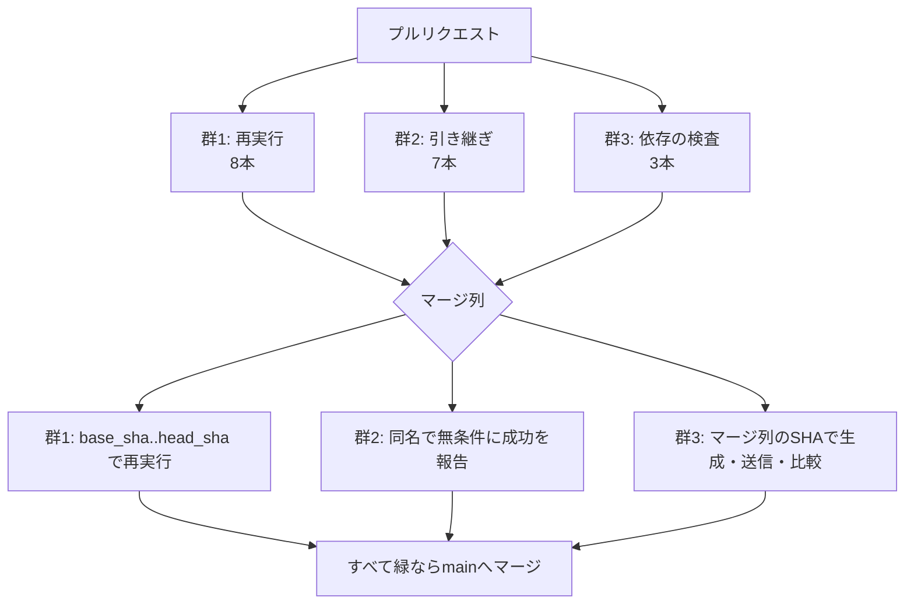
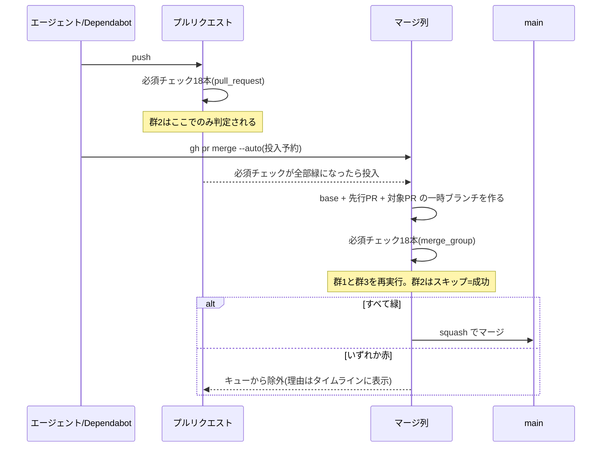
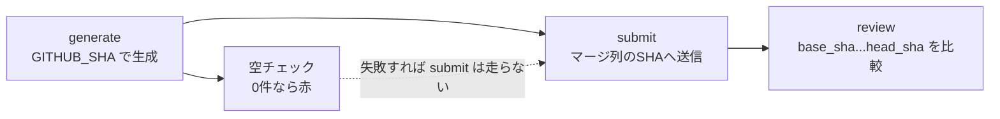

# 設計

## 概要

この設計は、必須ステータスチェック18本を `merge_group` イベントに対応させ、ブランチ保護を merge queue へ切り替える。この設計により、CIは、マージしたあとに成り立つ状態そのものを、人間の操作を増やさずに検証できるようになる。

この設計の利用者は、リポジトリの所有者である。切り替えたあとは、複数のPRが同時に開いても、所有者が Update branch を押す作業が起きなくなる。

今、このリポジトリは `Require branches to be up to date` を無効にしており、古い base で緑になったPRがそのままマージされる。切り替えたあとは、必須チェックのワークフローが、最新の base と先行するPRの変更を重ねた一時ブランチで、必須チェックを評価し直す。

## 作るものと作らないもの

### 作るもの

この設計は、次のことを目指す。

- 必須チェック18本のすべてが、マージ列に対して結果を報告する
- CIは、マージしたあとの状態に対して、テスト、E2E、コンテナのビルド、IaCの静的検査、Gradle本体の検証、依存の脆弱性の検査を実行する
- 切り替えによって出荷が止まらない(Dependabot と `/ship` の両方の経路)

この spec は、次のものを持つ。

- 7本のワークフローの `merge_group` への対応(トリガ、条件式、concurrency、入力)
- 自動マージの予約方法の調整(`dependabot-auto-merge.yaml` のトークン)
- 必須チェック18本の扱いの対照表(この設計文書に持つ)
- 切り替えに伴う文書の更新(監査手順、README、基盤構築手順)

### 作らないもの

この設計は、次のことを目指さない。

- 検査そのものの判定ロジックの変更(何を検知するかは変えない)
- 必須チェックの追加と削除
- `Require branches to be up to date` を再び有効にすること
- Trivy ゲートの導入(#181)

この spec は、次のものを持たない。

- 検知のスクリプトの判定ロジック(`.github/scripts/*.sh` の中身)
- 必須チェックの構成そのもの
- キューの設定値の適用(人間が Settings で行う)

## 使う既存の仕組み

- GitHub の merge queue の機能とその設定
- 既存の `BOT_GITHUB_TOKEN`(Actions secrets に登録済み)
- 3つの GitHub Action(どれも `merge_group` への対応を確かめ済み)

## 設計を見直すきっかけ

- 必須チェックを追加または削除したとき(対照表と件数の更新が要る)
- 使っているアクションのメジャー更新があったとき(`merge_group` への対応を確かめ直す必要がある)
- キューのマージ方式を変えたとき(squash の規約に影響する)

## プロジェクトの決まりを守っているか

- 品質チェックの設定: **この設計は、`.github/` と `.claude/` の変更を必要とする。** 切り替えの本体はワークフローの改修であるため、この変更は設計から切り離せない。この設計のPRは、所有者の承認を経てマージされる(escape-hatch の系統6と CODEOWNERS が、承認を機械で強制する)
- 関係のない項目: backend のコードを置く層(backend のコードを変更しない)、frontend の機能ごとの境界(frontend のコードを変更しない)、frontend の状態の持ち方、データベースの表の形(マイグレーションを含まない)、新しいライブラリの追加(新しいライブラリを足さず、既存のアクションのバージョンも変えない)

## 全体の構成

**使う技術**: この設計で使う技術は、次の表のとおりである。

| 層 | 選択 | 役割 | 備考 |
|---|---|---|---|
| トリガ | `merge_group` イベント | 7本すべてに追加 | pathフィルタは付けない(Pending で詰まるため) |
| 差分の起点 | `github.event.merge_group.base_sha` / `head_sha` | 群1・群3の比較の基準 | `paths-filter` と `dependency-review-action` はネイティブ分岐。`dependency-submission` は `GITHUB_SHA`(同一コミット)経由 |
| 群2の報告 | ジョブレベル `if:` によるスキップ | 同名で Success を報告 | スキップは Success として扱われる(公式明記) |
| 自動マージ | `gh pr merge --auto` | キューへの投入予約 | `--squash` は警告のみで無視される |
| Dependabotの投入 | `BOT_GITHUB_TOKEN`(Dependabot secrets) | `GITHUB_TOKEN` ではキューに入れられない | 判断事項1 |

### 中心となる設計判断

**この設計は、必須チェックを3つの群に分け、群ごとに `merge_group` での扱いを決める。**


```mermaid
flowchart TD
    PR[プルリクエスト] --> G1[群1: 再実行<br/>8本]
    PR --> G2[群2: 引き継ぎ<br/>7本]
    PR --> G3[群3: 依存の検査<br/>3本]

    G1 --> Q{マージ列}
    G2 --> Q
    G3 --> Q

    Q --> R1[群1: base_sha..head_sha で再実行]
    Q --> R2[群2: 同名で無条件に成功を報告]
    Q --> R3[群3: マージ列のSHAで生成・送信・比較]

    R1 & R2 & R3 --> M[すべて緑ならmainへマージ]
```

**群2のチェックがマージ列で無条件に成功を報告するのは、判定に要るPRの文脈(本文、ラベル、レビューの状態、作成者)がマージ列に存在しないか、使っているアクションが `merge_group` に対応していないためである。** `merge_group` のペイロードは5つのフィールドだけを持ち、PRの番号もPRの一覧も含まない(`additionalProperties: false` のスキーマで確認した)。したがって、「PRの段階の結果を読み取って引き継ぐ」実装は、原理的にできない。

この扱いは、検査を弱める。ただし、GitHub はキューへの投入の条件としてPR側の必須チェックの通過を求めるため、群2の判定が失敗しているPRは、そもそもキューに到達しない。残るリスクは、「キューに投入したあとにPRの本文、ラベル、承認が変更された場合」と、`dependency-cooldown` の「重ね合わせで依存の解決が変わる場合」である。どちらの残るリスクも、群2の引き継ぎ理由の表に書く。

**この設計は、群2のジョブの `if:` に、既存のイベントの条件を保ったまま `!= 'merge_group'` を足す。** `guardrails.yaml` `dependency-gate.yaml` `pre-merge-check.yaml` は `pull_request_review` でも発火し、所有者の承認と承認の取り消しのたびにチェックを評価し直している。`if:` を `== 'pull_request'` に限ると、承認の取り消しでチェックを赤に戻す経路が消える。ruleset の `required_approving_review_count` が 0 のため、この評価し直しが、承認の撤回を止める唯一の仕組みにあたる。

### 群の割り付け

必須チェックの群への割り付けは、次の表のとおりである。

| 群 | チェック | ワークフロー |
|---|---|---|
| 1. 再実行 | `detect-changes` `frontend-test` `backend-test` `e2e-smoke` `docker-smoke` | `ci.yaml` |
| 1. 再実行 | `detect-terraform-changes` `terraform-static` | `terraform-plan.yaml` |
| 1. 再実行 | `gradle-wrapper` | `guardrails.yaml` |
| 2. 引き継ぎ | `escape-hatch` `size-check` `gitleaks` | `guardrails.yaml` |
| 2. 引き継ぎ | `dependency-gate` | `dependency-gate.yaml` |
| 2. 引き継ぎ | `pre-merge-check` | `pre-merge-check.yaml` |
| 2. 引き継ぎ | `codex-review` | `codex-review.yml` |
| 2. 引き継ぎ | `dependency-cooldown` | `dependency-review.yaml` |
| 3. 依存 | `dependency-graph-generate` `dependency-graph-submit` `dependency-review` | `dependency-review.yaml` |

群の合計は、8 + 7 + 3 = **18本** である。

### 群2の引き継ぎ理由

対応する要件: 3.4

**`merge_group.base_sha` は、マージ列の親コミット(= 先行するキューの項目)であり、`base_sha..head_sha` は、そのPR1本分の差分に相当する。** したがって、「差分の境界を復元できない」ことは、引き継ぎの理由にならない。引き継ぎの理由は、次の表のとおり、PRの文脈に依存することと、使っているアクションが `merge_group` に対応していないことの2つに限られる。

| チェック | 再実行できない理由 | 残るリスク |
|---|---|---|
| `size-check` | 行数の計上自体は再現できるが、上限超過時のspec裏付け検証がPR本文の `Spec:` 行を要する | キュー投入後にPR本文が編集されても検知しない |
| `escape-hatch` | PR本文の `Test-Change-Justification:` と所有者の承認状態を参照する | 同上。承認取り消し後は Remove from queue で対処 |
| `dependency-gate` | 所有者の承認状態がPR単位の概念 | 同上 |
| `pre-merge-check` | ラベルと承認状態がPR単位の概念 | 同上 |
| `codex-review` | PRに対するレビューであり、往復の記録もPRに紐づく | 同上 |
| `gitleaks` | **使用しているアクションが `merge_group` に対応していない。** `supportedEvents` は push / pull_request / workflow_dispatch / schedule の4つで、リスト外のイベントでは `exit 1` になる | マージ列のコミットはbaseと各PRのコミットを機械的に重ねたもので新しい内容を生まない。衝突するPRは同時に投入できない。実質的な検査の弱まりは無い |
| `dependency-cooldown` | Dependabotの除外判定がPR作成者に依存する。マージ列では評価できず、除外を外すとDependabotの脆弱性対応PRが恒久的にマージ不能になる | 重ね合わせで依存解決が変わり、新たに72時間未満のパッケージが入る場合を検出しない |

## 判断事項1: Dependabot のPRをキューへ投入する手段

公式ドキュメントは、次のとおり明記している。

> If the target branch uses a merge queue, the built-in `GITHUB_TOKEN` cannot add
> pull requests to the queue. In this case, you must authenticate the workflow with
> a personal access token or a GitHub App token that has permission to merge

さらに、`dependabot-auto-merge.yaml` は Dependabot のPRを起点とするため、**Actions secrets を参照できない**(#127 の制約1)。`dependabot-auto-merge.yaml` が使える鍵は、Dependabot secrets に登録した鍵に限られる。

### 選択肢

この設計が比べた案は、次の表のとおりである。表の D案の「冪等」は、同じPRに何度実行しても結果が変わらないことを指す。

| 案 | 内容 | 費用 |
|---|---|---|
| **A(採用)** | `BOT_GITHUB_TOKEN` を Dependabot secrets にも登録し、`dependabot-auto-merge.yaml` で使う | 鍵の管理点が2箇所になる。失効時に2箇所の更新が要る |
| B | `workflow_run` を起点にする別ワークフローから投入する | Actions secrets を使えるが、`workflow_run` のペイロードから対象PRを特定する対応付けが脆く(`pull_requests[]` が空になる事例が知られる)、起点にするワークフローの選び方も恣意的になる |
| C | 投入を自動化せず、所有者が「Merge when ready」を押す | 鍵は増えないが、#200 で除去した手作業が戻る |
| D | `schedule` + `workflow_dispatch` の掃引ワークフローが Actions secrets の `BOT_GITHUB_TOKEN` で `gh pr merge --auto` を冪等に予約する | 鍵は1箇所のまま。最大で実行間隔ぶんの遅延。cronの停止が静かな滞留になる |

### 採用理由(A)

B案では、完了の判定そのものは要らない(`gh pr merge --auto` を一度実行すれば、GitHub 側が、緑を待つところから投入までを行う)。しかし、B案では、`workflow_run` のペイロードから対象のPRを特定する対応付けが脆い。対応付けを誤ると、**PRが静かに滞留する**(投入されないだけで、赤にならない)。

D案は、鍵を増やさずに済む唯一の案で、費用対効果はA案に近い。この設計は、イベント駆動で仕組みが最も少ない点を採ってA案にする。ただし、鍵の複製を避けたい場合は、D案へ切り替えられる。

C案は、#200 の目的を打ち消す。docker のレーンでは滞留がそのまま更新の停止を意味するため、手作業に戻すと、更新が恒久的にブロックされる危険が戻る。

A案の費用は「鍵の管理点が2箇所になる」ことだが、A案は**同一の鍵**を2箇所に置くだけである。#127 が懸念した「片方が古くなると分かりにくい壊れ方をする」は、A案では、鍵の失効時に Dependabot のPRがキューに入らず滞留する形で現れる。所有者は、この滞留を、週次監査の項目6(滞留の確認)で検知できる。

### 人間の作業

所有者は、`BOT_GITHUB_TOKEN` を、Settings → Secrets and variables → **Dependabot** に、Actions 側と同じ名前と同じ値で登録する。

所有者は、あわせて鍵の権限を確かめる。公式が求めるのは「permission to merge」である。具体的には、botアカウントがリポジトリに対して **Write 以上** のロールを持つ必要がある。鍵には、classic PAT なら `repo` が、fine-grained PAT なら **Contents: Read and write + Pull requests: Read and write**(+ Metadata: Read)が要る。

**所有者が鍵を登録せずに切り替えると、auto-merge のジョブが赤(必須ではないチェック)になるだけで、Dependabot のPRには静かに予約が付かない。** 所有者は、ワークフローの変更がマージされる前に、鍵を登録する。

## 判断事項2: `/ship` の予約コマンド

`gh pr merge --auto --squash` は、キューが有効なときも動く。キューが有効なとき、gh CLI は、`--squash` に対して `The merge strategy for %s is set by the merge queue` の警告を出すだけで、`--squash` を無視する。

**この設計は、`/ship` の予約コマンドを変更しない。`--squash` も残す。**

`--squash` を外してはいけない。**キューが無いブランチでは、gh CLI は、非対話の環境でマージの方法の指定が無いと、`--merge, --rebase, or --squash required when not running interactively` のエラーで止まる。** `--squash` を外すと、次の2つの場面で `/ship` の予約が失敗する。

1. トリガを先にマージしてから、キューを有効にするまでの間
2. **キューが詰まって、緊急にキューを無効にしたとき**

2つ目の場面は、「復旧の手段を使うと出荷の手段が壊れる」循環になる。この設計は、警告が出続けることを許容し、そのことを監査手順に1行書く。

この判断により、`.claude/skills/ship/SKILL.md` を変更する必要がなくなり、承認の対象のファイルが1つ減る。

`-d` / `--delete-branch` は、キューが有効なときにエラーになる。しかし、今はどちらの経路も `-d` / `--delete-branch` を使っていないため、この点は予約に影響しない。

## ファイルの構成

### 変更するファイル

この設計が変えるファイルは、次のとおりである。

```
.github/workflows/
├── ci.yaml                      # merge_group トリガ追加。concurrency は変更不要
├── guardrails.yaml              # 群1(gradle-wrapper)と群2(escape-hatch / size-check / gitleaks)が同居
├── dependency-review.yaml       # 群3。submit の fork 判定を書き換え、cooldown は群2として除外
├── terraform-plan.yaml          # 群1。terraform-plan ジョブ(非必須)は merge_group から除外する
├── dependency-gate.yaml         # 群2
├── pre-merge-check.yaml         # 群2
├── codex-review.yml             # 群2
└── dependabot-auto-merge.yaml   # トークンを BOT_GITHUB_TOKEN に切り替える


doc/開発フロー/
├── 監査手順.md                   # Update branch の項目を削除。キューが詰まった場合の手順を追加
└── 基盤構築手順.md               # ブランチ保護の設定表と必須チェック一覧を更新。既存のずれ2点も解消

README.md                        # ワークフロー一覧表とMermaid図
```

### 変更の型

7本のワークフローに共通して必要な変更は、次の3つである。

1. `on:` に `merge_group:` を追加する(`types: [checks_requested]` を明示する)
2. `concurrency.group` の `github.event.pull_request.number` に、`|| github.run_id` のフォールバックを付ける(`ci.yaml` は対応済み)
3. ジョブの `if:` と入力を、群ごとの扱いに合わせる

3つ目の変更(ジョブの `if:` と入力)の群ごとの内容は、次の表のとおりである。

| 群 | `if:` | 入力 |
|---|---|---|
| 1 | 変更しない(常に実行) | base/head を `merge_group` の値に切り替える |
| 2 | `github.event_name != 'merge_group'` を追加する(**既存のイベント条件は保持する**) | 変更しない |
| 3 | fork 判定を merge_group でも成立する形に変える | アクションが自動採用するため明示不要 |

### `dependency-review.yaml` の submit ジョブの条件式

```yaml
    if: >-
      github.event_name == 'merge_group' ||
      github.event.pull_request.head.repo.full_name == github.repository
```

この条件式により、submit のジョブは、`pull_request` では fork のPRを従来どおり除外し、`merge_group` では無条件に実行する。マージ列の ref は base のリポジトリの上にあり、トークンも base のリポジトリのものなので、fork に由来する読み取り専用の制約は、構造的に起きない。generate のジョブが `contents: read` を持ち、submit のジョブが checkout しないという権限の分離も、そのまま成り立つ。

**この条件式の書き換えを忘れると、submit のジョブがスキップされたまま、review のジョブが「差分なし」で緑になる。**

### `codex-review.yml` には明示のガードが要る

今の `if:` は、`github.event.pull_request.draft == false` を含む。merge_group では `draft` が null になる。GitHub Actions の式は、比較のときに null も false も 0 へ型を強制するため、**`null == false` は true になる**。そのため、ガードが無いと、ジョブが merge_group で実行され、`pull_request.number` の参照で失敗してキューを塞ぐ(`CODEX_REVIEW_ENABLED` を有効にしたとき)。

### `dependency-cooldown` の条件式

```yaml
    if: >-
      ${{ !cancelled()
      && github.event_name == 'pull_request'
      && github.event.pull_request.head.repo.full_name == github.repository
      && github.event.pull_request.user.login != 'dependabot[bot]'
      && needs.generate.result == 'success'
      && needs.submit.result == 'success' }}
```

今の式は、merge_group で偶然 false になって通る。しかし、今の式からは意図が読めないため、この設計は `github.event_name == 'pull_request'` を明示する。

### `terraform-plan` ジョブ(必須ではないチェック)

```yaml
  terraform-plan:
    needs: detect-terraform-changes
    if: >-
      github.event_name != 'merge_group' &&
      needs.detect-terraform-changes.outputs.terraform_changed == 'true'
```

`Comment on PR` のステップは `context.issue.number` を使っており、merge_group では `context.issue.number` が undefined になって、APIの呼び出しが失敗する。`terraform-plan` は必須チェックではないためキューは詰まらないが、terraform を触るPRのマージ列には、毎回赤のバッジが付く。plan の結果はPRで人が読むためのものであり、マージ列には要らない。そのため、この設計は、`terraform-plan` ジョブを merge_group から外す。

### スナップショット待ちのタイムアウト

`dependency-review` の `retry-on-snapshot-warnings-timeout` の既定は120秒である。待ち時間が既定を超えても、`dependency-review` は**失敗せず、不完全な比較のまま続ける**(`Retry timeout exceeded. Proceeding...`)。複数のPRを同時にキューへ入れると、先行する項目のスナップショットの送信が間に合わず、`dependency-review` が「差分なし」で緑になる時間の窓がある。そのため、この設計は、`retry-on-snapshot-warnings-timeout` に `600` を明示する。

## 処理の流れ

### 切り替えたあとのマージまでの流れ


```mermaid
sequenceDiagram
    participant A as エージェント/Dependabot
    participant PR as プルリクエスト
    participant Q as マージ列
    participant M as main

    A->>PR: push
    PR->>PR: 必須チェック18本(pull_request)
    Note over PR: 群2はここでのみ判定される
    A->>Q: gh pr merge --auto(投入予約)
    PR-->>Q: 必須チェックが全部緑になったら投入
    Q->>Q: base + 先行PR + 対象PR の一時ブランチを作る
    Q->>Q: 必須チェック18本(merge_group)
    Note over Q: 群1と群3を再実行。群2はスキップ=成功
    alt すべて緑
        Q->>M: squash でマージ
    else いずれか赤
        Q-->>PR: キューから除外(理由はタイムラインに表示)
    end
```

### 依存の検査(群3)の流れ


```mermaid
flowchart LR
    G[generate<br/>GITHUB_SHA で生成] --> S[submit<br/>マージ列のSHAへ送信]
    S --> R[review<br/>base_sha...head_sha を比較]
    G --> V[空チェック<br/>0件なら赤]
    V -.->|失敗すれば submit は走らない| S
```

`dependency-cooldown` は群2に属し、マージ列ではスキップされる(成功として扱われる)。スキップする理由は、群2の引き継ぎ理由の表に書いた。

`dependency-review-action` は、`merge_group` を認識して、`base_sha`/`head_sha` を自動で採用する。`dependency-submission` は、`GITHUB_SHA`(マージ列のコミット)に対して依存グラフを生成し、送信する。2つのアクションが指すコミットは同じであるため、この組み合わせは整合する。

**submit のジョブがスキップされると、review のジョブは「差分なし」で緑になる。** 今の fork の判定は merge_group で false になるため、この設計は、submit のジョブの条件式を必ず書き換える。

## テストの方針

ワークフローの変更は本番のCIでしか検証できないため、この設計は、確かめる段階を分ける。

### 段階1: 切り替える前の静的な確認

- `actionlint` が7本すべてで通る
- 対照表の18本が、Rulesets API が返す必須チェックの一覧と、件数も名前も一致する(`gh api repos/:owner/:repo/rulesets/<id>` の出力と突き合わせる)

### 段階2: merge queue を有効にする前の実地の確認

この段階では、`merge_group` のトリガを追加したワークフローが先にマージされる。Claude は、**キューを有効にする前に**、通常のPRで `pull_request` 側が壊れていないことを確かめる。

- 必須チェック18本が、従来どおり報告される
- 群2のスキップの条件が、`pull_request` では発動しない

### 段階3: キューを有効にしたあとの確認

- 検証用のPRを1本キューに通し、18本すべてが merge_group で報告される
- `dependency-review` が merge_group で実際に比較を行っている(「No Dependency Changes found」で緑になっていない)
- `GITHUB_SHA` と `merge_group.head_sha` が一致する(まだ確かめていない点の解消)
- Dependabot のPRが、人間の操作なしにキューへ入る

### 段階4: 複数のPRを同時に入れたときの確認

Claude は、2本以上のPRを同時にキューへ入れ、PRが順に自動でマージされることを確かめる。Claude は、concurrency のグループが互いをキャンセルしていないことも確かめる。

**Claude は、backend の依存を変えるPRを2本同時に入れ、後続の `dependency-review` が実際に比較を行っていることを確かめる**(「No Dependency Changes found」で緑になっていないこと)。この確認により、`dependency-review` が先行する項目のスナップショットの送信を待てているかが分かる。

## カナリアPRの扱い

`canary.yaml` が毎月作るカナリアPR(常に赤であることが期待されるPR)には、**キューに入る経路が無い。**

- `create-canary-prs.sh` は、カナリアPRに auto-merge を設定しない(「絶対にマージしない」と明記している)
- カナリアPRは常に赤のため、キューへの投入の条件である「PR側の必須チェックの通過」を満たさない

そのため、この設計は、カナリアPRのための対応を持たない。Claude は、監査手順に、このことを1行だけ書く。

## リスク

この設計のリスクと対処は、次の表のとおりである。表の fail-closed は、判定できないときに成功に倒さず、失敗に倒すことを指す。

| リスク | 影響 | 対処 |
|---|---|---|
| 1本でも merge_group 未対応が残る | 全PRがマージ不能 | 対照表で18本を機械的に突き合わせる。段階3で検証用PRを1本通す |
| `dependency-review.yaml` の fork 判定 | 依存の検査が静かに無効化される | 条件式の書き換えを最優先で扱う。段階3で「差分なし」で緑になっていないことを確認する |
| Dependabot の鍵の失効 | DependabotのPRがキューに入らず滞留 | 週次監査の項目6で検知する |
| キューのタイムアウトが短い | `docker-smoke` が45分かかると失敗扱い | 60分を指定する(人間作業) |
| `gitleaks` の `if:` を広げてしまう | アクションが `exit 1` で失敗し全PRがマージ不能 | 群2として `pull_request` に限定する。段階3で検証 |
| `gradle-wrapper` のSHA差し替え漏れ | 空引数で即赤になりキューが詰まる | スクリプトが引数必須(fail-closed)。段階3で必ず通ることを確認 |
| キュー解体後のスナップショットの扱い | 不明 | 段階3で compare API を2時点で確認する |

## 人間が行う作業

人間(所有者)が行う作業と、その時期は、次の表のとおりである。

| # | 作業 | 時期 |
|---|---|---|
| 1 | `BOT_GITHUB_TOKEN` を Dependabot secrets に登録し、権限(Write以上)を確認 | ワークフローのマージ前 |
| 2 | merge queue を有効化 | 段階2の確認後 |
| 3 | マージ方式に **squash** を指定 | 2と同時 |
| 4 | ステータスチェックのタイムアウトを **60分**に指定 | 2と同時 |
| 5 | `Require branches to be up to date` を有効に戻さない | 恒久 |

## 既存の構成

必須チェック18本は、7本のワークフローに属し、どのワークフローも `pull_request` を起点にしている。`terraform-plan.yaml` を除く6本のワークフローは、`github.event.pull_request` を参照している。

今の防御は、「PRの差分に対する検査」でそろっており、マージしたあとの状態を検証していない。`Require branches to be up to date` を無効にしたため、この差は、今そのまま穴になっている。

## 要件との対応

要件ごとの、この設計での実現は、次の表のとおりである。

| 要件 | 設計での実現 |
|---|---|
| 1.1 | 7本すべてに `merge_group` トリガを追加。群2はスキップで Success を報告 |
| 1.2 / 1.3 | 本文書の「群の割り付け」表(18本・ワークフロー・扱いを対応づけ) |
| 1.4 | 群2のスキップはジョブレベル `if:` で行い、ジョブ名を変えない |
| 1.5 | キューの既定挙動(失敗したPRは自動で除外される) |
| 2.1 | 群1の8本を merge_group で実行する |
| 2.2 | `paths-filter` が `merge_group.base_sha`/`head_sha` を自動採用する |
| 2.3 | `detect-changes` / `detect-terraform-changes` を必須チェックに含めたまま維持する |
| 2.4 | スキップはジョブの実行ログに残る(既存の挙動) |
| 3.1 / 3.2 | 群2の7本に `github.event_name != 'merge_group'` を付与する(既存のイベント条件は保持。`gitleaks` と `dependency-cooldown` は既存条件が merge_group を除外済みのため変更不要) |
| 3.3 | キュー投入の条件としてPR側の必須チェック通過が要求される |
| 3.4 | 本文書の「群2の引き継ぎ理由」表 |
| 4.1 | 群3の3本を merge_group で実行する。`dependency-review` は merge_group を認識して比較する |
| 4.2 | `dependency-cooldown` に適用する。Dependabotの除外判定がPR作成者に依存するため引き継ぎ、残余リスクを群2の表に記載 |
| 4.3 | `check-dependency-snapshot.sh` は generate ジョブ内にあり、トリガ追加でそのまま動く |
| 4.4 | `dependency-graph.yaml` は `push` 起点のため変更しない |
| 5.1 | キューのタイムアウトを60分に設定する(人間作業)。明示 `timeout-minutes` は `docker-smoke` の45が最長で、キュー側はランナー待ちを含むため余裕を持たせる |
| 5.2 | concurrency に `|| github.run_id` のフォールバックを付ける |
| 5.3 | merge_group での既定権限が不明なため、各ジョブの `permissions` を明示する |
| 5.4 | 判断事項1(A案)。`BOT_GITHUB_TOKEN` を Dependabot secrets へ |
| 5.5 | `rerun-approval-gated-checks.yaml` は `pull_request_review` 起点で、群2の判定をPR側で更新する。merge_group とは独立して機能する |
| 5.6 | キューのマージ方式に SQUASH を指定する(人間作業) |
| 6.1〜6.6 | 文書の更新(ファイルの構成の節を参照) |

## 参考にした資料

調査の詳細と根拠のURLは、`research.md` に書いてある。
