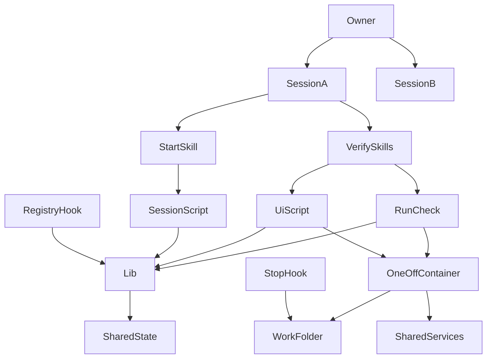
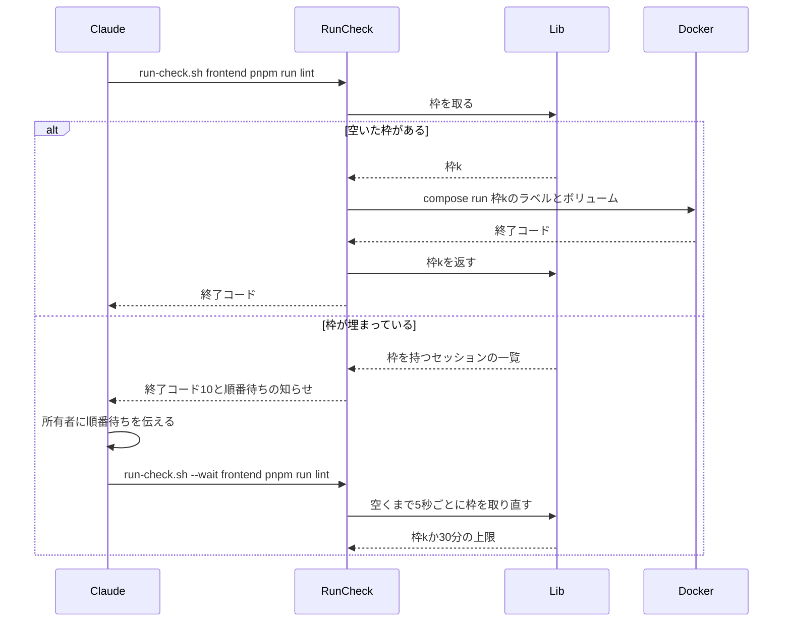
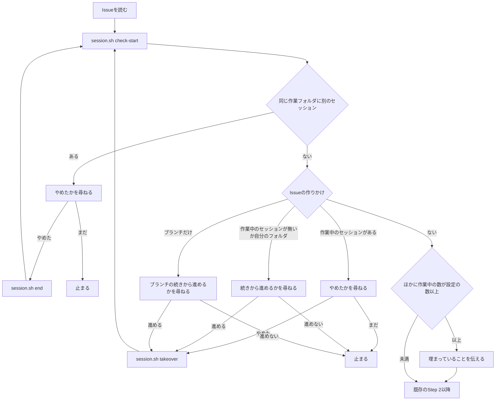

# 設計

## 概要

今は、品質チェックと画面確認のコマンドが、本体フォルダを読み込んだ常駐コンテナ(`spring` `react` `terraform`)の中で動く。この設計では、新しく作るスクリプト `run-check.sh` と `ui.sh` が、品質チェックと画面確認を、コマンドを動かすたびにそのセッションの作業フォルダを読み込んだ1回きりのコンテナで動かす。Claude は、品質チェックのスキルと画面確認のスキルから、新しく作るスクリプト `run-check.sh` と `ui.sh` を呼ぶ。`run-check.sh` と `ui.sh` は、同時に走るコンテナの数を、作業PCごとの設定 `git config keirekipro.parallelSlots` の数の枠で抑える。

新しく作るフック `session-registry.sh` は、セッションが始まったときと終わったときに、セッションの記録を付けたり消したりする。新しく作るスクリプト `session.sh` は、`/start` のときに、同じ作業フォルダの別のセッション、同じIssueの作りかけ、作業中のセッションの数を調べ、Claude が所有者に知らせることをまとめて返す。所有者が引き継ぐと答えたら、`session.sh` が前の作業フォルダの作りかけをこのセッションの作業フォルダに写す。

あわせて、Claude は、作業フォルダが1つであることを前提にしていた箇所を直す。

## 作るものと作らないもの

### 作るもの

- 品質チェック(`/verify-frontend` `/verify-backend` `/verify-terraform` `/verify-all`)を、そのセッションの作業フォルダを読み込んだ1回きりのコンテナで動かすスクリプト `run-check.sh` と、それを呼ぶように直したスキル
- 画面確認(`/verify-ui`)の開発サーバを、そのセッションの作業フォルダを読み込んだ1回きりのコンテナで、枠ごとのポートで動かすスクリプト `ui.sh` と、それを呼ぶように直したスキル
- 品質チェックと画面確認の同時に走る数を抑える枠と、枠が空くまでの待ち方(待ちの知らせと待ちの上限)
- 同時に走らせる数の設定 `git config keirekipro.parallelSlots` の読み方
- セッションの記録(作業中かどうか、最後に操作された時刻)を付けるフック `session-registry.sh`
- `/start` のときの調べ(同じ作業フォルダの別のセッション、同じIssueの作りかけ、作業中のセッションの数)と、Issueと作業フォルダとブランチの対応の記録、引き継ぎを行うスクリプト `session.sh` と、それを呼ぶように直した `/start`
- `/start` が spec で進めるIssueでも着手のときにブランチを作るようにする変更
- `/ship` の `.git/MERGE_MSG` を作業フォルダに依らない書き方に直す変更と、CIの見届けとCodexの指摘への対応の対象をそのセッションのブランチのPRに限る書き方
- 作業の終わりに品質チェックを済ませたかを確かめるフックが、そのセッションの作業フォルダを見るようにする変更
- worktree に写すファイルの一覧 `.worktreeinclude`、`.gitignore` への `.claude/worktrees/` の追加、`compose.yaml` の localstack の `env_file` の `required: false`
- CLAUDE.md、スコープ別の CLAUDE.md、steering の書き直しと、並行作業の運用の文書

### 作らないもの

- PRで走るチェック(GitHub Actions)の変更。CIは今のまま、`frontend/` `backend/` でネイティブにコマンドを動かす
- 開発サーバを手で起動する `start-dev.sh` の変更。この設計のあとは、どのセッションの品質チェックと画面確認も常駐コンテナを使わないので、`start-dev.sh` が常駐コンテナの中のプロセスを止めても、セッションの作業は止まらない
- 品質チェックの設定ファイル(`.github/` `eslint.config.js` `vite.config.ts` `quality.gradle`)と、backend のビルドスクリプト(`*.gradle`)の変更
- Redis と localstack を作業フォルダごとに分けること

## 使う既存の仕組み

- 本体フォルダの compose のプロジェクト `keirekipro` の常駐サービス `dind` `db` `redis` `localstack`。1回きりのコンテナは、これらをネットワーク `keirekipro_my-network` の名前(`dind` `db` `redis` `localstack`)で使う。`dind` は、コンテナの中で別の Docker を動かすサービスで、backend のテストがテスト用のコンテナを作るのに使う。Claude は、これらのサービスの定義を変えない
- 既存のイメージ `keirekipro-frontend` `keirekipro-backend` `keirekipro-terraform`。`run-check.sh` と `ui.sh` は、`compose.yaml` の `frontend` `backend` `terraform` のサービスの定義(イメージ、環境変数、作業ディレクトリ)をそのまま使って1回きりのコンテナを作り、`run` の引数でボリュームと環境変数だけを足す
- Claude Code のフック(SessionStart、SessionEnd、UserPromptSubmit、Stop)と、worktree の `.worktreeinclude`
- 既存のフックの書き方(`bash` と `perl` の `JSON::PP`、BOM無し、LF)と、既存のフックのテストの書き方(`.claude/hooks/tests/test-*.sh`。一時的な git のリポジトリを作り、JSON をフックに渡す)
- 依存の向き: スキルはスクリプトを呼ぶ。スクリプトは `lib.sh` を読み込む。フックは `lib.sh` を読み込んでよいが、スクリプトを呼ばない。スクリプトはスキルとフックを呼ばない

## 設計を見直すきっかけ

- `compose.yaml` の `frontend` `backend` `terraform` のサービスの作業ディレクトリ、ボリュームの行き先、ネットワーク名が変わったとき。`run-check.sh` と `ui.sh` が渡すボリュームの行き先と、共有のサービスにつなぐ名前が合わなくなる
- 品質チェックのコマンド(`pnpm run coverage` `./gradlew check` `checkov`)の並びや名前が変わったとき。`run-check.sh` が「最後の品質チェックが通った」と記録するコマンドが変わる
- Claude Code のフックの入力(`session_id` `cwd`)や、`.worktreeinclude` の扱いが変わったとき
- backend の開発用の設定(`application-dev.yaml`)の `spring.datasource.url` `frontend-base-url` `cors.allowed-origins` の名前が変わったとき。`ui.sh` が上書きする設定の名前が合わなくなる
- 作業PCの Docker のメモリの割り当てが変わったとき。同時に走らせる数の設定の目安が変わる

## プロジェクトの決まりを守っているか

- 新しいライブラリの追加: 足さない。スクリプトは、ホストOSの `bash` と `perl`(`JSON::PP`)と `docker` と `git` だけを使う。この前提は CLAUDE.md の Git規約と同じで、Windows では Git for Windows に同梱の Git Bash で満たし、macOS と Linux は標準で満たす
- 品質チェックの設定: 「作らないもの」の節に挙げた品質チェックの設定ファイルを変えない。`.claude/` の下のスキル・フック・設定(`settings.json`)は変える
- 使う外部の機能がこのリポジトリで使えるか: 使う外部の機能は、Claude Code のフックと `.worktreeinclude`、Docker Compose の `run` である。どれも作業PCの上で動き、アカウントの種類やプランに依らない。この設計が頼る Docker Compose の機能のうち、いちばん新しいのは `env_file` の `required`(2.24.0 から。公式の文書の `data/summary.yaml` の「Compose required」)である。そのため、Docker Compose は 2.24.0 以上を前提にする(2026-10-04 時点の作業PCは v5.1.4)
- 関係のない項目: backend のコードを置く層、frontend の機能ごとの境界、frontend の状態の持ち方、データベースの表の形

## 全体の構成

- `SessionA` `SessionB` は、所有者が worktree を選んで開いたセッションである。Claude は、図に `SessionA` の側だけを描いた。`SessionB` も同じ部品を使う
- `SharedState` は、「データの形」の節の記録の置き場所である
- `OneOffContainer` は、`run-check.sh` と `ui.sh` がコマンドごとに作る1回きりのコンテナである。`WorkFolder` はそのセッションの作業フォルダ、`SharedServices` は本体のプロジェクトの `dind` `db` `redis` `localstack` である
- `RegistryHook` は `session-registry.sh`、`StopHook` は `check-verify-before-stop.sh` である

選んだ構成と理由: `run-check.sh` と `ui.sh` は、1回きりのコンテナを作業フォルダごとに作り、DB などの重いサービスには本体の1組を共有させる。Claude は、worktree ごとに環境を丸ごと分ける作り方を、作業PCのメモリ(Docker に約7.6GB)では2組が苦しいので採らない。比べた作り方は research.md の「比べた作り方」にある。

部品の責任の分け方: 枠の数え方と記録の場所は `lib.sh` だけが知る。品質チェックは `run-check.sh`、画面確認は `ui.sh`、セッションとIssueの記録は `session.sh` と `session-registry.sh` が受け持つ。スキルは、スクリプトが返した結果をもとに、所有者に知らせることと次の手順を決める。スクリプトは所有者とやり取りしない。

**使う技術**:
- 実行環境: Docker Compose 2.24.0 以上(`docker compose run`)。作業フォルダごとの1回きりのコンテナを作る
- スクリプト: ホストOSの bash と perl 5(`JSON::PP`)。既存のフックと同じ。JSON の読み書きに使う
- バージョン管理: git 2.x の worktree と `git rev-parse --git-common-dir`、`git config --local`。記録の置き場所と設定に使う
- Claude Code: フック(SessionStart、SessionEnd、UserPromptSubmit、Stop)と `.worktreeinclude`

## ファイルの構成

Claude が新しく作るファイル:

- `.claude/scripts/parallel/lib.sh`: 部品「lib.sh」
- `.claude/scripts/parallel/run-check.sh`: 部品「run-check.sh」
- `.claude/scripts/parallel/ui.sh`: 部品「ui.sh」
- `.claude/scripts/parallel/session.sh`: 部品「session.sh」
- `.claude/scripts/parallel/tests/test-lib.sh` `.claude/scripts/parallel/tests/test-run-check.sh` `.claude/scripts/parallel/tests/test-ui.sh` `.claude/scripts/parallel/tests/test-session.sh`: スクリプトのテスト
- `.claude/hooks/session-registry.sh`: 部品「session-registry.sh」(所有者が置く)
- `.claude/hooks/tests/test-session-registry.sh` `.claude/hooks/tests/test-check-verify-before-stop.sh`: フックのテスト(所有者が置く)
- `.worktreeinclude`: 部品「worktree に写すファイルと compose の読み込み」
- `doc/開発フロー/並行作業の手順.md`: 部品「文書」

Claude が変えるファイル:

- `compose.yaml`: 部品「worktree に写すファイルと compose の読み込み」
- `.gitignore`: `.claude/worktrees/` を足す。worktree の中身が本体フォルダの git の一覧に出ないようにするため
- `.claude/skills/verify-frontend/SKILL.md` `.claude/skills/verify-backend/SKILL.md` `.claude/skills/verify-terraform/SKILL.md` `.claude/skills/verify-all/SKILL.md` `.claude/skills/verify-ui/SKILL.md` `.claude/commands/goal-fix-tests.md`: 部品「品質チェックと画面確認のスキルの変更」
- `.claude/skills/start/SKILL.md`: 部品「start スキルの変更」
- `.claude/skills/ship/SKILL.md` `.claude/skills/review-loop/SKILL.md`: 部品「ship と review-loop の変更」
- `.claude/skills/kiro-spec-init/SKILL.md`: spec の名前の重なりを、`session.sh spec-names` の一覧も含めて確かめる
- `.claude/hooks/check-verify-before-stop.sh`: 部品「check-verify-before-stop.sh の変更」(所有者が置く)
- `.claude/hooks/record-gate-run.sh`: 消す。部品「check-verify-before-stop.sh の変更」(所有者が消す)
- `.claude/settings.json`: フックの登録(`session-registry.sh` を足し、`record-gate-run.sh` を外す)と、許可するコマンドの一覧(新しいスクリプトを足し、常駐コンテナへの品質チェックと開発サーバの `exec` を外す)を直す(所有者が置く)
- `CLAUDE.md` `backend/CLAUDE.md` `frontend/CLAUDE.md` `terraform/CLAUDE.md` `.kiro/steering/tech.md`: 部品「文書」

## 処理の流れ

### 品質チェックのコマンド1つ

### `/start` のときの調べ

流れの上の決めごと: 同じ作業フォルダの別のセッションの調べを、Issueの作りかけの調べより先に行う。

## 部品

### lib.sh(記録の場所と枠の数え方をまとめた関数群)

対応する要件: 3.1, 3.2, 3.4

**役割**: `lib.sh` は、次のことを関数として受け持つ。`lib.sh` は、コンテナを作らず、所有者に何も出さない。

- 記録の置き場所: `kp_state_dir` は `$(git rev-parse --path-format=absolute --git-common-dir)/keirekipro-parallel` を返す。どの作業フォルダから呼んでも同じ場所を返す
- 作業フォルダ: `kp_folder` は `git rev-parse --show-toplevel` を、区切りを `/` にした絶対パスで返す。記録の中で作業フォルダを比べるときは、`kp_folder_id` を使う。`kp_folder_id` は、`git config --get core.ignorecase` が `true` のとき(Windows など、パスの大文字と小文字を区別しないファイルシステム)は `kp_folder` の英字を小文字にしたものを返し、それ以外のときは `kp_folder` をそのまま返す。大文字と小文字を区別する Linux などで、別のフォルダを同じものとみなさないためである。`kp_folder_key` は、`kp_folder_id` を `git hash-object --stdin` にかけた値の先頭12文字を返す。この設計では、この値を「鍵」と呼ぶ。鍵は、作業フォルダごとのボリュームと DB の名前に使う
- 本体フォルダ: `kp_main_folder` は、git の共通ディレクトリ(`git rev-parse --path-format=absolute --git-common-dir` が返す `.git`)の親、つまり本体フォルダを返す
- セッションのID: `kp_session_id [<--session の値>]` は、値が渡されればそれを返す。渡されなければ、いまの作業フォルダのセッションの記録のうち `started_at` がいちばん古いものの `session_id` を返し、記録が無ければ空を返す。`session.sh` `ui.sh` `run-check.sh` は、セッションのIDをこの関数だけで決める。`--session` が取れない経路でも、`check-start` の `folder_conflict` と同じ規則で同じIDになるので、自分の作りかけ、自分の `ui` の枠、`capacity.active` の自分を見分けられる
- 設定: `kp_slots` は `git config --get keirekipro.parallelSlots` を読む。値が無いときは1を返す。1以上の整数でないときは、終了コード69で終わり、「keirekipro.parallelSlots の値 <値> は1以上の整数ではない」と出す
- 枠を取る: `kp_slot_acquire <種類> <コマンドの説明>` は、1から `kp_slots` までの順に `mkdir <記録の置き場所>/slots/<k>` を試し、作れた最初の枠の番号を返す。作れたら、`slots/<k>/owner.json` に持ち主を書く。どの枠も作れなければ、取り戻せる枠(下の「状態の持ち方」)を取り戻してからもう一度試し、それでも作れなければ失敗を返す。枠を取り戻すのは、次に枠を取ろうとしたセッションの `lib.sh` である
- 枠を返す: `kp_slot_release <k>` は、`slots/<k>/owner.json` の作業フォルダがいまの作業フォルダのときだけ、`slots/<k>` を消す
- 枠の持ち主の一覧: `kp_slot_holders` は、埋まっている枠ごとに、作業フォルダ、Issueの番号、種類、始めた時刻を返す。Issueの番号は、Issueの記録の作業フォルダから引く
- JSON: `kp_json_get <ファイル> <キー>` と `kp_json_write <ファイル> <キー=値>...` は、`perl -MJSON::PP` で読み書きする。書くときは、同じディレクトリの一時ファイルに書いてから名前を変える

**呼び出し方**: ほかのスクリプトとフックは、`. "$(dirname "$0")/../scripts/parallel/lib.sh"` のように読み込む(スクリプトは `. "$(dirname "$0")/lib.sh"`)。`lib.sh` は、読み込まれたときに自分で `MSYS_NO_PATHCONV=1` を設定する。`MSYS_NO_PATHCONV=1` は、Git Bash が `/` で始まる引数を Windows のパスに書き換えないようにする設定である。

**状態の持ち方**:

- `lib.sh` は、`slots/<k>/` のディレクトリがあれば、その枠が埋まっているとみなす。`mkdir` はディレクトリが既にあれば失敗するので、2つのセッションが同じ枠を同時に取ることは無い。`owner.json` の欄は「データの形」の節にある
- 枠を取り戻す条件: 種類が `check` の枠は、始めてから120秒より長くたっていて、`docker ps --filter label=keirekipro.slot=<k> --filter status=running` に何も出ないとき。種類が `ui` の枠は、持ち主のセッションの記録(下の `session-registry.sh`)が無いとき。このとき `lib.sh` は、枠のコンテナ(ラベル `keirekipro.slot=<k>` と `keirekipro.kind=ui`)を `docker rm -f` で消してから枠を取り戻す。持ち主のセッションが終わっているので、ほかのセッションが走らせている開発サーバを止めることにはならない
- 種類が `ui` の枠の持ち主の作業フォルダがいまの作業フォルダのときは、`kp_slot_acquire` は、その枠を取り直したものとして同じ番号を返す。同じセッションが `ui.sh stop` を呼ばずに `ui.sh start` を打ち直したときに、自分の枠を自分で待たないためである
- 所有者が設定の数を減らしたときに、数より大きい番号の枠が埋まっていれば、`lib.sh` は、その枠を返されるまで埋まっている枠として数える。新しく取るのは設定の数までの番号だけにする

**失敗したとき**: `git rev-parse` が失敗したとき(git のリポジトリの外で呼ばれたとき)は、`lib.sh` の関数は終了コード69で終わる。

### run-check.sh(品質チェックのコマンドを1回きりのコンテナで動かすスクリプト)

対応する要件: 2.1, 2.3, 2.4, 2.5, 2.6, 3.2, 3.3, 3.4, 3.5

**役割**: `run-check.sh` は、品質チェックのコマンドを1つ受け取り、枠を取ってから、そのセッションの作業フォルダを読み込んだ1回きりのコンテナで動かし、終わったら枠を返す。`run-check.sh` は、コマンドの中身を書き換えず、ほかのセッションのコンテナを止めない。

**いつ動くか**: 「品質チェックと画面確認のスキルの変更」の節のスキルが呼ぶ。

**使う部品**: `run-check.sh` は、枠の取り方と記録の場所に `lib.sh` を使う。コンテナを作るのに `docker compose` を使う。共有のサービスが止まっているときに起こすのに、本体フォルダの `compose.yaml` を使う。

**呼び出し方**: `bash .claude/scripts/parallel/run-check.sh [--wait] <領域> <コマンド>...`

- `<領域>` は `frontend` `backend` `terraform` のどれかである。`<コマンド>` は、今の品質チェックのコマンドの `docker compose exec ... <サービス>` より後ろの部分(例 `pnpm run lint`、`./gradlew check`、`terraform fmt -check -recursive`)である
- 手順:
  1. `run-check.sh` は、`kp_folder` でいまの作業フォルダの最上位を決め、そこへ移る
  2. 領域が backend のときは、`run-check.sh` は、本体のプロジェクトの `dind` が動いているかを `docker compose -p keirekipro ps --status running -q dind` で確かめる。Testcontainers が `dind` を使うためである。Testcontainers は、backend のテストがテスト用のデータベースをコンテナで起こすのに使うライブラリである。frontend と terraform の品質チェックは、共有のサービスを使わない。`dind` が止まっていれば、`run-check.sh` は、本体フォルダで `docker compose -p keirekipro --project-directory <本体> -f <本体>/compose.yaml up -d dind` を打って `dind` を起こす。起こせなければ終了コード69で終わる
  3. `run-check.sh` は、枠を取る。取れなければ、`--wait` が無いときは、枠を持つセッションの一覧を出して終了コード10で終わる。`--wait` があるときは、最初に一覧を出し、5秒ごとに取り直す。待ち始めてから1800秒たっても取れなければ、待っていた枠の持ち主の一覧を出して終了コード75で終わる
  4. 枠 k を取ったら、`run-check.sh` は、作業フォルダの最上位で次を打つ。`docker compose -p keirekipro -f compose.yaml run --rm --no-deps -T --label keirekipro.slot=<k> --label keirekipro.folder=<鍵> <領域ごとの引数> --entrypoint sh <サービス> -c '<コマンドの前にすること>; exec "$@"' -- <コマンド>`。下の表の「コマンドの前にすること」は、この同じコンテナの中で、枠を持ったまま動く。ただし、`chown` は root で動かす必要があるので、`run-check.sh` は、枠を取った直後に、`chown` を、同じ枠のラベル(`--label keirekipro.slot=<k>`)を付けた別の1回きりのコンテナで動かす。どちらも枠を取ってから動くので、設定の数を超えて同時に走ることは無い
  5. コマンドが終わったら、`run-check.sh` は枠を返し、コマンドの終了コードをそのまま自分の終了コードとして返す
  6. コマンドが「最後の品質チェック」(frontend の `pnpm run coverage`、backend の `./gradlew check`、terraform の `checkov` で始まるコマンド)で、終了コードが0のときだけ、`run-check.sh` は、作業フォルダの `.claude/.state/gate-run-<領域>.txt` に、その時刻(UNIX 秒)を書く
- 領域ごとの引数:

  | 領域 | ボリューム | 環境変数 | コマンドの前にすること |
  |---|---|---|---|
  | frontend | `kp-nm-<鍵>:/home/node/app/node_modules`(作業フォルダごと)、`kp-pnpm-store-<k>:/pnpm-store`(枠ごと) | `VITEST_MAX_WORKERS=<8 ÷ 設定の数。切り捨て、最小1>` | 枠のボリューム `kp-pnpm-store-<k>` が無ければ、作ってから `docker compose -p keirekipro -f compose.yaml run --rm --no-deps -T -u root -v kp-pnpm-store-<k>:/pnpm-store --entrypoint chown frontend node:node /pnpm-store` で持ち主を `node` にする。frontend のイメージは `USER node` で動き、イメージに無い場所に載せたボリュームは root の持ち物になるためである。続けて、node_modules の中の `.kp-lock-hash` が `pnpm-lock.yaml` と `package.json` の値と違えば、`pnpm install --frozen-lockfile --store-dir /pnpm-store` を動かしてから値を書き直す |
  | backend | `kp-gradle-home-<k>:/root/.gradle`(枠ごと)、`kp-gradle-project-<鍵>:/home/spring/app/.gradle`(作業フォルダごと) | なし(サービスに書かれた `DOCKER_HOST=tcp://dind:2375` と `TESTCONTAINERS_HOST_OVERRIDE=dind` をそのまま使う) | なし |
  | terraform | `kp-tf-plugins-<k>:/tf-plugin-cache`(枠ごと) | `TF_PLUGIN_CACHE_DIR=/tf-plugin-cache` | 作業フォルダの `terraform/.terraform` が無ければ、`terraform init -backend=false -input=false` を動かす |

- 終了コード: コマンドの終了コード、10(枠が埋まっていて待たなかった)、69(検査の環境を用意できなかった。Docker が動いていない、compose の読み込みに失敗した、共有のサービスを起こせなかったなど)、75(待ちの上限に達した)。10・69・75 のときは、コマンドを動かしていない
- 出す文(標準出力): 枠が埋まっているときは `[parallel] 順番待ち: 設定の数 <N> の枠を、#<Issue>(<作業フォルダ>、<種類>、<分>分前から)が使っている` を枠ごとに1行出す。69 のときは `[parallel] 検査できない: <理由>` を出す

**状態の持ち方**: `run-check.sh` は、枠のほかに状態を持たない。

**失敗したとき**:

- `run-check.sh` は、途中で止められたとき(Ctrl-C、Bash の時間切れ)に備え、`trap` で枠を返す。`trap` は、スクリプトが止める合図を受けたときに、前もって決めておいた処理を動かす bash の仕組みである。返せずに残った枠は、`lib.sh` が取り戻しの条件で取り戻す
- `docker compose run` がコンテナを作れなかったとき(compose の読み込みの失敗、イメージが無いなど)は、`run-check.sh` は compose のエラーの文を出して終了コード69で終わる。コマンドが動いて失敗したときと区別するため、`run-check.sh` は `docker compose run` の前に `docker compose -p keirekipro -f compose.yaml config -q` で読み込みを確かめる

### ui.sh(画面確認の開発サーバを1回きりのコンテナで動かすスクリプト)

対応する要件: 1.5, 2.2, 2.4, 3.2, 3.3, 3.5

**役割**: `ui.sh` は、画面確認のために、そのセッションの作業フォルダを読み込んだ backend と frontend の開発サーバを、枠ごとのポートで起動し、画面確認が終わったら止める。`ui.sh` は、ほかのセッションの開発サーバと常駐コンテナの開発サーバを止めない。

**いつ動くか**: 「品質チェックと画面確認のスキルの変更」の節の `/verify-ui` が呼ぶ。

**使う部品**: `ui.sh` は、`lib.sh`、`docker compose`、本体のプロジェクトの `db`(作業フォルダごとの DB を作る)と `redis` `localstack` を使う。

**呼び出し方**: `bash .claude/scripts/parallel/ui.sh start [--wait] [--session <ID>]`、`bash .claude/scripts/parallel/ui.sh stop`

- `start` の手順:
  1. `ui.sh` は、`kp_folder` でいまの作業フォルダの最上位を決めてそこへ移り、本体のプロジェクトの `db` `redis` `localstack` `dind` が動いているかを確かめ、止まっていれば本体フォルダで `docker compose -p keirekipro --project-directory <本体> -f <本体>/compose.yaml up -d <止まっているサービス>` を打って起こす
  2. `ui.sh` は、種類 `ui` で枠を取る。取れないときの扱いと終了コード(10、75)は `run-check.sh` と同じにする
  3. いまの作業フォルダで前の画面確認のコンテナ(ラベル `keirekipro.folder=<鍵>` と `keirekipro.kind=ui`)が残っていれば、`ui.sh` はそのコンテナを消す
  4. `db` に作業フォルダごとの DB `kp_<鍵>` が無ければ、`ui.sh` は `docker compose -p keirekipro exec -T db psql -U postgres -c "CREATE DATABASE kp_<鍵>"` でその DB を作る
  5. `ui.sh` は、backend を起動する: `docker compose -p keirekipro -f compose.yaml run -d --no-deps --name kp-ui-<k>-backend -p <18080+k>:8080 --label keirekipro.slot=<k> --label keirekipro.folder=<鍵> --label keirekipro.kind=ui -v kp-gradle-home-<k>:/root/.gradle -v kp-gradle-project-<鍵>:/home/spring/app/.gradle -e SPRING_APPLICATION_JSON=<下の JSON> backend ./gradlew bootRun --args=--spring.profiles.active=dev`
  6. `ui.sh` は、frontend を起動する: `docker compose -p keirekipro -f compose.yaml run -d --no-deps --name kp-ui-<k>-frontend -p <15173+k>:5173 --label keirekipro.slot=<k> --label keirekipro.folder=<鍵> --label keirekipro.kind=ui -v kp-nm-<鍵>:/home/node/app/node_modules -v kp-pnpm-store-<k>:/pnpm-store -e VITE_API_URL=http://host.docker.internal:<18080+k>/api/ frontend sh -c '<node_modules の確かめ>; pnpm run dev'`。pnpm のストアのボリュームの持ち主と node_modules の確かめは、`run-check.sh` の frontend の「コマンドの前にすること」と同じにする
  7. `ui.sh` は、作業PCから `curl -fsS http://localhost:<18080+k>/actuator/health` が200を返すまで2秒ごとに最大150回、`http://localhost:<15173+k>` に TCP でつながるまで1秒ごとに最大60回待つ
  8. `ui.sh` は、標準出力に `[parallel] 画面確認の URL: http://host.docker.internal:<15173+k>` と、backend の URL を出す
- `SPRING_APPLICATION_JSON` の中身: `{"spring":{"datasource":{"url":"jdbc:postgresql://db:5432/kp_<鍵>"}},"frontend-base-url":"http://host.docker.internal:<15173+k>","cors":{"allowed-origins":"http://host.docker.internal:<15173+k>"}}`。`SPRING_APPLICATION_JSON` は、開発用の設定が localstack から読み込む値(`config.import`)より強いので、DB の接続先と、画面の URL と CORS の許可だけが上書きされる。CORS の許可とは、ブラウザが別のオリジン(ここでは画面の URL)から backend の API を呼ぶことを backend が許す設定を指す
- `VITE_API_URL` は、Vite の起動の前から環境変数にあるので、`.env.development` の値より強い。Playwright のブラウザは別のコンテナで動くので、`ui.sh` は `localhost` ではなく `host.docker.internal` を使う。`vite.config.ts` の `allowedHosts` は、すでに `host.docker.internal` を許している
- `stop` の手順: `ui.sh` は、いまの作業フォルダの画面確認のコンテナ(ラベル `keirekipro.folder=<鍵>` と `keirekipro.kind=ui`)だけを `docker rm -f` で消し、枠を返す
- 終了コード: 0、10、69(起動しなかった、健康の確かめが上限に達した)、75

**状態の持ち方**: `ui.sh` は、枠と、作業フォルダごとの DB `kp_<鍵>` を状態として持つ。`ui.sh` は、作業フォルダごとの DB を、作業フォルダが残っている間は消さない(次の画面確認で使う)。

**失敗したとき**: 健康の確かめが上限に達したら、`ui.sh` は backend と frontend のログの末尾(`docker logs --tail 50`)を出し、自分のコンテナを消して枠を返し、終了コード69で終わる。

### session-registry.sh(セッションの記録を付けるフック)

対応する要件: 3.6, 4.3, 5.1

**役割**: `session-registry.sh` は、セッションが始まったときにセッションの記録を作り、操作されるたびに最後の操作の時刻を書き、終わったときに記録を消す。`session-registry.sh` は、作業を止めない(常に終了コード0で終わる)。

**いつ動くか**: `session-registry.sh` は、`settings.json` の SessionStart(すべての `source`)、UserPromptSubmit、SessionEnd に登録したフックとして動く。どの登録でも、フックの時間の上限は10秒である。

**使う部品**: `session-registry.sh` は、`lib.sh` の記録の置き場所と JSON の読み書きを使う。

**呼び出し方**: `session-registry.sh` は、入力の JSON の `hook_event_name` `session_id` `cwd` を読む。作業フォルダは `git -C <cwd> rev-parse --show-toplevel` で決める(`CLAUDE_PROJECT_DIR` を使わない)。

- SessionStart: `sessions/<session_id>.json` を作る。すでにあれば `last_seen` だけを書き直す。標準出力に `{"hookSpecificOutput":{"hookEventName":"SessionStart","additionalContext":"[parallel] このセッションのID: <session_id>(並行作業のスクリプトに --session で渡す)"}}` を出す
- UserPromptSubmit: `sessions/<session_id>.json` の `last_seen` を書き直す。無ければ SessionStart と同じく作る(フックを入れる前から開いていたセッションのため)
- SessionEnd: `sessions/<session_id>.json` を消す

**状態の持ち方**: `sessions/<session_id>.json` が1つあれば、そのセッションは作業中の候補である。SessionEnd が届かずに残った作業中の記録については、Claude が `/start` のときに、その記録のセッションをやめたかを所有者に尋ねる。所有者が「やめた」と答えたら、`session.sh end` がその記録を消す。

**失敗したとき**: git のリポジトリの外で呼ばれたときと、記録を書けなかったときは、`session-registry.sh` は何もせずに終了コード0で終わる。

### session.sh(着手のときの調べと引き継ぎのスクリプト)

対応する要件: 1.1, 1.2, 3.6, 4.1, 4.2, 4.3, 4.4, 4.5, 4.6, 5.1, 5.2

**役割**: `session.sh` は、`/start` のときに、Claude が所有者に知らせることを調べて返し、所有者の答えを受けて記録を変え、引き継ぎを行う。`session.sh` は、所有者とやり取りしない。

**使う部品**: `session.sh` は、`lib.sh`、`git worktree list --porcelain`、`git show-ref`、`docker volume` と `db` の `psql`(片付けのとき)を使う。

**呼び出し方**: `bash .claude/scripts/parallel/session.sh <サブコマンド> ...`

- `check-start <N> [--session <ID>]`: 標準出力に次の形の JSON を1行出す。終了コードは0
  - `folder_conflict`: いまの作業フォルダの、ほかの作業中のセッションの記録の一覧(`session_id` `started_at` `last_seen`)。作業中かどうかは「データの形」の定義で判定する。`kp_session_id` が返すIDの記録を除く
  - `leftovers`: Issue #N の作りかけの一覧。要素は `folder` `is_self` `kinds`(`spec` `changes` `branch` の組み合わせ)`branch` `active_session`(その作業フォルダの作業中のセッションの記録。無ければ `null`)
  - `branch_only`: Issue #N のブランチのうち、どの作業フォルダでも開かれていないもの(`branch` `where`: `local` か `remote`)
  - `capacity`: `limit`(設定の数)と `active`(ほかに作業中のセッションの一覧。要素は `issue` `folder` `last_seen`)。`kp_session_id` が返すIDのセッションを `active` から除く
- 作りかけの見つけ方: `git worktree list --porcelain` の作業フォルダごとに、次のどれかに当たるものを作りかけとする。Issueの記録で `handed_over_from` に入っている作業フォルダは除く。Issueの記録の `folder` がいまの作業フォルダで、`session_id` が `kp_session_id` の返すIDと同じときは、その作りかけはこのセッションのものなので除く
  - spec: `.kiro/specs/*/spec.json` の `issue` が N か、`additional_issues` に N を含み、その spec のディレクトリに `git -C <作業フォルダ> status --porcelain -- <ディレクトリ>` の出力がある(コミットされていない spec)
  - branch と changes: Issueの記録 `issues/<N>.json` の `branch` が、その作業フォルダで開かれている。コミットしていない変更があれば `changes` も付ける
- `claim <N> --branch <ブランチ> [--session <ID>]`: `issues/<N>.json` を書く。すでにあれば `folder` `branch` `session_id` `updated_at` を書き直す
- `end <session_id>`: 所有者が「やめた」と答えたセッションの記録 `sessions/<session_id>.json` を消す
- `takeover <N> (--from <作業フォルダ> | --branch <ブランチ>) [--session <ID>]`: 作りかけを、いまの作業フォルダに引き継ぐ
  1. `--from` がいまの作業フォルダのとき(同じ作業フォルダでセッションを開き直したとき): `session.sh` は、写しもブランチの手放しもしない。Issueの記録のブランチ B があり、いまのブランチが B でなければ、`git switch B` を打つ(コミットしていない変更は git がそのまま持ち越す。持ち越せずに `git switch` が失敗したら、`session.sh` は終了コード1で終わる)。続けて、Issueの記録を書き直す手順7と、結果を標準出力に出す手順8へ進む
  2. `--from` がほかの作業フォルダのとき: いまの作業フォルダに、git の管理下の変更か、無視されていない git の管理外のファイルがあれば、`session.sh` は何もせずに終了コード1で終わる
  3. `session.sh` は、一時的な索引(`GIT_INDEX_FILE=<一時ファイル>`)で `git -C <前> add -A` と `git -C <前> write-tree` を行い、`git commit-tree -p <前の HEAD>` で前の作業フォルダの中身を1つのコミット S にまとめる。HEAD とは、作業フォルダがいま開いているコミットを指す。索引とは、git が次のコミットに含める中身を記録しておくファイル(index)を指す。前の作業フォルダの索引と中身は変えない
  4. 前の作業フォルダが Issueの記録のブランチ B を開いていれば、`session.sh` は `git -C <前> switch --detach` で前の作業フォルダに B を手放させる。続けて、いまの作業フォルダで `git switch B` を打つ。前の作業フォルダにブランチが無ければ、いまのブランチのまま進む。このとき、前の HEAD がいまの HEAD の先祖でなければ(`git merge-base --is-ancestor <前の HEAD> HEAD` が偽)、`session.sh` は「前の作業フォルダの土台が、いまのブランチに含まれていない」と出して終了コード1で終わる。先祖とは、いまの HEAD から親のコミットをたどって行き着けるコミットを指す
  5. `session.sh` は、`git diff --binary <前の HEAD> S | git apply --3way` で、前の作業フォルダのコミットしていない変更と、コミットしていない spec をいまの作業フォルダに写す。差分の土台を前の HEAD にするのは、いまの HEAD を土台にすると、前の作業フォルダより新しいコミットを取り消す変更が混ざるためである
  6. `--branch` のとき: `B` がローカルにあれば `git switch B`、リモートにだけあれば `git switch -c B --track origin/B` を打つ
  7. `session.sh` は、`issues/<N>.json` の `folder` と `session_id` をいまのものに書き直す。前の作業フォルダがほかの作業フォルダなら、それを `handed_over_from` に足す
  8. `session.sh` は、標準出力に、写したファイルの一覧(`--from` がいまの作業フォルダのときは作りかけの一覧)と、いまのブランチを出す
- `spec-names`: すべての作業フォルダの `.kiro/specs/` のディレクトリ名を、重ならないように1行ずつ出す
- `prune`: 作業フォルダが無くなった記録と、残った枠を片付ける。`check-start` は、最初に `prune` を行う。所有者が手で片付けるときも、`bash .claude/scripts/parallel/session.sh prune` を打つ
  - `sessions/` の記録のうち、`folder` が無くなったものを消す
  - `issues/<N>.json` は、`folder` が無くなっていても、`branch` がローカルかリモートに残っていれば消さず、`folder` と `session_id` を空にして残す。`branch_only` は、この記録から引く。`branch` がローカルにもリモートにも無ければ消す
  - 枠は、`lib.sh` の取り戻しの条件に当たるものを取り戻す
  - 作業フォルダが無くなった鍵のボリューム(`kp-nm-<鍵>` `kp-gradle-project-<鍵>`)と DB(`kp_<鍵>`)を消す

**状態の持ち方**: `issues/<N>.json` は、Issueごとに、いま作りかけを持つ作業フォルダとブランチを1つだけ持つ。

**失敗したとき**: 引き継ぎの途中で `git apply` が失敗したら、`session.sh` は、いまの作業フォルダを `git switch` の前のブランチに戻し(`git checkout -f <前のブランチ>` と、写したファイルの削除)、前の作業フォルダのブランチを開き直し(`git -C <前> switch B`)、終了コード1で終わる。前の作業フォルダの中身は、どの段階でも消さない。

### start スキルの変更(着手のときに調べとブランチの記録を行うスキル `/start`)

対応する要件: 1.1, 1.2, 3.6, 4.1, 4.3, 4.4, 4.5, 4.6, 5.1, 5.2

**役割**: `/start` は、Step 1(Issueを読む)の直後に、新しい Step 1.5 として `session.sh check-start <N> --session <ID>` を呼ぶ。Claude は、セッションのIDを、SessionStart のフックが渡した `[parallel] このセッションのID` の文から取る。文が見つからなければ、`--session` を付けずに呼ぶ。Claude は、`check-start` の JSON の欄ごとに、次のとおり問いと呼ぶサブコマンドを決める。

| JSON の欄 | Claude が所有者に出す問い | 答えに応じて呼ぶサブコマンド |
|---|---|---|
| `folder_conflict` が空でない | やめたか | 「やめた」なら `session.sh end <ID>` |
| `leftovers` の要素で `is_self` が真 | 続きから進めるか | 「進める」なら `session.sh takeover <N> --from <いまの作業フォルダ>` |
| `leftovers` の要素で `is_self` が偽、`active_session` が `null` でない | やめたか | 「やめた」なら `session.sh takeover <N> --from <folder>` |
| `leftovers` の要素で `is_self` が偽、`active_session` が `null` | 続きから進めるか | 「進める」なら `session.sh takeover <N> --from <folder>` |
| `branch_only` が空でない | ブランチ <branch> の続きから進めるか | 「進める」なら `session.sh takeover <N> --branch <branch>` |
| `capacity.active` の数が `capacity.limit` 以上 | 問いは出さない | なし |

`end` と `takeover` のあと、Claude は `takeover` の結果を示してから `check-start` を呼び直し、残りの欄を同じ表で扱う。

**役割(ブランチ)**: 判断が「新しい spec を作る」「spec <feature> を直す」のときも、Claude は、所有者に `/kiro-spec-init` を依頼する前に、Step 7 の手順1と同じく最新の main からブランチを作り、`session.sh claim <N> --branch <ブランチ>` で記録する。判断が「spec を作らずに実装する」のときは、ブランチを作った直後に `session.sh claim` を呼ぶ。ただし、引き継ぎ(`session.sh takeover`)のあとで、いまのブランチがIssueの記録 `issues/<N>.json` の `branch` と同じときは、Claude は新しいブランチを作らず、`session.sh claim` も呼ばずに、いまのブランチで進む。引き継いだブランチのコミットを置き去りにしないためである。Claude は、Step 7 の手順1の「git が管理していないファイル(別の会話が作りかけの spec のフォルダなど)」の例を、「git が管理していないファイル」だけにする。

### 品質チェックと画面確認のスキルの変更(`run-check.sh` と `ui.sh` を呼ぶように直すスキル)

対応する要件: 2.1, 2.2, 2.4, 3.3, 3.5

**役割**:

- `/verify-frontend` `/verify-backend` `/verify-terraform` は、各コマンドを `bash .claude/scripts/parallel/run-check.sh <領域> <コマンド>` で呼ぶ。終了コード10のときは、Claude は出された順番待ちの知らせを所有者に伝え、`--wait` を付けて `run_in_background` で呼び直す。`run_in_background` は、Claude Code がコマンドを裏で動かし、終わるのを待たずに Claude が次の操作に進めるようにする設定である。終了コード69と75のときは、Claude はそのコマンドを不合格として扱い、出された理由を所有者に報告して、修正の繰り返しに入らない
- これらのスキルは、自動の直し(`pnpm run format:fix` `pnpm run lint:fix` `./gradlew spotlessApply`)も同じく `run-check.sh` で呼ぶ
- `/verify-ui` は、手順の始めに `ui.sh start --session <ID>` で開発サーバを起動し、出された URL を Playwright で開く。確認を終えたら、手順の終わりに `ui.sh stop` を呼ぶ。`ui.sh` の終了コード10・69・75の扱いは、品質チェックのスキルと同じにする。Claude は、`/verify-ui` から今の「検証後、自分が起動したdevサーバのプロセスを放置してよい」の決まりを消す
- Claude は、CI での実行の書き方(`docker compose exec ...` を外してネイティブに動かす)を、`run-check.sh` を外してネイティブに動かす、に直す
- Claude は、`.claude/commands/goal-fix-tests.md` の品質チェックのコマンドも、`run-check.sh` 経由に変える

### ship と review-loop の変更(出荷するスキル `/ship` と、Codex の指摘に対応するスキル `/review-loop`)

対応する要件: 1.3, 1.4

**役割**: Claude は、`/ship` の手順7の `git commit -F .git/MERGE_MSG` を `git commit -F "$(git rev-parse --git-path MERGE_MSG)"` に直す。worktree では `.git` がファイルなので、今の書き方ではマージのメッセージが見つからない。Claude は、`/ship` と `/review-loop` に、扱うPRの番号を `gh pr view --json number -q .number`(いまのブランチのPR)で取ると書く。`/ship` と `/review-loop` は、ほかのPRの番号を使わない。

### check-verify-before-stop.sh の変更(作業の終わりに品質チェックを済ませたかを確かめるフック)

対応する要件: 2.5

**役割**: このフックは、作業フォルダを `CLAUDE_PROJECT_DIR` ではなく、入力の `cwd` の git の最上位(`git -C <cwd> rev-parse --show-toplevel`)で決める。`cwd` が無いときだけ `CLAUDE_PROJECT_DIR` を使う。変更したファイルの一覧と、品質チェックが通った記録(`.claude/.state/gate-run-<領域>.txt`)は、その作業フォルダのものを見る。記録を書くのは `run-check.sh` だけになるので、記録はその作業フォルダの変更に対して走った品質チェックだけを表す。所有者は、記録を書いていた `record-gate-run.sh` を消す。

### worktree に写すファイルと compose の読み込み(`.worktreeinclude` と、`compose.yaml` の localstack の `env_file`)

対応する要件: 1.3, 6.1

**役割**:

- Claude は、`.worktreeinclude` に `.claude/settings.local.json` と `docker/localstack/.env.local` を書く。Claude Code が worktree を作ると、この2つが写される。`.claude/settings.local.json` は、`gh` が使うボットの資格情報の場所(`GH_CONFIG_DIR`)を持つので、worktree のセッションでも、Claude は PR をボットとして作れる
- Claude は、`compose.yaml` の localstack の `env_file` を `- path: ./docker/localstack/.env.local` と `required: false` の形にする。`.worktreeinclude` より前に作られた worktree でも、compose の読み込みが通る

### 文書(CLAUDE.md、steering、運用の文書)

対応する要件: 6.2, 6.3, 6.4

**役割**:

- Claude は、`CLAUDE.md` の「品質ゲート」の節のコマンドを `run-check.sh` 経由の形に書き直し、「並列実行禁止」を「1つのセッションの中では順に1つずつ動かす。セッションをまたぐ同時実行は `run-check.sh` が設定の数までに抑える」に直す。「Git操作はホストOSのリポジトリルートで実行する」は「Git操作は、ホストOSで、そのセッションの作業フォルダの最上位で実行する」に直す
- Claude は、スコープ別の CLAUDE.md と `.kiro/steering/tech.md` の品質チェックのコマンドと「直列実行・並列禁止」を同じく直す
- Claude は、`doc/開発フロー/並行作業の手順.md` に、所有者の操作と、最初に一度だけ行う準備を書く。所有者の操作は、セッションを worktree を選んで開くことと、同時に走らせる数を `git config keirekipro.parallelSlots <数>` で変えることである。最初に一度だけ行う準備は、本体フォルダで `docker compose up -d` を打って共有のサービスを起こしておくことである
- Claude は、同じ文書に、同時に走らせる数の目安を書く。目安は、Docker に割り当てたメモリから共有のサービスの分(約1GB)を引いた残りを、backend の品質チェック1回分(約4.2GB)で割った数(切り捨て、最小1)とする。根拠は「性能」の節の測定である

## データの形

### 論理的なデータの形

並行作業のスクリプトとフック(表の「書く部品」の列の部品)は、記録をすべて本体の `.git/keirekipro-parallel/` の下に置き、時刻を UNIX 秒で持つ。

| 記録 | パス | 書く部品 | 中身 |
|---|---|---|---|
| 枠 | `slots/<k>/owner.json` | `lib.sh` | `folder` `folder_key` `kind`(`check` か `ui`)`command` `started_at` `session_id` |
| セッション | `sessions/<session_id>.json` | `session-registry.sh`(作る・書き直す・消す)、`session.sh end`(消す) | `session_id` `folder` `folder_key` `started_at` `last_seen` |
| Issue | `issues/<N>.json` | `session.sh claim` `session.sh takeover` | `issue` `folder` `branch` `session_id` `updated_at` `handed_over_from`(作業フォルダの一覧) |

作業中のセッションは、`sessions/` の記録のうち、`issues/` に同じ `session_id` か同じ `folder` の記録があるものとする。

## 失敗したときの扱い

- 検査の環境を用意できなかったときと、待ちの上限に達したとき: 部品「run-check.sh」は手順6のとおり品質チェックが通った記録を書かないので、部品「check-verify-before-stop.sh の変更」のフックが、作業の終わりに Claude を止める

## テストの方針

- 単体テスト(`docker` を、呼ばれた引数を記録するだけの偽物に差し替える。一時的な git のリポジトリと worktree を作る):
  - `lib.sh`: 設定が無いときに1、`3` のときに3、`0` や `abc` のときに終了コード69になる。worktree と本体のどちらから呼んでも `kp_state_dir` が同じパスを返す
  - `lib.sh`: 2つのプロセスが同時に枠を取っても、同じ枠を取らない。設定の数の枠が埋まっていれば取れない。動いているコンテナの無い古い枠を取り戻す。持ち主のセッションの記録が残っている `ui` の枠は取り戻さない
  - `run-check.sh`: worktree で呼ぶと、偽物の `docker` に、その worktree の最上位で `-p keirekipro run --rm --no-deps` と枠のラベルとボリュームが渡る。枠が埋まっていて `--wait` が無ければ終了コード10と持ち主の一覧を出し、コマンドを動かさない。待ちの上限(テストでは環境変数で短くする)で終了コード75になる。`pnpm run coverage` が0で終わったときだけ、その worktree の `.claude/.state/gate-run-frontend.txt` を書き、本体フォルダには書かない。compose の読み込みに失敗したら終了コード69になる
  - `session.sh check-start`: 同じ作業フォルダに別の作業中のセッションの記録があれば `folder_conflict` に出て、Issueの記録の無いセッションの記録は出ない。別の worktree のコミットしていない spec(`issue` が N)が `leftovers` に出て、そのセッションの記録の有無が `active_session` に出る。どこでも開かれていない Issueのブランチが `branch_only` に出る。いまの作業フォルダの作りかけは `is_self` が真で出る。作業中のセッションの数が `capacity` に出る
  - `session.sh takeover`: 別の worktree のコミットしていない spec とブランチがいまの作業フォルダに写り、前の worktree の中身は消えない。引き継いだあとの `check-start` は、前の worktree を作りかけとして出さない
  - `session.sh prune`: worktree を `git worktree remove` で消したあと、Issueのブランチがローカルに残っていれば、`issues/<N>.json` が `folder` を空にして残り、続く `check-start` の `branch_only` にそのブランチが出る。ブランチも消したあとは記録が消える
  - `session.sh takeover --from <いまの作業フォルダ>`: いまの作業フォルダのコミットしていない spec と変更が残ったまま、`issues/<N>.json` の `session_id` だけが書き換わり、続く `check-start` がその作りかけを `leftovers` に出さない
  - `session.sh takeover --from <ほかの作業フォルダ>`: 前の作業フォルダが古い main にいて、いまの作業フォルダが新しい main から切ったブランチにいるとき、写したあとのいまの作業フォルダに、新しい main のコミットを取り消す変更が入らない。前の HEAD がいまの HEAD の先祖でなければ終了コード1で止まる
  - `lib.sh` の `ui` の枠の取り戻し: 持ち主のセッションの記録が無い `ui` の枠を取り戻すとき、偽物の `docker` に、その枠のラベルのコンテナへの `docker rm -f` が渡る。持ち主のセッションの記録があるときは渡らない。いまの作業フォルダが持つ `ui` の枠は、同じ番号で取り直せる
  - `session-registry.sh`: SessionStart で記録ができ、`additionalContext` にIDが出る。SessionEnd で消える。`cwd` が worktree なら、記録の `folder` は worktree になる
  - `check-verify-before-stop.sh`: `cwd` が worktree のとき、worktree の変更と worktree の記録を見る。本体フォルダの記録が新しくても、worktree の変更が新しければ止める
- 結合テスト(実際の Docker で、本体フォルダと worktree を1つずつ使う):
  - 2つの作業フォルダで同時に frontend の品質チェックを走らせ、worktree でだけテストをわざと壊すと、worktree の側だけが失敗し、本体フォルダの側は合格する
  - 設定を1にして2つの作業フォルダで同時に品質チェックを走らせると、片方が終了コード10を返し、`--wait` で呼び直すと前の片方が終わってから始まる
  - worktree で `ui.sh start` を打つと、worktree の画面の変更が `http://host.docker.internal:<15173+k>` に出る。`ui.sh stop` のあと、本体フォルダの常駐コンテナの開発サーバは動き続けている
  - 設定が1のまま、2つの作業フォルダで同時に backend の `./gradlew check` を走らせると、2つは重ならずに順に走り、どちらも合格する。設定を2以上に上げたときの確かめは、所有者が作業PCのメモリを増やしたあとに、運用の文書の目安で行う
- 着手から出荷までの通しの確かめ(所有者と一緒に1回): 2つの worktree のセッションで別々のIssueを `/start` から `/ship` まで進め、どちらのPRにもほかのセッションの変更が入らず、自動マージの予約が付く

## 性能

Claude は、2026-10-04 に本体フォルダで測った値をもとに、次のとおり決める(測り方と値は research.md の「品質チェックにかかる時間とメモリ」と「メモリの測り直し」)。

- メモリ: backend の品質チェック(`./gradlew check`)は、1回きりのコンテナで最大3.74GB、テスト用のデータベース(`dind` の中)で最大0.44GB、合わせて約4.2GBを使う。Docker の割り当ては約7.6GBなので、backend の品質チェックが2つ重なると収まらない。frontend の `vitest` のプロセスの数は、設定の数を上げても合計が今と同じ8を超えないように、`run-check.sh` の領域ごとの引数の表の `VITEST_MAX_WORKERS` で抑える
- 時間: いちばん長いコマンドは backend の `check` で、常駐コンテナで約8分、1回きりのコンテナでの最初の1回(ライブラリの取得を含む)で約10分だった。待ちの上限(`run-check.sh` の手順3)は、この長さの品質チェックか画面確認が前に2つ並んでも足りる長さにする
- 最初の1回の遅さ: 作業フォルダごとに最初の frontend の品質チェックで `pnpm install` が、枠ごとに最初の backend の品質チェックで Gradle のライブラリの取得が走る。2回目からは、ボリュームに残った分を使う

## 移行

- Claude は `.claude/hooks/` と `.claude/settings.json` を書けない(`settings.json` の `deny`)。そのため、このPRを出す前に、Claude は2か所の変更を scratchpad に用意し、所有者に置くコマンドを示す。所有者が置いたら、Claude は同じPRに含めて出荷する。マージの前後で、品質チェックの記録を書く部品(`record-gate-run.sh` から `run-check.sh`)が入れ替わるので、マージまでは並行して進めない
- 移行の前に作られた worktree には `.claude/settings.local.json` が無い。PRをボットとして作るには、所有者が新しく worktree を選んでセッションを開き直す
- 移行の前からある作りかけ(Issueの記録が無いブランチ)は、`session.sh check-start` が spec からしか見つけられない。spec の無い作りかけのブランチは、所有者が自分で `/start` の答えのときに示す
