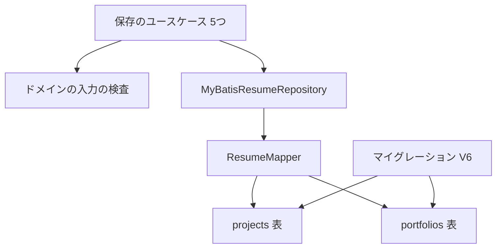
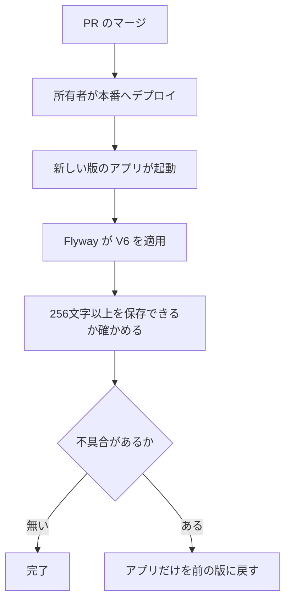

# 設計

## 概要

Claude は、Flyway のマイグレーション V6 を1つ足し、プロジェクトの「概要」「役割」とポートフォリオの「概要」を保存する3つの列の型を、`VARCHAR(255)` から `TEXT` に変える。利用者は、職務経歴書の編集画面でこの3つの欄に文章を書き、保存する。今は、入力の検査が1000文字までを認めているのに、保存先の列が255文字を超える文章をエラーにするので、256文字以上の文章が保存できない。

同じ1000文字の上限を持つ「成果」と「技術スタック」の列はすでに `TEXT` なので、Claude は3つの列もこの形に揃える。

あわせて、Claude は ER図(`doc/DB設計/ER図.pu`)の3つの列の型を `TEXT` に直し、設計図と保存先の形を揃える。

## 作るものと作らないもの

### 作るもの

- `projects.overview` `projects.role` `portfolios.overview` の3つの列の型を `TEXT` に変えるマイグレーション V6
- V5 の時点で保存した行の文章が、V6 を適用したあとも変わらないことを確かめるテスト
- 3つの欄に1000文字の文章を保存して読み出せることを確かめるテスト
- バックアップと、PDF と Markdown の出力の元になるデータに、3つの欄の1000文字の文章が欠けずに入ることを確かめるテスト
- ER図の3つの列の型の書き直し

### 作らないもの

- 入力の検査の変更。Claude は、上限の文字数(1000文字)と、1000文字を超えたときのエラーの文を変えない
- ほかの列の型の変更(会社名、プロジェクト名、チーム構成、ポートフォリオ名、リンクなど。どれも `VARCHAR(255)` のまま)
- 保存の経路(`MyBatisResumeRepository` と `ResumeMapper.xml`)と読み出しの経路(画面の表示、バックアップ、PDF と Markdown の出力)のコードの変更
- frontend の変更
- 保存先の列の型を `VARCHAR(255)` に戻すマイグレーション

## 使う既存の仕組み

- ドメイン層の入力の検査(`Project.validate` と `Portfolio.validate`): 3つの欄の上限の文字数を決める
- `ResumeRepository.save` から `MyBatisResumeRepository` を通る保存の経路: 5つの保存のしかた(足す・直す・自動保存・コピー・復元)は、どれもドメインのオブジェクトを作ってからこの経路で保存する。この経路は、職務経歴書のプロジェクトとポートフォリオを消してから `ResumeMapper.insertProject` と `ResumeMapper.insertPortfolio` で入れ直す。入れ直す SQL は列の型に依らないので、変えずに使う
- Flyway の起動時の適用(`application.yaml` の `spring.flyway.enabled: true`): Flyway は、アプリの起動時にこの仕組みで V6 を適用する
- テストの依存(`org.testcontainers:postgresql` `org.testcontainers:junit-jupiter` `flyway-core`): マイグレーションのテストで使う。`build.gradle` は変えない

## 設計を見直すきっかけ

- 3つの欄の上限の文字数を変えるとき。この設計では保存先に長さの歯止めが無いので、入力の検査だけを直せばよい。上限の決まりを保存先にも持たせると決めたときは、この設計の判断(`TEXT` にする)を見直す
- ドメインのオブジェクトを作らずに保存先へ書き込む経路を足すとき。その経路は入力の検査を通らないので、保存先に長さの歯止めが無いことの前提が崩れる
- アプリの Flyway の設定で `ignoreMigrationPatterns` を変えるとき。アプリだけを前の版に戻せるという「移行」の節の前提が崩れる

## プロジェクトの決まりを守っているか

- backend のコードを置く層: `src/main/java` のクラスは足さず、変えない。マイグレーションは `src/main/resources/db/migration` に置く。足すテストは `src/test/java` に置き、ArchUnit の検査(`BackendArchitectureTest` は `ImportOption.DoNotIncludeTests` でテストを外している)の対象にならない
- データベースの表の形: この設計はマイグレーション V6 を含む。expand-contract の段階の分け方は、移行の節の「段階」の欄に書く。このマイグレーションを含む PR は、所有者が承認するまでマージされない
- 品質チェックの設定: `.github/` `quality.gradle` などの品質チェックの設定ファイルは変えない
- 関係のない項目: frontend の機能ごとの境界、frontend の状態の持ち方、新しいライブラリの追加、使う外部の機能がこのリポジトリで使えるか

## 全体の構成



この設計で変えるのは、図の V6 と、V6 が変える2つの表の3つの列だけである。保存のユースケースは、ドメインの入力の検査を通ったオブジェクトだけをリポジトリに渡す。そのため、保存先の列が長さを止めなくても、1000文字を超える文章は保存先に届かない。Claude は、案の比較(`TEXT` と `VARCHAR(1000)`)と、PostgreSQL と Flyway の調べの結果を research.md に書いた。

**使う技術**:
- データの保存: PostgreSQL 17(本番は RDS の 17.4、開発は `postgres:17.11-alpine`、テストは `postgres:17.7-alpine`)
- マイグレーション: Flyway(`flyway-core` と `flyway-database-postgresql`。版は Spring Boot の BOM が管理する。BOM とは、依存のライブラリの版をまとめて決める一覧を指す)

## ファイルの構成

Claude が新しく作るファイル:

- `backend/src/main/resources/db/migration/V6__change_project_portfolio_text_columns_to_text.sql`: 3つの列の型を `TEXT` に変えるマイグレーション
- `backend/src/test/java/com/example/keirekipro/unit/infrastructure/migration/ProjectPortfolioTextColumnMigrationTest.java`: V5 の時点で入れた行の文章が、V6 を適用したあとも変わらないことを確かめるテスト

Claude が変えるファイル:

- `backend/src/test/java/com/example/keirekipro/unit/infrastructure/repository/resume/ResumeMapperTest.java`: `spring.flyway.target` を5から6に上げ、3つの欄に1000文字の文章を入れて読み出すテストを足す
- `backend/src/test/java/com/example/keirekipro/unit/infrastructure/query/resume/ResumeQueryMapperTest.java`: `spring.flyway.target` を1から6に上げ、3つの欄に1000文字の文章があるときにバックアップの JSON に同じ文章が入るテストを足す
- `backend/src/test/java/com/example/keirekipro/unit/infrastructure/export/resume/ResumeExportModelBuilderTest.java`: 3つの欄に1000文字の文章を持つ職務経歴書から、出力の元になるデータに同じ文章が入るテストを足す
- `doc/DB設計/ER図.pu`: プロジェクトの表の `overview` と `role`(L73・L75)と、ポートフォリオの表の `overview`(L139)の型を `TEXT` に書き直す

Claude が変えずに頼るファイル:

- `backend/src/main/java/com/example/keirekipro/domain/model/resume/Project.java` と `Portfolio.java`: 3つの欄の入力の検査
- `backend/src/main/resources/templates/resume/pdf/simple.html` と `backend/src/main/resources/templates/resume/markdown/default.md`: PDF と Markdown の出力のテンプレート
- `backend/src/main/java/com/example/keirekipro/infrastructure/query/resume/ResumeQueryMapper.xml` の `selectResumeForBackup`: バックアップの JSON を組み立てる SQL
- `backend/src/main/java/com/example/keirekipro/infrastructure/export/resume/ResumeExportModelBuilder.java`: PDF と Markdown の出力の元になるデータを組み立てる部品

## 部品

### V6__change_project_portfolio_text_columns_to_text.sql(3つの列の型を変えるマイグレーション)

対応する要件: 1.1, 1.2, 1.3, 1.4, 3.1

**役割**: このマイグレーションは、`projects.overview` `projects.role` `portfolios.overview` の型を `TEXT` に変える。`USING` を書かず、列の中身を変えない。NOT NULL の制約、列のコメント、ほかの列には触れない。Claude は、ファイルの頭に、V5 と同じ形で、何のための変更かを日本語の1行のコメントで書く。このマイグレーションの SQL は、次の2文である。

```sql
ALTER TABLE projects
    ALTER COLUMN overview TYPE TEXT,
    ALTER COLUMN role TYPE TEXT;

ALTER TABLE portfolios
    ALTER COLUMN overview TYPE TEXT;
```

**いつ動くか**: アプリの起動時に、Flyway が未適用のマイグレーションとして1回だけ適用する。同じ版を2回適用することは無い。

**失敗したとき**: 型の変更が失敗したら、Flyway は V6 を失敗として記録し、アプリの起動を止める。Flyway は PostgreSQL では1つのマイグレーションを1つのトランザクションで流し、PostgreSQL は型の変更もトランザクションの中で取り消せる。そのため、片方の表だけが変わった状態は残らない。

### ProjectPortfolioTextColumnMigrationTest(V5 から V6 へ進めても文章が変わらないことを確かめるテスト)

対応する要件: 3.1

**役割**: このテストは、Testcontainers で PostgreSQL のコンテナ(`postgres:17.7-alpine`。`PostgresTestContainerConfig` と同じイメージ)を1つ立て、Flyway の API でマイグレーションを版ごとに進める。このテストは、Spring の文脈を使わない。Spring の文脈とは、Spring がアプリの部品を組み立てて起動した状態を指す。

**呼び出し方**: テストは、次の順で動く。
1. `Flyway.configure().dataSource(<コンテナの URL・利用者・パスワード>).locations("classpath:db/migration").target("5").load().migrate()` で V5 まで進める
2. JDBC で、利用者、職務経歴書、プロジェクト、ポートフォリオの行を1つずつ入れる。プロジェクトの `overview` と `role`、ポートフォリオの `overview` には、日本語と英数字を混ぜた255文字の文章を入れる
3. `target("6")` で V6 まで進める
4. 3つの列の文章を読み直し、2で入れた文章と1文字も違わないことを確かめる。あわせて、`information_schema.columns` の `data_type` が3つの列とも `text` であることを確かめる

### ResumeMapperTest(1000文字の文章を保存して読み出せることを確かめるテスト)

対応する要件: 1.1, 1.2, 1.3, 1.4

**役割**: このテストは、`spring.flyway.target` を6にして、V6 を適用した保存先で `ResumeMapper` の書き込みと読み出しを確かめる。Claude は、足すテストの中身を「テストの方針」の節に書く。Claude は、既存のテストを、target を上げる以外に変えない。

### ResumeQueryMapperTest(バックアップの JSON に1000文字の文章が入ることを確かめるテスト)

対応する要件: 1.5

**役割**: このテストは、`spring.flyway.target` を1から6に上げ、V6 を適用した保存先で `ResumeQueryMapper.selectResumeForBackup` が組み立てるバックアップの JSON を確かめる。Claude は、既存のテストを、target を上げる以外に変えない。V2 から V5 は、マスタのデータの追加と変更、`user_token_versions` の表の追加、`portfolios.tech_stack` の NOT NULL の解除であり、このテストが入れるデータとぶつからない。既存のテストが target を上げて失敗したときは、Claude はアサーションを直さず、原因を所有者に報告する。

### ResumeExportModelBuilderTest(PDF と Markdown の出力の元になるデータに1000文字の文章が入ることを確かめるテスト)

対応する要件: 1.5

**役割**: このテストは、3つの欄に1000文字の文章を持つ `Resume` を `ResumeExportModelBuilder.build` に渡し、返るデータのプロジェクトの `overview` `role` とポートフォリオの `overview` が、渡した文章と1文字も違わないことを確かめる。PDF と Markdown のテンプレート(`simple.html` の `th:text` と `default.md` の `[[...]]`)は、このデータの値をそのまま書き出すので、Claude は出力のファイルの中身を読むテストを足さない。

### 入力の検査と読み出しの経路(既存の部品。この設計では変えない)

対応する要件: 1.5, 2.1

**役割**: `Project.validate` と `Portfolio.validate` は、今までどおり1000文字を超える文章をエラーにする。画面の表示、バックアップの JSON を組み立てる SQL(`ResumeQueryMapper.xml` の `selectResumeForBackup`)、PDF と Markdown の出力の元になるデータを組み立てる `ResumeExportModelBuilder` と、そのテンプレート(`simple.html` と `default.md`)は、3つの列の文章をそのまま読み出し、長さで切り詰めない。どちらも列の型に依らないので、Claude はこれらの部品を変えない。

## テストの方針

- 単体テスト: 足さない。1000文字を超える文章をエラーにすることは、既存の `ProjectTest`(`overview` と `role` を1001文字にした場合)と `PortfolioTest`(`overview` を1001文字にした場合)が確かめていて、Claude はそのテストを変えない(要件2の受入基準1)
- 結合テスト(マイグレーション): `ProjectPortfolioTextColumnMigrationTest` で確かめる。Claude は、確かめる中身を部品の節に書く(要件3の受入基準1)
- 結合テスト(保存と読み出し): `ResumeMapperTest` に次の2つを足す。
  - テストは、`insertProject` で `overview` と `role` に1000文字の文章(`"あ".repeat(1000)` のような多バイトの文字)を入れ、`selectProjectsByResumeId` で同じ文章が返ることを確かめる(要件1の受入基準1・2)
  - テストは、`insertPortfolio` で `overview` に1000文字の文章を入れ、`selectPortfoliosByResumeId` で同じ文章が返ることを確かめる(要件1の受入基準3)
  - 5つの保存のしかたは、どれも `insertProject` と `insertPortfolio` で書き込むので、Claude は、この2つのテストで5つの保存のしかたの保存先を確かめる(要件1の受入基準4)
- 結合テスト(バックアップ): `ResumeQueryMapperTest` に、3つの欄に1000文字の文章を入れた職務経歴書について、`selectResumeForBackup` の JSON の `projects[0].overview` `projects[0].role` `portfolios[0].overview` が同じ文章になるテストを足す(要件1の受入基準5のうちバックアップ)
- 単体テスト(出力の元になるデータ): `ResumeExportModelBuilderTest` にテストを足す。Claude は、確かめる中身を部品の節に書く(要件1の受入基準5のうち PDF と Markdown)
- 画面を通しで操作するテスト: `/verify-ui` で、Claude は画面確認の開発サーバの画面を操作する。Claude は、3つの欄に1000文字の文章を入れて保存し、画面を開き直して同じ文章が出ることを確かめる(要件1の受入基準5のうち画面の表示)。続けて、Claude は、3つの欄のどれかに1001文字の文章を入れて保存し、今と同じエラーの文が出て保存されないことを確かめる(要件2の受入基準1)。Claude は、バックアップと出力のファイルの中身を画面の操作では確かめない。画面の操作に使うブラウザは別のコンテナで動き、保存したファイルが Claude の手元に届かないためである

## 移行



- 段階: V6 は1段で終わる。V6 は型を広げるだけで、古い形を消す段階(contract)に当たる変更は無く、新しい形を足して古い形も使える段階(expand)の1段で終わる。型を広げる変更なので、古い版のアプリも `TEXT` の列に文字列を読み書きできる。ECS のタスクを入れ替える間に古い版と新しい版のアプリが同時に動いても、どちらの版も動く
- 適用の時間: `VARCHAR` から `TEXT` への変更は表を書き直さないので、`ACCESS EXCLUSIVE` のロックを持つ時間は型の情報を書き換える間だけになる。`ACCESS EXCLUSIVE` のロックとは、ほかの処理がその表を読むことも書くこともできなくなるロックを指す。ロックを持つ時間は、表の行の数に依らない
- 元に戻す条件: 新しい版のアプリに不具合があったときは、所有者がアプリだけを前の版に戻す。保存先の型は戻さない。256文字以上の文章が保存されたあとでは、`VARCHAR(255)` に戻せないためである。前の版のアプリには V6 が無いが、Flyway は既定で、データベースに適用済みで手元に無い新しい版を `future` として無視するので、前の版のアプリは起動する(`application.yaml` は `ignoreMigrationPatterns` を変えていない)
- 確かめる点: 所有者がマージの前に、手元のデータベースで V6 を適用し、既存の職務経歴書が開けることと、3つの欄に256文字以上を保存できることを確かめる(マイグレーションを含む PR の承認のときに行う確認)
