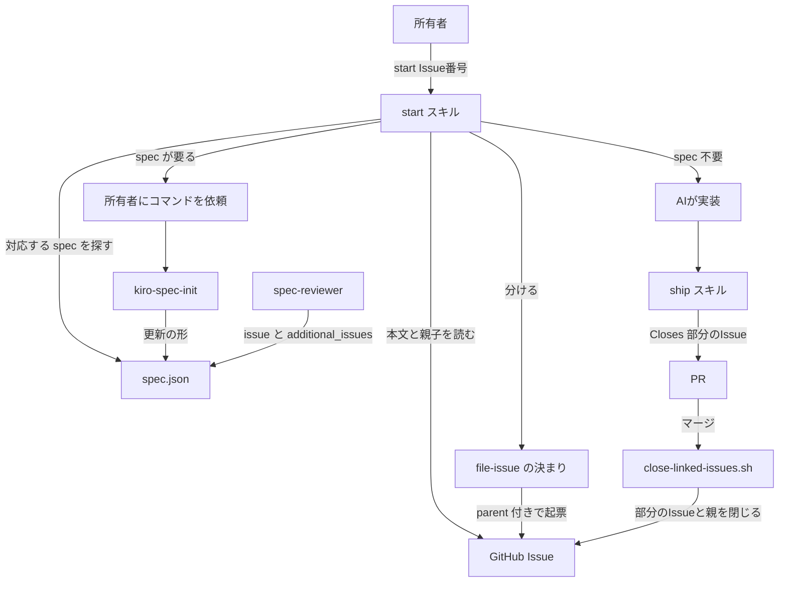
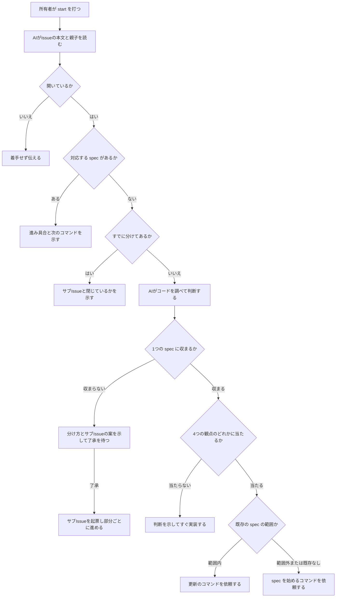
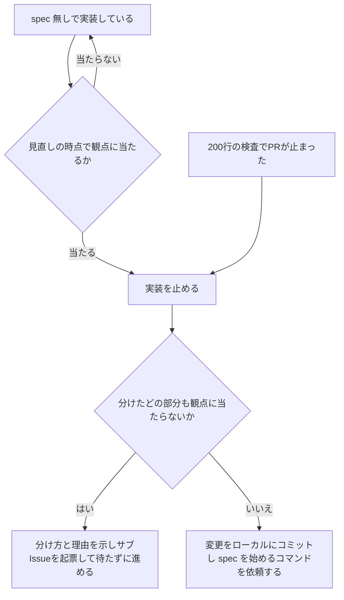
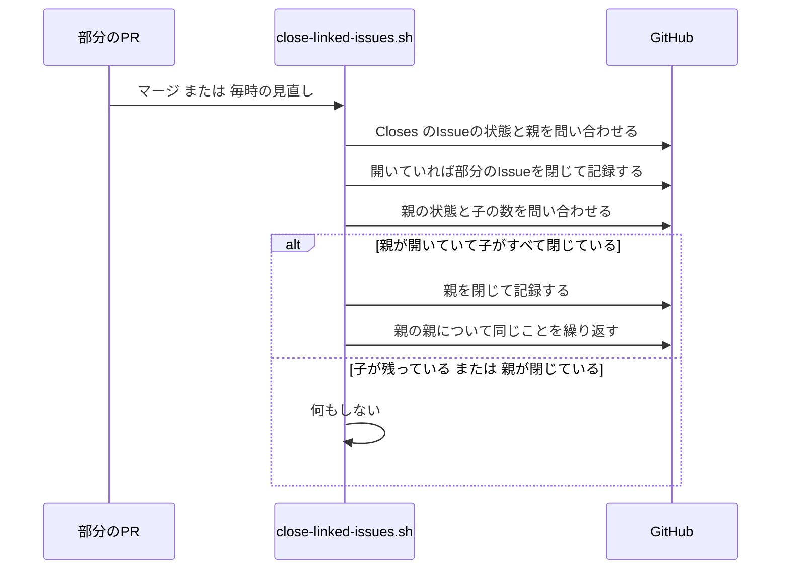

# Design Document

## Overview

**Purpose**: 所有者がIssueに着手させるときにすることを、`/start #<Issue番号>` の1つにする。AIはその時点のコードを調べて進め方を決め、判断と理由を所有者に示す。所有者は spec が要るかどうかを判断しなくてよくなる。

**Users**: 所有者は、Issueに着手させたいときに `/start` を打つ。AIは、着手から出荷までの手順と、途中で見立てが外れたときの手順に従う。

**Impact**: 今は、起票の直後にだけAIが spec の要否を案内しており(`file-issue/SKILL.md` Step 6)、着手の時点では誰も判断しない。本設計は、判断を着手の時点に移し、判断の基準を行数から変更の種類と不確かさに変える。あわせて、1つのIssueを分けて進める道と、既存の spec を別のIssueのために直す道を、既存の出荷手順・自動レビュー・Issueのクローズの仕組みと食い違わない形で用意する。

### Goals
- 所有者が着手時にすることを `/start #<Issue番号>` だけにする
- AIが4つの観点で spec の要否を判断し、観点ごとの根拠を所有者に示す
- spec が要らないときは、AIが所有者の返事を待たずに実装と出荷まで進める
- Issueを分けたときは、分けた部分ごとにサブIssueを作り、全部が閉じたら親のIssueを仕組みが閉じる
- 既存の spec を直すときは、どの部分がどのIssueのためのものかを見分けられ、取り消した承認の記録が残る

### Non-Goals
- 200行の検査(`guardrails.yaml` の size-check と `check-spec-backing.sh`)の変更
- 3段階の承認の変更、段階を省く軽い spec
- codex-review の判定のしかたの変更(`codex-review.yml` は変えない)
- spec 無しのPRがIssue本文の「決めた方式」から外れたときに止める仕組み(#473)
- `/request` の聞き取りの中身
- kiro-discovery の利用(使わない決まりのまま残す)

## Boundary Commitments

### This Spec Owns
- 着手の手順(`/start` スキル): Issueの読み取り、進め方の判断、判断の示し方、判断ごとの進み方、途中で見立てが外れたときの扱い
- 4つの観点の定義(何なら当たり、何なら当たらないか)
- サブIssueの作り方と、親のIssueを閉じる処理(close-linked-issues.sh への追加)
- 既存の spec を更新するときの始め方(kiro-spec-init の更新の形)、spec.json の `additional_issues` と `approval_history`、要件・設計・タスクに付けるIssueの印
- 更新した spec の審査の基準(spec-reviewer が読むIssue)
- spec の各段階のコマンドを、AIが自分から起動できないようにすること
- CLAUDE.md、README、起票の決まり、出荷手順、spec の審査の手順、監査手順の、この進め方に関わる記述

### Out of Boundary
- 200行の検査の上限・数え方・判定
- codex-review の判定の基準の選び方と、判定の文面
- auto-merge の予約(`auto-merge.yaml`)
- kiro-spec-requirements / -design / -tasks / kiro-impl の生成の手順そのもの。例外は、4つのスキルの冒頭に `disable-model-invocation: true` を足すことと、kiro-spec-requirements に更新のときの書き足しの決まり(既存の要件と番号を残す)を2行足すことだけである
- PRのマージ以外で閉じたサブIssueからの、親のクローズ
- kiro-spec-quick と kiro-spec-batch の手直し(使われていないため。kiro-spec-quick が呼び出しに失敗するようになることは受け入れる)

### Allowed Dependencies
- GitHub のサブIssue(`gh issue create --parent`、`gh issue view --json parent,subIssues,subIssuesSummary`、GraphQL の `parent` と `subIssuesSummary`)
- 既存の出荷手順(`/ship`)、起票の決まり(`file-issue`)、spec の審査(`/spec-review`、`spec-reviewer`)
- 既存の close-linked-issues の仕組み(`github.token`、`issues: write`、`lib-notice-comment.sh` の `notice_post`)
- Claude Code のスキルの `disable-model-invocation` と `$ARGUMENTS`

### Revalidation Triggers
- spec.json の `issue` `additional_issues` `approval_history` の形を変えたとき(spec-reviewer、kiro-spec-init、`/start` が読む)
- close-linked-issues.sh の ISSUE_QUERY の形を変えたとき(テストの偽の `gh` の振り分けが壊れる)
- codex-review の判定の基準の選び方を変えたとき(分けた部分のPRと更新した spec のPRの扱いが変わる)
- 4つの観点の定義を変えたとき(`/start`、CLAUDE.md、README の3か所が同じ内容である必要がある)

## KeirekiPro Compliance Check (必須)

- [x] **backend層配置**: N/A。backend を変更しない
- [x] **frontend境界**: N/A。frontend を変更しない
- [x] **状態管理**: N/A。アプリの状態を扱わない
- [x] **DBスキーマ**: N/A。マイグレーションを含まない
- [x] **依存追加**: 新しいライブラリは追加しない
- [ ] **ゲート設定**: `.claude/` と `.github/` の変更を必要とする。CLAUDE.md の決まりにより、これらの変更は所有者への提案として扱い、所有者の承認を経て反映する。`.github/scripts/close-linked-issues.sh` とそのテストは CODEOWNERS の対象で、PRは所有者の承認までマージされない。`.github/workflows/` のワークフローは変えない
- [x] **前提機能の利用可否**: GitHub のサブIssueは、このリポジトリ(`owner.type` が User、公開)で使える。2025-04-09 に一般提供され、有効にする設定は無い。`gh api repos/DogisRiki/KeirekiPro/issues/472` が `sub_issues_summary` と `parent` を返すこと、gh 2.97.0 が `gh issue create --parent` を持つことを実測した。子がすべて閉じても親は自動で閉じないことを確認し、閉じる処理を本設計に含めた

## Architecture

### Existing Architecture Analysis
- 所有者が打つコマンドは `/request`(要望の壁打ち)と `/kiro-spec-*` / `/kiro-impl`(spec の各段階)である。spec を作らない変更に、所有者が打つコマンドは無い(README L332-341)
- spec の要否の案内は、起票の直後に `file-issue/SKILL.md` Step 6(L104-107)が行う。基準は「新機能・複数の層・200行超の見込み」
- 1つのPRは1つのIssueに対応する前提で、出荷手順は `Closes #<番号>` を例外なく求め(`ship/SKILL.md` L41)、close-linked-issues は `Closes` のIssueを閉じ、`Refs:` だけのIssueには所有者に知らせる
- spec.json の `issue` は番号1つで、spec-reviewer はその本文を審査の基準にする

### Architecture Pattern & Boundary Map



**Architecture Integration**:
- Selected pattern: 手順は1つのスキル(`start`)にまとめ、既存のスキルとワークフローには、そのスキルが必要とする最小の変更だけを入れる
- Domain/feature boundaries: 判断と進め方は `start` だけが持つ。Issueの起票の書式は `file-issue`、PRの書式は `ship`、閉じる処理は close-linked-issues、spec の生成は kiro-spec-* が持つ
- Existing patterns preserved: 所有者がコマンドを打つことが同意になる。PR本文に `Closes` と `Refs:` を書く。Issueは本文だけにし、コメントを要望として読まない。仕組みが閉じられなかったときはメンション付きのコメントで知らせる
- New components rationale: `start` は、要件1.1 の「操作を1つにする」を満たすために要る。kiro-discovery を使わない理由は research.md に書いた(spec 不要でも止まる作り、brief.md が判定の基準に混ざる、サブIssueと途中の扱いが無い)
- Steering compliance: steering の product.md は開発の進め方を書かない決まりである。本設計は steering を変えない

### Technology Stack

| Layer | Choice / Version | Role in Feature | Notes |
|-------|------------------|-----------------|-------|
| AIの手順 | Claude Code のスキル(SKILL.md) | 着手の手順、起票・出荷・審査の手順の変更 | 新しい依存は無い |
| GitHub 操作 | gh 2.97.0、GitHub のサブIssue | サブIssueの作成、親子の読み取り | `--parent` を使う |
| CI | bash、gh、GraphQL(既存の close-linked-issues) | 親のIssueを閉じる | ワークフローの定義は変えない |

## File Structure Plan

### Directory Structure
```
.claude/
└── skills/
    └── start/
        └── SKILL.md        # 着手の手順。判断・示し方・進み方・途中の扱い・4つの観点の定義
```

### Modified Files
- `.claude/skills/kiro-spec-init/SKILL.md` — 冒頭に `disable-model-invocation: true` を足す。2つ目の引数に既存の feature 名があるときの「更新の形」の手順を足す(5.5、5.9)
- `.claude/skills/kiro-spec-requirements/SKILL.md` — 冒頭に `disable-model-invocation: true` を足す(5.3)。spec.json に `additional_issues` があるときは、既存の要件と受入基準を番号ごと残し、新しい要件を末尾の番号で足し、CLAUDE.md の印の決まりに従う、という2行を生成の手順に足す(5.8)。design と tasks のスキルには既存の文書を参照する手順(merge)がすでにあるため、足さない
- `.claude/skills/kiro-spec-design/SKILL.md` — 同上
- `.claude/skills/kiro-spec-tasks/SKILL.md` — 同上
- `.claude/skills/file-issue/SKILL.md` — Step 6 を `/start` の案内に置き換える(1.7)。分けた部分のIssue(サブIssue)の起票の節と、了承を得ずに起票する例外を足す(9.1〜9.3、10.5)
- `.claude/skills/ship/SKILL.md` — サブIssueのPRで `Closes` と `Refs:` に書く番号、更新した spec のPRの本文に書く範囲の説明、spec 無しのPRが200行の検査で止まったときに `start` の手順へ戻ることを足す(7.7、9.4)
- `.claude/skills/spec-review/SKILL.md` — Step 6 の承認の取り消しで、取り消す前に `approval_history` に写す手順を足す(10.7)
- `.claude/skills/spec-review/rules/requirements.md` — 更新した spec では、元のIssueと追加のIssueの両方を基準にし、印を使って取りこぼしと勝手な追加を判定する観点を足す(5.7)
- `.claude/agents/spec-reviewer.md` — spec.json の `additional_issues` の番号の本文も読む(5.7)
- `.github/scripts/close-linked-issues.sh` — ISSUE_QUERY に `parent` と `subIssuesSummary` を足し、書き込みの後に親を閉じる処理を足す。冒頭の判定表に親の行を足す(9.5、9.6)
- `.github/scripts/tests/test-close-linked-issues.sh` — 親を閉じる処理のテストを足す。偽の `gh` の Issue の応答に `parent` と `subIssuesSummary` を持たせる
- `CLAUDE.md` — 着手の入口、4つの観点、200行の検査の位置づけ、spec で進めている途中の扱い、更新するときの印、承認の取り消しの履歴、サブIssueのPRの `Closes` の決まりを書く(8.1、8.2、10.1、10.2、10.7)
- `README.md` — 人間が打つコマンドの表、進め方の図、開発の進め方の表、スキルの表、close-linked-issues の行を直す(10.1〜10.3)
- `doc/開発フロー/監査手順.md` — 親のIssueを閉じられなかったときの知らせと対処の行を足す(9.6)

## System Flows

### 着手の流れ



- 「収まらない」の判断は spec が要るときだけ行う。spec が要らない変更は1つのPRで進め、大きすぎると分かったときは途中の扱い(要件7)で分ける
- 既存の spec に関わるが、4つの観点のどれにも当たらない変更は、spec 無しで直す(5.6)

### spec 無しの実装の途中で見立てが外れたとき



### 親のIssueを閉じる



## Requirements Traceability

| Requirement | Summary | Components | Interfaces | Flows |
|-------------|---------|------------|------------|-------|
| 1.1 | 操作を1つにする | start | `/start #N` | 着手の流れ |
| 1.2 | 本文とコードを調べて決める | start | IssueReader、判断の手順 | 着手の流れ |
| 1.3 | コメントを要望にしない | start | IssueReader(取得する欄を限る) | - |
| 1.4 | 無い・閉じたIssue | start | IssueReader | 着手の流れ |
| 1.5 | spec が既にある | start | SpecLocator | 着手の流れ |
| 1.6 | 既に分けてある | start | IssueReader(subIssues) | 着手の流れ |
| 1.7 | 起票後の案内 | file-issue | Step 6 | - |
| 2.1–2.4 | 4つの観点と判断 | start | 観点の定義 | 着手の流れ |
| 3.1–3.3 | 判断の示し方 | start | 判断の報告の書式 | - |
| 4.1, 4.2 | spec 不要のとき | start、ship | 実装と出荷 | 着手の流れ |
| 5.1–5.3 | spec が要るとき | start、kiro-spec-* | コマンドの依頼、`disable-model-invocation` | 着手の流れ |
| 5.4–5.6 | 既存の spec との関係 | start | 範囲の判定 | 着手の流れ |
| 5.7 | 更新の審査の基準 | spec-reviewer、spec-review rules | `additional_issues` | - |
| 5.8 | Issueの印 | CLAUDE.md、kiro-spec-init、kiro-spec-requirements | 印の決まり | - |
| 5.9 | 取り消した承認の記録 | kiro-spec-init、spec-review | `approval_history` | - |
| 6.1–6.4 | 1つの spec に収まらない | start、file-issue | 分割の提案の書式 | 着手の流れ |
| 7.1–7.7 | spec 無しの途中で要ると分かった | start、ship | 見直しの時点、切り替えと分割の手順 | 途中の流れ |
| 8.1, 8.2 | spec の途中で小さいと分かった | CLAUDE.md、start | 決まり | - |
| 9.1–9.4 | サブIssue | start、file-issue、ship | サブIssueの書式、`--parent` | 着手の流れ、途中の流れ |
| 9.5, 9.6 | 親を開いたまま・全部閉じたら閉じる | close-linked-issues.sh | ParentCloser | 親のIssueを閉じる |
| 10.1–10.3 | CLAUDE.md と README | CLAUDE.md、README | - | - |
| 10.4, 10.5 | 起票の決まり | file-issue | - | - |
| 10.6 | 審査の手順 | spec-review rules、spec-reviewer | - | - |
| 10.7 | 取り消しの決まり | CLAUDE.md、spec-review | `approval_history` | - |

## Components and Interfaces

| Component | Domain/Layer | Intent | Req Coverage | Key Dependencies (P0/P1) | Contracts |
|-----------|--------------|--------|--------------|--------------------------|-----------|
| start | AIの手順 | 着手の判断と進め方 | 1.1–1.6, 2, 3, 4, 5.1–5.6, 6, 7, 8.2, 9.1–9.4 | gh(P0)、file-issue(P0)、ship(P0) | Service, State |
| kiro-spec-init の更新の形 | AIの手順 | 既存の spec を新しいIssueのために開き直す | 5.5, 5.8, 5.9 | spec.json(P0) | Service, State |
| file-issue の変更 | AIの手順 | 起票後の案内とサブIssueの起票 | 1.7, 9.1–9.3, 10.4, 10.5 | gh(P0) | Service |
| ship の変更 | AIの手順 | 部分のPRと更新した spec のPRの本文、200行の検査で止まったとき | 7.7, 9.4 | start(P1) | Service |
| spec の審査の変更 | AIの手順 | 更新した spec の基準と取り消しの履歴 | 5.7, 5.9, 10.6, 10.7 | spec.json(P0) | Service |
| ParentCloser | CI | 子がすべて閉じた親を閉じる | 9.5, 9.6 | GitHub GraphQL(P0)、notice_post(P1) | Batch |
| 文書の変更 | 文書 | CLAUDE.md、README、監査手順 | 8.1, 10.1–10.3, 10.7 | - | - |

### AIの手順

#### start

| Field | Detail |
|-------|--------|
| Intent | 所有者が打った `/start #N` を受けて、Issueを読み、進め方を決めて示し、決めた進め方で進める |
| Requirements | 1.1, 1.2, 1.3, 1.4, 1.5, 1.6, 2.1, 2.2, 2.3, 2.4, 3.1, 3.2, 3.3, 4.1, 4.2, 5.1, 5.2, 5.3, 5.4, 5.5, 5.6, 6.1, 6.2, 6.3, 6.4, 7.1, 7.2, 7.3, 7.4, 7.5, 7.6, 7.7, 8.2, 9.1, 9.2, 9.3, 9.4 |

**Responsibilities & Constraints**
- フロントマター: `name: start`、`argument-hint: <#Issue番号>`。`disable-model-invocation` は付けない(所有者が「#N をやって」と言葉で頼んだときも、AIがこの手順に入るため)。説明文に「Issueへの着手を頼まれたら必ず使う」と書く
- 引数が無い、または番号が読めないときは、番号を尋ねる
- 判断と進め方を決めるのはこのスキルだけである。ほかのスキルは、このスキルが決めた進め方に従って呼ばれる
- spec の各段階のコマンドを自分で起動しない(5.3)。起動しようとしても、`disable-model-invocation` により起動できない

**手順(Service Interface にあたる)**

1. **Issueを読む**(1.2、1.3、1.4): `gh issue view <N> --json number,title,body,state,parent,subIssues,subIssuesSummary` を実行する。`comments` は取得しない。`--comments` を付けない。番号のIssueが無いとき、または `state` が `CLOSED` のときは、着手せずにその旨を伝えて終える
2. **対応する spec を探す**(1.5): `.kiro/specs/*/spec.json` のうち、`issue` が N のもの、または `additional_issues` に N を含むものを探す。見つかったら、進み具合と次に所有者が打つコマンドを示して終える。次のコマンドは次の表で決める

   | spec.json の状態 | 示すこと |
   |---|---|
   | `phase` が `initialized` | `/kiro-spec-requirements <feature>` |
   | requirements が生成済みで未承認 | 要件の審査の記録を読んで承認するなら `/kiro-spec-design <feature>` |
   | design が生成済みで未承認 | 同じく `/kiro-spec-tasks <feature>` |
   | tasks が生成済みで未承認(`approvals.tasks.approved` が false) | タスクの審査の記録を読んで承認するなら `/kiro-impl <feature>` |
   | tasks が承認済みで、tasks.md に未完了のタスク(`- [ ]`)がある | `/kiro-impl <feature>` |
   | tasks が承認済みで、tasks.md のタスクがすべて完了(`- [x]`) | 出荷の状況(開いているPRの番号)。AIが `/ship` で進める |

3. **分けてあるかを見る**(1.6): `subIssuesSummary.total` が1以上なら、サブIssueの番号・題名・開いているか閉じているかを一覧で示して終える。分け方は決め直さない。サブIssueに着手するときは `/start #<サブIssueの番号>` を打つよう案内する
4. **コードを調べる**(1.2): Issueの本文に関わるコード・文書・ワークフローを読む。広く探すときは Explore のサブエージェントに任せてよい
5. **判断する**(2.1〜2.4、5.4、6.1): 4つの観点(下の「観点の定義」)を1つずつ当てはめる。1つでも当たれば spec が要る。どれにも当たらなければ要らない。行数の見込みは判断に使わない。spec が要るときは、続けて次を決める
   - 1つの spec に収まるか: Issueの中に、互いに関係なく別々に出荷できる関心事が2つ以上あり、それぞれが spec の要る大きさなら「収まらない」
   - 既存の spec の範囲か: 変更する動きが、既存の spec の design.md の「This Spec Owns」に書かれた範囲に入るなら「更新」、入らなければ「新しい spec」
6. **判断を示す**(3.1〜3.3): 下の「判断の報告の書式」で示す
7. **判断ごとに進む**
   - spec 不要(4.1): 報告を出したら、返事を待たずに実装を始める。ブランチを作り、実装し、該当の verify を通し、`/ship` で出荷する。実装の途中は「見直しの時点」(下記)で観点を当て直す
   - 新しい spec(5.1、5.2): `/kiro-spec-init #N` を打つよう依頼して終える。実装は始めない
   - 既存の spec の更新(5.5): `/kiro-spec-init #N <feature>` を打つよう依頼し、取り消される承認(要件・設計・タスクのうち承認済みのもの)を示して終える
   - 既存の spec に関わるが spec 不要(5.6): spec 不要と同じく進める
   - 1つの spec に収まらない(6.1〜6.4): 分け方、部分ごとの進め方(spec の要否)、理由、部分ごとのサブIssueの題名と本文の案を示して止まる。所有者が了承したら、file-issue の「分けた部分のIssue」の手順でサブIssueを起票する。修正を求められたら、直した案を示して改めて待つ。起票したあとは、部分ごとに進める(下の「分けたあとの進め方」)
8. **所有者が止めたとき**(4.2): 実装を止め、所有者の指示に従って進め方を決め直す。それまでの変更は、7.3 と同じくローカルにコミットして残す

**観点の定義**(2.1。CLAUDE.md と README にも同じ4つを載せる)

| 観点 | 当たる | 当たらない |
|---|---|---|
| 1. 新しい機能か | 今は無い機能や動きを足す(画面・API・ワークフロー・手順の新設など) | 今ある機能を本来の動きに直す。今ある動きを意図して変えるだけの変更は、この観点では当たらないとし、観点2と3で判断する |
| 2. 作り方を選ぶ必要があるか | 作り方が複数考えられ、どれを選ぶかで出来上がるものや後からの直しやすさが変わる | 作り方がほぼ1つに決まる |
| 3. Issueの本文だけで完成の形が決まらないか | 所有者が決めていない動き(失敗したときにどうするか、誰に何が届くか など)を、AIが補わないと作れない | Issueの本文で、完成したときの動きが決まる |
| 4. マージを取り消しても元に戻らないか | 保存されているデータの形を変える・消す(DBのマイグレーションなど)、外部に何かを送る、本番の設定を変える | PRを取り消せば元の状態に戻る |

観点4の名前は、requirements の「PRを差し戻しても元に戻らないか」と同じ意味である。文書では、審査で送り返す意味の「差し戻す」と取り違えないよう「マージを取り消しても」と書く。

**判断の報告の書式**(3.1〜3.3)

```markdown
## してほしいこと
<次のどれか1つ>
- 何もしなくて大丈夫です。このまま実装を始めます。判断がおかしいと思ったら止めてください
- 次のコマンドを打ってください: `<コマンド>`
- 下の分け方を見て、よければ了承してください

## 判断: <spec を作らずに実装する | 新しい spec を作る | spec <feature> を直す | Issueを分ける>

## 理由
| 観点 | 当たるか | 根拠 |
|---|---|---|
| 新しい機能か | 当たる/当たらない | <Issue本文の見出し、またはファイルと行> |
| 作り方を選ぶ必要があるか | ... | ... |
| Issueの本文だけで完成の形が決まらないか | ... | ... |
| マージを取り消しても元に戻らないか | ... | ... |
```

- 根拠には、調べたファイルと行、またはIssue本文の見出しを書く(3.2)
- 「してほしいこと」を最初に置く(3.3)。専門用語を使わず、主語(所有者・AI)を立てた文で書く
- 更新のときは、取り消される承認の段階を「してほしいこと」に添える(5.5)

**見直しの時点**(7.1): spec 無しで実装している間、AIは次の時点で4つの観点を当て直す
- 作り方の方針を決めたとき、または変えたとき
- Issueの本文に書かれていない動きを決める必要が出たとき
- 保存されているデータ、外部への送信、本番の設定に触れる変更を書こうとしたとき
- `/ship` を始める前

**途中で見立てが外れたとき**(7.1〜7.7)
1. いずれかの観点に当たると分かったら、その時点で実装を止める(7.1)
2. 変更を部分に分け、どの部分も4つの観点のどれにも当たらないなら「小さく分ける」、そうでなければ「spec に切り替える」と決め、理由を添えて示す(7.2、7.6)
3. spec に切り替える(7.3): それまでの変更をいまのブランチにコミットし、push しない。ブランチ名を示し、`/kiro-spec-init #N` を打つよう依頼する。spec の実装の段階(`/kiro-impl`)に入るまで実装を再開しない。残した変更を使うかは tasks で決める
4. 小さく分ける(7.4、7.5): 分け方と理由を示し、返事を待たずに file-issue の「分けた部分のIssue」の手順でサブIssueを起票する。本文は元のIssueの本文からの抜き出しだけで作る。いまのブランチの変更は最初の部分に当たるものだけを残し、ほかの部分の変更は取り除く。そのあと「分けたあとの進め方」で進める
5. 200行の検査でPRが止まった(7.7): 1と同じく止める。spec に切り替えるときは、PRを閉じてブランチを残し、3に進む。小さく分けるときは、PRを閉じ、4に進む(部分ごとに新しいブランチとPRを作る)

**分けたあとの進め方**(6.4、9.4)
- AIは、同じ会話の中で、spec の要らない部分を1つずつ進める。部分ごとにブランチとPRを分け、PRはその部分のサブIssueを対象にする
- spec が要る部分は、`/kiro-spec-init #<サブIssueの番号>` を打つよう依頼する
- 会話が途切れたときは、所有者がサブIssueごとに `/start #<サブIssueの番号>` を打てば続きから進む(手順の2と3が進み具合を示す)

**spec で進めている途中**(8.2): spec が承認・実装されている途中で小さい変更だと分かっても、spec 無しへの切り替えを提案しない。決まりは CLAUDE.md に書く(8.1)

**State Management**
- 状態を自分では持たない。進み具合は GitHub のIssue(親子・開閉)と spec.json から毎回読み直す

**Implementation Notes**
- Integration: サブIssueの番号は `gh issue create` の出力のURLから取る
- Validation: スキルは文書なので自動テストを持たない。PR本文に、出荷後に実際のIssueで `/start` を試す手順を書く
- Risks: AIが観点を甘く判断する。根拠を示させることと、見直しの時点と、200行の検査で拾う

#### kiro-spec-init の更新の形

| Field | Detail |
|-------|--------|
| Intent | 既存の spec を、新しいIssueのために開き直す |
| Requirements | 5.5, 5.8, 5.9 |

**Responsibilities & Constraints**
- フロントマターに `disable-model-invocation: true` を足す(5.3)
- 引数が `#<N> <feature>` で、`.kiro/specs/<feature>/spec.json` があるときに更新の形で動く。feature が無ければ誤りとして伝え、何も書かない
- N がすでに `issue` または `additional_issues` にあるときは、何も書かずに進み具合を伝える

**手順**
1. `gh issue view <N> --json number,title,body,state` で新しいIssueを読む(コメントは読まない)
2. spec.json の各段階について、`approved` が true のものを `approval_history` に写す
3. 各段階を `generated: false`、`approved: false` にし、`approved_by` と `approved_at` を消す。`phase` を `initialized` にする。`ready_for_implementation` には触れない(このキーを true に戻す手順がどのスキルにも無く、false にすると再承認の後も200行の検査(`check-spec-backing.sh` L74-78)で止まるため。実装の可否は3段階の承認で判定される)
4. `additional_issues` に N を足す(無ければ作る)
5. requirements.md の「Project Description (Input)」の最後に、`### 追加の要望(Issue #N)` の見出しで、新しいIssueの題名と本文を足す
6. 次に打つコマンド `/kiro-spec-requirements <feature>` を示す

**State Management**: spec.json に足すキー

```json
{
  "additional_issues": [480],
  "approval_history": [
    {
      "stage": "requirements",
      "approved_by": "DogisRiki",
      "approved_at": "2026-10-02T01:00:00Z",
      "issues": [472],
      "revoked_at": "2026-10-20T03:00:00Z",
      "revoked_for": "Issue #480 のための更新"
    }
  ]
}
```

- `issue`(元のIssue)は変えない。`issues` には、その承認のときに spec が対象にしていたIssue(`issue` と、その時点の `additional_issues`)を入れる
- `approval_history` は追記だけにし、書いた要素を書き換えない
- 既存の読み手(check-spec-backing.sh、spec-review-scan.sh)はこれらのキーを読まず、キーの一覧で検査もしないため影響しない

**Issueの印**(5.8。CLAUDE.md に決まりとして書き、kiro-spec-requirements / -design / -tasks の生成はこの決まりに従う)
- 追加のIssueのために足した要件・受入基準・設計の節・タスクの末尾に `(#N)` を付ける
- 既存の項目を直したときは、直した項目の末尾に `(#N で変更)` を付ける
- 既存の項目を取りやめるときは、本文を消さず、先頭に `(#N で取りやめ)` を付ける
- 印の無い項目は、spec.json の `issue`(元のIssue)に対するものとする
- 実装済みのタスクの完了の印(`[x]`)は外さない
- 既存の要件・受入基準・タスクの番号は変えない。新しい要件は既存の最後の番号の次から足す(実装済みのタスクの `_Requirements:_` が指す番号をずらさないため)

#### file-issue の変更

| Field | Detail |
|-------|--------|
| Intent | 起票後の案内を `/start` にし、サブIssueの起票を定める |
| Requirements | 1.7, 9.1, 9.2, 9.3, 10.4, 10.5 |

- **Step 6**(1.7、10.4): spec の要否の案内を消し、「着手するときは `/start #<番号>` を打ってください」とだけ案内する
- **分けた部分のIssue**の節を足す(9.1〜9.3、10.5)
  - `gh issue create --parent <元のIssueの番号>` で起票する。親子の関係は GitHub のサブIssueで表し、どちらのIssueの画面からも相手が見える(9.3)
  - 本文の書式は今の書式と同じ。本文の最初に「#<元の番号> を分けた部分です。」と1行書く
  - 要件6の分割(所有者が了承した分け方): 本文は、元のIssueの本文のうちその部分に当たる項目と、了承された分け方のうちその部分の範囲だけで作る(9.2)。分け方の提案の中で本文の案を所有者に見せ、了承を得ているので、起票の前の確認(Step 4)を改めて行わない
  - 要件7の分割(所有者の了承を待たない): 本文は、元のIssueの本文からの抜き出しだけで作り、言い換えず、元のIssueに無い項目を足さない(7.5)。出どころの印も元のとおりに写す。これを「了承を得ずに起票しない」の例外として明記する(10.5)。起票したら、起票したIssueの番号と題名を所有者に示す
- 制約の節に、上の例外への参照を足す

#### ship の変更

| Field | Detail |
|-------|--------|
| Intent | 部分のPRと更新した spec のPRの本文、200行の検査で止まったときの扱い |
| Requirements | 7.7, 9.4 |

- サブIssueのPRでは、`Refs:` と `Closes` にサブIssueの番号を書く。元のIssueの番号は書かない(9.4)。これにより、codex-review はサブIssueの本文を判定の基準にし、close-linked-issues は元のIssueに「`Refs:` だけ」の知らせを出さない
- 更新した spec のPRでは、本文に「このPRが実装するのは `(#N)` の印の付いた項目です。印の無い項目は以前のPRで実装済みです」と書く。`Refs:` と `Closes` には追加のIssueの番号を書く
- spec 無しのPRが size-check で止まったときは、修正して push するのではなく、`start` の「途中で見立てが外れたとき」の5に従う(7.7)

#### spec の審査の変更

| Field | Detail |
|-------|--------|
| Intent | 更新した spec を、元のIssueと追加のIssueの両方を基準に審査し、取り消した承認を記録する |
| Requirements | 5.7, 5.9, 10.6, 10.7 |

- `spec-reviewer.md`: spec.json の `issue` に加えて `additional_issues` の番号ごとに `gh issue view <番号>` を実行し、すべての本文を読む(コメントは読まない)
- `rules/requirements.md` に観点を足す(5.7、10.6): `additional_issues` があるときは、追加のIssueの「やりたいこと」に対応する要件が `(#N)` の印付きで無いものを「取りこぼし」、どのIssueの本文にも無いものを「勝手な追加」とする。印の無い要件は元のIssueを基準に見る
- `spec-review/SKILL.md` Step 6(10.7): 承認を取り消す前に、取り消す段階の承認を `approval_history` に写す(書式は kiro-spec-init の更新の形と同じ)。`revoked_for` には差し戻しの理由を書く

### CI

#### ParentCloser(close-linked-issues.sh に足す処理)

| Field | Detail |
|-------|--------|
| Intent | 部分のPRのマージで子がすべて閉じた親のIssueを閉じる |
| Requirements | 9.5, 9.6 |

**Responsibilities & Constraints**
- ISSUE_QUERY に `subIssuesSummary { total completed }` と `parent { number }` を足す。親の問い合わせにも同じクエリを使う
- 書き込みの後(今の書き込みの繰り返しの後、終了の前)に動く
- 対象は、この実行で決めた `Closes` のIssueのうち、閉じた(`closed`)ものと、すでに閉じていた(`untouched`)もの
- 親を閉じるのは、親が開いていて、`subIssuesSummary.total` が1以上で、`completed` が `total` と等しいときだけである。親を閉じたら、その親の親について同じことを繰り返す(最大8段)
- 親にPRのマージより後の閉じた記録があり、いまは開いているとき(誰かが開き直したとき)は、閉じない。今の Issue の扱い(閉じた記録がマージ以後にあれば触らない)と同じにする
- 毎時の見直しはPRごとにこのスクリプトを呼び直すため、同じ親に何度当たっても、閉じていれば何もしない

**Batch / Job Contract**
- Trigger: 既存のとおり(PRのマージ、毎時の見直し、手動)
- Input: この実行で扱った `Closes` のIssueの番号と、問い合わせで得た `parent.number`
- Output: 親のIssueを閉じ、`gh issue comment` で記録を残す。記録の文面は「この Issue から分けた Issue がすべて閉じたため閉じました(最後に閉じたのは #<子>、PR #<番号> のマージによる)。」。標準出力に `issue=<親> result=parent-closed` を1行出す
- Failure: 親の問い合わせまたは閉じる操作に失敗したら、`notice_post` で目印 `<!-- issue-close-notice pr=<番号> kind=parent-close-failed -->` を付けた、所有者へのメンション付きのコメントを親に出す。文面は「この Issue から分けた Issue はすべて閉じましたが、この Issue を自動で閉じられませんでした。」。終了コードは今の失敗と同じ扱いにする
- Idempotency & recovery: 閉じた親には何もしない。知らせは同じ目印があれば出さない

**Implementation Notes**
- Integration: 偽の `gh` の Issue の応答(`$STUB_ISSUES/<n>.json`)に `parent` と `subIssuesSummary` を持たせる。親の問い合わせは同じ ISSUE_QUERY なので、振り分けを足さなくてよい
- Validation: 下の Testing Strategy のとおり
- Risks: PRのマージ以外で閉じたサブIssueは拾わない

### 文書の変更

- **CLAUDE.md**
  - 「spec駆動開発」の節: Lane A/B の定義(L99)を「進め方は着手時に `/start` が決める。基準は4つの観点」に書き換え、4つの観点を表で載せる(10.1)
  - 「自律動作の境界」の200行の項(L63): 200行の検査は、着手時の判断をすり抜けた変更を止める最後の網であり、着手時の判断の基準ではないと書く(10.2)
  - ワークフローの節(L109-117): 着手は `/start #N` で始めること、spec の各段階のコマンドは所有者が打つことを書く
  - ルールの節: spec で進めている途中で小さい変更だと分かっても、spec で最後まで進め、spec 無しへの切り替えを提案しないこと(8.1)。更新するときのIssueの印。承認を取り消す前に `approval_history` に写すこと(L131-132 を直す。10.7)
  - Git規約の節: サブIssueのPRでは `Refs:` と `Closes` にサブIssueの番号を書くこと
- **README.md**
  - 人間が打つコマンドの表(L332-341): 1行目を `/start #Issue番号`(着手。AIが進め方を決める)にし、`/kiro-spec-init` は「AIに頼まれたときに打つ」とする(10.3)
  - 進め方の図(L304-328): 起票の後に「所有者が `/start` を打つ」「AIが進め方を決める」を入れ、spec の道と spec 無しの道をそこから分ける
  - 開発の進め方の表(L365-371): 「新機能・大きな変更」「小規模な修正」の分け方を、4つの観点による着手時の判断に書き換え、200行の検査を最後の網と書く(10.1、10.2)
  - スキルの表(L395-406): `/start` の行を足す
  - ワークフローの表の close-linked-issues の行(L107): 分けた部分のIssueがすべて閉じたら親のIssueも閉じること、閉じられなかったときに知らせることを足す
- **doc/開発フロー/監査手順.md**: 知らせの表(L102-109)に、親のIssueを閉じられなかったときの知らせと、対処(子がすべて閉じていることを確かめて手で閉じる)の行を足す

## Data Models

### Logical Data Model
- spec.json に `additional_issues`(整数の配列)と `approval_history`(オブジェクトの配列)を足す。形は kiro-spec-init の更新の形の節に示した
- `approval_history` の要素: `stage`(requirements | design | tasks)、`approved_by`、`approved_at`、`issues`(整数の配列)、`revoked_at`、`revoked_for`(文字列)
- どちらのキーも、無いときは空とみなす。既存の spec に足し直す必要は無い

## Error Handling

### Error Strategy
- `/start` で gh の問い合わせに失敗したときは、判断せずに失敗したことを伝えて終える。推測で進めない
- サブIssueの起票に失敗したときは、起票できた番号と失敗した部分を示して止まる。途中まで起票したサブIssueは残す(次の `/start` が手順3で一覧に出す)
- kiro-spec-init の更新の形で、spec.json の書き込みに失敗したときは、requirements.md を書き換えずに止める(順番は spec.json を先に書く)
- ParentCloser の失敗は、所有者へのメンション付きのコメントで知らせる

### Monitoring
- close-linked-issues の実行結果の行(`issue=<番号> result=...`)に `parent-closed` と `parent-close-failed` を足す

## Testing Strategy

### Unit Tests(`test-close-linked-issues.sh` に足す)
- 子がすべて閉じた親: 最後の子の `Closes` のPRがマージされると、親が閉じられ、記録のコメントが付く(9.6)
- 子が残っている親: 親は閉じられず、親への書き込みが無い(9.5)
- 親がすでに閉じている: 何もしない
- マージ以後に閉じた記録がある開いた親(開き直された親): 閉じない
- 親を閉じる操作の失敗: メンション付きの知らせが1回だけ出て、同じ実行をもう一度しても知らせが増えない
- 親の親: 子・親・親の親の3段で、子が閉じると親と親の親が順に閉じる
- 親の無いIssue: 今のテストの結果と出力が変わらない(既存のテストがそのまま通ること)
- GitHub が先に閉じていたサブIssue(`untouched`)でも親を閉じる

### スキルと文書の確認(PR の前に、実装者が手で確かめる)
- `/start` の SKILL.md に、要件1〜9 の受入基準の動きがすべて書かれていること(要件の番号ごとに該当する節を対応づける)
- 4つの観点の定義が、`/start`、CLAUDE.md、README の3か所で同じであること
- kiro-spec-init / -requirements / -design / -tasks の冒頭に `disable-model-invocation: true` があること
- `grep` で、CLAUDE.md、README、file-issue に「200行を超える見込み」を spec の要否の基準とする記述が残っていないこと

### 出荷後の確認(PR本文に書く。運用文書には書かない)
- spec の要らない小さなIssueで `/start` を打ち、判断の報告が書式どおりに出て、返事を待たずに実装が始まること
- spec の要るIssue(例: #473)で `/start` を打ち、`/kiro-spec-init #473` の依頼が出て、AIが実装を始めないこと
- 分けたIssueが出たときに、サブIssueが親に紐づき、最後の部分のマージで親が閉じること

## Security Considerations
- ParentCloser は既存の権限(`issues: write`)の範囲で動き、ワークフローの権限を広げない
- `/start` と file-issue は、Issueのコメントを読まない。コメントに書かれた指示が判断に入らない
