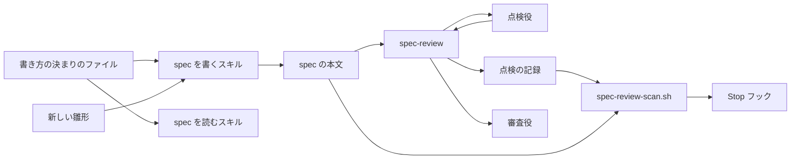
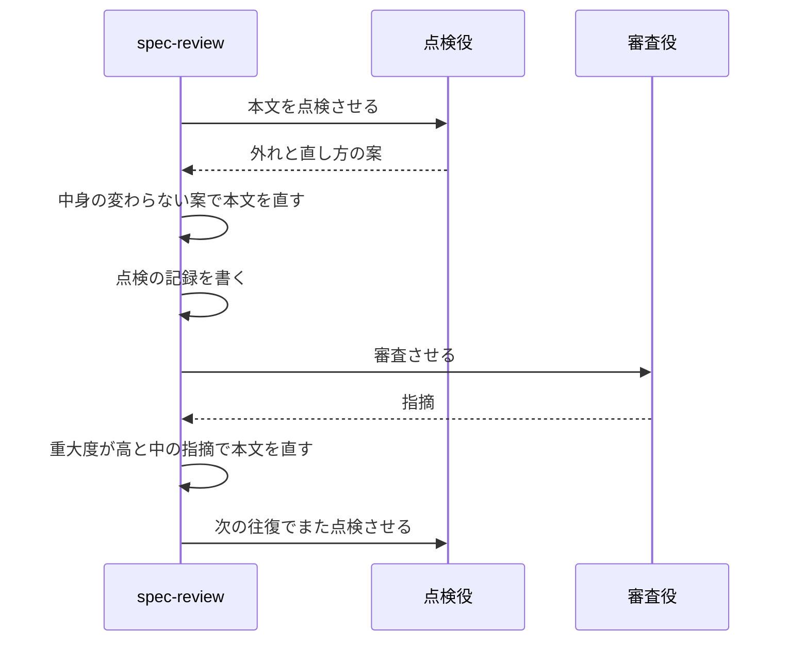

# 設計

## 概要

この設計は、Claude が spec を新しい書き方で書き、所有者が承認のために読む前に、書き方から外れた文を Claude が直すための変更を定める。Claude が行う変更は次の4つである。

- Claude は、書き方の決まりと見本を1つのファイル `spec-writing.md` にまとめ、spec を書くスキルと雛形をそのファイルに合わせる
- Claude は、`/spec-review` を直し、審査役の前に点検役に本文を点検させる。点検役は、新しく作るサブエージェント(メインの会話から起動する別の Claude)である
- Claude は、判定のスクリプト `spec-review-scan.sh` に、点検の記録が本文より古いかどうかの判定を足す。点検の記録が本文より古いまま Claude が承認を求めようとしたら、既存の Stop フックが Claude の作業を止める。Stop フックは、Claude が応答を終えようとするときに動き、作業を止められるフックである
- Claude は、spec を読むスキル(`/kiro-impl` など)を、新しい見出しと目印の名前でも spec を読めるように直す

Claude は、spec ごとに新旧どちらの書き方かを見分けるために、spec.json に `"spec_format": 2` の欄を足す。この欄を持つ spec が新しい書き方の spec であり、欄の無い spec は今の書き方の spec である。この変更が main に入ったあとは、`/kiro-spec-init` が雛形の init.json を写して spec を作るので、新しく作られる spec の spec.json にはこの欄が入る。

Claude は、この spec 自身も新しい書き方で書く。そのため、Claude は、この spec の spec.json に `"spec_format": 2` を手で書き込んである。

## 作るものと作らないもの

### 作るもの

- 書き方の決まりのファイル、新しい雛形、古い雛形の置き場所
- spec を書くスキルが、雛形と決まりを選ぶしかた
- 点検役と、`/spec-review` の点検の工程
- `spec-review-scan.sh` の、点検の記録の判定
- spec を読むスキルと `/spec-review` の観点のファイルが、新旧どちらの名前でも spec を読めること
- CLAUDE.md の spec 駆動開発の節

### 作らないもの

- requirements.md・design.md・tasks.md 以外の文書の書き方(research.md、審査の記録、Issue本文、PR本文、報告)
- 今の書き方の spec の本文を書き直すこと
- `/kiro-spec-quick` と `/kiro-spec-batch`。どちらも承認を自動で付けるスキルで、CLAUDE.md が使うことを禁じている。この2つのスキルは各段階のスキルを呼ぶので、Claude が各段階のスキルを直すと、その直しはこの2つのスキルにもそのまま効く
- `/kiro-spec-design` と `/kiro-spec-quick` が、CLAUDE.md で使わないと決めた `/kiro-validate-design` を案内している件。この件は書き方と関係が無いので、Claude はこの spec では直さない

## 使う既存の仕組み

- 既存の Stop フック `check-spec-review-before-stop.sh` と、知らせるフック `notify-spec-review.sh`。どちらのフックも `spec-review-scan.sh` の出力をそのまま使うので、Claude はこの2つのフックを変えない
- 審査役 spec-reviewer と、審査の記録の書式

## 設計を見直すきっかけ

- `/spec-review` の往復の手順(本文を直す段、往復の上限)が変わったとき。`/spec-review` は点検の工程を往復の手順の中に置くので、往復の手順が変わったら、Claude は点検の工程を置く位置を見直す
- spec を読む新しいスキルが増えたとき。Claude は、そのスキルにも、`spec-writing.md` に載せる見出しと目印の新旧の対応表を読ませる

## プロジェクトの決まりを守っているか

- 品質チェックの設定: Claude は `.claude/hooks/spec-review-scan.sh` を変え、`.claude/hooks/tests/test-spec-review-scan.sh` を足す。この2つのファイルは所有者が写す。写し方は `spec-review-scan.sh` の節の「置き方」に書く。`.claude/skills/` と `.claude/agents/` の変更も、CODEOWNERS(変更に承認が要るパスと承認者を決めるファイル)により、所有者の承認を経てマージされる
- 新しいライブラリの追加: なし。Claude は点検の記録の判定を、今の `spec-review-scan.sh` と同じく bash と perl だけで書く
- 関係のない項目: backend のコードを置く層、frontend の機能ごとの境界、frontend の状態の持ち方、データベースの表の形、使う外部の機能がこのリポジトリで使えるか

## 全体の構成



Claude は、決まりを各スキルに書き写さず、書き方の決まりのファイルの1か所に置く。そのため、Claude が決まりを直すときは、このファイルだけを直せばよい。

## ファイルの構成

Claude が新しく作るファイル:

- `.kiro/settings/rules/spec-writing.md`: 書き方の決まりのファイル
- `.kiro/settings/templates/specs-v1/`: 古い雛形の置き場所
- `.claude/agents/spec-style-checker.md`: 点検役の定義
- `.claude/hooks/tests/test-spec-review-scan.sh`: 点検の記録の判定のテスト

Claude が変えるファイル:

- `.kiro/settings/templates/specs/` の init.json・requirements-init.md・requirements.md・design.md・tasks.md。research.md は変えない
- `.claude/skills/kiro-spec-init/SKILL.md`
- `.claude/skills/kiro-spec-requirements/SKILL.md` と `rules/requirements-review-gate.md`
- `.claude/skills/kiro-spec-design/SKILL.md` と `rules/design-principles.md`・`rules/design-review-gate.md`
- `.claude/skills/kiro-spec-tasks/SKILL.md` と `rules/tasks-generation.md`・`rules/tasks-parallel-analysis.md`
- `.claude/skills/spec-review/SKILL.md` と `rules/requirements.md`・`rules/design.md`・`rules/tasks.md`
- `.claude/skills/kiro-impl/SKILL.md` と `templates/` の implementer-prompt.md・reviewer-prompt.md
- `.claude/skills/kiro-validate-impl/SKILL.md`・`kiro-review/SKILL.md`・`kiro-spec-status/SKILL.md`・`kiro-debug/SKILL.md`・`start/SKILL.md`
- `.claude/hooks/spec-review-scan.sh`
- `CLAUDE.md`

Claude は `ears-format.md` を変えない。

## 処理の流れ

新しい書き方の spec で、`/spec-review` が1つの段階を審査する流れは次のとおりである。



審査が収束したとき、または往復の上限に達したとき、`/spec-review` は本文を直さずに終える。審査が収束したとは、審査役が重大度の高と中の指摘を出さなくなったことを指す。そのため、`/spec-review` が終わった時点では、点検の記録は本文より新しく、審査の記録は点検の記録より新しい。

Claude が点検を審査の前に置いたのは、点検を審査の後に置くと、`/spec-review` が審査のあとに点検で本文を直すことになるからである。そうなると、`spec-review-scan.sh` が「本文がレビューより新しい」と判定して Stop フックが作業を止め、`/spec-review` は審査役の審査をもう1往復回すことになる。

## 部品

### `spec-writing.md`(spec の書き方の決まり、見本、新旧の対応表を持つファイル)

対応する要件: 2.1, 2.2, 2.3, 2.4, 2.5, 2.6, 2.7, 2.8, 3.1, 3.2, 3.3, 4.1, 4.2, 4.3, 5.1, 5.2, 5.3, 7.2, 7.3

**役割**: このファイルは `.kiro/settings/rules/spec-writing.md` に置く。このファイルは、新しい書き方の決まりと見本と、新旧の見出しと目印の対応表を持つ。spec を書くスキル、点検役、spec を読むスキルは、新しい書き方の spec を扱うときにこのファイルを読む。このファイルは、今の書き方の spec の決まりを持たない。

**中身**: Claude は、このファイルを次の節で組み立てる。

- 文の書き方: requirements.md の要件2(文の書き方)の受入基準のすべてを、決まりとして書き直したもの。Claude は、決まりごとに、外れた文の例と直した文の例を1組ずつ付ける
- 文書の組み立て: 要件3(文書の組み立て)のうち、requirements.md の要件の組み立てを決めた受入基準1と、design.md の部品の節の組み立てを決めた受入基準2を、決まりとして書き直したもの
- design.md の書き方: 要件4(design.md の書き方)の受入基準のすべてを、決まりとして書き直したもの
- 繰り返しの扱い: 要件5(同じことの繰り返し)の受入基準のすべてを、決まりとして書き直したもの
- 見本: Issue #474 の見本1と見本2、この設計の「tasks.md の見本」の3つ。所有者がこの design を承認したら、Claude は tasks.md の見本をこの節に写す
- 新旧の見出しと目印の対応表: 下の表

**新旧の見出しと目印の対応表**:

| 文書 | 今の名前 | 新しい名前 |
|---|---|---|
| requirements.md | `# Requirements Document` | `# 要件` |
| requirements.md | `## Project Description (Input)` | `## 元の要望` |
| requirements.md | `## Introduction` | `## はじめに` |
| requirements.md | `## Boundary Context` | `## 範囲` |
| requirements.md | `In scope` / `Out of scope` / `Adjacent expectations` | 「この spec で決めること」/「この spec で決めないこと」/「この spec が前提にしていること」 |
| requirements.md | `## Requirements` | `## 要件` |
| requirements.md | `### Requirement N: 題名` | `### 要件N 題名` |
| requirements.md | `**Objective:**` の行と `#### Acceptance Criteria` | なし(理由の段落と番号付きの項目で書く) |
| design.md | `# Design Document` | `# 設計` |
| design.md | `## Overview` | `## 概要` |
| design.md | `### Goals`、`### This Spec Owns` | `### 作るもの`(「作るものと作らないもの」の節の中) |
| design.md | `## Boundary Commitments` | `## 作るものと作らないもの`、`## 使う既存の仕組み`、`## 設計を見直すきっかけ` の3つの節に分ける |
| design.md | `### Out of Boundary`、`### Non-Goals` | `### 作らないもの` |
| design.md | `### Allowed Dependencies` | `## 使う既存の仕組み` |
| design.md | `### Revalidation Triggers` | `## 設計を見直すきっかけ` |
| design.md | `## KeirekiPro Compliance Check` | `## プロジェクトの決まりを守っているか` |
| design.md | 確かめる項目「backend層配置」「frontend境界」「状態管理」「DBスキーマ」「依存追加」「ゲート設定」「前提機能の利用可否」 | 「backend のコードを置く層」「frontend の機能ごとの境界」「frontend の状態の持ち方」「データベースの表の形」「新しいライブラリの追加」「品質チェックの設定」「使う外部の機能がこのリポジトリで使えるか」 |
| design.md | `## Architecture` | `## 全体の構成` |
| design.md | `### Technology Stack` | 全体の構成の節の「使う技術」の欄 |
| design.md | `### Existing Architecture Analysis`、`## Supporting References` | なし(research.md に書く) |
| design.md | `## File Structure Plan` | `## ファイルの構成` |
| design.md | `## System Flows` | `## 処理の流れ` |
| design.md | `## Requirements Traceability` | なし(各部品の「対応する要件」の行で示す) |
| design.md | `## Components and Interfaces` | `## 部品` |
| design.md | `## Data Models` | `## データの形` |
| design.md | `## Error Handling` | `## 失敗したときの扱い` |
| design.md | `## Testing Strategy` | `## テストの方針` |
| design.md | `### Security Considerations` | `## 安全` |
| design.md | `### Performance & Scalability` | `## 性能` |
| design.md | `### Migration Strategy` | `## 移行` |
| tasks.md | `# Implementation Plan` | `# タスク` |
| tasks.md | `_Requirements:_` | `_要件:_` |
| tasks.md | `_Boundary:_` | `_対象の部品:_` |
| tasks.md | `_Depends:_` | `_依存:_` |
| tasks.md | `_Blocked:_` | `_保留:_` |
| tasks.md | `(P)` | `(並行可)` |
| tasks.md | `## Implementation Notes` | `## 実装のメモ` |
| tasks.md | `## KeirekiPro 完了条件(全タスク共通)` | `## 完了条件(全タスク共通)` |

Claude は、新しい書き方でも、タスクの箱(`- [ ]` `- [x]` `- [ ]*`)とタスク番号(`1.` `1.1`)の形を変えない。

**決めたこと**: Claude は、見本1と見本2を Issue #474 の本文から文字を変えずに写す。見本は所有者が合格とした文章なので、Claude は見本に手を入れない。

### 新しい雛形と古い雛形(spec を書き始めるときに写すファイル)

対応する要件: 1.1, 1.2, 2.5, 3.1, 3.2, 4.1, 5.1, 5.2, 7.1

**役割**: 新しい雛形は `.kiro/settings/templates/specs/` に置き、新しい書き方の spec の書き出しになる。古い雛形は `.kiro/settings/templates/specs-v1/` に置き、今の書き方の spec の書き出しになる。新しい雛形は、今の書き方の見出しや欄を持たない。Claude は、古い雛形を今の雛形から写したまま変えない。

**init.json**: Claude は、今の中身に `"spec_format": 2` の欄を足す。今の書き方の spec を `/kiro-spec-init` で作り直すことは無いので、Claude は `specs-v1/` に init.json を置かない。

**requirements-init.md と requirements.md**: Claude は、見出しを対応表の新しい名前で書く。Claude は、要件の節を、見出し `### 要件N 題名`、理由の段落、番号付きの項目の順にする。Claude は、雛形に「範囲の節は、範囲を読み違えるおそれがあるときだけ書く」という注記を入れる。

**design.md**: Claude は、節を、概要、「作るものと作らないもの」、「使う既存の仕組み」、「設計を見直すきっかけ」、「プロジェクトの決まりを守っているか」、全体の構成、ファイルの構成、処理の流れ、部品、データの形、失敗したときの扱い、テストの方針、安全、性能、移行の順にする。Claude は、今の雛形から、次の理由で節と欄を減らす。

- Goals と This Spec Owns、Non-Goals と Out of Boundary は、同じことを書く節である。Claude は、これらを「作るものと作らないもの」の節にまとめる
- 部品の一覧表と要件との対応の表は、各部品の「対応する要件」の行と同じことを書く。Claude は、この2つの表を消し、各部品の「対応する要件」の行だけを残す
- Claude は、部品の欄を、見本2と同じく「役割」「権限」「いつ動くか」「失敗したとき」のような日本語の欄にする。Claude は、`Owner / Reviewers`、依存の重要度(P0/P1/P2)、契約の種類のチェック欄を消す
- Claude は、「プロジェクトの決まりを守っているか」の節を、その spec に関係のある項目だけを1行ずつ書く形にする。Claude は、関係のない項目を、理由を書かずに名前だけ「関係のない項目:」の1行に並べる形にする。Claude は、7つの項目の名前を、名前だけで何を確かめるかが分かる言葉に直す。新しい名前は対応表に載せる
- Claude は、今の雛形の Technology Stack の節を、全体の構成の節の中の「使う技術」の欄に移す。Existing Architecture Analysis と Supporting References は、research.md と同じことを書く節なので、Claude は新しい雛形から消す

Claude は、雛形の冒頭に、書き方の注記を1つにまとめて入れる。Claude は、その注記に次のことを書く。

- 部品の欄は、その部品に当てはまる欄だけを書く
- 処理の流れ、データの形、失敗したときの扱い、安全、性能、移行の節は、その spec に当てはまるときだけ書く。安全と移行の節を残すのは、認証やデータベースに触れる spec で、その内容を書く場所が無くならないようにするためである
- 雛形に無い節が要るときは、移行の節の前に足してよい。この設計の「tasks.md の見本」の節は、その例である

Claude は、新しい雛形でも、プレースホルダ(雛形の中で、書き込む内容の代わりに置く印)を `{{英大文字}}` の形のまま残す。`check-spec-backing.sh` は、spec の4つのファイル(spec.json・requirements.md・design.md・tasks.md)に `{{英大文字}}` の形の印が残っていないかを調べるので、書き込まれずに残ったプレースホルダを今までどおり見つけられる。

**tasks.md**: Claude は、見出しと目印を対応表の新しい名前で書き、各タスクをこの設計の「tasks.md の見本」と同じ組み立てにする。Claude は、完了条件の節の中身を変えずに、見出しを日本語にし、「acceptance criteria」を「受入基準」に直す。

### spec を書くスキル(requirements・design・tasks の本文を書くスキル)

対応する要件: 1.1, 1.2, 4.1, 7.1, 7.2

**役割**: spec を書くスキルは、`/kiro-spec-init` `/kiro-spec-requirements` `/kiro-spec-design` `/kiro-spec-tasks` の4つである。各スキルは、spec.json の `spec_format` を読む。各スキルは、`spec_format` が2なら、新しい雛形と `spec-writing.md` を使う。各スキルは、欄が無ければ、古い雛形と今の決まりのファイル(`ears-format.md` など)を使う。各スキルは、欄の無い spec を新しい書き方で書かない。

**`/kiro-spec-init`**: このスキルは、新しい雛形の init.json と requirements-init.md で spec を作る。このスキルは、既存の spec に追加の要望を足すとき、目印の行を探して、追加の要望を書き足す節の位置を決める。`spec_format` が2の spec では、このスキルは `## 元の要望` で始まる行を目印にする。`spec_format` の欄が無い spec では、このスキルは今までどおり `## Project Description (Input)` の行を目印にする。

**`/kiro-spec-tasks`**: このスキルの Step 4 は、生成の直後に所有者に承認を尋ね、承認されたら spec.json の `approvals.tasks` に `approved` `approved_by` `approved_at` を書く。tasks の承認を spec.json に書く手順は、ほかのどのスキルにも無い。そこで、Claude は Step 4 を消さず、承認を尋ねる時点だけを直す。直したあとの Step 4 では、このスキルは、生成の直後に承認を尋ねず、続けて `/spec-review` を実行する。`/spec-review` が終わったあと、Claude は所有者に承認を尋ね、承認されたら今までどおり spec.json に書く。Claude がこの時点を直すのは、CLAUDE.md が審査の終わる前に承認を求めないと定めており、要件6の受入基準1が承認を求める前に点検すると定めているからである。Claude は、この直しを `spec_format` に関係なく行う。

**最後の案内**: Claude は、`/kiro-spec-requirements` `/kiro-spec-design` `/kiro-spec-tasks` の最後の案内に、続けて `/spec-review` を実行することを書く。

**`spec_format` が2のときに読み替える指示**: 次の指示は、新しい雛形と食い違う。Claude は、各ファイルの該当する節の冒頭に「`spec_format` が2の spec では、この指示の代わりに `.kiro/settings/rules/spec-writing.md` の◯◯に従う」という1文を足す。Claude は、指示そのものは今の書き方の spec のために残す。

- `kiro-spec-requirements/SKILL.md`: Step 3 の「すべての受入基準を EARS 形式で書く」、Step 4 の「EARS への準拠を点検する」、主語を「システムやサービスの名前」にする指示、EARS を前提にした要件と設計の見分け方、段階ごとの境界の用語(`Boundary Candidates` `Boundary Commitments` `_Boundary:_`)。EARS 形式は、「When …, the … shall …」のような英語の定型文で要件を書く形式である。代わりに従うのは、文の書き方と文書の組み立ての節である
- `requirements-review-gate.md`: 「すべての受入基準は `ears-format.md` の規則に従う」と、機械的な点検の「EARS 形式の受入基準があるか」。代わりに従うのは、文書の組み立ての節である。機械的な点検は「各要件に番号付きの項目が1つ以上あるか」と読み替える
- `design-principles.md`: 「Overview から始まる節の並び」、部品の一覧表、依存の重要度(P0/P1/P2)、契約の種類のチェック、要件との対応の表の列の指示、「雛形の見出しを保つ」。代わりに従うのは、新しい design.md の雛形と、design.md の書き方の節である
- `design-review-gate.md`: 境界の4節、File Structure Plan、要件との対応の表を名前で点検する項目。Claude は、これらの項目を対応表の新しい名前でも読めるように直す。あわせて、Claude は、当てはまらない境界の節は空にせず省いてよいと書き足す
- `kiro-spec-design/SKILL.md`: 雛形の構成に厳密に従う指示、境界の4節を必ず書く指示、File Structure Plan を必ず埋める指示。代わりに従うのは、新しい design.md の雛形と、design.md の書き方の節である
- `kiro-spec-tasks/SKILL.md`: `(P)` `_Boundary:_` `_Depends:_` を付ける指示。代わりに従うのは、新しい tasks.md の雛形と tasks.md の見本である
- `tasks-generation.md`: `_Requirements:_` `_Boundary:_` `_Depends:_` と `(P)` の書き方の規則と、チェックボックスの書式の例。代わりに従うのは、新しい tasks.md の雛形と tasks.md の見本である。`_対象の部品:_` には、今の `_Boundary:_` と同じく、design.md の部品の名前を書く
- `tasks-parallel-analysis.md`: `(P)` を付ける規則と、`(P)` と `_Boundary:_` を使った例。代わりに従うのは、新旧の対応表の `(並行可)` と `_対象の部品:_` である。並行に進められるかを判断する規則そのものは変えない

### `spec-style-checker`(spec の本文の書き方を点検するサブエージェント)

対応する要件: 2.1, 2.2, 2.3, 2.4, 2.5, 2.6, 2.7, 2.8, 3.1, 3.2, 4.1, 4.2, 4.3, 5.1, 5.2, 5.3, 6.1, 6.3, 6.4

**役割**: 点検役は、1つの段階の本文を `spec-writing.md` と照らし、書き方から外れた箇所と、その直し方の案を返す。点検役は本文を直さない。

**権限**: 点検役が使える道具は Read・Grep・Glob に限る。点検役は Write と Edit を持たないので、本文も記録も書けない。

**入力**: `/spec-review` は、点検役に spec の名前と段階と本文のパスを渡す。

**点検の対象**: 点検役は、本文のうち「元の要望」の節と、`### 追加の要望(Issue #N)` の節を点検しない。これらの節は Issue 本文の引用だからである。点検役は、ほかの文書から引用した部分、コードブロックの中、新旧の見出しと目印の対応表の「今の名前」の列も点検しない。

**返す内容**: 点検役が返す外れは2種類ある。1つは、1つの文を書き直せば直る外れ(文の書き方の外れ)である。もう1つは、節を足す、節を消す、節をまとめるなどしないと直らない外れ(文書の組み立て、design.md の書き方、繰り返しの外れ)である。点検役は、文の書き方の外れごとに次の4つを返す。

- 行番号と原文
- 外れている決まりの名前(`spec-writing.md` の節の名前)
- 書き直しの案
- 書き直すと決めごとの中身が変わるかどうか。変わるときは、何が変わるか

点検役は、組み立て・design.md の書き方・繰り返しの外れごとに次の4つを返す。

- 該当する節の名前
- 何が足りないか、または何と何が重なっているか
- 直し方の案
- 直すと決めごとの中身が変わるかどうか。変わるときは、何が変わるか

点検役は、外れが無いときは「外れは無い」と返す。

**モデル**: Claude は、点検役の定義ファイル `.claude/agents/spec-style-checker.md` でモデルを指定しない。点検役は、起動したセッションと同じモデルを使う。

### `/spec-review`(spec を審査するスキル)の点検の工程

対応する要件: 1.2, 6.1, 6.2, 6.3, 6.4, 6.5

**役割**: `/spec-review` は、`spec_format` が2の spec では、往復のたびに審査役の前に点検の工程を行う。`/spec-review` は、`spec_format` の欄が無い spec では点検の工程を飛ばし、今までと同じ流れで審査する。

**工程の置き場所**: Claude は、`/spec-review` の Step 1(準備)と Step 2(審査役の起動)の間に点検の工程を置く。`/spec-review` は、Step 5(往復の判定)で次の往復に進むときも、Step 2 ではなく点検の工程に戻る。Step 6(前の段階への指摘)で所有者の判断を受けて本文を直し、審査をやり直すときも、`/spec-review` は Step 2 ではなく点検の工程から始める。

**直すものと直さないもの**: `/spec-review` は、点検役の案のうち、直しても中身が変わらない案で本文を直す。`/spec-review` は、中身が変わる案では本文を直さない。

**点検の記録**: `/spec-review` は、点検のたびに、点検の記録 `reviews/{段階}-style.md` に節を1つ足す。`/spec-review` は、記録に節を足すだけで、前に書いた節を書き換えない。記録の書式は次のとおりである。

```markdown
## 点検 2026-10-02T07:10:00Z

- 直した文: 3
- 直した節: 1
- 直さなかった外れ: 1
  - 42行目「…」: 書き直すと、承認を取り消す段階が変わるため
```

**所有者への報告**: Claude は、Step 7(所有者への報告)の報告に、その回の `/spec-review` の全往復で直した文と節の数の合計と、直さなかった外れのすべてを足す。`/spec-review` は、直さなかった外れを、該当する文や節と理由とともに所有者に示す。

**決めたこと**: 所有者が承認の前に本文を直したら、Claude は `/spec-review` を流し直す。そのとき点検役は、所有者が直した文を含めて、本文の全体を点検する。`/spec-review` は、所有者が書いた文も、直しても中身が変わらない範囲で直す。本文には所有者が書いた文を区別する手段が無く、直しても決めごとの中身は変わらないからである。

### `spec-review-scan.sh`(審査と点検の記録が本文より新しいかを判定するスクリプト)

対応する要件: 1.2, 6.6

**役割**: `spec-review-scan.sh`(以下 scan)は、段階ごとに、点検の記録が本文より新しいかを判定する。scan は、spec.json の `spec_format` が2の spec で、生成済みで人がまだ承認していない段階だけを判定する。scan は、`spec_format` の欄が無い spec と、人が承認した段階では、点検の記録を判定しない。scan が判定の対象の段階を選ぶほかの条件(`phase` が `initialized` の spec を外すこと)は、今の scan と同じである。

**判定**:

- `reviews/{段階}-style.md` が無いとき: scan は理由「書き方の点検の記録がない」を出す
- 本文(`{段階}.md`)の変更日時が、点検の記録の変更日時より新しいとき: scan は理由「本文が書き方の点検より新しい」を出す

**止まり方**: Stop フックは、今と同じく、所有者の1回の依頼につき2回まで Claude の作業を止め、3回目は通す。Claude がこの回数を変えないのは、回数の上限を持つのは Stop フックであり、この spec は Stop フックを変えないからである。Stop フックが3回目に通したあとも、知らせるフックが、所有者が次の段階のコマンドを打つときに理由を示す。

**置き方**: `.claude/hooks/` は Claude が書き込めないので、Claude は変更後の scan とテストを scratchpad(Claude がこの会話のために使う一時的な置き場所)に用意する。所有者は、それらを `.claude/hooks/` と `.claude/hooks/tests/` に写すコマンドを打つ。

### spec を読むスキル(spec の見出しと目印を名前で読むスキルと、審査の観点を書いたファイル)

対応する要件: 7.3

**役割**: 次のスキルと観点のファイルは、spec の見出しや目印を名前で参照している。Claude は、各ファイルに「spec.json の `spec_format` が2の spec では、見出しと目印を `.kiro/settings/rules/spec-writing.md` の対応表の新しい名前で読む」という指示を1か所ずつ足す。Claude は、今の名前での参照を、今の書き方の spec のために残す。

- `/kiro-impl`(SKILL.md、templates/implementer-prompt.md、templates/reviewer-prompt.md): タスク番号、依存、対象の部品、保留、並行可の印、実装のメモの節を読み書きする
- `/kiro-validate-impl`・`/kiro-review`・`/kiro-spec-status`・`/kiro-debug`: 「作るもの」「作らないもの」「使う既存の仕組み」「設計を見直すきっかけ」の4つ、ファイルの構成、実装のメモの節を読む
- `/start`: 既存の spec の design.md で、「作るもの」の節を読んで範囲を判断する
- `/spec-review` の rules/requirements.md・rules/design.md・rules/tasks.md: requirements.md の「範囲」、design.md の「プロジェクトの決まりを守っているか」「ファイルの構成」「作るものと作らないもの」、tasks.md の要件の対応の目印を名前で挙げている

`/kiro-impl` は、新しい書き方の tasks.md に書き込むときも、新しい名前(`_保留:_` と `## 実装のメモ`)で書く。Claude は、これらのスキルの手順のうち、spec の中身の読み方以外は変えない。例外は2つある。1つ目の例外は、雛形の置き場所である。`/spec-review` の rules/design.md と rules/tasks.md は、雛形の置き場所 `.kiro/settings/templates/specs/` をパスで挙げ、その雛形を審査の基準にしている。Claude は、この2つのファイルを次のとおりに直す。審査役は、`spec_format` の欄が無い spec では `specs-v1/` の雛形を基準にし、`spec_format` が2の spec では `specs/` の雛形を基準にする。2つ目の例外は、`/spec-review` の rules/design.md の観点3(design.md の「プロジェクトの決まりを守っているか」の節と本文が食い違っていないかを見る観点)である。今の書き方の spec では、観点3は、雛形が定める7つの項目のすべてにチェックが入っていることと、関係のない項目に N/A と理由が書かれていることを求める。Claude は、観点3に「`spec_format` が2の spec では、関係のある項目に中身が書かれていること、関係のない項目が名前だけで並んでいること、7つの項目のすべてがどちらかに出ていることを確かめる」という1文を足す。

### CLAUDE.md(Claude が作業のたびに読むプロジェクトの決まり)

対応する要件: 6.1, 7.1, 7.2

**役割**: Claude は、CLAUDE.md の spec 駆動開発の節を、次のとおりに直す。Claude は、この節のこれ以外の行を変えない。

- spec の書き方の基準は `.kiro/settings/rules/spec-writing.md` にあることを足す
- `/spec-review` は、新しい書き方の spec では、審査の前に書き方の点検を行うことを足す
- 「`/kiro-spec-tasks` が生成直後に承認を尋ねる作りになっているが、`/spec-review` の完了後に尋ねる」の行を、`/kiro-spec-tasks` の直したあとの動き(生成のあとに `/spec-review` を実行し、審査が終わってから承認を尋ねる)に合わせて書き直す
- CLAUDE.md の「Issueの印」の節は、目印の名前として `_Requirements:_` と `(P)` を挙げている。Claude は、その箇所に2つのことを書き添える。1つは、新しい書き方の spec では目印の名前が `_要件:_` と `(並行可)` であることである。もう1つは、新しい書き方の tasks.md では、印 `(#N)` をタスクの題名の末尾に置き、`(並行可)` があるときはそのあとに置くことである

## テストの方針

- 点検の記録の判定(本文を直したあとに点検し直していなければ止まること、今の書き方の spec と承認済みの段階は判定しないこと): Claude は、`.claude/hooks/tests/test-spec-review-scan.sh` をコンテナの中で bash と perl を使って走らせ、次の場合を確かめる
  - scan は、`spec_format` の欄が無い spec では、点検の記録が無くても理由を出さない
  - scan は、`spec_format` が2の spec で点検の記録が無ければ、「書き方の点検の記録がない」を出す
  - scan は、本文が点検の記録より新しければ、「本文が書き方の点検より新しい」を出す
  - scan は、点検の記録が本文より新しければ、点検についての理由を出さない
  - scan は、人が承認した段階では、点検の記録が無くても理由を出さない
  - Claude は、scan の判定の行を一時的に消して新しいテストが失敗することを確かめてから、消した行を戻す
- 新しい雛形が PR の検査を受けること(新しい雛形で書いた spec でも、`check-spec-backing.sh` が書き込まれずに残ったプレースホルダを見つけること): Claude は、既存のテスト `test-check-spec-backing.sh` が通ることを確かめる
- 雛形と決まりのファイルに英語の定型文と英語の見出しが残っていないこと: Claude は、新しい雛形(`specs/` の requirements-init.md・requirements.md・design.md・tasks.md)に「shall」「When」と英語の見出しが残っていないことを、grep で確かめる。`spec-writing.md` は、外れた文の例と新旧の対応表の中に英語の定型文と英語の見出しをわざと持つので、Claude は grep を見出しの行(`#` で始まる行)だけに絞り、`spec-writing.md` 自身の見出しが日本語であることを確かめる
- 点検役が外れを見つけること: Claude は、外れた文と重なった節を混ぜた短い見本の本文を点検役に渡し、外れと直し方の案が返ること、中身が変わる直し方に印が付くことを確かめる。点検役は AI なので、Claude はこの確かめを自動テストにせず、実装のタスクの中で1回行い、結果を実装のメモに残す
- 新しい書き方の spec を、書いてから審査するまで通して動かす確かめ: 点検の工程を持つ `/spec-review` は、この spec の実装でできるので、この spec の tasks.md の審査には使えない。そこで、Claude は、実装のタスクの中で、一時的な spec のディレクトリ(`spec_format` が2で、外れた文を混ぜた短い requirements.md を持つもの)を作る。Claude は、そのディレクトリに対して直したあとの `/spec-review` を1往復流し、本文の外れた文が直ること、`reviews/requirements-style.md` が残ること、点検のあとに審査役が起動することを確かめる。Claude は、確かめ終わったら、その一時的なディレクトリを消し、結果を実装のメモに残す

## tasks.md の見本

この見本は、tasks.md の書き方の基準である。

```markdown
- [ ] 3. 点検の記録が古いまま承認に進めないようにする
- [ ] 3.1 点検の記録の判定を scan に足す (並行可)

  Claude は、変更後の `spec-review-scan.sh` を scratchpad に用意する。この scan は、`spec_format` が2の spec で、点検の記録が無いときと、本文が点検の記録より新しいときに、理由を出す。
  - 完了の確かめ方: テスト `test-spec-review-scan.sh` の場合がすべて通る
  - 受入基準とテストの対応: 要件6の受入基準6(本文を直したあとの点検の記録が無いまま承認を求めると止まる)は、テストの「本文が点検の記録より新しければ理由を出す」で確かめる
  - _要件: 1.2, 6.6_
  - _対象の部品: spec-review-scan.sh_
  - _依存: 1.1_
```

Claude は、大タスクと小タスクの最初の行を、どちらもタスクの箱と番号と題名にする。Claude は、ほかのタスクと並行に進められる小タスクの題名の末尾に、`(並行可)` を付ける。Claude は、既存の spec に追加の Issue #N のためにタスクを足したとき、そのタスクの題名の末尾に印 `(#N)` を置く。題名に `(並行可)` があるときは、Claude は `(#N)` を `(並行可)` のあとに置く。Claude は、小タスクの題名の行のあとに空行を1つ置き、その次の行に、誰が何を作るかを主語と目的語のある文で書く。大タスクに説明の文を書くときも、Claude は同じ形にする。空行を置くのは、tasks.md を Markdown として表示したときに、説明の文が題名と同じ段落につながらないようにするためである。Claude は、その下の箇条書きに、完了の確かめ方、受入基準とテストの対応、`_要件:_`・`_対象の部品:_`・`_依存:_` の目印を書く。

## 移行

1. Claude は、`.kiro/settings/templates/specs/` の今の雛形を `specs-v1/` に写してから、`specs/` を新しい雛形に置き換える。写す前に置き換えると、今の書き方の spec が使う雛形が無くなる
2. 所有者が、scan とテストを `.claude/hooks/` に写す。Claude は、この写しが終わってから出荷する
3. Claude は、この spec の残りの段階を、この変更が main に入る前に終える。そのため、Claude はこの spec を新しい雛形で作り直さない
4. 今の書き方の spec がすべて出荷されたら、Claude は、別の Issue で `specs-v1/` と `ears-format.md` と、各スキルの今の書き方のための分岐を消す
