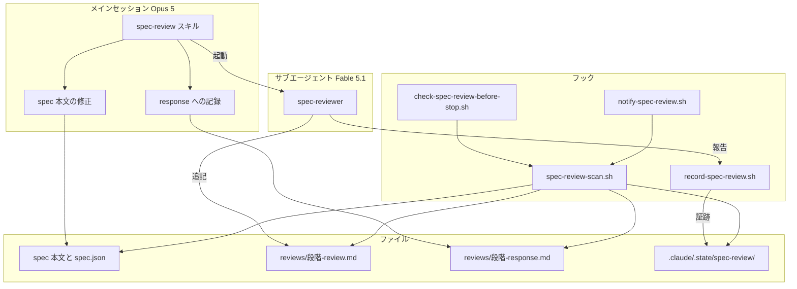
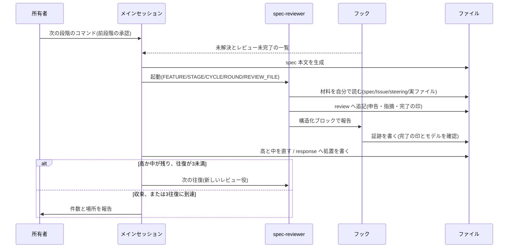
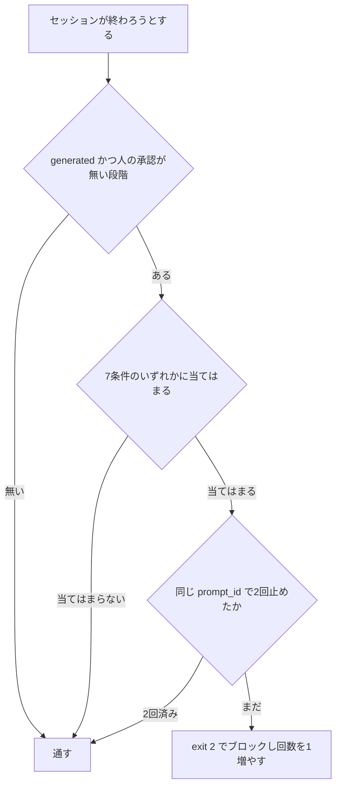

# Design Document

## Overview

**Purpose**: spec 文書を、書いたモデルとは別のモデルに審査させ、指摘と対応を記録として残す。所有者が承認する時点で、本文と指摘の両方が手元にある状態を作る。

**Users**: リポジトリ所有者(spec を承認する)と、spec を生成する実装セッション。

**Impact**: cc-sdd の生成フローは変えない。生成の直後にレビューの工程を差し込み、レビューの実施をフックで強制する。あわせて、既存フック4本と `CLAUDE.md` の Git規約の実行前提を新規フックと揃える(要件8.5〜8.7)。

### Goals

- spec の各段階で、別モデルによるレビューを自動で走らせる
- 観点を段階ごとにファイルで固定する
- 指摘と対応をファイルに残し、承認の根拠と効果の測定に使えるようにする
- レビューの未実施を機械で止める

### Non-Goals

- 実装コードのレビュー(PR 段階の codex-review が担う)
- spec の生成そのもの(cc-sdd が担う)
- 別ベンダーのモデルの導入(将来の判断として Issue #193 に残す)
- 承認そのものの偽装防止(証跡と同じ水準の限界を受容する)

## Boundary Commitments

### This Spec Owns

- レビューの起動・往復・収束の手順(`spec-review` スキル)
- レビュー役の定義と、その制約(`spec-reviewer` エージェント)
- 段階ごとの観点(`rules/` 配下)
- レビュー実施の検査と強制(`.claude/hooks/` の4本)
- レビューの記録(`.kiro/specs/<feature>/reviews/`)
- **既存フック4本(`check-encoding.sh` / `check-verify-before-stop.sh` / `protect-main.sh` / `record-gate-run.sh`)と `CLAUDE.md` の Git規約を、新規フックと同じ前提(bash と perl の JSON::PP、jq に依存しない)へ揃えること。** 新規フックだけを OS 非依存にしても、同じディレクトリの既存フックが GNU 固有の書き方のままでは、リポジトリとしての前提が揃わない。`check-verify-before-stop.sh` の更新時刻の取得が macOS で失敗し、品質ゲートの未実行を無言で通す経路があることを、本 spec のレビューで検出したため、その修正も含む

### Out of Boundary

- cc-sdd のスキル本体(`.claude/skills/kiro-*/`)の変更
- `codex-review.yml` の判定ロジック(`research.md` と `brief.md` の混入は #341 で別途扱う)
- spec の生成と承認フラグの書き込み規則(cc-sdd の既定に従う)

### Allowed Dependencies

- Claude Code のフック機構(`UserPromptExpansion` / `UserPromptSubmit` / `SubagentStop` / `PostToolUse` / `Stop`)
- Agent ツールによるサブエージェントの起動とモデル指定
- bash と perl(JSON::PP)、および awk / sed / grep と、sha256 を計算できるコマンド(`sha256sum` / `shasum` / 無ければ `cksum` で代替)。jq には依存しない。Windows では Git for Windows がこれらを提供し、macOS と Linux は標準で満たす
- `gh issue view`(レビュー役が Issue 本文を取得する)

### Revalidation Triggers

- フックの入力項目の変更(とくに `last_assistant_message` と `agent_transcript_path`)
- `SubagentHandback` の提供条件の変更
- cc-sdd の承認フラグの書き方の変更(`approved_by` の値の規則)
- `codex-review.yml` の連結対象の変更

## KeirekiPro Compliance Check (必須)

- [x] **backend層配置**: N/A(backend のコード変更なし)
- [x] **frontend境界**: N/A(frontend のコード変更なし)
- [x] **状態管理**: N/A
- [x] **DBスキーマ**: N/A(マイグレーションなし)
- [x] **依存追加**: 新規ライブラリなし。bash / perl / awk / sed / grep とハッシュ計算のコマンドは、いずれのOSでも標準または Git の導入で満たされる既存前提。`gh` は許可リストに登録済み
- [x] **ゲート設定**: **本設計はゲート設定の変更を必要とする。** `.claude/hooks/` への追加と**既存フック4本の修正(うち `check-verify-before-stop.sh` は動作の変更を含む)**、`.claude/settings.json` へのフック登録、`.claude/skills/` と `.claude/agents/` への追加、`CLAUDE.md` の Git規約の変更が成果物そのものであり、CODEOWNERS(`/.claude/` は所有者)と `check-escape-hatches.sh` により所有者の Approve を経る。`.claude/hooks/**` と `.claude/settings.json` は書き込みが禁止されているため、所有者が手で追加する
- [x] **前提機能の利用可否**: 2026-09-26 にこのリポジトリで実測した。`UserPromptSubmit` の発火(会話中に出力を確認)、`SubagentStop` と `PostToolUse(SubagentHandback)` 経由の証跡の記録、定義ファイルのフルモデルID指定(サブエージェントの記録に `"model":"claude-fable-5-1"` が残ることを確認)、Stop フックが2回止めて3回目に通ること、を確認済み。**`UserPromptExpansion` の発火は未確認**(所有者が `/kiro-spec-design` を入力した際に `UserPromptSubmit` の出力は確認できたが、`UserPromptExpansion` の出力は観測していない)。要件7.9 は `UserPromptSubmit` の経路だけでも満たせるため、未確認のまま進め、Testing Strategy の項目として残す。公式ドキュメント(code.claude.com の hooks / sub-agents / tools-reference)の記載とも一致する

## Architecture

### Architecture Pattern & Boundary Map



**Architecture Integration**:

- 選んだ形: 実装役とレビュー役を別のサブエージェントに分け、フックが実施の事実を記録し、別のフックが検査する。`kiro-impl` の実装役・レビュー役・デバッグ役の往復と、`record-gate-run.sh` と `check-verify-before-stop.sh` の記録と検査の組み合わせを、spec の段階へ持ち込む
- 責務の分離: **書く側は review ファイルを書けず、レビュー役は spec 本文と response を書けない。** 同じファイルに両者が書ける構成にすると、指摘の弱体化を機械で検出できない
- 既存の踏襲: フックはすべて bash の実装、JSON は perl の JSON::PP で解析、状態は `.claude/.state/` に置く。jq に依存させない(既存フック4本と同じ)
- 新規の理由: cc-sdd にはレビューの手順を差し込む仕組みが無い(公式のカスタマイズはテンプレートとルールのみ)。本家に手を入れず、外側に独立したスキルとして置く

### Technology Stack

| Layer | Choice / Version | Role in Feature | Notes |
|-------|------------------|-----------------|-------|
| スキル | Claude Code Skill(Markdown) | レビューの手順 | `.claude/skills/spec-review/` |
| レビュー役 | Claude Fable 5.1(`claude-fable-5-1`) | spec の審査 | 定義ファイルでフルモデルIDを固定 |
| 実装役 | メインセッションのモデル | 本文の修正と記録 | 起動時にモデルを指定しない |
| フック | bash + perl(JSON::PP) | 記録と検査 | OSに依存しない実装。Windows は Git for Windows で満たす |
| 記録 | Markdown | 指摘と対応 | `.kiro/specs/<feature>/reviews/` |
| 証跡 | テキスト(key=value) | 実施の事実 | `.claude/.state/spec-review/`(gitignore 済み) |

## File Structure Plan

### 新規ファイル

```
.claude/
├── agents/
│   └── spec-reviewer.md                  レビュー役の定義。モデル固定・書き込み制約・報告の形式
├── skills/spec-review/
│   ├── SKILL.md                          起動・往復・収束・差し戻しの手順
│   └── rules/
│       ├── common.md                     レベル・申告・指摘ID・記録の書式・処置の5種類
│       ├── requirements.md               requirements の観点
│       ├── design.md                     design の観点
│       └── tasks.md                      tasks の観点
└── hooks/
    ├── spec-review-scan.sh               走査の共通ライブラリ(source される)
    ├── record-spec-review.sh             証跡の記録(SubagentStop / PostToolUse)
    ├── check-spec-review-before-stop.sh  停止のブロック(Stop)
    └── notify-spec-review.sh             未解決とレビュー未完了の提示(2イベント)
```

### Modified Files

- `.claude/settings.json` — フックの登録(5か所)。所有者が手で追記する
- `CLAUDE.md` — 生成直後のレビュー、承認を求める順序、**承認済みの段階を再生成または修正する前の承認の取り消し**、`/kiro-validate-design` を使わないこと、`/kiro-validate-gap` が事前調査であること
- `README.md` — 仕様づくりの表と、カスタムスキルの表
- `CLAUDE.md` の Git規約 — 実行前提を「bash と perl(JSON::PP)。jqには依存しない」に揃える(要件8.5)
- `.claude/hooks/check-encoding.sh` / `protect-main.sh` / `record-gate-run.sh` — 冒頭の前提コメントのみ(動作の変更なし)
- `.claude/hooks/check-verify-before-stop.sh` — 冒頭の前提コメントに加え、**更新時刻の取得の動作を変更**(GNU と BSD の両書式を順に試し、値が数字であることを確かめる。要件8.6、8.7)
- これら `.claude/hooks/**` と `.claude/settings.json` は書き込みが禁止されているため、所有者が手で直す

### 実行時に生成されるファイル

- `.kiro/specs/<feature>/reviews/<段階>-review.md` — レビュー役だけが書く
- `.kiro/specs/<feature>/reviews/<段階>-response.md` — メインセッションだけが書く
- `.claude/.state/spec-review/<feature>__<段階>.evidence` — 証跡
- `.claude/.state/spec-review/block-counter.txt` — ブロックの回数

## System Flows

### レビュー1回分



### 停止の検査



## Requirements Traceability

| Requirement | Summary | Components |
|-------------|---------|------------|
| 1.1, 1.4 | 生成直後の自動起動。所有者は打たない | CLAUDE.md の規定 / spec-review スキル |
| 1.2 | 別モデル | spec-reviewer 定義(`model: claude-fable-5-1`) |
| 1.3 | 未起動での終了をブロック | check-spec-review-before-stop.sh |
| 1.5 | レビュー完了まで承認を求めない | CLAUDE.md の規定 |
| 2.1, 2.2 | 観点をファイルで保持し毎回読む | rules/ 配下4ファイル / spec-reviewer 手順2 |
| 2.3, 2.4, 2.5, 2.6 | 段階ごとの観点 | rules/requirements.md / design.md / tasks.md |
| 2.7, 2.8, 2.9 | 申告と段階ごとの対象 | rules/common.md / 各段階の観点 |
| 2.10 | 材料を自分で読む | spec-reviewer 手順3 / SKILL.md Step 2 |
| 3.1, 3.2 | 高中低の分類と基準 | rules/common.md |
| 3.3, 3.4, 3.5 | 高と中だけ直す。処置を記録 | SKILL.md Step 4 |
| 4.1, 4.2, 4.3, 4.4, 4.5 | 収束・サイクル・上限・未解決・新サイクル | SKILL.md Step 1, 5, 6 |
| 4.6, 4.7 | 直前1往復と却下一覧。蒸し返しの禁止 | SKILL.md Step 2 / spec-reviewer 審査の姿勢 |
| 5.1, 5.2 | 書く主体の分離 | spec-reviewer 絶対の制約 / SKILL.md 役割の分担 |
| 5.3, 5.4 | 追記式と最終行 | rules/common.md 記録の書式 |
| 5.5 | 判定基準への混入を避ける | reviews/ サブディレクトリ |
| 6.1, 6.2, 6.3, 6.4 | 差し戻しの記録と報告 | rules/common.md / SKILL.md Step 6 |
| 6.5, 6.6, 6.7 | 承認の取り消しと再レビュー | SKILL.md Step 6 / CLAUDE.md の規定 |
| 7.1, 7.2, 7.3, 7.4 | 証跡の記録の条件 | record-spec-review.sh |
| 7.5 | 7条件でのブロック | spec-review-scan.sh / check-spec-review-before-stop.sh |
| 7.6 | 2回まで | check-spec-review-before-stop.sh(prompt_id をキーにした回数) |
| 7.7, 7.8 | 対象の範囲と自動承認の扱い | spec-review-scan.sh |
| 7.9 | 承認時点の提示 | notify-spec-review.sh |
| 8.1, 8.2, 8.3 | 本家に触らない。既存スキルの整理 | CLAUDE.md の規定 |
| 8.4 | PR 段階は spec を審査しない | 変更しない(現状維持) |
| 8.5 | 既存と新規のフックを同じ実行前提で動かし、前提を同じ文言で書く | フック8本の冒頭コメント / CLAUDE.md の Git規約 |
| 8.6 | GNU 系と BSD 系で書式が異なる場合は両方を試し、値の形式を確かめる | check-verify-before-stop.sh(更新時刻)/ record-spec-review.sh と spec-review-scan.sh(ハッシュ) |
| 8.7 | 無言で通る失敗を直す | check-verify-before-stop.sh の更新時刻の取得 |

## Components and Interfaces

| Component | Intent | Req | Contracts |
|-----------|--------|-----|-----------|
| spec-review スキル | レビューの手順 | 1, 3, 4, 5, 6 | Service |
| spec-reviewer 定義 | レビュー役の制約 | 1.2, 2, 5.2 | Service |
| rules/ 配下 | 観点・レベル・書式 | 2, 3.1, 5.3 | State |
| record-spec-review.sh | 証跡の記録 | 7.1, 7.2, 7.3, 7.4 | Batch |
| spec-review-scan.sh | 走査の共通化 | 7.5, 7.7, 7.8 | Service |
| check-spec-review-before-stop.sh | 停止のブロック | 1.3, 7.5, 7.6 | Batch |
| notify-spec-review.sh | 承認時点の提示 | 7.9 | Batch |
| 既存フック4本(`check-encoding.sh` / `check-verify-before-stop.sh` / `protect-main.sh` / `record-gate-run.sh`) | 実行前提を新規フックと揃える | 8.5, 8.6, 8.7 | Batch |

**通知の出力の形**: 素のテキストを標準出力へ書く。`UserPromptSubmit` と `UserPromptExpansion` は標準出力が Claude の読む文脈として追加されるため、JSON を組み立てない。出力は1万字の上限があるので、件数と指摘の識別子の要約にとどめる。

### レビュー役の報告(構造化ブロック)

レビュー役の最終応答に必須。フックがこれを読んで証跡を書く。

```
- FEATURE: <feature名>
- STAGE: requirements|design|tasks
- CYCLE: <数字>
- ROUND: <数字>
- REVIEW_FILE: .kiro/specs/<feature>/reviews/<段階>-review.md
- STATUS: converged|unresolved
```

- 事前条件: review ファイルへの追記が完了していること
- 事後条件: 証跡が書かれるか、検証に落ちて書かれないかのいずれか
- 不変条件: `REVIEW_FILE` は `FEATURE` と `STAGE` から導ける値と一致する

報告は2つの経路で届く。`SubagentStop` では `last_assistant_message`、`SubagentHandback` を使う環境では `PostToolUse` の `tool_input.message`。同じスクリプトを両方に登録し、どちらでも拾う。

### spec-review-scan.sh のインターフェース

`spec_review_scan <project_dir>` が1行1件で出力する。

```
<feature>|<stage>|<ブロック理由のカンマ区切り>|<未解決の件数>
```

ブロック理由が空なら停止の対象ではない。Stop フックと通知フックの両方がこの関数を使い、判定のずれを防ぐ。

**対象の判定**(要件7.7、7.8):

- `phase` が `initialized` の spec は対象外(`/kiro-spec-init` の直後)
- 段階ごとに `approvals.<段階>.generated` が true のものだけを見る
- 次をすべて満たす段階は「人の承認あり」として対象外にする
  - `approved` が true
  - `approved_by` が空でない
  - `approved_by` が `:` を含まない(`auto:-y` / `auto:batch` / `unknown:pre-existing` はいずれも `:` を含むため未承認として扱う)

## Data Models

### 証跡(`.claude/.state/spec-review/<feature>__<段階>.evidence`)

```
recorded_at=<epoch秒>
feature=<feature名>
stage=<段階>
cycle=<数字>
round=<数字>
status=converged|unresolved
review_hash=<review ファイルの sha256>
```

`review_hash` は、レビューの完了後に review ファイルが書き換えられたことの検知に使う(要件7.5 の6項目目)。

### ブロックの回数(`.claude/.state/spec-review/block-counter.txt`)

```
prompt_id=<UUID>
count=<0から2>
```

`prompt_id` が変われば数え直す。初期化の処理を持たない(要件7.6)。

### 指摘の識別子

`{段階}{サイクル}-{往復}-{連番}`。段階は `R` / `D` / `T`。例: `R2-1-3` は requirements のサイクル2、往復1、3件目。review と response が別ファイルのため、処置の突き合わせに使う。

## Error Handling

### Error Strategy

フックは判定不能のとき「証跡を書かない」側に倒す。証跡が無ければ Stop フックが止めるため、誤って通ることはない。

### Error Categories and Responses

- **報告の形式が違う、値が不正**: 証跡を書かない。スキルがブロックのみの再起動を1回行う
- **`REVIEW_FILE` が規則に合わない、`..` を含む、実在しない**: 証跡を書かない
- **モデルが指定と違う(確認できる経路)**: 証跡を書かない
- **モデルを確認できない経路**: 記録する。検出できないことを制約として受容する(要件7.4)
- **`prompt_id` が入力に無い**: `session_id` にフォールバックする
- **走査ライブラリが見つからない**: 何もせず通す(フックの不在でセッションを止めない)

### Monitoring

記録ファイルに往復の回数と未解決の件数が残る。`grep '^- 往復' .kiro/specs/*/reviews/*-review.md` で実測でき、モデルの配分やレベルの基準を見直す材料になる。

## Testing Strategy

`.claude/hooks/` にはシェルスクリプトのテストの器が無く、フックは入力(JSON)と副作用(ファイル)を伴う。そのため **捨て spec と模擬の入力による実機確認** で置き換える。

### 実機確認(フック)

1. 本物のリポジトリで走査が何も出さないこと(全段階が人の承認済み)
2. レビュー未実施、完了の印が無い、対応の記録が無い、処置漏れ、review の改変、本文が新しい、の各状態で止まること
3. 収束済みで対応と証跡がそろえば通ること
4. 同じ `prompt_id` で2回止め、3回目で通ること。`prompt_id` が変われば数え直すこと
5. 報告のパスに `..` を含む場合、未知の段階、ブロックが無い場合に、証跡を書かないこと
6. `SubagentStop` と `PostToolUse(SubagentHandback)` の両経路で証跡が書けること
7. モデル名が指定と違う記録では証跡を書かないこと

### 実機確認(スキルとレビュー役)

8. 通知フックが、承認にあたる入力の時点で一覧を出すこと(`UserPromptSubmit` は確認済み。`UserPromptExpansion` は未確認)
9. 実際の spec でレビューが走り、review への追記と構造化ブロックの出力が行われること
10. 高と中を直した後に再レビューが要求されること(処置「修正」が最新往復に残る状態の検知)
11. 3往復で収束しない場合に未解決として記録され、本文が直されないこと
12. 所有者が修正を選んだとき、新しいサイクルとして往復が数え直されること

### 実機確認(既存フックの修正)

13. `check-verify-before-stop.sh` の更新時刻の取得が、この環境で epoch 秒を返すこと
14. GNU 書式を失敗させた場合に、数字でない値が弾かれること(GNU の `stat -f` は別の意味になり、数字以外を返して成功するため)
15. `.claude/hooks/` の8本に、OS ごとに失敗して握りつぶされる箇所が他に無いこと(`stat` の使用箇所を全数確認する。要件8.7)

捨て spec(`.kiro/specs/zz-hook-probe/` など)で行い、確認後に削除してコミットに含めない。

## Supporting References

- 設計の決定の経緯は Issue #193 のコメント4本にある。判断の理由(なぜ別モデルか、なぜ独立スキルか、なぜ2経路か)はそちらを参照する
- `research.md` に、調査の過程と採らなかった案を記録している
