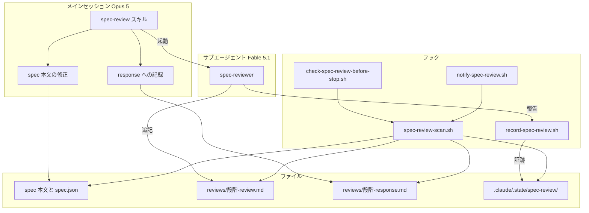
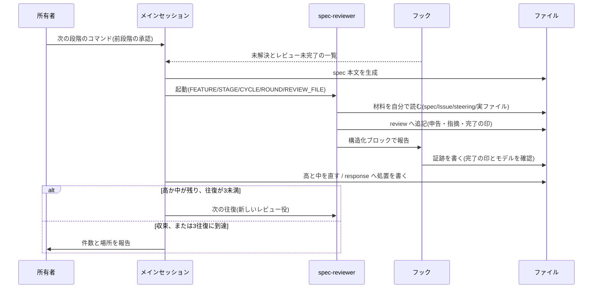
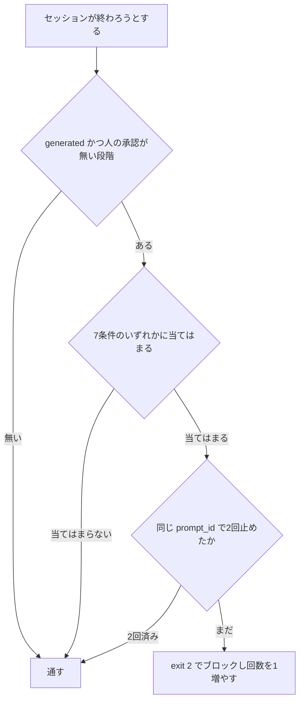

# 設計

## 概要

この設計は、spec の文書を、書いたモデルとは別のモデルに審査させ、指摘と対応を記録として残す。この設計により、所有者が承認する時点で、本文と指摘の両方が所有者の手元にある。

この設計の利用者は、spec を承認するリポジトリ所有者と、spec を生成する実装セッションである。

この設計は、cc-sdd の生成の流れを変えない。この設計は、生成の直後にレビューの工程を差し込み、レビューの実施をフックで強制する。あわせて、この設計は、既存フック4本と `CLAUDE.md` の Git規約の実行前提を、新規フックと揃える(要件8.5〜8.7)。

## 作るものと作らないもの

### 作るもの

この設計は、次のことを目指す。

- spec の各段階で、別モデルによるレビューを自動で走らせる
- 観点を段階ごとにファイルで固定する
- 指摘と対応をファイルに残し、承認の根拠と効果の測定に使えるようにする
- レビューの未実施を機械で止める

この spec は、次のものを持つ。

- レビューの起動・往復・収束の手順(`spec-review` スキル)
- レビュー役の定義と、その制約(`spec-reviewer` エージェント)
- 段階ごとの観点(`rules/` 配下)
- レビューの実施の検査と強制(`.claude/hooks/` の4本)
- レビューの記録(`.kiro/specs/<feature>/reviews/`)
- **既存フック4本(`check-encoding.sh` / `check-verify-before-stop.sh` / `protect-main.sh` / `record-gate-run.sh`)と `CLAUDE.md` の Git規約を、新規フックと同じ前提(bash と perl の JSON::PP、jq に依存しない)へ揃えること。** 新規フックだけを OS 非依存にしても、同じディレクトリの既存フックが GNU 固有の書き方のままでは、リポジトリとしての前提が揃わない。この spec のレビューは、`check-verify-before-stop.sh` の更新時刻の取得が macOS で失敗し、品質ゲートの未実行を無言で通す経路があることを見つけた。そのため、この spec は、その経路の修正も持つ

### 作らないもの

この設計は、次のことを目指さない。

- 実装コードのレビュー(PR の段階の codex-review が担う)
- spec の生成そのもの(cc-sdd が担う)
- 別ベンダーのモデルの導入(将来の判断として Issue #193 に残す)
- 承認そのものの偽装の防止(この設計は、証跡と同じ水準の限界を受け入れる)

この spec は、次のものを持たない。

- cc-sdd のスキル本体(`.claude/skills/kiro-*/`)の変更
- `codex-review.yml` の判定のロジック(`research.md` と `brief.md` の混入は #341 で別に扱う)
- spec の生成と、承認のフラグの書き込みの規則(cc-sdd の既定に従う)

## 使う既存の仕組み

- Claude Code のフックの機構(`UserPromptExpansion` / `UserPromptSubmit` / `SubagentStop` / `PostToolUse` / `Stop`)
- Agent ツールによるサブエージェントの起動とモデルの指定
- bash と perl(JSON::PP)、awk / sed / grep、sha256 を計算できるコマンド(`sha256sum` / `shasum` / 無ければ `cksum` で代わりにする)。フックは jq に依存しない。Windows では Git for Windows がこれらのコマンドを提供し、macOS と Linux は標準でこれらのコマンドを持つ
- `gh issue view`(レビュー役が Issue の本文を取得する)

## 設計を見直すきっかけ

次の変更があったら、この設計を確かめ直す。

- フックの入力の項目が変わったとき(とくに `last_assistant_message` と `agent_transcript_path`)
- `SubagentHandback` の提供の条件が変わったとき
- cc-sdd の承認のフラグの書き方が変わったとき(`approved_by` の値の規則)
- `codex-review.yml` が連結する対象が変わったとき

## プロジェクトの決まりを守っているか

- 新しいライブラリの追加: この設計は、新しいライブラリを足さない。bash / perl / awk / sed / grep とハッシュを計算するコマンドは、どのOSでも、標準か Git の導入で満たされる既存の前提である。`gh` は許可リストに登録済みである
- 品質チェックの設定: **この設計は、ゲート設定の変更を必要とする。** この設計の成果物そのものが、`.claude/hooks/` への追加、**既存フック4本の修正(そのうち `check-verify-before-stop.sh` は動作の変更を含む)**、`.claude/settings.json` へのフックの登録、`.claude/skills/` と `.claude/agents/` への追加、`CLAUDE.md` の Git規約の変更である。これらの変更は、CODEOWNERS(`/.claude/` は所有者が持つ)と `check-escape-hatches.sh` により、所有者の Approve を経る。`.claude/hooks/**` と `.claude/settings.json` は書き込みが禁止されているため、所有者がこれらのファイルを手で足す
- 使う外部の機能がこのリポジトリで使えるか: Claude は、2026-09-26 にこのリポジトリで実測した。Claude は、`UserPromptSubmit` の発火(会話の中で出力を確認した)、`SubagentStop` と `PostToolUse(SubagentHandback)` を経由した証跡の記録、定義ファイルでのフルモデルIDの指定(サブエージェントの記録に `"model":"claude-fable-5-1"` が残ることを確認した)、Stop フックが2回止めて3回目に通ること、を確認した。**`UserPromptExpansion` の発火は確認できていない**(所有者が `/kiro-spec-design` を入力したときに、`UserPromptSubmit` の出力は確認できたが、`UserPromptExpansion` の出力は観測していない)。承認の時点で未解決とレビュー未完了の一覧を示す要件7.9 は、`UserPromptSubmit` の経路だけでも満たせる。そのため、Claude は未確認のまま進め、テストの方針の項目として残す。これらの結果は、公式ドキュメント(code.claude.com の hooks / sub-agents / tools-reference)の記載とも一致する
- 関係のない項目: backend のコードを置く層(backend のコードを変更しない)、frontend の機能ごとの境界(frontend のコードを変更しない)、frontend の状態の持ち方、データベースの表の形(マイグレーションを含まない)

## 全体の構成

**使う技術**: この設計で使う技術は、次の表のとおりである。

| 層 | 選んだものと版 | この機能での役割 | 備考 |
|---|---|---|---|
| スキル | Claude Code のスキル(Markdown) | レビューの手順 | `.claude/skills/spec-review/` |
| レビュー役 | Claude Fable 5.1(`claude-fable-5-1`) | spec の審査 | 定義ファイルでフルモデルIDを固定する |
| 実装役 | メインセッションのモデル | 本文の修正と記録 | 起動のときにモデルを指定しない |
| フック | bash + perl(JSON::PP) | 記録と検査 | OSに依存しない実装。Windows は Git for Windows で満たす |
| 記録 | Markdown | 指摘と対応 | `.kiro/specs/<feature>/reviews/` |
| 証跡 | テキスト(key=value) | 実施の事実 | `.claude/.state/spec-review/`(gitignore 済み) |



- 選んだ型: この設計は、実装役とレビュー役を別のサブエージェントに分ける。フックがレビューの実施の事実を記録し、別のフックがその事実を検査する。この設計は、`kiro-impl` の実装役・レビュー役・デバッグ役の往復と、`record-gate-run.sh` と `check-verify-before-stop.sh` の記録と検査の組み合わせを、spec の段階へ持ち込む
- 部品の責任の分け方: **書く側(実装セッション)は review のファイルを書けず、レビュー役は spec の本文と response のファイルを書けない。** 同じファイルに両者が書ける構成にすると、指摘を弱めたことを機械で検出できない
- 守る既存の作り: フックはすべて bash で実装し、JSON を perl の JSON::PP で解析し、状態を `.claude/.state/` に置く。フックは jq に依存しない(既存フック4本と同じ)
- 新しい部品が要る理由: cc-sdd には、レビューの手順を差し込む仕組みが無い(公式のカスタマイズはテンプレートとルールだけである)。この設計は、本家に手を入れず、レビューの手順を外側に独立したスキルとして置く

## ファイルの構成

### 新しく作るファイル

```
.claude/
├── agents/
│   └── spec-reviewer.md                  レビュー役の定義。モデル固定・書き込み制約・報告の形式
├── skills/spec-review/
│   ├── SKILL.md                          起動・往復・収束・差し戻しの手順
│   └── rules/
│       ├── common.md                     レベル・申告・指摘ID・記録の書式・処置の5種類
│       ├── requirements.md               requirements の観点
│       ├── design.md                     design の観点
│       └── tasks.md                      tasks の観点
└── hooks/
    ├── spec-review-scan.sh               走査の共通ライブラリ(source される)
    ├── record-spec-review.sh             証跡の記録(SubagentStop / PostToolUse)
    ├── check-spec-review-before-stop.sh  停止のブロック(Stop)
    └── notify-spec-review.sh             未解決とレビュー未完了の提示(2イベント)
```

### 変えるファイル

- `.claude/settings.json`: フックを5か所に登録する。所有者が手で追記する
- `CLAUDE.md`: 生成の直後のレビュー、承認を求める順序、**承認済みの段階を再生成または修正する前の承認の取り消し**、`/kiro-validate-design` を使わないこと、`/kiro-validate-gap` が事前調査であることを書く
- `README.md`: 仕様づくりの表と、カスタムスキルの表を直す
- `CLAUDE.md` の Git規約: 実行前提を「bash と perl(JSON::PP)。jqには依存しない」に揃える(要件8.5)
- `.claude/hooks/check-encoding.sh` / `protect-main.sh` / `record-gate-run.sh`: 冒頭の前提のコメントだけを直す(動作は変えない)
- `.claude/hooks/check-verify-before-stop.sh`: 冒頭の前提のコメントに加えて、**更新時刻の取得の動作を変える**(GNU と BSD の両方の書式を順に試し、値が数字であることを確かめる。要件8.6、8.7)

`.claude/hooks/**` と `.claude/settings.json` は書き込みが禁止されているため、所有者がこれらのファイルを手で直す。

### 実行時に作られるファイル

- `.kiro/specs/<feature>/reviews/<段階>-review.md`: レビュー役だけが書く
- `.kiro/specs/<feature>/reviews/<段階>-response.md`: メインセッションだけが書く
- `.claude/.state/spec-review/<feature>__<段階>.evidence`: 証跡
- `.claude/.state/spec-review/block-counter.txt`: ブロックの回数

## 処理の流れ

### レビュー1回分



### 停止の検査



## 部品

各部品の節の「呼び出し方の種類」の欄は、部品がどの形で使われるかを示す。「サービス」は、ほかの部品や実装セッションに呼ばれて手順や判定を行う形を指す。「状態」は、ほかの部品が読む内容を持つ形を指す。「一括処理」は、起動されて1回実行し、終了する形を指す。

### spec-review スキル(レビューの手順を定めるスキル)

対応する要件: 1, 3, 4, 5, 6

**役割**: このスキルは、レビューの手順を定める。実装セッションは、このスキルの `SKILL.md` に従って、レビュー役の起動、往復、収束、差し戻しを進める。

**呼び出し方の種類**: サービス

### spec-reviewer(レビュー役の定義)

対応する要件: 1.2, 2, 5.2

**役割**: この定義は、レビュー役の制約を定める。

**呼び出し方の種類**: サービス

**呼び出し方(レビュー役の報告の構造化ブロック)**: レビュー役は、最終応答に、次の構造化ブロックを必ず出す。証跡を記録するフック `record-spec-review.sh` は、このブロックを読んで証跡を書く。

```
- FEATURE: <feature名>
- STAGE: requirements|design|tasks
- CYCLE: <数字>
- ROUND: <数字>
- REVIEW_FILE: .kiro/specs/<feature>/reviews/<段階>-review.md
- STATUS: converged|unresolved
```

- 報告の前に成り立つ条件: レビュー役が review のファイルへの追記を終えている
- 報告のあとに成り立つ条件: フックが証跡を書くか、フックの検証に落ちて証跡が書かれないかのどちらかである
- 常に成り立つ条件: `REVIEW_FILE` は、`FEATURE` と `STAGE` から導ける値と一致する

### rules/ 配下(観点・レベル・書式を定めるルールのファイル)

対応する要件: 2, 3.1, 5.3

**役割**: このファイル群は、段階ごとの観点、指摘のレベル、記録の書式を持つ。

**呼び出し方の種類**: 状態

### record-spec-review.sh(証跡を記録するフック)

対応する要件: 7.1, 7.2, 7.3, 7.4

**役割**: このフックは、レビュー役の報告を読み、レビューの証跡を記録する。

**いつ動くか**: レビュー役の報告は、2つの経路で届く。`SubagentStop` では `last_assistant_message` で届き、`SubagentHandback` を使う環境では `PostToolUse` の `tool_input.message` で届く。この設計は、同じスクリプトを両方のイベントに登録し、このフックはどちらの経路でも報告を拾う。

**呼び出し方の種類**: 一括処理

### spec-review-scan.sh(走査の共通ライブラリ)

対応する要件: 7.5, 7.7, 7.8

**役割**: このライブラリは、spec の段階を走査し、ブロックの理由を判定する。Stop フックと通知フックの両方がこのライブラリの関数を使い、2つのフックの判定がずれないようにする。

**呼び出し方の種類**: サービス

**呼び出し方**: `spec_review_scan <project_dir>` は、段階ごとに1行1件で、次の形を出力する。

```
<feature>|<stage>|<ブロック理由のカンマ区切り>|<未解決の件数>
```

ブロックの理由が空の行は、停止の対象ではない。

**対象の判定**(要件7.7、7.8): このライブラリは、次のとおりに判定の対象を決める。

- このライブラリは、`phase` が `initialized` の spec を対象から外す(`/kiro-spec-init` の直後)
- このライブラリは、段階ごとに、`approvals.<段階>.generated` が true の段階だけを見る
- このライブラリは、次のすべてを満たす段階を「人の承認あり」として対象から外す
  - `approved` が true
  - `approved_by` が空でない
  - `approved_by` が `:` を含まない(`auto:-y` / `auto:batch` / `unknown:pre-existing` はどれも `:` を含むため、このライブラリはこれらを未承認として扱う)

### check-spec-review-before-stop.sh(停止をブロックするフック)

対応する要件: 1.3, 7.5, 7.6

**役割**: このフックは、セッションが終わろうとするときに、走査のライブラリの結果に基づいてセッションの終了をブロックする。

**いつ動くか**: `Stop`

**呼び出し方の種類**: 一括処理

### notify-spec-review.sh(承認の時点で一覧を示すフック)

対応する要件: 7.9

**役割**: このフックは、承認にあたる入力の時点で、未解決の指摘とレビュー未完了の段階の一覧を示す。

**いつ動くか**: `UserPromptSubmit` と `UserPromptExpansion` の2つのイベント

**呼び出し方の種類**: 一括処理

**出力の形**: このフックは、素のテキストを標準出力へ書く。`UserPromptSubmit` と `UserPromptExpansion` では、標準出力が Claude の読む文脈として追加されるため、このフックは JSON を組み立てない。出力には1万字の上限があるので、このフックは出力を件数と指摘の識別子の要約にとどめる。

### 既存フック4本(この設計が実行前提を揃える既存のフック)

対応する要件: 8.5, 8.6, 8.7

**役割**: この設計は、既存フック4本(`check-encoding.sh` / `check-verify-before-stop.sh` / `protect-main.sh` / `record-gate-run.sh`)の実行前提を、新規フックと揃える。

**呼び出し方の種類**: 一括処理

## データの形

### 証跡(`.claude/.state/spec-review/<feature>__<段階>.evidence`)

```
recorded_at=<epoch秒>
feature=<feature名>
stage=<段階>
cycle=<数字>
round=<数字>
status=converged|unresolved
review_hash=<review ファイルの sha256>
```

`review_hash` は、レビューの完了後に review のファイルが書き換えられたことを見つけるために使う。これは、レビュー役が書く記録ファイルがレビューの完了後に変わっていればブロックする条件(要件7.5)の判定にあたる。

### ブロックの回数(`.claude/.state/spec-review/block-counter.txt`)

```
prompt_id=<UUID>
count=<0から2>
```

`prompt_id` が変われば、停止をブロックするフックは回数を数え直す。このファイルは初期化の処理を持たない(要件7.6)。

### 指摘の識別子

指摘の識別子の形は `{段階}{サイクル}-{往復}-{連番}` である。段階は `R` / `D` / `T` で書く。たとえば、`R2-1-3` は、requirements のサイクル2、往復1の3件目の指摘を指す。review と response が別のファイルなので、実装セッションは、この識別子で指摘と処置を突き合わせる。

## 失敗したときの扱い

### 方針

フックは、判定できないときは「証跡を書かない」側に倒す。証跡が無ければ Stop フックがセッションの終了を止めるため、セッションが誤って通ることはない。

### 失敗の種類ごとの扱い

- **報告の形式が違うか、値が不正なとき**: フックは証跡を書かない。実装セッションは、spec-review スキルに従い、レビュー役にブロックだけを出力させる再起動を1回行う
- **`REVIEW_FILE` が規則に合わないか、`..` を含むか、実在しないとき**: フックは証跡を書かない
- **モデルが指定と違うとき(モデルを確認できる経路)**: フックは証跡を書かない
- **モデルを確認できない経路のとき**: フックは証跡を記録する。この設計は、指定と異なるモデルを検出できないことを制約として受け入れる(要件7.4)
- **`prompt_id` が入力に無いとき**: フックは `prompt_id` の代わりに `session_id` を使う
- **走査のライブラリが見つからないとき**: フックは何もせずに通す。この設計は、フックが無いことを理由にセッションを止めない

### 見張り

記録ファイルには、往復の回数と未解決の件数が残る。所有者は、`grep '^- 往復' .kiro/specs/*/reviews/*-review.md` でこれらを実測でき、モデルの配分やレベルの基準を見直す材料にできる。

## テストの方針

`.claude/hooks/` には、シェルスクリプトのテストの器が無い。また、フックは入力(JSON)と副作用(ファイル)を伴う。そのため、この設計は、自動テストの代わりに、**捨て spec と模擬の入力による実機確認**を行う。Claude は、次の項目を確かめる。

### 実機確認(フック)

1. 本物のリポジトリで、走査が何も出さないこと(全段階が人の承認済み)
2. レビュー未実施、完了の印が無い、対応の記録が無い、処置漏れ、review の改変、本文が新しい、の各状態で、フックが止めること
3. 収束済みで、対応と証跡がそろえば、フックが通すこと
4. 同じ `prompt_id` で、フックが2回止め、3回目で通すこと。`prompt_id` が変われば、フックが数え直すこと
5. 報告のパスに `..` を含む場合、未知の段階の場合、ブロックが無い場合に、フックが証跡を書かないこと
6. `SubagentStop` と `PostToolUse(SubagentHandback)` の両方の経路で、フックが証跡を書けること
7. モデル名が指定と違う記録では、フックが証跡を書かないこと

### 実機確認(スキルとレビュー役)

8. 通知フックが、承認にあたる入力の時点で一覧を出すこと(`UserPromptSubmit` は確認済み。`UserPromptExpansion` は未確認)
9. 実際の spec でレビューが走り、review への追記と構造化ブロックの出力が行われること
10. 高と中を直したあとに、再レビューが要求されること(処置「修正」が最新の往復に残る状態の検知)
11. 3往復で収束しない場合に、未解決として記録され、本文が直されないこと
12. 所有者が修正を選んだときに、新しいサイクルとして往復が数え直されること

### 実機確認(既存フックの修正)

13. `check-verify-before-stop.sh` の更新時刻の取得が、この環境で epoch 秒を返すこと
14. GNU の書式を失敗させた場合に、数字でない値が弾かれること(GNU の `stat -f` は別の意味になり、数字以外を返して成功するため)
15. `.claude/hooks/` の8本に、OS ごとに失敗して握りつぶされる箇所がほかに無いこと(Claude は `stat` の使用箇所を全数確認する。要件8.7)

Claude は、これらの確認を捨て spec(`.kiro/specs/zz-hook-probe/` など)で行い、確認のあとに捨て spec を削除して、コミットに含めない。

## 要件との対応

要件の受入基準と、それを受け持つ部品の対応は、次の表のとおりである。

| 要件 | 要約 | 部品 |
|---|---|---|
| 1.1, 1.4 | 生成直後の自動起動。所有者は打たない | CLAUDE.md の規定 / spec-review スキル |
| 1.2 | 別モデル | spec-reviewer 定義(`model: claude-fable-5-1`) |
| 1.3 | 未起動での終了をブロック | check-spec-review-before-stop.sh |
| 1.5 | レビュー完了まで承認を求めない | CLAUDE.md の規定 |
| 2.1, 2.2 | 観点をファイルで保持し毎回読む | rules/ 配下4ファイル / spec-reviewer 手順2 |
| 2.3, 2.4, 2.5, 2.6 | 段階ごとの観点 | rules/requirements.md / design.md / tasks.md |
| 2.7, 2.8, 2.9 | 申告と段階ごとの対象 | rules/common.md / 各段階の観点 |
| 2.10 | 材料を自分で読む | spec-reviewer 手順3 / SKILL.md Step 2 |
| 3.1, 3.2 | 高中低の分類と基準 | rules/common.md |
| 3.3, 3.4, 3.5 | 高と中だけ直す。処置を記録 | SKILL.md Step 4 |
| 4.1, 4.2, 4.3, 4.4, 4.5 | 収束・サイクル・上限・未解決・新サイクル | SKILL.md Step 1, 5, 6 |
| 4.6, 4.7 | 直前1往復と却下一覧。蒸し返しの禁止 | SKILL.md Step 2 / spec-reviewer 審査の姿勢 |
| 5.1, 5.2 | 書く主体の分離 | spec-reviewer 絶対の制約 / SKILL.md 役割の分担 |
| 5.3, 5.4 | 追記式と最終行 | rules/common.md 記録の書式 |
| 5.5 | 判定基準への混入を避ける | reviews/ サブディレクトリ |
| 6.1, 6.2, 6.3, 6.4 | 差し戻しの記録と報告 | rules/common.md / SKILL.md Step 6 |
| 6.5, 6.6, 6.7 | 承認の取り消しと再レビュー | SKILL.md Step 6 / CLAUDE.md の規定 |
| 7.1, 7.2, 7.3, 7.4 | 証跡の記録の条件 | record-spec-review.sh |
| 7.5 | 7条件でのブロック | spec-review-scan.sh / check-spec-review-before-stop.sh |
| 7.6 | 2回まで | check-spec-review-before-stop.sh(prompt_id をキーにした回数) |
| 7.7, 7.8 | 対象の範囲と自動承認の扱い | spec-review-scan.sh |
| 7.9 | 承認時点の提示 | notify-spec-review.sh |
| 8.1, 8.2, 8.3 | 本家に触らない。既存スキルの整理 | CLAUDE.md の規定 |
| 8.4 | PR 段階は spec を審査しない | 変更しない(現状維持) |
| 8.5 | 既存と新規のフックを同じ実行前提で動かし、前提を同じ文言で書く | フック8本の冒頭コメント / CLAUDE.md の Git規約 |
| 8.6 | GNU 系と BSD 系で書式が異なる場合は両方を試し、値の形式を確かめる | check-verify-before-stop.sh(更新時刻)/ record-spec-review.sh と spec-review-scan.sh(ハッシュ) |
| 8.7 | 無言で通る失敗を直す | check-verify-before-stop.sh の更新時刻の取得 |

## 参考にした資料

- 設計の決定の経緯は、Issue #193 のコメント4本にある。判断の理由(なぜ別モデルか、なぜ独立スキルか、なぜ2経路か)は、そのコメントに書かれている
- `research.md` は、調査の過程と、採らなかった案を記録している
