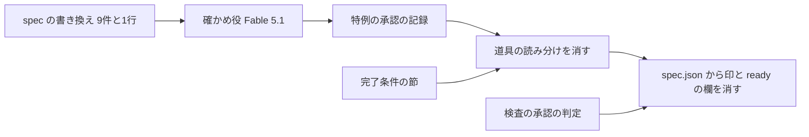
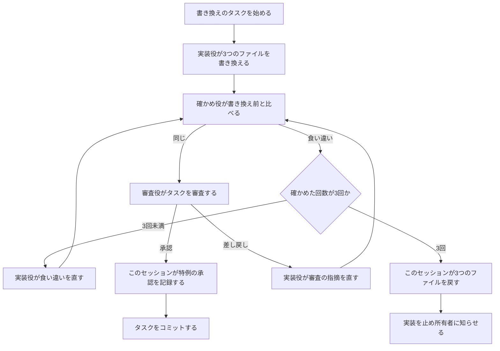

# 設計

## 概要

Claude は、この設計で、spec の書き方を新しい書き方の1つにそろえる。Claude は、古い書き方の spec 9件の requirements.md・design.md・tasks.md を新しい書き方に書き換え、Fable 5.1 のサブエージェント(確かめ役)に書き換えの前後を比べさせる。Claude は、確かめ役が中身が同じと確かめた段階を、Issue #477 の特例として、所有者が承認し直さないまま承認済みとして記録する。

Claude は、spec を扱うスキル・点検役・判定のスクリプトから、書き方の印 `spec_format` で読み分ける箇所を消し、古い名前を新しい名前に置き換える。古い書き方のためだけにある雛形(`.kiro/settings/templates/specs-v1/`)と EARS の決まり(`ears-format.md`)は消す。

あわせて、Claude は、#474 の実装で見つかった問題のうち、書き換えと別に残るものを直す。tasks.md の雛形の完了条件の節を書き直し、`/kiro-spec-tasks` の決まりが指す見出しを新しい design.md の雛形の見出しにし、PRの検査 `check-spec-backing.sh` が `ready_for_implementation` を読まないようにする。

## 作るものと作らないもの

### 作るもの

- 古い書き方の spec 9件(audit-automation、audit-inventory-metrics、audit-notification、container-image-vulnerability-scanning、issue-close-and-auto-merge-guarantee、machine-gated-dependency-updates、merge-queue-migration、spec-need-triage、spec-review)の requirements.md・design.md・tasks.md の書き換え
- spec-readable-writing の design.md の、雛形の説明に書かれた空欄の目印2つ(NUMBER と TITLE を二重の波括弧で囲んだもの)の書き換え
- 書き換えの確かめの手順と、確かめの記録 `reviews/rewrite-check.md`
- 特例の承認の記録のしかた(spec.json の承認の欄と `approval_history` の要素の書き方。新しい欄は足さない)
- spec を扱うスキル・点検役・判定のスクリプトから、書き方の読み分けを消す変更
- tasks.md の雛形の完了条件の節の書き直し
- `check-spec-backing.sh` の承認の判定の変更と、spec.json からの `ready_for_implementation` の削除

### 作らないもの

- research.md、`reviews/` の過去の審査の記録、`brief.md`、`pr-body.md` のように、requirements.md・design.md・tasks.md 以外の spec のファイルの書き換え
- 書き換える spec の記述のうち、今の仕組みと食い違う記述の手直し
- CLAUDE.md が使わないと決めたスキル(`/kiro-discovery`、`/kiro-validate-design`)の手直し
- steering の文書を扱う `/kiro-steering-custom` の手直し(この中の `Testing Strategy` は steering の見出しで、spec の名前ではない)
- `doc/インフラ設計/構成図/開発環境構成/開発環境構成図.drawio.svg` の中の EARS の文字(開発環境の図で、spec を扱う道具ではない)
- `.kiro/settings/rules/spec-writing.md` の見本1・見本2の本文(Issue #474 の本文からの引用で、spec-writing.md は見本に手を入れないと決めている)

## 使う既存の仕組み

- `/kiro-impl`: 書き換えと道具の直しを、タスクごとに実装役のサブエージェントと審査役のサブエージェントで進める
- Agent ツールの `model: "fable"`: 確かめ役を Fable 5.1 で起動する
- `.kiro/settings/rules/spec-writing.md` の決まりと新旧の見出しと目印の対応表: 書き換えの基準。Claude は、道具を直すタスクで対応表を消すまで、書き換えのタスクでこの表を使う
- git: 書き換え前の本文を `git show HEAD:<パス>` で取り出し、やめた spec を `git restore --source=HEAD -- <パス>` で戻す
- 所有者による写し: `.claude/hooks/` と `.github/` には Claude が書き込めない(`.claude/settings.json` の deny)。Claude が scratchpad に変更後のファイルを用意し、所有者が作業場所に写す

## 設計を見直すきっかけ

- cc-sdd の元のスキルを取り込み直すとき。取り込んだスキルは古い名前を使うので、Claude は新しい名前に置き換え直す
- spec の書き方を再び変えるとき。この設計は、書き方が1つだけであることを前提にしている
- 判定のスクリプト `spec-review-scan.sh` の「人の承認」の判定を変えるとき。この判定と特例の承認の関係は「書き換えの進め役」の節で決めている
- `approval_history` の要素の形を変えるとき。特例の承認の示し方は「書き換えの進め役」の節で決めている

## プロジェクトの決まりを守っているか

- 品質チェックの設定: Claude は `.claude/hooks/spec-review-scan.sh` と `.github/scripts/check-spec-backing.sh` を変える。これらはゲート設定にあたるので、Claude は、これらの変更をPR本文の冒頭に「人間承認が必要な変更」として書く。所有者が CODEOWNERS の承認を出すまで、このPRはマージされない。Claude は必須チェックを足さない
- 関係のない項目: backend のコードを置く層、frontend の機能ごとの境界、frontend の状態の持ち方、データベースの表の形、新しいライブラリの追加、使う外部の機能がこのリポジトリで使えるか

## 全体の構成



Claude は、書き換えを先に、道具の直しをあとに、spec.json の欄の削除を最後に置く。書き換えのあいだは、今の道具と新旧の対応表をそのまま使える。道具を先に直すと、書き換えの終わっていない spec を、直した道具が新しい書き方として読み違える。

**使う技術**:
- 実行環境: bash と perl(JSON::PP)。判定のスクリプトと検査のスクリプトの今の前提を変えない
- 検査: jq(`check-spec-backing.sh` が CI の中で使う。今のまま)

## ファイルの構成

確かめ役が新しく作るファイル:

- `.kiro/specs/<古い書き方の spec>/reviews/rewrite-check.md`(9件)と `.kiro/specs/spec-readable-writing/reviews/rewrite-check.md`: 確かめ役が書く記録。書式は「書き換えの確かめ役」の節にある

Claude が書き換えるファイル:

- `.kiro/specs/<古い書き方の spec>/requirements.md`・`design.md`・`tasks.md`(9件)と `.kiro/specs/spec-readable-writing/design.md`: 「書き換えの実装役」の節
- `.kiro/specs/*/spec.json`(この spec を含む11件): 「書き換えの進め役」の節と移行の節

Claude が変えるファイル(道具):

- `.claude/skills/kiro-spec-init/SKILL.md`: 「書き方を読み分けないスキルと点検役」の節。あわせて、`ready_for_implementation` に触れないよう指示する文(69行目)を消す
- `.claude/skills/kiro-spec-requirements/SKILL.md`、`rules/requirements-review-gate.md`: 同じ節
- `.claude/skills/kiro-spec-design/SKILL.md`、`rules/design-principles.md`、`rules/design-review-gate.md`、`rules/design-discovery-full.md`: 同じ節。あわせて、`design-discovery-full.md` の「EARS format」を「the numbered items of the requirements」にする
- `.claude/skills/kiro-spec-tasks/SKILL.md`、`rules/tasks-generation.md`、`rules/tasks-parallel-analysis.md`: 同じ節。あわせて、`tasks-generation.md` の42行目と181行目の「Architecture Pattern & Boundary Map」を「design.md の `## 作るものと作らないもの`、`## 部品`、`## ファイルの構成`」にする
- `.claude/skills/kiro-impl/SKILL.md`、`templates/implementer-prompt.md`、`templates/reviewer-prompt.md`、`.claude/skills/kiro-validate-impl/SKILL.md`、`.claude/skills/kiro-review/SKILL.md`、`.claude/skills/kiro-debug/SKILL.md`、`.claude/skills/kiro-spec-status/SKILL.md`、`.claude/skills/start/SKILL.md`: 同じ節
- `.claude/skills/kiro-spec-batch/SKILL.md`、`.claude/skills/kiro-spec-quick/SKILL.md`: 古い名前(`_Boundary:_` `_Depends:_` `(P)`)を新しい名前にする
- `.claude/skills/kiro-validate-gap/rules/gap-analysis.md`: 「From EARS requirements」を「From the numbered items of the requirements」にする
- `.claude/skills/spec-review/SKILL.md`、`rules/requirements.md`、`rules/design.md`、`rules/tasks.md`: 「書き方を読み分けないスキルと点検役」の節
- `.claude/agents/spec-style-checker.md`: 説明から `spec_format` の条件を消し、「今の名前」の列についての指示を消す
- `.kiro/settings/rules/spec-writing.md`、`.kiro/settings/templates/specs/init.json`、`CLAUDE.md`: 「spec-writing.md と雛形と CLAUDE.md」の節
- `.kiro/settings/templates/specs/tasks.md`: 「tasks.md の雛形の完了条件の節」の節

Claude が消すファイル:

- `.kiro/settings/templates/specs-v1/`(4つのファイル)
- `.claude/skills/kiro-spec-requirements/rules/ears-format.md`

所有者が写すファイル(Claude が scratchpad に用意する):

- `.claude/hooks/spec-review-scan.sh`、`.claude/hooks/tests/test-spec-review-scan.sh`
- `.github/scripts/check-spec-backing.sh`、`.github/scripts/tests/test-check-spec-backing.sh`

## 処理の流れ



書き換えのタスクは spec ごとに1つで、`/kiro-impl` は1つずつ進める。

## 部品

### 書き換えの実装役(`/kiro-impl` が書き換えのタスクで起動する実装役のサブエージェント)

対応する要件: 1.1, 1.2, 1.3, 1.4, 1.5, 1.6

**役割**: 実装役は、1つの spec の requirements.md・design.md・tasks.md を、`.kiro/settings/rules/spec-writing.md` の決まりと新旧の見出しと目印の対応表に沿って書き換える。実装役は、spec.json と `reviews/` には書き込まない。

**呼び出し方**: 書き換えのタスクを進めるこのセッション(書き換えの進め役)は、`/kiro-impl` の実装役の雛形に、次の書き換えの決まりを足して渡す。

- 実装役は、見出しと目印を、対応表の「新しい名前」の列のとおりにする。実装役は、要件を `### 要件N 題名`、理由の段落、番号付きの項目の順に組み立てる。実装役は、古い要件の `**Objective:**` の行を理由の段落に書き直し、受入基準を要件の番号付きの項目にする。実装役は、受入基準の番号を項目の番号として残す
- 実装役は、文を、spec-writing.md の文の書き方の節に沿って書き直す。実装役は、決めごとを足さず、削らない
- 実装役は、要件・受入基準・タスクの番号を変えず、`- [x]` の印を残す。実装役は、`(P)` を `(並行可)` に、`_Requirements:_` を `_要件:_` に、`_Boundary:_` を `_対象の部品:_` に、`_Depends:_` を `_依存:_` に、`_Blocked:_` を `_保留:_` に置き換える。実装役は、追加のIssueの印 `(#N)` をタスクの題名の末尾(`(並行可)` があるときはそのあと)に移す。実装役は、要件と受入基準の印 `(#N)` `(#N で変更)` `(#N で取りやめ)` を同じ項目に残す
- 実装役は、`## Project Description (Input)` の下の Issue の本文と追加の要望、spec が既存の文書から引用した部分の文字を変えない。実装役は、見出しだけを `## 元の要望` にする
- 実装役は、対応表で新しい名前が「なし」の節(`### Existing Architecture Analysis`、`## Supporting References`、`## Requirements Traceability`、`### Technology Stack` の表など)の中身を、同じファイルに残す。中身が各部品の「対応する要件」の行や全体の構成の節の「使う技術」の欄にすでに表れていれば、実装役は節を立てない。表れていなければ、実装役は、その中身を `## 既存の構成`、`## 参考にした資料` のような日本語の見出しの節として、移行の節の前に残す
- 実装役は、tasks.md の完了条件の節と注記のうち、spec ごとに足された文(契約の変更の扱い、静的な条件に限る注記など)を、中身を変えずに残す

spec-readable-writing の書き換えのタスクでは、実装役は design.md の189行目だけを書き換える。実装役は、その行の見出しの例の中の空欄の目印2つ(NUMBER と TITLE を二重の波括弧で囲んだもの)を、`### 要件N 題名` の `N` と `題名` にする。この spec の本文に空欄の目印の形をそのまま書くと、この spec も200行を超えるPRの検査で赤になる。そこで、Claude は、この節では目印の形を言葉で書く。`N` と `題名` は、spec-writing.md の対応表がこの見出しを指す書き方と同じである。

### 書き換えの確かめ役(Fable 5.1 で起動する汎用のサブエージェント)

対応する要件: 2.1, 2.2, 2.3, 2.4, 2.6

**役割**: 確かめ役は、1つの spec について、書き換え前と書き換え後の中身が同じかだけを確かめ、記録 `reviews/rewrite-check.md` に書く。確かめ役は、書き方の良し悪しと仕様の正しさを確かめない。確かめ役は、spec の本文と spec.json を書き換えない。

**いつ動くか**: 書き換えの実装役が READY_FOR_REVIEW を返したあと、このセッションが確かめ役を起動する。

**呼び出し方**: このセッションは、Agent ツールに `subagent_type: "general-purpose"` と `model: "fable"` を渡し、次の指示を渡す。

```text
あなたは spec の書き換えの確かめ役である。spec <feature> の次のファイルについて、書き換え前と書き換え後の中身が同じかだけを確かめる。
- 対象: .kiro/specs/<feature>/ の <requirements.md・design.md・tasks.md のうち書き換えたもの>
- 書き換え前: `git show HEAD:.kiro/specs/<feature>/<ファイル>` の出力。書き換え前の本文を正とする
- 書き換え後: 作業場所の .kiro/specs/<feature>/<ファイル>
比べる中身は、spec が決めたこと(要件と項目、設計で決めたこと、タスクとその完了の状態、番号、完了条件の節と注記に書かれた決めごと)である。
あなたは、.kiro/settings/rules/spec-writing.md が求める書き方の違い(見出しと目印の名前、節の並び、文の形、利用者の立場を名乗る行を書き直した理由の段落)を、食い違いとして扱わない。
書き方の良し悪し、仕様の正しさ、今の仕組みとの食い違いは確かめない。
結果を .kiro/specs/<feature>/reviews/rewrite-check.md の末尾に、決められた書式で書き足す。前に書いた節は書き換えない。spec の本文と spec.json は書き換えない。
最後の応答の末尾に、次のブロックだけを出す。MODEL には、あなたのモデルの名前と ID を書く。
- FEATURE: <feature>
- ROUND: <回数>
- MODEL: <モデルの名前と ID>
- RESULT: same | different
```

Agent ツールの `model` の引数は、`sonnet` `opus` `haiku` `fable` の4つの値だけを受け付け、`fable` は Fable 5.1 を指す。完全なID(`claude-fable-5-1`)は受け付けない。このセッションは、応答の `MODEL:` の行が Fable 5.1(`claude-fable-5-1`)であることを確かめる。ほかのモデルが書かれていたら、このセッションはその回の結果を使わずに実装を止め、確かめ役がほかのモデルで動いたことを所有者に知らせる。

**状態の持ち方**: 記録 `reviews/rewrite-check.md` の書式は次のとおりである。確かめ役は、1回の確かめにつき節を1つ書き足す。

```markdown
## 確かめ <回数>回目 <UTC の ISO 8601 の日時>

- 書き換え前: `HEAD` <コミットの短いハッシュ>
- 対象: requirements.md, design.md, tasks.md
- 結果: 同じ | 食い違いあり

| ファイル | 書き換え後の記述 | 書き換え前の記述 | 食い違いの中身 |
|---|---|---|---|
```

食い違いが無いときは、確かめ役は表を書かない。

**失敗したとき**: 応答に `- RESULT:` の行が無いときは、このセッションは、ブロックだけを出させる起動を1回行う。この起動では、確かめ役は記録に書き足さない。

### 書き換えの進め役(書き換えのタスクを進めるこのセッション)

対応する要件: 2.4, 2.5, 3.1, 3.2, 3.3, 3.4, 3.6, 4.5

**役割**: このセッションは、`/kiro-impl` の手順のうち、書き換えのタスクでだけ、実装役の後に確かめ役を起動し、結果に応じて承認を記録するか spec を戻す。

**呼び出し方**:

- このセッションは、確かめの回数を spec ごとに数え、前の spec の回数を持ち越さない
- 確かめ役が `RESULT: different` を返し、回数が3回未満なら、このセッションは記録の最新の節を実装役に渡して直させ、確かめ役をもう一度起動する
- 3回目も `different` なら、このセッションは `git restore --source=HEAD -- .kiro/specs/<feature>/requirements.md .kiro/specs/<feature>/design.md .kiro/specs/<feature>/tasks.md` で本文を戻す。このセッションは、記録 `rewrite-check.md` を残し、spec.json を書き換えない。このセッションは、tasks.md のそのタスクに `_保留: 書き換えの前後で中身が同じと確かめられなかった_` を付け、実装を止めて所有者に知らせる
- 確かめ役が `RESULT: same` を返したら、このセッションは `/kiro-impl` の審査役を起動する。審査役が差し戻したら、このセッションは実装役に直させ、確かめ役をもう一度起動する。このセッションは、この確かめも3回の数に入れる
- 審査役が承認し、最後の確かめが今の本文について `RESULT: same` なら、このセッションは、コミットの前に、書き換えた段階ごとに spec.json を次の順に書き換える

1. このセッションは、`approval_history`(無ければ作る)に、書き換える前の承認を1つの要素として足す
   ```json
   {
     "stage": "design",
     "approved_by": "<書き換える前の approved_by>",
     "approved_at": "<書き換える前の approved_at>",
     "issues": [<issue>, <additional_issues の各番号>],
     "revoked_at": "<記録する時点の UTC の ISO 8601>",
     "revoked_for": "Issue #477 の特例: 新しい書き方へ書き換えた。書き換えの前後で中身が同じと Fable 5.1 が確かめた(reviews/rewrite-check.md)。この時点からの承認は特例によるもので、所有者は本文を読んで承認し直していない"
   }
   ```
2. このセッションは、その段階の `approved` を true のまま、`approved_by` を `"DogisRiki"`、`approved_at` を記録する時点の日時(1の `revoked_at` と同じ値)にする。このセッションは、承認の欄に新しい欄を足さない

本文を書き換えなかった段階(spec-readable-writing の requirements と tasks)では、このセッションは spec.json を書き換えない。このセッションは、`amendments` の欄を書き換えない。

`approved_by` を `"DogisRiki"` にするのは、特例を決めたのが所有者だからである。`approved_by` に ':' を含む値を入れると、判定のスクリプトが人の承認でないと見て、書き換えた段階を審査の対象に戻してしまう。spec.json では、`approval_history` の要素の `revoked_for` が、その段階の今の承認が特例によるものであることを示す。今の承認の `approved_at` と、その要素の `revoked_at` は同じ値になる。

### 書き方を読み分けないスキルと点検役(`.claude/skills/` と `.claude/agents/` の変更)

対応する要件: 4.2, 4.3, 4.4, 6.1

**役割**: spec を書くスキル、読むスキル、審査のスキル、点検役は、新しい書き方の名前だけを使う。Claude は、各ファイルの「`spec_format` が2の spec では…」「`spec_format` の欄が無い spec では…」の分かれ道を消し、新しい書き方の指示を本文にする。Claude は、cc-sdd から取り込んだ英語の指示の中の古い名前(`_Boundary:_`、`File Structure Plan`、`Boundary Commitments` など)を、spec-writing.md の対応表の新しい名前に置き換える。

Claude は、`/kiro-spec-init` の更新の形が起点にする見出しを、`## 元の要望` で始まる行だけにする。`/kiro-spec-init` は、新しい spec の spec.json に `spec_format` を書かない。`/kiro-spec-init` の更新の形と `/spec-review` の差し戻しの、承認を `approval_history` に写して取り消す手順は変えない。

`/spec-review` は、点検役の工程(Step 1.5)をすべての spec で行う。`/spec-review` は、報告の「書き方の点検」の行も、すべての spec で出す。

### spec-review-scan.sh(作業を止める判定のスクリプト)

対応する要件: 3.5, 4.2

**役割**: 判定のスクリプトは、生成済みで人の承認の無い段階について、点検の記録 `reviews/{段階}-style.md` を、spec.json の欄に依らず確かめる。判定のスクリプトは、`spec_format` を読まない。

**呼び出し方**: Claude は、157〜165行目の判定を、条件 `if [ "$(_sr_json "$spec_json" spec_format)" = "2" ]` を外して常に行う形にする。理由の文言(「書き方の点検の記録がない」「本文が書き方の点検より新しい」)は変えない。

Claude は、試験 `test-spec-review-scan.sh` を次のように変える。

- 場合1を「印の無い spec でも、点検の記録が無ければ「書き方の点検の記録がない」を出す」に変える。これは試験の期待を意図して変える変更なので、Claude はPR本文に `Test-Change-Justification:` を書く
- 場合2〜5bの spec.json から `"spec_format":2` を消す。期待は変えない
- 場合6を足す。判定のスクリプトは、`approved` が true、`approved_by` が `DogisRiki` で、`approval_history` に特例の要素を持つ段階では、点検の記録が無くても点検についての理由を出さない

### check-spec-backing.sh(200行を超えるPRの spec を確かめる検査)

対応する要件: 7.1, 7.2, 7.3, 3.5

**役割**: 検査は、spec.json の requirements・design・tasks の `approved` がすべて true なら、承認がそろっていると判定する。検査は `ready_for_implementation` を読まない。

**呼び出し方**: Claude は、74〜79行目の jq の式から `and (.ready_for_implementation == true)` を消す。Claude は、失敗の文言を「spec.json の3段階承認が完了していません(approvals.*.approved がすべて true である必要があります)。…」にし、14行目の説明の注記からも `ready_for_implementation` を消す。

Claude は、試験 `test-check-spec-backing.sh` を次のように変える。

- `write_spec_json` の4つ目の引数と `ready_for_implementation` の欄を消す
- 場合「ready_for_implementation が false」を消し、「3段階が承認済みなら ready_for_implementation の欄が無くても通る」(期待 0)と「ready_for_implementation が false でも3段階が承認済みなら通る」(期待 0)を足す。これは期待を意図して変える変更なので、Claude はPR本文に `Test-Change-Justification:` を書く
- 場合「requirements が未承認」(期待 1)を足す
- `m_no_approvals_key` の spec.json を `{}` にする

### tasks.md の雛形の完了条件の節(`.kiro/settings/templates/specs/tasks.md` の中の、どのタスクにも共通の完了条件を定める節)

対応する要件: 5.1, 5.2, 5.3, 5.4

**変えること**: Claude は、節の本文を次の文に置き換える。決めごとは今の4項目のままである。

```markdown
## 完了条件(全タスク共通)

Claude は、どのタスクでも、タスクの箇条書きの欄を書いたうえで、次の4つを満たしたときにタスクを完了とする。

1. Claude は、タスクが満たす requirements.md の受入基準(要件の番号付きの項目)ごとに、それを確かめるテストのファイル名とテスト名を「受入基準とテストの対応」の行に書く。Claude は、確かめるテストの無い受入基準を残さない。
2. タスクで変えた領域の verify のスキル(`/verify-frontend` `/verify-backend` `/verify-terraform`)が、すべて成功している。
3. Claude は、テストを飛ばす設定、アサーションの削除、カバレッジや lint の対象からの除外を足して、完了条件を満たしたように見せない。CI の escape-hatch の検査が、これらの追加を機械で見つける。
4. Claude は、新しく書いたテストについて、テストの対象のコードを一時的に壊してテストが失敗することを確かめてから、コードを元に戻す。
```

### spec-writing.md と雛形と CLAUDE.md(書き方の決まり、spec の雛形、プロジェクトの指示の文書の変更)

対応する要件: 4.1, 4.3, 4.4

**変えること**: Claude は、spec-writing.md の冒頭の段落を「このファイルの決まりは、すべての spec に当てはまる。」とし、印と `ears-format.md` と `specs-v1/` の記述を消す。Claude は、新旧の見出しと目印の対応表を、列「文書」「見出しと目印」だけの「見出しと目印の一覧」に置き換え、「なし」の行を消す。Claude は、表を指していたスキルの文を、「見出しと目印の一覧」を指すようにする。

Claude は、`init.json` から `spec_format` と `ready_for_implementation` の欄を消す。Claude は、`specs-v1/` と `ears-format.md` を消す。

Claude は、CLAUDE.md の「spec の書き方の基準」の項目から印の条件を消し、`/spec-review` の項目から「新しい書き方の spec では」の条件を消す。Claude は、Issueの印の節を新しい名前(`_要件:_`、`(並行可)`)だけで書き、古い名前と置き換えの説明を消す。

## 失敗したときの扱い

- 書き換えの確かめが3回とも食い違ったとき: 古い書き方の spec が1件でも残るあいだは印と読み分けが要るので、Claude は、ほかの spec の書き換えと特例の承認の記録をブランチに残したまま、道具の直しにも欄の削除にも進まず、`/ship` もしない。所有者が進め方を決めたら、Claude はそれに従う
- 所有者が写したファイルが Claude の用意した版と違うとき: Claude は、写したファイルと scratchpad の版を `diff` で比べ、違えば写し直しを所有者に頼む

## テストの方針

- 判定のスクリプトの試験(`test-spec-review-scan.sh`、コンテナの中で流す): 特例で承認済みにした spec を、所有者が承認した spec と同じく承認済みとして扱うこと(要件3の5)と、spec の書き方を見分けないこと(要件4の2)を、spec-review-scan.sh の節に書いた場合で確かめる
- 検査の試験(`test-check-spec-backing.sh`、コンテナの中で流す): 3つの段階がすべて承認された spec を、承認がそろっていると判定すること。どれかの段階が承認されていない spec と、開き直して承認が取り消された spec を、承認がそろっていないと判定すること(要件7の1〜3)。これらを、check-spec-backing.sh の節に書いた場合で確かめる。プレースホルダの検査(本文に書き込まれずに残った空欄の目印を見つける検査)の場合は今のまま通ることも確かめる
- 書き換えの確かめ: 確かめ役の記録 `rewrite-check.md` の最後の節が「結果: 同じ」であること(書き換えの前後で中身が同じかを Fable 5.1 が確かめること。要件2)。spec.json の `approval_history` に、書き換えた段階ごとに、書き換える前の承認と特例の理由を書いた要素が1つずつあること(中身が同じと確かめた spec を承認済みとして記録すること。要件3)
- 道具に古い書き方が残っていないことの確かめ: `grep -rn "spec_format" .claude .kiro/settings CLAUDE.md` と `grep -rnE "_Boundary:_|_Requirements:_|_Depends:_|_Blocked:_|\(P\)|File Structure Plan|Boundary Commitments|Acceptance Criteria" .claude/skills .claude/agents .kiro/settings CLAUDE.md` の出力が、作らないものに挙げたファイルだけであること(spec を扱う道具が spec の書き方を見分けないこと。要件4の2)。`grep -rn spec_format .kiro/specs/*/spec.json` と `grep -rn ready_for_implementation .kiro/specs/*/spec.json` の出力が無いこと(すべての spec.json から印 `spec_format` を消すこと。要件4の1)
- 雛形の確かめ: tasks.md の雛形の完了条件の節に「上記フォーマット」「detail item」「受け入れ基準」が無いこと(完了条件の節を分かる言葉で書くこと。要件5)、`tasks-generation.md` に「Architecture Pattern & Boundary Map」が無いこと(タスクを作る決まりが、設計の雛形にある見出しを指すこと。要件6)
- 書き換えた spec の検査: 書き換えた10件の spec の4つのファイルに、`check-spec-backing.sh` のプレースホルダの形 `\{\{[A-Z0-9_]+\}\}` が無いこと(雛形の説明のための文字を、書き込まれずに残った空欄と取り違えられない書き方にすること。要件1の5)

## 移行

対応する要件: 4.1

すべての書き換えの確かめと道具の直しが終わったら、Claude は、最後のタスクで、`.kiro/specs/*/spec.json` のすべてから `spec_format` と `ready_for_implementation` の欄を消す。Claude は、ほかの欄を変えない。この spec 自身の spec.json も対象にする。
