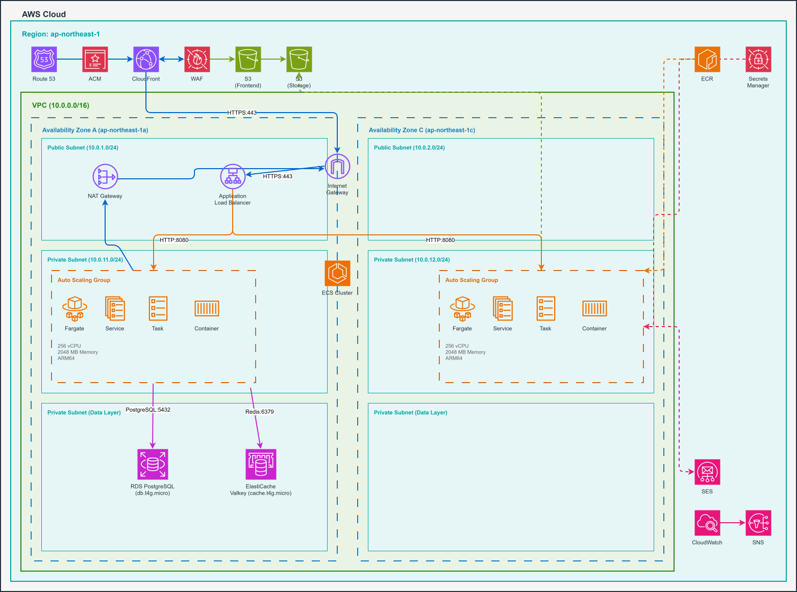
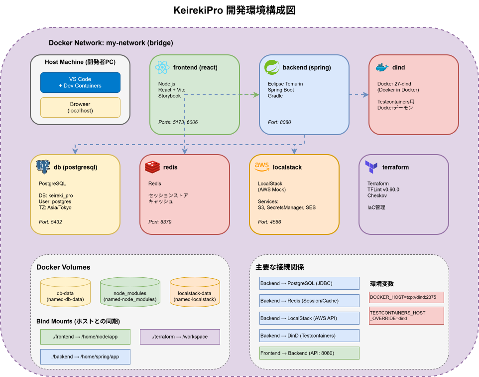
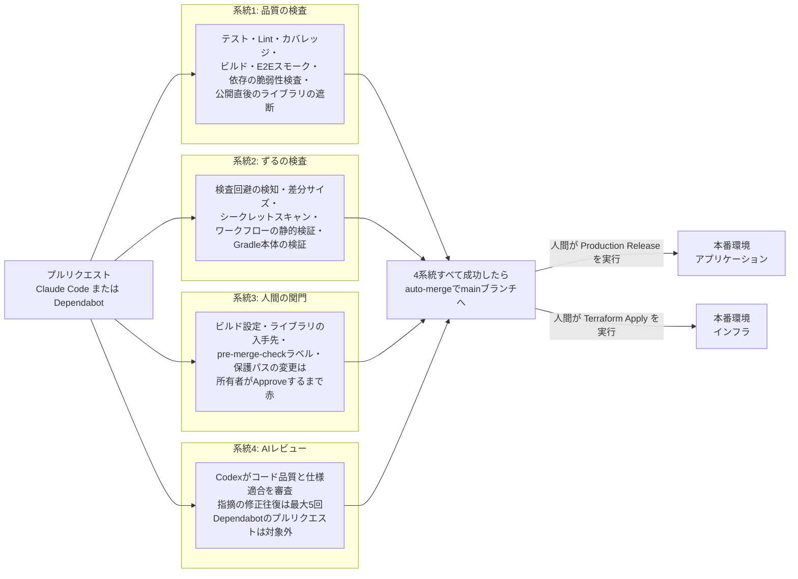
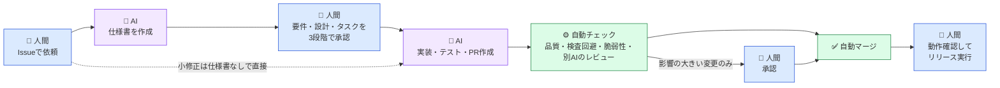

# KeirekiPro

エンジニア向け職務経歴書作成Webアプリケーション

## 概要

エンジニアが職務経歴書を効率的に作成・管理するためのWebアプリケーションです。
プロジェクトごとの技術スタックや実績を詳細に記録し、職務経歴書のプレビュー確認、PDF／Markdown形式での出力、バックアップ／リストアができます。

**URL**: https://app.keirekipro.click

## アーキテクチャ

### 本番環境構成



| レイヤー | サービス | 用途 |
|---------|---------|------|
| CDN/WAF | CloudFront, WAF | コンテンツ配信、DDoS対策、SQLインジェクション対策 |
| フロントエンド | S3 | React SPAホスティング |
| ロードバランサー | ALB | HTTPS終端、リクエスト振り分け |
| コンピューティング | ECS Fargate | バックエンドAPIコンテナ実行 |
| データベース | RDS PostgreSQL | データ永続化 |
| キャッシュ | ElastiCache for Valkey | 2FAコード・パスワードリセットトークン・OIDCセッション等の一時保存 |
| ストレージ | S3 | プロフィール画像等の保存 |
| メール | SES | メール認証、パスワードリセット、各種通知 |
| DNS/証明書 | Route 53, ACM | ドメイン管理、SSL/TLS証明書 |
| シークレット管理 | Secrets Manager | 認証情報の安全な管理 |
| 監視 | CloudWatch | ログ収集、メトリクス監視 |

### 開発環境構成

Docker Composeで7コンテナを起動し、DevContainerで開発を行います。



| コンテナ | 用途 |
|---------|------|
| backend (Spring Boot) | バックエンドAPI開発 |
| frontend (React) | フロントエンド開発 |
| terraform | IaC開発 |
| db (PostgreSQL) | データベース |
| redis | キャッシュ |
| localstack | AWS サービスエミュレーション（S3, Secrets Manager, SES） |
| dind | Testcontainers用Docker-in-Docker |

### CI/CDパイプライン

GitHub ActionsとAWS OIDCを組み合わせた、セキュアで効率的なCI/CDパイプラインを構築しています。
プルリクエストは4つの系統で並列に検査され、流れの骨格は次のとおりです。



4つの系統がすべて緑になるまで、プルリクエストはマージされません。mainが進むとプルリクエストのブランチは自動で最新化され、検査が再実行されます。マージされても本番への反映は行われず、人間による手動実行だけが本番を更新できます。

各ワークフローの詳細は次のとおりです。

| 系統 | ワークフロー名 | 発火条件 | 役割 |
|---|---|---|---|
| 品質の検査 | ci.yaml | push (main) / pull_request | paths-filterによる変更検知。Frontendはフォーマット・Lint・テスト・カバレッジ・ビルドとPlaywrightによるスモークテスト、BackendはGradle checkを実行。Dockerfileが変わった場合はそのイメージをビルドして確認する。mainへのpush時はデプロイ用成果物を保存 |
| 品質の検査 | terraform-plan.yaml | pull_request | paths-filterによる変更検知。フォーマット・Validate・tflint・checkovによる静的検査(AWS認証不要)と、Terraform Planの実行および結果のPRコメント。terraform関連の変更が無いPRでは各ジョブをスキップする |
| 品質の検査 | dependency-review.yaml | pull_request | 依存の検査。backendの依存グラフを生成するジョブと送信するジョブを権限を分けて実行し、baseとheadの依存グラフを比較して、そのPRで新しく増えた脆弱性と、公開から72時間を経過していないライブラリを落とす。フォークPRでは送信ジョブをスキップし、frontendのみを検査する |
| 品質の検査 | dependency-graph.yaml | push (main) | mainの依存グラフをGitHubへ送信。dependency-review.yamlが比較する基準側のスナップショットを用意し、あわせてbackendのDependabotアラートを有効にする |
| ずるの検査 | guardrails.yaml | pull_request / pull_request_review | テスト無効化や検査回避にあたる変更の検知、差分サイズの検査(上限超過時はspecの実在・必須ファイル・承認状態を検証)、ワークフローの静的検証(actionlint)とアクション参照のSHA固定の検査、リリースゲートのテスト、DBマイグレーションのラベル付け、シークレットスキャン、品質レポート(未使用コード・重複・Javaテストの検証有無)の生成、Gradle本体が公式のものかの検証 |
| 人間の関門 | dependency-gate.yaml | pull_request / pull_request_review | `.npmrc`・`.pnpmfile.cjs`・`pnpm-workspace.yaml`・`*.gradle` の変更を検知し、リポジトリ所有者が承認するまでマージを保留。ライブラリのバージョンを上げるだけの変更は対象外 |
| 人間の関門 | pre-merge-check.yaml | pull_request / pull_request_review | pre-merge-checkラベルの付いたPRを、所有者がローカル確認して承認するまでマージ保留 |
| 人間の関門 | rerun-approval-gated-checks.yaml | pull_request_review (approved) | 承認前に失敗したままのゲートチェックを再実行し、承認結果を反映させる |
| AIレビュー | codex-review.yml | pull_request | Codexによる自動コードレビュー。コード品質と仕様への適合を審査し、問題があればマージをブロック |
| 依存の更新 | dependabot-auto-merge.yaml | pull_request | Dependabotが作成したプルリクエストにauto-mergeを予約する |
| 依存の更新 | update-pr-branches.yaml | push (main) | 開いているプルリクエストのブランチをmainの最新に合わせる |
| リリース | release.yaml | 手動 (workflow_dispatch) | アプリの本番リリース。mainブランチからの起動に限り、CIが成功したコミットを対象にbackend、frontendの順に配布 |
| リリース | terraform-apply.yaml | 手動 (workflow_dispatch) | インフラの本番反映。apply直前にplanで差分を表示し、そのplanをそのまま適用 |
| リリース | backend-deploy.yaml | 呼び出し専用 (workflow_call) | ECSへのバックエンドデプロイ(release.yamlから呼び出し) |
| リリース | frontend-deploy.yaml | 呼び出し専用 (workflow_call) | S3配布とCloudFrontキャッシュ無効化(release.yaml / frontend-rollback.yamlから呼び出し) |
| リリース | frontend-rollback.yaml | 手動 (workflow_dispatch) | 成功済みmain CI runの`frontend-dist`を検証して再配布 |
| 定期 | mutation-report.yaml | 週次 (schedule) / 手動 | Stryker(frontend)とPIT(backend)によるテスト有効性の測定レポート |
| 定期 | canary.yaml | 月次 (schedule) / 手動 | 検査の仕組み自体が機能しているかを確かめるための、意図的に問題を含むPRの自動生成 |

依存パッケージの更新はDependabotが担当します。設定は`.github/dependabot.yml`にあります。backend(Gradle)とDockerのベースイメージは週次でメジャー更新を除いたバージョン更新、GitHub Actionsのアクションは月次でメジャー更新も含めたバージョン更新のプルリクエストを作成します。frontend(npm)はバージョン更新の対象に含めていません。脆弱性が検知された場合は、スケジュールに関係なく、frontendを含めて修正のプルリクエストの作成が試みられます。Dependabotのプルリクエストにもauto-mergeが予約され、検査がすべて緑になった時点でマージされます(`.github/workflows/`を変更するGitHub Actionsの更新のみ、CODEOWNERSにより所有者の承認後にマージされます)。

本番リリースは、release.yamlを人間が手動で実行したときにのみ行われます。対象はmainブランチのCIが成功したコミットに限られ、featureブランチからは起動できません。frontendとbackendの両方をリリースする場合はbackend、frontendの順にデプロイし、backendのデプロイに失敗した場合はfrontendを公開しません。frontendの公開に失敗した場合は、成功済みのartifactを再配布して復旧します。

| 特徴 | 説明 |
|------|------|
| OIDC認証 | GitHub ActionsからAWSへのアクセスキーレス認証 |
| 変更検知 | paths-filterによる変更ファイルに応じた条件付き実行 |
| 検証済みリリース | 本番デプロイの対象は、CIがすべて成功したmainブランチの成果物に限定される |
| Build once / Deploy same artifact | Frontendのproduction buildをCIで行い、検証済みartifactを配布・rollbackに再利用 |
| ローリングアップデート | ECSサービスの無停止デプロイと回路ブレーカーによるbackend自動rollback |
| キャッシュ無効化 | フロントエンド配布・rollback時のCloudFrontキャッシュ自動無効化 |
| State管理 | Terraform StateのS3保存とDynamoDBによるロック制御 |

### セキュリティ対策

- CloudFront → ALB間のオリジン検証（カスタムヘッダー）
- WAFによるAWSマネージドルール適用（SQLi、XSS、悪意あるBot対策）
- プライベートサブネットへのバックエンド配置
- Secrets Managerによる認証情報の一元管理
- HTTPS強制、HttpOnly/Secure Cookie設定
- CSRF対策（トークンベース）
- 認証トークンのサーバー側失効制御

## 技術スタック

### フロントエンド

| カテゴリ | 技術 |
|---------|------|
| 言語 | TypeScript |
| フレームワーク | React 19 |
| ビルドツール | Vite |
| パッケージマネージャー | pnpm |
| 状態管理 | Zustand, TanStack Query |
| UIライブラリ | MUI (Material-UI) |
| ルーティング | React Router v8 |
| テスト | Vitest, Testing Library |
| カバレッジ | Vitest Coverage V8 |
| リンター | ESLint |
| フォーマッター | Prettier, prettier-plugin-organize-imports |
| コード生成 | Hygen |
| アナリティクス | Google Analytics 4 |

### バックエンド

| カテゴリ | 技術 |
|---------|------|
| 言語 | Java 21 |
| フレームワーク | Spring Boot 3.4 |
| データアクセス | MyBatis |
| マイグレーション | Flyway |
| 認証 | Spring Security, JWT (java-jwt) |
| PDF生成 | OpenHTMLtoPDF |
| テンプレートエンジン | Thymeleaf, FreeMarker |
| AWS連携 | Spring Cloud AWS (S3, SES, Secrets Manager) |
| API仕様 | Springdoc OpenAPI (Swagger UI) |
| 監視/トレーシング | Spring Boot Actuator, Micrometer, OpenTelemetry |
| テスト | JUnit 5, Mockito, AssertJ, Testcontainers |
| アーキテクチャテスト | ArchUnit |
| カバレッジ | JaCoCo |
| ビルドツール | Gradle |
| 静的解析 | Checkstyle, SpotBugs |
| フォーマッター | Spotless, Eclipse Formatter |

### インフラ/DevOps

| カテゴリ | 技術 |
|---------|------|
| クラウド | AWS |
| IaC | Terraform |
| CI/CD | GitHub Actions |
| コンテナ | Docker, ECR, ECS Fargate |
| 監視 | CloudWatch Logs |
| 静的解析 | tflint, Checkov |

## 設計

### バックエンド: オニオンアーキテクチャ + DDD + CQRS

ドメイン駆動設計に基づき、関心の分離を徹底した多層構造を採用しています。

```
backend/src/main/java/com/example/keirekipro/
├── domain/           # ドメイン層
│   ├── model/        #   エンティティ、値オブジェクト、集約
│   ├── repository/   #   リポジトリインターフェース
│   ├── service/      #   ドメインサービス
│   ├── policy/       #   ドメインポリシー
│   ├── event/        #   ドメインイベント
│   └── shared/       #   基底クラス、共通例外
├── usecase/          # ユースケース層
│   ├── auth/         #   認証関連ユースケース
│   ├── resume/       #   職務経歴書関連ユースケース
│   ├── user/         #   ユーザー関連ユースケース
│   ├── query/        #   参照系クエリ（CQRS）
│   └── shared/       #   共通インターフェース
├── infrastructure/   # インフラ層
│   ├── repository/   #   リポジトリ実装（MyBatis）
│   ├── query/        #   クエリ実装（CQRS）
│   ├── auth/         #   OIDC連携
│   ├── event/        #   ドメインイベントリスナー
│   ├── export/       #   PDF/Markdown出力
│   ├── logging/      #   ユースケースロギング
│   ├── store/        #   Redisストア実装
│   └── shared/       #   AWS連携、Redis設定、通知
├── presentation/     # プレゼンテーション層
│   ├── */controller/ #   RESTコントローラー
│   ├── */dto/        #   リクエスト/レスポンスDTO
│   ├── security/     #   認証フィルター、JWT
│   └── shared/       #   例外ハンドラー、バリデーター
└── shared/           # アプリケーション共通
    ├── config/       #   設定クラス
    ├── exception/    #   基底例外
    └── utils/        #   ユーティリティ
```

### フロントエンド: Bulletproof React

機能ベースのモジュール設計を採用し、関心の分離とスケーラビリティを確保しています。

```
frontend/src/
├── features/              # 機能モジュール
│   ├── auth/              #   認証
│   ├── resume/            #   職務経歴書
│   ├── user/              #   ユーザー設定
│   └── contact/           #   お問い合わせ
│       （各featureは以下のサブディレクトリを持つ）
│         ├── api/         #     API通信
│         ├── components/  #     コンポーネント
│         ├── hooks/       #     カスタムフック
│         ├── stores/      #     状態管理
│         ├── types/       #     型定義
│         └── utils/       #     ユーティリティ
├── components/            # 共通コンポーネント
│   ├── ui/                #   ボタン、テキストフィールド等
│   ├── dnd/               #   ドラッグ&ドロップ
│   ├── layouts/           #   レイアウト
│   └── errors/            #   エラー表示
├── config/                # 設定（環境変数、テーマ、パス定義）
├── hooks/                 # 共通フック
├── stores/                # グローバルストア
├── lib/                   # クライアント設定
├── pages/                 # ページコンポーネント
├── routes/                # ルーティング定義
├── providers/             # プロバイダー
├── types/                 # 共通型定義
└── utils/                 # ユーティリティ
```

## 規模

| 項目 | 数量 |
|------|------|
| APIエンドポイント | 48 |
| データベーステーブル | 17 |

## ディレクトリ構成

```
keirekipro/
├── frontend/                 # フロントエンド (React/TypeScript)
├── backend/                  # バックエンド (Spring Boot/Java)
│   └── gradle/quality.gradle #   品質チェックの設定(CODEOWNERS保護)
├── terraform/                # インフラ定義
├── .github/                  # CI/CDと品質検査のワークフロー(CODEOWNERS保護)
│   ├── workflows/            #   CI・品質検査・AIレビュー・リリース・定期実行の各定義
│   ├── scripts/              #   ワークフローから呼び出す検査スクリプト
│   └── CODEOWNERS            #   保護対象ファイルの定義
├── .claude/                  # Claude Codeの設定(スキル・フック)
├── .kiro/                    # spec駆動開発の仕様書とプロジェクト知識
├── docker/                   # Docker設定
├── doc/                      # 設計ドキュメント・開発フロー・監査手順
├── CLAUDE.md                 # AIエージェント向けプロジェクトガイド
├── REVIEW.md                 # /code-review のカスタマイズ
└── compose.yaml
```

## 開発スタイル(AI駆動開発)

本プロジェクトでは、AIコーディングエージェントのClaude Codeが実装からマージまでを担う、自動化された開発パイプラインを採用しています。人間はコードそのものをレビューせず、仕様の判断とリリースの判断に専念します。コードの品質は、テスト・静的解析・カバレッジ基準・別のAIによるレビューといった自動チェックの積み重ねで担保します。

開発の流れは次のとおりです。人間が手を動かすのは青の4箇所だけで、それ以外はAIと自動チェックが進めます。



青 = 人間、紫 = AI、緑 = 自動。マージまでのコード作業に人間は一切関与せず、本番反映は人間の手動実行だけが行えます。

仕様づくりは、AIが書いた文書を確認しながらチャットのコマンドで進めます。コマンドの実行がそのまま前段階の承認になります。

| 順 | 操作 | 起きること |
|---|---|---|
| 1 | `/kiro-spec-init #Issue番号` | AIがIssueを読んで説明文を組み立て、`.kiro/specs/{feature名}/` を用意してfeature名を知らせる |
| 2 | `/kiro-spec-requirements {feature名}` | AIが要件(requirements.md)を書く → 内容を確認する |
| 3 | `/kiro-spec-design {feature名}` | 要件を承認したことになり、AIが設計(design.md)を書く → 内容を確認する |
| 4 | `/kiro-spec-tasks {feature名}` | 設計を承認したことになり、AIがタスク(tasks.md)を書く → 内容を確認する |
| 5 | `/kiro-impl {feature名}` | タスクを承認したことになり、AIが実装を始める。以降マージまで自動で進む |

運用の詳細は次のドキュメントにまとめています。

- [監査手順](doc/開発フロー/監査手順.md)
- [基盤構築手順](doc/開発フロー/基盤構築手順.md)
- [参加者セットアップ手順](doc/開発フロー/参加者セットアップ手順.md)

### 人間とAIの分担

人間が行うのは次の5つです。

| 人間の作業 | 内容 |
|---|---|
| 作るものを決める | 何を作るか・何を直すかを決めて、Issueとして起票する(1〜2行でよく、詳細化はAIが行う) |
| 仕様を承認する | spec駆動開発で作成される要件・設計・タスクのドキュメントを読んで承認する(コードではなく仕様を判断する) |
| 仕組みを監査する | 自動チェックが正しく機能し続けているかを週次・月次で確認し、すり抜けた問題はチェックの追加・強化につなげる([監査手順](doc/開発フロー/監査手順.md)) |
| 影響の大きい変更を承認する | DBマイグレーション・ビルド設定・ライブラリの入手先・チェック設定の変更を含むプルリクエストに限り、承認ボタンを押す |
| リリースを判断する | 本番デプロイの前にローカル環境で動作を確かめ、問題がなければデプロイを手動で実行する |

それ以外の作業(実装・テスト・コミット・プルリクエストの作成・レビュー指摘への対応)はClaude Codeが行います。プルリクエストは、Codexによる自動レビューがコード品質と仕様適合の両方を問題なしと判定し、CIの必須チェックがすべて成功すると、自動的にマージされます。

### 開発の進め方

| 変更の種類 | 進め方 |
|---|---|
| 新機能・大きな変更 | cc-sddによるspec駆動開発。要件定義・設計・タスク分解の各ドキュメントを人間が承認したうえで、Claude Codeが自律的に実装する |
| 小規模な修正 | Issueをもとに直接実装する。コード差分が200行を超える場合はCIが検知し、spec駆動での進行を求める |
| 定常メンテナンス | 定期実行の仕組みが、品質チェック・依存パッケージの更新・プルリクエストの監視などを自動で行う |

### 品質を担保する仕組み

人間がコードをレビューしない代わりに、次の自動チェックを何層にも重ねています。

| 仕組み | 内容 |
|---|------|
| テストとカバレッジ基準 | VitestとJUnit(Testcontainers)によるテストに加え、カバレッジが基準値を下回るとCIが失敗する |
| 静的解析 | ESLint・TypeScript・ArchUnit・Checkstyle・SpotBugs・tflint・Checkovで、アーキテクチャ境界の違反やコードの問題を機械的に検査する |
| 検査回避の検知 | テストのスキップ化・アサーションの削除・型チェックの抑止コメントなど、チェックを形だけ通すための変更をCIが検知して失敗させる |
| 別のAIによるレビュー | 実装したClaude Codeとは別系統のAIであるCodexが、すべてのプルリクエストをレビューする。レビュアーには過去の指摘を渡さず、毎回まっさらな状態で審査させる。指摘への対応は自動で行い、5往復で機械的に打ち切って人間が判断する |
| 影響の大きい変更の承認 | DBマイグレーション・ビルド設定・ライブラリの入手先・品質チェック設定の変更は、人間が承認しなければマージされない |
| チェック設定自体の保護 | 品質チェックの設定ファイルはCODEOWNERSで保護されており、AIエージェントが自分の判断で変更することはできない |
| リリースの分離 | mainブランチへのマージだけでは本番に反映されず、デプロイは人間が手動で実行する |
| 定期的な健全性確認 | 問題のある変更をわざと含めたプルリクエストを毎月自動生成し、チェックの仕組みが正しく検知できることを確かめる |

### 利用しているMCP

| MCP | 用途 |
|-----|------|
| Context7 MCP | ライブラリ・フレームワークの公式ドキュメント参照 |
| Playwright MCP | ブラウザを実際に操作しての画面確認 |

### 主なカスタムスキル

| Skill | 用途 |
|------|------|
| `/verify-frontend` `/verify-backend` `/verify-terraform` `/verify-all` | 品質チェック一式の実行と結果報告 |
| `/verify-ui` | 開発サーバを起動して実際の画面を確認 |
| `/ship` | 検証からコミット・プルリクエスト作成・マージ予約までの一連の出荷作業 |
| `/review-loop` | Codexレビューの指摘への対応 |
| `/retrospective` | チェックをすり抜けた問題を仕組みの改善につなげる振り返り |
| `/kiro-*` | spec駆動開発(cc-sdd)の各工程 |
