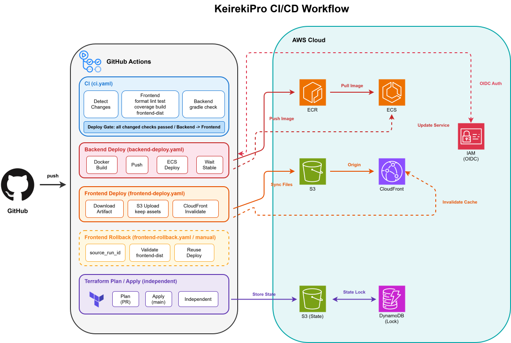

# KeirekiPro

エンジニア向け職務経歴書作成Webアプリケーション

## 概要

エンジニアが職務経歴書を効率的に作成・管理するためのWebアプリケーションです。
プロジェクトごとの技術スタックや実績を詳細に記録し、職務経歴書のプレビュー確認、PDF／Markdown形式での出力、バックアップ／リストアができます。

**URL**: https://app.keirekipro.click

## アーキテクチャ

### 本番環境構成


| レイヤー | サービス | 用途 |
|---------|---------|------|
| CDN/WAF | CloudFront, WAF | コンテンツ配信、DDoS対策、SQLインジェクション対策 |
| フロントエンド | S3 | React SPAホスティング |
| ロードバランサー | ALB | HTTPS終端、リクエスト振り分け |
| コンピューティング | ECS Fargate | バックエンドAPIコンテナ実行 |
| データベース | RDS PostgreSQL | データ永続化 |
| キャッシュ | ElastiCache for Valkey | 2FAコード・パスワードリセットトークン・OIDCセッション等の一時保存 |
| ストレージ | S3 | プロフィール画像等の保存 |
| メール | SES | メール認証、パスワードリセット、各種通知 |
| DNS/証明書 | Route 53, ACM | ドメイン管理、SSL/TLS証明書 |
| シークレット管理 | Secrets Manager | 認証情報の安全な管理 |
| 監視 | CloudWatch | ログ収集、メトリクス監視 |

### 開発環境構成

Docker Composeで7コンテナを起動し、DevContainerで開発を行います。


| コンテナ | 用途 |
|---------|------|
| backend (Spring Boot) | バックエンドAPI開発 |
| frontend (React) | フロントエンド開発 |
| terraform | IaC開発 |
| db (PostgreSQL) | データベース |
| redis | キャッシュ |
| localstack | AWS サービスエミュレーション（S3, Secrets Manager, SES） |
| dind | Testcontainers用Docker-in-Docker |

### CI/CDパイプライン



GitHub ActionsとAWS OIDCを組み合わせた、セキュアで効率的なCI/CDパイプラインを構築しています。

| フェーズ | ワークフロー | トリガー | 処理内容 |
|---------|-------------|---------|---------|
| CI | ci.yaml | push / PR | paths-filterで変更検知、Frontend: Format → Lint → Test → Coverage → Build、E2Eスモーク(Playwright)、Backend: Gradle check(カバレッジ閾値込み) |
| ガードレール | guardrails.yaml | PR | 逃げ道封鎖(skip/除外/型抑止の検知)、PRサイズ検査、migrationラベル、gitleaks、品質レポート(knip/jscpd/Javaアサーション) |
| 依存ゲート | dependency-gate.yaml | PR / review | 依存パッケージ「追加」の検知(所有者Approveで緑に再評価) |
| クロスAIレビュー | codex-review.yml | PR | Codexによる自動レビュー(コード品質・spec適合の2軸VERDICT。required check) |
| Infrastructure | terraform-plan.yaml | PR (terraform/**) | Terraform Plan実行、PRにplan結果をコメント |
| Infrastructure | terraform-apply.yaml | push to main (terraform/**) | Terraform Apply実行（アプリケーションデプロイとは独立） |
| **本番リリース** | **release.yaml** | **manual (workflow_dispatch)** | 人間の手動トリガーでのみ本番デプロイ(backend → frontendの順)。mainマージ ≠ 本番反映 |
| Frontend Rollback | frontend-rollback.yaml | manual | 成功済みmain CI runの`frontend-dist`を検証して再配布 |
| Claude | claude.yml | @claudeメンション / 週次 | Issue/PRからのCI上での作業、週次依存バージョン更新レーン |
| Mutation Report | mutation-report.yaml | 週次 | Stryker(frontend)/PIT(backend)のmutation testingレポート |
| Canary | canary.yaml | 月次 | ゲート健康診断用カナリアPRを3種自動生成 |

mainへのマージは「デプロイ可能な状態の確定」であり、本番反映はrelease.yamlの手動トリガーでのみ行います。frontend/backendの両方をリリースする場合はbackend、frontendの順にデプロイし、backendのデプロイに失敗した場合はfrontendを公開しません。frontendの公開失敗時は成功済みartifactを再配布して復旧します。

| 特徴 | 説明 |
|------|------|
| OIDC認証 | GitHub ActionsからAWSへのアクセスキーレス認証 |
| 変更検知 | paths-filterによる変更ファイルに応じた条件付き実行 |
| デプロイゲート | 変更対象のCIがすべて成功するまで本番デプロイを開始しない |
| Build once / Deploy same artifact | Frontendのproduction buildをCIで行い、検証済みartifactを配布・rollbackに再利用 |
| ローリングアップデート | ECSサービスの無停止デプロイと回路ブレーカーによるbackend自動rollback |
| キャッシュ無効化 | フロントエンド配布・rollback時のCloudFrontキャッシュ自動無効化 |
| State管理 | Terraform StateのS3保存とDynamoDBによるロック制御 |

### セキュリティ対策

- CloudFront → ALB間のオリジン検証（カスタムヘッダー）
- WAFによるAWSマネージドルール適用（SQLi、XSS、悪意あるBot対策）
- プライベートサブネットへのバックエンド配置
- Secrets Managerによる認証情報の一元管理
- HTTPS強制、HttpOnly/Secure Cookie設定
- CSRF対策（トークンベース）
- 認証トークンのサーバー側失効制御

## 技術スタック

### フロントエンド

| カテゴリ | 技術 |
|---------|------|
| 言語 | TypeScript |
| フレームワーク | React 19 |
| ビルドツール | Vite |
| パッケージマネージャー | pnpm |
| 状態管理 | Zustand, TanStack Query |
| UIライブラリ | MUI (Material-UI) |
| ルーティング | React Router v8 |
| テスト | Vitest, Testing Library |
| カバレッジ | Vitest Coverage V8 |
| リンター | ESLint |
| フォーマッター | Prettier, prettier-plugin-organize-imports |
| コード生成 | Hygen |
| アナリティクス | Google Analytics 4 |

### バックエンド

| カテゴリ | 技術 |
|---------|------|
| 言語 | Java 21 |
| フレームワーク | Spring Boot 3.4 |
| データアクセス | MyBatis |
| マイグレーション | Flyway |
| 認証 | Spring Security, JWT (java-jwt) |
| PDF生成 | OpenHTMLtoPDF |
| テンプレートエンジン | Thymeleaf, FreeMarker |
| AWS連携 | Spring Cloud AWS (S3, SES, Secrets Manager) |
| API仕様 | Springdoc OpenAPI (Swagger UI) |
| 監視/トレーシング | Spring Boot Actuator, Micrometer, OpenTelemetry |
| テスト | JUnit 5, Mockito, AssertJ, Testcontainers |
| アーキテクチャテスト | ArchUnit |
| カバレッジ | JaCoCo |
| ビルドツール | Gradle |
| 静的解析 | Checkstyle, SpotBugs |
| フォーマッター | Spotless, Eclipse Formatter |

### インフラ/DevOps

| カテゴリ | 技術 |
|---------|------|
| クラウド | AWS |
| IaC | Terraform |
| CI/CD | GitHub Actions |
| コンテナ | Docker, ECR, ECS Fargate |
| 監視 | CloudWatch Logs |
| 静的解析 | tflint, Checkov |

## 設計

### バックエンド: オニオンアーキテクチャ + DDD + CQRS

ドメイン駆動設計に基づき、関心の分離を徹底した多層構造を採用しています。

```
backend/src/main/java/com/example/keirekipro/
├── domain/           # ドメイン層
│   ├── model/        #   エンティティ、値オブジェクト、集約
│   ├── repository/   #   リポジトリインターフェース
│   ├── service/      #   ドメインサービス
│   ├── policy/       #   ドメインポリシー
│   ├── event/        #   ドメインイベント
│   └── shared/       #   基底クラス、共通例外
├── usecase/          # ユースケース層
│   ├── auth/         #   認証関連ユースケース
│   ├── resume/       #   職務経歴書関連ユースケース
│   ├── user/         #   ユーザー関連ユースケース
│   ├── query/        #   参照系クエリ（CQRS）
│   └── shared/       #   共通インターフェース
├── infrastructure/   # インフラ層
│   ├── repository/   #   リポジトリ実装（MyBatis）
│   ├── query/        #   クエリ実装（CQRS）
│   ├── auth/         #   OIDC連携
│   ├── event/        #   ドメインイベントリスナー
│   ├── export/       #   PDF/Markdown出力
│   ├── logging/      #   ユースケースロギング
│   ├── store/        #   Redisストア実装
│   └── shared/       #   AWS連携、Redis設定、通知
├── presentation/     # プレゼンテーション層
│   ├── */controller/ #   RESTコントローラー
│   ├── */dto/        #   リクエスト/レスポンスDTO
│   ├── security/     #   認証フィルター、JWT
│   └── shared/       #   例外ハンドラー、バリデーター
└── shared/           # アプリケーション共通
    ├── config/       #   設定クラス
    ├── exception/    #   基底例外
    └── utils/        #   ユーティリティ
```

### フロントエンド: Bulletproof React

機能ベースのモジュール設計を採用し、関心の分離とスケーラビリティを確保しています。

```
frontend/src/
├── features/              # 機能モジュール
│   ├── auth/              #   認証
│   ├── resume/            #   職務経歴書
│   ├── user/              #   ユーザー設定
│   └── contact/           #   お問い合わせ
│       （各featureは以下のサブディレクトリを持つ）
│         ├── api/         #     API通信
│         ├── components/  #     コンポーネント
│         ├── hooks/       #     カスタムフック
│         ├── stores/      #     状態管理
│         ├── types/       #     型定義
│         └── utils/       #     ユーティリティ
├── components/            # 共通コンポーネント
│   ├── ui/                #   ボタン、テキストフィールド等
│   ├── dnd/               #   ドラッグ&ドロップ
│   ├── layouts/           #   レイアウト
│   └── errors/            #   エラー表示
├── config/                # 設定（環境変数、テーマ、パス定義）
├── hooks/                 # 共通フック
├── stores/                # グローバルストア
├── lib/                   # クライアント設定
├── pages/                 # ページコンポーネント
├── routes/                # ルーティング定義
├── providers/             # プロバイダー
├── types/                 # 共通型定義
└── utils/                 # ユーティリティ
```

## 規模

| 項目 | 数量 |
|------|------|
| APIエンドポイント | 48 |
| データベーステーブル | 17 |

## ディレクトリ構成

```
keirekipro/
├── frontend/                 # フロントエンド (React/TypeScript)
├── backend/                  # バックエンド (Spring Boot/Java)
│   └── gradle/quality.gradle #   品質ゲート定義(CODEOWNERS保護)
├── terraform/                # インフラ定義
├── .github/                  # CI/CD・ガードレール(CODEOWNERS保護)
│   ├── workflows/            #   ci / guardrails / dependency-gate / codex-review /
│   │                         #   release / claude / mutation-report / canary / deploy系
│   ├── scripts/              #   検知スクリプト群
│   └── CODEOWNERS            #   ゲート設定ファイルの保護定義
├── .claude/                  # Claude Codeハーネス(skills / hooks / loop.md)
├── .kiro/                    # spec駆動開発(specs=仕様書, steering=プロジェクト知識)
├── docker/                   # Docker設定
├── doc/                      # 設計ドキュメント・開発フロー・監査手順
├── CLAUDE.md                 # AIエージェント向けプロジェクトガイド
├── REVIEW.md                 # /code-review のカスタマイズ
└── compose.yaml
```

## 自律開発パイプライン(AI駆動開発)

本プロジェクトの開発は **Claude Code** を基盤とした「人間はコードを読まない」前提の自律パイプラインで行います。
安全は人間のコードレビューではなく、多層の機械ゲートとクロスAIレビューが担保します。
詳細は [開発フロー](doc/開発フロー/開発フロー.md) / [ループ契約](doc/開発フロー/ループ契約.md) / [監査手順](doc/開発フロー/監査手順.md) を参照してください。

### 人間の役割(5つだけ)

1. **意図の定義** — Issue起票(1〜2行)とspec承認(仕様の意思決定。コードは読まない)
2. **ループの設計・監視・改善** — 週次・月次監査でゲートとループの健全性を確認し、すり抜けをゲート強化へ還元
3. **体験検証** — 本番デプロイ前にローカルでmainを起動して触って確認
4. **例外ゲートの承認** — DBマイグレーション・依存追加・ゲート設定変更を含むPRのみ承認
5. **リリース判断** — 本番デプロイの手動トリガー(マージには関与しない)

マージ判定は機械的: **Codexレビュー(コード品質・spec適合)両軸LGTM + 必須チェック全グリーン → auto-merge**

### 3つの開発レーン

| レーン | 対象 | フロー |
|-------|------|-------|
| **Lane A** | 新機能・複数層の変更 | Issue → spec駆動(cc-sdd: `/kiro-discovery`→requirements→design→tasks を人間が承認)→ `/kiro-impl`+`/goal` 自律実装 → `/ship` → クロスAIレビュー → auto-merge |
| **Lane B** | 小修正(コード差分200行以内) | Issue → 直接実装 → `/ship` → 同上(200行超はCIがLane Aへ差し戻し) |
| **Lane C** | 自律メンテ | `/loop`(定期verify・PR監視)、`@claude`メンション、週次依存更新、週次mutationレポート、月次カナリア |

### ガードレール(「読まない」を成立させる多層防御)

| 層 | 内容 |
|---|------|
| テスト+閾値 | Vitest/JUnit+Testcontainers、カバレッジ閾値(下回るとCI赤) |
| 静的解析 | ESLint(アーキテクチャ境界+アサーション必須)、tsc、ArchUnit 18ルール、Checkstyle/SpotBugs、tflint/checkov |
| 逃げ道封鎖 | テストskip・アサーション削除・`@ts-ignore`・インラインdisable・ゲート配線破壊をCIが検知して赤 |
| 人間ゲート | DBマイグレーション/依存追加/ゲート設定変更のみ人間承認必須(CODEOWNERS + dependency-gate) |
| クロスAIレビュー | **Claudeが書き、Codexが読む**。2軸VERDICTをジョブ自身が判定(コメント偽装無効)。最大5往復の修正ループ、収束しなければ人間へエスカレーション(spec差し戻し/分割/破棄の3択) |
| ゲート自体の保護 | CODEOWNERSで設定ファイルを保護し、エージェントは別アイデンティティ(bot)でPRを作成 |
| リリース分離 | mainマージ ≠ 本番反映。デプロイは人間の手動トリガーのみ |
| 健康診断 | 月次カナリアPR(既知バグ・アサーション無しテスト・skip)でゲートの検出能力を検証 |

### MCP

| MCP | 用途 |
|-----|------|
| Context7 MCP | ライブラリ・フレームワーク公式ドキュメントの参照 |
| Playwright MCP | `/verify-ui` でのブラウザ実機検証(スクリーンショット・コンソール確認) |

GitHub操作はMCPではなく `gh` CLI(botプロファイル)で行います。

### Claude Code Skills

| Skill | 用途 |
|------|------|
| `/verify-frontend` `/verify-backend` `/verify-terraform` `/verify-all` | 品質ゲートの直列実行(ゴールハック禁止則付き)。ループの検証端点 |
| `/verify-ui` | devサーバ起動+Playwright MCPでの実画面検証 |
| `/ship` | verify → commit → push → PR作成 → auto-merge予約 → CI監視 |
| `/review-loop` | Codex指摘の分類(本修正/妥当nit/誤検知)と修正ループ(最大5往復) |
| `/retrospective` | ゲートすり抜けの「ゲート追加・強化」への還元 |
| `/kiro-*` | spec駆動開発(cc-sdd): discovery / requirements / design / tasks / impl 等 |
